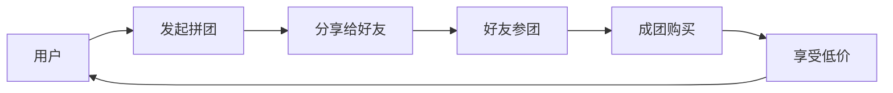

# 拼多多 - 下沉市场之王

## 概述

拼多多是中国第三大电商平台，通过社交电商模式快速崛起，成为下沉市场之王。本文分析拼多多的创新模式、增长逻辑和投资价值。

**学习目标**：
- 理解拼多多的社交电商模式
- 分析拼多多的下沉市场策略
- 评估拼多多的增长潜力和盈利能力
- 掌握创新商业模式的投资逻辑
- 学习快速增长企业的特征

**为什么重要**：
拼多多用 5 年时间成为中国第三大电商，是商业模式创新的典范。理解拼多多可以学习如何识别和投资高成长企业。

## 公司概况

**基本信息**：
- 公司全称：拼多多集团
- 股票代码：PDD（纳斯达克）
- 成立时间：2015 年
- 上市时间：2018 年
- 总部位置：上海
- 主营业务：社交电商平台

**市值规模**（2023）：
- 总市值：约 1500-2000 亿美元
- 中国电商第二（超越阿里）
- 全球电商前五

## 商业模式分析

### 核心模式

**社交电商模式**：

**模式特点**：
- 拼团购买：多人成团享低价
- 社交裂变：微信分享传播
- C2M 模式：工厂直连消费者
- 游戏化：签到、砍价、种树

### 下沉市场策略

**目标用户**：
- 三四线城市
- 农村市场
- 价格敏感用户
- 中老年用户

**策略要点**：
- 极致性价比
- 简单易用
- 社交传播
- 娱乐化

### C2M 模式

**工厂直连消费者**：
- 去除中间环节
- 降低成本
- 按需生产
- 提升效率

**C2M 优势**：
- 价格更低
- 品质可控
- 库存优化
- 供应链效率

## 竞争地位分析

### 市场份额

**电商市场**：
- GMV 市占率：约 20%
- 行业第三（接近第二）
- 份额快速提升

**用户规模**：
- 年活跃用户：8 亿+
- 月活跃用户：7 亿+
- 用户增长快

### 与阿里、京东的对比

| 维度 | 拼多多 | 阿里 | 京东 |
|------|--------|------|------|
| GMV | 3 万亿+ | 8 万亿+ | 3 万亿+ |
| 市占率 | 20% | 45% | 20% |
| 用户数 | 8 亿+ | 10 亿+ | 5 亿+ |
| 客单价 | 低 | 中高 | 中高 |
| 目标市场 | 下沉市场 | 全市场 | 中高端 |
| 毛利率 | 60% | 40% | 15% |
| 净利率 | 15% | 15% | 2% |

### 竞争优势

**1. 社交裂变**：
- 微信生态
- 社交传播
- 获客成本低
- 增长快

**2. 下沉市场**：
- 深耕下沉市场
- 用户粘性高
- 竞争对手少
- 增长空间大

**3. 性价比**：
- 价格极低
- 吸引力强
- 用户忠诚度高

**4. 创新能力**：
- 模式创新
- 产品创新
- 营销创新
- 快速迭代

### 竞争劣势

**1. 品牌形象**：
- 低价形象
- 品质质疑
- 假货问题

**2. 客单价低**：
- 变现能力受限
- 盈利压力大

**3. 依赖微信**：
- 流量依赖
- 政策风险

## 财务分析

### 盈利能力

**营收规模**：
- 2023 年营收：约 2500 亿元
- 近 5 年 CAGR：约 80%
- 高速增长

**利润水平**：
- 2023 年净利润：约 400 亿元
- 净利率：约 15%
- 盈利能力强

**盈利能力指标**：
| 指标 | 拼多多 | 阿里 | 京东 |
|------|--------|------|------|
| 毛利率 | 60% | 40% | 15% |
| 净利率 | 15% | 15% | 2% |
| ROE | 30% | 20% | 10% |
| ROIC | 25% | 15% | 8% |

### 现金流

**经营现金流**：
- 经营现金流充沛
- 自由现金流稳定
- 资本开支低

## 投资价值分析

### 投资逻辑

**核心逻辑**：
1. **下沉市场空间大**
2. **社交电商模式创新**
3. **高增长高盈利**
4. **国际化潜力（Temu）**

### 增长驱动

**短期**：用户增长、GMV 增长
**中期**：品类扩张、品质升级
**长期**：国际化、生态价值

### 估值水平

**历史 PS 区间**：3-15 倍
**合理 PS**：5-8 倍
**当前 PS**（2023）：约 4 倍
**估值评估**：合理

## 投资风险

**主要风险**：
1. 竞争加剧风险
2. 监管风险
3. 品牌形象风险
4. 增长放缓风险
5. 国际化风险

## 投资策略建议

### 买入时机

**好的买入时机**：
- 估值回落时（PS < 4）
- 增长超预期时
- 国际化进展顺利时

### 持有策略

**持有周期**：3-5 年
**仓位建议**：10-15%（电商板块内）

## 延伸阅读

### 推荐书籍

1. **《拼多多传》**
   - 拼多多发展史

2. **《社交电商》**
   - 社交电商理论

3. **《下沉市场》**
   - 下沉市场研究

### 研究报告

- 中金公司：拼多多深度报告
- 招商证券：电商行业研究
- 国泰君安：拼多多投资价值分析

## 参考文献

1. 拼多多集团年报. 2018-2023
2. 中金公司. 《拼多多深度报告》. 2023
3. 招商证券. 《电商行业研究》. 2023
4. 国泰君安. 《拼多多投资价值分析》. 2022
5. 艾瑞咨询. 《中国电商行业报告》. 2023
6. 麦肯锡. 《中国零售市场研究》. 2023
7. 拼多多投资者交流会纪要. 2018-2023
8. 高瓴资本. 《电商投资方法论》. 2021
9. 贝恩公司. 《中国电商报告》. 2023
10. 尼尔森. 《中国消费者信心指数》. 2023

---

**关键启示**：
- 拼多多是商业模式创新的典范
- 下沉市场空间巨大
- 高增长高盈利
- 国际化值得期待

**下一步学习**：
- 研究社交电商理论
- 分析下沉市场特征
- 学习快速增长企业
- 研究国际化战略

## 深度分析

### 核心机制解析

理解本主题需要从多个维度进行系统性分析。以下从理论基础、实践应用和历史验证三个层面展开深度探讨。

**理论基础层面**：本主题的核心逻辑建立在经济学和金融学的基本原理之上。通过对基础理论的深入理解，投资者能够建立起稳固的分析框架，避免被市场短期噪音所干扰。

**实践应用层面**：理论必须与实践相结合才能产生价值。在实际投资决策中，需要将抽象的概念转化为具体的分析工具和决策标准。

**历史验证层面**：金融市场有着丰富的历史记录，通过研究历史案例，我们可以验证理论的有效性，并从中提炼出具有普遍意义的规律。

### 关键影响因素

影响本主题的关键因素可以从以下几个维度进行分析：

1. **宏观经济环境**：利率水平、通货膨胀率、经济增长速度等宏观变量对本主题有着深远影响。在不同的宏观经济周期中，相关指标的表现会呈现出显著差异。

2. **市场结构因素**：市场参与者的构成、信息传播机制、流动性状况等市场结构因素决定了价格发现的效率和准确性。

3. **政策监管环境**：政府政策、监管框架的变化会直接影响相关市场的运作规则和参与者行为。

4. **技术创新驱动**：技术进步不断改变着金融市场的运作方式，从算法交易到区块链技术，每一次技术革新都带来新的机遇和挑战。

5. **全球化与地缘政治**：在全球化背景下，各国市场之间的联动性日益增强，地缘政治风险的影响也越来越不可忽视。

### 量化分析框架

为了更精确地分析和评估，可以采用以下量化框架：

| 分析维度 | 关键指标 | 参考基准 | 分析方法 |
|---------|---------|---------|---------|
| 规模评估 | 绝对值与相对值 | 历史均值 | 趋势分析 |
| 质量评估 | 稳定性指标 | 行业对标 | 横向比较 |
| 风险评估 | 波动率指标 | 风险阈值 | 情景分析 |
| 价值评估 | 估值倍数 | 历史区间 | 回归分析 |

通过系统性地应用上述框架，投资者可以对目标进行全面、客观的评估，从而做出更加理性的投资决策。

## 高级分析与前沿研究

### 学术研究进展

近年来，学术界对本领域的研究取得了重要进展。以下是几个值得关注的研究方向：

**行为金融学视角**：传统金融理论假设市场参与者是完全理性的，但行为金融学的研究表明，认知偏差和情绪因素在投资决策中扮演着重要角色。诺贝尔经济学奖得主丹尼尔·卡尼曼（Daniel Kahneman）和理查德·塞勒（Richard Thaler）的研究为我们理解市场非理性行为提供了重要框架。

**因子投资研究**：尤金·法玛（Eugene Fama）和肯尼斯·弗伦奇（Kenneth French）的三因子模型，以及后续发展的五因子模型，为系统性地解释股票收益差异提供了理论基础。这些研究表明，市值、账面市值比、盈利能力和投资模式等因子能够解释大部分股票收益的横截面差异。

**市场微观结构研究**：对市场流动性、价格发现机制和交易成本的深入研究，帮助我们更好地理解市场的运作机制，并为优化交易策略提供指导。

### 实战案例深度解析

**案例一：长期价值创造的典范**

以沃伦·巴菲特（Warren Buffett）的伯克希尔·哈撒韦（Berkshire Hathaway）为例，其长达数十年的卓越投资业绩证明了价值投资理念的有效性。从1965年至今，伯克希尔的账面价值年均增长率约为19.8%，远超同期标普500指数的约10.2%年均回报。

巴菲特的成功秘诀在于：
- 专注于具有持久竞争优势的优质企业
- 以合理价格买入，而非追求最低价格
- 长期持有，让复利效应充分发挥
- 保持充足的安全边际，控制下行风险

**案例二：危机中的机遇识别**

2008年金融危机期间，大多数投资者恐慌性抛售，但少数具有前瞻性的投资者却在危机中发现了历史性的投资机会。约翰·保尔森（John Paulson）通过做空次级抵押贷款相关证券，在危机中获得了约150亿美元的利润，成为金融史上最成功的单笔交易之一。

这个案例告诉我们：
- 深入的基本面研究能够发现市场定价错误
- 逆向思维往往能够发现被市场忽视的机会
- 风险管理和仓位控制是成功的关键

### 跨市场比较分析

不同市场在结构、监管、投资者构成等方面存在显著差异，这些差异对投资策略的选择有重要影响：

**美国市场特征**：
- 机构投资者主导，市场效率较高
- 信息披露制度完善，分析师覆盖广泛
- 衍生品市场发达，对冲工具丰富
- 长期牛市历史，但也经历过多次重大调整

**中国市场特征**：
- 散户投资者比例较高，市场波动性较大
- 政策因素影响显著，需要密切关注监管动向
- 新兴行业发展迅速，成长投资机会丰富
- A股、港股、美股中概股形成多层次市场体系

**欧洲市场特征**：
- 价值股比例较高，估值相对保守
- 受地缘政治和欧元区政策影响较大
- 部分行业（如奢侈品、工业）具有全球竞争优势
- ESG投资理念推广较为领先

## 实用工具与操作指南

### 分析工具推荐

**数据获取工具**：
- **Bloomberg Terminal**：专业级金融数据平台，提供实时行情、历史数据、新闻资讯等全方位服务，是机构投资者的首选工具
- **Wind资讯（万得）**：中国最权威的金融数据平台，覆盖A股、债券、基金等全市场数据
- **FactSet**：提供全球股票、固定收益、另类投资等多资产类别的综合数据服务
- **免费替代方案**：Yahoo Finance、Google Finance、东方财富、同花顺等提供基础数据服务

**分析软件工具**：
- **Excel/Python**：用于财务模型构建、数据分析和可视化
- **Tableau/Power BI**：用于数据可视化和仪表板创建
- **R语言**：适合统计分析和量化研究

### 实操步骤指南

**第一步：信息收集**
1. 获取目标公司/资产的基本信息和历史数据
2. 收集行业报告和竞争对手数据
3. 整理宏观经济背景信息
4. 查阅相关学术研究和专业分析报告

**第二步：定量分析**
1. 建立财务模型，计算关键指标
2. 进行历史趋势分析
3. 与同行业公司进行横向比较
4. 构建估值模型，计算合理价值区间

**第三步：定性分析**
1. 评估竞争优势和护城河
2. 分析管理层质量和公司治理
3. 识别主要风险因素
4. 评估行业发展趋势

**第四步：综合判断**
1. 整合定量和定性分析结果
2. 进行情景分析（乐观/基准/悲观）
3. 确定投资论点和关键假设
4. 制定投资决策和风险管理方案

### 常见错误与规避方法

| 常见错误 | 产生原因 | 规避方法 |
|---------|---------|---------|
| 过度依赖历史数据 | 忽视结构性变化 | 结合前瞻性分析 |
| 锚定效应 | 过度依赖初始信息 | 定期重新评估假设 |
| 确认偏误 | 只寻找支持观点的证据 | 主动寻找反驳证据 |
| 过度自信 | 高估自身分析能力 | 保持谦逊，设置安全边际 |
| 忽视流动性风险 | 只关注收益不关注风险 | 全面评估风险因素 |

