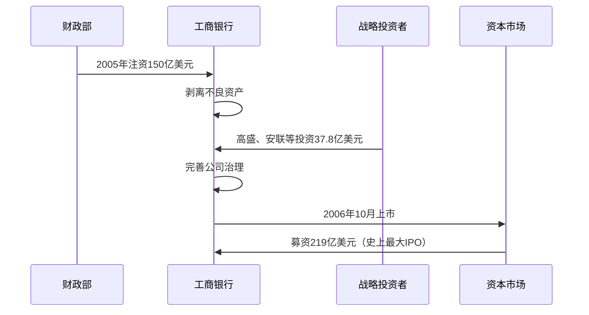
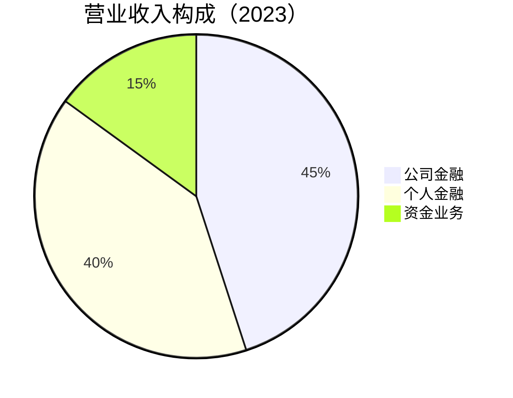

# 工商银行深度研究

## 公司概况

中国工商银行（ICBC，股票代码：601398.SH / 01398.HK）成立于 1984 年，是中国最大的商业银行，也是全球市值最大的银行之一。工商银行被誉为"宇宙第一大行"，在中国银行业占据举足轻重的地位。

**基本信息**：
- 成立时间：1984 年 1 月 1 日
- 总部位置：北京市西城区
- 上市时间：2006 年 10 月（H 股）、2006 年 10 月（A 股）
- 主营业务：公司金融、个人金融、资金业务
- 市值规模：约 2 万亿人民币（2023）
- 员工人数：约 43 万人

**核心数据（2023）**：
- 总资产：40.6 万亿元
- 贷款总额：23.5 万亿元
- 存款总额：31.8 万亿元
- 营业收入：9,300 亿元
- 净利润：3,650 亿元
- ROE：11.5%
- 不良率：1.38%


## 发展历程

### 1. 成立与早期发展（1984-1994）

**专业银行时期**：
- 1984 年：从中国人民银行分离，承接工商信贷和储蓄业务
- 主要服务城市工商企业
- 计划经济体制下的政策性业务为主
- 积累了大量不良资产

### 2. 商业化转型（1995-2003）

**向商业银行转型**：
- 1995 年：《商业银行法》实施，开始商业化改革
- 剥离政策性业务
- 不良资产问题严重，不良率超过 20%
- 技术性破产状态

### 3. 股改上市（2004-2006）

**脱胎换骨的改革**：


**改革成果**：
- 不良率从 19% 降至 2.7%
- 资本充足率达到 13.2%
- 引入现代银行管理制度
- 成功实现 A+H 股同步上市

### 4. 快速发展（2007-2015）

**黄金发展期**：
- 资产规模快速扩张，成为全球最大银行
- 盈利能力持续提升，净利润突破 3000 亿
- 国际化步伐加快，海外机构布局
- 金融创新活跃，业务多元化

### 5. 高质量发展（2016-至今）

**转型升级阶段**：
- 资产规模稳健增长
- 零售转型加速推进
- 金融科技深度应用
- 绿色金融、普惠金融发力
- 国际化程度进一步提升

## 商业模式分析

### 1. 业务结构

**三大业务板块**：



**公司金融业务**：
- 大型企业客户为主
- 基础设施、能源、制造业等重点行业
- 贸易融资、项目融资、并购融资
- 投资银行业务

**个人金融业务**：
- 个人存贷款
- 银行卡业务
- 财富管理
- 私人银行
- 消费金融

**资金业务**：
- 货币市场交易
- 债券投资
- 外汇交易
- 衍生品业务

### 2. 收入结构

**利息净收入（75%）**：
- 贷款利息收入
- 投资利息收入
- 存放同业利息收入
- 减：存款利息支出、同业负债利息支出

**非利息收入（25%）**：
- 手续费及佣金收入（18%）
  - 银行卡业务
  - 代理业务
  - 托管及其他受托业务
  - 结算与清算业务
- 投资收益（5%）
- 其他收入（2%）

### 3. 资产负债结构

**资产端**：
- 贷款：58%
- 投资：30%
- 存放央行及同业：10%
- 其他：2%

**负债端**：
- 客户存款：78%
- 同业负债：15%
- 应付债券：5%
- 其他：2%

## 竞争优势分析

### 1. 规模优势

**全球最大的银行**：
- 总资产 40.6 万亿元，全球第一
- 客户存款 31.8 万亿元，全球第一
- 贷款总额 23.5 万亿元，全球第一
- 市值长期位居全球银行前列

**规模带来的优势**：
- 资金成本低：存款来源稳定，议价能力强
- 风险分散：客户和行业分布广泛
- 协同效应：交叉销售机会多
- 品牌影响力：知名度和信任度高

### 2. 网点覆盖优势

**最广泛的网点布局**：
- 境内机构：16,000+ 家
- 覆盖全国所有省市自治区
- 县域网点覆盖率高
- 境外机构：400+ 家，遍布 49 个国家和地区

**网点优势**：
- 获客能力强
- 服务便利性高
- 品牌渗透深
- 存款基础稳固

### 3. 客户基础优势

**庞大的客户群体**：
- 个人客户：7.2 亿户
- 公司客户：1,100 万户
- 其中大型企业客户占比高
- 客户粘性强，流失率低

**客户优势**：
- 交叉销售机会多
- 客户终身价值高
- 存款来源稳定
- 中间业务收入潜力大

### 4. 品牌优势

**"宇宙第一大行"品牌**：
- 品牌价值全球银行业第一
- 客户信任度高
- 政府和企业首选银行
- 国际认可度高

**品牌带来的优势**：
- 获客成本低
- 存款成本低
- 业务拓展容易
- 人才吸引力强

### 5. 综合金融优势

**全牌照金融集团**：
- 工银租赁：全球最大金融租赁公司
- 工银国际：香港投行业务
- 工银安盛人寿：保险业务
- 工银瑞信基金：基金管理
- 工银金融资产投资：债转股业务

**综合金融优势**：
- 一站式金融服务
- 协同效应显著
- 收入来源多元
- 风险分散

## 财务分析

### 1. 盈利能力分析

**营业收入增长**：
- 2018 年：8,000 亿元
- 2020 年：8,800 亿元
- 2023 年：9,300 亿元
- 年均增长率：约 5%

**净利润增长**：
- 2018 年：2,987 亿元
- 2020 年：3,159 亿元
- 2023 年：3,650 亿元
- 年均增长率：约 7%

**盈利能力指标**：
| 指标 | 2021 | 2022 | 2023 | 行业平均 |
|------|------|------|------|---------|
| ROE | 11.2% | 11.3% | 11.5% | 11.0% |
| ROA | 0.95% | 0.97% | 0.98% | 0.90% |
| 净息差 | 2.08% | 2.05% | 2.02% | 2.00% |
| 成本收入比 | 27.5% | 27.2% | 26.8% | 29.0% |

**盈利能力评价**：
- ROE 稳定在 11% 以上，行业领先
- ROA 接近 1%，优于行业平均
- 净息差保持稳定，略有下降
- 成本控制能力强，成本收入比低于行业平均

### 2. 资产质量分析

**不良贷款情况**：
| 指标 | 2021 | 2022 | 2023 |
|------|------|------|------|
| 不良率 | 1.42% | 1.38% | 1.38% |
| 拨备覆盖率 | 198% | 205% | 208% |
| 关注类贷款占比 | 2.35% | 2.28% | 2.20% |

**资产质量评价**：
- 不良率控制在 1.4% 左右，行业优秀水平
- 拨备覆盖率超过 200%，风险抵御能力强
- 关注类贷款占比下降，资产质量改善
- 不良认定严格，逾期 90 天以上贷款全部纳入不良

**行业分布**：
- 制造业：25%
- 房地产：10%
- 批发零售：12%
- 基础设施：15%
- 其他：38%

### 3. 资本充足率分析

**资本充足率指标**：
| 指标 | 2021 | 2022 | 2023 | 监管要求 |
|------|------|------|------|---------|
| 资本充足率 | 17.2% | 17.5% | 17.8% | ≥11.5% |
| 核心一级资本充足率 | 13.5% | 13.8% | 14.1% | ≥8.5% |
| 一级资本充足率 | 14.8% | 15.1% | 15.4% | ≥9.5% |

**资本充足率评价**：
- 各项资本充足率指标远超监管要求
- 资本内生能力强，利润留存充足
- 资本补充渠道畅通
- 支持业务持续增长

### 4. 流动性分析

**流动性指标**：
| 指标 | 2023 | 监管要求 |
|------|------|---------|
| 流动性覆盖率 | 135% | ≥100% |
| 净稳定资金比例 | 125% | ≥100% |
| 存贷比 | 74% | - |

**流动性评价**：
- 流动性指标远超监管要求
- 存款基础稳固，流动性充裕
- 流动性风险管理能力强

## 竞争地位分析

### 1. 市场份额

**国内市场份额**：
- 总资产市场份额：约 11%
- 贷款市场份额：约 12%
- 存款市场份额：约 12%
- 稳居国内银行业第一

**全球排名**：
- 总资产：全球第一
- 市值：全球银行业前三
- 品牌价值：全球银行业第一
- 一级资本：全球第一

### 2. 与主要竞争对手对比

**与建设银行对比**：
| 指标 | 工商银行 | 建设银行 |
|------|---------|---------|
| 总资产 | 40.6万亿 | 35.5万亿 |
| 净利润 | 3,650亿 | 3,380亿 |
| ROE | 11.5% | 11.8% |
| 不良率 | 1.38% | 1.38% |
| PB | 0.55倍 | 0.60倍 |

**与招商银行对比**：
| 指标 | 工商银行 | 招商银行 |
|------|---------|---------|
| 总资产 | 40.6万亿 | 10.0万亿 |
| 净利润 | 3,650亿 | 1,380亿 |
| ROE | 11.5% | 15.2% |
| 不良率 | 1.38% | 0.96% |
| PB | 0.55倍 | 1.10倍 |

**竞争地位评价**：
- 规模优势明显，稳居第一
- 盈利能力稳健，但不如招商银行
- 资产质量优秀，与建行相当
- 估值最低，安全边际高

## 战略发展方向

### 1. 零售转型战略

**零售业务发展目标**：
- 提升零售业务占比
- 打造"第一个人金融银行"
- 数字化转型，提升客户体验
- 财富管理业务做大做强

**具体措施**：
- 加大零售信贷投放
- 发展消费金融、信用卡业务
- 提升私人银行服务
- 推进智能网点建设

### 2. 金融科技战略

**科技投入**：
- 年度科技投入超过 200 亿元
- 科技人员占比超过 10%
- 建设七大创新实验室

**科技应用**：
- 手机银行：用户超过 5 亿
- 智能风控：大数据、AI 应用
- 开放银行：API 开放，场景嵌入
- 区块链：供应链金融、跨境支付

### 3. 国际化战略

**国际化布局**：
- 境外机构 400+ 家
- 覆盖 49 个国家和地区
- "一带一路"重点布局
- 跨境金融服务能力提升

**国际化成果**：
- 境外资产占比约 10%
- 境外利润贡献约 8%
- 国际业务收入稳步增长

### 4. 绿色金融战略

**绿色金融发展**：
- 绿色信贷余额超过 3 万亿元
- 绿色债券承销规模领先
- 碳金融业务创新
- ESG 投资理念融入

## 投资分析

### 1. 投资亮点

**稳定的盈利能力**：
- 净利润 3,650 亿元，全球银行业第一
- ROE 稳定在 11% 以上
- 盈利增速稳健，年均 5-7%

**优秀的资产质量**：
- 不良率 1.38%，行业优秀水平
- 拨备覆盖率 208%，风险抵御能力强
- 资产质量持续改善

**高分红回报**：
- 分红率约 30%
- 股息率约 5-6%
- 分红稳定，持续增长

**低估值优势**：
- PB 约 0.55 倍，历史低位
- PE 约 4.5 倍，极低估值
- 安全边际高

### 2. 投资风险

**经济下行风险**：
- 经济增速放缓影响信贷需求
- 不良率可能上升
- 盈利增速放缓

**房地产风险**：
- 房地产贷款占比约 10%
- 房企违约风险
- 抵押物价值下降

**利率市场化风险**：
- 净息差收窄压力
- 存款竞争加剧
- 盈利能力下降

**监管政策风险**：
- 资本监管趋严
- 业务限制增加
- 合规成本上升

### 3. 估值分析

**PB 估值法**：
```
合理 PB = ROE × (1 - 分红率) / (折现率 - 增长率)
= 11.5% × (1 - 30%) / (10% - 5%)
= 1.61 倍

当前 PB = 0.55 倍
估值修复空间 = 1.61 / 0.55 = 2.9 倍
```

**PE 估值法**：
- 当前 PE：4.5 倍
- 历史平均 PE：6 倍
- 合理 PE：5-7 倍
- 估值修复空间：10-55%

**股息贴现模型**：
```
股价 = 股息 / (折现率 - 增长率)
= 0.30 / (10% - 5%)
= 6.0 元

当前股价：约 5.0 元
上涨空间：20%
```

### 4. 投资建议

**长期价值投资**：
- 适合长期持有，获取稳定分红
- 估值低，安全边际高
- 经济复苏时估值修复
- 建议配置比例：10-20%

**买入时机**：
- 经济低迷期，市场悲观时
- PB 跌破 0.5 倍时
- 股息率超过 6% 时

**持有策略**：
- 长期持有，不频繁交易
- 定期收取分红
- 估值修复后可适当减仓

## 关键学习点

### 1. 规模优势的价值

工商银行的案例说明：
- 规模带来成本优势
- 规模带来风险分散
- 规模带来品牌影响力
- 但规模不等于高成长

### 2. 低估值的投资机会

工商银行长期低估值的原因：
- 成长性一般
- 市场担心资产质量
- 国有银行治理问题
- 但提供了高安全边际和高分红

### 3. 银行股的投资逻辑

工商银行的投资价值：
- 稳定的盈利能力
- 优秀的资产质量
- 高分红回报
- 低估值提供安全边际
- 适合长期价值投资

### 4. 周期性的把握

银行股的周期性：
- 经济上行：盈利改善，估值修复
- 经济下行：资产质量担忧，估值压制
- 把握周期，低买高卖

## 延伸阅读

### 推荐资料

1. **工商银行年报** - 最权威的信息来源
2. **工商银行投资者关系网站** - 业绩说明会、投资者交流
3. **券商研究报告** - 中金、中信、招商等
4. **《大而不倒》** - 理解银行业风险
5. **《银行管理学》** - 银行经营管理

### 相关案例

- 建设银行：规模相当的竞争对手
- 招商银行：零售转型标杆
- 摩根大通：全球银行业标杆

## 参考文献

1. 工商银行. 《2023 年年度报告》. 2024
2. 工商银行. 《2023 年社会责任报告》. 2024
3. 中金公司. 《工商银行深度报告》. 2023
4. 招商证券. 《工商银行投资价值分析》. 2023
5. 中信证券. 《银行业年度策略》. 2023
6. 银保监会. 《中国银行业监管统计数据》. 2023
7. 麦肯锡. 《中国银行业转型报告》. 2023
8. 波士顿咨询. 《全球银行业报告》. 2023
9. 《财经》杂志. 《工商银行专题报道》. 2023
10. 《21 世纪经济报道》. 《银行业深度分析》. 2023

---

**投资总结**：
工商银行是全球最大的银行，具有规模、网点、客户、品牌等多重优势。虽然成长性一般，但盈利稳定、资产质量优秀、分红率高、估值低，是典型的价值投资标的。适合长期持有，获取稳定的分红回报和估值修复收益。
