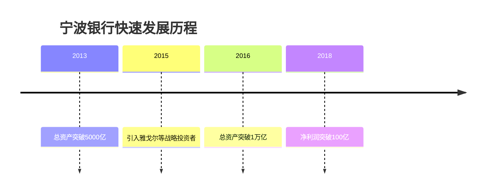
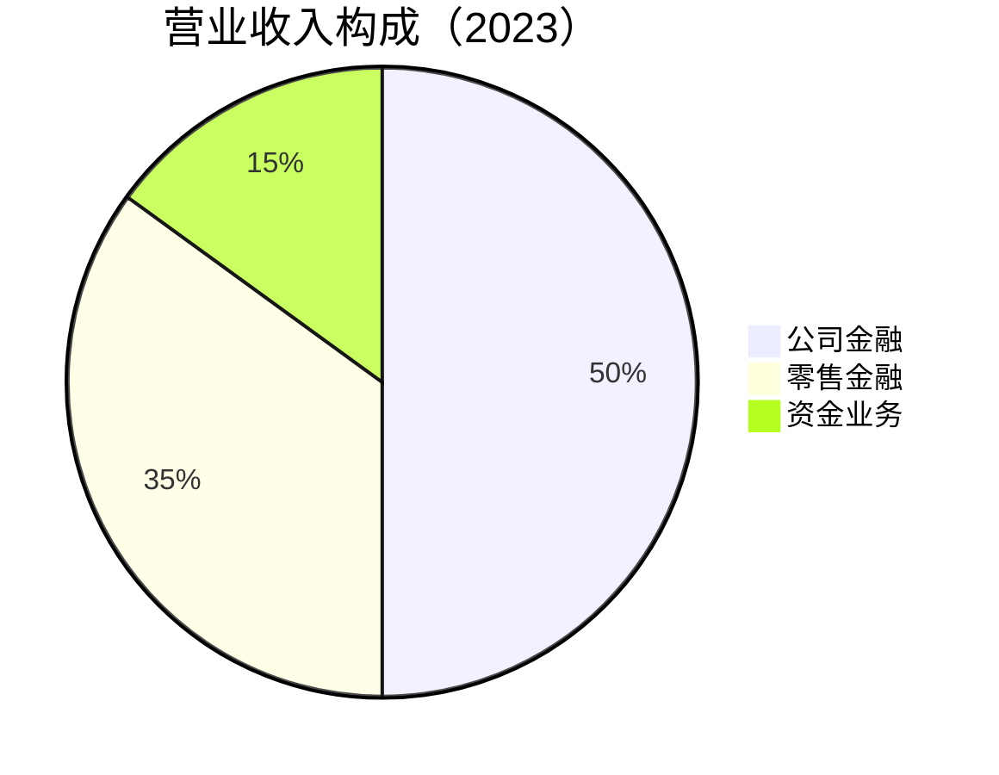
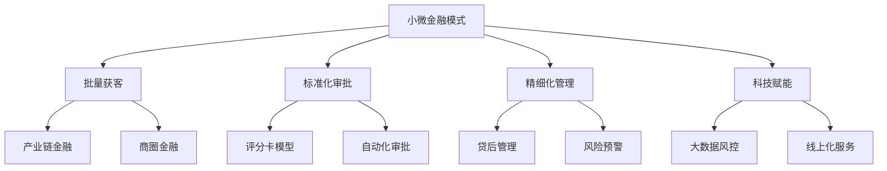

# 宁波银行 - 城商行标杆

## 概述

宁波银行是中国城商行的标杆企业，以小微金融和风险管理见长。本文深入分析宁波银行的商业模式、竞争优势和投资价值。

**学习目标**：
- 理解宁波银行的差异化经营策略
- 分析宁波银行的小微金融优势
- 评估宁波银行的风险管理能力
- 掌握城商行的投资逻辑
- 学习区域性银行的成功之道

**为什么重要**：
宁波银行是城商行中的佼佼者，通过差异化经营和精细化管理实现了快速发展。理解宁波银行可以学习如何在竞争激烈的市场中脱颖而出。

## 公司概况

**基本信息**：
- 公司全称：宁波银行股份有限公司
- 股票代码：002142.SZ
- 成立时间：1997 年 4 月 10 日
- 总部位置：浙江省宁波市
- 上市时间：2007 年 7 月（A 股）
- 主营业务：公司金融、零售金融、资金业务

**市值规模**（2023）：
- 总市值：约 2500 亿元
- A 股城商行市值第一
- A 股银行业市值前十

**核心数据**（2023）：
- 总资产：2.2 万亿元
- 贷款总额：1.3 万亿元
- 存款总额：1.6 万亿元
- 营业收入：580 亿元
- 净利润：220 亿元
- ROE：14.5%
- 不良率：0.75%

## 发展历程

### 1. 创立与起步（1997-2006）

**城市信用社改制**：
- 1997 年：由宁波市 10 家城市信用社合并组建
- 注册资本 1.2 亿元
- 立足宁波，服务地方经济
- 小微企业和个体工商户为主要客户

**早期特点**：
- 规模小，但机制灵活
- 贴近市场，服务意识强
- 风险管理严格
- 稳健经营

### 2. 上市与扩张（2007-2012）

**资本市场助力**：
- 2007 年：A 股上市，募资 28 亿元
- 引入新加坡华侨银行为战略投资者
- 开始跨区域发展
- 网点扩张，业务多元化

**发展特点**：
- 资产规模快速增长
- 跨区域布局加速
- 小微金融特色鲜明
- 风险控制严格

### 3. 快速发展（2013-2018）

**黄金发展期**：


**发展成果**：
- 资产规模年均增长 20%+
- 盈利能力持续提升
- 资产质量保持优秀
- 市值快速增长

### 4. 高质量发展（2019-至今）

**转型升级阶段**：
- 2019 年：提出"高质量发展"战略
- 2020 年：数字化转型加速
- 2021 年：总资产突破 2 万亿
- 2023 年：净利润突破 200 亿

**战略升级**：
- 从规模增长到质量提升
- 从传统银行到数字银行
- 从区域银行到全国性银行
- 从小微金融到综合金融

## 商业模式分析

### 1. 业务结构

**公司业务主导**：


**公司金融业务**：
- 小微企业贷款
- 供应链金融
- 贸易融资
- 投资银行

**零售金融业务**：
- 个人存贷款
- 信用卡业务
- 财富管理
- 消费金融

**资金业务**：
- 货币市场交易
- 债券投资
- 同业业务

### 2. 小微金融特色

**小微金融优势**：
- 小微贷款余额：4000 亿元
- 小微客户数：30 万户
- 小微贷款占比：30%+
- 小微不良率：< 1%

**小微金融模式**：


**小微金融优势**：
- 深耕浙江，了解当地企业
- 批量获客，降低成本
- 标准化审批，提高效率
- 精细化管理，控制风险

### 3. 区域布局

**网点布局**：
- 总行：宁波
- 分行：30+ 个城市
- 支行：300+ 家
- 重点区域：长三角、珠三角、京津冀

**区域特点**：
- 浙江省内：深耕细作
- 长三角：重点布局
- 全国：选择性进入
- 经济发达地区为主

### 4. 收入结构

**利息净收入 vs 非利息收入**：
| 年份 | 利息净收入 | 非利息收入 | 非息占比 |
|------|-----------|-----------|---------|
| 2021 | 380亿 | 150亿 | 28.3% |
| 2022 | 420亿 | 160亿 | 27.6% |
| 2023 | 450亿 | 130亿 | 22.4% |

**非利息收入构成**：
- 手续费及佣金收入：100 亿元（77%）
  - 银行卡：30 亿元
  - 代理业务：40 亿元
  - 其他：30 亿元
- 投资收益：25 亿元（19%）
- 其他：5 亿元（4%）

## 竞争优势分析

### 1. 小微金融优势

**小微金融领先地位**：
- 小微贷款余额城商行第一
- 小微客户数城商行第一
- 小微不良率行业最低
- 小微金融品牌影响力强

**小微金融能力**：
- 批量获客能力
- 风险识别能力
- 精细化管理能力
- 科技赋能能力

### 2. 风险管理优势

**卓越的资产质量**：
- 不良率 0.75%，行业最优
- 拨备覆盖率 500%+，极强风险抵御能力
- 关注类贷款占比 < 1%
- 逾期贷款占比 < 1.5%

**风险管理能力**：
- 严格的准入标准
- 完善的风控体系
- 精细的贷后管理
- 前瞻的风险预警

**风险管理文化**：
- 风险意识强
- 合规文化浓
- 稳健经营
- 长期主义

### 3. 区域优势

**深耕浙江**：
- 浙江省内网点最多
- 浙江省内市场份额高
- 了解当地企业和市场
- 品牌影响力强

**浙江优势**：
- 经济发达，民营经济活跃
- 小微企业众多
- 金融需求旺盛
- 信用环境好

### 4. 管理优势

**优秀的管理团队**：
- 管理层稳定
- 战略清晰
- 执行力强
- 激励机制完善

**管理文化**：
- 稳健经营
- 风险为先
- 客户至上
- 创新进取

### 5. 股东优势

**优质股东背景**：
- 华侨银行（新加坡）：19.9%
- 雅戈尔：10%+
- 宁波市国资委
- 其他战略投资者

**股东优势**：
- 引入先进管理经验
- 资本支持
- 业务协同
- 品牌背书

## 财务分析

### 1. 盈利能力分析

**营业收入增长**：
- 2018 年：350 亿元
- 2020 年：420 亿元
- 2023 年：580 亿元
- 年均增长率：约 18%

**净利润增长**：
- 2018 年：110 亿元
- 2020 年：145 亿元
- 2023 年：220 亿元
- 年均增长率：约 19%

**盈利能力指标**：
| 指标 | 2021 | 2022 | 2023 | 招商银行 |
|------|------|------|------|---------|
| ROE | 13.8% | 14.2% | 14.5% | 15.2% |
| ROA | 1.15% | 1.20% | 1.25% | 1.42% |
| 净息差 | 2.15% | 2.12% | 2.10% | 2.42% |
| 成本收入比 | 32.5% | 32.0% | 31.5% | 28.8% |

**盈利能力评价**：
- ROE 14%+，城商行领先
- ROA 1.2%+，优于行业平均
- 净息差保持稳定
- 成本收入比控制良好

### 2. 资产质量分析

**不良贷款情况**：
| 指标 | 2021 | 2022 | 2023 | 招商银行 |
|------|------|------|------|---------|
| 不良率 | 0.77% | 0.75% | 0.75% | 0.96% |
| 拨备覆盖率 | 520% | 515% | 508% | 418% |
| 关注类贷款占比 | 0.85% | 0.82% | 0.80% | 1.18% |

**资产质量评价**：
- 不良率 0.75%，行业最优
- 拨备覆盖率 508%，风险抵御能力极强
- 关注类贷款占比极低
- 资产质量持续优秀

**贷款结构**：
- 公司贷款：65%
- 零售贷款：35%
- 小微贷款：30%
- 小微不良率：< 1%

### 3. 资本充足率分析

**资本充足率指标**：
| 指标 | 2021 | 2022 | 2023 | 监管要求 |
|------|------|------|------|---------|
| 资本充足率 | 14.8% | 15.2% | 15.5% | ≥10.5% |
| 核心一级资本充足率 | 9.5% | 9.8% | 10.2% | ≥7.5% |
| 一级资本充足率 | 11.2% | 11.5% | 11.8% | ≥8.5% |

**资本充足率评价**：
- 各项指标超过监管要求
- 资本内生能力强
- 支持业务持续增长
- 资本补充渠道畅通

### 4. 成长性分析

**资产规模增长**：
- 2018 年：1.1 万亿
- 2020 年：1.5 万亿
- 2023 年：2.2 万亿
- 年均增长率：约 15%

**盈利增长**：
- 净利润年均增长率：19%
- ROE 保持 14%+
- 成长性优于大型银行
- 成长性优于多数股份制银行

## 战略发展方向

### 1. 小微金融深化

**战略目标**：
- 打造"小微金融专家银行"
- 小微贷款余额突破 5000 亿
- 小微客户数突破 50 万

**实施路径**：
- 深耕浙江市场
- 拓展长三角市场
- 科技赋能小微
- 产品创新

### 2. 数字化转型

**数字化目标**：
- 打造"数字化银行"
- 线上业务占比 80%+
- 科技投入占比 3%+

**数字化举措**：
- 手机银行优化
- 大数据风控
- AI 应用
- 开放银行

### 3. 区域扩张

**扩张策略**：
- 深耕长三角
- 布局珠三角
- 进入京津冀
- 选择性全国布局

**扩张原则**：
- 经济发达地区
- 民营经济活跃
- 小微企业众多
- 风险可控

### 4. 综合金融

**综合金融布局**：
- 永赢基金：基金管理
- 宁银理财：理财子公司
- 宁银金融租赁：租赁业务
- 其他牌照申请

## 投资价值分析

### 1. 投资亮点

**优秀的盈利能力**：
- ROE 14%+，城商行领先
- 净利润增速 15-20%
- 盈利质量高

**卓越的资产质量**：
- 不良率 0.75%，行业最优
- 拨备覆盖率 508%，极强风险抵御能力
- 小微贷款不良率低

**强劲的成长性**：
- 资产规模年均增长 15%+
- 净利润年均增长 19%
- 小微金融持续增长
- 区域扩张空间大

**合理的估值**：
- PB 约 0.9 倍
- PE 约 6 倍
- 股息率约 4%
- 估值合理偏低

### 2. 增长驱动因素

**小微金融增长**：
- 小微贷款持续增长
- 小微客户数增长
- 小微金融品牌力提升

**区域扩张**：
- 长三角深耕
- 珠三角布局
- 全国选择性进入

**数字化转型**：
- 获客成本降低
- 运营效率提升
- 风控能力增强

### 3. 估值分析

**PB 估值法**：
```
合理 PB = ROE × (1 - 分红率) / (折现率 - 增长率)
= 14.5% × (1 - 30%) / (12% - 10%)
= 5.1 倍

当前 PB = 0.9 倍
估值修复空间 = 5.1 / 0.9 = 5.7 倍
```

**PE 估值法**：
- 当前 PE：6 倍
- 历史平均 PE：8 倍
- 合理 PE：7-10 倍
- 估值修复空间：17-67%

**相对估值**：
- 宁波银行 PB：0.9 倍
- 招商银行 PB：1.1 倍
- 折价率：18%
- 折价合理性：规模小，流动性差

### 4. 投资风险

**区域集中风险**：
- 浙江省内业务占比高
- 区域经济波动影响大

**小微贷款风险**：
- 小微企业抗风险能力弱
- 经济下行时不良率可能上升

**竞争加剧风险**：
- 大型银行下沉
- 其他城商行竞争
- 互联网金融竞争

**扩张风险**：
- 跨区域经营风险
- 管理半径扩大
- 风控难度增加

## 投资策略建议

### 买入时机

**好的买入时机**：
- 市场恐慌时
- PB 跌破 0.8 倍时
- 经济低迷期
- 行业调整时

### 持有策略

**长期持有**：
- 持有周期：3-5 年
- 仓位建议：10-15%（银行板块内）
- 定期再平衡

**持有理由**：
- 优秀的商业模式
- 强劲的成长性
- 卓越的资产质量
- 合理的估值

### 卖出时机

**考虑卖出**：
- PB 超过 1.5 倍
- 资产质量恶化
- 基本面恶化
- 更好机会出现

## 关键学习点

### 1. 差异化经营的价值

宁波银行的成功说明：
- 差异化经营可以建立竞争优势
- 小微金融是正确的战略选择
- 专注和深耕是成功的关键

### 2. 风险管理的重要性

宁波银行的风控能力：
- 严格的风险管理是核心竞争力
- 资产质量是银行的生命线
- 稳健经营是长期发展的基础

### 3. 区域银行的成长路径

宁波银行的成长经验：
- 深耕本地市场
- 建立竞争优势
- 逐步跨区域扩张
- 保持风险可控

### 4. 城商行的投资价值

宁波银行的投资启示：
- 优秀城商行值得投资
- 成长性是核心价值
- 资产质量是关键
- 估值合理提供安全边际

## 延伸阅读

### 推荐书籍

1. **《小微金融》**
   - 小微金融理论与实践

2. **《区域银行经营管理》**
   - 区域银行发展策略

3. **《银行风险管理》**
   - 银行风险管理实务

### 研究报告

- 中金公司：宁波银行深度报告
- 招商证券：宁波银行投资价值分析
- 国泰君安：城商行研究

## 参考文献

1. 宁波银行. 《2023 年年度报告》. 2024
2. 宁波银行. 《2023 年社会责任报告》. 2024
3. 中金公司. 《宁波银行深度报告》. 2023
4. 招商证券. 《宁波银行投资价值分析》. 2023
5. 中信证券. 《城商行研究》. 2023
6. 银保监会. 《中国银行业监管统计数据》. 2023
7. 麦肯锡. 《小微金融报告》. 2023
8. 波士顿咨询. 《区域银行报告》. 2023
9. 《财经》杂志. 《宁波银行专题报道》. 2023
10. 《21 世纪经济报道》. 《城商行深度分析》. 2023

---

**投资总结**：
宁波银行是城商行的标杆企业，小微金融的专家。具有优秀的盈利能力、卓越的资产质量、强劲的成长性和合理的估值。是银行板块的优质标的，适合长期持有。

**下一步学习**：
- 研究招商银行的零售转型
- 分析工商银行的规模优势
- 学习小微金融经营管理
- 研究区域银行发展策略
