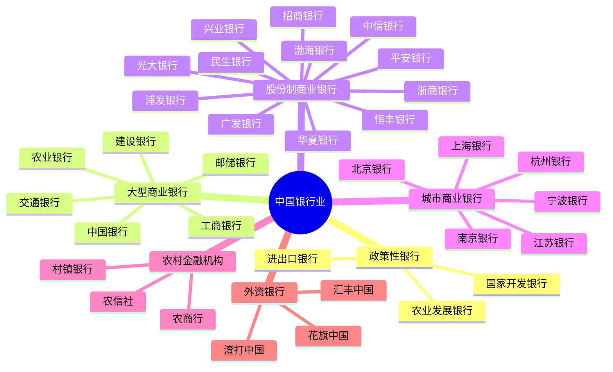
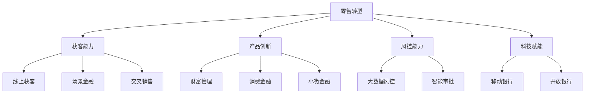

# 中国银行业深度分析

## 概述

中国银行业是全球最大的银行体系之一，总资产超过 380 万亿元人民币。经过四十多年的改革开放，中国银行业从技术性破产走向全球领先，成为支撑经济发展的重要支柱。本文深入分析中国银行业的发展历程、竞争格局、商业模式和投资价值。

**学习目标**：
- 理解中国银行业的发展历程和改革成果
- 掌握不同类型银行的特点和竞争优势
- 分析银行业的盈利模式和风险因素
- 评估银行股的投资价值和选股标准
- 建立银行业投资的分析框架

**为什么重要**：
银行业是中国金融体系的核心，占金融业总资产的 90% 以上。工商银行、建设银行等中国银行已跻身全球银行前列。理解中国银行业对于把握宏观经济、信贷周期和投资机会至关重要。

## 中国银行业发展历程

### 1. 改革开放前（1949-1978）

**大一统时期**：
- 中国人民银行集中央银行和商业银行职能于一身
- 计划经济体制下的财政拨款制
- 银行作为国家出纳，不具备独立性

### 2. 改革初期（1979-1994）

**专业银行时期**：
- 1979 年：恢复农业银行、中国银行、建设银行
- 1984 年：工商银行成立，人民银行专司中央银行职能
- 1987 年：交通银行重新组建
- 形成"四大专业银行"格局

### 3. 商业化改革（1995-2003）

**向商业银行转型**：
- 1995 年：《商业银行法》颁布
- 剥离政策性业务，成立政策性银行
- 股份制银行快速发展
- 不良资产问题严重，技术性破产

### 4. 股改上市（2004-2010）

**脱胎换骨的改革**：


**改革成果**：
- 2005-2010 年：四大行陆续上市
- 不良率从 20%+ 降至 1% 左右
- 资本充足率大幅提升
- 公司治理显著改善

### 5. 快速发展（2011-2015）

**黄金发展期**：
- 资产规模快速扩张
- 盈利能力持续提升
- 国际化步伐加快
- 金融创新活跃

### 6. 转型调整（2016-至今）

**高质量发展阶段**：
- 金融去杠杆，增速放缓
- 零售转型成为主旋律
- 金融科技深度应用
- 严监管常态化

## 中国银行业结构

### 1. 银行分类体系



### 2. 市场份额分布

**按资产规模（2023）**：
- 大型商业银行：约 40%
- 股份制商业银行：约 18%
- 城市商业银行：约 13%
- 农村金融机构：约 12%
- 其他：约 17%

**集中度特征**：
- CR5（前五大银行）：约 38%
- CR10（前十大银行）：约 50%
- 集中度相对较高，但仍有竞争空间

## 不同类型银行特点

### 1. 大型国有商业银行

**核心优势**：
- 网点覆盖广：遍布全国城乡
- 客户基础大：个人和企业客户众多
- 资金成本低：存款来源稳定
- 政策支持强：承担部分政策性业务

**业务特点**：
- 对公业务为主，零售占比提升
- 大型企业客户为主
- 利率敏感度高
- 风险偏好相对保守

**代表银行**：
- 工商银行：宇宙第一大行
- 建设银行：基建融资优势
- 农业银行：县域网点最多
- 中国银行：国际化程度最高
- 交通银行：综合化经营
- 邮储银行：零售存款优势

**投资特点**：
- 估值低，PB 通常 0.5-0.8 倍
- 分红稳定，股息率 4-6%
- 成长性一般，但稳健
- 适合长期价值投资

### 2. 股份制商业银行

**核心优势**：
- 机制灵活：市场化程度高
- 创新能力强：产品和服务创新活跃
- 零售业务强：多数银行零售转型领先
- 管理效率高：激励机制完善

**业务特点**：
- 零售业务占比高
- 中小企业客户为主
- 中间业务收入占比高
- 风险偏好相对积极

**代表银行**：
- 招商银行：零售之王，金融科技领先
- 兴业银行：同业业务强，绿色金融
- 浦发银行：对公业务强
- 平安银行：零售转型典范
- 中信银行：综合金融协同

**投资特点**：
- 估值相对较高，PB 0.6-1.2 倍
- 成长性较好
- 零售转型带来估值溢价
- 适合成长投资

### 3. 城市商业银行

**核心优势**：
- 区域深耕：本地客户关系深厚
- 决策灵活：决策链条短
- 特色经营：差异化竞争
- 成长空间大：异地扩张潜力

**业务特点**：
- 区域性特征明显
- 中小企业服务为主
- 零售业务快速发展
- 同业业务占比较高

**代表银行**：
- 宁波银行：零售业务强，资产质量优
- 北京银行：首都优势
- 上海银行：长三角布局
- 江苏银行：省内网点密集
- 南京银行：投行业务特色

**投资特点**：
- 估值分化，优质城商行 PB 1-1.5 倍
- 成长性好，ROE 较高
- 区域经济影响大
- 适合精选个股投资

## 银行业盈利模式

### 1. 收入结构

**利息净收入（70-80%）**：
```
利息净收入 = 生息资产 × 净息差（NIM）
净息差 = 生息资产收益率 - 计息负债成本率
```

**影响因素**：
- 资产规模增长
- 资产结构优化（零售贷款占比）
- 负债成本控制（存款占比）
- 市场利率环境

**非利息收入（20-30%）**：
- 手续费及佣金收入：
  - 银行卡业务
  - 代理业务
  - 理财业务
  - 投行业务
- 投资收益
- 其他收入

### 2. 成本结构

**业务及管理费（成本收入比 25-35%）**：
- 员工薪酬：最大成本项
- 折旧摊销
- 租赁及物业费用
- 营销费用
- IT 投入

**资产减值损失**：
- 贷款减值准备
- 其他资产减值
- 拨备覆盖率要求

### 3. 盈利能力指标

**ROE（净资产收益率）**：
- 大型银行：10-12%
- 股份制银行：11-15%
- 优质城商行：12-18%

**ROA（总资产收益率）**：
- 行业平均：0.8-1.0%
- 优秀银行：1.0-1.2%

**成本收入比**：
- 行业平均：28-32%
- 优秀银行：25% 以下

**净息差（NIM）**：
- 行业平均：1.8-2.2%
- 零售强的银行：2.2-2.5%

## 银行业关键指标

### 1. 资产质量指标

**不良贷款率**：
```
不良贷款率 = 不良贷款余额 / 贷款总额
```
- 行业平均：1.6-1.8%
- 优秀银行：1.0% 以下

**拨备覆盖率**：
```
拨备覆盖率 = 贷款损失准备 / 不良贷款余额
```
- 监管要求：≥ 150%
- 优秀银行：300% 以上

**关注类贷款占比**：
- 潜在不良贷款
- 行业平均：2-3%

**逾期 90 天以上贷款/不良贷款**：
- 衡量不良认定严格程度
- 理想状态：< 100%

### 2. 资本充足率指标

**资本充足率**：
```
资本充足率 = 资本净额 / 风险加权资产
```
- 监管要求：≥ 10.5%
- 系统重要性银行：≥ 11.5%

**核心一级资本充足率**：
- 监管要求：≥ 8.5%
- 最重要的资本指标

**杠杆率**：
```
杠杆率 = 一级资本 / 调整后表内外资产余额
```
- 监管要求：≥ 4%

### 3. 流动性指标

**流动性覆盖率（LCR）**：
- 监管要求：≥ 100%
- 衡量短期流动性风险

**净稳定资金比例（NSFR）**：
- 监管要求：≥ 100%
- 衡量中长期流动性风险

**存贷比**：
- 传统指标，已取消监管要求
- 仍是重要参考指标

## 银行业投资分析

### 1. 估值方法

**PB 估值法（主流方法）**：
```
合理 PB = ROE × (1 - 分红率) / (折现率 - 增长率)
```

**估值中枢**：
- 大型银行：0.5-0.8 倍 PB
- 股份制银行：0.6-1.0 倍 PB
- 优质城商行：0.8-1.5 倍 PB

**估值驱动因素**：
- ROE 水平
- 资产质量
- 成长性
- 分红率

**PE 估值法（辅助方法）**：
- 大型银行：5-7 倍 PE
- 股份制银行：6-8 倍 PE
- 优质城商行：7-10 倍 PE

### 2. 选股标准

**资产质量优先**：
- 不良率 < 1.5%
- 拨备覆盖率 > 200%
- 关注类贷款占比 < 2.5%
- 逾期 90 天以上贷款/不良贷款 < 100%

**盈利能力要求**：
- ROE > 12%
- ROA > 0.9%
- 净息差 > 2.0%
- 成本收入比 < 30%

**资本实力评估**：
- 核心一级资本充足率 > 9%
- 资本内生能力强
- 资本补充渠道畅通

**成长性考量**：
- 资产增速 > 行业平均
- 零售业务占比提升
- 中间业务收入增长
- 金融科技应用领先

### 3. 风险因素

**信用风险**：
- 房地产贷款风险
- 地方政府融资平台风险
- 中小企业贷款风险
- 行业集中度风险

**市场风险**：
- 利率风险：净息差收窄
- 汇率风险：外汇业务波动
- 股市风险：投资收益波动

**流动性风险**：
- 存款竞争加剧
- 同业负债依赖
- 资产负债期限错配

**操作风险**：
- 内控失效
- 员工违规
- 系统故障
- 外部欺诈

**政策风险**：
- 监管政策变化
- 资本监管趋严
- 业务限制增加

## 银行业发展趋势

### 1. 零售转型

**转型背景**：
- 对公业务竞争激烈
- 零售业务盈利能力强
- 风险分散需求
- 监管政策引导

**转型路径**：


**领先银行**：
- 招商银行：零售之王
- 平安银行：零售转型典范
- 宁波银行：城商行零售标杆

### 2. 金融科技

**应用领域**：
- 移动银行：APP 成为主要渠道
- 智能风控：大数据、AI 应用
- 智能投顾：财富管理数字化
- 开放银行：API 开放，场景嵌入
- 区块链：供应链金融、跨境支付

**科技投入**：
- 头部银行科技投入占营收 3-5%
- 金融科技人员占比提升
- 与科技公司合作加深

**竞争优势**：
- 提升运营效率
- 降低运营成本
- 改善客户体验
- 增强风控能力

### 3. 财富管理

**市场机遇**：
- 居民财富快速增长
- 资产配置需求上升
- 理财净值化转型
- 养老金融需求增加

**业务布局**：
- 私人银行业务
- 理财子公司
- 基金代销
- 保险代理
- 贵金属业务

**竞争格局**：
- 招商银行：私人银行领先
- 工商银行：客户基础大
- 中信银行：信托协同

### 4. 绿色金融

**政策推动**：
- 碳达峰、碳中和目标
- 绿色金融标准体系
- 监管考核要求

**业务发展**：
- 绿色信贷
- 绿色债券
- 碳金融
- ESG 投资

**领先银行**：
- 兴业银行：绿色金融先行者
- 工商银行：绿色信贷规模最大

### 5. 国际化

**国际化路径**：
- 跟随客户"走出去"
- 海外机构布局
- 跨境金融服务
- 国际业务合作

**领先银行**：
- 中国银行：国际化程度最高
- 工商银行：海外机构最多
- 建设银行："一带一路"布局

## 投资策略建议

### 1. 长期价值投资

**核心持仓**：
- 工商银行、建设银行：估值低，分红高
- 招商银行：零售龙头，成长性好
- 宁波银行：优质城商行

**投资理由**：
- 估值低，安全边际高
- 分红稳定，股息率 4-6%
- 长期持有，获取稳定回报
- 经济复苏时估值修复

### 2. 成长投资策略

**关注标的**：
- 平安银行：零售转型成效显著
- 宁波银行：高 ROE，高成长
- 江苏银行：区域经济强劲

**投资理由**：
- 零售转型带来成长
- ROE 持续提升
- 市场份额扩大
- 估值有提升空间

### 3. 周期轮动策略

**经济复苏期**：
- 加仓银行股
- 关注资产质量改善
- 重点配置大型银行

**经济下行期**：
- 减仓周期性银行
- 持有资产质量优秀的银行
- 关注政策支持方向

### 4. 分散配置策略

**类型分散**：
- 大型银行 50%
- 股份制银行 30%
- 城商行 20%

**个股分散**：
- 持有 3-5 只银行股
- 避免过度集中
- 降低个股风险

## 研究框架与工具

### 银行股研究清单

**宏观层面**：
- [ ] 经济增长趋势
- [ ] 货币政策方向
- [ ] 利率走势判断
- [ ] 信贷需求变化

**行业层面**：
- [ ] 行业景气度
- [ ] 竞争格局变化
- [ ] 监管政策影响
- [ ] 技术创新趋势

**公司层面**：
- [ ] 资产质量评估
- [ ] 盈利能力分析
- [ ] 资本充足率
- [ ] 零售转型进展
- [ ] 金融科技应用
- [ ] 管理层能力

**估值层面**：
- [ ] PB 估值水平
- [ ] 历史估值区间
- [ ] 同业估值对比
- [ ] 分红收益率

### 数据来源

**官方数据**：
- 中国人民银行：货币政策、金融统计
- 银保监会：银行业监管数据
- 国家统计局：宏观经济数据

**公司数据**：
- 年报、季报
- 业绩说明会
- 投资者交流
- 券商研究报告

**市场数据**：
- Wind、Choice 等金融终端
- 上市公司公告
- 银行业协会数据

## 常见误区

### 误区 1：只看估值低

**错误做法**：
- 认为 PB 低就是便宜
- 忽视资产质量
- 不考虑盈利能力

**正确做法**：
- 综合评估资产质量
- 关注盈利能力和成长性
- 低估值要有合理原因

### 误区 2：忽视资产质量

**错误做法**：
- 只看利润增长
- 忽视不良率变化
- 不关注拨备覆盖率

**正确做法**：
- 资产质量优先
- 关注不良生成率
- 评估拨备充足性

### 误区 3：过度关注短期业绩

**错误做法**：
- 追逐季度业绩
- 频繁交易
- 忽视长期价值

**正确做法**：
- 关注长期趋势
- 评估持续竞争力
- 长期持有优质银行

### 误区 4：忽视周期性

**错误做法**：
- 在经济高点重仓
- 不考虑经济周期
- 忽视风险积累

**正确做法**：
- 关注经济周期位置
- 在经济低点布局
- 在经济高点减仓

## 延伸阅读

### 推荐书籍

1. **《银行管理学》** - 彼得·罗斯
   - 银行经营管理经典教材

2. **《商业银行经营学》** - 戴国强
   - 中国银行业经营实践

3. **《银行家的成长》** - 招商银行研究
   - 招商银行零售转型经验

4. **《大而不倒》** - 安德鲁·罗斯·索尔金
   - 2008 金融危机启示

5. **《中国银行业改革开放史》** - 中国银行业协会
   - 中国银行业发展历程

### 研究报告

- 各大券商银行业年度策略报告
- 银保监会银行业运行报告
- 中国银行业协会年度报告
- 麦肯锡中国银行业报告

### 在线资源

- 银保监会官网
- 中国银行业协会
- 上市银行投资者关系平台
- 专业财经媒体

## 参考文献

1. 银保监会. 《中国银行业监管统计数据》. 2023
2. 中国银行业协会. 《中国银行业发展报告》. 2023
3. 中国人民银行. 《中国金融稳定报告》. 2023
4. 麦肯锡. 《中国银行业转型报告》. 2023
5. 波士顿咨询. 《中国零售银行报告》. 2023
6. 中金公司. 《银行业深度报告》. 2023
7. 招商证券. 《银行业专题研究》. 2023
8. 中信证券. 《银行业年度策略》. 2023
9. 国泰君安. 《银行业竞争格局分析》. 2023
10. 华泰证券. 《银行业资产质量研究》. 2023

---

**下一步学习**：
- 研究工商银行案例
- 分析招商银行零售转型
- 学习银行财务报表分析
- 了解银行风险管理
