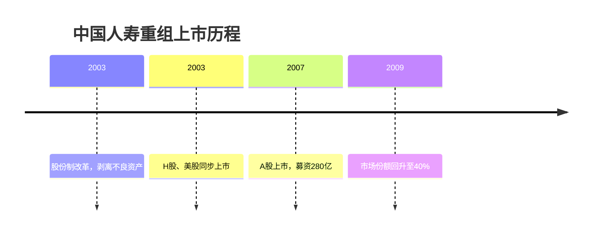
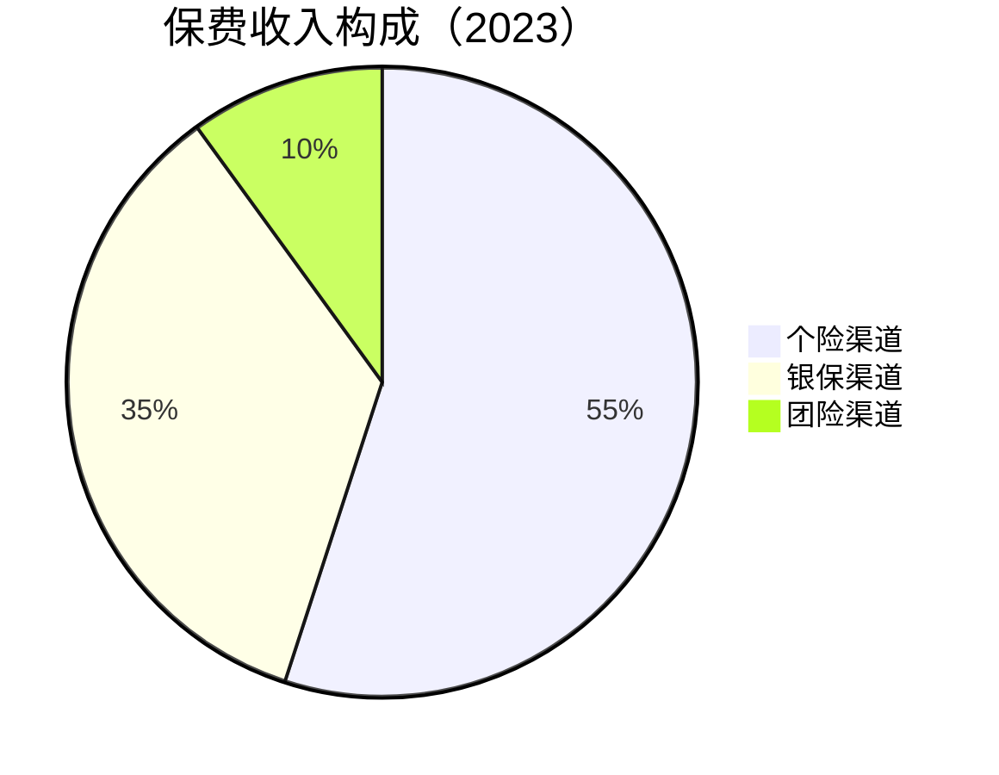
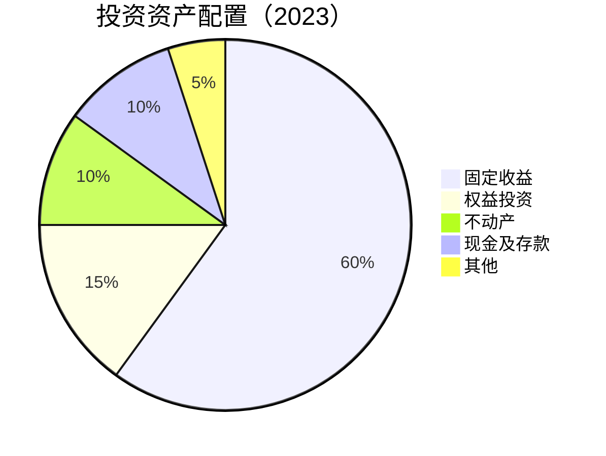

# 中国人寿 - 寿险行业龙头

## 概述

中国人寿是中国最大的寿险公司，市场份额第一，品牌影响力强。本文深入分析中国人寿的商业模式、竞争优势和投资价值。

**学习目标**：
- 理解中国人寿的市场地位和优势
- 分析寿险公司的商业模式和价值评估
- 评估中国人寿的内含价值增长潜力
- 掌握寿险股的投资逻辑
- 学习保险行业的分析方法

**为什么重要**：
中国人寿是中国保险业的龙头企业，理解中国人寿可以学习寿险公司的商业模式和价值创造机制，掌握保险股的投资方法。

## 公司概况

**基本信息**：
- 公司全称：中国人寿保险股份有限公司
- 股票代码：601628.SH / 02628.HK
- 成立时间：1949 年（前身）、2003 年（股份公司）
- 总部位置：北京市西城区
- 上市时间：2003 年（H 股、美股）、2007 年（A 股）
- 主营业务：人寿保险、健康保险、意外伤害保险

**市值规模**（2023）：
- 总市值：约 8000 亿元
- A 股保险业市值第一
- 全球寿险公司市值前十

**核心数据**（2023）：
- 总资产：5.5 万亿元
- 保费收入：6,800 亿元
- 净利润：600 亿元
- 内含价值：1.5 万亿元
- 新业务价值：450 亿元
- 投资资产：5.2 万亿元

## 发展历程

### 1. 国有独资时期（1949-2003）

**新中国保险业起源**：
- 1949 年：中国人民保险公司成立
- 1996 年：分设为中保人寿、中保财险
- 1999 年：更名为中国人寿保险公司
- 垄断地位，市场份额 100%

**早期特点**：
- 国有独资
- 政策性业务为主
- 网点覆盖全国
- 品牌影响力强

### 2. 股份制改革（2003-2010）

**重组上市**：


**改革成果**：
- 建立现代企业制度
- 引入国际会计准则
- 提升公司治理水平
- 市场化经营

### 3. 快速发展（2011-2015）

**规模扩张期**：
- 保费收入快速增长
- 市场份额保持第一
- 代理人队伍扩大
- 盈利能力提升

**发展特点**：
- 银保渠道快速发展
- 趸交业务占比高
- 投资收益波动大
- 价值率较低

### 4. 价值转型（2016-2020）

**战略转型期**：
- 2016 年：提出"重振国寿"战略
- 从规模导向转向价值导向
- 从趸交为主转向期交为主
- 从银保为主转向个险为主

**转型成果**：
- 新业务价值快速增长
- 价值率显著提升
- 代理人质量改善
- 内含价值稳步增长

### 5. 高质量发展（2021-至今）

**新发展阶段**：
- 2021 年：提出"鼎新工程"
- 数字化转型加速
- 产品结构优化
- 服务能力提升

**战略升级**：
- 从保险公司到综合金融服务集团
- 从传统经营到科技赋能
- 从国内市场到国际化布局

## 商业模式分析

### 1. 业务结构

**保费收入构成**：


**产品结构**：
- 传统寿险：40%
- 分红险：35%
- 万能险：15%
- 健康险：10%

**期交 vs 趸交**：
- 期交保费：70%
- 趸交保费：30%
- 期交占比持续提升

### 2. 寿险商业模式

**收入来源**：

**保费收入**：
- 首年保费：新签保单
- 续期保费：存量保单
- 续期保费占比 70%+

**投资收益**：
- 固定收益投资：债券、存款
- 权益投资：股票、基金
- 另类投资：不动产、股权
- 总投资收益率：4-5%

**利润来源（三差）**：
- 利差：投资收益 - 保单预定利率
- 死差：实际死亡率 - 预定死亡率
- 费差：实际费用 - 预定费用

### 3. 价值评估体系

**内含价值（EV）**：
```
内含价值 = 调整后净资产 + 有效业务价值
```

**新业务价值（NBV）**：
```
新业务价值 = 新业务保费 × 价值率
```

**价值率**：
```
价值率 = 新业务价值 / 新业务保费
```

**内含价值增长**：
```
EV增长 = 期初EV × (1 + 预期回报率) + NBV + 运营偏差 + 假设变动
```

### 4. 渠道体系

**个险渠道**：
- 代理人数量：100 万+
- 人均产能：提升中
- 留存率：改善中
- 贡献保费：55%

**银保渠道**：
- 合作银行：工农中建等
- 网点覆盖：全国
- 产品类型：储蓄替代型
- 贡献保费：35%

**团险渠道**：
- 企业客户
- 团体保险
- 贡献保费：10%

## 竞争优势分析

### 1. 市场份额优势

**市场领先地位**：
- 寿险市场份额：22%，行业第一
- 保费收入：6,800 亿元，行业第一
- 客户数量：3 亿+，行业第一
- 品牌价值：行业第一

**市场份额稳定**：
- 长期保持行业第一
- 份额波动小
- 竞争地位稳固

### 2. 品牌优势

**"中国人寿"品牌**：
- 品牌历史悠久（70+ 年）
- 品牌知名度最高
- 品牌信任度强
- 国有背景背书

**品牌价值**：
- 获客成本低
- 客户忠诚度高
- 产品溢价能力强
- 代理人招募容易

### 3. 渠道优势

**最广泛的渠道网络**：
- 分支机构：3,000+ 家
- 覆盖全国所有县市
- 代理人：100 万+
- 银保合作：全面覆盖

**渠道优势**：
- 触达能力强
- 服务便利性高
- 市场渗透深
- 续期保费稳定

### 4. 客户基础优势

**庞大的客户群体**：
- 有效保单：3 亿+
- 客户数量：行业第一
- 客户结构：覆盖全年龄段
- 客户粘性：强

**客户优势**：
- 交叉销售机会多
- 客户终身价值高
- 续期保费稳定
- 新业务开拓容易

### 5. 投资能力优势

**庞大的投资资产**：
- 投资资产：5.2 万亿元
- 行业第一
- 投资收益稳定
- 投资能力强

**投资优势**：
- 规模优势
- 资产配置能力
- 风险管理能力
- 长期投资优势

## 财务分析

### 1. 保费收入分析

**保费收入增长**：
- 2018 年：5,600 亿元
- 2020 年：6,100 亿元
- 2023 年：6,800 亿元
- 年均增长率：约 7%

**保费结构优化**：
| 指标 | 2020 | 2022 | 2023 |
|------|------|------|------|
| 首年保费占比 | 35% | 32% | 30% |
| 续期保费占比 | 65% | 68% | 70% |
| 期交占比 | 60% | 68% | 70% |
| 十年期及以上占比 | 40% | 50% | 55% |

### 2. 价值创造分析

**内含价值增长**：
- 2018 年：9,420 亿元
- 2020 年：11,800 亿元
- 2023 年：15,000 亿元
- 年均增长率：约 12%

**新业务价值**：
| 年份 | NBV（亿元） | 增长率 | 价值率 |
|------|------------|--------|--------|
| 2020 | 380 | - | 18% |
| 2021 | 410 | 8% | 20% |
| 2022 | 430 | 5% | 22% |
| 2023 | 450 | 5% | 24% |

**价值率提升**：
- 产品结构优化
- 期交占比提升
- 长期保障型产品增加
- 价值率从 18% 提升至 24%

### 3. 盈利能力分析

**净利润**：
- 2018 年：113 亿元（会计准则变更影响）
- 2020 年：500 亿元
- 2023 年：600 亿元
- 年均增长率：约 10%

**盈利能力指标**：
| 指标 | 2021 | 2022 | 2023 |
|------|------|------|------|
| ROE | 12.5% | 13.0% | 13.5% |
| 总投资收益率 | 4.8% | 4.5% | 4.7% |
| 净投资收益率 | 4.5% | 4.3% | 4.4% |
| 综合成本率 | - | - | - |

### 4. 投资资产分析

**投资资产配置**：


**投资收益**：
- 2023 年投资收益：2,400 亿元
- 总投资收益率：4.7%
- 净投资收益率：4.4%
- 投资收益稳定

### 5. 偿付能力分析

**偿付能力充足率**：
| 指标 | 2021 | 2022 | 2023 | 监管要求 |
|------|------|------|------|---------|
| 核心偿付能力充足率 | 220% | 225% | 230% | ≥50% |
| 综合偿付能力充足率 | 240% | 245% | 250% | ≥100% |
| 风险综合评级 | A | A | A | - |

**偿付能力评价**：
- 偿付能力充足
- 远超监管要求
- 风险管理能力强

## 战略发展方向

### 1. 价值转型战略

**战略目标**：
- 从规模导向到价值导向
- 提升新业务价值
- 提升价值率
- 提升内含价值增长率

**实施路径**：
- 优化产品结构
- 提升期交占比
- 发展长期保障型产品
- 提升代理人质量

### 2. 数字化转型战略

**数字化目标**：
- 打造"数字国寿"
- 线上化率 80%+
- 科技投入占比 3%+

**数字化举措**：
- 国寿 App 优化
- 大数据应用
- AI 智能核保
- 区块链应用

### 3. 渠道转型战略

**个险渠道改革**：
- 提质增效
- 提升人均产能
- 改善留存率
- 优化队伍结构

**银保渠道优化**：
- 深化银保合作
- 优化产品结构
- 提升价值率

### 4. 综合金融战略

**综合金融布局**：
- 人寿保险：核心业务
- 财产保险：国寿财险
- 资产管理：国寿资产
- 养老保险：国寿养老
- 健康保险：国寿健康

## 投资价值分析

### 1. 投资亮点

**稳定的市场地位**：
- 市场份额第一
- 品牌影响力强
- 客户基础庞大
- 竞争地位稳固

**价值持续增长**：
- 内含价值年均增长 12%
- 新业务价值稳步增长
- 价值率持续提升

**投资收益稳定**：
- 投资资产 5.2 万亿
- 投资收益率 4-5%
- 投资收益稳定

**低估值优势**：
- P/EV 约 0.6 倍
- P/E 约 8 倍
- 股息率约 4%
- 估值低，安全边际高

### 2. 增长驱动因素

**保险需求增长**：
- 人口老龄化
- 保险意识提升
- 保险深度和密度提升空间大

**产品结构优化**：
- 保障型产品占比提升
- 期交占比提升
- 价值率提升

**代理人改革**：
- 提质增效
- 人均产能提升
- 队伍质量改善

**投资收益改善**：
- 权益市场回暖
- 投资收益率提升

### 3. 估值分析

**P/EV 估值法**：
```
合理 P/EV = (ROE - g) / (r - g)
其中：
ROE = 13.5%
g = 内含价值增长率 = 12%
r = 折现率 = 11%

合理 P/EV = (13.5% - 12%) / (11% - 12%) = 1.5 倍

当前 P/EV = 0.6 倍
估值修复空间 = 1.5 / 0.6 = 2.5 倍
```

**P/E 估值法**：
- 当前 PE：8 倍
- 历史平均 PE：12 倍
- 合理 PE：10-15 倍
- 估值修复空间：25-88%

**相对估值**：
- 中国人寿 P/EV：0.6 倍
- 中国平安 P/EV：0.7 倍
- 中国太保 P/EV：0.5 倍
- 估值合理偏低

### 4. 投资风险

**代理人流失风险**：
- 代理人数量下降
- 人均产能提升压力
- 新业务价值增长放缓

**投资收益波动风险**：
- 权益市场波动
- 利率下行
- 投资收益率下降

**监管政策风险**：
- 偿付能力监管趋严
- 产品监管加强
- 合规成本上升

**竞争加剧风险**：
- 其他寿险公司竞争
- 互联网保险冲击
- 市场份额下降

## 投资策略建议

### 买入时机

**好的买入时机**：
- 市场恐慌时
- P/EV 跌破 0.5 倍时
- 权益市场低迷期
- 行业调整时

### 持有策略

**长期持有**：
- 持有周期：3-5 年
- 仓位建议：10-15%（保险板块内）
- 定期再平衡

**持有理由**：
- 稳定的市场地位
- 价值持续增长
- 投资收益稳定
- 低估值提供安全边际

### 卖出时机

**考虑卖出**：
- P/EV 超过 1.2 倍
- 市场份额大幅下降
- 基本面恶化
- 更好机会出现

## 关键学习点

### 1. 寿险商业模式

中国人寿的案例说明：
- 寿险是长期业务
- 价值创造是核心
- 投资收益很重要
- 品牌和渠道是关键

### 2. 内含价值评估

寿险公司估值方法：
- P/EV 是核心估值指标
- 内含价值增长是关键
- 新业务价值是增长动力
- 投资收益影响价值

### 3. 代理人渠道

代理人渠道的重要性：
- 代理人是核心资产
- 人均产能是关键
- 队伍质量决定价值
- 改革是必然趋势

### 4. 保险股投资

保险股投资要点：
- 关注内含价值增长
- 关注新业务价值
- 关注投资收益
- 低估值提供安全边际

## 延伸阅读

### 推荐书籍

1. **《保险学原理》**
   - 保险基础理论

2. **《寿险精算》**
   - 寿险精算方法

3. **《保险公司经营管理》**
   - 保险公司管理实务

### 研究报告

- 中金公司：中国人寿深度报告
- 招商证券：中国人寿投资价值分析
- 国泰君安：寿险行业研究

## 参考文献

1. 中国人寿. 《2023 年年度报告》. 2024
2. 中国人寿. 《2023 年内含价值报告》. 2024
3. 中金公司. 《中国人寿深度报告》. 2023
4. 招商证券. 《中国人寿投资价值分析》. 2023
5. 中信证券. 《寿险行业研究》. 2023
6. 银保监会. 《中国保险业监管统计数据》. 2023
7. 麦肯锡. 《中国寿险市场报告》. 2023
8. 波士顿咨询. 《保险业数字化转型》. 2023
9. 《财经》杂志. 《中国人寿专题报道》. 2023
10. 《21 世纪经济报道》. 《寿险行业深度分析》. 2023

---

**投资总结**：
中国人寿是中国最大的寿险公司，具有稳定的市场地位、持续的价值增长和低估值优势。适合长期持有，获取内含价值增长和估值修复收益。

**下一步学习**：
- 研究中国平安的综合金融模式
- 分析人保财险的财险业务
- 学习寿险精算方法
- 研究保险投资策略
