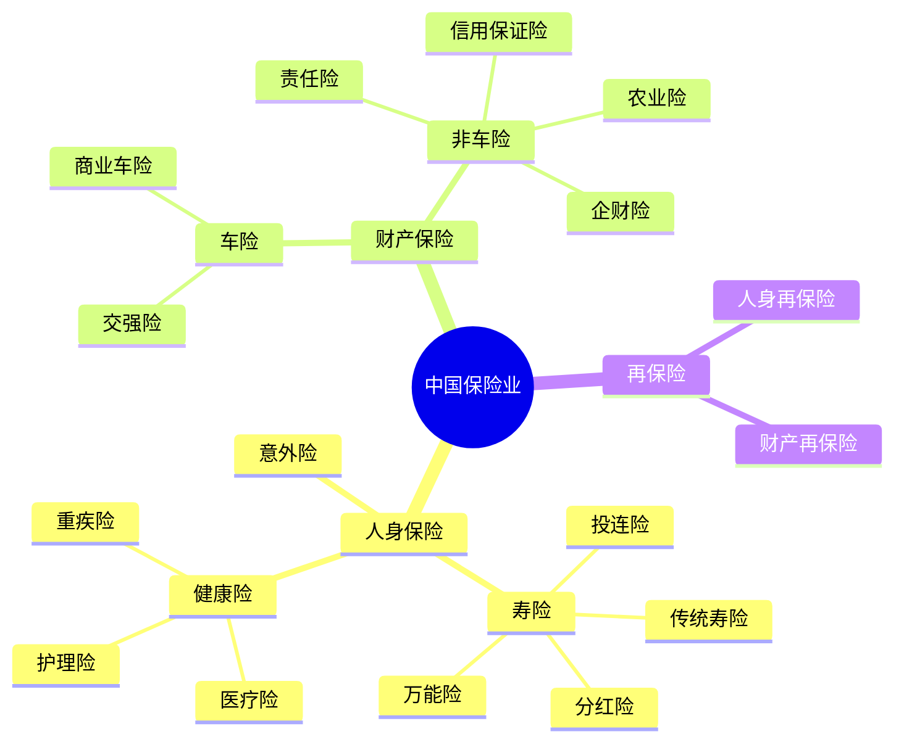
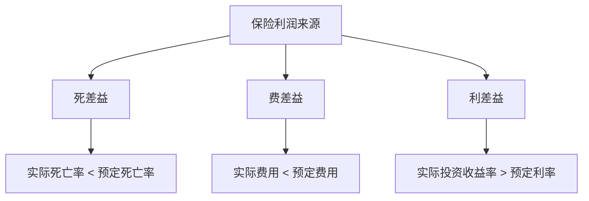
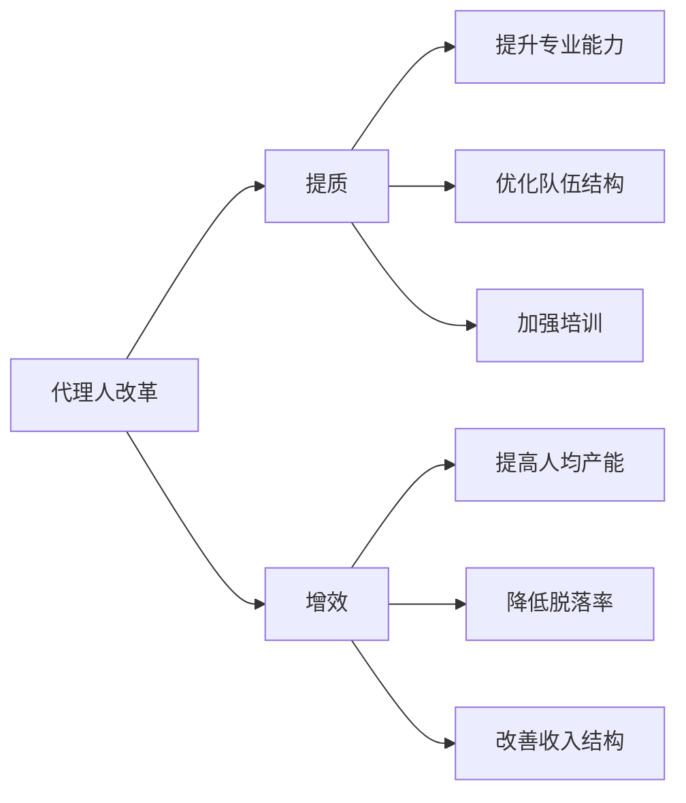

# 中国保险业深度分析

## 概述

中国保险业是全球第二大保险市场，总资产超过 28 万亿元人民币。经过三十多年的快速发展，中国保险业从无到有、从小到大，成为金融体系的重要组成部分。本文深入分析中国保险业的发展历程、竞争格局、商业模式和投资价值。

**学习目标**：
- 理解中国保险业的发展历程和市场特征
- 掌握寿险、财险、健康险的业务模式差异
- 分析保险公司的盈利模式和估值方法
- 评估保险股的投资价值和选股标准
- 建立保险业投资的分析框架

**为什么重要**：
保险业是现代金融体系的三大支柱之一，具有风险管理和长期资金配置的独特功能。中国保险业正处于快速发展期，保险深度和密度仍有巨大提升空间。理解保险业对于把握长期投资机会至关重要。


## 中国保险业发展历程

### 1. 恢复发展期（1979-1995）

**保险业重启**：
- 1979 年：中国人民保险公司恢复国内保险业务
- 1988 年：平安保险成立，打破垄断格局
- 1991 年：太平洋保险成立
- 1996 年：中国人寿从人保分离

**特点**：
- 从无到有，市场培育阶段
- 产品简单，主要是财产险
- 竞争有限，市场集中度高

### 2. 快速发展期（1996-2010）

**市场化改革**：
- 1995 年：《保险法》颁布
- 2001 年：加入 WTO，外资保险进入
- 2003 年：保监会成立
- 寿险、财险分业经营

**特点**：
- 保费收入快速增长
- 保险公司数量增加
- 产品创新活跃
- 代理人队伍快速扩张

### 3. 转型调整期（2011-2017）

**行业整顿**：
- 2014 年：新"国十条"发布
- 2016 年：保险姓保，回归保障
- 2017 年：严监管，整顿万能险
- 代理人增员放缓

**特点**：
- 从规模导向转向价值导向
- 保障型产品占比提升
- 互联网保险兴起
- 行业增速放缓

### 4. 高质量发展期（2018-至今）

**转型升级**：
- 代理人改革：提质增效
- 产品结构优化：保障型为主
- 科技赋能：保险科技应用
- 健康险快速发展

**特点**：
- 新业务价值（NBV）增长
- 内含价值（EV）稳步提升
- 投资收益率改善
- 行业集中度提升

## 中国保险业结构

### 1. 保险分类体系



### 2. 市场份额分布

**寿险市场（2023）**：
- 中国人寿：约 20%
- 平安人寿：约 15%
- 太保寿险：约 8%
- 新华保险：约 5%
- 其他：约 52%

**财险市场（2023）**：
- 人保财险：约 33%
- 平安财险：约 20%
- 太保财险：约 10%
- 其他：约 37%

**集中度特征**：
- 寿险：CR3 约 43%，竞争激烈
- 财险：CR3 约 63%，集中度较高
- 健康险：快速增长，格局未定

## 寿险业务模式

### 1. 产品类型

**传统寿险**：
- 定期寿险、终身寿险
- 保障功能为主
- 保费固定，保额确定
- 适合风险保障需求

**分红险**：
- 保障 + 分红
- 分红不确定
- 中国寿险主流产品
- 适合稳健理财需求

**万能险**：
- 保障 + 投资账户
- 灵活性高
- 投资收益不确定
- 2017 年后受限

**投连险**：
- 保障 + 投资
- 投资风险客户承担
- 市场份额小

### 2. 销售渠道

**个人代理渠道（60%）**：
- 传统主力渠道
- 代理人队伍庞大
- 面对面销售
- 适合复杂产品

**银保渠道（25%）**：
- 银行代理销售
- 产品相对简单
- 趸交为主
- 成本较高

**团险渠道（10%）**：
- 企业团体客户
- 员工福利为主
- 价格优势

**互联网渠道（5%）**：
- 快速增长
- 产品简单标准化
- 成本低
- 年轻客户为主

### 3. 盈利模式

**三差分析**：



**死差益**：
- 实际死亡率低于预定死亡率
- 风险管理能力体现
- 占比相对较小

**费差益**：
- 实际费用低于预定费用
- 运营效率体现
- 规模效应明显

**利差益**：
- 投资收益率高于预定利率
- 最重要的利润来源
- 占比 60-70%

### 4. 关键指标

**新业务价值（NBV）**：
```
NBV = 新单保费 × NBV Margin
```
- 衡量新业务盈利能力
- 最重要的增长指标
- 影响内含价值增长

**内含价值（EV）**：
```
EV = 调整后净资产 + 有效业务价值
```
- 衡量公司内在价值
- 估值基础
- 长期价值体现

**新业务价值率（NBV Margin）**：
```
NBV Margin = NBV / 新单保费
```
- 衡量业务质量
- 保障型产品 NBV Margin 高
- 理财型产品 NBV Margin 低

**内含价值营运回报率（ROEV）**：
```
ROEV = 营运利润 / 期初 EV
```
- 衡量价值创造能力
- 优秀公司 ROEV > 15%

## 财险业务模式

### 1. 产品类型

**车险（70%）**：
- 交强险：强制保险
- 商业车险：自愿购买
- 车损险、三者险、座位险等
- 竞争激烈，费率市场化

**非车险（30%）**：
- 企业财产险
- 责任险
- 信用保证险
- 农业险
- 快速增长，利润率高

### 2. 盈利模式

**承保利润**：
```
承保利润 = 保费收入 - 赔付支出 - 费用支出
综合成本率 = (赔付支出 + 费用支出) / 保费收入
```

**投资收益**：
- 保费收入形成浮存金
- 浮存金投资获取收益
- 投资收益是重要利润来源

**总利润**：
```
总利润 = 承保利润 + 投资收益
```

### 3. 关键指标

**综合成本率**：
```
综合成本率 = 赔付率 + 费用率
```
- < 100%：承保盈利
- = 100%：承保盈亏平衡
- > 100%：承保亏损

**赔付率**：
```
赔付率 = 赔付支出 / 保费收入
```
- 车险赔付率：60-65%
- 非车险赔付率：50-60%

**费用率**：
```
费用率 = 费用支出 / 保费收入
```
- 包括佣金、管理费用等
- 车险费用率：30-35%

**ROE**：
- 财险公司 ROE：10-15%
- 优秀公司 ROE > 15%

## 保险业投资分析

### 1. 估值方法

**P/EV 估值法（主流方法）**：
```
合理 P/EV = ROEV / (折现率 - 增长率)
```

**估值中枢**：
- 优秀寿险公司：1.0-1.5 倍 P/EV
- 一般寿险公司：0.6-1.0 倍 P/EV
- 财险公司：1.5-2.5 倍 P/B

**估值驱动因素**：
- ROEV 水平
- NBV 增速
- 投资收益率
- 代理人队伍

**PE 估值法（辅助方法）**：
- 寿险公司：10-15 倍 PE
- 财险公司：15-20 倍 PE

### 2. 选股标准

**寿险公司**：
- NBV 增速 > 10%
- ROEV > 15%
- 代理人队伍稳定
- 投资收益率 > 5%
- P/EV < 1.0 倍

**财险公司**：
- 综合成本率 < 98%
- 保费增速 > 行业平均
- 非车险占比提升
- ROE > 15%
- P/B < 2.0 倍

### 3. 投资机会

**结构性机会**：
- 代理人改革见效的公司
- 保障型产品占比高的公司
- 投资收益率改善的公司
- 健康险快速发展的公司
- 非车险占比提升的财险公司

**周期性机会**：
- 利率上行期：投资收益改善
- 股市上涨期：投资收益增加
- 经济复苏期：保费增长加速

### 4. 投资风险

**寿险风险**：
- 代理人流失
- 新业务价值下滑
- 投资收益率下降
- 利差损风险

**财险风险**：
- 车险费率下降
- 综合成本率上升
- 自然灾害赔付
- 竞争加剧

**共同风险**：
- 监管政策变化
- 经济下行影响
- 资本市场波动
- 声誉风险

## 保险业发展趋势

### 1. 代理人改革

**改革方向**：


**改革成效**：
- 代理人数量下降，质量提升
- 人均产能提高
- 客户满意度改善
- 业务质量提升

### 2. 产品结构优化

**优化方向**：
- 保障型产品占比提升
- 长期期交产品为主
- 健康险快速发展
- 养老险潜力巨大

**产品创新**：
- 定制化产品
- 场景化产品
- 互联网产品
- 惠民保等普惠产品

### 3. 科技赋能

**应用领域**：
- 线上化：APP、小程序
- 智能化：AI 核保、智能客服
- 数据化：大数据风控、精准营销
- 生态化：健康管理、养老服务

**科技投入**：
- 头部公司科技投入占保费 1-2%
- 科技人员占比提升
- 与科技公司合作

### 4. 健康险发展

**市场空间**：
- 人口老龄化
- 健康意识提升
- 医疗费用上涨
- 政策支持

**产品类型**：
- 重疾险
- 医疗险
- 长期护理险
- 惠民保

**竞争格局**：
- 传统保险公司
- 互联网保险公司
- 专业健康险公司

### 5. 养老金融

**市场机遇**：
- 人口老龄化加速
- 养老金缺口巨大
- 第三支柱建设
- 政策支持力度大

**业务布局**：
- 养老年金险
- 养老社区
- 养老金管理
- 长期护理服务

## 投资策略建议

### 1. 长期价值投资

**核心持仓**：
- 中国平安：综合金融龙头
- 中国太保：寿险、财险均衡
- 中国人寿：寿险龙头

**投资理由**：
- 行业长期增长空间大
- 龙头公司竞争优势明显
- 估值合理，安全边际高
- 分红稳定

### 2. 成长投资策略

**关注标的**：
- 代理人改革成效显著的公司
- 健康险快速发展的公司
- 科技应用领先的公司

**投资理由**：
- NBV 增速高
- ROEV 提升
- 市场份额扩大

### 3. 周期轮动策略

**利率上行期**：
- 加仓保险股
- 投资收益改善
- 估值修复

**利率下行期**：
- 减仓保险股
- 投资收益承压
- 估值压制

### 4. 分散配置策略

**类型分散**：
- 寿险 60%
- 财险 30%
- 健康险 10%

**个股分散**：
- 持有 2-3 只保险股
- 避免过度集中

## 研究框架与工具

### 保险股研究清单

**宏观层面**：
- [ ] 经济增长趋势
- [ ] 利率走势判断
- [ ] 股市行情预期
- [ ] 人口结构变化

**行业层面**：
- [ ] 保费增长趋势
- [ ] 竞争格局变化
- [ ] 监管政策影响
- [ ] 产品创新趋势

**公司层面**：
- [ ] NBV 增速
- [ ] ROEV 水平
- [ ] 代理人队伍
- [ ] 投资收益率
- [ ] 产品结构
- [ ] 管理层能力

**估值层面**：
- [ ] P/EV 估值水平
- [ ] 历史估值区间
- [ ] 同业估值对比
- [ ] 分红收益率

### 数据来源

**官方数据**：
- 银保监会：保险业统计数据
- 中国保险行业协会：行业数据

**公司数据**：
- 年报、中报
- 业绩说明会
- 投资者交流
- 券商研究报告

**市场数据**：
- Wind、Choice 等金融终端
- 上市公司公告

## 常见误区

### 误区 1：只看保费增长

**错误做法**：
- 追求保费规模
- 忽视业务质量
- 不关注 NBV

**正确做法**：
- 关注 NBV 增长
- 评估业务质量
- 重视价值创造

### 误区 2：忽视投资收益

**错误做法**：
- 只看承保业务
- 忽视投资能力
- 不关注资产配置

**正确做法**：
- 投资收益是重要利润来源
- 评估投资能力
- 关注资产质量

### 误区 3：过度关注短期业绩

**错误做法**：
- 追逐季度业绩
- 频繁交易
- 忽视长期价值

**正确做法**：
- 关注长期趋势
- 评估持续竞争力
- 长期持有优质公司

### 误区 4：忽视周期性

**错误做法**：
- 不考虑利率周期
- 不考虑股市周期
- 盲目乐观或悲观

**正确做法**：
- 关注利率和股市周期
- 在低点布局
- 在高点减仓

## 延伸阅读

### 推荐书籍

1. **《保险学原理》** - 魏华林
   - 保险业基础知识

2. **《人寿保险公司经营与管理》** - 林宝清
   - 寿险公司经营实践

3. **《财产保险原理与实务》** - 施建祥
   - 财险业务详解

4. **《保险资金运用》** - 粟芳
   - 保险投资管理

5. **《巴菲特的保险投资》** - 相关研究
   - 保险投资案例

### 研究报告

- 各大券商保险行业年度策略报告
- 银保监会保险业运行报告
- 中国保险行业协会年度报告
- 麦肯锡中国保险业报告

### 在线资源

- 银保监会官网
- 中国保险行业协会
- 上市保险公司投资者关系平台
- 专业财经媒体

## 参考文献

1. 银保监会. 《中国保险业统计数据》. 2023
2. 中国保险行业协会. 《中国保险业发展报告》. 2023
3. 麦肯锡. 《中国保险业转型报告》. 2023
4. 波士顿咨询. 《中国保险市场报告》. 2023
5. 中金公司. 《保险行业深度报告》. 2023
6. 招商证券. 《保险行业专题研究》. 2023
7. 中信证券. 《保险行业年度策略》. 2023
8. 国泰君安. 《保险行业竞争格局分析》. 2023
9. 华泰证券. 《保险行业代理人改革研究》. 2023
10. 申万宏源. 《保险行业投资价值分析》. 2023

---

**下一步学习**：
- 研究平安保险案例
- 分析寿险公司估值方法
- 学习保险财务报表分析
- 了解保险投资策略
