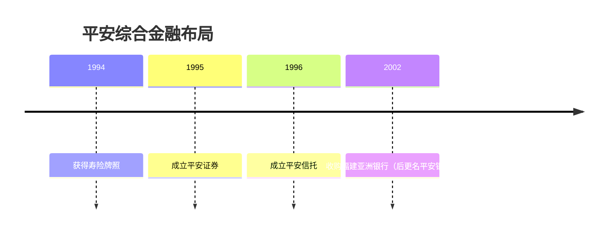
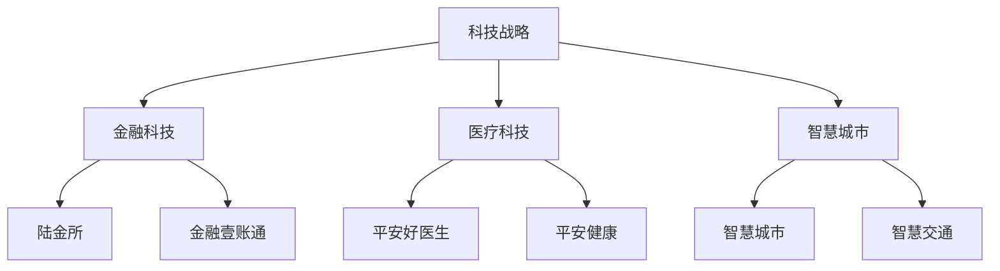
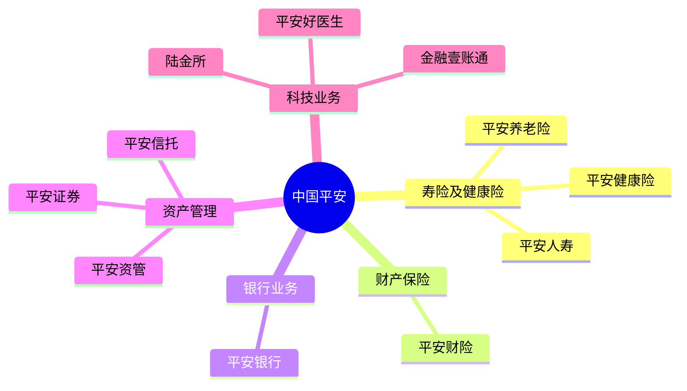

# 中国平安深度研究

## 公司概况

中国平安保险（集团）股份有限公司（简称"中国平安"，股票代码：601318.SH / 02318.HK）成立于 1988 年，是中国第一家股份制保险企业，也是全球领先的综合金融集团。平安以保险为核心，涵盖银行、投资、科技等多个领域，是中国金融创新的标杆企业。

**基本信息**：
- 成立时间：1988 年
- 总部位置：深圳市福田区
- 上市时间：2004 年（H 股）、2007 年（A 股）
- 主营业务：保险、银行、投资、科技
- 市值规模：约 1.2 万亿人民币（2023）
- 员工人数：约 35 万人

**核心数据（2023）**：
- 总资产：11.9 万亿元
- 营业收入：1.3 万亿元
- 净利润：1,450 亿元
- 内含价值（EV）：1.5 万亿元
- 新业务价值（NBV）：450 亿元
- ROE：16.5%
- 客户数：2.3 亿


## 发展历程

### 1. 创业起步（1988-1992）

**从零开始**：
- 1988 年：在深圳蛇口成立，注册资本 418 万元
- 中国第一家股份制保险公司
- 打破中国人保垄断格局
- 主要经营财产险业务

**创新基因**：
- 引入现代企业制度
- 市场化经营机制
- 国际化视野

### 2. 综合金融布局（1993-2002）

**多元化发展**：


**战略转型**：
- 从单一财险到寿险、财险并重
- 从保险到综合金融
- 引入摩根士丹利、高盛等战略投资者

### 3. 上市与扩张（2003-2012）

**资本市场助力**：
- 2004 年：H 股上市，募资 143 亿港元
- 2007 年：A 股上市，募资 380 亿元
- 2012 年：收购深发展银行，整合为平安银行

**业务扩张**：
- 寿险业务快速增长
- 银行业务规模扩大
- 投资业务多元化
- 海外业务拓展

### 4. 科技转型（2013-2018）

**"金融+科技"战略**：


**科技投入**：
- 累计投入超过 1000 亿元
- 科技人员超过 11 万人
- 建立 8 大研究院
- 孵化 11 家科技公司

### 5. 高质量发展（2019-至今）

**回归主业**：
- 聚焦保险、银行核心业务
- 科技赋能金融主业
- 剥离非核心资产
- 提升价值创造能力

**战略调整**：
- 寿险改革：代理人提质增效
- 银行转型：零售银行战略
- 科技应用：深度赋能主业
- 生态建设：金融+生活+服务

## 综合金融模式

### 1. 业务架构

**五大业务板块**：



### 2. 协同效应

**交叉销售**：
- 保险客户购买银行产品
- 银行客户购买保险产品
- 一个客户，多个产品
- 客均合同数提升

**数据共享**：
- 客户数据整合
- 风险数据共享
- 精准营销
- 风险管理

**品牌协同**：
- 统一品牌形象
- 品牌影响力放大
- 客户信任度提升

**成本协同**：
- 共享渠道网络
- 共享科技平台
- 共享后台支持
- 降低运营成本

### 3. 客户经营

**"一个客户、一个账户、多个产品、一站式服务"**：

**客户分层**：
- 零售客户：2.3 亿
- 互联网用户：6.7 亿
- 企业客户：300 万

**客户价值**：
- 客均合同数：2.8 个
- 客均利润贡献持续提升
- 客户终身价值最大化

## 寿险业务分析

### 1. 业务规模

**保费收入（2023）**：
- 总保费：5,500 亿元
- 新单保费：1,800 亿元
- 续期保费：3,700 亿元
- 市场份额：约 15%

**代理人队伍**：
- 代理人数量：约 50 万人
- 人均产能：行业领先
- 代理人质量：持续提升

### 2. 业务质量

**新业务价值（NBV）**：
- 2023 年 NBV：450 亿元
- NBV Margin：25%
- 行业领先水平

**产品结构**：
- 保障型产品占比：60%+
- 长期期交占比：90%+
- 产品结构优化

**内含价值（EV）**：
- 2023 年 EV：1.5 万亿元
- ROEV：18%
- 价值创造能力强

### 3. 竞争优势

**品牌优势**：
- 品牌价值全球保险业第一
- 客户信任度高
- 品牌溢价能力强

**渠道优势**：
- 代理人队伍质量高
- 银保渠道协同
- 互联网渠道创新

**产品优势**：
- 产品创新能力强
- 保障型产品丰富
- 健康险特色明显

**科技优势**：
- AI 核保、智能客服
- 线上化率高
- 客户体验好

## 财险业务分析

### 1. 业务规模

**保费收入（2023）**：
- 总保费：3,200 亿元
- 车险：2,200 亿元
- 非车险：1,000 亿元
- 市场份额：约 20%

### 2. 业务质量

**综合成本率**：
- 2023 年：97.5%
- 承保盈利
- 行业领先水平

**产品结构**：
- 车险占比：68%
- 非车险占比：32%
- 非车险快速增长

### 3. 竞争优势

**规模优势**：
- 市场份额第二
- 网点覆盖广
- 品牌影响力大

**科技优势**：
- 智能定损
- 线上理赔
- 客户体验好

**风控优势**：
- 大数据风控
- 精准定价
- 赔付率控制好

## 银行业务分析

### 1. 业务规模

**资产规模（2023）**：
- 总资产：5.3 万亿元
- 贷款总额：3.2 万亿元
- 存款总额：3.8 万亿元

### 2. 零售转型

**零售业务占比**：
- 零售贷款占比：60%+
- 零售存款占比：70%+
- 零售收入占比：65%+

**零售特色**：
- 信用卡业务领先
- 汽车金融特色
- 消费金融创新

### 3. 财务表现

**盈利能力**：
- 净利润：400 亿元
- ROE：10%+
- 净息差：2.5%+

**资产质量**：
- 不良率：1.0%
- 拨备覆盖率：280%+
- 资产质量优秀

## 科技战略

### 1. 科技投入

**投入规模**：
- 累计投入：超过 1000 亿元
- 年度投入：约 200 亿元
- 占营收比例：约 1.5%

**科技人员**：
- 科技人员：11 万+
- 研发人员：4 万+
- 占员工比例：30%+

### 2. 科技应用

**金融科技**：
- AI 核保：提升效率 70%
- 智能客服：服务 95% 的咨询
- 智能投顾：个性化资产配置
- 区块链：供应链金融、跨境支付

**医疗科技**：
- 平安好医生：在线医疗平台
- AI 辅助诊断：准确率 90%+
- 健康管理：全生命周期服务

**智慧城市**：
- 智慧政务
- 智慧交通
- 智慧医疗
- 智慧教育

### 3. 科技生态

**科技公司**：
- 陆金所：金融科技平台
- 金融壹账通：金融 SaaS 服务
- 平安好医生：互联网医疗
- 平安医保科技：医保科技

**技术能力**：
- 人工智能
- 区块链
- 云计算
- 大数据

## 财务分析

### 1. 盈利能力

**营业收入**：
- 2018 年：1.0 万亿元
- 2020 年：1.2 万亿元
- 2023 年：1.3 万亿元
- 年均增长率：约 8%

**净利润**：
- 2018 年：1,074 亿元
- 2020 年：1,431 亿元
- 2023 年：1,450 亿元
- 年均增长率：约 10%

**盈利能力指标**：
| 指标 | 2021 | 2022 | 2023 | 行业平均 |
|------|------|------|------|---------|
| ROE | 15.8% | 16.2% | 16.5% | 12.0% |
| ROEV | 17.5% | 18.0% | 18.0% | 15.0% |
| NBV Margin | 23% | 24% | 25% | 20% |

### 2. 价值指标

**内含价值（EV）**：
- 2023 年 EV：1.5 万亿元
- EV 增长率：10%+
- ROEV：18%

**新业务价值（NBV）**：
- 2023 年 NBV：450 亿元
- NBV 增长率：8%
- NBV Margin：25%

### 3. 投资收益

**投资资产**：
- 投资资产：4.5 万亿元
- 资产配置：债券 60%、股票 15%、其他 25%

**投资收益率**：
- 总投资收益率：5.5%
- 净投资收益率：4.8%
- 行业领先水平

### 4. 分红情况

**分红政策**：
- 分红率：30-35%
- 股息率：4-5%
- 分红稳定增长

**历史分红**：
- 2018 年：每股 2.00 元
- 2020 年：每股 2.20 元
- 2023 年：每股 2.43 元

## 竞争优势分析

### 1. 综合金融优势

**全牌照优势**：
- 保险、银行、证券、信托、基金全牌照
- 一站式金融服务
- 协同效应显著

**交叉销售能力**：
- 客均合同数 2.8 个
- 交叉销售率持续提升
- 客户终身价值最大化

### 2. 科技领先优势

**科技投入领先**：
- 累计投入超过 1000 亿元
- 科技人员 11 万+
- 专利申请数量全球金融机构第一

**科技应用领先**：
- AI、区块链、云计算深度应用
- 线上化率高
- 客户体验好

**科技赋能主业**：
- 提升运营效率
- 降低运营成本
- 改善客户体验
- 增强风控能力

### 3. 品牌优势

**品牌价值**：
- 品牌价值全球保险业第一
- 品牌知名度和美誉度高
- 客户信任度高

**品牌影响力**：
- 获客成本低
- 客户粘性强
- 品牌溢价能力强

### 4. 管理优势

**管理团队**：
- 管理层稳定
- 执行力强
- 战略清晰

**公司治理**：
- 现代企业制度
- 激励机制完善
- 风险管理能力强

### 5. 生态优势

**金融生态**：
- 保险、银行、投资协同
- 客户资源共享
- 数据资源共享

**科技生态**：
- 金融科技、医疗科技、智慧城市
- 技术能力输出
- 生态价值变现

## 投资分析

### 1. 投资亮点

**价值创造能力强**：
- ROEV 18%，行业领先
- NBV 稳定增长
- EV 持续提升

**综合金融协同**：
- 交叉销售效果显著
- 客均价值提升
- 协同效应持续释放

**科技赋能主业**：
- 提升运营效率
- 改善客户体验
- 增强竞争力

**估值合理**：
- P/EV 约 0.8 倍
- 估值修复空间大
- 分红收益率高

### 2. 投资风险

**寿险改革风险**：
- 代理人队伍调整
- 新业务价值波动
- 转型阵痛

**银行业务风险**：
- 资产质量压力
- 净息差收窄
- 竞争加剧

**科技投入风险**：
- 科技投入巨大
- 短期回报不确定
- 科技公司估值波动

**监管政策风险**：
- 保险监管趋严
- 银行监管加强
- 科技监管不确定性

### 3. 估值分析

**P/EV 估值法**：
```
合理 P/EV = ROEV / (折现率 - 增长率)
= 18% / (12% - 8%)
= 4.5 倍

当前 P/EV = 0.8 倍
估值修复空间 = 4.5 / 0.8 = 5.6 倍
```

**PE 估值法**：
- 当前 PE：8 倍
- 历史平均 PE：12 倍
- 合理 PE：10-15 倍
- 估值修复空间：25-87%

**分部估值法**：
| 业务 | 估值方法 | 估值（亿元） |
|------|---------|------------|
| 寿险 | 1.2倍P/EV | 18,000 |
| 财险 | 2.0倍P/B | 2,000 |
| 银行 | 0.8倍P/B | 3,200 |
| 科技 | 市值 | 2,000 |
| 合计 | | 25,200 |

当前市值：12,000 亿元
上涨空间：110%

### 4. 投资建议

**长期价值投资**：
- 综合金融龙头
- 科技赋能领先
- 价值创造能力强
- 估值合理，安全边际高

**买入时机**：
- 市场悲观时
- P/EV 跌破 0.7 倍时
- 股息率超过 5% 时

**持有策略**：
- 长期持有，不频繁交易
- 定期收取分红
- 估值修复后可适当减仓

**配置建议**：
- 核心持仓：10-20%
- 适合长期投资者
- 适合价值投资者

## 关键学习点

### 1. 综合金融模式的价值

平安的案例说明：
- 综合金融协同效应显著
- 交叉销售提升客户价值
- 一站式服务增强竞争力
- 但需要强大的管理能力

### 2. 科技赋能金融的路径

平安的科技战略：
- 巨额科技投入
- 科技深度应用于主业
- 科技能力对外输出
- 科技生态价值变现

### 3. 保险公司的价值创造

平安的价值创造：
- ROEV 是核心指标
- NBV 增长是关键
- 投资收益很重要
- 代理人队伍是基础

### 4. 长期主义的力量

平安的成功经验：
- 35 年持续创新
- 战略定力和执行力
- 长期投入科技
- 长期价值创造

## 延伸阅读

### 推荐资料

1. **平安年报** - 最权威的信息来源
2. **平安投资者关系网站** - 业绩说明会、投资者交流
3. **《平安心语》** - 马明哲管理思想
4. **券商研究报告** - 中金、中信、招商等
5. **《长期主义》** - 高瓴资本对平安的研究

### 相关案例

- 中国人寿：寿险龙头
- 中国太保：寿险、财险均衡
- 伯克希尔·哈撒韦：保险+投资模式

## 参考文献

1. 中国平安. 《2023 年年度报告》. 2024
2. 中国平安. 《2023 年社会责任报告》. 2024
3. 中金公司. 《中国平安深度报告》. 2023
4. 招商证券. 《中国平安投资价值分析》. 2023
5. 中信证券. 《保险行业年度策略》. 2023
6. 麦肯锡. 《中国保险业转型报告》. 2023
7. 波士顿咨询. 《中国金融科技报告》. 2023
8. 高瓴资本. 《长期主义》. 2021
9. 《财经》杂志. 《平安专题报道》. 2023
10. 《21 世纪经济报道》. 《保险业深度分析》. 2023

---

**投资总结**：
中国平安是中国最具创新力的综合金融集团，以保险为核心，科技赋能，生态协同。虽然面临寿险改革和科技投入的短期压力，但长期价值创造能力强，ROEV 行业领先，估值合理，是优秀的长期投资标的。适合长期持有，分享中国金融业和科技创新的成长红利。


## 高级分析与前沿研究

### 学术研究进展

近年来，学术界对本领域的研究取得了重要进展。以下是几个值得关注的研究方向：

**行为金融学视角**：传统金融理论假设市场参与者是完全理性的，但行为金融学的研究表明，认知偏差和情绪因素在投资决策中扮演着重要角色。诺贝尔经济学奖得主丹尼尔·卡尼曼（Daniel Kahneman）和理查德·塞勒（Richard Thaler）的研究为我们理解市场非理性行为提供了重要框架。

**因子投资研究**：尤金·法玛（Eugene Fama）和肯尼斯·弗伦奇（Kenneth French）的三因子模型，以及后续发展的五因子模型，为系统性地解释股票收益差异提供了理论基础。这些研究表明，市值、账面市值比、盈利能力和投资模式等因子能够解释大部分股票收益的横截面差异。

**市场微观结构研究**：对市场流动性、价格发现机制和交易成本的深入研究，帮助我们更好地理解市场的运作机制，并为优化交易策略提供指导。

### 实战案例深度解析

**案例一：长期价值创造的典范**

以沃伦·巴菲特（Warren Buffett）的伯克希尔·哈撒韦（Berkshire Hathaway）为例，其长达数十年的卓越投资业绩证明了价值投资理念的有效性。从1965年至今，伯克希尔的账面价值年均增长率约为19.8%，远超同期标普500指数的约10.2%年均回报。

巴菲特的成功秘诀在于：
- 专注于具有持久竞争优势的优质企业
- 以合理价格买入，而非追求最低价格
- 长期持有，让复利效应充分发挥
- 保持充足的安全边际，控制下行风险

**案例二：危机中的机遇识别**

2008年金融危机期间，大多数投资者恐慌性抛售，但少数具有前瞻性的投资者却在危机中发现了历史性的投资机会。约翰·保尔森（John Paulson）通过做空次级抵押贷款相关证券，在危机中获得了约150亿美元的利润，成为金融史上最成功的单笔交易之一。

这个案例告诉我们：
- 深入的基本面研究能够发现市场定价错误
- 逆向思维往往能够发现被市场忽视的机会
- 风险管理和仓位控制是成功的关键

### 跨市场比较分析

不同市场在结构、监管、投资者构成等方面存在显著差异，这些差异对投资策略的选择有重要影响：

**美国市场特征**：
- 机构投资者主导，市场效率较高
- 信息披露制度完善，分析师覆盖广泛
- 衍生品市场发达，对冲工具丰富
- 长期牛市历史，但也经历过多次重大调整

**中国市场特征**：
- 散户投资者比例较高，市场波动性较大
- 政策因素影响显著，需要密切关注监管动向
- 新兴行业发展迅速，成长投资机会丰富
- A股、港股、美股中概股形成多层次市场体系

**欧洲市场特征**：
- 价值股比例较高，估值相对保守
- 受地缘政治和欧元区政策影响较大
- 部分行业（如奢侈品、工业）具有全球竞争优势
- ESG投资理念推广较为领先


## 实用工具与操作指南

### 分析工具推荐

**数据获取工具**：
- **Bloomberg Terminal**：专业级金融数据平台，提供实时行情、历史数据、新闻资讯等全方位服务，是机构投资者的首选工具
- **Wind资讯（万得）**：中国最权威的金融数据平台，覆盖A股、债券、基金等全市场数据
- **FactSet**：提供全球股票、固定收益、另类投资等多资产类别的综合数据服务
- **免费替代方案**：Yahoo Finance、Google Finance、东方财富、同花顺等提供基础数据服务

**分析软件工具**：
- **Excel/Python**：用于财务模型构建、数据分析和可视化
- **Tableau/Power BI**：用于数据可视化和仪表板创建
- **R语言**：适合统计分析和量化研究

### 实操步骤指南

**第一步：信息收集**
1. 获取目标公司/资产的基本信息和历史数据
2. 收集行业报告和竞争对手数据
3. 整理宏观经济背景信息
4. 查阅相关学术研究和专业分析报告

**第二步：定量分析**
1. 建立财务模型，计算关键指标
2. 进行历史趋势分析
3. 与同行业公司进行横向比较
4. 构建估值模型，计算合理价值区间

**第三步：定性分析**
1. 评估竞争优势和护城河
2. 分析管理层质量和公司治理
3. 识别主要风险因素
4. 评估行业发展趋势

**第四步：综合判断**
1. 整合定量和定性分析结果
2. 进行情景分析（乐观/基准/悲观）
3. 确定投资论点和关键假设
4. 制定投资决策和风险管理方案

### 常见错误与规避方法

| 常见错误 | 产生原因 | 规避方法 |
|---------|---------|---------|
| 过度依赖历史数据 | 忽视结构性变化 | 结合前瞻性分析 |
| 锚定效应 | 过度依赖初始信息 | 定期重新评估假设 |
| 确认偏误 | 只寻找支持观点的证据 | 主动寻找反驳证据 |
| 过度自信 | 高估自身分析能力 | 保持谦逊，设置安全边际 |
| 忽视流动性风险 | 只关注收益不关注风险 | 全面评估风险因素 |


## 扩展参考资料

### 经典著作推荐

**基础理论类**：
1. 本杰明·格雷厄姆（Benjamin Graham）《聪明的投资者》（The Intelligent Investor, 1949）- 价值投资圣经，巴菲特称之为"有史以来最伟大的投资书籍"
2. 菲利普·费雪（Philip Fisher）《怎样选择成长股》（Common Stocks and Uncommon Profits, 1958）- 成长投资经典，强调定性分析的重要性
3. 彼得·林奇（Peter Lynch）《彼得·林奇的成功投资》（One Up on Wall Street, 1989）- 普通投资者如何发现十倍股
4. 霍华德·马克斯（Howard Marks）《投资最重要的事》（The Most Important Thing, 2011）- 橡树资本创始人的投资智慧

**宏观经济类**：
5. 瑞·达里奥（Ray Dalio）《原则》（Principles, 2017）- 桥水基金创始人的生活和工作原则
6. 约翰·梅纳德·凯恩斯（John Maynard Keynes）《就业、利息和货币通论》（The General Theory, 1936）- 现代宏观经济学奠基之作
7. 米尔顿·弗里德曼（Milton Friedman）《货币的祸害》（Money Mischief, 1992）- 货币主义经典著作

**量化投资类**：
8. 伊曼纽尔·德曼（Emanuel Derman）《宽客人生》（My Life as a Quant, 2004）- 量化金融先驱的回忆录
9. 马科维茨（Harry Markowitz）《组合选择》（Portfolio Selection, 1952）- 现代投资组合理论奠基论文

### 权威研究报告

- **美联储经济研究**：https://www.federalreserve.gov/econres.htm
- **国际货币基金组织（IMF）报告**：https://www.imf.org/en/Publications
- **世界银行研究**：https://www.worldbank.org/en/research
- **国际清算银行（BIS）季报**：https://www.bis.org/publ/qtrpdf/
- **中国人民银行货币政策报告**：http://www.pbc.gov.cn

### 在线学习资源

- **Coursera金融课程**：耶鲁大学Robert Shiller的《金融市场》课程
- **MIT OpenCourseWare**：麻省理工学院金融工程相关课程
- **CFA Institute**：特许金融分析师协会的专业学习资源
- **Investopedia**：金融术语和概念的权威解释网站
- **SSRN**：社会科学研究网络，提供大量金融学术论文

