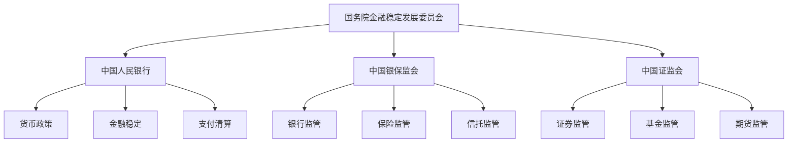
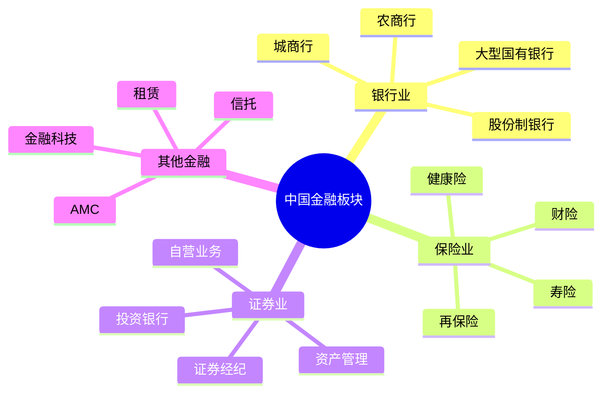

# 中国金融板块总览

## 概述

中国金融板块是 A 股市场市值最大的板块之一，在国民经济中占据核心地位。随着金融改革深化和对外开放加速，中国金融业正经历深刻变革。本文全面分析中国金融市场的结构、特点、监管环境和投资机会。

**学习目标**：
- 理解中国金融体系的结构和特点
- 掌握金融板块的细分行业和投资逻辑
- 分析金融监管政策对行业的影响
- 识别优质金融企业的核心特征
- 建立中国金融投资的分析框架

**为什么重要**：
金融是现代经济的核心，中国金融业资产规模超过 400 万亿元，是全球第二大金融市场。金融板块不仅是经济的晴雨表，也是价值投资者获取稳定分红的重要来源。理解中国金融体系对于把握宏观经济和投资机会至关重要。

## 中国金融体系结构

### 1. 监管架构

**"一委一行两会"体系**：

**监管特点**：
- 分业监管为主，混业经营趋势
- 强调金融稳定和系统性风险防范
- 监管政策对行业影响巨大
- 逐步与国际标准接轨

### 2. 金融机构体系

**银行体系**：
- 大型国有银行：工商银行、建设银行、农业银行、中国银行、交通银行、邮储银行
- 股份制银行：招商银行、兴业银行、浦发银行等
- 城商行：北京银行、上海银行、宁波银行等
- 农商行和村镇银行

**保险体系**：
- 大型保险集团：中国人寿、中国平安、中国太保、中国人保
- 外资保险公司
- 互联网保险公司

**证券体系**：
- 大型券商：中信证券、华泰证券、国泰君安等
- 中小券商
- 基金公司
- 期货公司

**其他金融机构**：
- 信托公司
- 金融租赁公司
- 消费金融公司
- 金融科技公司

## 中国金融市场特征

### 1. 规模与增长

**庞大的市场规模**：
- 银行业总资产：超过 380 万亿元（2023）
- 保险业总资产：超过 28 万亿元
- 证券市场市值：约 80 万亿元
- 债券市场余额：超过 150 万亿元

**持续的增长动力**：
- 经济增长带动金融需求
- 金融深化程度提升
- 直接融资占比上升
- 金融科技创新

### 2. 国有主导特征

**国有金融机构占主导**：
- 六大国有银行资产占比超过 40%
- 大型保险集团多为国有控股
- 主要券商多有国资背景

**国有主导的影响**：
- 优势：政策支持、资源获取、风险抵御
- 劣势：市场化程度不足、创新动力相对较弱
- 趋势：混合所有制改革、引入战略投资者

### 3. 利率市场化进程

**利率市场化改革**：
- 存贷款利率管制逐步放开
- LPR（贷款市场报价利率）机制建立
- 利率走廊机制完善

**对金融机构的影响**：
- 净息差收窄压力
- 资产负债管理能力要求提升
- 中间业务重要性上升
- 差异化竞争加剧

### 4. 金融科技发展

**金融科技应用广泛**：
- 移动支付：支付宝、微信支付全球领先
- 互联网银行：微众银行、网商银行
- 互联网保险：众安保险等
- 智能投顾、区块链应用

**金融科技的影响**：
- 提升金融服务效率
- 降低金融服务成本
- 改变金融业态
- 带来新的风险挑战

## 金融板块细分结构

### 核心子行业分类

### 1. 银行业

**行业特点**：
- 资产规模最大的金融子行业
- 利息收入为主，中间业务增长
- 强监管，资本充足率要求高
- 经济周期敏感度高

**竞争格局**：
- 大型国有银行：规模优势，网点覆盖广
- 股份制银行：机制灵活，零售业务强
- 城商行：区域深耕，特色经营
- 互联网银行：科技驱动，轻资产模式

**投资逻辑**：
- 关注资产质量和不良率
- 重视净息差和盈利能力
- 评估资本充足率和补充能力
- 考察零售转型和中间业务发展

### 2. 保险业

**行业特点**：
- 长期资金，投资收益重要
- 寿险和财险业务模式差异大
- 代理人渠道转型压力
- 保险科技应用加速

**竞争格局**：
- 寿险：中国人寿、平安寿险、太保寿险领先
- 财险：人保财险、平安财险、太保财险三强
- 健康险：快速增长的新兴领域
- 互联网保险：创新业态

**投资逻辑**：
- 关注新业务价值（NBV）增长
- 重视内含价值（EV）和 ROE
- 评估投资收益率和资产配置
- 考察代理人队伍和渠道转型

### 3. 证券业

**行业特点**：
- 强周期性，与市场行情高度相关
- 业务多元化：经纪、投行、资管、自营
- 竞争激烈，佣金率下降
- 创新业务发展空间大

**竞争格局**：
- 头部券商：中信、华泰、国泰君安等
- 中型券商：差异化竞争
- 小型券商：区域特色或专业化

**投资逻辑**：
- 关注市场份额和业务结构
- 重视资本实力和杠杆水平
- 评估风控能力和合规水平
- 考察创新业务发展

## 中国金融投资逻辑

### 1. 宏观经济敏感性

**金融板块的周期性**：
- 经济上行：信贷需求旺盛，资产质量改善
- 经济下行：不良率上升，盈利压力加大
- 货币政策：利率变化直接影响盈利
- 监管政策：政策变化影响业务发展

**投资时机把握**：
- 经济复苏初期：金融股估值修复
- 经济过热期：关注风险积累
- 经济下行期：防范资产质量恶化
- 政策转向期：把握政策红利

### 2. 估值与分红优势

**估值特点**：
- 长期低估值：PB 通常在 0.5-1.5 倍
- 估值修复空间：经济预期改善时估值提升
- 分红收益率高：多数银行分红率 30%+

**适合价值投资**：
- 稳定的盈利能力
- 高分红回报
- 低估值提供安全边际
- 长期持有获取稳定收益

### 3. 选股核心要素

**资产质量**：
- 不良贷款率
- 拨备覆盖率
- 关注类贷款占比
- 资产减值损失

**盈利能力**：
- ROE 和 ROA
- 净息差（NIM）
- 成本收入比
- 中间业务收入占比

**资本实力**：
- 资本充足率
- 核心一级资本充足率
- 资本补充能力
- 杠杆率

**成长性**：
- 资产增速
- 利润增速
- 市场份额变化
- 新业务发展

### 4. 风险因素

**信用风险**：
- 经济下行导致不良率上升
- 房地产、地方政府融资平台风险
- 行业集中度风险

**市场风险**：
- 利率波动影响净息差
- 股市波动影响投资收益
- 汇率波动影响外汇业务

**流动性风险**：
- 存款竞争加剧
- 同业负债依赖
- 资产负债期限错配

**政策风险**：
- 监管政策变化
- 资本监管趋严
- 业务限制增加

## 监管政策影响

### 1. 金融去杠杆

**政策背景**：
- 防范系统性金融风险
- 控制影子银行规模
- 规范资管业务

**对行业的影响**：
- 同业业务收缩
- 表外业务回表
- 资本消耗增加
- 盈利增速放缓

### 2. 资管新规

**核心内容**：
- 打破刚性兑付
- 禁止资金池
- 限制期限错配
- 净值化管理

**对行业的影响**：
- 银行理财转型
- 信托业务调整
- 资管行业重塑
- 投资者教育加强

### 3. 金融开放

**开放措施**：
- 取消外资持股比例限制
- 扩大外资业务范围
- 简化外资准入程序

**对行业的影响**：
- 竞争加剧
- 管理水平提升
- 产品创新加速
- 国际化程度提高

### 4. 金融科技监管

**监管重点**：
- 互联网金融整顿
- 数据安全和隐私保护
- 反垄断监管
- 金融消费者保护

**对行业的影响**：
- 合规成本上升
- 业务模式调整
- 创新更加审慎
- 行业规范发展

## 投资机会与风险

### 结构性投资机会

**1. 零售转型主线**：
- 招商银行：零售之王
- 平安银行：零售转型典范
- 宁波银行：城商行零售标杆

**2. 财富管理机遇**：
- 居民财富增长
- 资产配置需求上升
- 银行理财、保险、券商资管受益

**3. 金融科技赋能**：
- 金融科技公司
- 科技能力强的传统金融机构
- 金融IT服务商

**4. 保险业复苏**：
- 代理人改革见效
- 保障型产品占比提升
- 投资收益率改善

**5. 券商创新业务**：
- 财富管理转型
- 衍生品业务
- 跨境业务
- 科创板、北交所机遇

### 主要投资风险

**1. 经济下行风险**：
- 不良率上升
- 盈利能力下降
- 资产质量恶化

**2. 房地产风险**：
- 房地产贷款占比高
- 房企违约风险
- 抵押物价值下降

**3. 地方债务风险**：
- 地方政府融资平台风险
- 城投债违约风险
- 区域性风险

**4. 监管政策风险**：
- 资本监管趋严
- 业务限制增加
- 合规成本上升

## 中国 vs 美国金融市场对比

### 相似之处

| 维度 | 共同特点 |
|------|---------|
| 系统重要性 | 都是经济核心部门 |
| 监管严格 | 都受到严格监管 |
| 周期性 | 都具有明显周期性 |
| 分红稳定 | 都是分红重要来源 |

### 差异之处

| 维度 | 中国市场 | 美国市场 |
|------|---------|---------|
| 市场化程度 | 国有主导，市场化不足 | 高度市场化 |
| 直接融资占比 | 较低（约30%） | 较高（约70%） |
| 利率市场化 | 进行中 | 完全市场化 |
| 金融创新 | 相对保守 | 高度创新 |
| 估值水平 | 长期低估（PB 0.5-1倍） | 相对合理（PB 1-2倍） |
| ROE水平 | 10-15% | 10-15% |
| 监管风格 | 强监管，政策影响大 | 规则明确，相对稳定 |

### 投资启示

**中国市场的独特特征**：
- 政策影响更大
- 估值长期偏低
- 分红收益率高
- 改革红利空间大

**需要注意的差异**：
- 监管不确定性
- 资产质量波动
- 市场化程度不足
- 信息透明度待提升

## 投资策略建议

### 1. 价值投资策略

**核心持仓**：
- 大型国有银行：工商银行、建设银行
- 优质股份制银行：招商银行
- 保险龙头：中国平安、中国太保

**投资理由**：
- 估值低，安全边际高
- 分红稳定，收益率高
- 长期持有，获取稳定回报

### 2. 成长投资策略

**关注标的**：
- 零售转型银行：平安银行、宁波银行
- 头部券商：中信证券、华泰证券
- 金融科技：蚂蚁集团（未上市）

**投资理由**：
- 业务创新能力强
- 市场份额提升
- 成长性好

### 3. 周期轮动策略

**经济复苏期**：
- 加仓银行股
- 关注券商股
- 配置保险股

**经济下行期**：
- 减仓周期性金融股
- 持有防御性品种
- 关注政策支持方向

### 4. 分散配置策略

**行业分散**：
- 银行 50-60%
- 保险 20-30%
- 证券 10-20%

**个股分散**：
- 每个子行业 2-3 只
- 避免过度集中
- 降低个股风险

## 研究框架与工具

### 金融股研究清单

**宏观层面**：
- [ ] 经济增长趋势
- [ ] 货币政策方向
- [ ] 监管政策变化
- [ ] 利率走势判断

**行业层面**：
- [ ] 行业景气度
- [ ] 竞争格局变化
- [ ] 业务创新趋势
- [ ] 监管政策影响

**公司层面**：
- [ ] 资产质量评估
- [ ] 盈利能力分析
- [ ] 资本充足率
- [ ] 管理层能力
- [ ] 公司治理结构

**估值层面**：
- [ ] PB 估值水平
- [ ] 历史估值区间
- [ ] 同业估值对比
- [ ] 分红收益率

### 数据来源

**官方数据**：
- 中国人民银行：货币政策、金融统计
- 银保监会：银行保险业数据
- 证监会：证券市场数据

**公司数据**：
- 年报、季报
- 业绩说明会
- 投资者交流
- 券商研究报告

**市场数据**：
- Wind、Choice 等金融终端
- 上市公司公告
- 行业协会数据

## 实战案例：金融股投资

### 案例：招商银行的零售转型

**投资逻辑**：
- 零售银行战略领先
- 资产质量优秀
- 盈利能力强
- 金融科技应用领先

**持有周期**：2015-2023 年
**投资回报**：约 5 倍（含分红）
**年化收益率**：约 20%

**成功要素**：
- 选对了转型方向（零售）
- 管理层执行力强
- 金融科技赋能
- 风控能力优秀

### 案例：中国平安的综合金融

**投资逻辑**：
- 综合金融模式
- 寿险、财险、银行、证券全牌照
- 科技赋能金融
- 管理团队优秀

**投资回报**：2008-2023 年约 15 倍
**年化收益率**：约 18%

**成功要素**：
- 综合金融协同效应
- 持续创新能力
- 科技投入领先
- 优秀的管理

## 常见误区

### 误区 1：只看估值低

**错误做法**：
- 认为 PB 低就是便宜
- 忽视资产质量
- 不考虑盈利能力

**正确做法**：
- 综合评估资产质量
- 关注盈利能力和成长性
- 低估值要有合理原因

### 误区 2：忽视周期性

**错误做法**：
- 在经济高点重仓
- 不考虑经济周期
- 忽视风险积累

**正确做法**：
- 关注经济周期位置
- 在经济低点布局
- 在经济高点减仓

### 误区 3：过度关注短期业绩

**错误做法**：
- 追逐季度业绩
- 频繁交易
- 忽视长期价值

**正确做法**：
- 关注长期趋势
- 评估持续竞争力
- 长期持有优质企业

### 误区 4：忽视政策风险

**错误做法**：
- 不关注监管政策
- 忽视政策变化影响
- 盲目乐观

**正确做法**：
- 密切跟踪政策动向
- 评估政策影响
- 及时调整策略

## 延伸阅读

### 推荐书籍

1. **《中国金融改革思考录》** - 吴晓灵
   - 中国金融改革的历程和思考

2. **《大而不倒》** - 安德鲁·罗斯·索尔金
   - 2008 金融危机的启示

3. **《银行家的成长》** - 招商银行研究
   - 银行业经营管理

4. **《保险学原理》** - 魏华林
   - 保险业基础知识

5. **《证券分析》** - 格雷厄姆
   - 金融投资经典

### 研究报告

- 各大券商金融行业年度策略报告
- 银保监会年度报告
- 中国人民银行金融稳定报告
- IMF 中国金融体系评估报告

### 在线资源

- 中国人民银行官网
- 银保监会官网
- 证监会官网
- 上市公司投资者关系平台

## 参考文献

1. 中国人民银行. 《中国金融稳定报告》. 2023
2. 银保监会. 《中国银行业监管统计数据》. 2023
3. 证监会. 《中国资本市场发展报告》. 2023
4. IMF. 《中国金融体系稳定评估》. 2022
5. 麦肯锡. 《中国银行业转型报告》. 2023
6. 波士顿咨询. 《中国财富管理市场报告》. 2023
7. 中金公司. 《金融行业深度报告》. 2023
8. 招商证券. 《银行业专题研究》. 2023
9. 中信证券. 《保险行业年度策略》. 2023
10. 国泰君安. 《证券行业竞争格局分析》. 2023

---

**下一步学习**：
- 深入研究银行业竞争格局
- 分析保险业转型趋势
- 学习证券业创新业务
- 研究具体公司案例（工商银行、平安保险等）
