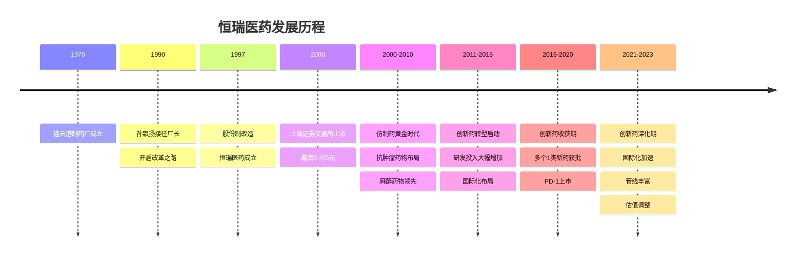
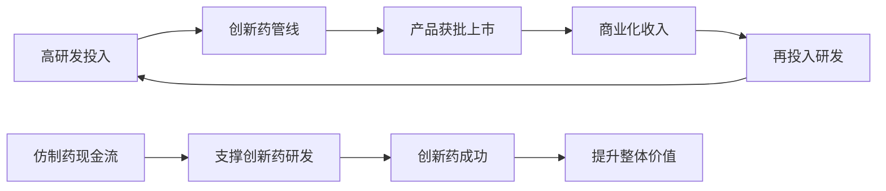
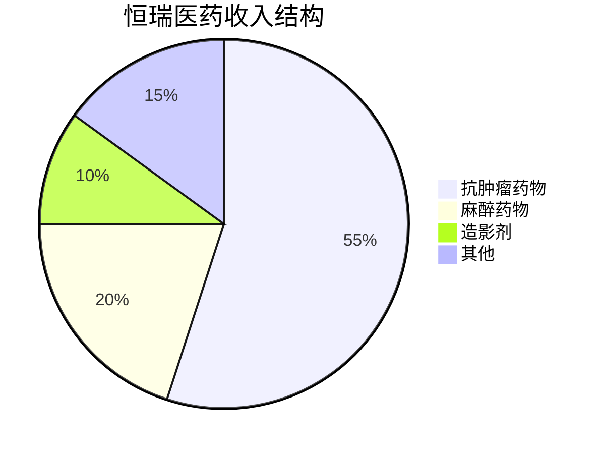
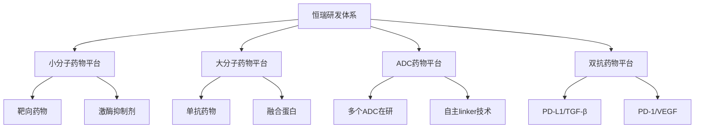
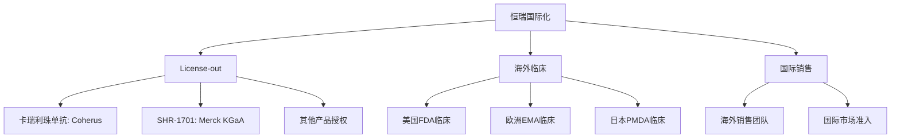

# 恒瑞医药深度研究 - 中国创新药龙头

## 概述

恒瑞医药是中国创新药研发的领军企业，从仿制药起家到创新药转型的成功典范。本文深入分析恒瑞医药的研发体系、产品管线、商业模式和长期投资价值。

**学习目标**：
- 理解恒瑞医药的创新药研发体系
- 分析恒瑞医药的产品管线和商业化能力
- 评估恒瑞医药的国际化战略
- 掌握创新药企业的投资逻辑
- 学习医药行业的研究方法

**为什么重要**：
恒瑞医药是中国医药行业的标杆企业，其从仿制药到创新药的转型路径对整个行业具有示范意义。理解恒瑞医药可以学习如何评估创新药企业的投资价值。

## 公司概况

### 基本信息

**公司全称**：江苏恒瑞医药股份有限公司
**股票代码**：600276.SH
**成立时间**：1970年（前身连云港制药厂），1997年改制
**上市时间**：2000年10月
**总部位置**：江苏省连云港市
**主营业务**：创新药和高端仿制药的研发、生产和销售

**市值规模**（2023年底）：
- 总市值：约3500亿元人民币
- A股医药行业市值第一
- 全球制药企业市值前50

**核心数据**（2023年）：
- 营业收入：260亿元
- 净利润：58亿元
- 研发投入：62亿元（占收入23.8%）
- 研发人员：5200人（占比40%+）
- 在研创新药：50+个

### 发展历程

**关键里程碑**：
- 1990年：孙飘扬接任厂长，开启现代化改革
- 2000年：A股上市，开启资本化道路
- 2011年：艾瑞昔布上市，首个1类新药
- 2018年：卡瑞利珠单抗（PD-1）获批，进入免疫治疗时代
- 2019年：吡咯替尼获批，HER2靶向药
- 2020年：氟唑帕利获批，PARP抑制剂
- 2021年：达尔西利获批，CDK4/6抑制剂
- 2023年：多个创新药进入III期临床

## 商业模式分析

### 核心商业模式

**研发驱动型模式**：

**价值主张**：
- 为患者提供高质量、可及的创新药物
- 为医生提供更多治疗选择
- 为医保提供性价比更高的方案
- 为股东创造长期价值

### 产品结构

**按治疗领域分类**（2023年收入占比）：

**核心产品线**：

**1. 抗肿瘤药物**（收入143亿，占比55%）：
- 创新药：卡瑞利珠单抗（PD-1）、吡咯替尼、氟唑帕利、达尔西利
- 仿制药：多西他赛、伊立替康、奥沙利铂
- 增长驱动：创新药放量，仿制药集采影响

**2. 麻醉药物**（收入52亿，占比20%）：
- 核心产品：瑞马唑仑、右美托咪定、七氟烷
- 市场地位：国内麻醉药龙头
- 竞争优势：产品线完整，质量稳定

**3. 造影剂**（收入26亿，占比10%）：
- 核心产品：碘海醇、碘克沙醇
- 市场地位：国内第一
- 增长驱动：医学影像需求增长

**4. 其他领域**（收入39亿，占比15%）：
- 糖尿病：瑞格列奈
- 心血管：阿托伐他汀
- 其他：多个治疗领域布局

### 销售模式

**销售网络**：
- 销售人员：8000+人
- 覆盖医院：3000+家
- 覆盖城市：全国主要城市
- 学术推广：专业化学术团队

**渠道结构**：
- 医院渠道：80%（主要）
- 零售药店：15%
- 第三终端：5%

**销售策略**：
- 学术推广为主
- 专业化销售团队
- 医生教育和培训
- 临床证据支持

## 创新药研发体系

### 研发投入

**研发费用趋势**：
| 年份 | 研发费用（亿元） | 研发费用率 | 研发人员 |
|------|----------------|-----------|---------|
| 2015 | 9.0 | 9.5% | 1800 |
| 2018 | 26.7 | 15.3% | 3000 |
| 2020 | 49.9 | 19.1% | 4200 |
| 2022 | 60.1 | 22.5% | 5000 |
| 2023 | 62.0 | 23.8% | 5200 |

**研发投入特点**：
- 研发费用率持续提升
- 绝对金额行业领先
- 研发人员占比40%+
- 累计研发投入超300亿

### 研发管线

**在研创新药管线**（2023年底）：

**临床III期**（8个）：
- SHR-1701（PD-L1/TGF-β双抗）：多个适应症
- SHR-1316（PD-L1）：多个适应症
- SHR-1702（PD-1/VEGF双抗）：肝癌等
- SHR-A1811（ADC）：HER2阳性乳腺癌
- SHR-6390（CDK4/6抑制剂）：HR+乳腺癌
- 其他：多个适应症拓展

**临床II期**（15个）：
- SHR-1802（ADC）：多个适应症
- SHR-1906（ADC）：多个适应症
- SHR-2554（FGFR抑制剂）：胆管癌
- SHR-1210联合疗法：多个适应症
- 其他：多个新靶点药物

**临床I期**（20+个）：
- 多个ADC药物
- 多个双抗药物
- 多个小分子靶向药
- 多个新机制药物

**临床前**（10+个）：
- 新靶点探索
- 新技术平台
- 新适应症开发

### 研发平台

**技术平台**：

**研发布局**：
- 连云港研发中心：总部研发基地
- 上海研发中心：创新药研发
- 美国研发中心：国际化研发
- 欧洲研发中心：临床开发

### 研发策略

**Fast Follow策略**：
- 跟随国际前沿靶点
- 快速推进临床开发
- 降低研发风险
- 缩短上市时间

**Me-better策略**：
- 在已有药物基础上改进
- 提升疗效或安全性
- 差异化竞争
- 商业化优势

**First-in-class探索**：
- 新靶点药物开发
- 新技术平台建设
- 长期战略布局
- 提升创新能力

## 核心产品分析

### 卡瑞利珠单抗（PD-1）

**产品概况**：
- 商品名：艾瑞卡
- 靶点：PD-1
- 适应症：多个癌种（肺癌、肝癌、食管癌等）
- 上市时间：2019年5月

**市场表现**：
- 2020年收入：28亿元
- 2021年收入：62亿元
- 2022年收入：75亿元
- 2023年收入：80亿元（预计）

**竞争格局**：
- 国内PD-1市场：信达、君实、恒瑞、百济神州
- 市场份额：约25%
- 竞争优势：适应症多、医保覆盖、学术推广

**增长驱动**：
- 适应症拓展：新适应症获批
- 联合疗法：与其他药物联用
- 医保放量：医保覆盖后放量
- 基层渗透：向基层医院拓展

### 吡咯替尼（HER2靶向药）

**产品概况**：
- 商品名：艾力妥
- 靶点：HER2/EGFR双靶点
- 适应症：HER2阳性乳腺癌
- 上市时间：2018年8月

**市场表现**：
- 2020年收入：12亿元
- 2021年收入：18亿元
- 2022年收入：22亿元
- 2023年收入：25亿元（预计）

**竞争优势**：
- 双靶点设计，疗效优异
- 口服给药，便利性好
- 医保覆盖，可及性强
- 临床证据充分

### 氟唑帕利（PARP抑制剂）

**产品概况**：
- 商品名：艾瑞颐
- 靶点：PARP
- 适应症：卵巢癌维持治疗
- 上市时间：2020年12月

**市场表现**：
- 2021年收入：5亿元
- 2022年收入：10亿元
- 2023年收入：15亿元（预计）

**增长潜力**：
- 适应症拓展：乳腺癌、前列腺癌
- 市场空间大：PARP抑制剂市场快速增长
- 竞争格局：与阿斯利康、再鼎医药竞争

### 达尔西利（CDK4/6抑制剂）

**产品概况**：
- 商品名：艾瑞妥
- 靶点：CDK4/6
- 适应症：HR+/HER2-乳腺癌
- 上市时间：2021年11月

**市场表现**：
- 2022年收入：8亿元
- 2023年收入：18亿元（预计）

**竞争格局**：
- 国内CDK4/6市场：辉瑞、诺华、恒瑞
- 价格优势：国产替代
- 医保覆盖：2023年进入医保

## 国际化战略

### 国际化布局

**海外研发中心**：
- 美国新泽西：临床开发
- 欧洲慕尼黑：临床开发
- 日本东京：亚太临床

**国际合作**：

**License-out交易**：
- 卡瑞利珠单抗：授权Coherus，美国市场
- SHR-1701：授权Merck KGaA，全球权益
- 其他产品：多个产品海外授权谈判中

### 国际化进展

**FDA临床试验**：
- 卡瑞利珠单抗：美国III期临床
- SHR-1701：全球III期临床
- SHR-1316：全球III期临床
- 多个产品：美国I/II期临床

**国际化收入**：
- 2021年：5亿元
- 2022年：8亿元
- 2023年：12亿元（预计）
- 占比：约5%

**国际化目标**：
- 短期：License-out为主，获取里程碑付款
- 中期：部分产品自主商业化
- 长期：成为全球性制药企业

## 财务分析

### 收入增长

**历史收入**（亿元）：
| 年份 | 营业收入 | 同比增长 | 创新药收入 | 仿制药收入 |
|------|---------|---------|-----------|-----------|
| 2015 | 95 | +18% | 5 | 90 |
| 2018 | 174 | +26% | 20 | 154 |
| 2020 | 277 | +19% | 80 | 197 |
| 2022 | 267 | +2% | 140 | 127 |
| 2023 | 260 | -3% | 150 | 110 |

**收入结构变化**：
- 创新药占比：2015年5% → 2023年58%
- 仿制药占比：2015年95% → 2023年42%
- 转型成功：从仿制药为主到创新药为主

**增长驱动**：
- 创新药放量：PD-1、吡咯替尼等
- 新产品上市：达尔西利、氟唑帕利等
- 适应症拓展：现有产品新适应症
- 国际化收入：海外授权和销售

### 盈利能力

**毛利率趋势**：
- 2015年：87%
- 2018年：87%
- 2020年：87%
- 2022年：85%
- 2023年：84%

**毛利率下降原因**：
- 集采影响：仿制药降价
- 产品结构：创新药占比提升但初期毛利率较低
- 竞争加剧：PD-1等产品竞争

**净利率趋势**：
- 2015年：23%
- 2018年：23%
- 2020年：23%
- 2022年：22%
- 2023年：22%

**ROE水平**：
- 2023年：18%
- 行业中等水平
- 受研发投入影响

### 现金流分析

**经营现金流**（2023年）：
- 经营活动现金流：75亿元
- 经营现金流/净利润：129%
- 现金流质量优秀

**资本开支**：
- 2023年资本开支：15亿元
- 主要用于产能扩建和研发设施

**自由现金流**：
- 2023年FCF：60亿元
- FCF/净利润：103%
- 支撑研发投入

### 资产负债表

**资产结构**（2023年底）：
- 总资产：550亿元
- 货币资金：180亿元
- 应收账款：60亿元
- 存货：40亿元

**负债结构**：
- 总负债：120亿元
- 资产负债率：22%
- 几乎无有息负债
- 财务极其稳健

**股东权益**：
- 净资产：430亿元
- 归母净资产：350亿元

## 竞争优势分析

### 核心竞争力

**1. 研发能力**
- 研发投入：行业领先
- 研发管线：丰富且平衡
- 研发效率：Fast Follow策略成功
- 研发团队：经验丰富

**2. 产品管线**
- 已上市创新药：6个
- 临床III期：8个
- 临床II期：15个
- 临床I期：20+个
- 管线价值：数百亿美元

**3. 商业化能力**
- 销售团队：8000+人
- 医院覆盖：3000+家
- 学术推广：专业化团队
- 品牌影响力：行业第一

**4. 财务实力**
- 现金充裕：180亿元
- 无债务压力
- 支撑研发投入
- 抗风险能力强

### 护城河分析

**研发护城河**：
- 持续高研发投入
- 丰富的产品管线
- 多技术平台布局
- 人才团队优势

**品牌护城河**：
- 行业领导地位
- 医生认可度高
- 患者信任度高
- 政府关系良好

**规模护城河**：
- 销售网络完善
- 生产规模优势
- 成本控制能力
- 供应链稳定

## 投资逻辑

### 长期投资价值

**行业成长性**：
- 中国医药市场持续增长
- 创新药占比提升
- 医保支付能力增强
- 人口老龄化驱动

**公司竞争力**：
- 研发能力领先
- 产品管线丰富
- 商业化能力强
- 财务实力雄厚

**估值修复空间**：
- 当前估值：PE 30倍
- 历史估值：PE 50-80倍
- 合理估值：PE 40-50倍
- 修复空间：30-60%

### 投资风险

**研发风险**：
- 临床试验失败
- 新药获批延迟
- 竞争对手领先

**商业化风险**：
- 市场竞争加剧
- 医保谈判降价
- 集采扩围影响

**政策风险**：
- 医保控费
- 集采政策
- 审评审批变化

**估值风险**：
- 估值波动
- 市场情绪
- 流动性风险

## 未来展望

### 短期（2024-2025）

**业务发展**：
- 创新药持续放量
- 新产品陆续获批
- 国际化收入增长
- 研发管线推进

**财务预测**：
- 2024年收入：280亿元
- 2025年收入：320亿元
- 净利率维持20-22%
- ROE保持18-20%

### 中期（2026-2028）

**战略目标**：
- 创新药收入占比80%+
- 国际化收入占比20%+
- 多个重磅产品上市
- 全球化布局完成

### 长期（2029-2035）

**愿景**：
- 成为全球性制药企业
- 创新药全球领先
- 国际化收入占比50%+
- 市值进入全球前20

## 投资策略建议

### 长期持有

**适合投资者**：
- 看好创新药长期趋势
- 认可公司研发能力
- 能承受短期波动
- 投资期限5年以上

**买入时机**：
- 估值合理区间（PE 30-40倍）
- 重磅产品获批
- 国际化突破
- 行业调整期

### 配置建议

**核心持仓**：
- 医药组合30-40%
- 长期持有
- 定期调仓

**风险控制**：
- 分散投资
- 控制仓位
- 关注基本面变化

## 关键学习点

1. **研发驱动是创新药企业的核心**：持续高研发投入，丰富产品管线
2. **Fast Follow策略降低风险**：跟随国际前沿，快速推进
3. **商业化能力同样重要**：好药需要好的销售团队
4. **国际化是必然趋势**：License-out和自主商业化结合
5. **估值需匹配成长性**：创新药企业估值波动大
6. **关注管线价值**：未来产品比当前产品更重要
7. **政策影响显著**：医保、集采政策密切关注
8. **长期持有是王道**：创新药投资需要耐心

## 延伸阅读

### 推荐资料

1. **恒瑞医药年报** - 最权威的公司信息
2. **恒瑞医药投资者交流会** - 管理层战略解读
3. **《创新药投资指南》** - 创新药投资方法
4. **医药魔方** - 医药行业数据平台
5. **券商深度报告** - 中金、中信、国君等

### 研究工具

**数据来源**：
- 公司公告：巨潮资讯网
- 行业数据：医药魔方、Insight数据库
- 临床试验：ClinicalTrials.gov
- 财务数据：Wind、Choice

## 参考文献

1. 恒瑞医药. (2023). 年度报告
2. 恒瑞医药. (2023). 投资者关系活动记录
3. 医药魔方. (2023). 中国创新药行业报告
4. 中金公司. (2023). 恒瑞医药深度报告
5. 中信证券. (2023). 创新药行业研究
6. 国泰君安. (2023). 恒瑞医药投资价值分析
7. IQVIA. (2023). 中国医药市场报告
8. Frost & Sullivan. (2023). 中国创新药市场分析
9. 《医药经济报》. (2023). 恒瑞医药专题
10. 《中国医药报》. (2023). 创新药行业深度

---

**下一步学习**：
- [药明康德分析](./wuxi-apptec.html) - CRO/CDMO龙头
- [迈瑞医疗案例](./mindray.html) - 医疗器械龙头
- [医药行业研究](./overview.html) - 行业全景
