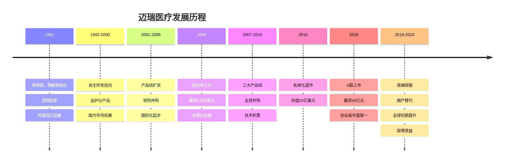
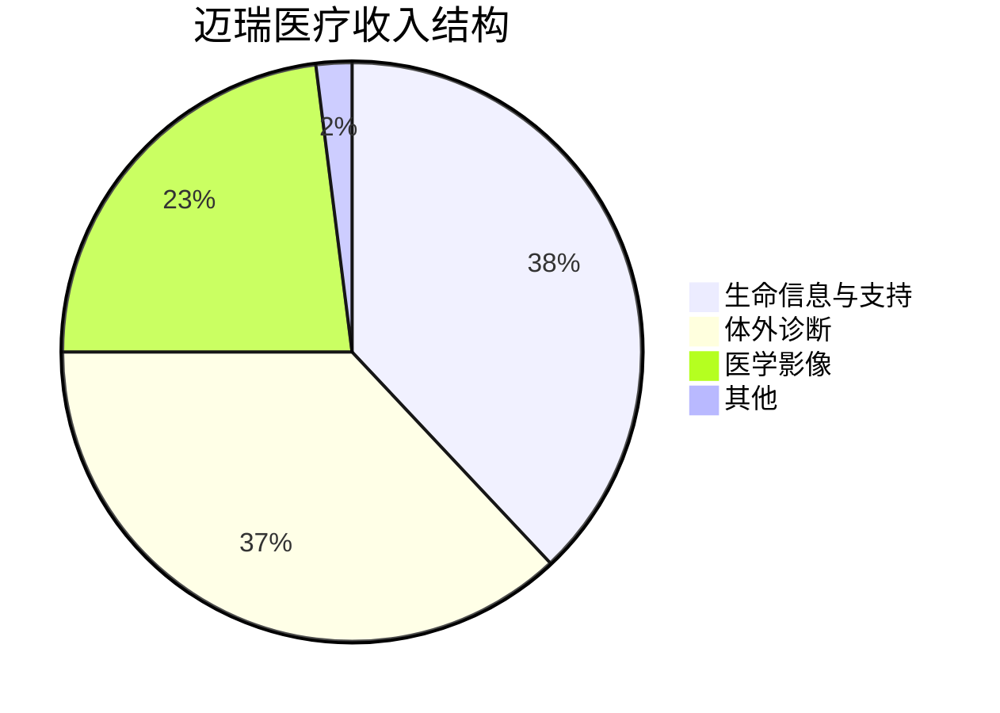
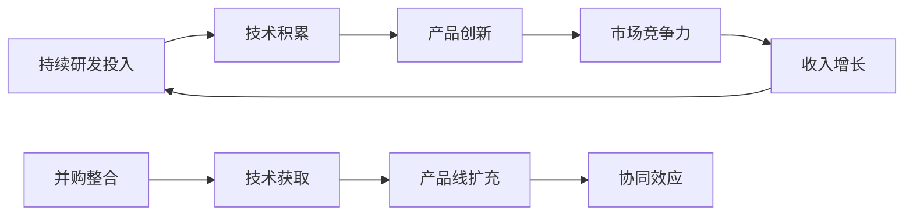
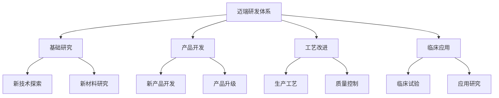
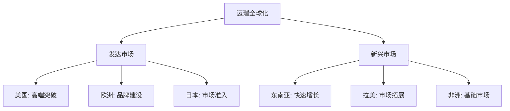
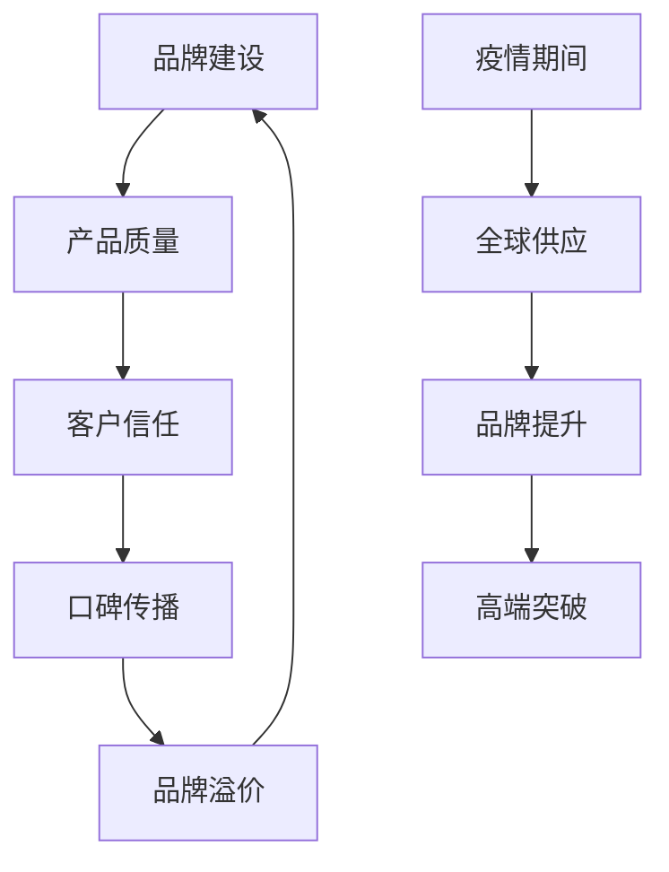

# 迈瑞医疗深度研究 - 中国医疗器械龙头

## 概述

迈瑞医疗是中国最大的医疗器械企业，也是全球领先的医疗器械供应商。从监护仪起家到三大产品线全面发展，迈瑞医疗走出了一条中国医疗器械企业的国际化之路。

**学习目标**：
- 理解迈瑞医疗的产品矩阵和技术优势
- 分析迈瑞医疗的全球化战略
- 评估迈瑞医疗的竞争优势和护城河
- 掌握医疗器械行业的投资逻辑
- 学习制造业企业的全球化路径

**为什么重要**：
迈瑞医疗是中国医疗器械行业的标杆企业，其全球化战略和技术创新对整个行业具有示范意义。理解迈瑞医疗可以学习如何评估制造业企业的国际竞争力。

## 公司概况

### 基本信息

**公司全称**：深圳迈瑞生物医疗电子股份有限公司
**股票代码**：300760.SZ
**成立时间**：1991年
**上市时间**：2018年10月（A股创业板）
**总部位置**：广东省深圳市
**主营业务**：医疗器械的研发、制造、营销及服务

**市值规模**（2023年底）：
- 总市值：约4200亿元人民币
- A股医疗器械行业第一
- 全球医疗器械企业前50

**核心数据**（2023年）：
- 营业收入：380亿元（+20%）
- 净利润：105亿元（+22%）
- 研发投入：42亿元（占收入11%）
- 研发人员：3500人（占比27%）
- 全球客户：超过19万家
- 产品覆盖：190+个国家和地区

### 发展历程

**关键里程碑**：
- 1991年：公司成立，注册资本200万元
- 1992年：第一台监护仪下线
- 2000年：收购深圳安科，进入麻醉机领域
- 2002年：收购武汉中旗，进入血液分析领域
- 2006年：纽交所上市，成为中国医疗器械第一股
- 2008年：收购Datascope监护业务
- 2013年：收购ZONARE超声业务
- 2016年：私有化退市
- 2018年：A股上市，创业板最大IPO
- 2020年：疫情期间全球供应呼吸机、监护仪
- 2023年：营收突破380亿，净利润超100亿

## 商业模式分析

### 三大产品线

**产品矩阵**（2023年收入占比）：

**生命信息与支持**（收入144亿，占比38%）：
- 核心产品：监护仪、除颤仪、麻醉机、呼吸机、输注泵
- 市场地位：监护仪全球第三、中国第一
- 增长驱动：高端产品放量、国产替代、海外拓展
- 毛利率：65%

**体外诊断**（收入141亿，占比37%）：
- 核心产品：血液分析仪、生化分析仪、化学发光免疫分析仪
- 市场地位：血液分析中国第一、全球前五
- 增长驱动：试剂耗材持续增长、装机量提升
- 毛利率：68%

**医学影像**（收入87亿，占比23%）：
- 核心产品：彩超、黑白超、数字X线机
- 市场地位：彩超中国第三、全球前十
- 增长驱动：高端彩超放量、基层市场拓展
- 毛利率：70%

### 商业模式特点

**研发驱动**：

**全球化布局**：
- 研发：中国、美国、欧洲
- 生产：中国为主，美国、欧洲补充
- 销售：全球190+国家和地区
- 服务：本地化服务团队

**盈利模式**：
- 设备销售：一次性收入
- 试剂耗材：持续性收入（体外诊断）
- 售后服务：增值服务收入
- 升级换代：存量市场机会

### 客户结构

**按地区分类**（2023年收入）：
- 中国：220亿元（58%）
- 国际：160亿元（42%）
  - 美国：50亿元
  - 欧洲：40亿元
  - 亚太：40亿元
  - 其他：30亿元

**按客户类型**：
- 三甲医院：40%
- 二级医院：30%
- 基层医疗：20%
- 海外医院：10%

**客户数量**：
- 全球客户：19万+家
- 中国医院：3万+家
- 海外医院：16万+家
- 客户留存率：95%+

## 产品技术分析

### 生命信息与支持

**监护仪**：
- 产品系列：BeneView系列、uMEC系列
- 技术特点：
  - 高精度传感器
  - 智能算法
  - 模块化设计
  - 互联互通
- 市场地位：全球第三、中国第一
- 竞争对手：飞利浦、GE医疗

**呼吸机**：
- 产品系列：SV系列、SynoVent系列
- 技术特点：
  - 精准控制
  - 智能模式
  - 肺保护通气
  - 无创有创一体
- 市场地位：中国前三
- 疫情期间：全球供应，品牌提升

**麻醉机**：
- 产品系列：A系列、WATO系列
- 技术特点：
  - 精准麻醉
  - 低流量麻醉
  - 智能监测
  - 安全保护
- 市场地位：中国第二

### 体外诊断

**血液分析仪**：
- 产品系列：BC系列、CAL系列
- 技术特点：
  - 五分类、七分类
  - 高通量
  - 高精度
  - 智能审核
- 市场地位：中国第一、全球前五
- 装机量：10万+台

**生化分析仪**：
- 产品系列：BS系列、CL系列
- 技术特点：
  - 全自动
  - 高通量
  - 模块化
  - 生化免疫一体
- 市场地位：中国前三

**化学发光免疫分析仪**：
- 产品系列：CL系列
- 技术特点：
  - 磁微粒化学发光
  - 高灵敏度
  - 宽检测范围
  - 快速检测
- 市场地位：中国前五
- 增长潜力：国产替代空间大

### 医学影像

**彩超**：
- 产品系列：Resona系列、DC系列、TE系列
- 技术特点：
  - 域成像技术
  - 智能导航
  - 高清成像
  - AI辅助诊断
- 市场地位：中国第三、全球前十
- 高端突破：Resona系列对标GE、飞利浦

**数字X线机**：
- 产品系列：DigiEye系列
- 技术特点：
  - 数字化成像
  - 低剂量
  - 高清晰度
  - 移动便携
- 市场地位：中国前五

## 研发创新体系

### 研发投入

**研发费用趋势**：
| 年份 | 研发费用（亿元） | 研发费用率 | 研发人员 |
|------|----------------|-----------|---------|
| 2015 | 10.0 | 12.0% | 1500 |
| 2018 | 14.2 | 10.3% | 2000 |
| 2020 | 21.0 | 10.0% | 2600 |
| 2022 | 32.0 | 10.0% | 3200 |
| 2023 | 42.0 | 11.0% | 3500 |

**研发投入特点**：
- 研发费用率稳定在10-12%
- 绝对金额持续增长
- 研发人员占比27%
- 累计研发投入超200亿

### 研发布局

**全球研发中心**：
- 深圳总部：核心研发基地
- 南京研发中心：生命信息与支持
- 北京研发中心：医学影像
- 西安研发中心：体外诊断
- 美国硅谷：前沿技术
- 美国新泽西：超声技术
- 美国西雅图：软件开发

**研发体系**：

### 技术创新

**核心技术**：
- 域成像技术（超声）
- 磁微粒化学发光技术（IVD）
- 智能算法（监护）
- 模块化平台（多产品线）

**专利储备**：
- 专利申请总量：5000+件
- 发明专利：3500+件
- 国际专利：1000+件
- 专利授权率：80%+

**技术合作**：
- 与高校合作：清华、北大、中科院
- 与医院合作：协和、301、华西
- 与企业合作：国际技术引进

## 全球化战略

### 国际化布局

**海外收入占比**：
- 2015年：30%
- 2018年：42%
- 2020年：50%（疫情影响）
- 2023年：42%

**区域布局**：

**美国市场**：
- 收入：50亿元
- 策略：高端产品突破
- 客户：顶级医院、连锁医院
- 挑战：FDA认证、品牌认知

**欧洲市场**：
- 收入：40亿元
- 策略：品牌建设、渠道拓展
- 客户：公立医院、私立诊所
- 优势：性价比、服务响应

**新兴市场**：
- 收入：70亿元
- 策略：快速渗透、本地化
- 客户：各级医院
- 优势：价格、服务、培训

### 国际化优势

**产品竞争力**：
- 性能：接近国际一线品牌
- 价格：低30-50%
- 服务：响应快、本地化
- 性价比：极具竞争力

**品牌影响力**：
- 疫情期间：全球供应呼吸机、监护仪
- 品牌提升：进入欧美顶级医院
- 口碑传播：客户推荐
- 认证齐全：FDA、CE、CFDA

**本地化服务**：
- 销售团队：本地化
- 服务网络：全球覆盖
- 培训体系：专业化
- 响应速度：24小时

### 国际化挑战

**品牌认知**：
- 高端市场：品牌认知度低
- 医生习惯：使用习惯固化
- 采购惯性：倾向国际品牌

**技术壁垒**：
- 核心技术：部分依赖进口
- 专利壁垒：国际巨头专利布局
- 标准制定：话语权不足

**贸易摩擦**：
- 关税影响
- 技术封锁
- 市场准入限制

## 竞争优势分析

### 核心竞争力

**1. 产品矩阵优势**
- 三大产品线：生命信息、体外诊断、医学影像
- 产品齐全：覆盖医院主要科室
- 协同效应：一站式采购
- 交叉销售：客户粘性强

**2. 技术研发优势**
- 研发投入：行业领先
- 研发团队：3500人
- 技术积累：30年经验
- 创新能力：持续推出新品

**3. 全球化优势**
- 全球布局：190+国家
- 品牌提升：疫情期间全球供应
- 本地化服务：快速响应
- 规模效应：成本优势

**4. 性价比优势**
- 性能：接近国际一线
- 价格：低30-50%
- 服务：本地化、快速响应
- 综合优势：极具竞争力

**5. 渠道优势**
- 国内：覆盖3万+医院
- 海外：19万+客户
- 经销商：全球网络
- 直销团队：专业化

### 护城河分析

**品牌护城河**：

**技术护城河**：
- 持续研发投入
- 技术积累深厚
- 专利布局完善
- 创新能力强

**规模护城河**：
- 产能规模大
- 采购成本低
- 研发分摊
- 品牌影响力

**客户护城河**：
- 客户数量多：19万+
- 客户粘性强：产品矩阵
- 转换成本高：培训、习惯
- 持续服务：试剂耗材

## 财务分析

### 收入增长

**历史收入**（亿元）：
| 年份 | 营业收入 | 同比增长 | 国内收入 | 海外收入 |
|------|---------|---------|---------|---------|
| 2015 | 80 | +8% | 56 | 24 |
| 2018 | 138 | +23% | 80 | 58 |
| 2020 | 210 | +27% | 105 | 105 |
| 2022 | 303 | +20% | 175 | 128 |
| 2023 | 380 | +20% | 220 | 160 |

**增长驱动**：
- 国产替代：高端产品突破
- 基层扩容：分级诊疗政策
- 海外拓展：全球化加速
- 产品创新：新品持续推出
- 疫情受益：呼吸机、监护仪需求

### 盈利能力

**毛利率趋势**：
- 2015年：65%
- 2018年：66%
- 2020年：67%
- 2022年：66%
- 2023年：66%

**毛利率分析**：
- 生命信息与支持：65%
- 体外诊断：68%（试剂耗材占比提升）
- 医学影像：70%
- 整体：66-68%

**净利率趋势**：
- 2015年：20%
- 2018年：23%
- 2020年：28%
- 2022年：27%
- 2023年：28%

**净利率提升原因**：
- 规模效应
- 费用率下降
- 高毛利产品占比提升
- 运营效率提升

**ROE水平**：
- 2023年：30%
- 行业领先水平
- 轻资产模式
- 资本效率高

### 现金流分析

**经营现金流**（2023年）：
- 经营活动现金流：130亿元
- 经营现金流/净利润：124%
- 现金流质量优秀

**资本开支**：
- 2023年资本开支：25亿元
- 主要用于产能扩张和研发设施
- 资本开支/收入：7%
- 轻资产特征

**自由现金流**：
- 2023年FCF：105亿元
- FCF/净利润：100%
- 支撑分红和扩张

### 资产负债表

**资产结构**（2023年底）：
- 总资产：550亿元
- 固定资产：80亿元
- 货币资金：200亿元
- 应收账款：80亿元

**负债结构**：
- 总负债：150亿元
- 资产负债率：27%
- 几乎无有息负债
- 财务极其稳健

**股东权益**：
- 净资产：400亿元
- 归母净资产：380亿元

## 行业地位

### 全球医疗器械市场

**市场规模**（2023年）：
- 全球医疗器械市场：5000亿美元
- 中国医疗器械市场：1000亿美元
- 年增长率：5-7%

**细分市场**：
- 生命信息与支持：800亿美元
- 体外诊断：900亿美元
- 医学影像：500亿美元

**竞争格局**：
- 迈瑞医疗：全球前50
- 监护仪：全球第三
- 血液分析：全球前五
- 市场份额：约1%

### 主要竞争对手

**全球竞争对手**：
| 公司 | 市值 | 收入 | 主要产品 |
|------|------|------|---------|
| 迈瑞医疗 | 4200亿 | 380亿 | 三大产品线 |
| 飞利浦医疗 | 300亿欧元 | 180亿欧元 | 影像、监护 |
| GE医疗 | 300亿美元 | 180亿美元 | 影像、监护 |
| 西门子医疗 | 600亿欧元 | 200亿欧元 | 影像、诊断 |
| 罗氏诊断 | - | 150亿瑞郎 | 体外诊断 |

**竞争优势**：
- 性价比：价格低30-50%
- 服务：本地化、快速响应
- 产品线：三大产品线协同
- 增长：增速远超国际巨头

### 中国市场地位

**国内竞争格局**：
- 迈瑞医疗：绝对龙头
- 联影医疗：影像设备
- 万东医疗：X线设备
- 理邦仪器：监护设备

**市场份额**：
- 监护仪：约40%
- 血液分析：约30%
- 彩超：约15%
- 综合市场份额：约20%

## 投资逻辑

### 长期投资价值

**行业成长性**：
- 医疗需求持续增长
- 国产替代加速
- 基层扩容
- 全球化机会

**公司竞争力**：
- 产品矩阵完善
- 技术持续创新
- 全球化布局
- 品牌影响力提升

**盈利能力**：
- ROE 30%+
- 净利率28%
- 现金流充沛
- 分红能力强

### 增长驱动因素

**国产替代**：
- 高端产品突破
- 三甲医院渗透
- 政策支持
- 性价比优势

**基层扩容**：
- 分级诊疗政策
- 基层医疗建设
- 设备更新需求
- 市场空间大

**全球化**：
- 品牌提升
- 高端市场突破
- 新兴市场拓展
- 收入占比提升

**产品创新**：
- 新品持续推出
- 技术升级
- 产品线扩充
- 竞争力提升

### 估值分析

**历史估值**：
- 2018年PE：40倍
- 2020年PE：60倍（疫情高点）
- 2022年PE：30倍（低点）
- 2023年PE：40倍

**合理估值区间**：
- 成长期：PE 40-50倍
- 成熟期：PE 30-40倍
- 当前阶段：PE 35-45倍合理

**估值方法**：
- PE估值：考虑增长速度
- PEG估值：1-1.5倍
- DCF估值：长期现金流折现
- 分部估值：各产品线分别估值

### 投资风险

**竞争风险**：
- 国际巨头竞争
- 国内企业追赶
- 价格战
- 市场份额波动

**技术风险**：
- 技术迭代
- 研发失败
- 专利诉讼
- 核心部件依赖进口

**政策风险**：
- 集采降价
- 医保控费
- 贸易摩擦
- 市场准入限制

**汇率风险**：
- 海外收入占比42%
- 汇率波动影响
- 对冲成本

## 未来展望

### 短期（2024-2025）

**业务发展**：
- 收入增长15-20%
- 高端产品放量
- 海外市场拓展
- 新品持续推出

**财务预测**：
- 2024年收入：440亿元
- 2025年收入：510亿元
- 净利率维持27-28%
- ROE保持30%+

### 中期（2026-2028）

**战略目标**：
- 收入突破700亿元
- 海外收入占比50%+
- 高端市场份额提升
- 新产品线拓展

### 长期（2029-2035）

**愿景**：
- 全球医疗器械前20
- 收入突破1000亿元
- 海外收入占比60%+
- 技术全球领先

**技术方向**：
- AI辅助诊断
- 远程医疗
- 精准医疗
- 智能化设备

## 投资策略建议

### 长期持有

**适合投资者**：
- 看好医疗器械长期趋势
- 认可公司全球化战略
- 能承受短期波动
- 投资期限5年以上

**买入时机**：
- 估值合理区间（PE 30-40倍）
- 高端产品突破
- 海外订单超预期
- 行业调整期

### 配置建议

**核心持仓**：
- 医疗组合30-40%
- 长期持有
- 定期调仓

**风险控制**：
- 关注竞争格局
- 监控海外拓展
- 跟踪新品进展
- 评估估值水平

## 关键学习点

1. **产品矩阵的协同效应**：三大产品线覆盖医院主要科室，交叉销售
2. **全球化是必然趋势**：从新兴市场到发达市场，品牌逐步提升
3. **性价比是核心竞争力**：性能接近国际一线，价格低30-50%
4. **国产替代空间巨大**：高端市场突破，三甲医院渗透
5. **研发投入持续**：研发费用率10-12%，技术持续创新
6. **轻资产高ROE模式**：ROE 30%+，资本效率高
7. **现金流质量优秀**：经营现金流/净利润>100%
8. **估值需匹配成长**：成长期给予溢价，关注PEG

## 延伸阅读

### 推荐资料

1. **迈瑞医疗年报** - 最权威的公司信息
2. **迈瑞医疗投资者交流会** - 管理层战略解读
3. **《医疗器械行业研究》** - 行业分析
4. **Evaluate MedTech报告** - 全球市场数据
5. **券商深度报告** - 中金、中信、国君等

### 研究工具

**数据来源**：
- 公司公告：巨潮资讯网
- 行业数据：Evaluate MedTech、Frost & Sullivan
- 财务数据：Wind、Choice
- 新闻资讯：财联社、医疗器械创新网

## 参考文献

1. 迈瑞医疗. (2023). 年度报告
2. 迈瑞医疗. (2023). 投资者关系活动记录
3. Evaluate MedTech. (2023). World Preview Report
4. Frost & Sullivan. (2023). Global Medical Device Market
5. 中金公司. (2023). 迈瑞医疗深度报告
6. 中信证券. (2023). 医疗器械行业研究
7. 国泰君安. (2023). 迈瑞医疗投资价值分析
8. 《医疗器械蓝皮书》. (2023). 中国医疗器械行业发展报告
9. 《中国医疗器械》杂志. (2023). 行业专题
10. 医疗器械创新网. (2023). 行业动态

---

**下一步学习**：
- [恒瑞医药分析](./hengrui.html) - 创新药龙头
- [药明康德分析](./wuxi-apptec.html) - CRO/CDMO龙头
- [医疗器械行业](./overview.html) - 行业全景
