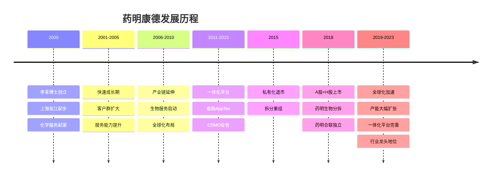
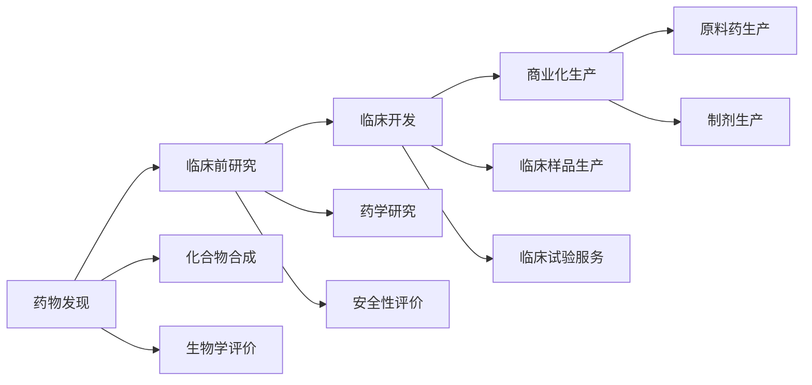
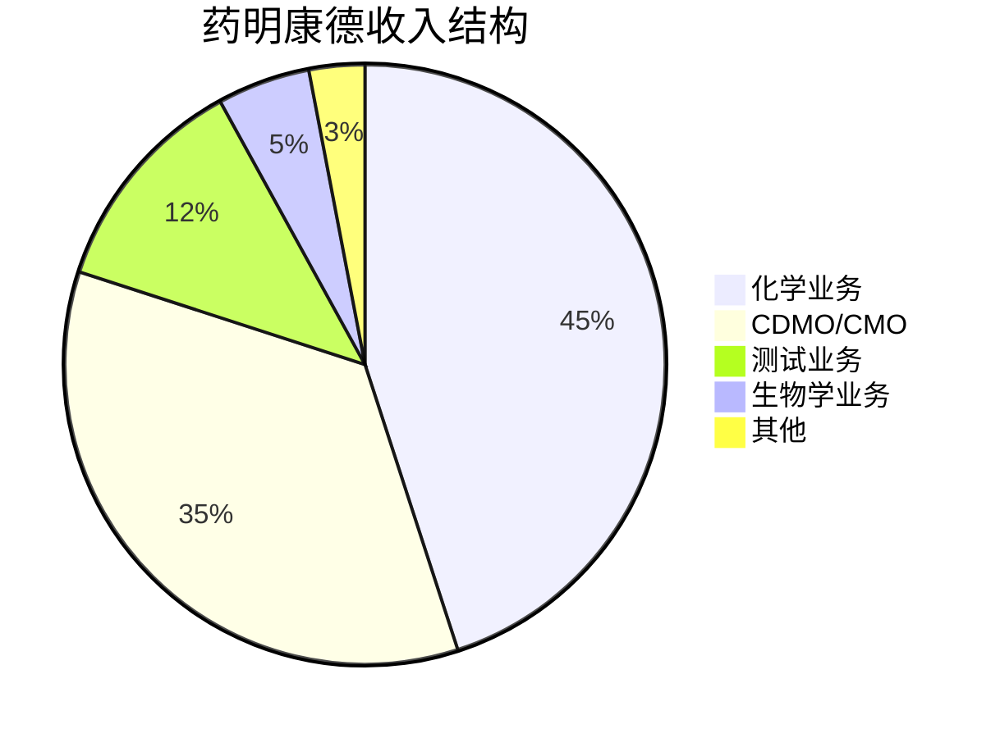
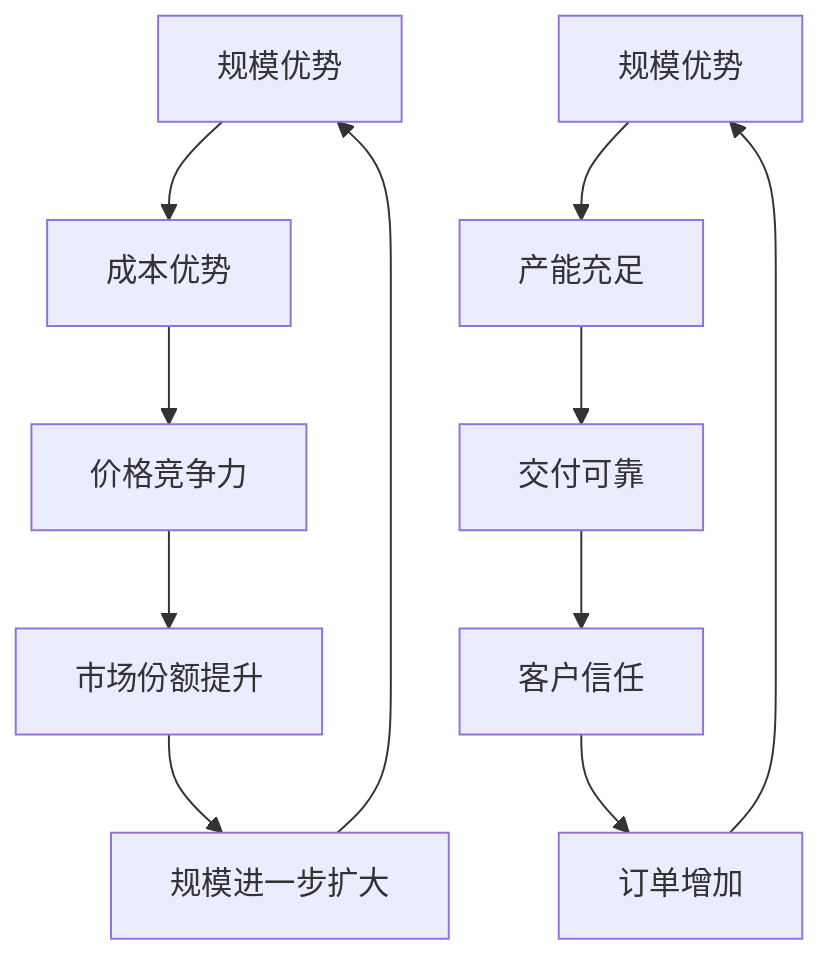

# 药明康德深度研究 - 全球CRO/CDMO龙头

## 概述

药明康德是全球领先的医药研发服务外包企业，提供从药物发现到商业化生产的一体化服务平台。本文深入分析药明康德的商业模式、全球布局、竞争优势和长期投资价值。

**学习目标**：
- 理解CRO/CDMO行业的商业模式
- 分析药明康德的一体化平台优势
- 评估药明康德的全球化战略
- 掌握医药外包行业的投资逻辑
- 学习平台型企业的研究方法

**为什么重要**：
药明康德是中国医药外包行业的开创者和领导者，其"赋能全球"的商业模式对整个行业具有示范意义。理解药明康德可以学习如何评估平台型企业的投资价值。

## 公司概况

### 基本信息

**公司全称**：无锡药明康德新药开发股份有限公司
**股票代码**：603259.SH / 02359.HK
**成立时间**：2000年12月
**上市时间**：2018年5月（A股）、2018年12月（H股）
**总部位置**：江苏省无锡市
**主营业务**：医药研发服务外包（CRO/CDMO）

**市值规模**（2023年底）：
- A股市值：约2800亿元人民币
- H股市值：约400亿港币
- 全球CRO/CDMO企业前五

**核心数据**（2023年）：
- 营业收入：393亿元（+21%）
- 净利润：105亿元（+28%）
- 客户数量：6000+
- 员工人数：4.6万人
- 全球布局：30+个国家和地区

### 发展历程

**关键里程碑**：
- 2000年：李革博士回国创业，注册资本40万美元
- 2007年：纽交所上市，成为中国CRO第一股
- 2011年：收购AppTec，进入CDMO领域
- 2015年：私有化退市，估值33亿美元
- 2017年：药明生物分拆在港股上市
- 2018年：A股上市，募资57亿元；H股上市
- 2020年：收购辉瑞杭州工厂，产能大幅提升
- 2023年：全球员工4.6万人，服务客户6000+

## 商业模式分析

### 一体化服务平台

**CRDMO平台**（Chemistry Research Development Manufacturing Organization）：

**服务内容**：
1. **化学业务**：小分子药物发现和开发
2. **测试业务**：安全性评价、分析测试
3. **生物学业务**：生物学研究、DMPK
4. **CDMO/CMO业务**：临床和商业化生产
5. **细胞及基因疗法CTDMO**：CGT服务

**平台优势**：
- 一站式服务：覆盖全产业链
- 无缝衔接：各环节高效协同
- 降低成本：减少客户管理成本
- 缩短周期：加快药物开发进度

### 业务结构

**按业务分类**（2023年收入占比）：

**化学业务**（收入177亿，占比45%）：
- 服务内容：化合物合成、工艺开发、药学研究
- 客户类型：全球制药企业、生物技术公司
- 增长驱动：新药研发需求增长、渗透率提升
- 竞争优势：规模最大、能力最全、效率最高

**CDMO/CMO业务**（收入138亿，占比35%）：
- 服务内容：原料药、制剂的临床和商业化生产
- 产能布局：中国、美国、欧洲
- 增长驱动：客户产品商业化、产能扩张
- 竞争优势：质量体系完善、产能充足、交付可靠

**测试业务**（收入47亿，占比12%）：
- 服务内容：安全性评价、分析测试、医疗器械检测
- 设施：GLP实验室、分析中心
- 增长驱动：监管要求提升、外包渗透率提升
- 竞争优势：资质齐全、设施先进、经验丰富

**生物学业务**（收入20亿，占比5%）：
- 服务内容：生物学研究、DMPK、生物分析
- 技术平台：体外、体内模型
- 增长驱动：生物药研发增长
- 竞争优势：技术平台完善

### 客户结构

**客户数量**：
- 总客户数：6000+
- 活跃客户：5000+
- 全球前20大制药企业：全覆盖
- 生物技术公司：3000+

**客户分布**：
- 北美：60%
- 欧洲：20%
- 中国：15%
- 其他：5%

**客户关系**：
- 长期合作：平均合作10年+
- 深度绑定：全产业链服务
- 高粘性：转换成本高
- 持续增长：客户产品管线推进

**收入集中度**：
- 前五大客户：约20%
- 前十大客户：约30%
- 分散度高：降低依赖风险

## 全球化布局

### 产能布局

**中国基地**：
- 上海：总部、化学服务
- 无锡：化学服务、CDMO
- 苏州：生物学服务、测试
- 南京：CDMO
- 天津：测试业务
- 成都：化学服务
- 合肥：CDMO（在建）

**美国基地**：
- 新泽西：化学服务
- 费城：CDMO
- 特拉华：测试业务
- 德州：CDMO（在建）

**欧洲基地**：
- 英国：化学服务
- 德国：CDMO
- 爱尔兰：CDMO（规划）

**产能规模**（2023年底）：
- 化学服务：实验室面积50万平米
- CDMO产能：原料药500吨、制剂100亿片/粒
- 测试业务：GLP实验室20+个
- 员工总数：4.6万人

### 全球化优势

**本地化服务**：
- 就近服务客户
- 缩短交付周期
- 降低物流成本
- 提升响应速度

**合规优势**：
- 符合各国监管要求
- FDA、EMA、NMPA认证
- GMP、GLP资质齐全
- 质量体系完善

**供应链安全**：
- 多地生产备份
- 降低地缘政治风险
- 保障供应稳定
- 客户信心提升

## 竞争优势分析

### 核心竞争力

**1. 一体化平台优势**
- 全产业链覆盖
- 无缝衔接服务
- 降低客户成本
- 缩短开发周期

**2. 规模优势**
- 全球最大CRO/CDMO
- 产能充足
- 成本优势
- 议价能力强

**3. 技术能力**
- 多技术平台
- 经验丰富
- 成功案例多
- 质量可靠

**4. 客户资源**
- 客户数量最多
- 全球覆盖
- 长期合作
- 高粘性

**5. 人才优势**
- 员工4.6万人
- 高学历占比高
- 经验丰富
- 培训体系完善

### 护城河分析

**规模护城河**：

**客户护城河**：
- 客户数量多：6000+
- 客户质量高：全球前20大药企全覆盖
- 合作时间长：平均10年+
- 转换成本高：全产业链服务

**技术护城河**：
- 多技术平台
- 经验积累
- 质量体系
- 监管认证

**网络效应**：
- 客户越多，经验越丰富
- 经验越丰富，服务越好
- 服务越好，客户越多
- 正向循环

## 财务分析

### 收入增长

**历史收入**（亿元）：
| 年份 | 营业收入 | 同比增长 | 化学业务 | CDMO业务 |
|------|---------|---------|---------|---------|
| 2018 | 96 | - | 55 | 25 |
| 2019 | 129 | +34% | 72 | 35 |
| 2020 | 165 | +28% | 90 | 48 |
| 2021 | 229 | +39% | 115 | 75 |
| 2022 | 325 | +42% | 150 | 115 |
| 2023 | 393 | +21% | 177 | 138 |

**增长驱动**：
- 全球新药研发投入增长
- 外包渗透率提升
- 客户数量增长
- 产能扩张
- 客户产品商业化

**增长质量**：
- 有机增长为主
- 客户留存率95%+
- 订单饱满
- 可持续性强

### 盈利能力

**毛利率趋势**：
- 2018年：38%
- 2020年：40%
- 2022年：38%
- 2023年：37%

**毛利率分析**：
- 化学业务：40-45%（高毛利）
- CDMO业务：30-35%（中等毛利）
- 测试业务：45-50%（高毛利）
- 整体：37-40%

**净利率趋势**：
- 2018年：15%
- 2020年：20%
- 2022年：28%
- 2023年：27%

**净利率提升原因**：
- 规模效应
- 运营效率提升
- 高毛利业务占比提升
- 费用率下降

**ROE水平**：
- 2023年：25%
- 行业领先水平
- 轻资产模式
- 资本效率高

### 现金流分析

**经营现金流**（2023年）：
- 经营活动现金流：120亿元
- 经营现金流/净利润：114%
- 现金流质量优秀

**资本开支**：
- 2023年资本开支：80亿元
- 主要用于产能扩张
- 资本开支/收入：20%
- 扩张期特征

**自由现金流**：
- 2023年FCF：40亿元
- FCF/净利润：38%
- 支撑扩张需求

### 资产负债表

**资产结构**（2023年底）：
- 总资产：800亿元
- 固定资产：250亿元
- 在建工程：100亿元
- 货币资金：200亿元

**负债结构**：
- 总负债：350亿元
- 资产负债率：44%
- 有息负债：100亿元
- 财务稳健

**股东权益**：
- 净资产：450亿元
- 归母净资产：420亿元

## 行业地位

### 全球CRO/CDMO市场

**市场规模**（2023年）：
- 全球CRO市场：800亿美元
- 全球CDMO市场：1200亿美元
- 合计：2000亿美元
- 年增长率：8-10%

**增长驱动**：
- 新药研发投入增长
- 外包渗透率提升
- 生物药占比提升
- 新兴市场增长

**竞争格局**：
- 药明康德：全球前五
- 化学CRO：全球第一
- 小分子CDMO：全球前三
- 市场份额：约5%

### 主要竞争对手

**全球竞争对手**：
| 公司 | 市值 | 收入 | 业务特点 |
|------|------|------|---------|
| 药明康德 | 2800亿 | 393亿 | 一体化平台 |
| Lonza | 400亿瑞郎 | 60亿瑞郎 | 生物药CDMO |
| Catalent | 150亿美元 | 50亿美元 | 制剂CDMO |
| Charles River | 150亿美元 | 40亿美元 | 临床前CRO |
| IQVIA | 400亿美元 | 150亿美元 | 临床CRO |

**竞争优势**：
- 成本优势：中国制造成本低30-50%
- 效率优势：交付周期短20-30%
- 规模优势：产能充足
- 一体化优势：全产业链服务

### 中国市场地位

**国内竞争格局**：
- 药明康德：绝对龙头
- 康龙化成：第二梯队
- 泰格医药：临床CRO龙头
- 药明生物：生物药CDMO龙头

**市场份额**：
- 化学CRO：约40%
- 小分子CDMO：约30%
- 综合市场份额：约35%

## 投资逻辑

### 长期投资价值

**行业成长性**：
- 全球新药研发投入持续增长
- 外包渗透率持续提升
- 中国CRO/CDMO全球竞争力提升
- 行业空间巨大

**公司竞争力**：
- 一体化平台优势
- 规模优势
- 成本优势
- 客户资源

**盈利能力**：
- ROE 25%+
- 净利率27%
- 现金流充沛
- 分红能力强

### 增长驱动因素

**需求端**：
- 全球新药研发投入增长
- 生物技术公司增多
- 外包渗透率提升
- 中国创新药崛起

**供给端**：
- 产能持续扩张
- 服务能力提升
- 全球化布局
- 技术平台完善

**竞争力提升**：
- 规模效应
- 经验积累
- 品牌影响力
- 客户粘性

### 估值分析

**历史估值**：
- 2018年PE：40倍
- 2020年PE：80倍（高点）
- 2022年PE：25倍（低点）
- 2023年PE：30倍

**合理估值区间**：
- 成长期：PE 35-45倍
- 成熟期：PE 25-35倍
- 当前阶段：PE 30-40倍合理

**估值方法**：
- PE估值：考虑增长速度
- PEG估值：1-1.5倍
- DCF估值：长期现金流折现
- 分部估值：各业务分别估值

### 投资风险

**政策风险**：
- 中美科技脱钩
- 生物安全法案
- 客户流失风险
- 业务受限

**竞争风险**：
- 产能过剩
- 价格战
- 竞争对手追赶
- 市场份额下降

**扩张风险**：
- 产能利用率下降
- 资本开支过大
- 管理难度增加
- 整合风险

**客户集中度风险**：
- 大客户依赖
- 订单波动
- 议价能力下降

## 未来展望

### 短期（2024-2025）

**业务发展**：
- 收入增长20%+
- CDMO业务加速
- 产能持续扩张
- 客户数量增长

**财务预测**：
- 2024年收入：470亿元
- 2025年收入：560亿元
- 净利率维持25-27%
- ROE保持25%+

### 中期（2026-2028）

**战略目标**：
- 收入突破800亿元
- CDMO业务占比50%+
- 全球化布局完成
- 技术平台升级

**产能规划**：
- 化学服务：实验室面积翻倍
- CDMO产能：原料药1000吨
- 全球布局：美国、欧洲产能大幅提升

### 长期（2029-2035）

**愿景**：
- 全球CRO/CDMO领导者
- 收入突破1500亿元
- 全球化收入占比70%+
- 技术平台全球领先

**技术方向**：
- AI制药平台
- 自动化实验室
- 数字化管理
- 绿色制造

## 投资策略建议

### 长期持有

**适合投资者**：
- 看好医药外包长期趋势
- 认可公司平台优势
- 能承受短期波动
- 投资期限5年以上

**买入时机**：
- 估值合理区间（PE 25-35倍）
- 政策不确定性消除
- 业绩超预期
- 行业调整期

### 波段操作

**买入信号**：
- PE低于25倍
- 订单超预期
- 产能投产
- 政策利好

**卖出信号**：
- PE高于45倍
- 政策风险加大
- 竞争格局恶化
- 业绩不达预期

### 配置建议

**核心持仓**：
- 医药组合30-40%
- 长期持有
- 定期调仓

**风险控制**：
- 关注政策变化
- 监控客户集中度
- 跟踪产能利用率
- 评估竞争格局

## 关键学习点

1. **平台型商业模式的价值**：一体化服务平台降低客户成本，提升粘性
2. **规模效应显著**：规模越大，成本越低，竞争力越强
3. **全球化是必然趋势**：本地化服务，降低地缘政治风险
4. **客户资源是核心资产**：6000+客户，高粘性，持续增长
5. **轻资产高ROE模式**：ROE 25%+，资本效率高
6. **外包渗透率提升**：行业长期增长逻辑
7. **政策风险需关注**：中美关系、生物安全法案
8. **估值需匹配成长**：成长期给予溢价，关注PEG

## 延伸阅读

### 推荐资料

1. **药明康德年报** - 最权威的公司信息
2. **药明康德投资者交流会** - 管理层战略解读
3. **《CRO/CDMO行业研究》** - 行业分析
4. **Frost & Sullivan报告** - 全球市场数据
5. **券商深度报告** - 中金、中信、国君等

### 研究工具

**数据来源**：
- 公司公告：巨潮资讯网
- 行业数据：Frost & Sullivan、Evaluate Pharma
- 财务数据：Wind、Choice
- 新闻资讯：财联社、医药魔方

## 参考文献

1. 药明康德. (2023). 年度报告
2. 药明康德. (2023). 投资者关系活动记录
3. Frost & Sullivan. (2023). Global CRO/CDMO Market Analysis
4. Evaluate Pharma. (2023). World Preview Report
5. 中金公司. (2023). 药明康德深度报告
6. 中信证券. (2023). CRO/CDMO行业研究
7. 国泰君安. (2023). 药明康德投资价值分析
8. IQVIA. (2023). Global Pharmaceutical R&D Spending
9. 《医药经济报》. (2023). CRO行业专题
10. 《中国医药报》. (2023). 医药外包深度分析

---

**下一步学习**：
- [恒瑞医药分析](./hengrui.html) - 创新药龙头
- [迈瑞医疗案例](./mindray.html) - 医疗器械龙头
- [医药行业研究](./overview.html) - 行业全景
