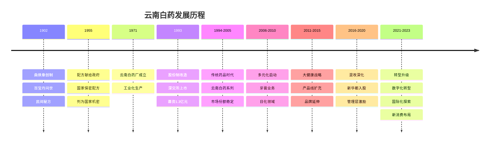
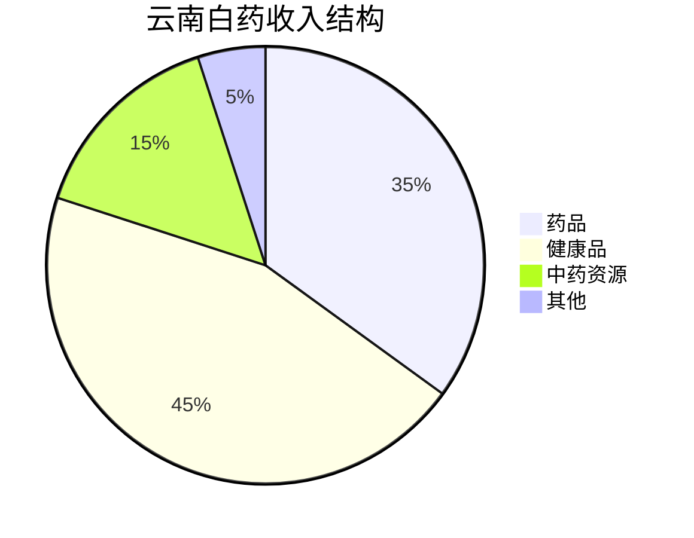
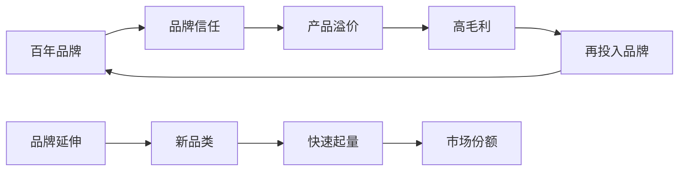
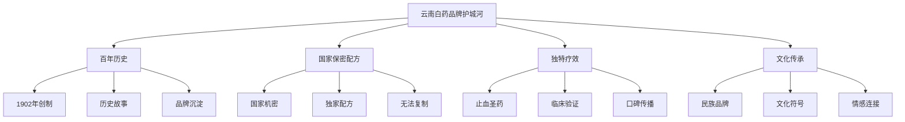
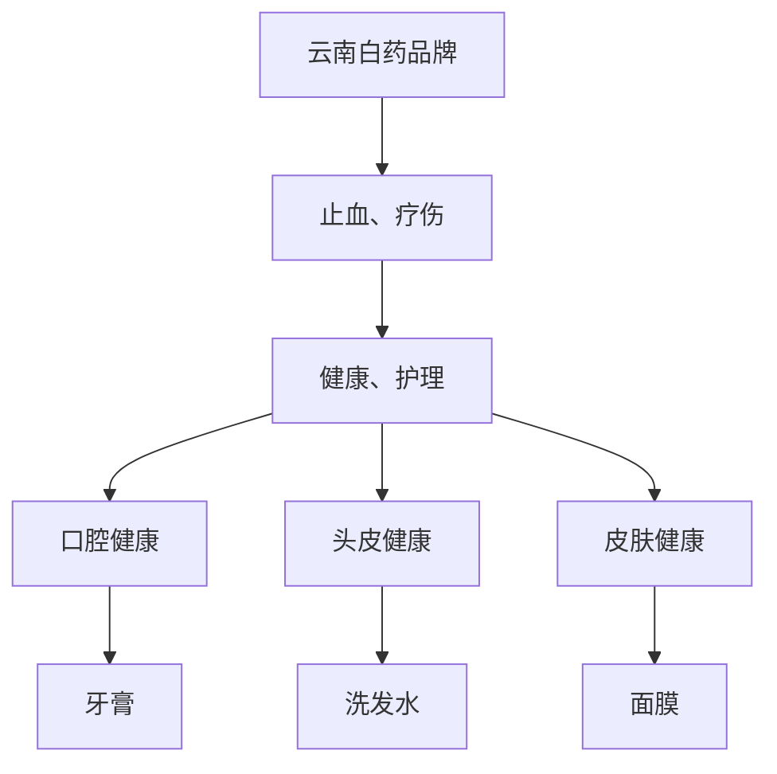

# 云南白药深度研究 - 中药现代化标杆

## 概述

云南白药是中国最具价值的中药品牌之一，从传统止血药到现代化大健康企业，云南白药走出了一条中药企业的转型升级之路。本文深入分析云南白药的品牌价值、产品矩阵、多元化战略和长期投资价值。

**学习目标**：
- 理解云南白药的品牌价值和护城河
- 分析云南白药的产品矩阵和多元化战略
- 评估云南白药的竞争优势
- 掌握中药企业的投资逻辑
- 学习品牌型企业的研究方法

**为什么重要**：
云南白药是中药现代化的成功典范，其品牌价值和多元化战略对整个中药行业具有示范意义。理解云南白药可以学习如何评估品牌型企业的投资价值。

## 公司概况

### 基本信息

**公司全称**：云南白药集团股份有限公司
**股票代码**：000538.SZ
**成立时间**：1971年（云南白药厂），1993年改制
**上市时间**：1993年11月（深交所主板）
**总部位置**：云南省昆明市
**主营业务**：药品、健康品、中药资源的研发、生产和销售

**市值规模**（2023年底）：
- 总市值：约1200亿元人民币
- A股中药行业前三
- 云南省市值第一

**核心数据**（2023年）：
- 营业收入：380亿元（+8%）
- 净利润：45亿元（+10%）
- 研发投入：8亿元（占收入2.1%）
- 品牌价值：超过600亿元
- 核心产品：云南白药系列、牙膏、创可贴等

### 发展历程

**关键里程碑**：
- 1902年：曲焕章创制百宝丹（云南白药前身）
- 1955年：曲焕章遗孀将配方献给政府
- 1971年：云南白药厂成立
- 1993年：深交所上市，成为云南第一股
- 2005年：云南白药牙膏上市
- 2009年：牙膏业务突破10亿
- 2016年：混改，新华都入股
- 2018年：牙膏业务突破50亿
- 2023年：营收突破380亿，品牌价值超600亿

## 商业模式分析

### 产品矩阵

**产品结构**（2023年收入占比）：

**药品业务**（收入133亿，占比35%）：
- 核心产品：
  - 云南白药胶囊/散剂：止血圣药
  - 云南白药气雾剂：跌打损伤
  - 云南白药膏药：骨科外用
  - 云南白药创可贴：日常护理
- 市场地位：止血药第一品牌
- 增长驱动：产品升级、渠道下沉
- 毛利率：80%+

**健康品业务**（收入171亿，占比45%）：
- 核心产品：
  - 云南白药牙膏：口腔护理（收入100亿+）
  - 养元青洗发水：头皮护理
  - 采之汲面膜：护肤品
  - 千草堂：中药养生
- 市场地位：牙膏市场前三
- 增长驱动：品牌延伸、新品推出
- 毛利率：60-70%

**中药资源业务**（收入57亿，占比15%）：
- 业务内容：中药材种植、采购、销售
- 战略意义：保障原料供应
- 增长驱动：产业链整合
- 毛利率：20-30%

### 商业模式特点

**品牌驱动**：

**多元化战略**：
- 从药品到健康品
- 从止血到口腔护理
- 从中药到日化
- 从单一产品到产品矩阵

**渠道优势**：
- 医院渠道：药品销售
- 零售渠道：OTC药品、健康品
- 电商渠道：线上销售
- 专业渠道：口腔诊所、美容院

### 客户结构

**按渠道分类**（2023年收入）：
- 零售渠道：60%（药店、超市、电商）
- 医院渠道：25%（公立医院、民营医院）
- 专业渠道：10%（诊所、美容院）
- 其他渠道：5%

**按地区分类**：
- 西南地区：30%
- 华东地区：25%
- 华北地区：20%
- 华南地区：15%
- 其他地区：10%

**客户特征**：
- 品牌忠诚度高
- 复购率高
- 价格敏感度低
- 口碑传播强

## 品牌价值分析

### 品牌资产

**品牌价值**：
- 2023年品牌价值：超过600亿元
- 中国中药品牌第一
- 云南省品牌第一
- 百年老字号

**品牌认知度**：
- 全国知名度：95%+
- 品牌联想：止血、疗伤、可靠
- 品牌形象：传统、专业、值得信赖
- 品牌美誉度：行业领先

**品牌忠诚度**：
- 高复购率：70%+
- 低价格敏感度
- 强情感连接
- 代际传承

### 品牌护城河

**历史积淀**：

**国家保密配方**：
- 1955年列为国家机密
- 保密级别：绝密
- 知情人数：极少
- 竞争壁垒：无法复制

**独特疗效**：
- 止血效果显著
- 活血化瘀
- 消肿止痛
- 临床验证充分

**文化价值**：
- 民族品牌
- 中医药文化
- 云南特色
- 情感认同

### 品牌延伸

**成功案例：云南白药牙膏**：
- 2005年上市
- 2023年收入：100亿+
- 市场份额：约10%（市场前三）
- 成功要素：
  - 品牌背书：云南白药品牌
  - 差异化定位：止血、护龈
  - 功效诉求：口腔健康
  - 价格策略：高端定位

**其他延伸**：
- 养元青洗发水：头皮护理
- 采之汲面膜：护肤品
- 千草堂：中药养生
- 云南白药创可贴：日常护理

**延伸策略**：
- 聚焦健康领域
- 发挥品牌优势
- 差异化定位
- 高端化路线

## 核心产品分析

### 云南白药胶囊/散剂

**产品概况**：
- 功效：止血化瘀、活血止痛、解毒消肿
- 适应症：跌打损伤、创伤出血、瘀血肿痛
- 剂型：胶囊、散剂、酊剂
- 规格：多种规格

**市场表现**：
- 2023年收入：约40亿元
- 市场地位：止血药第一品牌
- 增长驱动：产品升级、渠道下沉
- 毛利率：85%+

**竞争优势**：
- 品牌优势：百年品牌
- 疗效优势：临床验证
- 配方优势：国家保密
- 渠道优势：覆盖广泛

### 云南白药牙膏

**产品概况**：
- 功效：止血、护龈、口腔健康
- 定位：高端功效型牙膏
- 价格：15-30元/支
- 系列：多个系列（留兰香、薄荷、益生菌等）

**市场表现**：
- 2023年收入：100亿+
- 市场份额：约10%
- 市场地位：前三（云南白药、黑人、高露洁）
- 增长驱动：品牌力、功效诉求、渠道拓展

**竞争格局**：
| 品牌 | 市场份额 | 定位 | 价格带 |
|------|---------|------|--------|
| 云南白药 | 10% | 高端功效 | 15-30元 |
| 黑人 | 15% | 中高端 | 10-20元 |
| 高露洁 | 12% | 大众 | 5-15元 |
| 佳洁士 | 10% | 大众 | 5-15元 |
| 舒适达 | 8% | 专业 | 20-40元 |

**成功要素**：
- 品牌背书：云南白药百年品牌
- 差异化：止血、护龈功效
- 高端定位：价格溢价
- 渠道覆盖：线上线下全覆盖

### 云南白药气雾剂

**产品概况**：
- 功效：活血散瘀、消肿止痛
- 适应症：跌打损伤、瘀血肿痛、风湿疼痛
- 特点：双瓶装（保险液+气雾剂）
- 使用：外用喷雾

**市场表现**：
- 2023年收入：约30亿元
- 市场地位：跌打损伤药第一品牌
- 增长驱动：运动人群增长、品牌认知
- 毛利率：80%+

**目标人群**：
- 运动爱好者
- 中老年人
- 体力劳动者
- 家庭常备

## 多元化战略

### 战略演进

**第一阶段（1993-2005）：聚焦药品**
- 核心产品：云南白药系列
- 战略：做强做大传统药品
- 成果：确立止血药龙头地位

**第二阶段（2006-2015）：多元化探索**
- 战略：品牌延伸，进入日化领域
- 核心：云南白药牙膏
- 成果：牙膏业务快速增长

**第三阶段（2016-2023）：大健康战略**
- 战略：从药品到大健康
- 布局：口腔护理、头皮护理、护肤品
- 成果：健康品收入占比45%

### 多元化逻辑

**品牌延伸逻辑**：

**协同效应**：
- 品牌协同：共享品牌资产
- 渠道协同：共享销售渠道
- 研发协同：中药技术平台
- 管理协同：统一管理体系

### 多元化成效

**收入结构变化**：
- 2005年：药品95%，健康品5%
- 2015年：药品60%，健康品35%，其他5%
- 2023年：药品35%，健康品45%，中药资源15%，其他5%

**盈利能力**：
- 药品业务：毛利率80%+，净利率30%+
- 健康品业务：毛利率60-70%，净利率20-25%
- 整体：毛利率70%，净利率12%

**增长动力**：
- 药品业务：稳定增长5-8%
- 健康品业务：快速增长10-15%
- 整体：增长8-10%

## 竞争优势分析

### 核心竞争力

**1. 品牌优势**
- 百年品牌：历史积淀
- 国家保密配方：独家优势
- 品牌价值：超600亿元
- 品牌认知度：95%+

**2. 产品优势**
- 独特疗效：止血圣药
- 产品矩阵：药品+健康品
- 品质保证：质量稳定
- 持续创新：新品推出

**3. 渠道优势**
- 医院渠道：覆盖广泛
- 零售渠道：药店、超市
- 电商渠道：线上布局
- 专业渠道：诊所、美容院

**4. 文化优势**
- 民族品牌：文化认同
- 中医药文化：传统医学
- 云南特色：地域特色
- 情感连接：代际传承

### 护城河分析

**品牌护城河**：
- 百年历史：时间积淀
- 国家保密配方：独家优势
- 品牌认知：深入人心
- 情感连接：代际传承

**技术护城河**：
- 保密配方：无法复制
- 工艺技术：独特工艺
- 质量标准：严格控制
- 持续创新：技术升级

**规模护城河**：
- 产能规模：行业领先
- 采购优势：成本控制
- 渠道覆盖：全国布局
- 品牌影响力：市场地位

## 财务分析

### 收入增长

**历史收入**（亿元）：
| 年份 | 营业收入 | 同比增长 | 药品收入 | 健康品收入 |
|------|---------|---------|---------|-----------|
| 2015 | 220 | +12% | 132 | 77 |
| 2018 | 265 | +8% | 120 | 120 |
| 2020 | 320 | +10% | 125 | 155 |
| 2022 | 352 | +5% | 130 | 165 |
| 2023 | 380 | +8% | 133 | 171 |

**增长驱动**：
- 健康品业务：牙膏、洗发水等快速增长
- 药品业务：稳定增长，产品升级
- 渠道下沉：基层市场拓展
- 电商增长：线上渠道快速增长

### 盈利能力

**毛利率趋势**：
- 2015年：75%
- 2018年：72%
- 2020年：70%
- 2022年：69%
- 2023年：70%

**毛利率分析**：
- 药品业务：80-85%（高毛利）
- 健康品业务：60-70%（中高毛利）
- 中药资源：20-30%（低毛利）
- 整体：70%

**净利率趋势**：
- 2015年：18%
- 2018年：15%
- 2020年：13%
- 2022年：12%
- 2023年：12%

**净利率下降原因**：
- 产品结构：健康品占比提升（毛利率较低）
- 费用率上升：营销费用、研发费用增加
- 竞争加剧：牙膏市场竞争激烈

**ROE水平**：
- 2023年：18%
- 行业中等水平
- 受多元化影响

### 现金流分析

**经营现金流**（2023年）：
- 经营活动现金流：60亿元
- 经营现金流/净利润：133%
- 现金流质量优秀

**资本开支**：
- 2023年资本开支：15亿元
- 主要用于产能扩张和渠道建设
- 资本开支/收入：4%

**自由现金流**：
- 2023年FCF：45亿元
- FCF/净利润：100%
- 支撑分红

### 资产负债表

**资产结构**（2023年底）：
- 总资产：350亿元
- 固定资产：60亿元
- 货币资金：80亿元
- 存货：50亿元

**负债结构**：
- 总负债：100亿元
- 资产负债率：29%
- 有息负债：20亿元
- 财务稳健

**股东权益**：
- 净资产：250亿元
- 归母净资产：240亿元

## 投资逻辑

### 长期投资价值

**品牌价值**：
- 百年品牌：时间积淀
- 国家保密配方：独家优势
- 品牌价值：超600亿元
- 品牌延伸：持续创造价值

**稳定增长**：
- 药品业务：稳定增长5-8%
- 健康品业务：快速增长10-15%
- 整体：增长8-10%
- 现金流充沛

**分红能力**：
- 分红率：50-60%
- 股息率：2-3%
- 持续稳定分红

### 增长驱动因素

**品牌延伸**：
- 牙膏业务：持续增长
- 新品类：洗发水、面膜等
- 品牌价值：持续释放

**渠道下沉**：
- 基层市场：拓展空间大
- 电商渠道：快速增长
- 专业渠道：新增长点

**产品创新**：
- 新剂型：产品升级
- 新品类：品牌延伸
- 新技术：中药现代化

### 估值分析

**历史估值**：
- 2015年PE：30倍
- 2018年PE：25倍
- 2020年PE：30倍
- 2023年PE：27倍

**合理估值区间**：
- 稳定增长期：PE 25-30倍
- 品牌溢价：+5倍
- 合理PE：25-35倍

**估值方法**：
- PE估值：考虑增长和品牌价值
- PB估值：品牌资产评估
- DCF估值：长期现金流折现
- 品牌估值：品牌价值评估

### 投资风险

**多元化风险**：
- 新业务不确定性
- 管理难度增加
- 资源分散
- 协同效应不达预期

**竞争风险**：
- 牙膏市场竞争激烈
- 国际品牌竞争
- 价格战
- 市场份额波动

**政策风险**：
- 中药政策变化
- 医保控费
- 集采影响
- 监管趋严

**品牌风险**：
- 品牌老化
- 年轻化挑战
- 品牌延伸失败
- 负面事件

## 未来展望

### 短期（2024-2025）

**业务发展**：
- 收入增长8-10%
- 牙膏业务持续增长
- 新品类拓展
- 渠道优化

**财务预测**：
- 2024年收入：410亿元
- 2025年收入：450亿元
- 净利率维持12%
- ROE保持18%

### 中期（2026-2028）

**战略目标**：
- 收入突破600亿元
- 健康品收入占比60%+
- 品牌年轻化
- 数字化转型

### 长期（2029-2035）

**愿景**：
- 中国大健康领导者
- 收入突破1000亿元
- 国际化布局
- 品牌全球化

**战略方向**：
- 品牌年轻化
- 产品创新
- 渠道升级
- 国际化探索

## 投资策略建议

### 长期持有

**适合投资者**：
- 看好品牌价值
- 认可多元化战略
- 追求稳定分红
- 投资期限5年以上

**买入时机**：
- 估值合理区间（PE 20-25倍）
- 新品推出
- 业绩超预期
- 行业调整期

### 配置建议

**核心持仓**：
- 医药组合20-30%
- 长期持有
- 享受分红

**风险控制**：
- 关注多元化进展
- 监控竞争格局
- 跟踪品牌价值
- 评估估值水平

## 关键学习点

1. **品牌是核心资产**：百年品牌，国家保密配方，品牌价值超600亿
2. **品牌延伸创造价值**：牙膏业务成功，品牌价值持续释放
3. **多元化需谨慎**：聚焦健康领域，发挥品牌优势
4. **稳定现金流**：现金流充沛，支撑分红
5. **文化价值重要**：民族品牌，情感连接，代际传承
6. **中药现代化**：传统中药与现代科技结合
7. **渠道优势明显**：医院、零售、电商全覆盖
8. **估值需考虑品牌**：品牌价值给予溢价

## 延伸阅读

### 推荐资料

1. **云南白药年报** - 最权威的公司信息
2. **云南白药投资者交流会** - 管理层战略解读
3. **《品牌价值评估》** - 品牌价值方法
4. **《中药现代化》** - 中药行业趋势
5. **券商深度报告** - 中金、中信、国君等

### 研究工具

**数据来源**：
- 公司公告：巨潮资讯网
- 行业数据：中药协会、尼尔森
- 财务数据：Wind、Choice
- 品牌数据：世界品牌实验室

## 参考文献

1. 云南白药. (2023). 年度报告
2. 云南白药. (2023). 投资者关系活动记录
3. 世界品牌实验室. (2023). 中国500最具价值品牌
4. 尼尔森. (2023). 中国口腔护理市场报告
5. 中金公司. (2023). 云南白药深度报告
6. 中信证券. (2023). 中药行业研究
7. 国泰君安. (2023). 云南白药投资价值分析
8. 《中国中药》杂志. (2023). 中药现代化专题
9. 《品牌研究》. (2023). 品牌延伸案例
10. 中国中药协会. (2023). 中药行业发展报告

---

**下一步学习**：
- [恒瑞医药分析](./hengrui.html) - 创新药龙头
- 片仔癀分析 - 另一中药品牌
- [中药行业研究](./overview.html) - 行业全景
