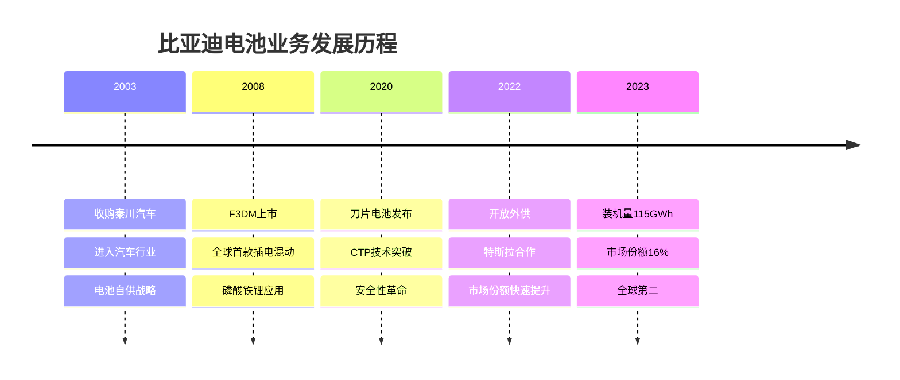
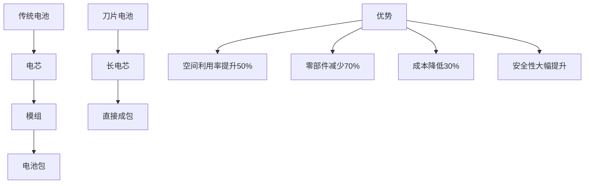
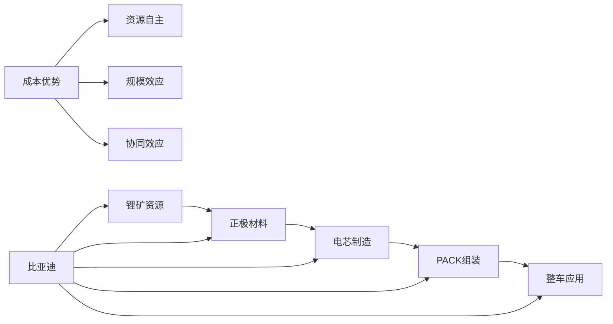

# 比亚迪电池业务分析

## 概述

比亚迪电池业务是全球第二大动力电池供应商，以刀片电池技术和垂直一体化优势著称。从自供到外供，比亚迪电池业务正在经历战略转型，成为公司新的增长引擎。本文深入分析比亚迪电池业务的技术特点、商业模式、竞争优势和发展前景。

**学习目标**：
- 理解比亚迪电池业务的发展历程和战略定位
- 掌握刀片电池的技术原理和竞争优势
- 分析垂直一体化模式的优劣势
- 评估外供业务的市场机会和挑战
- 对比比亚迪与宁德时代的不同路径

## 业务发展历程

### 发展阶段

### 战略转型

**自供阶段（2003-2021）**：
- 服务自身车型
- 垂直一体化优势
- 成本控制能力强
- 技术积累深厚

**开放外供（2022-至今）**：
- 特斯拉订单突破
- 丰田、福特等合作
- 市场份额快速提升
- 独立品牌"弗迪电池"

## 刀片电池技术

### 技术原理

**结构创新**：

**核心特点**：
- 电芯尺寸：长度960mm，厚度13.5mm
- 类似"刀片"形状，直接插入电池包
- 无模组设计（CTP技术）
- 体积利用率提升至60%

### 安全性优势

**针刺试验**：
- 刀片电池：无明火、无爆炸、表面温度30-60°C
- 三元锂电池：剧烈燃烧、表面温度500°C+
- 传统磷酸铁锂：冒烟、表面温度200-400°C

**安全机制**：
- 磷酸铁锂材料本身热稳定性好
- 大面积散热设计
- 结构强度高
- 短路风险低

### 性能参数

**能量密度**：
- 电芯级别：180Wh/kg
- 系统级别：140Wh/kg
- 续航：汉EV达到605km

**循环寿命**：
- 3000次以上（80% SOH）
- 支持120万公里使用
- 质保：8年或15万公里

**充电性能**：
- 支持快充
- 30分钟充电30-80%
- 低温性能良好

## 垂直一体化优势

### 产业链布局

**上游资源**：
- 青海盐湖锂资源
- 非洲锂矿布局
- 镍钴资源储备
- 自主可控

**中游制造**：
- 正极材料：弗迪材料
- 负极材料：自产+外采
- 电解液：自产
- 隔膜：外采为主

**下游应用**：
- 比亚迪全系车型
- 外供客户
- 储能系统

### 成本优势

**成本结构**（vs 外采）：
- 材料成本：降低15-20%
- 制造成本：降低10-15%
- 物流成本：降低5-10%
- 综合成本：降低20-30%

**规模效应**：
- 2023年产能：300GWh
- 自用：200GWh
- 外供：100GWh
- 单GWh成本：行业最低

### 协同效应

**研发协同**：
- 电池与整车联合开发
- 快速迭代验证
- 定制化设计

**生产协同**：
- 柔性生产
- 库存优化
- 质量控制

**市场协同**：
- 品牌背书
- 渠道共享
- 客户资源

## 市场表现

### 装机量数据

**历史装机量**（GWh）：
| 年份 | 装机量 | 同比增长 | 市场份额 | 排名 |
|------|--------|---------|---------|------|
| 2019 | 10 | - | 8% | 3 |
| 2020 | 12 | +20% | 9% | 3 |
| 2021 | 24 | +100% | 11% | 2 |
| 2022 | 61 | +154% | 14% | 2 |
| 2023 | 115 | +89% | 16% | 2 |

**增长驱动**：
- 自身车型销量爆发
- 外供业务快速增长
- 刀片电池市场认可
- 产能持续扩张

### 客户结构

**自供业务**（占比70%）：
- 王朝系列：汉、唐、宋、秦
- 海洋系列：海豹、海豚、海鸥
- 腾势系列：D9、N7
- 仰望系列：U8、U9

**外供客户**（占比30%）：
- 特斯拉：Model 3/Y标准续航版
- 丰田：bZ系列
- 福特：Mustang Mach-E
- 红旗：E-HS9
- 其他：持续拓展中

### 产能布局

**国内产能**（2023年底）：
- 深圳：50GWh
- 西安：80GWh
- 长沙：60GWh
- 合肥：50GWh
- 济南：60GWh
- 合计：300GWh

**海外规划**：
- 泰国：50GWh（规划中）
- 巴西：考察中
- 欧洲：评估中

**产能目标**：
- 2025年：600GWh
- 2030年：1000GWh

## 商业模式分析

### 自供模式

**优势**：
- 成本最优
- 供应保障
- 技术协同
- 利润内部化

**挑战**：
- 产能分配
- 外供竞争力
- 客户信任

### 外供模式

**战略意义**：
- 规模效应
- 分摊固定成本
- 技术验证
- 品牌提升

**客户拓展**：
- 特斯拉：标杆客户
- 传统车企：丰田、福特
- 新势力：潜在合作
- 商用车：客车、卡车

**定价策略**：
- 成本加成定价
- 低于宁德时代10-15%
- 性价比优势

## 竞争优势与劣势

### 核心优势

**1. 成本优势**
- 垂直一体化
- 规模效应
- 自有资源
- 行业最低成本

**2. 技术优势**
- 刀片电池独家
- 安全性领先
- 磷酸铁锂专家
- 持续创新能力

**3. 产能优势**
- 自建产能大
- 扩张速度快
- 供应保障强

**4. 品牌优势**
- 比亚迪品牌背书
- 市场认可度高
- 安全性口碑好

### 主要劣势

**1. 技术路线单一**
- 以磷酸铁锂为主
- 三元锂布局较少
- 高端市场受限

**2. 客户结构**
- 自供占比高
- 外供客户少
- 客户多元化不足

**3. 国际化滞后**
- 海外产能少
- 国际客户少
- 全球化程度低

**4. 独立性问题**
- 与整车业务关联
- 客户担心竞争
- 信息安全顾虑

## 与宁德时代对比

### 商业模式对比

| 维度 | 比亚迪 | 宁德时代 |
|------|--------|---------|
| 定位 | 垂直一体化 | 专业化分工 |
| 客户 | 自供+外供 | 纯外供 |
| 技术路线 | LFP为主 | 全覆盖 |
| 成本 | 最低 | 较低 |
| 产能 | 300GWh | 500GWh |
| 市场份额 | 16% | 37% |
| 国际化 | 起步阶段 | 全球布局 |

### 优劣势对比

**比亚迪优势**：
- 成本最低
- 垂直一体化
- 自有需求保障
- 刀片电池差异化

**宁德时代优势**：
- 市场份额最大
- 客户最广泛
- 技术最全面
- 国际化领先

### 发展路径差异

**比亚迪路径**：
- 先做强自己
- 再开放外供
- 成本驱动
- 差异化竞争

**宁德时代路径**：
- 专注电池
- 服务全球
- 技术驱动
- 规模竞争

## 投资逻辑

### 增长驱动

**自供增长**：
- 比亚迪汽车销量高增长
- 新车型持续推出
- 海外出口增长
- 2025年目标500万辆

**外供增长**：
- 特斯拉订单增长
- 传统车企合作
- 新客户拓展
- 2025年外供占比50%

**储能业务**：
- 电网侧储能
- 工商业储能
- 户用储能
- 高速增长

### 估值分析

**分部估值**：
- 汽车业务：PE 20-25倍
- 电池业务：PE 30-35倍
- 其他业务：PE 15-20倍

**电池业务价值**：
- 2023年收入：约800亿元（估算）
- 2023年净利润：约80亿元
- 合理估值：2400-2800亿元

### 投资风险

**竞争风险**：
- 宁德时代竞争
- 产能过剩
- 价格战

**技术风险**：
- 三元锂追赶
- 固态电池突破
- 技术路线变化

**客户风险**：
- 外供客户拓展慢
- 客户担心竞争
- 订单波动

## 未来展望

### 短期（2024-2025）

**业务目标**：
- 装机量：150GWh（2024）、200GWh（2025）
- 外供占比：40%（2024）、50%（2025）
- 新客户：5-10家

**技术升级**：
- 刀片电池2.0
- 能量密度提升至190Wh/kg
- 快充技术升级

### 中期（2026-2028）

**战略目标**：
- 市场份额保持15%+
- 外供收入占比60%
- 国际化布局
- 储能业务占比20%

**产能规划**：
- 2026年：400GWh
- 2028年：600GWh

### 长期（2029-2035）

**愿景**：
- 全球前三动力电池供应商
- 外供与自供平衡
- 技术全面领先
- 储能业务重要支柱

**技术方向**：
- 固态电池
- 钠离子电池
- 新材料体系

## 投资策略建议

### 适合投资者

**看好比亚迪电池的理由**：
- 成本优势明显
- 刀片电池差异化
- 外供业务增长
- 比亚迪汽车带动

**投资方式**：
- 通过比亚迪股票间接投资
- 关注弗迪电池独立上市机会
- 配置比亚迪可转债

### 关注要点

**跟踪指标**：
- 装机量增速
- 外供客户数量
- 外供收入占比
- 毛利率变化

**催化剂**：
- 新客户公告
- 产能扩张
- 技术突破
- 独立上市

## 关键学习点

1. **垂直一体化带来成本优势**：全产业链布局，成本行业最低
2. **刀片电池是差异化竞争利器**：安全性优势，市场认可度高
3. **从自供到外供的战略转型**：开放外供，市场空间扩大
4. **与宁德时代路径不同**：各有优势，竞合关系
5. **外供业务是增长关键**：客户拓展决定未来空间
6. **储能是第二增长曲线**：市场潜力大，协同效应强
7. **国际化是必然趋势**：海外布局加速，全球竞争
8. **独立性是外供挑战**：客户担心竞争，需要解决

## 延伸阅读

### 推荐资料

1. **比亚迪年报** - 公司整体情况
2. **比亚迪投资者交流会** - 电池业务战略
3. **刀片电池技术白皮书** - 技术详解
4. **券商研究报告** - 行业分析
5. **《比亚迪传》** - 企业发展史

### 相关主题

- [宁德时代深度研究](./catl-deep.html)
- [比亚迪公司分析](../ev-makers/byd.html)
- 磷酸铁锂技术
- [动力电池行业](./overview.html)

## 参考文献

1. 比亚迪. (2023). 年度报告
2. 比亚迪. (2023). 投资者关系活动记录
3. 高工锂电. (2023). 比亚迪电池业务分析
4. SNE Research. (2023). Global EV Battery Market
5. 中金公司. (2023). 比亚迪深度报告
6. 中信证券. (2023). 比亚迪电池业务研究
7. 《财经》杂志. (2023). 比亚迪的电池野心
8. 《中国企业家》. (2023). 王传福访谈
9. 弗迪电池. (2023). 刀片电池技术白皮书
10. 比亚迪. (2020). 刀片电池发布会资料

---

**下一步学习**：
- [宁德时代对比分析](./catl-deep.html)
- [比亚迪整车业务](../ev-makers/byd.html)
- [动力电池技术路线](./overview.html)

## 深度分析

### 核心机制解析

理解本主题需要从多个维度进行系统性分析。以下从理论基础、实践应用和历史验证三个层面展开深度探讨。

**理论基础层面**：本主题的核心逻辑建立在经济学和金融学的基本原理之上。通过对基础理论的深入理解，投资者能够建立起稳固的分析框架，避免被市场短期噪音所干扰。

**实践应用层面**：理论必须与实践相结合才能产生价值。在实际投资决策中，需要将抽象的概念转化为具体的分析工具和决策标准。

**历史验证层面**：金融市场有着丰富的历史记录，通过研究历史案例，我们可以验证理论的有效性，并从中提炼出具有普遍意义的规律。

### 关键影响因素

影响本主题的关键因素可以从以下几个维度进行分析：

1. **宏观经济环境**：利率水平、通货膨胀率、经济增长速度等宏观变量对本主题有着深远影响。在不同的宏观经济周期中，相关指标的表现会呈现出显著差异。

2. **市场结构因素**：市场参与者的构成、信息传播机制、流动性状况等市场结构因素决定了价格发现的效率和准确性。

3. **政策监管环境**：政府政策、监管框架的变化会直接影响相关市场的运作规则和参与者行为。

4. **技术创新驱动**：技术进步不断改变着金融市场的运作方式，从算法交易到区块链技术，每一次技术革新都带来新的机遇和挑战。

5. **全球化与地缘政治**：在全球化背景下，各国市场之间的联动性日益增强，地缘政治风险的影响也越来越不可忽视。

### 量化分析框架

为了更精确地分析和评估，可以采用以下量化框架：

| 分析维度 | 关键指标 | 参考基准 | 分析方法 |
|---------|---------|---------|---------|
| 规模评估 | 绝对值与相对值 | 历史均值 | 趋势分析 |
| 质量评估 | 稳定性指标 | 行业对标 | 横向比较 |
| 风险评估 | 波动率指标 | 风险阈值 | 情景分析 |
| 价值评估 | 估值倍数 | 历史区间 | 回归分析 |

通过系统性地应用上述框架，投资者可以对目标进行全面、客观的评估，从而做出更加理性的投资决策。

