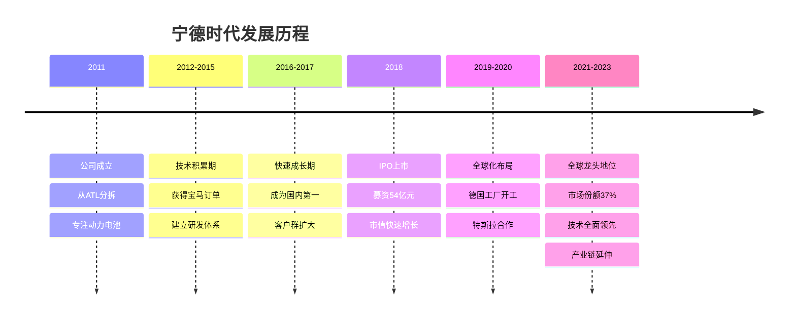
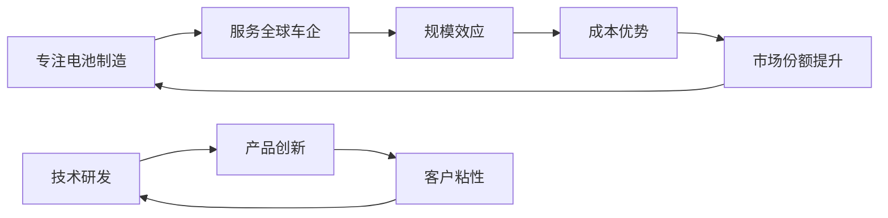
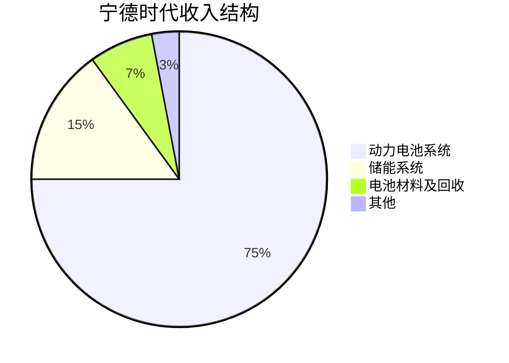
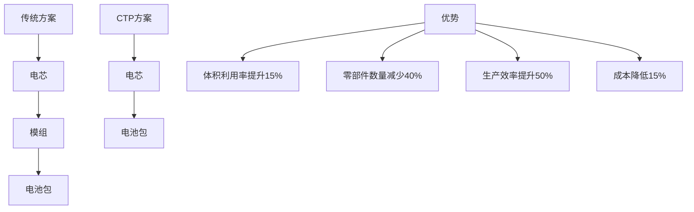
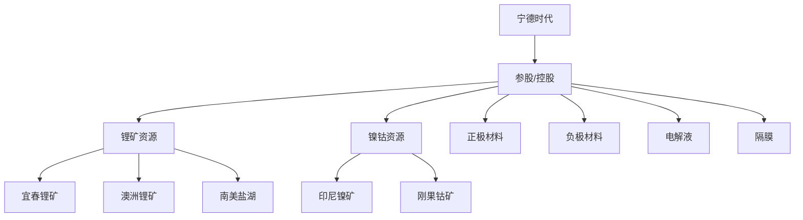

# 宁德时代深度研究：全球动力电池龙头

## 公司概况

### 基本信息

**公司名称**：宁德时代新能源科技股份有限公司（CATL）
**股票代码**：300750.SZ
**成立时间**：2011年
**上市时间**：2018年6月
**总部位置**：福建宁德
**主营业务**：动力电池系统、储能系统、电池回收

**市值规模**（2023年底）：
- 总市值：约1.2万亿人民币
- 全球动力电池企业第一
- A股市值前十

**核心数据**（2023年）：
- 营业收入：4009亿元（+22%）
- 净利润：441亿元（+43%）
- 动力电池装机量：260GWh（+35%）
- 全球市场份额：37%
- 研发投入：184亿元（占收入4.6%）

### 发展历程

**关键里程碑**：
- 2012年：获得宝马订单，进入国际市场
- 2017年：动力电池装机量全球第一
- 2018年：创业板上市，成为"创业板一哥"
- 2019年：与特斯拉签订合作协议
- 2020年：发布CTP技术和钠离子电池
- 2021年：市值突破万亿
- 2022年：全球市场份额达到37%
- 2023年：凝聚态电池发布，能量密度500Wh/kg

## 商业模式分析

### 核心商业模式

**专业化分工模式**：

**价值主张**：
- 为车企提供高性能、高安全、高性价比的动力电池系统
- 全技术路线覆盖，满足不同需求
- 全球化供应能力
- 持续技术创新

### 客户结构

**国内客户**（2023年装机量占比）：
- 特斯拉：15%
- 理想汽车：12%
- 蔚来汽车：10%
- 小鹏汽车：8%
- 吉利汽车：8%
- 长城汽车：7%
- 其他：40%

**国际客户**：
- 欧洲：宝马、奔驰、大众、沃尔沃、Stellantis
- 美国：特斯拉、福特
- 日韩：本田、现代起亚
- 特点：全球主流车企全覆盖

**客户关系特征**：
- 长期战略合作
- 联合开发定制化产品
- 深度绑定，转换成本高
- 客户多元化，降低依赖风险

### 收入结构

**按产品分类**（2023年）：

**按地区分类**：
- 中国大陆：70%
- 欧洲：20%
- 美国：5%
- 其他：5%

**增长驱动**：
- 动力电池：量价齐升
- 储能业务：高速增长（+100%）
- 国际化：海外收入占比提升
- 产业链延伸：材料、回收业务

## 技术领先优势

### 全技术路线布局

**磷酸铁锂（LFP）**：
- M3P电池：磷酸锰铁锂，能量密度提升15%
- 麒麟电池：CTP 3.0技术，体积利用率72%
- 补锂技术：提升能量密度和循环寿命

**三元锂（NCM）**：
- NCM523/622/811全系列
- 单晶技术：循环寿命提升50%
- 高镍低钴：降低成本，提升能量密度

**钠离子电池**：
- 第一代：能量密度160Wh/kg
- 低温性能：-20°C保持90%容量
- 成本优势：比锂电池低30%
- 应用场景：A00级车型、储能

**凝聚态电池**：
- 能量密度：500Wh/kg
- 固态电池技术
- 2027年量产目标
- 应用：高端车型、航空

### 核心技术创新

**CTP技术（Cell to Pack）**：

**麒麟电池**：
- CTP 3.0技术
- 体积利用率72%（行业最高）
- 能量密度255Wh/kg（三元）、160Wh/kg（磷酸铁锂）
- 快充：10分钟充电80%
- 应用：理想L9、蔚来ET7等

**AB电池系统**：
- 钠离子+锂离子混合
- 优势互补
- 成本与性能平衡

### 研发体系

**研发投入**：
- 2023年研发费用：184亿元
- 研发费用率：4.6%
- 研发人员：1.8万人（占比25%）
- 累计研发投入：超过600亿元

**研发布局**：
- 宁德研究院：基础研究
- 上海研发中心：材料研发
- 慕尼黑研发中心：欧洲市场
- 底特律研发中心：美国市场
- 东京研发中心：日本市场

**专利储备**：
- 专利申请总量：2.3万件
- 发明专利：1.8万件
- PCT国际专利：5000+件
- 专利授权率：85%

**技术合作**：
- 与清华大学、中科院等合作
- 与车企联合开发
- 与材料企业协同创新

## 产业链地位

### 产能布局

**国内产能**（2023年底）：
- 福建宁德：150GWh
- 江苏溧阳：100GWh
- 四川宜宾：100GWh
- 广东肇庆：50GWh
- 青海西宁：30GWh
- 其他基地：70GWh
- 合计：500GWh

**海外产能**：
- 德国图林根：14GWh（已投产）
- 匈牙利德布勒森：100GWh（建设中）
- 美国：规划中
- 印尼：规划中

**产能规划**：
- 2025年目标：670GWh
- 2030年目标：1000GWh+

### 供应链整合

**向上游延伸**：

**资源布局**：
- 锂资源：江西宜春、四川、青海、澳洲、阿根廷
- 镍资源：印尼红土镍矿项目
- 回收体系：邦普循环，电池回收利用

**材料企业合作**：
- 正极：容百科技、当升科技、长远锂科
- 负极：贝特瑞、璞泰来
- 电解液：天赐材料、新宙邦
- 隔膜：恩捷股份、星源材质

### 产业链话语权

**定价能力**：
- 规模优势带来议价能力
- 长期协议锁定价格
- 向上游延伸降低成本

**标准制定**：
- 参与国家标准制定
- 推动行业技术标准
- 国际标准话语权提升

**生态构建**：
- 时代电服：充换电服务
- 时代吉利：换电业务
- 时代上汽：电池资产管理

## 全球化扩张战略

### 国际化布局

**欧洲市场**：
- 德国图林根工厂：2022年投产
- 匈牙利工厂：2025年投产
- 客户：宝马、奔驰、大众、沃尔沃、Stellantis
- 本地化研发、生产、服务

**美国市场**：
- 福特合作：在美建厂
- 特斯拉供应：磷酸铁锂电池
- 政策挑战：IRA法案限制

**亚太市场**：
- 日本：本田合作
- 韩国：现代起亚供应
- 东南亚：印尼、泰国布局

### 全球化优势

**技术领先**：
- 全技术路线覆盖
- 产品性能优异
- 持续创新能力

**成本优势**：
- 规模效应
- 供应链整合
- 制造效率高

**服务能力**：
- 全球化供应网络
- 本地化服务团队
- 快速响应能力

### 全球化挑战

**地缘政治**：
- 中美科技竞争
- 欧洲本土保护
- 供应链安全

**本地化要求**：
- 本地采购比例
- 本地就业
- 技术转移

**竞争加剧**：
- LG、SK、松下等韩日企业
- 欧美本土企业崛起
- 价格竞争

## 财务分析

### 收入增长

**历史收入**（亿元）：
| 年份 | 营业收入 | 同比增长 | 动力电池收入 | 储能收入 |
|------|---------|---------|------------|---------|
| 2018 | 296 | - | 245 | 2 |
| 2019 | 458 | +55% | 385 | 6 |
| 2020 | 503 | +10% | 394 | 19 |
| 2021 | 1304 | +159% | 914 | 136 |
| 2022 | 3286 | +152% | 2526 | 449 |
| 2023 | 4009 | +22% | 3026 | 601 |

**增长驱动**：
- 新能源汽车渗透率提升
- 市场份额稳定
- 储能业务爆发
- 国际化加速

### 盈利能力

**毛利率趋势**：
- 2018年：35%
- 2020年：27%（竞争加剧）
- 2022年：21%（原材料涨价）
- 2023年：22%（成本控制改善）

**净利率趋势**：
- 2018年：21%
- 2020年：11%
- 2022年：13%
- 2023年：11%

**ROE水平**：
- 2023年：25%
- 行业领先水平
- 高于行业平均15%

### 现金流分析

**经营现金流**（2023年）：
- 经营活动现金流：685亿元
- 经营现金流/净利润：155%
- 现金流质量优秀

**资本开支**：
- 2023年资本开支：280亿元
- 主要用于产能扩张
- 单GWh投资：3-4亿元

**自由现金流**：
- 2023年FCF：405亿元
- FCF/净利润：92%
- 支撑高速扩张

### 资产负债表

**资产结构**（2023年底）：
- 总资产：7200亿元
- 固定资产：1800亿元
- 在建工程：600亿元
- 货币资金：1500亿元

**负债结构**：
- 总负债：4500亿元
- 资产负债率：62%
- 有息负债：800亿元
- 财务杠杆适中

**股东权益**：
- 净资产：2700亿元
- 归母净资产：1800亿元

## 竞争优势分析

### 护城河

**1. 技术护城河**
- 全技术路线领先
- 持续创新能力
- 专利壁垒
- 研发体系完善

**2. 规模护城河**
- 全球市场份额37%
- 产能规模最大
- 成本优势明显
- 规模效应显著

**3. 客户护城河**
- 全球主流车企覆盖
- 长期战略合作
- 深度绑定
- 转换成本高

**4. 供应链护城河**
- 产业链整合
- 资源布局
- 供应稳定
- 成本可控

### 竞争对手对比

| 维度 | 宁德时代 | 比亚迪 | LG新能源 | 松下 |
|------|---------|--------|---------|------|
| 市场份额 | 37% | 16% | 13% | 8% |
| 技术路线 | 全覆盖 | LFP为主 | NCM为主 | NCA为主 |
| 客户群 | 全球化 | 自供+外供 | 欧美为主 | 特斯拉为主 |
| 产能规模 | 500GWh | 300GWh | 200GWh | 100GWh |
| 毛利率 | 22% | 25% | 15% | 18% |
| 研发投入 | 4.6% | 4.0% | 3.5% | 3.0% |

**竞争优势**：
- 市场份额最高
- 技术最全面
- 客户最广泛
- 盈利能力强

## 投资逻辑

### 长期投资价值

**行业成长性**：
- 新能源汽车渗透率持续提升
- 储能市场快速增长
- 全球化需求增长
- 行业空间巨大

**公司竞争力**：
- 技术领先优势
- 规模效应
- 客户资源
- 品牌价值

**盈利能力**：
- ROE保持高位
- 现金流充沛
- 分红能力强

### 估值分析

**历史估值**：
- 2018年PE：40倍
- 2020年PE：80倍（高点）
- 2022年PE：30倍（低点）
- 2023年PE：35倍

**合理估值区间**：
- 成长期：PE 40-50倍
- 成熟期：PE 25-35倍
- 当前阶段：PE 30-40倍合理

**估值方法**：
- PE估值：考虑增长速度
- PEG估值：1-1.5倍
- DCF估值：长期现金流折现

### 投资风险

**竞争风险**：
- 产能过剩
- 价格战
- 市场份额下降

**技术风险**：
- 技术路线变化
- 固态电池突破
- 竞争对手追赶

**政策风险**：
- 补贴退坡
- 国际贸易摩擦
- 环保政策

**原材料风险**：
- 锂价波动
- 镍钴价格
- 成本传导

## 未来展望

### 短期（2024-2025）

**业务发展**：
- 动力电池装机量增长30%+
- 储能业务翻倍增长
- 海外收入占比提升至30%
- 新技术产品量产

**财务预测**：
- 2024年收入：4800亿元
- 2025年收入：5800亿元
- 净利率维持10-12%
- ROE保持20%+

### 中期（2026-2028）

**战略目标**：
- 全球市场份额保持35%+
- 储能业务收入占比20%
- 海外收入占比40%
- 固态电池商业化

**产能规划**：
- 2025年：670GWh
- 2028年：1000GWh

### 长期（2029-2035）

**愿景**：
- 全球动力电池领导者
- 储能系统主要供应商
- 电池回收闭环
- 新能源生态构建

**技术方向**：
- 全固态电池
- 能量密度500Wh/kg+
- 成本降至0.2元/Wh
- 循环寿命100万公里

## 投资策略建议

### 长期持有

**适合投资者**：
- 看好新能源长期趋势
- 认可公司竞争优势
- 能承受短期波动
- 投资期限3年以上

**买入时机**：
- 行业调整期
- 估值合理区间
- 基本面稳健
- 技术突破

### 波段操作

**买入信号**：
- PE低于30倍
- 订单超预期
- 技术突破
- 政策利好

**卖出信号**：
- PE高于50倍
- 竞争格局恶化
- 原材料大涨
- 技术落后

### 配置建议

**核心持仓**：
- 新能源组合30-40%
- 长期持有
- 定期调仓

**卫星持仓**：
- 波段操作
- 把握短期机会
- 控制仓位

## 关键学习点

1. **技术领先是核心竞争力**：全技术路线布局，持续创新
2. **规模效应带来成本优势**：全球最大产能，议价能力强
3. **客户资源是护城河**：全球主流车企覆盖，深度绑定
4. **产业链整合降低风险**：向上游延伸，资源布局
5. **全球化是必然趋势**：本地化生产，服务全球客户
6. **储能是第二增长曲线**：市场空间巨大，高速增长
7. **现金流质量优秀**：支撑高速扩张和分红
8. **估值需匹配增长**：成长期给予溢价，成熟期回归理性

## 延伸阅读

### 推荐资料

1. **宁德时代年报** - 最权威的公司信息
2. **宁德时代投资者交流会** - 管理层战略解读
3. **《动力电池技术与应用》** - 欧阳明高
4. **SNE Research报告** - 全球电池市场数据
5. **券商深度报告** - 中金、中信、国君等

### 研究工具

**数据来源**：
- 公司公告：巨潮资讯网
- 行业数据：高工锂电、SNE Research
- 财务数据：Wind、Choice
- 新闻资讯：财联社、36氪

**分析框架**：
- 波特五力模型
- SWOT分析
- 财务分析
- 估值模型

## 参考文献

1. 宁德时代. (2023). 年度报告
2. 宁德时代. (2023). 投资者关系活动记录
3. SNE Research. (2023). Global EV Battery Market Analysis
4. 高工锂电. (2023). 动力电池月度数据
5. 中金公司. (2023). 宁德时代深度报告
6. 中信证券. (2023). 宁德时代投资价值分析
7. 国泰君安. (2023). 动力电池龙头研究
8. 欧阳明高. (2022). 动力电池技术发展趋势
9. IEA. (2023). Global EV Outlook
10. BNEF. (2023). Battery Price Survey
11. 《财经》杂志. (2023). 宁德时代的全球化之路
12. 《中国企业家》. (2023). 曾毓群访谈
13. McKinsey. (2023). The future of battery technology
14. BCG. (2023). Global Battery Market Outlook
15. 清华大学. (2023). 动力电池产业研究报告

---

**下一步学习**：
- [比亚迪电池业务](./byd-battery.html) - 垂直一体化对比
- [动力电池行业概览](./overview.html) - 行业全景
- [电池材料产业](overview.html) - 产业链上游

## 深度分析

### 核心机制解析

理解本主题需要从多个维度进行系统性分析。以下从理论基础、实践应用和历史验证三个层面展开深度探讨。

**理论基础层面**：本主题的核心逻辑建立在经济学和金融学的基本原理之上。通过对基础理论的深入理解，投资者能够建立起稳固的分析框架，避免被市场短期噪音所干扰。

**实践应用层面**：理论必须与实践相结合才能产生价值。在实际投资决策中，需要将抽象的概念转化为具体的分析工具和决策标准。

**历史验证层面**：金融市场有着丰富的历史记录，通过研究历史案例，我们可以验证理论的有效性，并从中提炼出具有普遍意义的规律。

### 关键影响因素

影响本主题的关键因素可以从以下几个维度进行分析：

1. **宏观经济环境**：利率水平、通货膨胀率、经济增长速度等宏观变量对本主题有着深远影响。在不同的宏观经济周期中，相关指标的表现会呈现出显著差异。

2. **市场结构因素**：市场参与者的构成、信息传播机制、流动性状况等市场结构因素决定了价格发现的效率和准确性。

3. **政策监管环境**：政府政策、监管框架的变化会直接影响相关市场的运作规则和参与者行为。

4. **技术创新驱动**：技术进步不断改变着金融市场的运作方式，从算法交易到区块链技术，每一次技术革新都带来新的机遇和挑战。

5. **全球化与地缘政治**：在全球化背景下，各国市场之间的联动性日益增强，地缘政治风险的影响也越来越不可忽视。

### 量化分析框架

为了更精确地分析和评估，可以采用以下量化框架：

| 分析维度 | 关键指标 | 参考基准 | 分析方法 |
|---------|---------|---------|---------|
| 规模评估 | 绝对值与相对值 | 历史均值 | 趋势分析 |
| 质量评估 | 稳定性指标 | 行业对标 | 横向比较 |
| 风险评估 | 波动率指标 | 风险阈值 | 情景分析 |
| 价值评估 | 估值倍数 | 历史区间 | 回归分析 |

通过系统性地应用上述框架，投资者可以对目标进行全面、客观的评估，从而做出更加理性的投资决策。

## 高级分析与前沿研究

### 学术研究进展

近年来，学术界对本领域的研究取得了重要进展。以下是几个值得关注的研究方向：

**行为金融学视角**：传统金融理论假设市场参与者是完全理性的，但行为金融学的研究表明，认知偏差和情绪因素在投资决策中扮演着重要角色。诺贝尔经济学奖得主丹尼尔·卡尼曼（Daniel Kahneman）和理查德·塞勒（Richard Thaler）的研究为我们理解市场非理性行为提供了重要框架。

**因子投资研究**：尤金·法玛（Eugene Fama）和肯尼斯·弗伦奇（Kenneth French）的三因子模型，以及后续发展的五因子模型，为系统性地解释股票收益差异提供了理论基础。这些研究表明，市值、账面市值比、盈利能力和投资模式等因子能够解释大部分股票收益的横截面差异。

**市场微观结构研究**：对市场流动性、价格发现机制和交易成本的深入研究，帮助我们更好地理解市场的运作机制，并为优化交易策略提供指导。

### 实战案例深度解析

**案例一：长期价值创造的典范**

以沃伦·巴菲特（Warren Buffett）的伯克希尔·哈撒韦（Berkshire Hathaway）为例，其长达数十年的卓越投资业绩证明了价值投资理念的有效性。从1965年至今，伯克希尔的账面价值年均增长率约为19.8%，远超同期标普500指数的约10.2%年均回报。

巴菲特的成功秘诀在于：
- 专注于具有持久竞争优势的优质企业
- 以合理价格买入，而非追求最低价格
- 长期持有，让复利效应充分发挥
- 保持充足的安全边际，控制下行风险

**案例二：危机中的机遇识别**

2008年金融危机期间，大多数投资者恐慌性抛售，但少数具有前瞻性的投资者却在危机中发现了历史性的投资机会。约翰·保尔森（John Paulson）通过做空次级抵押贷款相关证券，在危机中获得了约150亿美元的利润，成为金融史上最成功的单笔交易之一。

这个案例告诉我们：
- 深入的基本面研究能够发现市场定价错误
- 逆向思维往往能够发现被市场忽视的机会
- 风险管理和仓位控制是成功的关键

### 跨市场比较分析

不同市场在结构、监管、投资者构成等方面存在显著差异，这些差异对投资策略的选择有重要影响：

**美国市场特征**：
- 机构投资者主导，市场效率较高
- 信息披露制度完善，分析师覆盖广泛
- 衍生品市场发达，对冲工具丰富
- 长期牛市历史，但也经历过多次重大调整

**中国市场特征**：
- 散户投资者比例较高，市场波动性较大
- 政策因素影响显著，需要密切关注监管动向
- 新兴行业发展迅速，成长投资机会丰富
- A股、港股、美股中概股形成多层次市场体系

**欧洲市场特征**：
- 价值股比例较高，估值相对保守
- 受地缘政治和欧元区政策影响较大
- 部分行业（如奢侈品、工业）具有全球竞争优势
- ESG投资理念推广较为领先

