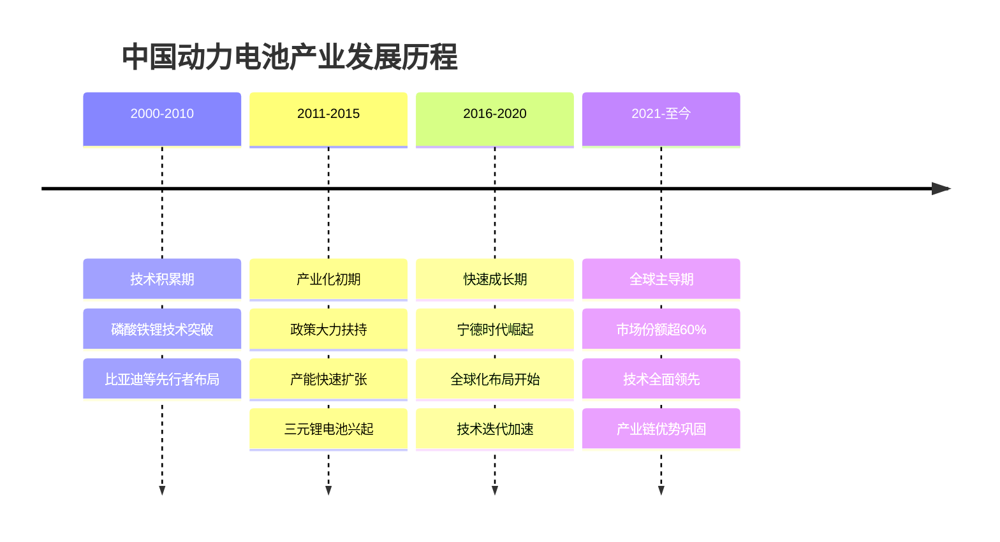
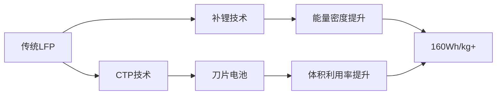
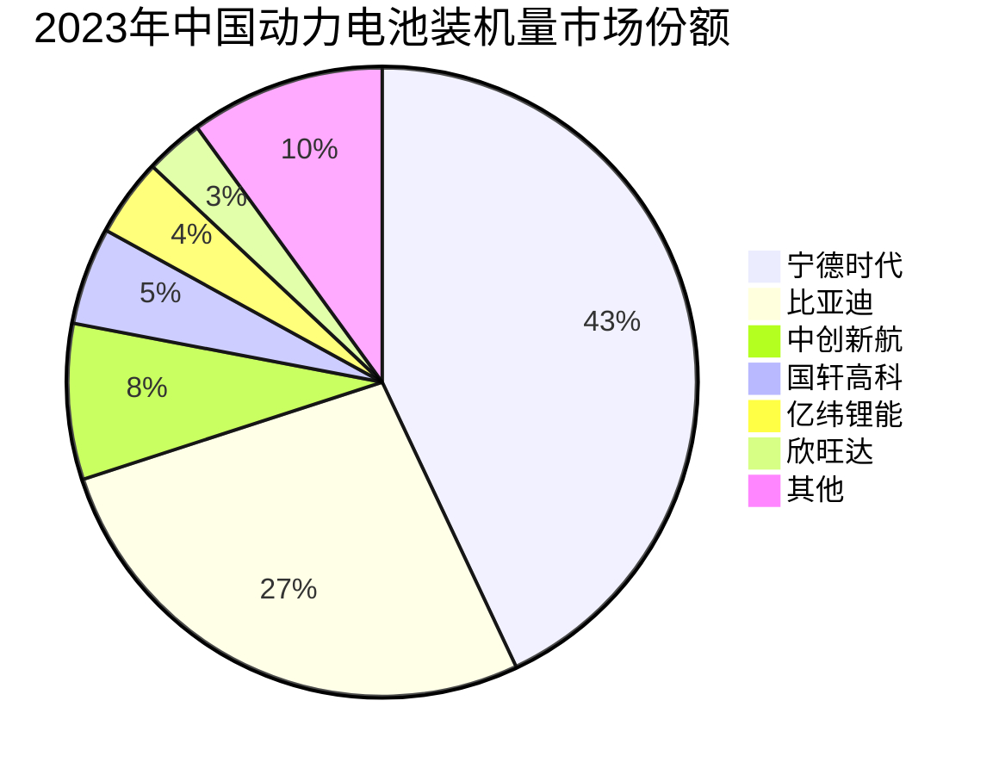
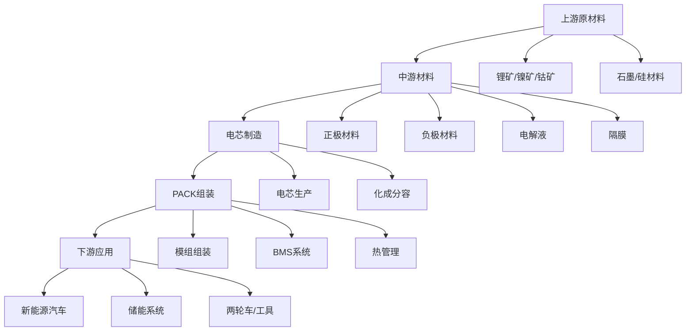
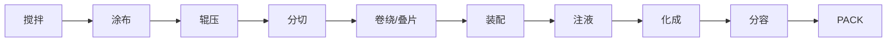
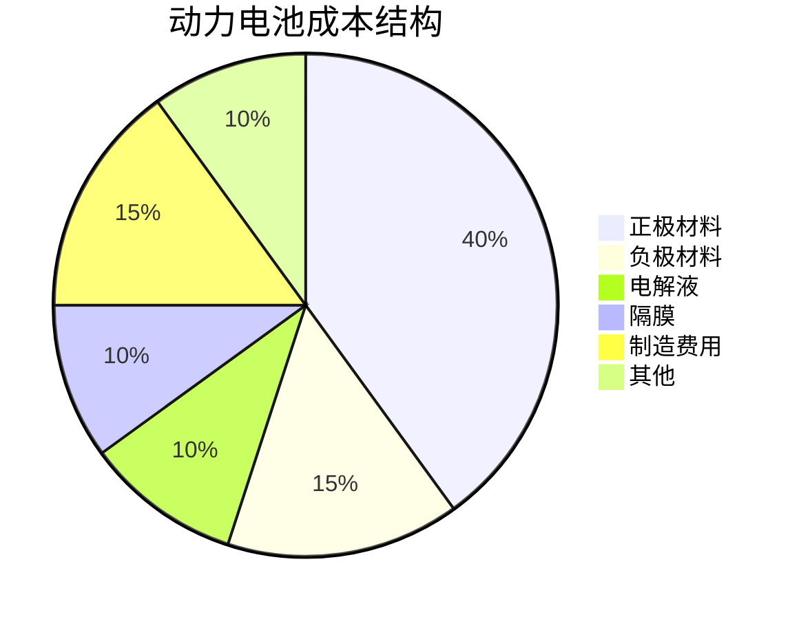

# 中国动力电池行业概览

## 概述

中国动力电池产业已成为全球新能源汽车产业链的核心环节，占据全球市场60%以上份额。从技术创新到产能规模，从成本控制到全球化布局，中国动力电池企业建立了全方位的竞争优势。本文深入分析动力电池行业的技术路线、市场格局、产业链结构和投资逻辑。

**学习目标**：
- 理解动力电池的技术原理和主要技术路线
- 掌握中国动力电池产业的竞争格局和市场份额
- 分析动力电池产业链的完整结构和价值分布
- 评估主要企业的技术优势和商业模式
- 识别动力电池行业的投资机会和风险因素

## 行业发展历程

### 发展阶段

### 关键里程碑

**2011年**：宁德时代成立，专注动力电池
**2015年**：中国成为全球最大动力电池生产国
**2018年**：宁德时代上市，市值快速增长
**2020年**：比亚迪刀片电池发布，磷酸铁锂回归
**2021年**：钠离子电池发布，技术路线多元化
**2023年**：全球装机量超过700GWh，中国占比60%+

## 技术路线分析

### 主流技术对比

| 技术路线 | 能量密度 | 安全性 | 成本 | 循环寿命 | 主要应用 |
|---------|---------|--------|------|---------|---------|
| 磷酸铁锂(LFP) | 150-180Wh/kg | 优秀 | 低 | 3000-5000次 | 中低端车型、储能 |
| 三元锂(NCM) | 200-280Wh/kg | 良好 | 中 | 1500-2000次 | 中高端车型 |
| 高镍三元(NCM811) | 250-300Wh/kg | 一般 | 中高 | 1000-1500次 | 高端长续航车型 |
| 钠离子电池 | 100-150Wh/kg | 优秀 | 很低 | 3000+次 | 低成本车型、储能 |
| 固态电池 | 400-500Wh/kg | 极佳 | 高 | 5000+次 | 下一代技术 |

### 磷酸铁锂(LFP)

**技术特点**：
- 化学式：LiFePO₄
- 橄榄石结构，热稳定性好
- 不含贵金属，成本低
- 低温性能相对较差

**技术创新**：

**代表企业**：
- 比亚迪：刀片电池，CTP技术
- 宁德时代：M3P电池，补锂技术
- 国轩高科：JTM技术

**应用场景**：
- A00级小车：五菱宏光MINI EV
- 主流车型：比亚迪汉、秦、海豚
- 储能系统：电网侧、用户侧储能
- 商用车：公交车、物流车

### 三元锂电池(NCM/NCA)

**技术特点**：
- NCM：镍钴锰三元
- NCA：镍钴铝三元
- 层状结构，能量密度高
- 需要精密热管理

**技术演进**：
- NCM523：早期主流，平衡性能
- NCM622：提升能量密度
- NCM811：高镍路线，能量密度最高
- 单晶技术：提升循环寿命

**代表企业**：
- 宁德时代：全系列NCM产品
- 中创新航：高镍三元专家
- 亿纬锂能：圆柱三元电池

**应用场景**：
- 高端车型：蔚来、理想、小鹏
- 长续航车型：特斯拉Model 3/Y
- 性能车型：保时捷Taycan

### 新技术方向

**钠离子电池**：
- 宁德时代第一代：160Wh/kg
- 成本优势明显（降低30%）
- 低温性能优异（-20°C保持90%）
- 2023年开始量产应用

**固态电池**：
- 半固态：2025年量产目标
- 全固态：2030年商业化
- 能量密度突破400Wh/kg
- 安全性大幅提升

**无钴电池**：
- 降低对钴资源依赖
- 成本下降
- 供应链安全

## 市场格局分析

### 全球市场份额

**2023年全球动力电池装机量TOP10**：

| 排名 | 企业 | 国家 | 装机量(GWh) | 市场份额 | 同比增长 |
|-----|------|------|------------|---------|---------|
| 1 | 宁德时代 | 中国 | 260 | 37% | +35% |
| 2 | 比亚迪 | 中国 | 115 | 16% | +90% |
| 3 | LG新能源 | 韩国 | 95 | 13% | +20% |
| 4 | 松下 | 日本 | 55 | 8% | +10% |
| 5 | SK On | 韩国 | 45 | 6% | +25% |
| 6 | 中创新航 | 中国 | 35 | 5% | +40% |
| 7 | 国轩高科 | 中国 | 28 | 4% | +50% |
| 8 | 亿纬锂能 | 中国 | 22 | 3% | +60% |
| 9 | 三星SDI | 韩国 | 20 | 3% | +15% |
| 10 | 欣旺达 | 中国 | 15 | 2% | +80% |

**市场特征**：
- 中国企业占据前10中的6席
- 宁德时代一家独大，份额超过1/3
- 比亚迪增速最快，自供+外供双轮驱动
- 二线企业快速成长，市场集中度下降

### 中国市场格局

**竞争态势**：
- 第一梯队：宁德时代、比亚迪（市场份额70%）
- 第二梯队：中创新航、国轩高科、亿纬锂能（市场份额15%）
- 第三梯队：欣旺达、蜂巢能源、瑞浦兰钧等（市场份额15%）

### 客户结构分析

**宁德时代客户群**：
- 国内：特斯拉、蔚来、理想、小鹏、吉利、长城等
- 国际：宝马、奔驰、大众、福特、现代等
- 特点：全球主流车企全覆盖

**比亚迪客户群**：
- 自供为主：比亚迪全系车型
- 外供客户：特斯拉、丰田、福特等
- 特点：垂直一体化，逐步开放外供

**中创新航客户群**：
- 核心客户：广汽、小鹏、零跑
- 国际客户：Stellantis、本田
- 特点：深度绑定主机厂

## 产业链结构

### 完整产业链图谱

### 上游：资源与原材料

**锂资源**：
- 盐湖锂：青海、西藏
- 矿石锂：江西、四川
- 海外布局：澳洲、南美、非洲
- 价格波动：2022年高点60万/吨，2023年回落至15万/吨

**镍钴资源**：
- 对外依存度高（80%+）
- 印尼镍矿开发
- 刚果（金）钴矿
- 供应链安全风险

**石墨资源**：
- 天然石墨：黑龙江、内蒙古
- 人造石墨：产能全球第一
- 硅基负极：下一代方向

### 中游：四大材料

**正极材料**（成本占比40%）：
- 磷酸铁锂：德方纳米、湖南裕能
- 三元材料：容百科技、当升科技、长远锂科
- 技术趋势：高镍化、单晶化、包覆改性

**负极材料**（成本占比15%）：
- 人造石墨：璞泰来、杉杉股份、中科电气
- 天然石墨：贝特瑞
- 硅基负极：贝特瑞、杉杉股份
- 技术趋势：硅碳负极、硅氧负极

**电解液**（成本占比10%）：
- 六氟磷酸锂：天赐材料、多氟多
- 溶剂：石大胜华、新宙邦
- 添加剂：新宙邦、天赐材料
- 技术趋势：新型锂盐、功能添加剂

**隔膜**（成本占比10%）：
- 湿法隔膜：恩捷股份、星源材质
- 干法隔膜：中材科技
- 涂覆隔膜：技术升级方向
- 技术趋势：薄型化、功能化

### 下游：电芯制造

**制造工艺**：

**设备投资**：
- 前段设备：涂布机、辊压机（占比40%）
- 中段设备：卷绕机、叠片机（占比30%）
- 后段设备：化成分容设备（占比30%）
- 单GWh投资：3-5亿元

**产能规划**：
- 宁德时代：2025年目标670GWh
- 比亚迪：2025年目标600GWh
- 中创新航：2025年目标500GWh
- 行业总产能：2025年预计超过3000GWh

## 商业模式分析

### 宁德时代模式

**核心特征**：
- 专业化分工：专注电池制造
- 全球化布局：服务全球车企
- 技术领先：全技术路线覆盖
- 规模优势：成本控制能力强

**盈利模式**：
- 电芯销售为主
- 技术授权
- 电池回收
- 储能业务

**竞争优势**：
- 客户资源：全球主流车企
- 技术储备：研发投入大
- 产能规模：全球第一
- 供应链整合：向上游延伸

### 比亚迪模式

**核心特征**：
- 垂直一体化：从矿到车全产业链
- 自供为主：保障自身需求
- 逐步开放：外供业务增长
- 技术自主：刀片电池等创新

**盈利模式**：
- 内部转移定价
- 外供业务
- 技术输出

**竞争优势**：
- 成本控制：一体化优势
- 技术创新：刀片电池
- 产能保障：自建产能
- 协同效应：与整车业务

### 二线企业模式

**中创新航**：
- 深度绑定：与广汽等深度合作
- 技术特色：高镍三元专家
- 区域布局：华南、华东、欧洲

**国轩高科**：
- 磷酸铁锂：技术积累深厚
- 国际化：大众入股，欧美布局
- 多元化：动力+储能

**亿纬锂能**：
- 圆柱电池：差异化路线
- 高端客户：宝马等
- 消费+动力：双轮驱动

## 财务特征分析

### 盈利能力

**毛利率水平**（2023年）：
- 宁德时代：22%（行业最高）
- 比亚迪：25%（内部转移定价）
- 中创新航：15%
- 国轩高科：18%
- 亿纬锂能：20%

**净利率水平**：
- 宁德时代：13%
- 比亚迪：不单独披露
- 中创新航：5%
- 国轩高科：8%
- 亿纬锂能：10%

**ROE水平**：
- 宁德时代：25%
- 行业平均：15%

### 成本结构

**电芯成本构成**：

**成本下降趋势**：
- 2015年：1.5元/Wh
- 2020年：0.8元/Wh
- 2023年：0.5元/Wh
- 2025年目标：0.4元/Wh

### 资本开支

**产能扩张投资**：
- 单GWh投资：3-5亿元
- 宁德时代年资本开支：200-300亿元
- 比亚迪年资本开支：150-200亿元
- 投资回收期：3-5年

## 投资逻辑分析

### 行业驱动因素

**需求端**：
- 新能源汽车渗透率提升
- 储能市场快速增长
- 两轮车电动化
- 全球化需求增长

**供给端**：
- 产能持续扩张
- 技术不断进步
- 成本持续下降
- 产业链完善

**政策端**：
- 碳中和目标
- 新能源汽车支持政策
- 储能政策支持
- 产业链安全

### 投资主线

**1. 龙头企业**
- 宁德时代：全球龙头，技术领先
- 比亚迪：一体化优势，增速最快
- 投资逻辑：强者恒强，份额提升

**2. 细分龙头**
- 中创新航：高镍三元专家
- 国轩高科：磷酸铁锂+国际化
- 亿纬锂能：圆柱电池+储能
- 投资逻辑：差异化竞争，成长空间

**3. 材料环节**
- 正极材料：德方纳米、容百科技
- 负极材料：贝特瑞、璞泰来
- 电解液：天赐材料、新宙邦
- 隔膜：恩捷股份
- 投资逻辑：量价齐升，技术升级

**4. 设备环节**
- 先导智能：电池设备龙头
- 杭可科技：化成分容设备
- 投资逻辑：产能扩张受益

### 估值方法

**成长期估值**：
- PS估值：3-5倍
- PEG估值：1-2倍
- 考虑增长速度和市场空间

**成熟期估值**：
- PE估值：20-30倍
- PB估值：3-5倍
- 考虑盈利能力和ROE

**周期调整**：
- 原材料价格周期
- 产能利用率
- 竞争格局变化

## 投资风险

### 技术风险

**技术路线风险**：
- 固态电池突破
- 新技术替代
- 专利侵权

**产品质量风险**：
- 安全事故
- 召回风险
- 品牌影响

### 市场风险

**竞争加剧**：
- 产能过剩
- 价格战
- 利润率下降

**客户集中度**：
- 大客户依赖
- 订单波动
- 议价能力

### 供应链风险

**原材料价格**：
- 锂价波动
- 镍钴价格
- 成本传导

**供应安全**：
- 资源依赖
- 地缘政治
- 供应中断

### 政策风险

**补贴退坡**：
- 政策支持减弱
- 市场化竞争
- 盈利压力

**环保政策**：
- 排放标准
- 回收要求
- 合规成本

## 未来展望

### 技术趋势

**短期（2024-2025）**：
- 磷酸铁锂能量密度提升至180Wh/kg
- 高镍三元达到300Wh/kg
- 钠离子电池规模应用
- CTP/CTC技术普及

**中期（2026-2028）**：
- 半固态电池量产
- 无钴电池商业化
- 电池成本降至0.3元/Wh
- 快充技术突破（10分钟充电80%）

**长期（2029-2035）**：
- 全固态电池商业化
- 能量密度突破500Wh/kg
- 电池寿命达到100万公里
- 回收体系完善

### 市场格局

**集中度变化**：
- 龙头份额稳定或提升
- 二线企业分化
- 新进入者减少

**全球化加速**：
- 中国企业海外建厂
- 本地化生产
- 供应链重构

**商业模式创新**：
- 电池租赁
- 换电模式
- 电池银行
- V2G应用

## 实战应用

### 研究框架

**行业分析**：
1. 需求预测：新能源汽车销量、储能装机
2. 供给分析：产能规划、利用率
3. 竞争格局：市场份额、集中度
4. 技术趋势：路线演进、成本下降

**公司分析**：
1. 客户结构：大客户、订单
2. 产能布局：规模、区域
3. 技术实力：研发、专利
4. 财务表现：收入、利润、现金流

### 投资决策

**买入信号**：
- 行业需求超预期
- 公司订单大幅增长
- 技术突破
- 估值合理

**卖出信号**：
- 行业产能过剩
- 竞争格局恶化
- 技术落后
- 估值过高

## 延伸阅读

### 推荐资料

1. **《动力电池技术与应用》** - 欧阳明高
2. **《锂离子电池：科学与技术》** - 吉野彰
3. **宁德时代年报** - 行业龙头财报
4. **SNE Research报告** - 全球电池市场数据
5. **GGII研究报告** - 中国电池产业数据

### 研究机构

- 高工锂电（GGII）
- SNE Research
- 中国汽车动力电池产业创新联盟
- 中国化学与物理电源行业协会

## 参考文献

1. 高工锂电. (2023). 《动力电池月度数据库》
2. SNE Research. (2023). Global EV Battery Market Analysis
3. 宁德时代. (2023). 年度报告
4. 比亚迪. (2023). 年度报告
5. 欧阳明高. (2022). 《动力电池技术发展趋势》
6. 中国汽车动力电池产业创新联盟. (2023). 《动力电池月度数据》
7. 中金公司. (2023). 《动力电池行业深度报告》
8. 中信证券. (2023). 《动力电池产业链投资策略》
9. IEA. (2023). Global EV Outlook
10. BNEF. (2023). Battery Price Survey

---

**下一步学习**：
- [宁德时代深度研究](./catl-deep.html) - 全球动力电池龙头
- [比亚迪电池业务](./byd-battery.html) - 垂直一体化典范
- [新能源板块总览](../overview.html) - 产业全景
