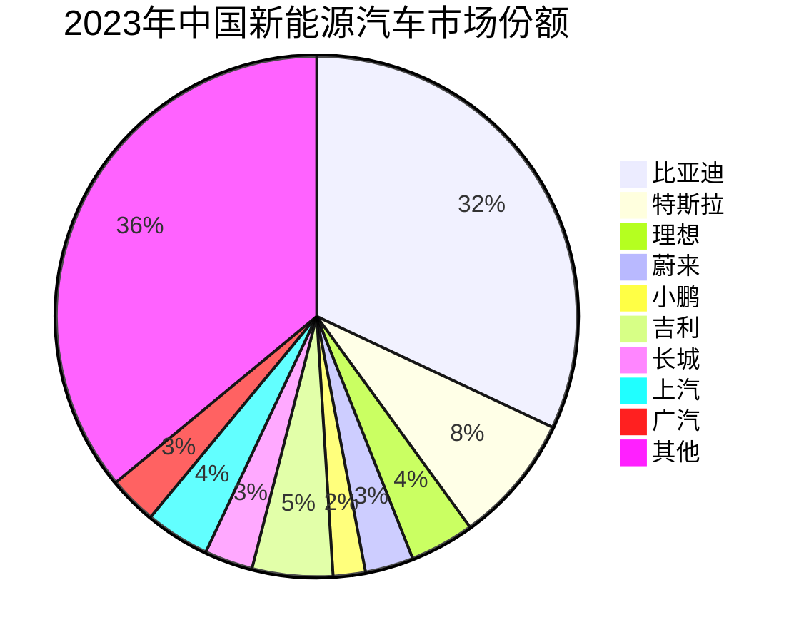

# 中国新能源车企概览

## 概述

中国新能源汽车产业已成为全球最大、最具活力的市场，涌现出比亚迪、蔚来、理想、小鹏等一批具有全球竞争力的车企。从传统车企转型到造车新势力崛起，中国新能源车企正在重塑全球汽车产业格局。

**学习目标**：
- 理解中国新能源车企的发展历程和竞争格局
- 掌握不同类型车企的商业模式和竞争策略
- 分析主要车企的技术特点和市场定位
- 评估新能源车企的投资价值和风险
- 识别行业发展趋势和投资机会

## 市场发展概况

### 市场规模

**销量数据**（万辆）：
| 年份 | 新能源汽车销量 | 同比增长 | 渗透率 | 全球占比 |
|------|--------------|---------|--------|---------|
| 2018 | 126 | +62% | 4.5% | 53% |
| 2019 | 121 | -4% | 4.7% | 50% |
| 2020 | 137 | +13% | 5.4% | 44% |
| 2021 | 352 | +158% | 13.4% | 53% |
| 2022 | 689 | +96% | 25.6% | 61% |
| 2023 | 949 | +38% | 31.6% | 63% |

**市场特征**：
- 从政策驱动转向市场驱动
- 渗透率快速提升
- 全球市场主导地位
- 出口快速增长

### 竞争格局

**市场梯队**：
- 第一梯队：比亚迪（300万+）
- 第二梯队：特斯拉、理想、蔚来、小鹏（10-30万）
- 第三梯队：吉利、长城、上汽、广汽等（5-15万）
- 第四梯队：零跑、哪吒、极氪等（5万以下）

## 车企分类与特点

### 传统车企转型

**比亚迪**：
- 垂直一体化优势
- 全价格段覆盖
- DM-i混动技术
- 市场份额第一

**吉利汽车**：
- 多品牌战略
- 极氪高端品牌
- SEA浩瀚架构
- 国际化布局

**长城汽车**：
- 欧拉品牌
- 柠檬平台
- 咖啡智能
- SUV优势

**上汽集团**：
- 飞凡品牌
- 智己汽车
- 零束科技
- 国企背景

### 造车新势力

**蔚来（NIO）**：
- 高端定位
- 换电模式
- 用户运营
- 服务体系

**理想（Li Auto）**：
- 增程式路线
- 家庭用车定位
- 产品力强
- 盈利能力好

**小鹏（XPeng）**：
- 智能驾驶特色
- 年轻用户群体
- 技术创新
- 国际化探索

**零跑汽车**：
- 全域自研
- 性价比路线
- 快速增长
- 下沉市场

### 跨界造车

**华为问界**：
- 华为赋能
- 智能化领先
- 渠道优势
- 快速崛起

**小米汽车**：
- 2024年入局
- 生态整合
- 用户基础
- 高度关注

## 技术路线对比

### 纯电动(BEV)

**代表企业**：特斯拉、蔚来、小鹏、极氪

**优势**：
- 零排放
- 驾驶体验好
- 维护成本低
- 智能化程度高

**挑战**：
- 续航焦虑
- 充电时间长
- 电池成本高
- 低温性能

### 插电混动(PHEV)

**代表企业**：比亚迪、理想、问界

**优势**：
- 无续航焦虑
- 油电双模式
- 使用灵活
- 过渡方案

**技术路线**：
- DM-i（比亚迪）：以电为主
- 增程式（理想）：电驱动+发电
- P2混动：传统混动升级

### 换电模式

**代表企业**：蔚来、吉利

**优势**：
- 补能快速（3-5分钟）
- 电池灵活升级
- 降低购车成本
- 电池统一管理

**挑战**：
- 基础设施投入大
- 标准化难度高
- 运营成本高
- 规模效应要求高

## 商业模式分析

### 比亚迪模式

**核心特征**：
- 垂直一体化
- 全产业链布局
- 成本控制能力强
- 规模优势明显

**盈利模式**：
- 整车销售
- 电池外供
- 零部件业务
- 规模效应

### 蔚来模式

**核心特征**：
- 高端定位
- 用户企业
- 服务体系
- 换电生态

**盈利模式**：
- 整车销售
- 电池租赁
- 增值服务
- 生态收入

### 理想模式

**核心特征**：
- 增程式路线
- 家庭用车定位
- 产品力驱动
- 效率优先

**盈利模式**：
- 整车销售为主
- 高毛利率
- 精简SKU
- 规模盈利

### 小鹏模式

**核心特征**：
- 智能化特色
- 全栈自研
- 年轻用户
- 技术驱动

**盈利模式**：
- 整车销售
- 软件服务
- 数据价值
- 技术输出

## 竞争优势分析

### 比亚迪优势

**技术优势**：
- 刀片电池
- DM-i混动
- e平台3.0
- CTB技术

**成本优势**：
- 垂直一体化
- 规模效应
- 自有电池
- 供应链掌控

**渠道优势**：
- 经销商网络
- 直营店
- 线上线下融合

### 新势力优势

**产品优势**：
- 智能化领先
- 用户体验好
- 迭代速度快
- 创新能力强

**品牌优势**：
- 高端定位
- 用户口碑
- 社区运营
- 品牌溢价

**服务优势**：
- 直营模式
- 用户服务
- OTA升级
- 数据运营

## 财务表现对比

### 盈利能力（2023年）

| 企业 | 毛利率 | 净利率 | ROE | 盈利状态 |
|------|--------|--------|-----|---------|
| 比亚迪 | 22% | 5% | 18% | 盈利 |
| 理想 | 22% | 10% | 25% | 盈利 |
| 蔚来 | 10% | -15% | - | 亏损 |
| 小鹏 | 5% | -25% | - | 亏损 |
| 特斯拉 | 18% | 15% | 30% | 盈利 |

**盈利分化**：
- 比亚迪、理想实现规模盈利
- 蔚来、小鹏仍在亏损
- 规模效应是盈利关键
- 毛利率是核心指标

### 现金流状况

**比亚迪**：
- 经营现金流充沛
- 自由现金流为正
- 支撑扩张和研发

**理想**：
- 经营现金流转正
- 现金储备充足
- 财务健康

**蔚来**：
- 经营现金流改善
- 依赖融资
- 现金压力大

**小鹏**：
- 经营现金流为负
- 融资需求大
- 财务压力

## 投资逻辑分析

### 行业驱动因素

**需求端**：
- 渗透率持续提升
- 消费升级
- 智能化需求
- 环保意识

**供给端**：
- 产品力提升
- 成本下降
- 充电设施完善
- 技术进步

**政策端**：
- 双积分政策
- 购置税减免
- 地方补贴
- 基础设施支持

### 投资主线

**1. 龙头企业**
- 比亚迪：规模优势，全面领先
- 理想：盈利能力强，增长稳健
- 投资逻辑：强者恒强，份额提升

**2. 成长企业**
- 蔚来：高端市场，换电模式
- 小鹏：智能驾驶，技术创新
- 投资逻辑：成长空间，技术突破

**3. 主题投资**
- 智能驾驶：激光雷达、芯片
- 换电模式：换电站、电池银行
- 出口增长：海外市场拓展

### 估值方法

**成长期估值**：
- PS估值：2-5倍
- 考虑增长速度和市场空间
- 适用于未盈利企业

**成熟期估值**：
- PE估值：15-25倍
- 考虑盈利能力和ROE
- 适用于盈利企业

**分部估值**：
- 整车业务
- 电池业务
- 软件服务
- 综合评估

## 投资风险

### 竞争风险

**价格战**：
- 产能过剩
- 竞争加剧
- 利润率下降

**市场份额**：
- 新进入者
- 传统车企反击
- 份额争夺

### 技术风险

**技术路线**：
- 固态电池突破
- 氢能源发展
- 路线选择

**智能驾驶**：
- 技术难度大
- 安全责任
- 法规限制

### 财务风险

**盈利压力**：
- 研发投入大
- 营销费用高
- 规模效应要求

**现金流**：
- 资本开支大
- 融资需求
- 生存压力

### 政策风险

**补贴退坡**：
- 政策支持减弱
- 成本压力
- 市场化竞争

**准入门槛**：
- 资质审批
- 生产规范
- 环保要求

## 未来发展趋势

### 技术趋势

**电动化**：
- 800V高压平台
- 快充技术
- 电池技术升级
- 续航突破1000km

**智能化**：
- L3/L4自动驾驶
- 智能座舱
- 车路协同
- AI大模型

**网联化**：
- 5G车联网
- V2X通信
- OTA升级
- 数据运营

### 市场趋势

**渗透率提升**：
- 2025年目标：45%
- 2030年目标：70%
- 2035年目标：90%+

**出口增长**：
- 欧洲市场
- 东南亚市场
- 南美市场
- 全球化布局

**商业模式创新**：
- 订阅服务
- 电池租赁
- 换电模式
- 共享出行

### 竞争格局

**集中度提升**：
- 头部企业份额提升
- 中小企业淘汰
- 并购重组

**国际化**：
- 中国品牌出海
- 全球竞争
- 本地化生产

## 投资策略建议

### 长期投资

**核心持仓**：
- 比亚迪：龙头地位，全面领先
- 理想：盈利能力强，增长稳健
- 配置比例：30-40%

**投资期限**：
- 3-5年
- 穿越周期
- 享受成长

### 成长投资

**高成长标的**：
- 蔚来：高端市场，换电模式
- 小鹏：智能驾驶，技术创新
- 配置比例：20-30%

**关注要点**：
- 销量增速
- 毛利率改善
- 技术突破
- 盈利拐点

### 波段操作

**交易策略**：
- 关注销量数据
- 估值合理区间
- 政策催化
- 技术突破

**风险控制**：
- 仓位管理
- 止损纪律
- 分散投资

## 延伸阅读

### 推荐资料

1. **《中国新能源汽车产业发展报告》** - 中汽协
2. **各车企年报** - 财务和战略
3. **券商研究报告** - 行业分析
4. **《智能电动汽车》** - 技术趋势
5. **行业数据库** - 销量、渗透率

### 相关主题

- [比亚迪深度研究](./byd.html)
- [蔚来汽车分析](./nio.html)
- 理想汽车研究
- [小鹏汽车分析](./xpeng.html)

## 参考文献

1. 中国汽车工业协会. (2023). 新能源汽车产销数据
2. 比亚迪. (2023). 年度报告
3. 理想汽车. (2023). 年度报告
4. 蔚来汽车. (2023). 年度报告
5. 小鹏汽车. (2023). 年度报告
6. 中金公司. (2023). 新能源汽车行业深度报告
7. 中信证券. (2023). 新能源汽车投资策略
8. 国泰君安. (2023). 造车新势力研究
9. IEA. (2023). Global EV Outlook
10. BNEF. (2023). Electric Vehicle Outlook

---

**下一步学习**：
- [比亚迪案例分析](./byd.html)
- [蔚来汽车研究](./nio.html)
- 理想汽车分析
- [小鹏汽车研究](./xpeng.html)

## 深度分析

### 核心机制解析

理解本主题需要从多个维度进行系统性分析。以下从理论基础、实践应用和历史验证三个层面展开深度探讨。

**理论基础层面**：本主题的核心逻辑建立在经济学和金融学的基本原理之上。通过对基础理论的深入理解，投资者能够建立起稳固的分析框架，避免被市场短期噪音所干扰。

**实践应用层面**：理论必须与实践相结合才能产生价值。在实际投资决策中，需要将抽象的概念转化为具体的分析工具和决策标准。

**历史验证层面**：金融市场有着丰富的历史记录，通过研究历史案例，我们可以验证理论的有效性，并从中提炼出具有普遍意义的规律。

### 关键影响因素

影响本主题的关键因素可以从以下几个维度进行分析：

1. **宏观经济环境**：利率水平、通货膨胀率、经济增长速度等宏观变量对本主题有着深远影响。在不同的宏观经济周期中，相关指标的表现会呈现出显著差异。

2. **市场结构因素**：市场参与者的构成、信息传播机制、流动性状况等市场结构因素决定了价格发现的效率和准确性。

3. **政策监管环境**：政府政策、监管框架的变化会直接影响相关市场的运作规则和参与者行为。

4. **技术创新驱动**：技术进步不断改变着金融市场的运作方式，从算法交易到区块链技术，每一次技术革新都带来新的机遇和挑战。

5. **全球化与地缘政治**：在全球化背景下，各国市场之间的联动性日益增强，地缘政治风险的影响也越来越不可忽视。

### 量化分析框架

为了更精确地分析和评估，可以采用以下量化框架：

| 分析维度 | 关键指标 | 参考基准 | 分析方法 |
|---------|---------|---------|---------|
| 规模评估 | 绝对值与相对值 | 历史均值 | 趋势分析 |
| 质量评估 | 稳定性指标 | 行业对标 | 横向比较 |
| 风险评估 | 波动率指标 | 风险阈值 | 情景分析 |
| 价值评估 | 估值倍数 | 历史区间 | 回归分析 |

通过系统性地应用上述框架，投资者可以对目标进行全面、客观的评估，从而做出更加理性的投资决策。

