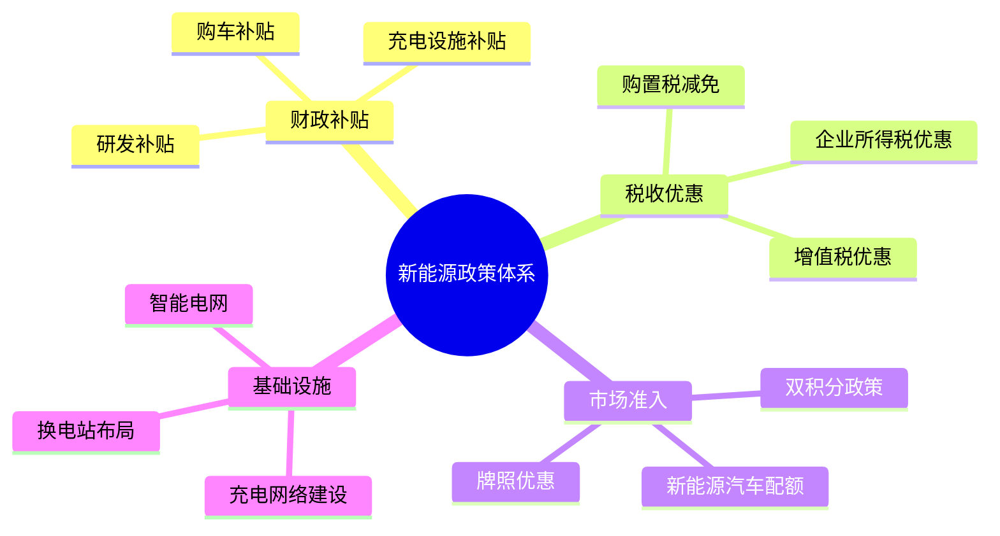
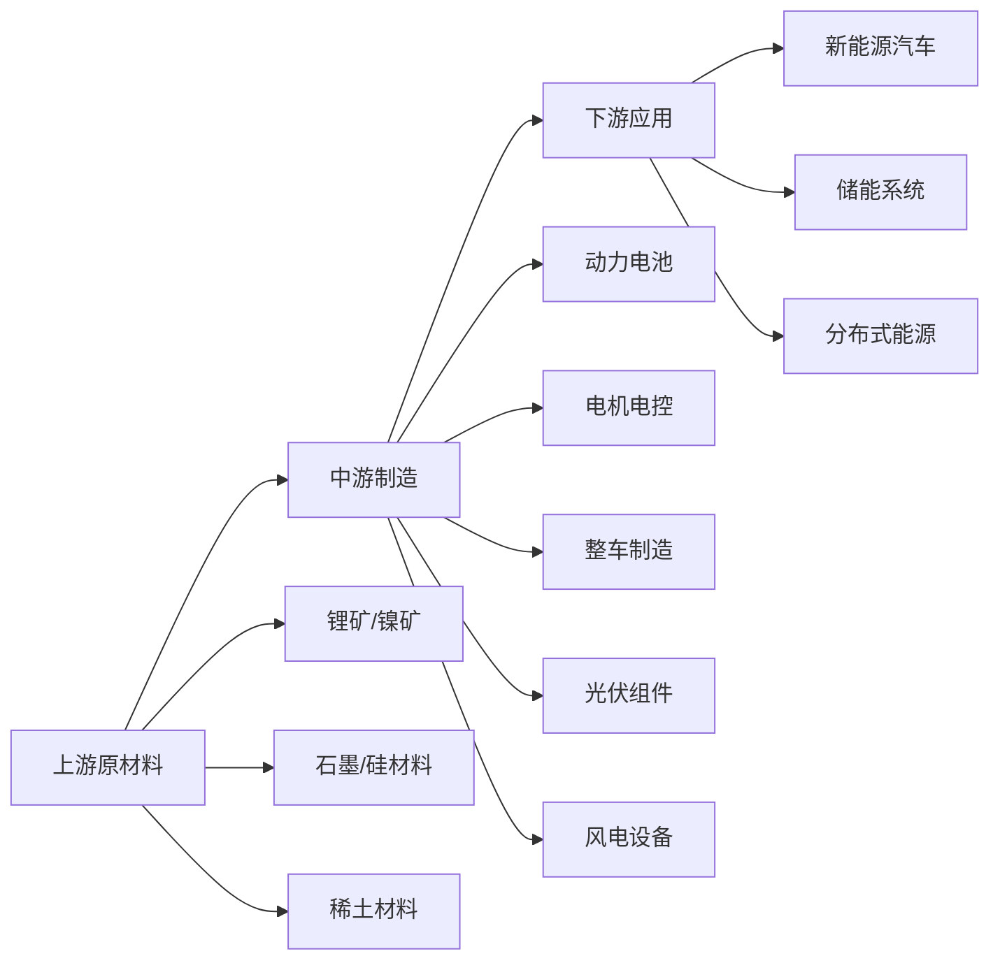
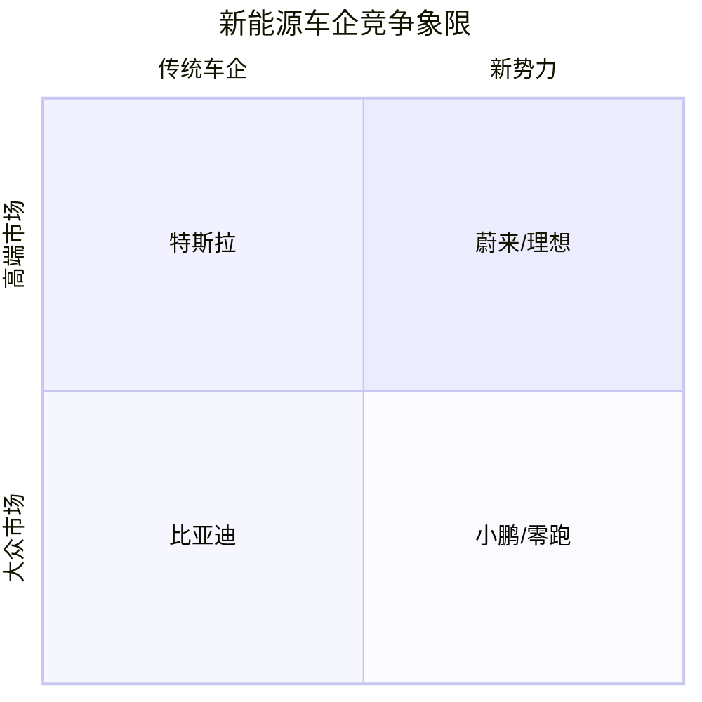
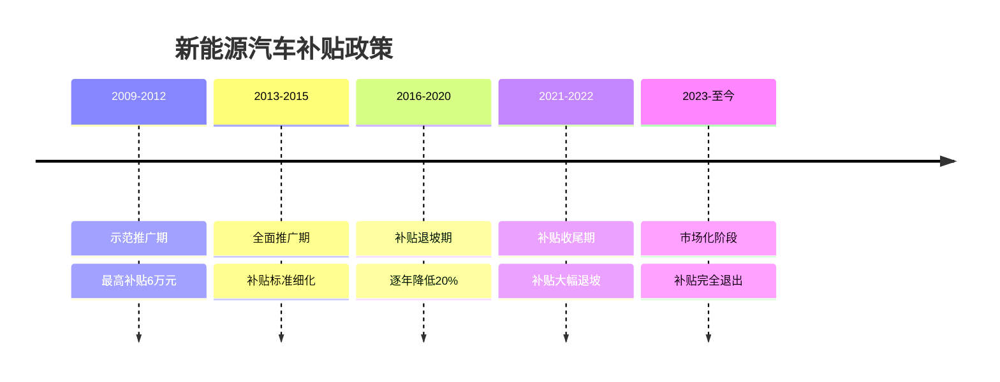
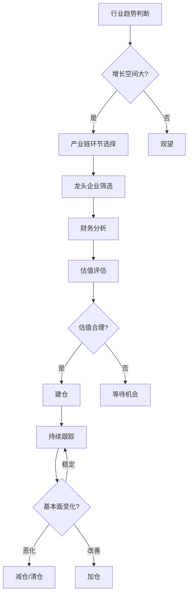

# 中国新能源板块总览

## 概述

中国新能源产业已成为全球清洁能源转型的引领者，在电动汽车、动力电池、光伏、风电等领域建立了完整的产业链和全球领先地位。本文全面分析中国新能源板块的发展现状、政策环境、产业链结构、主要企业和投资机会。

**学习目标**：
- 理解中国新能源产业的战略地位和发展历程
- 掌握新能源产业链的完整结构和关键环节
- 分析主要细分领域的竞争格局和投资逻辑
- 评估政策驱动和技术创新对产业的影响
- 识别新能源板块的投资机会和风险

## 战略地位与发展历程

### 国家战略定位

**双碳目标驱动**：
- 2030年碳达峰、2060年碳中和
- 能源结构转型的核心抓手
- 产业升级和技术创新的突破口
- 国际竞争力提升的关键领域

**产业政策支持**：

### 发展历程

**第一阶段（2009-2015）：起步期**
- 政策驱动为主
- 补贴力度大
- 产业链初步形成
- 技术积累阶段

**第二阶段（2016-2020）：成长期**
- 市场规模快速扩大
- 产业链逐步完善
- 技术水平显著提升
- 龙头企业崛起

**第三阶段（2021-至今）：成熟期**
- 市场驱动为主
- 全球竞争力形成
- 产业链优势巩固
- 技术创新加速

## 产业链结构分析

### 完整产业链图谱

### 上游：资源与材料

**关键资源**：
- **锂资源**：全球第三大锂资源国，盐湖锂和矿石锂并重
- **镍钴资源**：对外依存度高，积极布局海外资源
- **稀土资源**：全球最大稀土生产国，永磁材料优势明显
- **石墨资源**：天然石墨和人造石墨产能全球第一

**材料加工**：
- 正极材料：三元材料、磷酸铁锂技术领先
- 负极材料：石墨负极全球主导，硅基负极快速发展
- 电解液：六氟磷酸锂等关键材料自主可控
- 隔膜：湿法隔膜和干法隔膜技术成熟

### 中游：核心制造

**动力电池**：
- 全球市场份额超过60%
- 宁德时代、比亚迪等龙头企业
- 技术路线：三元锂、磷酸铁锂、钠离子电池
- 产能规模：2023年超过1000GWh

**电机电控**：
- 永磁同步电机技术成熟
- 碳化硅功率器件快速发展
- 集成化、轻量化趋势明显

**整车制造**：
- 传统车企转型：比亚迪、上汽、广汽
- 造车新势力：蔚来、小鹏、理想
- 智能化、网联化特色鲜明

**光伏制造**：
- 硅片、电池片、组件全产业链优势
- 全球市场份额超过80%
- PERC、TOPCon、HJT等技术路线并进

**风电设备**：
- 陆上风电和海上风电装备齐全
- 大型化、智能化趋势
- 全球市场份额约50%

### 下游：应用场景

**新能源汽车**：
- 2023年产销量超过900万辆
- 渗透率超过30%
- 出口快速增长

**储能系统**：
- 电化学储能装机快速增长
- 用户侧储能、电网侧储能并重
- 虚拟电厂等新模式探索

**分布式能源**：
- 户用光伏快速发展
- 工商业储能经济性提升
- 微电网、智慧能源系统

## 主要细分领域分析

### 1. 动力电池产业

**市场规模**：
- 2023年装机量约400GWh
- 年增长率30%以上
- 全球市场主导地位

**竞争格局**：
| 企业 | 市场份额 | 技术特点 | 客户群体 |
|------|---------|---------|---------|
| 宁德时代 | 37% | 全技术路线 | 全球主流车企 |
| 比亚迪 | 16% | 刀片电池 | 自供+外供 |
| 中创新航 | 8% | 三元为主 | 广汽等 |
| 国轩高科 | 5% | 磷酸铁锂 | 大众等 |
| 亿纬锂能 | 4% | 圆柱电池 | 宝马等 |

**技术趋势**：
- 高镍三元：能量密度提升至300Wh/kg
- 磷酸铁锂：成本优势+安全性，CTP/CTB技术
- 钠离子电池：低成本替代方案
- 固态电池：下一代技术方向

**投资逻辑**：
- 需求持续高增长
- 技术迭代带来结构性机会
- 产业链一体化优势
- 全球化扩张空间

### 2. 新能源汽车产业

**市场特征**：
- 从政策驱动转向市场驱动
- 智能化成为核心竞争力
- 价格区间全覆盖
- 出口成为新增长点

**竞争格局**：

**比亚迪**：
- 垂直一体化优势
- 全价格段覆盖
- DM-i混动技术
- 2023年销量超过300万辆

**造车新势力**：
- 蔚来：高端定位，换电模式，用户运营
- 理想：增程式路线，家庭用车定位
- 小鹏：智能驾驶特色，年轻用户群体

**投资考量**：
- 销量规模和增速
- 毛利率和盈利能力
- 技术创新能力
- 品牌力和用户粘性

### 3. 光伏产业

**产业链优势**：
- 硅料：全球产能70%以上
- 硅片：隆基、中环等龙头
- 电池片：通威、晶科等
- 组件：晶澳、天合等

**技术路线**：
- PERC：主流技术，效率24%+
- TOPCon：新一代技术，效率25%+
- HJT：高效技术，效率26%+
- 钙钛矿：未来方向，效率潜力大

**市场驱动**：
- 平价上网实现
- 全球碳中和需求
- 储能配套完善
- 分布式光伏爆发

### 4. 风电产业

**发展特点**：
- 陆上风电：大基地模式
- 海上风电：快速发展期
- 风机大型化：单机容量提升至15MW+
- 漂浮式风电：深远海开发

**主要企业**：
- 金风科技：直驱永磁技术
- 明阳智能：海上风电优势
- 运达股份：中速永磁路线

## 政策环境分析

### 产业政策体系

**补贴政策演变**：

**双积分政策**：
- 新能源汽车积分比例要求
- 传统燃油车油耗积分
- 积分交易市场化
- 倒逼车企转型

**充电基础设施**：
- 2025年目标：充电桩2000万个
- 公共充电桩和私人充电桩并重
- 换电站布局加速
- 智能充电网络建设

### 地方政策支持

**产业集群**：
- 长三角：动力电池、整车制造
- 珠三角：电池材料、电机电控
- 京津冀：整车制造、氢能
- 西部地区：锂资源、光伏制造

**招商引资**：
- 土地优惠
- 税收减免
- 研发补贴
- 人才引进

## 投资机会与风险

### 投资主线

**1. 电动化主线**
- 动力电池龙头：宁德时代、比亚迪
- 电池材料：正极、负极、电解液、隔膜
- 整车制造：比亚迪、理想、蔚来

**2. 智能化主线**
- 智能驾驶：激光雷达、芯片、算法
- 智能座舱：车载OS、人机交互
- 车联网：通信模块、云平台

**3. 能源化主线**
- 储能系统：电池储能、抽水蓄能
- 充换电：充电桩、换电站
- 虚拟电厂：需求响应、能源管理

**4. 全球化主线**
- 出口增长：整车、电池出口
- 海外建厂：本地化生产
- 技术输出：标准制定、专利授权

### 估值方法

**成长股估值**：
- PS估值：适用于高增长、未盈利企业
- PEG估值：考虑增长率的PE
- DCF估值：长期现金流折现

**周期股估值**：
- PB估值：资产重估
- EV/EBITDA：企业价值倍数
- 产能利用率：周期判断

### 投资风险

**政策风险**：
- 补贴退坡影响
- 准入门槛提高
- 环保标准趋严

**技术风险**：
- 技术路线选择
- 产品迭代速度
- 专利侵权风险

**竞争风险**：
- 产能过剩
- 价格战
- 国际竞争加剧

**供应链风险**：
- 原材料价格波动
- 芯片短缺
- 地缘政治影响

## 未来发展趋势

### 技术创新方向

**电池技术**：
- 固态电池商业化
- 钠离子电池规模应用
- 电池回收利用体系完善

**智能化**：
- L4级自动驾驶量产
- 车路协同V2X
- AI大模型上车

**能源生态**：
- 光储充一体化
- V2G双向充电
- 虚拟电厂规模化

### 市场格局演变

**整合趋势**：
- 产业链垂直整合
- 跨界合作增多
- 并购重组加速

**全球化**：
- 中国企业出海
- 本地化生产布局
- 全球供应链重构

**商业模式创新**：
- 电池租赁
- 换电模式
- 能源服务

## 投资策略建议

### 长期投资

**核心资产**：
- 宁德时代：全球动力电池龙头
- 比亚迪：垂直一体化优势
- 隆基绿能：光伏硅片龙头

**配置逻辑**：
- 行业长期增长确定性
- 龙头企业竞争优势
- 技术创新能力
- 全球化扩张空间

### 成长投资

**高成长标的**：
- 造车新势力：蔚来、理想、小鹏
- 电池材料：正极、负极、电解液
- 智能驾驶：激光雷达、芯片

**关注要点**：
- 收入增速
- 市场份额变化
- 技术突破
- 订单情况

### 周期投资

**周期品种**：
- 锂资源：碳酸锂价格周期
- 硅料：光伏硅料价格周期
- 风电：装机周期

**操作策略**：
- 低位布局
- 高位减持
- 关注库存和价格

## 常见误区

**误区1：新能源=高估值**
- 需区分成长期和成熟期
- 关注盈利能力和现金流
- 估值需匹配增长速度

**误区2：技术领先=投资价值**
- 技术需要商业化验证
- 成本控制同样重要
- 产业链配套是关键

**误区3：政策依赖度高**
- 已从政策驱动转向市场驱动
- 经济性是核心竞争力
- 全球化降低政策依赖

**误区4：忽视供应链风险**
- 原材料价格波动影响大
- 产能扩张需要时间
- 地缘政治影响供应链

## 实战应用

### 行业研究框架

**宏观层面**：
1. 政策环境分析
2. 市场规模预测
3. 渗透率趋势
4. 国际比较

**中观层面**：
1. 产业链分析
2. 竞争格局
3. 技术路线
4. 商业模式

**微观层面**：
1. 公司基本面
2. 财务分析
3. 估值水平
4. 催化剂

### 投资决策流程

## 延伸阅读

### 推荐书籍

1. **《新能源汽车产业发展报告》** - 中国汽车工程学会
   - 权威行业报告
   - 年度更新

2. **《动力电池技术与应用》** - 欧阳明高
   - 电池技术详解
   - 院士级专家

3. **《光伏产业发展史》** - 王斯成
   - 产业发展历程
   - 政策演变分析

4. **《智能电动汽车》** - 李克强
   - 智能化趋势
   - 技术路线图

### 研究机构

**国内机构**：
- 中国汽车工业协会
- 中国电池工业协会
- 中国光伏行业协会
- 中国可再生能源学会

**国际机构**：
- IEA（国际能源署）
- BNEF（彭博新能源财经）
- SNE Research
- Wood Mackenzie

### 数据来源

**官方数据**：
- 工信部：产销数据
- 能源局：装机数据
- 统计局：宏观数据

**行业数据**：
- 中汽协：汽车数据
- GGII：电池数据
- CPIA：光伏数据

**企业数据**：
- 上市公司公告
- 投资者交流会
- 行业会议

## 参考文献

1. 中国汽车工程学会. (2023). 《节能与新能源汽车技术路线图2.0》
2. 国家发改委、能源局. (2022). 《"十四五"现代能源体系规划》
3. 工信部. (2023). 《新能源汽车产业发展规划（2021-2035年）》
4. 欧阳明高. (2022). 《动力电池技术发展趋势》. 中国工程科学
5. 中国光伏行业协会. (2023). 《中国光伏产业发展路线图》
6. IEA. (2023). Global EV Outlook 2023
7. BNEF. (2023). Electric Vehicle Outlook
8. SNE Research. (2023). Global EV Battery Market Analysis
9. 宁德时代. (2023). 年度报告
10. 比亚迪. (2023). 年度报告
11. 隆基绿能. (2023). 年度报告
12. 中金公司. (2023). 《新能源行业深度报告》
13. 中信证券. (2023). 《动力电池行业研究》
14. 国泰君安. (2023). 《新能源汽车产业链投资策略》
15. McKinsey. (2023). The future of mobility in China

---

**下一步学习**：
- [宁德时代深度研究](./ev-batteries/catl-deep.html) - 全球动力电池龙头分析
- [比亚迪案例分析](./ev-makers/byd.html) - 垂直一体化典范
- [中国科技板块](../technology/overview.html) - 科技创新驱动
