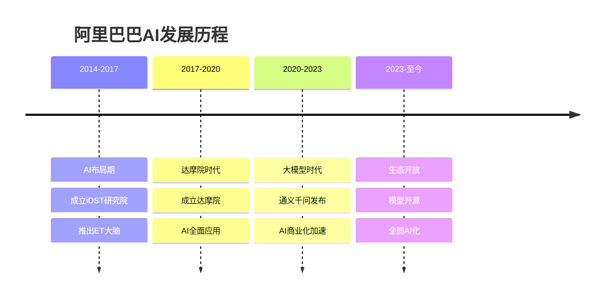

# 阿里巴巴AI战略：通义千问与云计算生态

## 公司概况

### 基本信息

**公司名称**：阿里巴巴集团控股有限公司（Alibaba Group Holding Limited）
**股票代码**：BABA（纽交所）、9988.HK（港股）
**成立时间**：1999年
**总部位置**：中国杭州
**创始人**：马云、蔡崇信等18人

**AI业务范围**：
- 通义千问：大语言模型
- 阿里云AI：云端AI服务
- 达摩院：AI研究机构
- 平头哥：AI芯片
- 天猫精灵：智能音箱

**市值规模**（2023）：
- 约2000亿美元
- 中国第二大互联网公司
- 云计算市场份额第一

### AI发展历程

**关键里程碑**：
- 2014年：成立iDST研究院
- 2017年：成立达摩院，投入1000亿
- 2017年：推出ET城市大脑
- 2020年：平头哥发布含光800 AI芯片
- 2023年：通义千问大模型发布
- 2023年：通义千问开源
- 2024年：AI全面融入阿里生态

## 通义千问大模型分析

### 技术能力

**模型规模**：
- 参数规模：千亿级
- 训练数据：万亿级token
- 多模态：文本、图像、音频、视频
- 中英文：双语能力强

**技术特点**：
- 长文本：支持8K-32K上下文
- 多模态：图文音视频理解
- 工具调用：API集成能力
- 知识更新：持续学习

**性能表现**：

| 能力维度 | 通义千问 | GPT-4 | 文心一言 | 差距 |
|---------|---------|-------|---------|------|
| 中文理解 | 95 | 90 | 95 | 领先 |
| 英文理解 | 90 | 98 | 85 | 追赶 |
| 代码生成 | 88 | 95 | 85 | 接近 |
| 数学推理 | 85 | 92 | 82 | 追赶 |
| 多模态 | 90 | 95 | 88 | 接近 |

### 产品矩阵

**通义千问系列**：
- 通义千问-Max：最强版本
- 通义千问-Plus：平衡版本
- 通义千问-Turbo：快速版本
- 通义千问-Long：长文本版本

**垂直模型**：
- 通义听悟：语音识别转写
- 通义万相：AI绘画
- 通义智文：文档处理
- 通义点金：金融大模型
- 通义法睿：法律大模型

**开发者工具**：
- 模型服务平台：API调用
- 百炼平台：模型训练
- 魔搭社区：开源生态
- 灵积平台：模型部署

### 商业化策略

**API服务**：
- 按Token计费
- 价格：0.008元/千token（Turbo）
- 免费额度：100万token/月
- 企业套餐：定制化服务

**私有化部署**：
- 企业专属模型
- 本地化部署
- 数据安全保障
- 定制化训练

**行业解决方案**：
- 电商：智能客服、商品描述生成
- 金融：风控、投研、客服
- 政务：智能问答、文档处理
- 教育：智能辅导、作业批改

**开源策略**：
- 通义千问-7B：开源
- 通义千问-14B：开源
- 通义千问-72B：开源
- 生态建设：吸引开发者

## 阿里云AI能力

### AI基础设施

**算力平台**：
- 自建数据中心：全球200+
- GPU集群：数万张GPU
- 专用AI芯片：含光800、倚天710
- 算力规模：中国第一

**AI平台**：
- PAI平台：机器学习平台
- 模型训练：分布式训练
- 模型部署：弹性推理
- 模型管理：全生命周期

**数据服务**：
- 数据湖：海量数据存储
- 数据处理：实时/离线处理
- 数据标注：智能标注工具
- 数据安全：隐私计算

### AI产品服务

**视觉AI**：
- 人脸识别：金融、安防
- 图像识别：电商、工业
- 视频分析：内容审核、智能剪辑
- OCR：文字识别

**语音AI**：
- 语音识别：实时转写
- 语音合成：多音色
- 声纹识别：身份认证
- 语音翻译：多语言

**自然语言处理**：
- 文本分析：情感分析、实体识别
- 机器翻译：200+语言对
- 智能问答：知识图谱
- 文本生成：营销文案

**行业AI**：
- 新零售：智能导购、无人店
- 新制造：工业视觉、预测性维护
- 新金融：风控、反欺诈
- 智慧城市：城市大脑

### 商业模式

**收入结构**：
- IaaS：计算、存储、网络
- PaaS：数据库、中间件、AI平台
- SaaS：企业应用
- 行业解决方案：定制化服务

**定价策略**：
- 按量付费：灵活计费
- 包年包月：成本优化
- 资源包：批量优惠
- 企业协议：大客户定制

**市场地位**：
- 中国市场份额：35%+
- 全球市场份额：5%+
- 排名：中国第一、全球前五
- 增速：30%+

## 达摩院研究能力

### 研究方向

**AI基础研究**：
- 机器学习：深度学习、强化学习
- 自然语言处理：大模型、对话系统
- 计算机视觉：图像识别、视频理解
- 语音技术：语音识别、语音合成

**前沿技术**：
- 量子计算：量子芯片、量子算法
- 区块链：分布式账本、智能合约
- 芯片技术：AI芯片、RISC-V
- 自动驾驶：感知、决策、控制

### 研发投入

**资金投入**：
- 达摩院：1000亿人民币（3年）
- 年研发费用：600亿+人民币
- 研发占比：15%+
- 全球研发中心：10+

**人才储备**：
- 研发人员：3万+
- 博士：数千人
- 顶尖科学家：数十人
- 院士：多位

**研究成果**：
- 论文发表：顶会数百篇/年
- 专利申请：数万件
- 技术标准：参与制定
- 开源项目：数百个

## 平头哥AI芯片

### 芯片产品

**含光800**：
- 类型：AI推理芯片
- 性能：78563 IPS（ResNet-50）
- 能效比：500 IPS/W
- 应用：云端推理

**倚天710**：
- 类型：服务器CPU
- 架构：ARM架构
- 核心数：128核
- 应用：云计算

**玄铁系列**：
- 类型：RISC-V处理器
- 开源：全面开源
- 生态：推动RISC-V生态
- 应用：IoT、边缘计算

### 商业化进展

**自用为主**：
- 阿里云：降低成本
- 淘宝天猫：图像搜索
- 菜鸟：智能物流
- 优酷：视频转码

**对外销售**：
- 云服务：算力租赁
- 授权：IP授权
- 合作：与芯片厂商合作

**竞争力分析**：
- 优势：自研自用、成本优化
- 劣势：生态不如NVIDIA
- 定位：补充而非替代
- 前景：长期投入

## AI在阿里生态的应用

### 电商场景

**淘宝天猫**：
- 智能推荐：千人千面
- 图像搜索：拍照购物
- 智能客服：阿里小蜜
- 商品描述：AI生成
- 虚拟试衣：AR技术

**商业价值**：
- 转化率提升：20%+
- 客服成本：降低50%+
- 用户体验：显著提升
- GMV增长：AI驱动

### 物流场景

**菜鸟网络**：
- 智能调度：路径优化
- 智能分拣：视觉识别
- 无人仓：机器人
- 无人车：末端配送
- 智能客服：物流查询

**效率提升**：
- 分拣效率：提升3倍
- 配送时效：缩短30%
- 成本降低：20%+
- 准确率：99.9%+

### 金融场景

**蚂蚁集团**：
- 风控：智能反欺诈
- 信贷：智能审批
- 客服：智能问答
- 投顾：智能推荐
- 保险：智能核保

**风控能力**：
- 欺诈识别：准确率99%+
- 实时决策：毫秒级
- 坏账率：行业最低
- 用户体验：无感风控

### 本地生活

**饿了么、高德**：
- 智能推荐：餐厅、商家
- 路径规划：实时导航
- 配送调度：骑手调度
- 智能客服：订单处理

### 娱乐场景

**优酷、阿里影业**：
- 内容推荐：个性化推荐
- 视频理解：内容标签
- 智能剪辑：自动生成
- 虚拟制作：AI特效

## 财务分析

### 阿里云收入

**收入规模**：
- 2020财年：400亿人民币
- 2021财年：724亿人民币
- 2022财年：1001亿人民币
- 2023财年：776亿人民币（调整后）
- 2024财年E：900亿人民币

**盈利情况**：
- 2022财年：首次盈利
- 2023财年：持续盈利
- 经营利润率：5-10%
- 目标：15%+

### AI投入产出

**研发投入**：
- 年研发费用：600亿+
- AI占比：30%+
- 达摩院：持续投入
- 平头哥：芯片研发

**商业化收入**：
- 阿里云AI：数十亿
- 通义千问：快速增长
- 行业解决方案：百亿级
- 预计：2025年AI收入200亿+

**投入回报**：
- 内部降本增效：显著
- 外部收入：快速增长
- 生态价值：长期
- ROI：逐步提升

## 投资价值评估

### 估值分析

**当前估值（2023）**：
- 市值：约2000亿美元
- PE：约15倍
- PS：约1.5倍
- EV/EBITDA：约10倍

**分部估值**：

| 业务 | 估值（亿美元） | 方法 |
|------|---------------|------|
| 淘宝天猫 | 1200 | PE 20倍 |
| 阿里云 | 500 | PS 5倍 |
| 菜鸟 | 100 | PS 2倍 |
| 本地生活 | 100 | PS 1倍 |
| 其他 | 100 | 账面价值 |
| 合计 | 2000 | - |

### 投资论点

**看多理由**：
1. **AI领先**：通义千问中国前三
2. **云计算龙头**：市场份额第一
3. **生态优势**：电商、云、物流、金融
4. **估值合理**：PE 15倍，历史低位
5. **回购分红**：股东回报提升
6. **AI商业化**：加速变现

**看空理由**：
1. **增长放缓**：电商增速下降
2. **竞争加剧**：拼多多、京东、抖音
3. **监管风险**：反垄断、数据安全
4. **宏观环境**：消费疲软
5. **AI投入**：短期影响利润

### 投资建议

**适合投资者**：
- 价值投资者
- 长期投资者
- 看好AI和云计算

**投资策略**：
- 建仓区间：70-85美元
- 持有周期：3-5年
- 目标价：120美元+
- 止损位：60美元

**仓位建议**：
- 核心持仓：10-15%
- 关注：AI商业化、云计算增长
- 调整：根据业绩动态调整

## AI战略优势

### 1. 生态优势

**应用场景丰富**：
- 电商：淘宝天猫
- 云计算：阿里云
- 物流：菜鸟
- 金融：蚂蚁
- 本地生活：饿了么、高德
- 娱乐：优酷

**数据优势**：
- 用户数据：10亿+用户
- 交易数据：万亿级GMV
- 行为数据：海量
- 多维数据：全方位

### 2. 技术优势

**全栈能力**：
- 芯片：平头哥
- 算力：阿里云
- 算法：达摩院
- 应用：全生态

**研发实力**：
- 达摩院：顶尖科学家
- 研发投入：600亿+/年
- 专利：数万件
- 论文：顶会前列

### 3. 商业化优势

**内部应用**：
- 降本增效：显著
- 用户体验：提升
- 商业价值：巨大
- 验证场景：丰富

**外部输出**：
- 阿里云：AI服务
- 通义千问：API
- 行业方案：定制化
- 开源生态：吸引开发者

## 投资风险分析

### 1. 竞争风险

**大模型竞争**：
- 百度文心：先发优势
- 腾讯混元：社交数据
- 字节豆包：内容生态
- 国际：GPT-4、Claude

**云计算竞争**：
- 腾讯云：快速追赶
- 华为云：政企市场
- AWS、Azure：国际巨头

### 2. 监管风险

**反垄断**：
- 182亿罚款
- 业务拆分
- 限制并购

**数据安全**：
- 数据出境
- 隐私保护
- 合规成本

### 3. 技术风险

**AI技术差距**：
- 与GPT-4差距1-2年
- 持续投入需求大
- 技术路线不确定

**芯片依赖**：
- 依赖NVIDIA
- 国产替代进展慢
- 美国制裁风险

### 4. 宏观风险

**消费疲软**：
- 电商增速放缓
- 广告收入下降
- 云计算需求波动

**地缘政治**：
- 中美关系
- 技术脱钩
- 供应链风险

## 投资启示

### 1. 生态的力量

**平台优势**：
- 多业务协同
- 数据互通
- 技术共享
- 规模效应

**AI赋能**：
- 全面AI化
- 降本增效
- 创造新价值
- 构建护城河

### 2. 长期主义

**持续投入**：
- 达摩院1000亿
- 年研发600亿+
- 不计短期回报
- 着眼长期

**技术积累**：
- 从0到1突破
- 从1到N应用
- 技术到产品
- 产品到生态

### 3. 开放生态

**开源策略**：
- 通义千问开源
- 魔搭社区
- 吸引开发者
- 构建生态

**合作共赢**：
- 与企业合作
- 与开发者共建
- 与行业共创
- 做大蛋糕

## 常见问题

### Q1：阿里AI能赶上百度吗？

**回答**：
- 大模型：差距不大，各有特色
- 应用场景：阿里更丰富
- 商业化：阿里生态优势明显
- 长期：有机会并驾齐驱

### Q2：通义千问能赚钱吗？

**回答**：
- 短期：投入期，亏损
- 中期：API收入快速增长
- 长期：内部降本+外部收入
- 预计：2025年后贡献显著收入

### Q3：什么时候买入阿里？

**回答**：
- 估值：PE < 18倍
- 股价：70-85美元
- 时机：AI商业化加速、云计算恢复增长
- 策略：分批建仓，长期持有

### Q4：阿里AI的最大优势是什么？

**回答**：
- 生态：应用场景最丰富
- 数据：用户和交易数据
- 商业化：内部验证+外部输出
- 全栈：芯片到应用全覆盖

## 延伸阅读

### 推荐书籍

1. **《阿里巴巴：天下没有难做的生意》** - 波特·埃里斯曼
2. **《马云：未来已来》** - 阿里巴巴集团
3. **《智能商业》** - 曾鸣
4. **《数据中台》** - 阿里巴巴

### 研究报告

- 阿里巴巴年报和季报
- 各大券商阿里深度报告
- 阿里云AI白皮书
- 通义千问技术报告

## 参考文献

1. 阿里巴巴. 《年度报告》. 2020-2023
2. 阿里云. 《AI产品白皮书》. 2023
3. 达摩院. 《技术趋势报告》. 2023
4. 中金公司. 《阿里巴巴深度报告》. 2023
5. 高盛. 《Alibaba: AI Strategy》. 2023
6. 摩根士丹利. 《Alibaba Cloud Analysis》. 2023
7. IDC. 《中国公有云市场报告》. 2023
8. Gartner. 《全球云计算市场预测》. 2023
9. 艾瑞咨询. 《中国AI大模型报告》. 2023
10. 中国信通院. 《大模型发展报告》. 2023

---

**投资建议**：
阿里巴巴是中国AI领域的重要玩家，通义千问大模型能力强劲，阿里云提供强大的AI基础设施，丰富的生态场景为AI商业化提供了独特优势。当前估值PE 15倍，处于历史低位，具有较高的安全边际。建议看好AI和云计算的投资者在70-85美元区间分批建仓，作为核心持仓长期持有3-5年，目标价120美元+。

**风险提示**：
需要关注电商增长放缓、竞争加剧、监管风险、AI投入影响短期利润等。建议仓位控制在15%以内，设置止损位60美元，密切跟踪AI商业化进展、云计算增长情况和监管政策变化。

---

[← 返回AI行业](./index.html)
