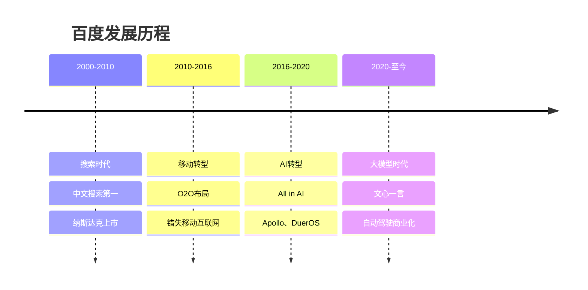
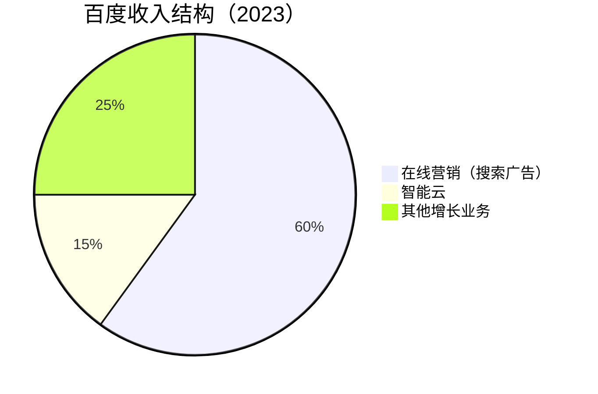

# 百度：AI转型的搜索巨头

## 公司概况

### 基本信息

**公司名称**：百度集团（Baidu, Inc.）
**股票代码**：BIDU（纳斯达克）、9888.HK（港股）
**成立时间**：2000年1月
**总部位置**：中国北京
**创始人**：李彦宏、徐勇

**业务范围**：
- 搜索引擎：百度搜索
- 人工智能：文心大模型、百度AI Cloud
- 自动驾驶：Apollo平台
- 智能设备：小度音箱
- 内容生态：百家号、好看视频

**市值规模**（2023）：
- 约500亿美元
- 中国第四大互联网公司
- AI领域领先企业

### 发展历程

**关键里程碑**：
- 2000年：百度成立
- 2005年：纳斯达克上市
- 2010年：移动搜索布局
- 2017年：All in AI战略
- 2020年：Apollo自动驾驶商业化
- 2023年：文心一言发布
- 2023年：港股二次上市

## 商业模式分析

### 业务结构

### 1. 在线营销：核心现金牛

**搜索广告**：
- 市场份额：中国第一（70%+）
- 日均搜索：数十亿次
- 广告主：数百万
- 变现模式：竞价排名

**信息流广告**：
- 百度APP：日活2亿+
- 百家号：内容生态
- 好看视频：短视频
- 变现模式：信息流广告

**收入驱动**：
- 搜索流量：稳定
- 广告主数量：增长
- 客单价：提升
- AI赋能：提升转化率

### 2. 智能云：高增长业务

**百度智能云**：
- 市场份额：中国第四
- 收入规模：年收入200亿+
- 增速：30%+
- 特色：AI能力

**产品矩阵**：
- IaaS：计算、存储、网络
- PaaS：数据库、中间件、AI平台
- SaaS：企业应用
- 行业解决方案：金融、制造、能源

**竞争优势**：
- AI能力：文心大模型
- 行业经验：深耕垂直行业
- 技术积累：搜索、AI技术
- 生态整合：Apollo、小度

### 3. 其他增长业务

**Apollo自动驾驶**：
- 技术水平：L4级
- 测试里程：超过5000万公里
- Robotaxi：萝卜快跑
- 商业化：武汉、北京、上海

**小度智能设备**：
- 智能音箱：市场份额第一
- 智能屏：快速增长
- 车载系统：与车企合作
- 变现模式：硬件+服务

**爱奇艺**：
- 持股：约50%
- 业务：长视频平台
- 用户：会员1亿+
- 盈利：持续亏损

## AI战略分析

### 文心大模型

**技术能力**：
- 参数规模：千亿级
- 训练数据：万亿级token
- 多模态：文本、图像、视频
- 中文能力：行业领先

**产品矩阵**：
- 文心一言：对话AI
- 文心千帆：企业服务平台
- 文心大模型3.5：最新版本
- 行业大模型：金融、医疗、能源

**商业化**：
- API调用：按次收费
- 私有化部署：企业客户
- 行业解决方案：定制化服务
- 生态合作：开发者平台

**竞争优势**：
- 技术积累：20年搜索、AI技术
- 数据优势：海量搜索数据
- 算力优势：自建数据中心
- 应用场景：搜索、云、自动驾驶

### Apollo自动驾驶

**技术平台**：
- 感知：摄像头、激光雷达、毫米波雷达
- 定位：高精地图、GPS、IMU
- 决策：深度学习、强化学习
- 控制：车辆控制系统

**商业模式**：
- Robotaxi：萝卜快跑
- 技术授权：与车企合作
- 高精地图：地图服务
- 智能交通：车路协同

**运营数据**：
- 测试城市：30+
- 测试里程：5000万公里+
- Robotaxi订单：日均数万单
- 安全记录：优秀

**竞争地位**：
- 中国第一：技术和规模
- 全球前列：与Waymo、Cruise竞争
- 商业化领先：Robotaxi规模最大

## 财务分析

### 收入分析

**收入增长**：
- 2018年：1023亿人民币
- 2020年：1071亿人民币
- 2022年：1237亿人民币
- 2023E：1350亿人民币
- CAGR：6%

**收入结构变化**：
- 在线营销：占比下降（从80%到60%）
- 智能云：占比上升（从5%到15%）
- 其他业务：占比上升（从15%到25%）

### 盈利能力

**利润率**：
- 毛利率：50-55%
- 经营利润率：15-20%
- 净利率：15-20%

**ROE**：
- 2022年：10%
- 2023E：12%
- 目标：15%+

**盈利驱动**：
- 搜索广告：稳定贡献
- 智能云：快速增长
- 成本控制：AI降本增效
- 新业务：逐步盈利

### 现金流

**经营现金流**：
- 2022年：300亿+
- 2023E：350亿+
- 现金流稳定

**资本支出**：
- 年资本支出：100-150亿
- 主要用于：服务器、研发、Apollo
- 自由现金流：200亿+

**现金储备**：
- 现金及等价物：1500亿+
- 财务健康：非常稳健

## 投资价值评估

### 估值分析

**历史估值区间**：
- PE：10-30倍
- PS：2-6倍
- EV/EBITDA：5-15倍

**当前估值（2023）**：
- PE：约12倍
- PS：约3倍
- EV/EBITDA：约8倍

**估值对比**：

| 公司 | PE | PS | 市值（亿美元） |
|------|----|----|---------------|
| 百度 | 12 | 3 | 500 |
| 腾讯 | 15 | 4 | 4500 |
| 阿里巴巴 | 12 | 2 | 2000 |
| Google | 22 | 5 | 17000 |

### 投资论点

**看多理由**：
1. **AI领先**：文心大模型中国领先
2. **自动驾驶**：Apollo商业化加速
3. **搜索稳定**：现金牛业务
4. **估值低**：PE仅12倍，历史低位
5. **现金充沛**：现金1500亿+
6. **回购分红**：股东回报提升

**看空理由**：
1. **增长放缓**：收入增速6%
2. **竞争加剧**：字节跳动、腾讯竞争
3. **新业务亏损**：Apollo、爱奇艺亏损
4. **监管风险**：互联网监管
5. **技术差距**：与GPT-4仍有差距

### 投资建议

**适合投资者**：
- 看好AI的投资者
- 价值投资者
- 长期投资者

**投资策略**：
- 建仓区间：120-140美元
- 持有周期：2-3年
- 目标价：200美元+
- 止损位：100美元

**风险控制**：
- 仓位：不超过15%
- 关注：AI进展、自动驾驶商业化
- 调整：根据业绩动态调整

## 投资启示

### 1. AI转型的价值

**技术积累**：
- 20年搜索、AI技术
- 数据、算力、算法
- 文心大模型领先

### 2. 自动驾驶的机会

**商业化加速**：
- Robotaxi规模最大
- 技术领先
- 政策支持

### 3. 搜索的护城河

**稳定现金流**：
- 市场份额70%+
- 变现能力强
- 支撑AI投入

### 4. 估值的吸引力

**低估值**：
- PE 12倍，历史低位
- 现金充沛
- 安全边际高

## 常见问题

### Q1：百度还能增长吗？

**回答**：
- 搜索：稳定，增长有限
- 智能云：高增长，30%+
- Apollo：商业化加速
- 整体：中速增长，10-15%

### Q2：文心一言能赶上GPT吗？

**回答**：
- 差距：1-2年
- 中文：接近或超越
- 应用：加速落地
- 长期：有机会追上

### Q3：什么时候买入百度？

**回答**：
- 估值：PE < 15倍
- 股价：120-140美元
- 时机：AI进展、自动驾驶商业化
- 策略：分批建仓

## 延伸阅读

### 推荐书籍

1. **《智能革命》** - 李彦宏
2. **《人工智能》** - 李开复
3. **《搜索引擎》** - 李彦宏

### 研究报告

- 百度年报和季报
- 各大券商百度深度报告
- AI行业研究报告

## 参考文献

1. 百度. 《年度报告》. 2018-2023
2. 李彦宏. 《智能革命》. 2017
3. 中金公司. 《百度深度报告》. 2023
4. 招商证券. 《百度投资价值分析》. 2023
5. 高盛. 《Baidu: AI Leader》. 2023
6. 摩根士丹利. 《Baidu Deep Dive》. 2023
7. 艾瑞咨询. 《中国AI行业报告》. 2023
8. IDC. 《中国智能云市场报告》. 2023
9. Gartner. 《全球AI市场预测》. 2023
10. McKinsey. 《自动驾驶商业化报告》. 2023

---

**投资建议**：
百度是中国AI领域的领先企业，文心大模型中国领先，Apollo自动驾驶商业化加速，搜索业务稳定。当前估值PE 12倍，处于历史低位，具有较高的安全边际。建议看好AI的投资者在120-140美元区间分批建仓，持有2-3年，目标价200美元+。

**风险提示**：
需要关注收入增长放缓、竞争加剧、新业务亏损、监管风险等。建议仓位控制在15%以内，设置止损位100美元，密切跟踪AI进展和自动驾驶商业化情况。

## 深度分析

### 核心机制解析

理解本主题需要从多个维度进行系统性分析。以下从理论基础、实践应用和历史验证三个层面展开深度探讨。

**理论基础层面**：本主题的核心逻辑建立在经济学和金融学的基本原理之上。通过对基础理论的深入理解，投资者能够建立起稳固的分析框架，避免被市场短期噪音所干扰。

**实践应用层面**：理论必须与实践相结合才能产生价值。在实际投资决策中，需要将抽象的概念转化为具体的分析工具和决策标准。

**历史验证层面**：金融市场有着丰富的历史记录，通过研究历史案例，我们可以验证理论的有效性，并从中提炼出具有普遍意义的规律。

### 关键影响因素

影响本主题的关键因素可以从以下几个维度进行分析：

1. **宏观经济环境**：利率水平、通货膨胀率、经济增长速度等宏观变量对本主题有着深远影响。在不同的宏观经济周期中，相关指标的表现会呈现出显著差异。

2. **市场结构因素**：市场参与者的构成、信息传播机制、流动性状况等市场结构因素决定了价格发现的效率和准确性。

3. **政策监管环境**：政府政策、监管框架的变化会直接影响相关市场的运作规则和参与者行为。

4. **技术创新驱动**：技术进步不断改变着金融市场的运作方式，从算法交易到区块链技术，每一次技术革新都带来新的机遇和挑战。

5. **全球化与地缘政治**：在全球化背景下，各国市场之间的联动性日益增强，地缘政治风险的影响也越来越不可忽视。

### 量化分析框架

为了更精确地分析和评估，可以采用以下量化框架：

| 分析维度 | 关键指标 | 参考基准 | 分析方法 |
|---------|---------|---------|---------|
| 规模评估 | 绝对值与相对值 | 历史均值 | 趋势分析 |
| 质量评估 | 稳定性指标 | 行业对标 | 横向比较 |
| 风险评估 | 波动率指标 | 风险阈值 | 情景分析 |
| 价值评估 | 估值倍数 | 历史区间 | 回归分析 |

通过系统性地应用上述框架，投资者可以对目标进行全面、客观的评估，从而做出更加理性的投资决策。

## 高级分析与前沿研究

### 学术研究进展

近年来，学术界对本领域的研究取得了重要进展。以下是几个值得关注的研究方向：

**行为金融学视角**：传统金融理论假设市场参与者是完全理性的，但行为金融学的研究表明，认知偏差和情绪因素在投资决策中扮演着重要角色。诺贝尔经济学奖得主丹尼尔·卡尼曼（Daniel Kahneman）和理查德·塞勒（Richard Thaler）的研究为我们理解市场非理性行为提供了重要框架。

**因子投资研究**：尤金·法玛（Eugene Fama）和肯尼斯·弗伦奇（Kenneth French）的三因子模型，以及后续发展的五因子模型，为系统性地解释股票收益差异提供了理论基础。这些研究表明，市值、账面市值比、盈利能力和投资模式等因子能够解释大部分股票收益的横截面差异。

**市场微观结构研究**：对市场流动性、价格发现机制和交易成本的深入研究，帮助我们更好地理解市场的运作机制，并为优化交易策略提供指导。

### 实战案例深度解析

**案例一：长期价值创造的典范**

以沃伦·巴菲特（Warren Buffett）的伯克希尔·哈撒韦（Berkshire Hathaway）为例，其长达数十年的卓越投资业绩证明了价值投资理念的有效性。从1965年至今，伯克希尔的账面价值年均增长率约为19.8%，远超同期标普500指数的约10.2%年均回报。

巴菲特的成功秘诀在于：
- 专注于具有持久竞争优势的优质企业
- 以合理价格买入，而非追求最低价格
- 长期持有，让复利效应充分发挥
- 保持充足的安全边际，控制下行风险

**案例二：危机中的机遇识别**

2008年金融危机期间，大多数投资者恐慌性抛售，但少数具有前瞻性的投资者却在危机中发现了历史性的投资机会。约翰·保尔森（John Paulson）通过做空次级抵押贷款相关证券，在危机中获得了约150亿美元的利润，成为金融史上最成功的单笔交易之一。

这个案例告诉我们：
- 深入的基本面研究能够发现市场定价错误
- 逆向思维往往能够发现被市场忽视的机会
- 风险管理和仓位控制是成功的关键

### 跨市场比较分析

不同市场在结构、监管、投资者构成等方面存在显著差异，这些差异对投资策略的选择有重要影响：

**美国市场特征**：
- 机构投资者主导，市场效率较高
- 信息披露制度完善，分析师覆盖广泛
- 衍生品市场发达，对冲工具丰富
- 长期牛市历史，但也经历过多次重大调整

**中国市场特征**：
- 散户投资者比例较高，市场波动性较大
- 政策因素影响显著，需要密切关注监管动向
- 新兴行业发展迅速，成长投资机会丰富
- A股、港股、美股中概股形成多层次市场体系

**欧洲市场特征**：
- 价值股比例较高，估值相对保守
- 受地缘政治和欧元区政策影响较大
- 部分行业（如奢侈品、工业）具有全球竞争优势
- ESG投资理念推广较为领先

