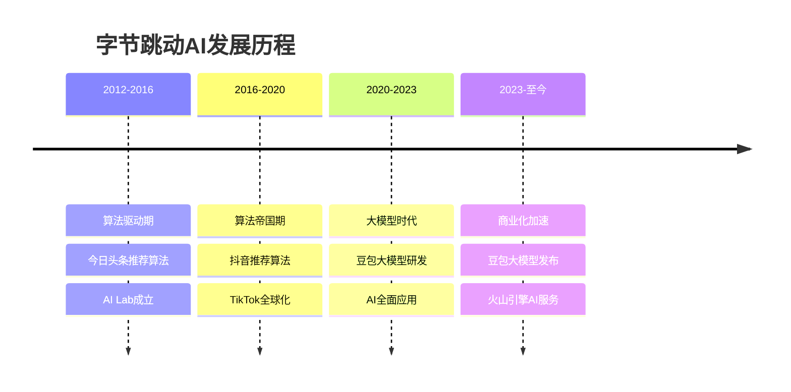
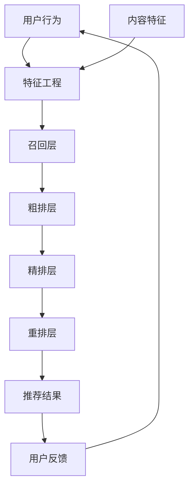

# 字节跳动AI战略：豆包大模型与算法帝国

## 公司概况

### 基本信息

**公司名称**：北京字节跳动科技有限公司（ByteDance Ltd.）
**股票代码**：未上市
**成立时间**：2012年3月
**总部位置**：中国北京
**创始人**：张一鸣、梁汝波

**业务范围**：
- 短视频：抖音、TikTok
- 资讯：今日头条、西瓜视频
- AI大模型：豆包
- 企业服务：飞书、火山引擎
- 教育：大力教育（已关闭）
- 游戏：朝夕光年

**估值规模**（2023）：
- 约2200-2500亿美元
- 全球最大未上市科技公司
- 中国估值最高的互联网公司

### AI发展历程

**关键里程碑**：
- 2012年：字节跳动成立，今日头条上线
- 2016年：抖音上线
- 2017年：收购Musical.ly，进军海外
- 2018年：TikTok全球爆发
- 2021年：估值达到4000亿美元（巅峰）
- 2023年：豆包大模型发布
- 2023年：火山引擎推出AI服务
- 2024年：豆包全面开放

## 豆包大模型分析

### 技术能力

**模型规模**：
- 参数规模：千亿级
- 训练数据：万亿级token
- 多模态：文本、图像、视频
- 中英文：双语能力强

**技术特点**：
- 长文本：支持32K上下文
- 视频理解：视频内容理解
- 创作能力：文案、脚本生成
- 实时性：快速响应

**性能表现**：

| 能力维度 | 豆包 | GPT-4 | 文心 | 通义 | 混元 |
|---------|------|-------|------|------|------|
| 中文理解 | 95 | 90 | 95 | 95 | 94 |
| 英文理解 | 92 | 98 | 85 | 90 | 88 |
| 代码生成 | 89 | 95 | 85 | 88 | 90 |
| 内容创作 | 96 | 93 | 88 | 90 | 90 |
| 视频理解 | 94 | 90 | 85 | 88 | 86 |

**独特优势**：
- 内容创作：短视频文案、脚本
- 视频理解：抖音数据训练
- 多模态：图文视频融合
- 实时性：快速生成

### 产品矩阵

**豆包系列**：
- 豆包：通用对话AI
- 豆包·创作：内容创作助手
- 豆包·视频：视频理解和生成
- 豆包·企业版：企业服务

**垂直应用**：
- 抖音AI：视频推荐、内容理解
- 剪映AI：智能剪辑、特效
- 飞书AI：智能文档、会议纪要
- 火山引擎AI：企业AI服务

**开发者平台**：
- 火山引擎：AI服务平台
- API服务：模型调用
- 模型训练：定制化训练
- 应用开发：低代码平台

### 商业化策略

**内部应用**：
- 抖音：推荐、内容理解、创作工具
- 今日头条：推荐、内容生成
- 剪映：智能剪辑
- 飞书：智能办公

**外部服务**：
- API服务：按Token计费
- 企业服务：私有化部署
- 行业方案：定制化服务
- 开发者生态：吸引开发者

**定价策略**：
- 免费额度：吸引用户
- 按量付费：灵活计费
- 企业套餐：定制服务
- 价格优势：低于竞品

**商业化进展**：
- 2023年：起步阶段
- 2024年：快速增长
- 预计：2025年AI收入50亿+
- 长期：AI成为重要收入来源

## 推荐算法：字节的核心竞争力

### 算法能力

**推荐系统**：
- 用户画像：精准刻画
- 内容理解：多模态理解
- 实时推荐：毫秒级响应
- 个性化：千人千面

**技术架构**：

**核心技术**：
- 深度学习：神经网络模型
- 强化学习：优化推荐策略
- 多目标优化：平衡多个指标
- 实时计算：流式处理

**数据优势**：
- 用户规模：抖音日活6亿+
- 行为数据：海量
- 内容数据：丰富
- 实时反馈：快速迭代

### 应用场景

**抖音推荐**：
- 视频推荐：个性化推荐
- 直播推荐：兴趣匹配
- 电商推荐：商品推荐
- 广告推荐：精准投放

**今日头条推荐**：
- 资讯推荐：个性化资讯
- 视频推荐：西瓜视频
- 图文推荐：图集、文章
- 广告推荐：信息流广告

**商业价值**：
- 用户时长：大幅提升
- 用户粘性：增强
- 广告效果：提升
- 商业化：核心驱动

### 算法优势

**vs 腾讯**：
- 字节：算法驱动，去中心化
- 腾讯：社交驱动，中心化
- 优势：冷启动快，长尾内容

**vs 快手**：
- 字节：中心化推荐，头部内容
- 快手：去中心化，普惠算法
- 优势：用户时长更长

**vs 百度**：
- 字节：主动推荐，信息流
- 百度：被动搜索，搜索框
- 优势：用户体验更好

## 火山引擎AI服务

### 产品体系

**AI基础服务**：
- 豆包大模型：API服务
- 视觉AI：图像识别、视频理解
- 语音AI：语音识别、合成
- 自然语言处理：文本分析

**AI应用服务**：
- 智能推荐：推荐系统
- 内容审核：图文视频审核
- 智能创作：文案、视频生成
- 数据分析：用户洞察

**行业解决方案**：
- 电商：推荐、搜索、客服
- 金融：风控、客服、营销
- 文娱：内容推荐、创作工具
- 企业服务：智能办公

### 商业模式

**定价策略**：
- API调用：按量付费
- 私有化部署：一次性费用
- 技术服务：咨询、培训
- 行业方案：定制化

**目标客户**：
- 互联网公司：电商、社交、内容
- 传统企业：零售、金融、制造
- 政府机构：智慧城市、政务
- 中小企业：SaaS服务

**竞争优势**：
- 技术：抖音验证
- 数据：海量数据
- 经验：实战经验
- 价格：有竞争力

**市场地位**：
- 起步较晚：2021年
- 增长快速：年增长100%+
- 市场份额：5%+
- 排名：前五

## AI在字节生态的应用

### 抖音AI

**内容理解**：
- 视频理解：场景、物体、人物
- 音频理解：音乐、语音、音效
- 文本理解：标题、评论、字幕
- 多模态融合：综合理解

**内容推荐**：
- 个性化推荐：千人千面
- 实时推荐：毫秒级
- 多目标优化：时长、互动、留存
- 冷启动：新用户快速建模

**内容创作**：
- 剪映AI：智能剪辑、特效
- 文案生成：标题、描述
- 配音：AI配音
- 特效：AI特效

**内容审核**：
- 图像审核：违规内容识别
- 视频审核：暴力、色情、政治
- 文本审核：敏感词、违规内容
- 实时审核：秒级响应

**商业价值**：
- 用户时长：日均使用120分钟+
- 用户规模：日活6亿+
- 广告收入：年收入3000亿+
- 电商GMV：年GMV 2万亿+

### 今日头条AI

**资讯推荐**：
- 个性化推荐：兴趣匹配
- 实时推荐：热点追踪
- 多样性：避免信息茧房
- 质量控制：优质内容

**内容生成**：
- 摘要生成：自动摘要
- 标题优化：吸引点击
- 内容扩写：丰富内容
- 多语言：翻译

**广告推荐**：
- 精准投放：用户画像
- 效果优化：转化率
- 创意优化：A/B测试
- 反作弊：虚假流量识别

### 飞书AI

**智能文档**：
- 文档生成：自动生成
- 智能排版：自动排版
- 内容总结：会议纪要
- 翻译：多语言

**智能会议**：
- 实时转写：语音转文字
- 会议纪要：自动生成
- 任务提取：待办事项
- 智能提醒：日程管理

**智能搜索**：
- 语义搜索：理解意图
- 知识图谱：关联信息
- 智能问答：快速解答
- 推荐：相关内容

### 剪映AI

**智能剪辑**：
- 自动剪辑：一键成片
- 智能配乐：音乐匹配
- 字幕生成：自动字幕
- 特效推荐：智能特效

**AI创作**：
- 文案生成：视频文案
- 配音：AI配音
- 图像生成：AI绘画
- 视频生成：文生视频

**商业价值**：
- 用户规模：月活5亿+
- 降低门槛：人人可创作
- 内容供给：提升
- 生态价值：巨大

## 财务分析

### 整体财务

**收入规模**：
- 2020年：2366亿人民币
- 2021年：3800亿人民币
- 2022年：5500亿人民币
- 2023年：6800亿人民币
- 2024E：7500亿人民币

**收入结构**：
- 广告收入：70%（抖音、头条）
- 电商收入：20%（抖音电商）
- 游戏收入：5%
- 其他：5%（飞书、火山引擎）

**盈利能力**：
- 经营利润率：25-30%
- 净利率：20-25%
- ROE：30%+
- 现金流：充沛

### AI投入产出

**研发投入**：
- 年研发费用：800亿+人民币
- AI占比：30%+
- 研发人员：5万+
- 研发占比：12%+

**AI商业化**：
- 内部降本增效：显著
- 火山引擎AI：数十亿
- 豆包大模型：起步阶段
- 预计：2025年AI收入100亿+

**投入回报**：
- 推荐算法：核心竞争力
- 内容理解：提升用户体验
- 创作工具：降低创作门槛
- 商业化：广告、电商增长

## 投资价值评估

### 估值分析

**当前估值（2023）**：
- 估值：约2200-2500亿美元
- PE：约15-18倍
- PS：约3-4倍
- EV/EBITDA：约10-12倍

**估值对比**：

| 公司 | 估值/市值（亿美元） | PE | PS | 业务 |
|------|-------------------|----|----|------|
| 字节跳动 | 2200-2500 | 15-18 | 3-4 | 短视频+AI |
| 腾讯 | 3500 | 18 | 5 | 社交+游戏 |
| 阿里巴巴 | 2000 | 15 | 1.5 | 电商+云 |
| Meta | 8000 | 25 | 6 | 社交+广告 |

**估值合理性**：
- 增长：快速增长（20%+）
- 盈利：高盈利（净利率20%+）
- 现金流：充沛
- 估值：合理偏低

### 投资论点

**看多理由**：
1. **抖音垄断**：短视频绝对龙头
2. **算法领先**：推荐算法全球领先
3. **AI优势**：豆包大模型+推荐算法
4. **增长快速**：收入增长20%+
5. **盈利能力强**：净利率20%+
6. **现金充沛**：现金流充沛
7. **估值合理**：PE 15-18倍

**看空理由**：
1. **监管风险**：内容监管、数据安全
2. **竞争加剧**：快手、视频号竞争
3. **增长放缓**：用户增长见顶
4. **国际化受阻**：TikTok面临封禁风险
5. **未上市**：流动性差
6. **创始人退出**：张一鸣卸任CEO

### 投资建议

**适合投资者**：
- 机构投资者
- 高净值个人
- 长期投资者
- 看好短视频和AI

**投资策略**：
- 一级市场：参与融资（门槛高）
- 二级市场：等待IPO
- 持有周期：3-5年
- 目标估值：3000-4000亿美元

**IPO展望**：
- 时间：2025-2026年
- 地点：香港或美国
- 估值：3000亿美元+
- 建议：IPO后关注买入机会

## AI战略优势

### 1. 数据优势

**用户规模**：
- 抖音：日活6亿+
- 今日头条：日活2亿+
- TikTok：日活10亿+
- 总计：全球用户20亿+

**数据价值**：
- 行为数据：海量
- 内容数据：丰富
- 实时反馈：快速
- 多模态：图文视频

**AI训练**：
- 数据量：全球领先
- 数据质量：高
- 数据多样性：丰富
- 数据实时性：强

### 2. 场景优势

**高频场景**：
- 短视频：日均120分钟
- 资讯：日均30分钟
- 办公：飞书
- 创作：剪映

**应用价值**：
- 用户体验：提升
- 商业化：增强
- 用户粘性：增加
- 数据反馈：优化模型

### 3. 技术优势

**算法能力**：
- 推荐算法：全球领先
- 内容理解：多模态
- 实时计算：毫秒级
- 大规模：支持10亿+用户

**工程能力**：
- 分布式系统：大规模
- 实时计算：低延迟
- 稳定性：高可用
- 成本优化：高效

### 4. 商业化优势

**内部应用**：
- 降本增效：显著
- 用户体验：提升
- 商业价值：巨大
- 验证场景：丰富

**外部输出**：
- 火山引擎：AI服务
- 豆包：API服务
- 行业方案：定制化
- 开发者生态：建设中

## 投资风险分析

### 1. 监管风险

**内容监管**：
- 内容审核：更严格
- 算法监管：算法备案
- 未成年人保护：限制使用
- 影响：用户时长、收入

**数据安全**：
- 数据出境：限制
- 隐私保护：合规成本
- 数据安全：审查
- 影响：国际化

**反垄断**：
- 市场地位：短视频垄断
- 并购限制：限制扩张
- 业务限制：可能拆分
- 影响：增长

### 2. 竞争风险

**短视频竞争**：
- 快手：下沉市场
- 视频号：微信生态
- B站：年轻用户
- 小红书：女性用户

**AI竞争**：
- 百度文心：先发优势
- 阿里通义：生态优势
- 腾讯混元：社交数据
- 国际：GPT-4领先

### 3. 国际化风险

**TikTok风险**：
- 美国：面临封禁
- 欧洲：数据监管
- 印度：已被封禁
- 影响：国际化受阻

**地缘政治**：
- 中美关系：紧张
- 技术脱钩：影响
- 数据安全：审查
- 影响：估值

### 4. 业务风险

**增长放缓**：
- 用户增长：见顶
- 时长增长：放缓
- 广告增长：放缓
- 影响：估值

**创始人退出**：
- 张一鸣：卸任CEO
- 管理层：变动
- 战略：不确定性
- 影响：信心

## 投资启示

### 1. 算法的力量

**推荐算法**：
- 核心竞争力：算法驱动
- 用户体验：显著提升
- 商业价值：巨大
- 护城河：深厚

**AI赋能**：
- 全面AI化：每个环节
- 降本增效：显著
- 创造新价值：AIGC
- 构建护城河：算法+数据

### 2. 数据的价值

**海量数据**：
- 用户规模：20亿+
- 行为数据：海量
- 实时反馈：快速
- AI训练：优势

**数据飞轮**：
- 数据→算法→体验→用户→数据
- 正向循环：越来越强
- 护城河：难以复制

### 3. 未上市的机会

**一级市场**：
- 估值：相对合理
- 增长：快速
- 盈利：强
- 机会：IPO前投资

**IPO机会**：
- 时间：2025-2026年
- 估值：3000亿美元+
- 策略：IPO后关注买入

## 常见问题

### Q1：字节跳动什么时候上市？

**回答**：
- 时间：预计2025-2026年
- 地点：香港或美国
- 估值：3000亿美元+
- 不确定性：监管、国际形势

### Q2：字节AI能赶上百度吗？

**回答**：
- 大模型：差距不大
- 应用场景：字节更丰富（短视频）
- 数据优势：字节更强
- 长期：有机会并驾齐驱

### Q3：豆包能赚钱吗？

**回答**：
- 短期：投入期
- 中期：内部降本增效价值大
- 长期：API收入+场景化应用
- 预计：2025年后贡献显著收入

### Q4：字节的最大优势是什么？

**回答**：
- 推荐算法：全球领先
- 数据优势：20亿用户
- 场景优势：短视频高频
- 商业化：广告、电商

## 延伸阅读

### 推荐书籍

1. **《字节跳动：从0到1》** - 内部资料
2. **《推荐系统实践》** - 项亮
3. **《深度学习推荐系统》** - 王喆
4. **《算法帝国》** - 研究报告

### 研究报告

- 字节跳动融资材料
- 各大券商字节深度报告
- 短视频行业研究报告
- AI大模型行业报告

## 参考文献

1. 字节跳动. 《融资材料》. 2020-2023
2. 晚点LatePost. 《字节跳动深度报道》. 2023
3. 36氪. 《字节跳动AI战略》. 2023
4. 中金公司. 《字节跳动估值分析》. 2023
5. 高盛. 《ByteDance: AI Leader》. 2023
6. 摩根士丹利. 《ByteDance Analysis》. 2023
7. QuestMobile. 《短视频行业报告》. 2023
8. 艾瑞咨询. 《中国短视频市场研究》. 2023
9. Sensor Tower. 《TikTok全球数据》. 2023
10. 中国信通院. 《AI大模型报告》. 2023

---

**投资建议**：
字节跳动是中国短视频领域的绝对龙头，拥有全球领先的推荐算法和海量用户数据。豆包大模型依托抖音等丰富场景，AI商业化潜力巨大。公司增长快速（20%+）、盈利能力强（净利率20%+）、现金流充沛，当前估值2200-2500亿美元，PE 15-18倍，估值合理偏低。建议机构投资者和高净值个人关注一级市场投资机会，或等待IPO后买入，长期持有3-5年，目标估值3000-4000亿美元。

**风险提示**：
需要关注内容监管、数据安全、TikTok封禁风险、竞争加剧、增长放缓等。字节跳动未上市，流动性差，投资门槛高。建议密切跟踪IPO进展、监管政策变化和业务增长情况。

---

[← 返回AI行业](./index.html)
