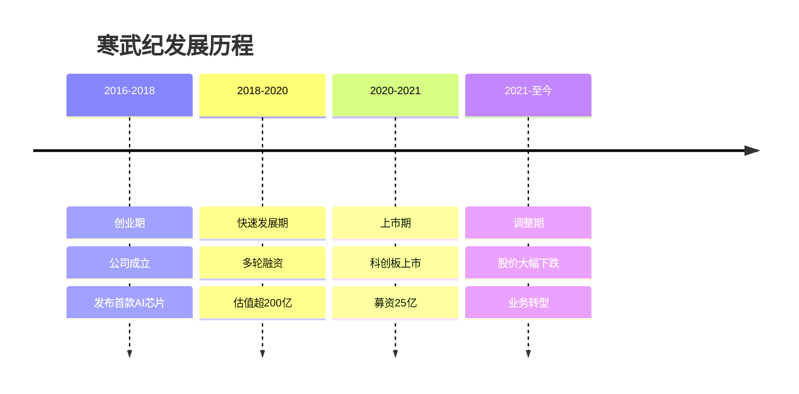
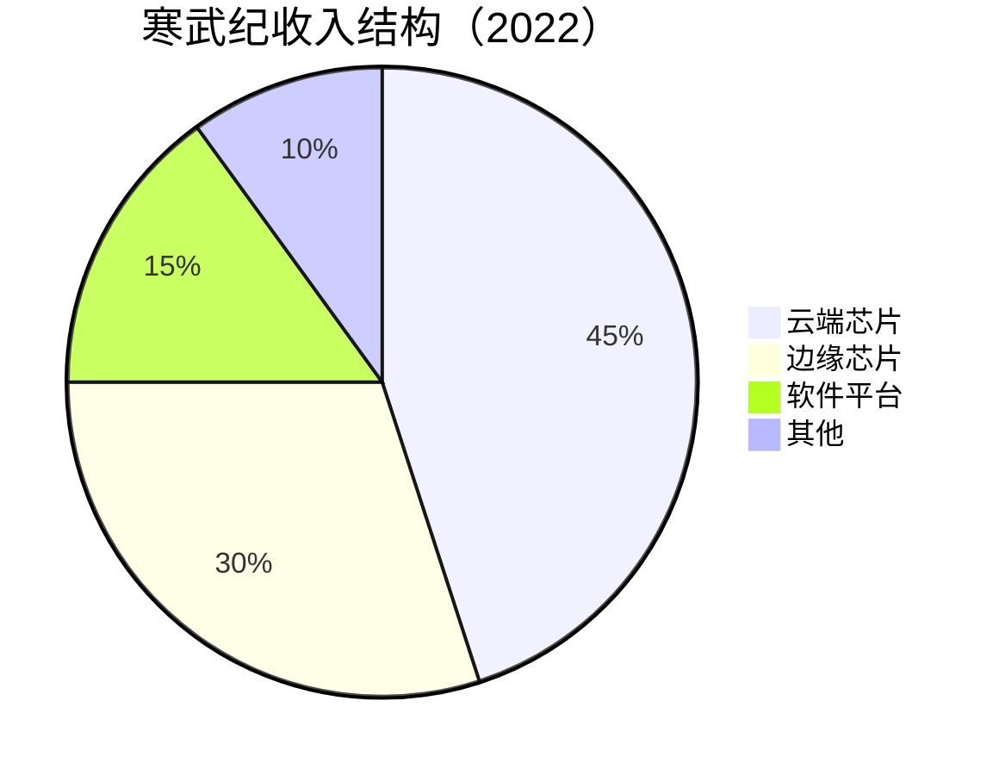

# 寒武纪：中国AI芯片先行者

## 公司概况

### 基本信息

**公司名称**：寒武纪科技股份有限公司（Cambricon Technologies Corporation Limited）
**股票代码**：688256.SH（科创板）
**成立时间**：2016年3月
**总部位置**：中国北京
**创始人**：陈天石、陈云霁（兄弟）

**业务范围**：
- 云端AI芯片：思元系列训练芯片
- 边缘AI芯片：玄思系列推理芯片
- AI软件平台：寒武纪神经网络加速库
- 行业解决方案：智慧城市、智能制造

**市值规模**（2023）：
- 约300亿人民币
- 较IPO市值大幅缩水
- 中国AI芯片龙头

### 发展历程

**关键里程碑**：
- 2016年：寒武纪成立，陈氏兄弟创立
- 2017年：发布首款AI芯片寒武纪1A
- 2018年：完成数亿美元B轮融资，估值25亿美元
- 2019年：发布思元270云端AI芯片
- 2020年：科创板上市，募资25亿元
- 2021年：股价最高达370元
- 2022年：股价跌破发行价
- 2023年：发布思元590，持续亏损

## 技术能力分析

### 云端AI芯片

**思元系列**：

| 产品 | 发布时间 | 算力 | 功耗 | 应用场景 |
|------|---------|------|------|---------|
| 思元100 | 2018 | 128 TOPS | 80W | 推理 |
| 思元270 | 2019 | 256 TOPS | 70W | 训练+推理 |
| 思元290 | 2020 | 256 TOPS | 150W | 训练 |
| 思元370 | 2021 | 512 TOPS | 200W | 训练 |
| 思元590 | 2023 | 2048 TOPS | 350W | 大模型训练 |

**技术特点**：
- 架构：自研MLU架构
- 精度：支持FP32、FP16、INT8
- 互联：支持多卡互联
- 生态：支持主流AI框架

**性能对比**：

| 芯片 | 算力(TOPS) | 功耗(W) | 能效比 | 价格 |
|------|-----------|---------|--------|------|
| 思元590 | 2048 | 350 | 5.85 | 约10万 |
| NVIDIA A100 | 312 | 400 | 0.78 | 约10万 |
| NVIDIA H100 | 1000 | 700 | 1.43 | 约30万 |

**技术差距**：
- 算力：接近A100，落后H100
- 生态：远不如NVIDIA CUDA
- 软件：工具链不完善
- 应用：支持框架有限

### 边缘AI芯片

**玄思系列**：

| 产品 | 发布时间 | 算力 | 功耗 | 应用场景 |
|------|---------|------|------|---------|
| 玄思1000 | 2018 | 8 TOPS | 5W | 边缘推理 |
| 玄思2000 | 2020 | 16 TOPS | 8W | 智能安防 |
| 玄思3000 | 2022 | 32 TOPS | 15W | 智能驾驶 |

**应用场景**：
- 智能安防：摄像头、NVR
- 智能驾驶：ADAS、自动驾驶
- 智能制造：工业视觉、质检
- 智能终端：手机、平板

**竞争对手**：
- 地平线：车载芯片领先
- 黑芝麻：车规级芯片
- 华为昇腾：全栈能力
- NVIDIA Jetson：生态完善

### AI软件平台

**寒武纪神经网络加速库（CNML）**：
- 支持框架：TensorFlow、PyTorch、Caffe
- 算子库：数百个常用算子
- 优化工具：模型压缩、量化
- 开发工具：调试、性能分析

**寒武纪运行时库（CNRT）**：
- 设备管理：多卡管理
- 内存管理：高效内存分配
- 任务调度：并行计算
- 监控工具：性能监控

**生态建设**：
- 开发者社区：活跃度低
- 文档：不够完善
- 案例：较少
- 与CUDA差距：巨大

## 商业模式分析

### 业务结构

### 1. 云端芯片业务

**目标客户**：
- 互联网公司：百度、阿里、腾讯
- 云服务商：华为云、浪潮
- 科研机构：高校、研究所
- 政府项目：智慧城市

**商业模式**：
- 直接销售：芯片销售
- 服务器销售：整机销售
- 算力租赁：云服务
- 技术授权：IP授权

**收入情况**：
- 2020年：4.9亿元
- 2021年：4.9亿元
- 2022年：3.2亿元（下降35%）
- 2023E：3.5亿元

**下降原因**：
- 华为订单：大幅减少（从主要客户到几乎没有）
- 竞争加剧：华为昇腾、NVIDIA
- 性价比：不如NVIDIA
- 生态：CUDA生态强大

### 2. 边缘芯片业务

**目标客户**：
- 安防厂商：海康、大华
- 汽车厂商：自动驾驶公司
- 工业企业：智能制造
- 终端厂商：手机、平板

**商业模式**：
- 芯片销售：单颗销售
- 模组销售：芯片+方案
- 技术服务：定制化开发
- 授权费：IP授权

**收入情况**：
- 2020年：1.5亿元
- 2021年：2.0亿元
- 2022年：2.1亿元
- 2023E：2.3亿元

**增长缓慢原因**：
- 竞争激烈：地平线、黑芝麻
- 客户粘性：不强
- 性能：不如竞品
- 价格：无优势

### 3. 软件平台业务

**产品服务**：
- 软件授权：开发工具
- 技术支持：培训、咨询
- 定制开发：行业方案
- 云服务：算力租赁

**收入情况**：
- 2020年：0.3亿元
- 2021年：0.5亿元
- 2022年：1.0亿元
- 2023E：1.2亿元

**占比低原因**：
- 生态弱：用户少
- 工具链：不完善
- 竞争力：不如CUDA
- 商业化：困难

## 财务分析

### 收入分析

**收入规模**：
- 2019年：4.4亿元
- 2020年：4.9亿元
- 2021年：4.9亿元
- 2022年：6.7亿元
- 2023E：7.0亿元

**收入增长**：
- 2020年：+11%
- 2021年：0%
- 2022年：+37%（政府项目）
- 2023E：+4%

**收入质量**：
- 华为依赖：曾占80%+，现在几乎为0
- 政府项目：占比提升至50%+
- 回款周期：长
- 应收账款：高

### 盈利能力

**亏损情况**：
- 2019年：亏损11.8亿元
- 2020年：亏损2.0亿元
- 2021年：亏损8.3亿元
- 2022年：亏损10.0亿元
- 2023E：亏损8亿元

**持续亏损原因**：
- 研发投入：占收入100%+
- 毛利率：仅30-40%（NVIDIA 60%+）
- 规模效应：未体现
- 价格战：激烈

**盈利路径**：
- 收入规模：需达到50亿+
- 毛利率：提升至60%+
- 费用率：降至50%以下
- 预计：2027年后可能盈利

### 现金流

**经营现金流**：
- 2020年：-1.5亿元
- 2021年：-5.0亿元
- 2022年：-8.0亿元
- 持续负值：烧钱严重

**融资情况**：
- IPO募资：25亿元
- 定增募资：20亿元（2022年）
- 现金储备：约30亿元
- 烧钱速度：年约8-10亿
- 现金够用：3-4年

**资本支出**：
- 研发投入：年约7-8亿
- 流片费用：年约2-3亿
- 设备采购：年约1亿
- 合计：年约10-12亿

## IPO分析

### 上市表现

**IPO基本信息**：
- 上市时间：2020年7月
- 发行价：64.39元
- 募资额：25.8亿元
- 首日涨幅：287%，收盘179.98元

**股价表现**：
- 最高价：370元（2021年7月）
- 最低价：40元（2023年）
- 当前价：约60元（2023年底）
- 较最高点：跌84%
- 较发行价：跌7%

**破发原因**：
- 业绩不及预期：收入下滑
- 持续亏损：盈利遥遥无期
- 华为订单：大幅减少
- 竞争加剧：华为昇腾、NVIDIA
- 市场环境：科创板整体低迷

### 募资用途

**资金分配**：
- 新一代云端芯片：10亿
- 边缘AI芯片：5亿
- 软件平台：3亿
- 补充流动资金：7亿

**执行情况**：
- 研发：持续高投入
- 产品：思元590发布
- 商业化：进展缓慢
- 现金：管理谨慎

## 投资价值评估

### 估值分析

**当前估值（2023）**：
- 市值：约300亿元
- PS：约40倍
- 估值：仍然很高（亏损无PE）

**估值对比**：

| 公司 | 市值（亿元） | PS | 盈利状态 | 技术 |
|------|-------------|-----|---------|------|
| 寒武纪 | 300 | 40 | 亏损 | 云端+边缘 |
| 地平线 | 350（估值） | - | 亏损 | 车载芯片 |
| 华为昇腾 | - | - | - | 全栈能力 |
| NVIDIA | 10万亿 | 40 | 盈利 | 全球龙头 |

### 投资论点

**看多理由**：
1. **国产替代**：AI芯片国产化需求
2. **政策支持**：国家大力支持
3. **技术领先**：中国AI芯片龙头
4. **大模型机会**：思元590支持大模型训练
5. **估值回落**：较最高点跌84%

**看空理由**：
1. **持续亏损**：盈利遥遥无期
2. **收入下滑**：华为订单流失
3. **竞争激烈**：华为昇腾、NVIDIA
4. **生态弱**：CUDA生态强大
5. **技术差距**：落后NVIDIA 2-3代
6. **估值仍高**：PS 40倍，仍未盈利
7. **现金消耗**：持续烧钱

### 投资建议

**风险评级**：极高风险

**适合投资者**：
- 极高风险承受能力
- 看好国产替代长期逻辑
- 能够承受巨大波动
- 长期投资视角（5-10年）

**投资策略**：
- 观望为主：等待盈利拐点
- 小仓位试探：不超过3%
- 长期视角：5-10年
- 止损严格：跌破40元止损

**关注指标**：
- 收入增长：是否恢复增长
- 大客户：是否有新的大客户
- 毛利率：是否提升至50%+
- 亏损收窄：是否接近盈亏平衡
- 生态建设：开发者数量

## 行业竞争分析

### 竞争格局

**国际巨头**：
- NVIDIA：绝对龙头，市占率90%+
- AMD：追赶者，MI300系列
- Intel：Habana Labs
- Google：TPU（自用）

**国内玩家**：
- 华为昇腾：全栈能力，政企市场
- 寒武纪：云端+边缘，科研市场
- 地平线：车载芯片，汽车市场
- 壁仞科技：通用GPU
- 燧原科技：云端训练

### 寒武纪的竞争优势

**技术优势**：
- 学术背景：中科院计算所
- 技术积累：深度学习处理器
- 专利：数百件
- 人才：顶尖芯片科学家

**先发优势**：
- 成立早：2016年
- 上市早：科创板首批
- 品牌：知名度高

**政策优势**：
- 国产替代：政策支持
- 科研项目：政府采购
- 资金支持：融资容易

### 面临的挑战

**技术挑战**：
- 性能差距：落后NVIDIA
- 生态弱：CUDA生态强大
- 软件：工具链不完善
- 迭代速度：慢于NVIDIA

**商业��战**：
- 客户流失：华为订单减少
- 价格战：竞争激烈
- 规模效应：未体现
- 盈利困难：持续亏损

**外部风险**：
- 美国制裁：影响先进制程
- 竞争加剧：华为昇腾、地平线
- 技术路线：大模型对算力要求更高
- 市场需求：不及预期

## 国产替代分析

### 国产替代机会

**市场空间**：
- 中国AI芯片市场：500亿+
- NVIDIA占比：70%+
- 国产替代空间：350亿+
- 寒武纪潜在市场：50-100亿

**政策推动**：
- 国家战略：芯片自主可控
- 政府采购：优先国产
- 资金支持：产业基金
- 人才培养：集成电路专业

**应用场景**：
- 政府项目：智慧城市、安防
- 科研机构：高校、研究所
- 国企：央企、地方国企
- 部分民企：对安全要求高的

### 国产替代难点

**技术差距**：
- 性能：落后2-3代
- 能效比：不如NVIDIA
- 软件生态：CUDA太强大
- 迭代速度：慢

**商业挑战**：
- 性价比：不如NVIDIA
- 客户粘性：CUDA锁定
- 迁移成本：高
- 应用支持：少

**现实困境**：
- 真实需求：有限
- 被动采购：政策驱动
- 使用率：低
- 口碑：一般

## 大模型时代的机会

### 思元590定位

**产品特点**：
- 算力：2048 TOPS
- 互联：支持多卡互联
- 大模型：支持千亿参数训练
- 价格：约10万元/卡

**目标市场**：
- 互联网公司：百度、阿里、腾讯
- AI创业公司：大模型训练
- 科研机构：高校、研究所
- 政府项目：国产化要求

**竞争力分析**：
- vs NVIDIA A100：性能接近，生态差
- vs NVIDIA H100：性能落后，价格便宜
- vs 华为昇腾：性能相当，生态相当
- 定位：国产替代选择

### 商业化挑战

**客户选择**：
- 首选：NVIDIA H100（性能最强）
- 次选：NVIDIA A100（性价比高）
- 备选：华为昇腾（国产，生态好）
- 最后：寒武纪（国产，生态弱）

**实际情况**：
- 互联网巨头：优先NVIDIA
- AI创业公司：优先NVIDIA
- 科研机构：部分采购寒武纪
- 政府项目：国产化要求采购

**突破路径**：
- 性能提升：缩小与NVIDIA差距
- 生态建设：完善软件工具链
- 价格优势：降低价格
- 服务提升：技术支持

## 投资风险分析

### 1. 技术风险

**性能差距**：
- 落后NVIDIA 2-3代
- 追赶困难
- 投入巨大
- 成功不确定

**生态弱**：
- CUDA生态强大
- 开发者少
- 应用少
- 迁移成本高

### 2. 商业风险

**客户流失**：
- 华为订单：从80%到0
- 依赖政府项目：不稳定
- 客户粘性：弱
- 竞争激烈

**持续亏损**：
- 已亏损多年
- 盈利时间不确定
- 现金消耗快
- 融资压力大

### 3. 竞争风险

**华为昇腾**：
- 全栈能力：芯片+软件+生态
- 资源：华为支持
- 市场：政企市场强
- 威胁：最大竞争对手

**NVIDIA**：
- 技术领先：绝对优势
- 生态强大：CUDA
- 迭代快：每年新品
- 垄断：市占率90%+

### 4. 政策风险

**美国制裁**：
- 先进制程：受限
- 设备采购：受限
- 技术合作：受限
- 影响：研发进度

**国产替代政策**：
- 政策变化：不确定
- 执行力度：不确定
- 市场需求：被动
- 可持续性：存疑

## 投资启示

### 1. 国产替代的现实

**理想与现实**：
- 理想：国产替代，市场巨大
- 现实：技术差距大，需求有限
- 教训：不能只看政策，要看技术和商业

**投资逻辑**：
- 长期看好：国产替代趋势
- 短期谨慎：技术差距、商业化难
- 选择标准：技术领先、商业化好、估值合理

### 2. 芯片投资的难度

**高投入低回报**：
- 研发投入：巨大
- 周期长：5-10年
- 成功率：低
- 回报：不确定

**投资建议**：
- 谨慎投资：高风险
- 小仓位：控制风险
- 长期视角：5-10年
- 严格止损：及时止损

### 3. 科创板的教训

**高估值陷阱**：
- IPO估值：过高
- 市场情绪：过热
- 业绩：不及预期
- 股价：大幅下跌

**投资原则**：
- 理性估值：不追高
- 关注基本面：业绩、现金流
- 风险控制：仓位、止损
- 长期投资：价值投资

## 常见问题

### Q1：寒武纪还有投资价值吗？

**回答**：
- 技术：中国领先，但全球落后
- 商业化：进展缓慢，持续亏损
- 估值：已大幅回落，但仍不便宜
- 建议：观望，等待盈利拐点或估值更低

### Q2：寒武纪能赶上NVIDIA吗？

**回答**：
- 短期（3年）：不可能
- 中期（5年）：很难
- 长期（10年）：有可能缩小差距
- 现实：NVIDIA也在进步，追赶很难

### Q3：什么时候可以买入寒武纪？

**回答**：
- 信号1：收入恢复快速增长（30%+）
- 信号2：亏损明显收窄（50%+）
- 信号3：大客户突破（互联网巨头）
- 信号4：股价跌至40元以下
- 策略：出现2个以上信号可小仓位试探

### Q4：寒武纪和地平线哪个更好？

**回答**：
- 寒武纪：云端芯片，市场大但竞争激烈
- 地平线：车载芯片，市场聚焦但增长快
- 选择：都是高风险，地平线商业化更好
- 建议：都需谨慎，小仓位或观望

## 延伸阅读

### 推荐书籍

1. **《芯片战争》** - 克里斯·米勒
2. **《芯片简史》** - 汪波
3. **《人工智能芯片》** - 陈云霁
4. **《深度学习处理器》** - 陈天石

### 研究报告

- 寒武纪招股书和年报
- 各大券商寒武纪深度报告
- AI芯片行业研究报告
- 半导体行业研究报告

## 参考文献

1. 寒武纪. 《招股说明书》. 2020
2. 寒武纪. 《年度报告》. 2020-2023
3. 中金公司. 《寒武纪深度报告》. 2023
4. 招商证券. 《AI芯片行业分析》. 2023
5. 天风证券. 《寒武纪投资价值分析》. 2023
6. 华泰证券. 《国产AI芯片研究》. 2023
7. IDC. 《中国AI芯片市场报告》. 2023
8. Gartner. 《全球AI芯片市场预测》. 2023
9. 中国半导体行业协会. 《AI芯片发展报告》. 2023
10. 清华大学. 《AI芯片技术报告》. 2023

---

**投资建议**：
寒武纪是中国AI芯片领域的先行者，拥有技术积累和品牌优势，受益于国产替代政策。但公司面临持续亏损、技术差距、竞争加剧等严峻挑战，商业化进展缓慢。当前股价较最高点大幅下跌，但估值仍不便宜（PS 40倍），盈利拐点遥遥无期。建议观望为主，等待收入恢复增长、亏损明显收窄等积极信号，或股价跌至40元以下再考虑小仓位试探。

**风险提示**：
寒武纪属于极高风险投资标的，面临技术差距、持续亏损、竞争加剧、客户流失、政策不确定等多重风险。投资者需要有极高的风险承受能力和长期投资视角（5-10年）。建议仓位控制在3%以内，设置严格止损（40元），密切跟踪公司经营情况和行业变化。不适合风险厌恶型投资者和短期投资者。

---

[← 返回AI行业](./index.html)
