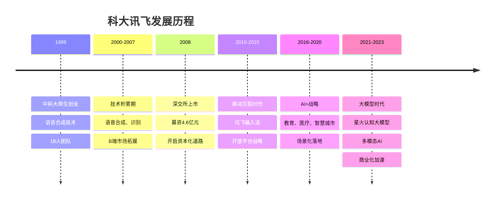
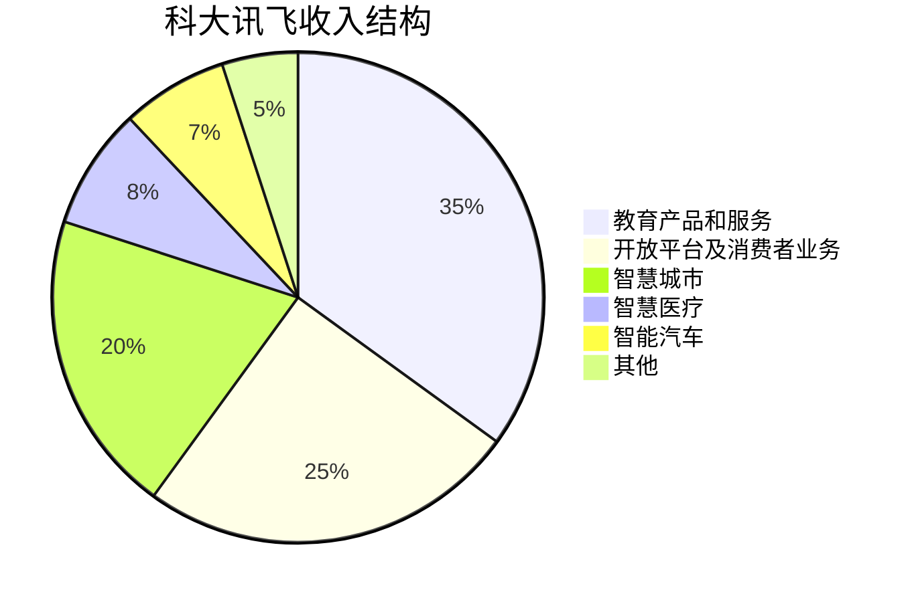
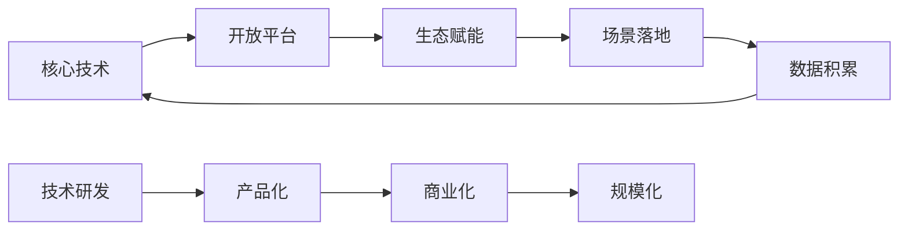
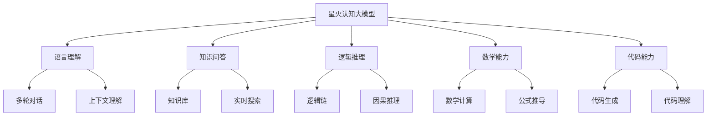
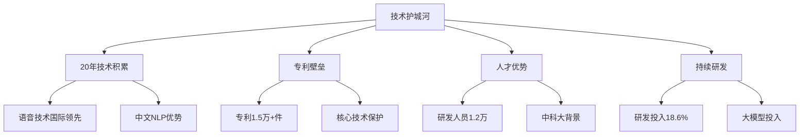

# 科大讯飞深度研究 - 中国语音AI龙头

## 概述

科大讯飞是中国语音人工智能领域的领军企业，从语音合成技术起家到构建完整的AI生态，科大讯飞走出了一条技术驱动、场景落地的发展之路。本文深入分析科大讯飞的技术优势、业务布局、商业模式和长期投资价值。

**学习目标**：
- 理解科大讯飞的语音AI技术优势
- 分析科大讯飞的业务布局和商业模式
- 评估科大讯飞的星火大模型战略
- 掌握AI企业的投资逻辑
- 学习技术型企业的研究方法

**为什么重要**：
科大讯飞是中国AI产业化的先行者，其从技术到应用的路径对整个AI行业具有示范意义。理解科大讯飞可以学习如何评估AI企业的商业化能力和投资价值。

## 公司概况

### 基本信息

**公司全称**：科大讯飞股份有限公司
**股票代码**：002230.SZ
**成立时间**：1999年12月
**上市时间**：2008年5月（深交所中小板）
**总部位置**：安徽省合肥市
**主营业务**：智能语音及人工智能核心技术研究、软件及芯片产品开发、语音信息服务及电子政务系统集成

**市值规模**（2023年底）：
- 总市值：约1000亿元人民币
- A股AI行业龙头
- 中国语音AI第一股

**核心数据**（2023年）：
- 营业收入：188亿元（+6%）
- 净利润：8亿元（+20%）
- 研发投入：35亿元（占收入18.6%）
- 研发人员：1.2万人（占比60%+）
- 开放平台：开发者300万+
- 用户规模：10亿+

### 发展历程

**关键里程碑**：
- 1999年：刘庆峰等18位中科大师生创立
- 2004年：语音合成技术国际领先
- 2008年：深交所上市，成为中国语音AI第一股
- 2010年：讯飞输入法发布，用户破亿
- 2014年：开放平台战略，开发者生态
- 2017年：AI+战略，深耕教育、医疗等场景
- 2019年：智医助理通过国家执业医师资格考试
- 2023年：星火认知大模型发布，对标GPT
- 2023年：营收突破188亿，净利润8亿

## 商业模式分析

### 业务结构

**收入结构**（2023年占比）：

**教育产品和服务**（收入66亿，占比35%）：
- 核心产品：
  - 智慧课堂：AI辅助教学
  - 个性化学习：因材施教
  - 智能考试：机器阅卷
  - 英语听说：口语评测
- 市场地位：教育AI龙头
- 客户：学校3.8万所，覆盖师生1亿+
- 增长驱动：教育信息化、双减政策后的校内需求
- 毛利率：60%+

**开放平台及消费者业务**（收入47亿，占比25%）：
- 开放平台：
  - 讯飞开放平台：开发者300万+
  - API调用：日均60亿次
  - 生态合作：赋能各行业
- 消费者产品：
  - 讯飞输入法：用户8亿+
  - AI学习机：智能硬件
  - 翻译机：多语言翻译
  - 录音笔：智能转写
- 增长驱动：大模型赋能、硬件销售
- 毛利率：50-60%

**智慧城市**（收入38亿，占比20%）：
- 业务内容：
  - 智慧政务：政务服务
  - 智慧司法：智能审判
  - 智慧应急：应急指挥
  - 城市大脑：城市治理
- 客户：政府、公检法
- 增长驱动：数字政府建设
- 毛利率：40-50%

**智慧医疗**（收入15亿，占比8%）：
- 核心产品：
  - 智医助理：AI辅助诊疗
  - 医学影像：AI阅片
  - 智能语音：病历录入
  - 慢病管理：健康管理
- 市场地位：医疗AI领先
- 覆盖：基层医疗机构5万+
- 增长驱动：分级诊疗、基层医疗信息化
- 毛利率：55%+

**智能汽车**（收入13亿，占比7%）：
- 业务内容：
  - 车载语音：语音交互
  - 智能座舱：人机交互
  - 车联网：车载服务
- 合作伙伴：奇瑞、长安、吉利等
- 增长驱动：智能汽车渗透率提升
- 毛利率：50%+

### 商业模式特点

**技术驱动**：

**To B + To C + To G**：
- To B：企业客户，开放平台、行业解决方案
- To C：消费者，输入法、学习机、翻译机
- To G：政府客户，智慧城市、智慧政务

**平台生态**：
- 开放平台：赋能开发者
- 生态合作：与各行业合作
- 数据飞轮：数据积累提升技术

## 核心技术分析

### 语音技术

**语音合成**：
- 技术水平：国际领先
- 自然度：接近真人
- 多语种：支持100+语言
- 应用：输入法、翻译、有声读物

**语音识别**：
- 准确率：98%+（普通话）
- 方言识别：支持23种方言
- 噪音环境：抗噪能力强
- 应用：输入法、会议转写、智能客服

**语音评测**：
- 技术：口语评测、发音纠正
- 应用：英语听说考试、口语学习
- 市场：覆盖全国31个省市

**声纹识别**：
- 技术：声纹特征提取、身份认证
- 应用：金融、安防、智能家居
- 准确率：99%+

### 自然语言处理

**机器翻译**：
- 技术：神经网络机器翻译
- 语种：支持60+语言互译
- 应用：翻译机、同传、文档翻译

**语义理解**：
- 技术：深度学习、知识图谱
- 能力：意图识别、实体抽取、关系抽取
- 应用：智能客服、智能问答

**文本生成**：
- 技术：生成式AI
- 能力：文章生成、摘要、改写
- 应用：内容创作、智能写作

### 计算机视觉

**OCR识别**：
- 技术：文字识别、版面分析
- 准确率：99%+
- 应用：证件识别、票据识别、文档数字化

**图像识别**：
- 技术：深度学习、卷积神经网络
- 能力：物体识别、场景识别
- 应用：智能相册、商品识别

### 星火认知大模型

**技术架构**：

**模型能力**：
- 参数规模：千亿级
- 训练数据：万亿级token
- 多模态：文本、图像、语音
- 中文能力：行业领先

**版本迭代**：
- V1.0（2023.5）：基础能力
- V2.0（2023.8）：代码能力提升
- V3.0（2023.10）：多模态能力
- V3.5（2024.1）：对标GPT-4

**应用场景**：
- 教育：AI辅导、作业批改
- 办公：智能写作、会议纪要
- 客服：智能问答、情感分析
- 医疗：辅助诊断、病历分析

**商业化**：
- API调用：按次收费
- 私有化部署：企业客户
- 行业大模型：定制化服务
- 生态合作：开发者平台

## 场景化应用

### 教育场景

**智慧课堂**：
- 产品：AI课堂、智慧黑板
- 功能：AI辅助教学、互动课堂
- 覆盖：学校3.8万所
- 效果：提升教学效率30%+

**个性化学习**：
- 产品：个性化学习手册
- 技术：知识图谱、学情分析
- 功能：精准推送、因材施教
- 覆盖：学生5000万+

**智能考试**：
- 产品：智能阅卷系统
- 技术：OCR、NLP、机器学习
- 功能：自动阅卷、学情分析
- 覆盖：考试场次100万+/年

**英语听说**：
- 产品：英语听说考试系统
- 技术：语音识别、口语评测
- 覆盖：31个省市
- 市场份额：70%+

### 医疗场景

**智医助理**：
- 功能：AI辅助诊疗、合理用药
- 技术：医学知识图谱、深度学习
- 覆盖：基层医疗机构5万+
- 效果：诊断准确率提升20%+

**医学影像**：
- 功能：AI阅片、病灶识别
- 技术：计算机视觉、深度学习
- 应用：肺结节、骨折、眼底病变
- 准确率：95%+

**智能语音**：
- 功能：病历录入、语音转写
- 技术：语音识别、医学NLP
- 效果：医生书写时间减少50%+

### 智慧城市场景

**智慧政务**：
- 产品：政务服务平台
- 功能：智能问答、办事指南
- 覆盖：城市200+
- 效果：办事效率提升40%+

**智慧司法**：
- 产品：智能审判系统
- 功能：案件分析、量刑建议
- 覆盖：法院1000+
- 效果：审判效率提升30%+

**智慧应急**：
- 产品：应急指挥平台
- 功能：态势感知、智能调度
- 覆盖：省市级应急部门
- 效果：响应速度提升50%+

### 消费者场景

**讯飞输入法**：
- 用户：8亿+
- 日活：1.5亿+
- 功能：语音输入、手写输入、AI写作
- 市场份额：第三（仅次于搜狗、百度）

**AI学习机**：
- 产品：讯飞AI学习机
- 功能：个性化学习、AI辅导
- 销量：累计100万+台
- 市场份额：前三

**翻译机**：
- 产品：讯飞翻译机
- 功能：多语言翻译、离线翻译
- 语种：60+语言
- 市场份额：第一

**录音笔**：
- 产品：讯飞智能录音笔
- 功能：实时转写、多语言翻译
- 准确率：98%+
- 市场份额：第一

## 竞争优势分析

### 核心竞争力

**1. 技术优势**
- 语音技术：国际领先，20年积累
- 自然语言处理：中文能力强
- 大模型：星火认知大模型
- 专利储备：专利申请1.5万+件

**2. 数据优势**
- 用户规模：10亿+
- 开放平台：日均API调用60亿次
- 场景数据：教育、医疗、政务等
- 数据飞轮：数据积累提升技术

**3. 生态优势**
- 开放平台：开发者300万+
- 合作伙伴：覆盖各行业
- 生态赋能：技术输出
- 网络效应：生态越大，价值越高

**4. 场景优势**
- 教育：深耕10年+，覆盖3.8万所学校
- 医疗：智医助理覆盖5万+基层医疗机构
- 政务：智慧城市覆盖200+城市
- 消费者：输入法用户8亿+

**5. 品牌优势**
- 中国语音AI第一品牌
- 技术形象：AI国家队
- 政府支持：国家级AI平台
- 用户信任：20年品牌积累

### 护城河分析

**技术护城河**：

**数据护城河**：
- 用户数据：10亿+用户
- 场景数据：教育、医疗、政务
- 数据飞轮：数据越多，技术越好
- 数据壁垒：竞争对手难以复制

**生态护城河**：
- 开放平台：开发者300万+
- 合作伙伴：各行业龙头
- 网络效应：生态越大，价值越高
- 转换成本：客户粘性强

**场景护城河**：
- 教育：深耕10年+，客户粘性强
- 医疗：基层医疗覆盖广
- 政务：政府客户稳定
- 先发优势：场景理解深

## 财务分析

### 收入增长

**历史收入**（亿元）：
| 年份 | 营业收入 | 同比增长 | 教育收入 | 开放平台收入 |
|------|---------|---------|---------|------------|
| 2018 | 79 | +56% | 20 | 15 |
| 2019 | 101 | +28% | 28 | 20 |
| 2020 | 130 | +29% | 38 | 26 |
| 2021 | 158 | +22% | 50 | 32 |
| 2022 | 177 | +12% | 60 | 42 |
| 2023 | 188 | +6% | 66 | 47 |

**增长驱动**：
- 教育业务：教育信息化、双减后校内需求
- 开放平台：大模型赋能、API调用增长
- 智慧城市：数字政府建设
- 消费者业务：硬件销售增长

**增长放缓原因**：
- 疫情影响：2020-2022年
- 教育政策：双减政策影响
- 竞争加剧：大模型竞争
- 商业化挑战：AI变现难

### 盈利能力

**毛利率趋势**：
- 2018年：50%
- 2020年：46%
- 2022年：45%
- 2023年：47%

**毛利率分析**：
- 教育业务：60%+（高毛利）
- 开放平台：50-60%（中高毛利）
- 智慧城市：40-50%（中等毛利）
- 消费者硬件：30-40%（较低毛利）

**净利率趋势**：
- 2018年：5%
- 2020年：-3%（亏损）
- 2022年：2%
- 2023年：4%

**净利率低的原因**：
- 研发投入高：18.6%
- 销售费用高：25%+
- 管理费用高：10%+
- 商业化初期：投入期

**ROE水平**：
- 2023年：5%
- 行业较低水平
- 受盈利能力影响

### 现金流分析

**经营现金流**（2023年）：
- 经营活动现金流：25亿元
- 经营现金流/净利润：313%
- 现金流质量优秀

**资本开支**：
- 2023年资本开支：10亿元
- 主要用于研发设施、服务器
- 资本开支/收入：5%

**自由现金流**：
- 2023年FCF：15亿元
- FCF/净利润：188%
- 支撑研发投入

### 资产负债表

**资产结构**（2023年底）：
- 总资产：280亿元
- 固定资产：30亿元
- 货币资金：80亿元
- 应收账款：60亿元

**负债结构**：
- 总负债：120亿元
- 资产负债率：43%
- 有息负债：20亿元
- 财务稳健

**股东权益**：
- 净资产：160亿元
- 归母净资产：150亿元

## 投资逻辑

### 长期投资价值

**行业成长性**：
- AI产业快速发展
- 大模型应用加速
- 教育信息化持续
- 智慧城市建设

**公司竞争力**：
- 技术领先：语音AI龙头
- 场景深耕：教育、医疗、政务
- 生态优势：开放平台
- 大模型：星火认知大模型

**盈利改善**：
- 规模效应：收入增长
- 费用率下降：运营效率提升
- 大模型变现：商业化加速
- 净利率提升：从4%到10%+

### 增长驱动因素

**大模型商业化**：
- 星火认知大模型
- API调用增长
- 行业大模型
- 私有化部署

**教育业务增长**：
- 教育信息化2.0
- 双减后校内需求
- 个性化学习
- 智能考试

**消费者业务**：
- AI学习机
- 翻译机、录音笔
- 输入法变现
- 硬件+服务

**智慧城市**：
- 数字政府建设
- 智慧政务
- 智慧司法
- 城市大脑

### 估值分析

**历史估值**：
- 2018年PE：80倍
- 2020年PE：负值（亏损）
- 2022年PE：200倍
- 2023年PE：125倍

**合理估值区间**：
- 成长期：PE 80-120倍
- 考虑盈利改善：PE 60-80倍
- 当前阶段：PE 80-100倍合理

**估值方法**：
- PE估值：考虑盈利改善
- PS估值：5-8倍
- DCF估值：长期现金流折现
- 分部估值：各业务分别估值

### 投资风险

**商业化风险**：
- AI变现难
- 大模型竞争
- 盈利能力弱
- 费用率高

**竞争风险**：
- 百度、阿里、腾讯竞争
- 大模型竞争加剧
- 教育市场竞争
- 价格战

**政策风险**：
- 教育政策变化
- AI监管
- 数据安全
- 隐私保护

**技术风险**：
- 技术路线变化
- 大模型差距
- 竞争对手追赶
- 技术迭代

## 未来展望

### 短期（2024-2025）

**业务发展**：
- 收入增长10-15%
- 大模型商业化加速
- 教育业务稳定增长
- 盈利能力改善

**财务预测**：
- 2024年收入：210亿元
- 2025年收入：240亿元
- 净利率提升至6-8%
- ROE提升至8-10%

### 中期（2026-2028）

**战略目标**：
- 收入突破350亿元
- 大模型收入占比20%+
- 净利率提升至10%+
- ROE提升至15%+

### 长期（2029-2035）

**愿景**：
- 全球AI领导者
- 收入突破600亿元
- 大模型全球领先
- 盈利能力行业领先

**技术方向**：
- 通用人工智能（AGI）
- 多模态大模型
- 具身智能
- 脑机接口

## 投资策略建议

### 长期持有

**适合投资者**：
- 看好AI长期趋势
- 认可技术价值
- 能承受短期波动
- 投资期限5年以上

**买入时机**：
- 估值合理区间（PE 60-80倍）
- 大模型商业化突破
- 盈利能力改善
- 行业调整期

### 波段操作

**买入信号**：
- PE低于60倍
- 大模型进展超预期
- 教育业务恢复
- 政策利好

**卖出信号**：
- PE高于120倍
- 竞争格局恶化
- 盈利不达预期
- 技术落后

### 配置建议

**核心持仓**：
- AI组合30-40%
- 长期持有
- 定期调仓

**风险控制**：
- 关注商业化进展
- 监控竞争格局
- 跟踪盈利能力
- 评估估值水平

## 关键学习点

1. **技术积累的价值**：20年语音技术积累，形成深厚护城河
2. **场景化落地重要**：教育、医疗、政务等场景深耕
3. **生态平台战略**：开放平台赋能，构建生态
4. **大模型是机会**：星火认知大模型，商业化加速
5. **盈利能力是关键**：AI企业需要证明商业化能力
6. **估值需匹配成长**：高估值需要高成长支撑
7. **政策影响显著**：教育政策、AI监管需关注
8. **长期投资视角**：AI企业需要长期视角

## 延伸阅读

### 推荐资料

1. **科大讯飞年报** - 最权威的公司信息
2. **科大讯飞投资者交流会** - 管理层战略解读
3. **《人工智能》** - 李开复
4. **《智能时代》** - 吴军
5. **券商深度报告** - 中金、中信、国君等

### 研究工具

**数据来源**：
- 公司公告：巨潮资讯网
- 行业数据：艾瑞咨询、IDC
- 财务数据：Wind、Choice
- 新闻资讯：财联社、36氪

## 参考文献

1. 科大讯飞. (2023). 年度报告
2. 科大讯飞. (2023). 投资者关系活动记录
3. 艾瑞咨询. (2023). 中国AI行业报告
4. IDC. (2023). 中国AI市场报告
5. 中金公司. (2023). 科大讯飞深度报告
6. 中信证券. (2023). AI行业研究
7. 国泰君安. (2023). 科大讯飞投资价值分析
8. Gartner. (2023). AI Market Forecast
9. 《人工智能》杂志. (2023). AI产业化专题
10. 中国人工智能产业发展联盟. (2023). AI产业报告

---

**下一步学习**：
- [百度AI分析](./baidu.html) - 搜索巨头的AI转型
- [商汤科技分析](./sensetime.html) - 计算机视觉龙头
- [AI行业研究](./overview.html) - 行业全景
