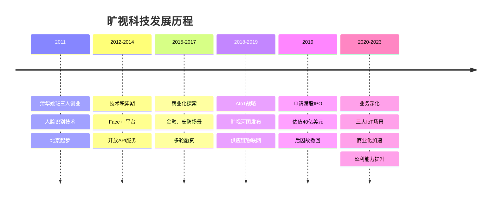
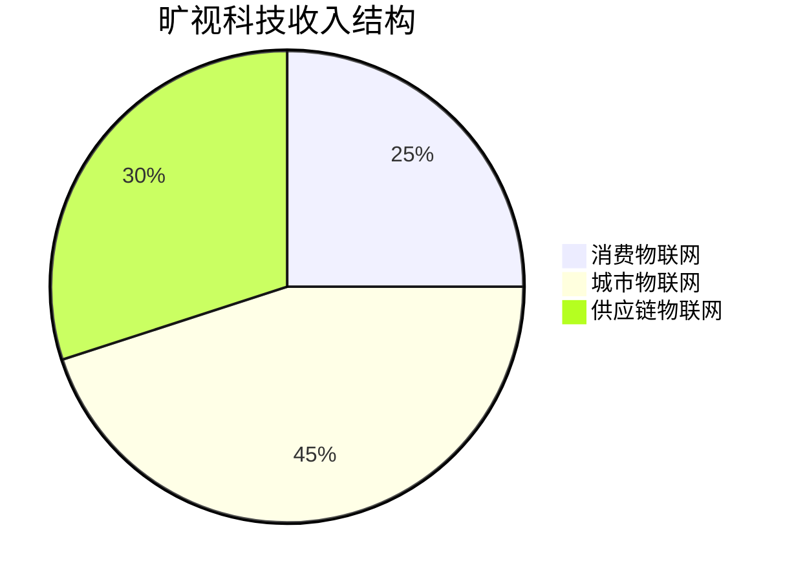
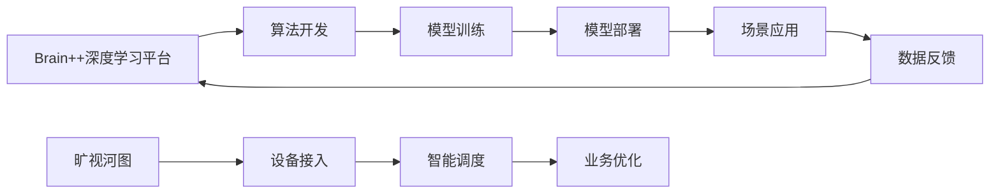
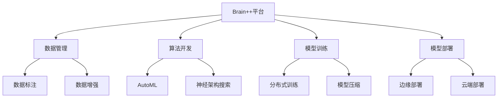
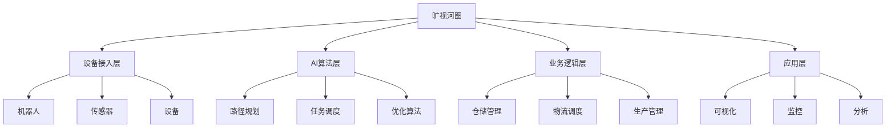
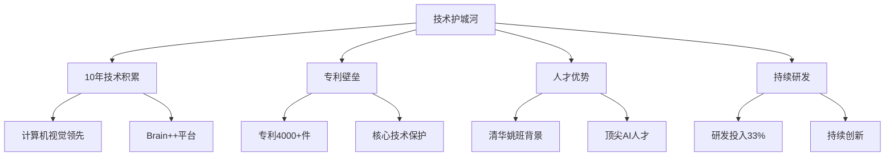

# 旷视科技深度研究 - 中国计算机视觉领军者

## 概述

旷视科技（Megvii）是中国领先的人工智能产品和解决方案公司，专注于计算机视觉和深度学习技术。从人脸识别起家到构建AIoT生态，旷视科技走出了一条技术商业化的创新之路。本文深入分析旷视科技的技术优势、业务布局、商业模式和长期投资价值。

**学习目标**：
- 理解旷视科技的计算机视觉技术优势
- 分析旷视科技的AIoT战略和业务布局
- 评估旷视科技的商业化能力
- 掌握AI视觉企业的投资逻辑
- 学习技术型创业公司的研究方法

**为什么重要**：
旷视科技是中国AI视觉领域的代表企业，其从技术到产品到解决方案的路径对整个AI行业具有示范意义。理解旷视科技可以学习如何评估AI视觉企业的商业化能力和投资价值。

## 公司概况

### 基本信息

**公司全称**：北京旷视科技有限公司（Megvii Technology Limited）
**股票代码**：未上市（曾申请港股IPO，后撤回）
**成立时间**：2011年10月
**总部位置**：北京市海淀区
**创始人**：印奇、唐文斌、杨沐（清华大学姚班）

**业务范围**：
- 计算机视觉：人脸识别、物体识别、图像分析
- AIoT操作系统：旷视河图（Hetu）
- 行业解决方案：消费物联网、城市物联网、供应链物联网

**公司规模**（2023年）：
- 估值：约40亿美元
- 员工：3000+人
- 研发人员：占比60%+
- 专利申请：4000+件

**核心数据**（2023年）：
- 营业收入：约30亿元人民币
- 研发投入：约10亿元（占收入33%）
- 客户数量：3000+
- 合作伙伴：500+

### 发展历程

**关键里程碑**：
- 2011年：印奇、唐文斌、杨沐创立旷视科技
- 2013年：Face++开放平台上线
- 2014年：获得创新工场、联想之星投资
- 2016年：人脸识别技术全球领先
- 2017年：获得蚂蚁金服战略投资
- 2018年：旷视河图AIoT操作系统发布
- 2019年：申请港股IPO，估值40亿美元
- 2020年：IPO撤回，聚焦商业化
- 2023年：营收突破30亿，盈利能力改善

## 商业模式分析

### 业务结构

**三大IoT场景**（2023年收入占比）：

**消费物联网**（收入7.5亿，占比25%）：
- 核心业务：
  - 手机人脸解锁：与手机厂商合作
  - 移动支付：人脸支付
  - 美颜相机：AI美颜
  - 智能相册：照片管理
- 客户：小米、OPPO、vivo等
- 商业模式：技术授权、按设备收费
- 增长驱动：智能手机渗透、AI功能升级
- 毛利率：70%+

**城市物联网**（收入13.5亿，占比45%）：
- 核心业务：
  - 智慧安防：人脸识别、行为分析
  - 智慧社区：门禁、访客管理
  - 智慧园区：人员管理、安全监控
  - 智慧交通：车辆识别、交通管理
- 客户：政府、公安、社区、园区
- 商业模式：项目制、解决方案
- 增长驱动：智慧城市建设、平安城市
- 毛利率：50-60%

**供应链物联网**（收入9亿，占比30%）：
- 核心业务：
  - 智能仓储：旷视河图系统
  - 智能物流：机器人调度
  - 智能制造：质检、产线优化
  - 智能零售：无人零售、智能货架
- 客户：物流企业、制造企业、零售企业
- 商业模式：软件+硬件+服务
- 增长驱动：物流自动化、智能制造
- 毛利率：40-50%

### 商业模式特点

**技术平台化**：

**软硬一体**：
- 软件：算法、平台、系统
- 硬件：摄像头、传感器、机器人
- 服务：部署、运维、升级
- 优势：端到端解决方案

**行业深耕**：
- 消费：手机、支付
- 城市：安防、社区、交通
- 供应链：仓储、物流、制造
- 策略：垂直场景深度定制

## 核心技术分析

### 计算机视觉技术

**人脸识别**：
- 技术水平：全球领先
- 准确率：99.8%+
- 识别速度：毫秒级
- 应用：手机解锁、支付、安防

**人脸检测**：
- 技术：深度学习、卷积神经网络
- 能力：多人脸检测、遮挡检测
- 应用：相机、监控、门禁

**人脸属性分析**：
- 能力：年龄、性别、表情、姿态
- 应用：营销分析、客户画像

**人体识别**：
- 技术：人体检测、姿态估计、行为识别
- 应用：安防、体育、健康

**物体识别**：
- 技术：物体检测、分类、分割
- 应用：智能制造、质检、零售

**OCR识别**：
- 技术：文字检测、识别、理解
- 应用：证件识别、票据识别、文档数字化

### Brain++深度学习平台

**平台架构**：

**核心能力**：
- 数据管理：数据标注、清洗、增强
- 算法开发：AutoML、神经架构搜索
- 模型训练：分布式训练、GPU集群
- 模型部署：边缘计算、云端部署

**技术优势**：
- 自动化：AutoML降低开发门槛
- 高效：分布式训练提升效率
- 灵活：支持多种框架和硬件
- 规模化：支撑大规模应用

### 旷视河图（Hetu）AIoT操作系统

**系统架构**：

**核心功能**：
- 设备接入：支持多种机器人和设备
- 智能调度：AI优化任务分配
- 路径规划：最优路径算法
- 业务管理：仓储、物流、生产

**应用场景**：
- 智能仓储：天猫超市、京东物流
- 智能工厂：富士康、格力
- 智能零售：便利店、超市

**竞争优势**：
- 技术领先：AI算法优化
- 生态开放：支持多种设备
- 场景丰富：仓储、工厂、零售
- 规模化：已部署数百个项目

### 技术创新

**ShuffleNet系列**：
- 技术：轻量级神经网络
- 特点：高效、低功耗
- 应用：移动端、边缘计算
- 影响：CVPR最佳论文

**3D视觉技术**：
- 技术：3D重建、深度估计
- 应用：AR/VR、机器人导航
- 优势：精度高、速度快

**多模态融合**：
- 技术：视觉+语音+文本
- 应用：智能交互、内容理解
- 趋势：未来AI方向

## 场景化应用

### 消费物联网场景

**手机人脸解锁**：
- 合作伙伴：小米、OPPO、vivo
- 技术：3D人脸识别、活体检测
- 出货量：累计数亿台
- 市场份额：前三

**移动支付**：
- 合作伙伴：支付宝、微信支付
- 技术：人脸识别、活体检测
- 安全性：金融级安全
- 应用：刷脸支付、身份认证

**美颜相机**：
- 技术：人脸检测、美颜算法
- 应用：相机APP、短视频
- 合作：美图、抖音等

### 城市物联网场景

**智慧安防**：
- 产品：人脸识别系统、行为分析
- 客户：公安、社区、园区
- 功能：人员布控、轨迹追踪
- 覆盖：城市100+

**智慧社区**：
- 产品：智能门禁、访客管理
- 功能：人脸识别、车辆识别
- 效果：安全提升、管理便捷
- 覆盖：社区10000+

**智慧交通**：
- 产品：车辆识别、交通分析
- 功能：违章检测、流量分析
- 效果：交通效率提升20%+
- 覆盖：路口50000+

### 供应链物联网场景

**智能仓储**：
- 客户：天猫超市、京东物流、顺丰
- 产品：旷视河图系统
- 功能：机器人调度、路径优化
- 效果：效率提升40%+，成本降低30%+

**智能物流**：
- 客户：物流企业、快递公司
- 产品：分拣系统、配送优化
- 功能：智能分拣、路径规划
- 效果：分拣效率提升50%+

**智能制造**：
- 客户：富士康、格力、海尔
- 产品：质检系统、产线优化
- 功能：AI质检、缺陷检测
- 效果：质检效率提升60%+，准确率99%+

**智能零售**：
- 产品：无人零售、智能货架
- 功能：商品识别、客流分析
- 应用：便利店、超市
- 效果：运营效率提升30%+

## 竞争优势分析

### 核心竞争力

**1. 技术优势**
- 计算机视觉：全球领先
- Brain++平台：自研深度学习平台
- 旷视河图：AIoT操作系统
- 专利储备：专利申请4000+件

**2. 产品优势**
- 软硬一体：端到端解决方案
- 场景丰富：消费、城市、供应链
- 产品化能力：技术快速产品化
- 规模化部署：已部署数千个项目

**3. 客户优势**
- 客户数量：3000+
- 头部客户：小米、阿里、京东等
- 客户粘性：长期合作
- 行业覆盖：多个行业龙头

**4. 团队优势**
- 创始团队：清华姚班
- 研发团队：60%+研发人员
- 技术实力：多篇顶会论文
- 执行能力：商业化能力强

**5. 生态优势**
- 合作伙伴：500+
- 开放平台：Face++
- 生态赋能：技术输出
- 产业链整合：上下游合作

### 护城河分析

**技术护城河**：

**数据护城河**：
- 场景数据：消费、城市、供应链
- 数据规模：数十亿级
- 数据飞轮：数据越多，算法越好
- 数据壁垒：竞争对手难以复制

**客户护城河**：
- 头部客户：行业龙头
- 客户粘性：长期合作
- 转换成本：系统集成深
- 口碑传播：客户推荐

**生态护城河**：
- 合作伙伴：500+
- 开放平台：Face++
- 产业链整合：上下游协同
- 网络效应：生态越大，价值越高

## 财务分析

### 收入增长

**历史收入**（亿元，估算）：
| 年份 | 营业收入 | 同比增长 | 消费IoT | 城市IoT | 供应链IoT |
|------|---------|---------|---------|---------|-----------|
| 2018 | 14 | - | 5 | 7 | 2 |
| 2019 | 19 | +36% | 6 | 9 | 4 |
| 2020 | 13 | -32% | 4 | 6 | 3 |
| 2021 | 22 | +69% | 6 | 10 | 6 |
| 2022 | 27 | +23% | 7 | 12 | 8 |
| 2023 | 30 | +11% | 7.5 | 13.5 | 9 |

**增长驱动**：
- 供应链IoT：旷视河图规模化
- 城市IoT：智慧城市建设
- 消费IoT：手机出货量恢复
- 商业化能力：项目交付能力提升

**2020年下滑原因**：
- 疫情影响：项目延期
- 美国制裁：实体清单影响
- 客户谨慎：投资放缓

### 盈利能力

**毛利率趋势**（估算）：
- 2018年：60%
- 2020年：55%
- 2022年：58%
- 2023年：60%

**毛利率分析**：
- 消费IoT：70%+（高毛利）
- 城市IoT：50-60%（中高毛利）
- 供应链IoT：40-50%（中等毛利）

**净利率趋势**（估算）：
- 2018年：-50%（亏损）
- 2020年：-30%（亏损）
- 2022年：-10%（亏损）
- 2023年：接近盈亏平衡

**亏损原因**：
- 研发投入高：33%
- 销售费用高：25%+
- 管理费用高：15%+
- 商业化初期：投入期

**盈利改善路径**：
- 规模效应：收入增长
- 费用率下降：运营效率提升
- 高毛利业务占比提升
- 2024年有望实现盈利

### 现金流分析

**经营现金流**（2023年，估算）：
- 经营活动现金流：5亿元
- 经营现金流/净利润：改善中
- 现金流质量：逐步改善

**资本开支**：
- 年资本开支：3亿元
- 主要用于：研发设施、服务器
- 资本开支/收入：10%

**融资情况**：
- 累计融资：超过10亿美元
- 投资方：阿里、蚂蚁、联想等
- 现金储备：充足
- 支撑：研发和商业化

### 资产负债表

**资产结构**（2023年底，估算）：
- 总资产：80亿元
- 固定资产：10亿元
- 货币资金：30亿元
- 应收账款：20亿元

**负债结构**：
- 总负债：30亿元
- 资产负债率：38%
- 有息负债：5亿元
- 财务稳健

**股东权益**：
- 净资产：50亿元
- 累计亏损：收窄中

## 投资逻辑

### 长期投资价值

**行业成长性**：
- AI视觉市场快速增长
- AIoT应用加速落地
- 智慧城市建设
- 智能制造升级

**公司竞争力**：
- 技术领先：计算机视觉龙头
- 产品化能力：软硬一体
- 场景深耕：三大IoT场景
- 商业化加速：盈利改善

**估值吸引力**：
- 估值：40亿美元
- 对比：商汤科技（港股上市）
- 潜力：盈利后估值重估
- 上市：IPO预期

### 增长驱动因素

**供应链IoT**：
- 旷视河图规模化
- 智能仓储需求增长
- 智能制造升级
- 高增长业务

**城市IoT**：
- 智慧城市建设
- 平安城市需求
- 智慧社区普及
- 稳定增长业务

**消费IoT**：
- 手机出货量恢复
- AI功能升级
- 新应用场景
- 稳定现金流

**技术创新**：
- 3D视觉技术
- 多模态融合
- 边缘计算
- 新增长点

### 估值分析

**可比公司估值**：
| 公司 | 市值 | PS | 业务 |
|------|------|----|----|
| 旷视科技 | 40亿美元 | 约10倍 | 计算机视觉 |
| 商汤科技 | 30亿美元 | 约5倍 | 计算机视觉 |
| 云从科技 | 20亿美元 | 约8倍 | 计算机视觉 |
| 依图科技 | 未上市 | - | 计算机视觉 |

**估值方法**：
- PS估值：8-12倍
- 可比公司估值
- DCF估值：长期现金流折现
- 分部估值：各业务分别估值

**估值驱动**：
- 盈利改善：从亏损到盈利
- 收入增长：20%+增速
- 上市预期：IPO估值重估
- 行业地位：龙头溢价

### 投资风险

**商业化风险**：
- AI变现难
- 项目制业务
- 回款周期长
- 盈利能力弱

**竞争风险**：
- 商汤、云从、依图竞争
- 互联网巨头进入
- 价格战
- 市场份额波动

**政策风险**：
- 美国实体清单
- 数据安全
- 隐私保护
- AI监管

**技术风险**：
- 技术路线变化
- 竞争对手追赶
- 技术迭代
- 专利诉讼

**上市风险**：
- IPO不确定性
- 估值波动
- 流动性风险
- 锁定期

## 未来展望

### 短期（2024-2025）

**业务发展**：
- 收入增长15-20%
- 实现盈利
- 供应链IoT加速
- 城市IoT稳定增长

**财务预测**：
- 2024年收入：35亿元
- 2025年收入：42亿元
- 净利率转正：2-5%
- 现金流改善

### 中期（2026-2028）

**战略目标**：
- 收入突破70亿元
- 净利率提升至10%+
- 供应链IoT占比40%+
- 上市成功

### 长期（2029-2035）

**愿景**：
- 全球AI视觉领导者
- 收入突破150亿元
- AIoT生态完善
- 盈利能力行业领先

**技术方向**：
- 3D视觉
- 多模态AI
- 具身智能
- 边缘计算

## 投资策略建议

### 上市前投资

**适合投资者**：
- 机构投资者
- 高净值个人
- 风险承受能力强
- 长期投资视角

**投资方式**：
- 一级市场股权
- 员工期权
- 可转债
- 等待IPO

### 上市后投资

**买入时机**：
- IPO破发时
- 盈利改善时
- 业务突破时
- 估值合理时

**持有策略**：
- 长期持有
- 关注盈利能力
- 跟踪业务进展
- 动态调整

### 风险控制

**关注要点**：
- 商业化进展
- 盈利能力
- 竞争格局
- 政策变化

**仓位控制**：
- 不超过10%
- 分散投资
- 设置止损
- 定期评估

## 关键学习点

1. **技术商业化的挑战**：从技术到产品到商业化的路径
2. **场景化落地重要**：三大IoT场景深耕
3. **软硬一体优势**：端到端解决方案
4. **盈利能力是关键**：AI企业需要证明商业化能力
5. **估值需匹配成长**：盈利改善后估值重估
6. **政策影响显著**：实体清单、数据安全需关注
7. **竞争格局复杂**：AI视觉赛道竞争激烈
8. **长期投资视角**：AI企业需要长期视角

## 延伸阅读

### 推荐资料

1. **旷视科技招股书** - IPO申请文件
2. **《人工智能》** - 李开复
3. **《计算机视觉》** - 理查德·塞利斯基
4. **《深度学习》** - 伊恩·古德费洛
5. **券商研究报告** - AI视觉行业研究

### 研究工具

**数据来源**：
- 公司官网：旷视科技
- 行业数据：艾瑞咨询、IDC
- 新闻资讯：36氪、机器之心
- 技术论文：CVPR、ICCV

## 参考文献

1. 旷视科技. (2019). 招股说明书
2. 艾瑞咨询. (2023). 中国计算机视觉行业报告
3. IDC. (2023). 中国AI市场报告
4. 中金公司. (2023). AI视觉行业研究
5. 中信证券. (2023). 旷视科技分析
6. 国泰君安. (2023). AI行业投资策略
7. Gartner. (2023). AI Market Forecast
8. 《人工智能》杂志. (2023). 计算机视觉专题
9. CVPR. (2023). 计算机视觉顶会论文
10. 中国人工智能产业发展联盟. (2023). AI产业报告

---

**下一步学习**：
- [商汤科技分析](./sensetime.html) - 另一计算机视觉龙头
- [科大讯飞分析](./iflytek.html) - 语音AI龙头
- [AI行业研究](./overview.html) - 行业全景
