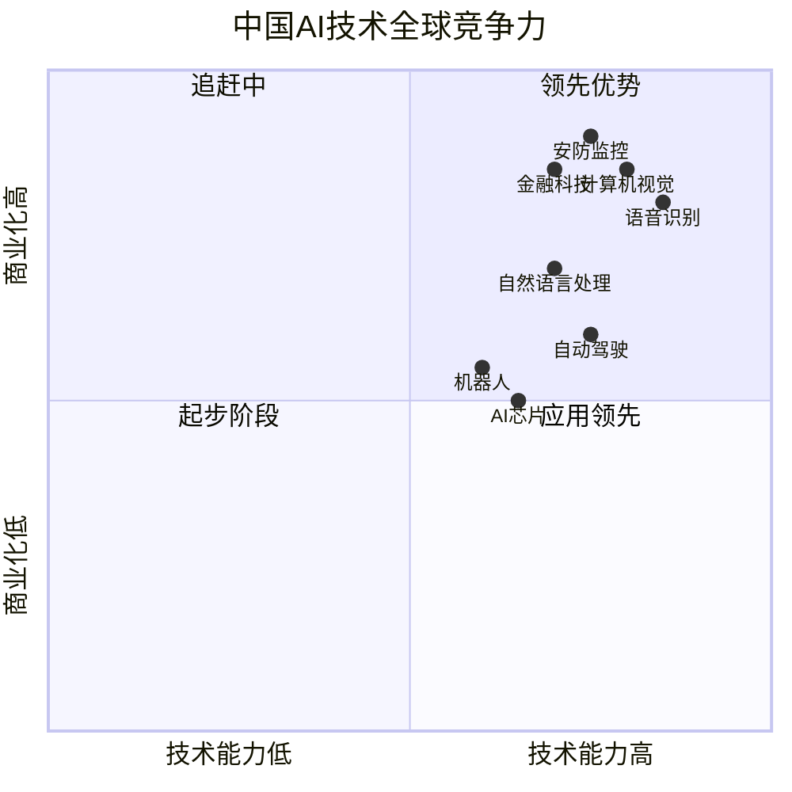
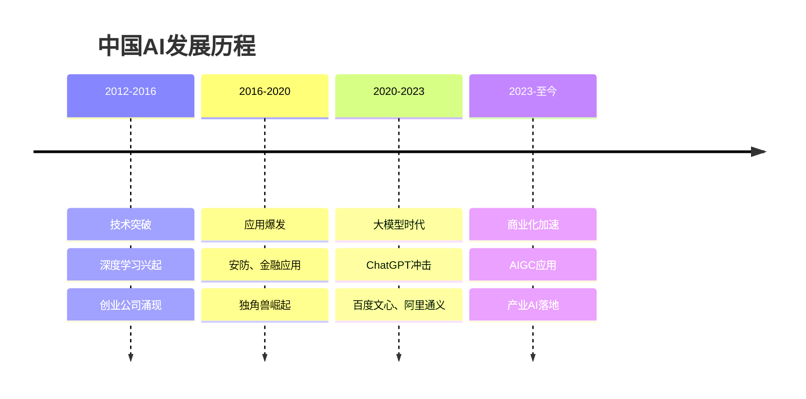
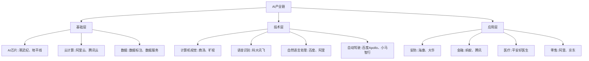

# 中国人工智能行业概览

## 概述

中国人工智能产业快速发展，在计算机视觉、语音识别、自然语言处理等领域取得重要突破。本文全面分析中国AI产业的发展现状、技术能力、应用场景和投资机会。

**学习目标**：
- 理解中国AI产业的发展阶段和全球地位
- 掌握AI产业链各环节的技术能力
- 分析AI应用场景和商业化进展
- 识别AI投资的机会和风险
- 建立AI行业的分析框架

**为什么重要**：
人工智能是新一轮科技革命的核心驱动力，中国拥有海量数据、丰富应用场景和政策支持，AI产业发展迅速。百度、阿里、腾讯等巨头布局AI，商汤、旷视等独角兽崛起，投资机会巨大。

## 行业发展现状

### 全球地位

**市场规模**：
- 2023年市场规模：约5000亿人民币
- 全球份额：20%+
- 年增长率：30%+

**技术能力**：

**优势领域**：
- 计算机视觉：人脸识别、图像识别
- 语音识别：语音助手、语音输入
- 安防监控：智慧城市、公共安全
- 金融科技：风控、反欺诈

**追赶领域**：
- 自然语言处理：大模型、对话AI
- 自动驾驶：L4/L5级自动驾驶
- AI芯片：训练芯片、推理芯片
- 机器人：工业机器人、服务机器人

### 发展历程

**关键里程碑**：
- 2012年：深度学习突破
- 2015年：商汤、旷视、依图成立
- 2017年：国务院发布《新一代人工智能发展规划》
- 2020年：寒武纪科创板上市
- 2023年：百度文心一言发布
- 2023年：阿里通义千问发布

## 产业链分析

### 产业链结构

### 1. 基础层

**AI芯片**：
- 训练芯片：寒武纪、华为昇腾
- 推理芯片：地平线、黑芝麻
- 国产化率：<20%
- 主要依赖：NVIDIA

**云计算**：
- 阿里云：市场份额第一
- 腾讯云：市场份额第二
- 华为云：快速增长
- 百度智能云：AI特色

**数据服务**：
- 数据标注：海天瑞声、云测数据
- 数据采集：数据堂
- 数据清洗：第三方服务

### 2. 技术层

**计算机视觉**：
- 商汤科技：人脸识别、图像识别
- 旷视科技：物体检测、图像分割
- 依图科技：医疗影像、城市大脑
- 云从科技：人机协同、跨镜追踪

**语音识别**：
- 科大讯飞：语音识别、语音合成
- 百度语音：语音助手
- 阿里达摩院：语音技术
- 腾讯AI Lab：语音识别

**自然语言处理**：
- 百度文心：大模型、对话AI
- 阿里通义：大模型、文本生成
- 腾讯混元：大模型
- 智谱AI：GLM大模型

**自动驾驶**：
- 百度Apollo：L4级自动驾驶
- 小马智行：Robotaxi
- 文远知行：无人驾驶
- 毫末智行：辅助驾驶

### 3. 应用层

**安防监控**：
- 海康威视：智能安防龙头
- 大华股份：视频监控
- 宇视科技：智慧城市
- 应用场景：公共安全、智慧城市

**金融科技**：
- 蚂蚁集团：风控、反欺诈
- 腾讯金融：智能客服、精准营销
- 平安科技：智能理赔、智能投顾
- 应用场景：风控、客服、投顾

**医疗健康**：
- 平安好医生：智能问诊
- 推想科技：医疗影像
- 数坤科技：心血管AI
- 应用场景：影像诊断、辅助诊疗

**零售电商**：
- 阿里巴巴：智能推荐、智能客服
- 京东：智能物流、无人仓
- 拼多多：智能推荐
- 应用场景：推荐、客服、物流

## 技术能力分析

### 大模型发展

**主要大模型**：

| 公司 | 模型名称 | 参数规模 | 发布时间 | 特点 |
|------|---------|---------|---------|------|
| 百度 | 文心一言 | 千亿级 | 2023.3 | 中文优势 |
| 阿里 | 通义千问 | 千亿级 | 2023.4 | 多模态 |
| 腾讯 | 混元 | 千亿级 | 2023.9 | 企业服务 |
| 智谱AI | GLM-130B | 1300亿 | 2022.8 | 开源 |
| 商汤 | 日日新 | 千亿级 | 2023.4 | 视觉强 |

**技术对比**：
- 与GPT-4差距：1-2年
- 中文能力：接近或超越
- 多模态：快速追赶
- 应用落地：加速中

### 应用场景

**AIGC应用**：
- 文本生成：写作、翻译、摘要
- 图像生成：AI绘画、图像编辑
- 视频生成：视频剪辑、特效
- 代码生成：编程助手

**产业AI**：
- 智能制造：质检、预测性维护
- 智慧城市：交通、安防、环保
- 智慧医疗：影像诊断、药物研发
- 智慧金融：风控、投顾、客服

## 投资机会分析

### 重点投资方向

**1. AI芯片**：
- 寒武纪：AI芯片龙头
- 地平线：自动驾驶芯片
- 黑芝麻：车规级芯片
- 壁仞科技：通用GPU

**2. 计算机视觉**：
- 商汤科技：人脸识别
- 旷视科技：物体检测
- 云从科技：人机协同
- 格灵深瞳：行为识别

**3. 语音识别**：
- 科大讯飞：语音技术龙头
- 思必驰：对话AI
- 云知声：物联网AI

**4. 自动驾驶**：
- 百度Apollo：L4级自动驾驶
- 小马智行：Robotaxi
- 文远知行：无人驾驶
- 毫末智行：辅助驾驶

**5. AI应用**：
- 海康威视：智能安防
- 科大讯飞：教育AI
- 平安科技：金融AI
- 京东：智能物流

### 投资逻辑

**技术驱动**：
- 大模型突破
- 算法优化
- 算力提升
- 数据积累

**应用驱动**：
- 场景落地
- 商业化加速
- 客户认可
- 规模效应

**政策驱动**：
- 国家战略
- 产业政策
- 资金支持
- 人才培养

## 投资风险分析

### 1. 技术风险

**技术差距**：
- 大模型：落后1-2年
- AI芯片：严重依赖NVIDIA
- 算法：部分领域差距大

**技术路线**：
- 技术路线不确定
- 投入巨大
- 成功率低

### 2. 商业化风险

**盈利困难**：
- 研发投入大
- 商业化慢
- 盈利模式不清晰

**竞争激烈**：
- 巨头竞争
- 同质化严重
- 价格战

### 3. 监管风险

**数据安全**：
- 数据隐私
- 数据出境
- 合规成本

**算法监管**：
- 算法备案
- 内容审核
- 伦理问题

### 4. 估值风险

**估值过高**：
- 市场预期过高
- 估值泡沫
- 业绩不及预期

## 投资策略建议

### 选股策略

**龙头策略**：
- 选择细分领域龙头
- 技术领先，商业化好
- 长期持有

**成长策略**：
- 寻找高成长赛道
- 技术突破，应用落地
- 中期持有

**主题策略**：
- AIGC、大模型主题
- 政策催化
- 短期交易

### 仓位管理

**核心持仓（50%）**：
- 科大讯飞、海康威视
- 确定性高，长期持有

**成长持仓（30%）**：
- 商汤、寒武纪
- 高成长，中期持有

**主题持仓（20%）**：
- AIGC、大模型
- 高风险高回报

## 常见问题

### Q1：中国AI能追上美国吗？

**回答**：
- 应用层：部分领域领先
- 技术层：差距1-2年
- 基础层：差距较大
- 需要持续投入

### Q2：AI投资机会在哪里？

**回答**：
- 应用层：商业化清晰
- 技术层：技术突破
- 基础层：国产替代
- 建议：分散投资

### Q3：如何选择AI股票？

**回答**：
- 看赛道：选择应用场景大的
- 看公司：选择技术领先、商业化好的
- 看估值：选择估值合理的
- 看时机：选择政策催化、业绩拐点的

## 延伸阅读

### 推荐书籍

1. **《人工智能》** - 李开复
2. **《智能时代》** - 吴军
3. **《深度学习》** - Ian Goodfellow
4. **《AI未来》** - 李开复

### 研究报告

- 各大券商AI行业深度报告
- 中国信通院AI发展报告
- IDC中国AI市场报告

## 参考文献

1. 中国信通院. 《中国人工智能发展报告》. 2023
2. IDC. 《中国AI市场预测》. 2023
3. 李开复. 《AI未来》. 2018
4. 吴军. 《智能时代》. 2016
5. 中金公司. 《AI行业深度报告》. 2023
6. 招商证券. 《AIGC投资机会分析》. 2023
7. 天风证券. 《AI芯片行业研究》. 2023
8. 华泰证券. 《计算机视觉行业分析》. 2023
9. Gartner. 《全球AI市场预测》. 2023
10. McKinsey. 《AI应用场景报告》. 2023

---

**投资建议**：
中国AI产业快速发展，应用场景丰富，政策支持力度大。建议长期看好，分批建仓龙头企业（科大讯飞、海康威视、商汤等），持有3-5年以上。短期关注AIGC、大模型主题，动态调整仓位。

**风险提示**：
需要关注技术突破不确定性、商业化困难、估值过高风险。建议仓位控制在30%以内，分散投资不同细分领域，设置止损位，密切跟踪技术和应用进展。

## 深度分析

### 核心机制解析

理解本主题需要从多个维度进行系统性分析。以下从理论基础、实践应用和历史验证三个层面展开深度探讨。

**理论基础层面**：本主题的核心逻辑建立在经济学和金融学的基本原理之上。通过对基础理论的深入理解，投资者能够建立起稳固的分析框架，避免被市场短期噪音所干扰。

**实践应用层面**：理论必须与实践相结合才能产生价值。在实际投资决策中，需要将抽象的概念转化为具体的分析工具和决策标准。

**历史验证层面**：金融市场有着丰富的历史记录，通过研究历史案例，我们可以验证理论的有效性，并从中提炼出具有普遍意义的规律。

### 关键影响因素

影响本主题的关键因素可以从以下几个维度进行分析：

1. **宏观经济环境**：利率水平、通货膨胀率、经济增长速度等宏观变量对本主题有着深远影响。在不同的宏观经济周期中，相关指标的表现会呈现出显著差异。

2. **市场结构因素**：市场参与者的构成、信息传播机制、流动性状况等市场结构因素决定了价格发现的效率和准确性。

3. **政策监管环境**：政府政策、监管框架的变化会直接影响相关市场的运作规则和参与者行为。

4. **技术创新驱动**：技术进步不断改变着金融市场的运作方式，从算法交易到区块链技术，每一次技术革新都带来新的机遇和挑战。

5. **全球化与地缘政治**：在全球化背景下，各国市场之间的联动性日益增强，地缘政治风险的影响也越来越不可忽视。

### 量化分析框架

为了更精确地分析和评估，可以采用以下量化框架：

| 分析维度 | 关键指标 | 参考基准 | 分析方法 |
|---------|---------|---------|---------|
| 规模评估 | 绝对值与相对值 | 历史均值 | 趋势分析 |
| 质量评估 | 稳定性指标 | 行业对标 | 横向比较 |
| 风险评估 | 波动率指标 | 风险阈值 | 情景分析 |
| 价值评估 | 估值倍数 | 历史区间 | 回归分析 |

通过系统性地应用上述框架，投资者可以对目标进行全面、客观的评估，从而做出更加理性的投资决策。

