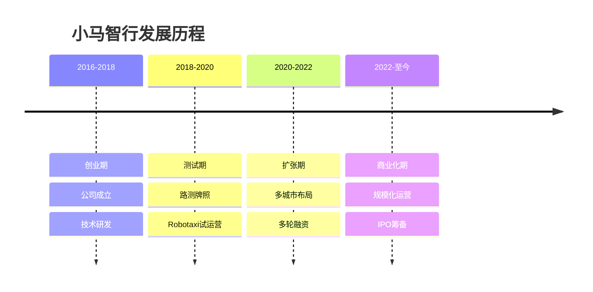
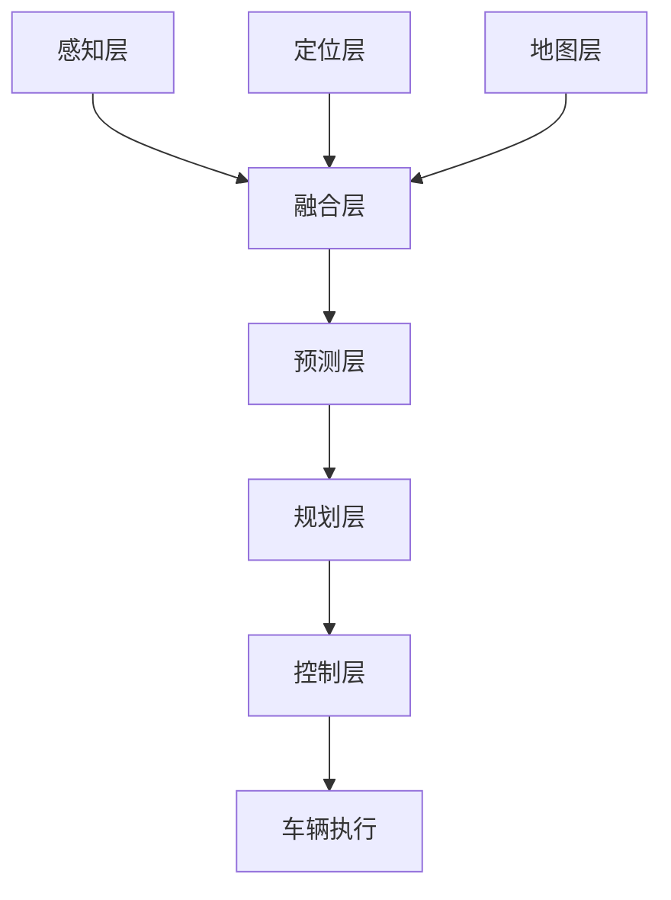

# 小马智行：中美双栖的自动驾驶独角兽

## 公司概况

### 基本信息

**公司名称**：小马智行（Pony.ai）
**股票代码**：未上市
**成立时间**：2016年12月
**总部位置**：中国广州、美国硅谷（双总部）
**创始人**：彭军（CEO）、楼天城（CTO）

**业务范围**：
- Robotaxi：无人驾驶出租车
- Robotruck：无人驾驶卡车
- 乘用车：ADAS辅助驾驶
- 技术服务：自动驾驶解决方案

**估值规模**（2023）：
- 约85亿美元
- 中国自动驾驶独角兽前三
- 全球自动驾驶公司前十

### 发展历程

**关键里程碑**：
- 2016年：小马智行成立
- 2018年：获得北京、广州路测牌照
- 2018年：完成1.12亿美元A轮融资
- 2020年：完成4.62亿美元B轮融资，估值53亿美元
- 2021年：获得加州全无人驾驶测试许可
- 2022年：完成1亿美元融资，估值85亿美元
- 2023年：北京、广州、深圳规模化运营
- 2024年：筹备IPO

## 技术能力分析

### L4级自动驾驶技术

**技术架构**：

**感知系统**：
- 激光雷达：多线激光雷达
- 摄像头：多目摄像头
- 毫米波雷达：长距离探测
- 超声波雷达：近距离探测
- 融合算法：多传感器融合

**定位系统**：
- 高精地图：厘米级精度
- GPS/IMU：卫星定位
- 视觉定位：视觉SLAM
- 激光定位：激光SLAM
- 融合定位：多源融合

**决策规划**：
- 行为预测：预测其他车辆行为
- 路径规划：全局路径规划
- 轨迹规划：局部轨迹规划
- 决策系统：实时决策
- 安全保障：多重安全机制

**技术指标**：
- 测试里程：超过2000万公里
- 安全记录：0重大事故
- 接管率：低于行业平均
- 响应时间：毫秒级
- 可靠性：99.9%+

### 技术优势

**vs 百度Apollo**：
- 小马：纯L4，技术聚焦
- 百度：L2-L4全栈，生态完整
- 优势：技术深度，国际化

**vs Waymo**：
- 小马：中美双布局
- Waymo：美国为主
- 差距：技术落后1-2年
- 优势：中国市场

**vs Cruise**：
- 小马：独立公司
- Cruise：通用汽车支持
- 差距：资源、规模
- 优势：灵活性

## Robotaxi业务分析

### 运营城市

**中国市场**：
- 北京：亦庄、海淀
- 广州：南沙、黄埔
- 深圳：南山、福田
- 上海：嘉定（筹备）
- 运营车辆：数百辆

**美国市场**：
- 加州：弗里蒙特、尔湾
- 亚利桑那：凤凰城（筹备）
- 运营车辆：数十辆

**运营数据**：
- 日订单量：数千单
- 服务用户：数十万
- 运营时间：早6点-晚10点
- 服务范围：数百平方公里

### 商业模式

**收费模式**：
- 起步价：10-15元
- 里程费：2-3元/公里
- 时长费：0.5-1元/分钟
- 补贴：前期大量补贴

**成本结构**：
- 车辆成本：50-100万/辆
- 运营成本：安全员、维护
- 研发成本：持续投入
- 单位成本：高于传统出租车

**盈利模型**：
- 当前：亏损运营
- 短期：规模化降本
- 中期：去安全员
- 长期：盈利（2025年后）

### 竞争格局

**中国市场**：
- 百度Apollo：规模最大，日订单数万
- 小马智行：技术领先，国际化
- 文远知行：广州本地优势
- 滴滴：出行平台优势

**全球市场**：
- Waymo：技术领先，规模最大
- Cruise：通用支持，资源丰富
- 小马智行：中美双布局
- Zoox：亚马逊支持

## Robotruck业务分析

### 技术方案

**应用场景**：
- 干线物流：高速公路
- 港口物流：港口运输
- 矿区物流：矿山运输
- 园区物流：工业园区

**技术特点**：
- L4级：完全无人
- 长距离：数百公里
- 重载：数十吨
- 全天候：24小时运营

**合作伙伴**：
- 一汽解放：车辆供应
- 三一重工：工程车辆
- 物流公司：运营合作
- 港口：场景合作

### 商业化进展

**试运营**：
- 广州港：港口物流
- 宁波港：集装箱运输
- 矿区：矿石运输
- 高速：干线物流测试

**商业价值**：
- 降本：节省人力成本70%+
- 增效：24小时运营
- 安全：减少事故
- 市场：万亿级市场

**挑战**：
- 法规：政策限制
- 技术：复杂场景
- 成本：车辆改装成本高
- 接受度：客户接受度

## 财务分析

### 收入情况

**收入规模**（估计）：
- 2021年：数千万
- 2022年：1-2亿
- 2023年：3-5亿
- 2024E：8-10亿

**收入来源**：
- Robotaxi：60%
- Robotruck：20%
- 技术服务：15%
- 其他：5%

**收入增长**：
- 2022年：2-3倍
- 2023年：2-3倍
- 2024E：2倍
- 高速增长期

### 盈利情况

**亏损情况**（估计）：
- 2021年：亏损10亿+
- 2022年：亏损15亿+
- 2023年：亏损20亿+
- 2024E：亏损25亿+

**亏损原因**：
- 研发投入：年约10亿
- 车辆成本：数亿
- 运营成本：安全员、维护
- 市场推广：补贴

**盈利路径**：
- 规模化：降低单位成本
- 去安全员：降低运营成本
- 技术授权：增加收入
- 预计：2026-2027年盈利

### 融资情况

**融资历程**：
- 2017年：A轮，1.12亿美元
- 2018年：A+轮，1.02亿美元
- 2020年：B轮，4.62亿美元，估值53亿
- 2021年：C轮，2.67亿美元，估值85亿
- 2022年：战略融资，1亿美元
- 累计融资：约10亿美元

**投资方**：
- 红杉中国：早期投资
- 君联资本：持续投资
- 丰田汽车：战略投资
- 广汽集团：战略投资
- 一汽集团：战略投资

**现金储备**：
- 账上现金：约30亿人民币
- 烧钱速度：年约20-25亿
- 现金够用：1-2年
- 融资需求：迫切

## 投资价值评估

### 估值分析

**当前估值（2023）**：
- 估值：85亿美元
- PS：约150-200倍
- 估值：极高（未盈利）

**估值对比**：

| 公司 | 估值（亿美元） | 技术 | 运营规模 | 盈利 |
|------|---------------|------|---------|------|
| 小马智行 | 85 | L4 | 数百辆 | 亏损 |
| 百度Apollo | - | L2-L4 | 数千辆 | 亏损 |
| 文远知行 | 50+ | L4 | 数百辆 | 亏损 |
| Waymo | 300+ | L4 | 数百辆 | 亏损 |
| Cruise | 300+ | L4 | 数百辆 | 亏损 |

### 投资论点

**看多理由**：
1. **技术领先**：L4技术中国前三
2. **中美双布局**：市场广阔
3. **团队强**：百度、Google背景
4. **融资能力强**：投资方豪华
5. **市场空间大**：万亿级市场
6. **政策支持**：自动驾驶政策支持

**看空理由**：
1. **持续巨额亏损**：年亏损20亿+
2. **盈利遥远**：2026年后
3. **竞争激烈**：百度、Waymo、Cruise
4. **技术差距**：落后Waymo 1-2年
5. **法规限制**：政策不确定
6. **估值极高**：PS 150-200倍
7. **现金紧张**：需要持续融资

### 投资建议

**风险评级**：极高风险

**适合投资者**：
- 机构投资者
- 极高风险承受能力
- 看好自动驾驶长期前景
- 长期投资视角（10年+）

**投资策略**：
- 一级市场：参与融资（门槛极高）
- 二级市场：等待IPO
- 持有周期：10年+
- 目标估值：500-1000亿美元（成功情况）

**IPO展望**：
- 时间：2024-2025年
- 地点：美国或香港
- 估值：100-150亿美元
- 风险：极高

## 行业分析

### 自动驾驶市场

**市场规模**：
- 全球Robotaxi市场：2030年万亿美元
- 中国Robotaxi市场：2030年数千亿美元
- 全球Robotruck市场：2030年数千亿美元
- 增长：快速增长

**发展阶段**：
- 当前：测试运营阶段
- 2025年：规模化运营
- 2030年：商业化成熟
- 2035年：大规模普及

**政策环境**：
- 中国：支持，但谨慎
- 美国：各州不同
- 欧洲：保守
- 趋势：逐步开放

### 竞争格局

**第一梯队**：
- Waymo：技术领先，规模最大
- Cruise：通用支持，资源丰富
- 百度Apollo：中国最大

**第二梯队**：
- 小马智行：中美双布局
- 文远知行：广州优势
- AutoX：深圳优势
- Zoox：亚马逊支持

**竞争要素**：
- 技术：L4能力
- 数据：测试里程
- 资金：持续投入
- 政策：牌照资源
- 运营：规模化能力

## 投资风险分析

### 1. 技术风险

**技术难度**：
- L4技术：极其复杂
- 长尾场景：难以穷尽
- 安全性：要求极高
- 成功不确定：高

**技术差距**：
- vs Waymo：落后1-2年
- 追赶困难：投入巨大
- 迭代速度：慢
- 风险：被超越

### 2. 商业化风险

**盈利困难**：
- 成本高：车辆、运营
- 收入低：补贴运营
- 规模效应：未体现
- 盈利：遥远

**市场接受度**：
- 用户信任：建立中
- 安全顾虑：存在
- 使用习惯：培养中
- 推广：困难

### 3. 竞争风险

**巨头竞争**：
- 百度：资源、数据、场景
- Waymo：技术、资金
- Cruise：通用支持
- 威胁：巨大

**生存压力**：
- 烧钱：快
- 融资：困难
- 竞争：激烈
- 风险：倒闭

### 4. 政策风险

**法规限制**：
- 路测：限制区域
- 商业化：限制规模
- 安全员：必须配备
- 影响：商业化进度

**政策不确定性**：
- 中美关系：影响
- 数据安全：审查
- 技术出口：限制
- 风险：高

## 投资启示

### 1. 自动驾驶的挑战

**技术难度**：
- L4技术：极其复杂
- 投入：巨大
- 周期：长
- 成功率：低

**商业化难度**：
- 成本：高
- 盈利：困难
- 周期：长
- 不确定性：高

### 2. 投资的耐心

**长期投资**：
- 周期：10年+
- 亏损：持续多年
- 不确定性：高
- 需要：极大耐心

**风险控制**：
- 仓位：极小
- 分散：不押注单一
- 止损：严格
- 心态：平和

### 3. 赛道的选择

**自动驾驶**：
- 市场：巨大
- 难度：极高
- 风险：极高
- 回报：不确定

**投资建议**：
- 谨慎：极度谨慎
- 小仓位：1-3%
- 长期：10年+
- 心理准备：可能归零

## 常见问题

### Q1：小马智行有投资价值吗？

**回答**：
- 技术：中国前三，全球前十
- 市场：万亿级市场
- 风险：极高，持续巨额亏损
- 建议：机构投资者可关注，个人投资者极度谨慎

### Q2：小马智行什么时候盈利？

**回答**：
- 预计：2026-2027年
- 前提：规模化、去安全员
- 不确定性：极高
- 可能：更晚或不盈利

### Q3：小马智行能赶上Waymo吗？

**回答**：
- 短期（3年）：不可能
- 中期（5年）：很难
- 长期（10年）：有可能缩小差距
- 现实：Waymo也在进步

### Q4：什么时候可以投资小马智行？

**回答**：
- 一级市场：门槛极高（机构）
- IPO：2024-2025年
- 估值：100-150亿美元
- 策略：IPO后观望，等待业绩验证

## 延伸阅读

### 推荐书籍

1. **《无人驾驶》** - 胡迪·利普森
2. **《自动驾驶技术》** - 刘少山
3. **《智能汽车》** - 李克强
4. **《出行革命》** - 研究报告

### 研究报告

- 小马智行融资材料
- 各大券商自动驾驶报告
- Robotaxi行业研究
- 自动驾驶技术报告

## 参考文献

1. 小马智行. 《融资材料》. 2020-2023
2. 加州DMV. 《自动驾驶测试报告》. 2023
3. 36氪. 《小马智行深度报道》. 2023
4. 中金公司. 《自动驾驶行业报告》. 2023
5. 高盛. 《Autonomous Vehicles Report》. 2023
6. 摩根士丹利. 《Robotaxi Market Analysis》. 2023
7. McKinsey. 《自动驾驶商业化报告》. 2023
8. BCG. 《出行革命报告》. 2023
9. 罗兰贝格. 《中国自动驾驶市场研究》. 2023
10. 艾瑞咨询. 《中国Robotaxi行业报告》. 2023

---

**投资建议**：
小马智行是中国自动驾驶领域的领先企业，拥有L4技术和中美双布局优势，团队背景强大，融资能力强。但公司面临持续巨额亏损（年亏损20亿+）、盈利遥远（2026年后）、竞争激烈、技术差距等严峻挑战。当前估值85亿美元，PS 150-200倍，估值极高。建议机构投资者可关注一级市场投资机会，个人投资者极度谨慎，等待IPO后观望，或完全避开。

**风险提示**：
小马智行属于极高风险投资标的，面临技术难度极高、持续巨额亏损、盈利遥远、竞争激烈、政策不确定等多重极端风险。投资者需要有极高的风险承受能力和极长期投资视角（10年+），并做好投资可能归零的心理准备。建议仓位控制在1-3%以内，或完全避开。不适合风险厌恶型投资者、中短期投资者和普通个人投资者。

---

[← 返回AI行业](./index.html)
