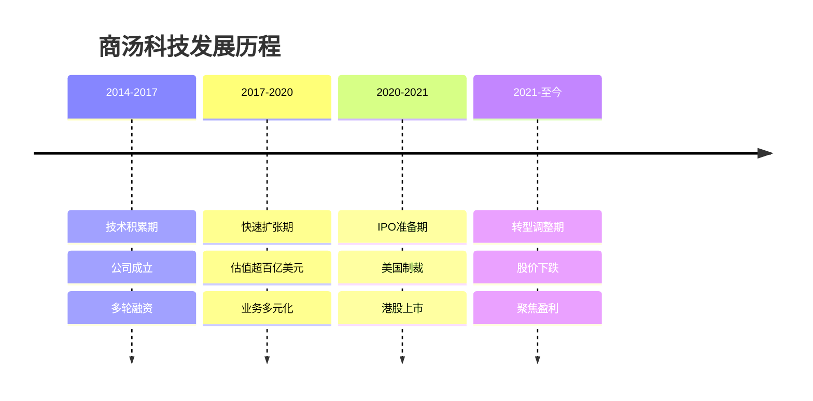
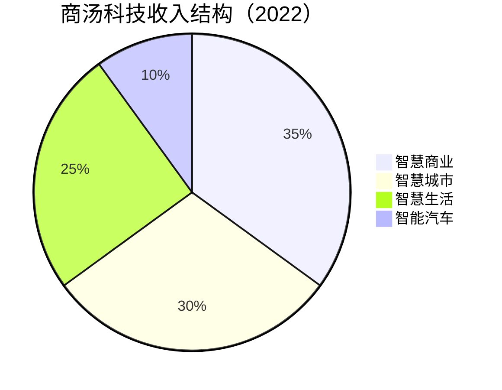

# 商汤科技：计算机视觉领军者

## 公司概况

### 基本信息

**公司名称**：商汤科技集团有限公司（SenseTime Group Inc.）
**股票代码**：0020.HK（港股）
**成立时间**：2014年10月
**总部位置**：中国上海
**创始人**：汤晓鸥、徐立

**业务范围**：
- 计算机视觉：人脸识别、图像识别
- 智慧城市：城市管理、公共安全
- 智慧商业：零售、金融、地产
- 智慧生活：手机、汽车、娱乐
- AI基础设施：算力平台、模型训练

**市值规模**（2023）：
- 约200亿港元
- 较IPO市值大幅缩水
- AI视觉领域领先企业

### 发展历程

**关键里程碑**：
- 2014年：商汤科技成立
- 2017年：完成4.1亿美元B轮融资
- 2018年：估值超过60亿美元
- 2019年：被美国列入实体清单
- 2021年：港股上市，募资740亿港元
- 2022年：股价大幅下跌
- 2023年：战略调整，聚焦盈利

## 技术能力分析

### 计算机视觉技术

**核心技术**：
- 人脸识别：准确率99.9%+
- 物体识别：支持数万类别
- 图像分割：像素级精度
- 视频分析：实时处理
- 3D重建：高精度建模

**技术优势**：
- 算法领先：学术论文数量全球前列
- 数据积累：海量标注数据
- 工程能力：大规模部署经验
- 产品化：技术到产品转化能力

**研发投入**：
- 研发费用：年收入40%+
- 研发人员：占比70%+
- 专利数量：8000+
- 论文发表：顶会论文数百篇

### SenseCore AI基础设施

**算力平台**：
- 自建数据中心
- GPU集群：数万张GPU
- 算力规模：中国领先
- 支持大模型训练

**模型训练平台**：
- 自动化训练：降低门槛
- 模型优化：提升效率
- 分布式训练：大规模并行
- 模型管理：全生命周期

**商业化**：
- 对内：支撑自身业务
- 对外：提供算力服务
- 盈利模式：算力租赁、平台服务

## 商业模式分析

### 业务结构

### 1. 智慧商业

**应用场景**：
- 零售：客流分析、智能收银
- 金融：身份认证、风控
- 地产：智能楼宇、访客管理
- 医疗：医学影像分析

**商业模式**：
- 项目制：定制化解决方案
- 订阅制：SaaS服务
- 授权费：技术授权

**客户案例**：
- 银行：人脸识别身份认证
- 商场：客流分析、精准营销
- 医院：AI辅助诊断

### 2. 智慧城市

**应用场景**：
- 公共安全：视频监控、人脸识别
- 交通管理：车辆识别、流量分析
- 城市治理：违章监测、应急管理

**商业模式**：
- 政府采购：大型项目
- 长期运营：持续服务
- 数据服务：数据分析

**市场规模**：
- 中国智慧城市市场：千亿级
- 商汤市场份额：前三
- 增长潜力：政策推动

**挑战**：
- 政府预算：受经济影响
- 回款周期：较长
- 竞争激烈：海康、大华等

### 3. 智慧生活

**手机应用**：
- 人脸解锁：安全便捷
- 美颜算法：提升体验
- AR特效：娱乐互动
- 合作伙伴：小米、OPPO、vivo等

**娱乐应用**：
- 短视频：特效、滤镜
- 游戏：AR游戏
- 直播：美颜、虚拟形象

**商业模式**：
- 授权费：按设备收费
- 技术服务：持续优化
- 分成模式：部分场景

### 4. 智能汽车

**自动驾驶**：
- 感知算法：摄像头方案
- 智能座舱：驾驶员监测、手势识别
- 合作伙伴：本田、上汽等

**市场潜力**：
- 自动驾驶：万亿级市场
- 渗透率：快速提升
- 商汤定位：Tier 2供应商

**竞争格局**：
- 竞争对手：百度、华为、地平线
- 差异化：纯视觉方案
- 挑战：商业化进度慢

## 财务分析

### 收入分析

**收入增长**：
- 2019年：30亿人民币
- 2020年：34亿人民币
- 2021年：47亿人民币
- 2022年：38亿人民币（下降）
- 2023E：40亿人民币

**收入下降原因**：
- 智慧城市：政府预算收紧
- 疫情影响：项目延期
- 竞争加剧：价格压力
- 客户流失：部分客户转向

### 盈利能力

**亏损情况**：
- 2019年：亏损50亿
- 2020年：亏损82亿
- 2021年：亏损171亿
- 2022年：亏损60亿
- 持续亏损：未实现盈利

**亏损原因**：
- 研发投入：占收入40%+
- 销售费用：占收入30%+
- 股权激励：大额费用
- 规模效应：尚未体现

**盈利路径**：
- 收入规模：需要达到100亿+
- 毛利率：提升至70%+
- 费用率：降低至50%以下
- 预计：2025年后可能盈利

### 现金流

**经营现金流**：
- 2021年：-20亿
- 2022年：-15亿
- 持续负值：烧钱模式

**融资情况**：
- IPO募资：740亿港元
- 现金储备：约200亿人民币
- 烧钱速度：年约50亿
- 现金够用：3-4年

## IPO分析

### 上市表现

**IPO基本信息**：
- 上市时间：2021年12月
- 发行价：3.85港元
- 募资额：740亿港元
- 估值：约3000亿港元

**股价表现**：
- 首日：破发，跌8.5%
- 最低：1.5港元（跌60%+）
- 2023年：约2港元
- 市值：约200亿港元（缩水90%+）

**破发原因**：
- 估值过高：IPO估值过于乐观
- 盈利遥远：持续亏损
- 市场环境：港股科技股低迷
- 监管风险：美国制裁影响

### 募资用途

**资金分配**：
- 研发投入：40%
- 算力建设：30%
- 业务拓展：20%
- 运营资金：10%

**执行情况**：
- 研发：持续高投入
- 算力：SenseCore建设
- 业务：收缩调整
- 现金：管理谨慎

## 投资价值评估

### 估值分析

**当前估值（2023）**：
- 市值：约200亿港元
- PS：约5倍
- 估值：大幅回落

**估值对比**：

| 公司 | 市值（亿美元） | PS | 盈利状态 |
|------|---------------|-------|---------|
| 商汤 | 25 | 5 | 亏损 |
| 旷视 | 未上市 | - | 亏损 |
| 依图 | 未上市 | - | 亏损 |
| 云从 | 10 | 8 | 亏损 |

### 投资论点

**看多理由**：
1. **技术领先**：计算机视觉中国第一
2. **市场空间**：AI视觉万亿市场
3. **客户基础**：覆盖多个行业
4. **现金充足**：IPO募资充足
5. **估值低**：较IPO大幅下跌

**看空理由**：
1. **持续亏损**：盈利遥遥无期
2. **收入下滑**：2022年收入下降
3. **竞争激烈**：百度、华为、阿里竞争
4. **监管风险**：美国制裁影响
5. **商业化难**：技术到商业化困难
6. **估值仍高**：PS 5倍，仍未盈利

### 投资建议

**风险评级**：高风险

**适合投资者**：
- 高风险承受能力
- 看好AI长期发展
- 能够承受波动
- 长期投资视角

**投资策略**：
- 观望为主：等待盈利拐点
- 小仓位试探：不超过5%
- 长期视角：3-5年
- 止损严格：跌破1.5港元止损

**关注指标**：
- 收入增长：是否恢复增长
- 毛利率：是否提升至70%+
- 亏损收窄：是否接近盈亏平衡
- 大客户：是否有标杆案例
- 新业务：大模型商业化进展

## 行业竞争分析

### 竞争格局

**AI视觉四小龙**：
- 商汤：技术领先，规模最大
- 旷视：物流、零售场景
- 依图：医疗、安防场景
- 云从：金融、安防场景

**互联网巨头**：
- 百度：AI全栈能力
- 腾讯：社交、游戏场景
- 阿里：电商、云计算场景
- 华为：端侧AI、云服务

### 商汤的竞争优势

**技术优势**：
- 学术积累：香港中文大学背景
- 算法领先：论文数量多
- 人才储备：顶尖AI科学家

**规模优势**：
- 客户数量：2400+
- 行业覆盖：广泛
- 项目经验：丰富

**生态优势**：
- 开发者平台：降低使用门槛
- 合作伙伴：覆盖产业链
- 品牌影响：行业知名度高

### 面临的挑战

**商业化困难**：
- 项目制：难以规模化
- 定制化：成本高
- 客户粘性：不强
- 替代性：技术门槛降低

**竞争压力**：
- 巨头入场：百度、华为等
- 价格战：利润率下降
- 技术同质化：差异化减弱

**外部风险**：
- 美国制裁：影响芯片采购
- 监管政策：数据安全、隐私保护
- 经济下行：客户预算收紧

## 大模型战略

### 日日新大模型

**技术能力**：
- 参数规模：百亿级
- 多模态：文本、图像、视频
- 特色：视觉能力强

**产品应用**：
- 内容生成：文生图、图生图
- 视频编辑：AI剪辑、特效
- 设计辅助：广告、设计
- 行业应用：医疗影像、工业检测

**商业化**：
- API服务：按次收费
- 企业服务：私有化部署
- 行业解决方案：定制化

### 与百度文心的对比

| 维度 | 商汤日日新 | 百度文心 |
|------|-----------|---------|
| 参数规模 | 百亿级 | 千亿级 |
| 特色能力 | 视觉生成 | 通用对话 |
| 商业化 | 起步阶段 | 快速推进 |
| 生态 | 建设中 | 相对成熟 |
| 资源投入 | 有限 | 充足 |

**商汤的机会**：
- 视觉领域：专业优势
- 垂直行业：深耕场景
- 差异化：避开通用大模型竞争

## 投资风险分析

### 1. 盈利风险

**持续亏损**：
- 已亏损多年
- 盈利时间不确定
- 现金消耗持续

**应对措施**：
- 成本控制：裁员、降费
- 聚焦盈利：砍掉亏损业务
- 提升效率：规模化复制

### 2. 竞争风险

**巨头竞争**：
- 百度：AI全栈能力
- 华为：端云协同
- 阿里：云计算生态
- 腾讯：社交数据

**应对策略**：
- 差异化：聚焦视觉
- 垂直化：深耕行业
- 生态化：开放合作

### 3. 监管风险

**美国制裁**：
- 实体清单：限制芯片采购
- 影响：算力扩展受限
- 应对：国产化替代

**数据安全**：
- 隐私保护：人脸数据敏感
- 合规要求：日益严格
- 成本：合规成本上升

### 4. 技术风险

**技术迭代**：
- 大模型：改变AI范式
- 开源模型：降低门槛
- 技术民主化：优势减弱

**应对**：
- 拥抱大模型：日日新
- 场景深耕：行业know-how
- 持续创新：保持领先

## 投资启示

### 1. AI公司的估值困境

**高估值陷阱**：
- 技术领先≠商业成功
- 市场空间大≠能够变现
- 融资多≠投资价值高

**理性评估**：
- 关注商业化能力
- 重视盈利能力
- 评估竞争壁垒

### 2. 技术公司的商业化挑战

**从技术到产品**：
- 技术领先：必要不充分
- 产品化：关键能力
- 规模化：盈利基础

**商业化路径**：
- 找准场景：刚需、高频
- 标准化：降低成本
- 规模化：提升效率

### 3. 成长股的风险控制

**高成长高风险**：
- 估值波动大
- 不确定性高
- 需要严格风控

**投资原则**：
- 小仓位：控制风险
- 分散投资：不押注单一
- 动态调整：根据进展调整
- 严格止损：及时止损

## 常见问题

### Q1：商汤还有投资价值吗？

**回答**：
- 技术：仍然领先
- 商业化：进展缓慢
- 估值：已大幅回落
- 建议：观望，等待盈利拐点

### Q2：商汤会被百度、华为超越吗？

**回答**：
- 技术：差距在缩小
- 资源：巨头优势明显
- 场景：巨头生态更完整
- 风险：确实存在被超越风险

### Q3：什么时候可以买入商汤？

**回答**：
- 信号1：收入恢复增长
- 信号2：亏损明显收窄
- 信号3：大模型商业化突破
- 信号4：股价企稳
- 策略：出现2个以上信号可小仓位试探

### Q4：商汤和旷视哪个更好？

**回答**：
- 商汤：规模更大，技术更强，但亏损更多
- 旷视：聚焦物流，商业化更好，但规模较小
- 选择：都面临挑战，建议观望

## 延伸阅读

### 推荐书籍

1. **《人工智能：一种现代的方法》** - Stuart Russell
2. **《深度学习》** - Ian Goodfellow
3. **《计算机视觉：算法与应用》** - Richard Szeliski

### 研究报告

- 商汤科技招股书和年报
- 各大券商商汤深度报告
- AI视觉行业研究报告
- 计算机视觉技术报告

## 参考文献

1. 商汤科技. 《招股说明书》. 2021
2. 商汤科技. 《年度报告》. 2022-2023
3. 中金公司. 《商汤科技深度报告》. 2023
4. 招商证券. 《AI视觉行业分析》. 2023
5. 高盛. 《SenseTime: Computer Vision Leader》. 2022
6. 摩根士丹利. 《China AI Industry》. 2023
7. IDC. 《中国AI市场报告》. 2023
8. Gartner. 《计算机视觉技术成熟度曲线》. 2023
9. 艾瑞咨询. 《中国计算机视觉市场研究》. 2023
10. 清华大学. 《中国AI发展报告》. 2023

---

**投资建议**：
商汤科技是中国计算机视觉领域的技术领军者，拥有强大的研发能力和广泛的客户基础。但公司面临持续亏损、收入下滑、竞争加剧等挑战，商业化进展不及预期。当前股价较IPO大幅下跌，估值已大幅回落，但盈利拐点仍不明确。建议观望为主，等待收入恢复增长、亏损明显收窄等积极信号出现后，再以小仓位试探性介入。

**风险提示**：
商汤科技属于高风险投资标的，面临持续亏损、竞争加剧、监管风险、技术迭代等多重挑战。投资者需要有较高的风险承受能力和长期投资视角。建议仓位控制在5%以内，设置严格止损，密切跟踪公司经营情况和行业变化。不适合风险厌恶型投资者。

