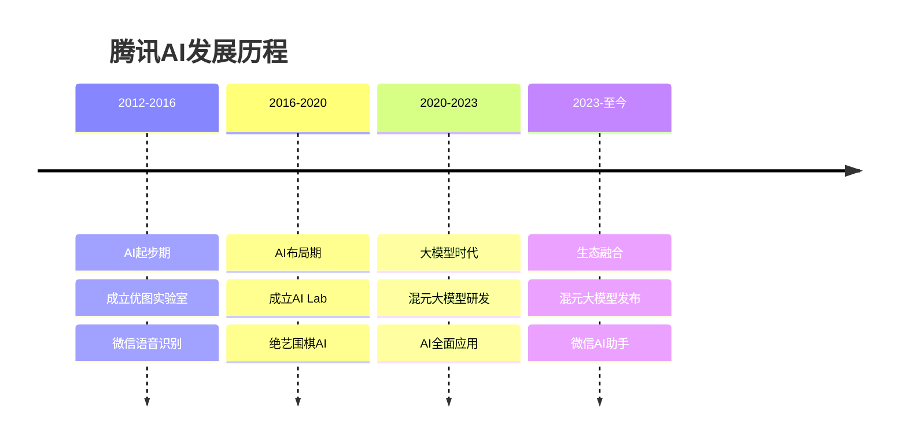

# 腾讯AI战略：混元大模型与社交生态

## 公司概况

### 基本信息

**公司名称**：腾讯控股有限公司（Tencent Holdings Limited）
**股票代码**：0700.HK（港股）、TCEHY（美股ADR）
**成立时间**：1998年11月
**总部位置**：中国深圳
**创始人**：马化腾、张志东等

**AI业务范围**：
- 混元大模型：大语言模型
- 微信AI：社交场景AI
- 腾讯云AI：云端AI服务
- 优图实验室：计算机视觉
- AI Lab：AI研究
- 游戏AI：游戏场景AI

**市值规模**（2023）：
- 约3500亿美元
- 中国最大互联网公司
- 社交和游戏双龙头

### AI发展历程

**关键里程碑**：
- 2012年：成立优图实验室
- 2016年：成立AI Lab
- 2016年：绝艺围棋AI击败职业棋手
- 2018年：AI医疗影像产品获批
- 2023年：混元大模型发布
- 2023年：微信AI助手上线
- 2024年：混元大模型全面开放

## 混元大模型分析

### 技术能力

**模型规模**：
- 参数规模：千亿级
- 训练数据：2万亿token+
- 多模态：文本、图像、音频
- 中英文：双语能力

**技术特点**：
- 长文本：支持32K上下文
- 代码能力：编程助手
- 工具调用：API集成
- 知识增强：实时搜索

**性能表现**：

| 能力维度 | 混元 | GPT-4 | 文心 | 通义 |
|---------|------|-------|------|------|
| 中文理解 | 94 | 90 | 95 | 95 |
| 英文理解 | 88 | 98 | 85 | 90 |
| 代码生成 | 90 | 95 | 85 | 88 |
| 数学推理 | 86 | 92 | 82 | 85 |
| 多模态 | 88 | 95 | 88 | 90 |

### 产品矩阵

**混元系列**：
- 混元-Standard：标准版
- 混元-Pro：专业版
- 混元-Lite：轻量版
- 混元-Vision：多模态版

**垂直应用**：
- 腾讯文档AI：文档处理
- 腾讯会议AI：会议纪要
- 企业微信AI：企业服务
- 游戏AI：NPC对话、剧情生成

**开发者平台**：
- 腾讯云AI：API服务
- 模型训练：定制化训练
- 应用开发：低代码平台
- 生态合作：开发者社区

### 商业化策略

**API服务**：
- 按Token计费
- 价格：0.01元/千token
- 免费额度：50万token/月
- 企业套餐：定制服务

**私有化部署**：
- 企业专属模型
- 本地化部署
- 数据隔离
- 定制化训练

**场景化应用**：
- 微信生态：智能助手、内容创作
- 企业服务：企业微信、腾讯文档
- 游戏娱乐：游戏AI、内容生成
- 广告营销：文案生成、创意优化

**生态策略**：
- 开放API：降低使用门槛
- 合作伙伴：行业解决方案
- 投资布局：AI创业公司
- 技术输出：赋能合作伙伴

## 微信AI能力

### 微信AI助手

**功能特性**：
- 智能对话：自然语言交互
- 内容创作：文章、文案生成
- 信息检索：智能搜索
- 任务助手：日程、提醒
- 翻译：多语言翻译

**应用场景**：
- 个人助理：日常咨询
- 工作助手：文档处理
- 学习辅导：知识问答
- 生活服务：信息查询

**用户规模**：
- 微信用户：13亿+
- 潜在用户：巨大
- 使用频次：高频
- 商业价值：巨大

### 微信生态AI

**公众号AI**：
- 内容创作：文章生成
- 智能排版：自动排版
- 数据分析：用户洞察
- 智能推荐：内容分发

**小程序AI**：
- 智能客服：自动问答
- 推荐系统：个性化推荐
- 图像识别：拍照识物
- 语音交互：语音助手

**视频号AI**：
- 内容理解：视频标签
- 智能推荐：个性化推荐
- 创作工具：视频剪辑
- 直播AI：实时字幕、翻译

**企业微信AI**：
- 智能客服：企业服务
- 会话分析：质量监控
- 知识库：智能问答
- 营销AI：客户洞察

## 腾讯云AI能力

### AI基础设施

**算力平台**：
- 数据中心：全球布局
- GPU集群：万张GPU+
- 专用芯片：紫霄、沧海
- 算力规模：中国前三

**AI平台**：
- TI平台：机器学习平台
- 模型训练：分布式训练
- 模型部署：弹性推理
- 模型管理：MLOps

**数据服务**：
- 数据湖：海量存储
- 数据处理：实时/批处理
- 数据标注：智能标注
- 数据安全：隐私计算

### AI产品服务

**视觉AI（优图）**：
- 人脸识别：金融、安防
- 图像识别：内容审核、商品识别
- OCR：证件识别、文档识别
- 图像生成：AI绘画

**语音AI**：
- 语音识别：实时转写
- 语音合成：多音色
- 声纹识别：身份认证
- 语音翻译：多语言

**自然语言处理**：
- 文本分析：情感分析、实体识别
- 机器翻译：100+语言对
- 智能问答：知识图谱
- 文本生成：营销文案

**行业AI**：
- 金融：风控、智能投顾
- 医疗：影像诊断、辅助诊疗
- 零售：智能推荐、客服
- 政务：智能审批、舆情分析

### 商业模式

**收入结构**：
- IaaS：计算、存储、网络
- PaaS：数据库、AI平台
- SaaS：企业应用
- 行业解决方案：定制化

**市场地位**：
- 中国市场份额：15%+
- 全球市场份额：3%+
- 排名：中国第二
- 增速：40%+

## AI研究机构

### AI Lab

**研究方向**：
- 机器学习：深度学习、强化学习
- 自然语言处理：大模型、对话系统
- 计算机视觉：图像识别、视频理解
- 语音技术：语音识别、合成

**研究成果**：
- 绝艺：围棋AI，世界冠军
- 论文：顶会数十篇/年
- 专利：数千件
- 开源：多个项目

### 优图实验室

**研究方向**：
- 人脸识别：金融、安防
- 图像识别：内容审核、商品识别
- 医疗影像：辅助诊断
- 自动驾驶：视觉感知

**应用落地**：
- 微信：人脸支付、刷脸登录
- 金融：远程开户、刷脸支付
- 医疗：AI辅助诊断产品获批
- 安防：智慧城市

### Robotics X实验室

**研究方向**：
- 机器人：人形机器人、四足机器人
- 自动驾驶：感知、决策、控制
- 具身智能：机器人与AI结合

**研究成果**：
- 四足机器人：Jamoca
- 轮式机器人：自主导航
- 机械臂：灵巧操作

## AI在腾讯生态的应用

### 社交场景

**微信/QQ**：
- 智能推荐：朋友圈、公众号
- 内容审核：图文、视频审核
- 智能翻译：多语言翻译
- 语音识别：语音转文字
- 人脸识别：刷脸登录、支付

**商业价值**：
- 用户体验：显著提升
- 内容安全：自动审核
- 商业化：广告精准投放
- 用户粘性：增强

### 游戏场景

**游戏AI**：
- NPC智能：更自然的对话
- 游戏平衡：数据分析优化
- 反作弊：AI检测
- 内容生成：剧情、任务生成

**王者荣耀**：
- 绝悟AI：训练陪练
- 匹配系统：公平匹配
- 反作弊：AI检测
- 数据分析：平衡性调整

**商业价值**：
- 用户体验：提升
- 游戏寿命：延长
- 开发效率：提高
- 收入：增长

### 内容场景

**腾讯视频/音乐**：
- 智能推荐：个性化推荐
- 内容理解：标签、分类
- 内容审核：合规审核
- 创作工具：剪辑、特效

**腾讯新闻/看点**：
- 内容推荐：个性化推荐
- 内容生成：摘要、标题
- 内容审核：虚假信息检测
- 用户画像：精准推荐

### 广告场景

**腾讯广告**：
- 智能投放：精准定向
- 创意优化：A/B测试
- 效果预测：ROI预测
- 反作弊：虚假流量检测

**商业价值**：
- 广告收入：2023年约900亿
- 转化率：提升30%+
- 广告主满意度：提升
- 市场份额：稳定

### 金融场景

**微信支付/理财通**：
- 风控：反欺诈、反洗钱
- 信用评估：用户画像
- 智能客服：自动问答
- 智能投顾：理财推荐

**风控能力**：
- 欺诈识别：准确率99%+
- 实时决策：毫秒级
- 资损率：行业最低
- 用户体验：无感风控

## 财务分析

### 整体财务

**收入规模**：
- 2020年：4820亿人民币
- 2021年：5601亿人民币
- 2022年：5545亿人民币
- 2023年：6090亿人民币
- 2024E：6500亿人民币

**收入结构**：
- 增值服务：游戏、社交（50%）
- 网络广告：（15%）
- 金融科技：（30%）
- 其他：（5%）

### AI投入产出

**研发投入**：
- 年研发费用：600亿+人民币
- AI占比：20%+
- 研发人员：3万+
- 研发占比：10%+

**AI商业化**：
- 腾讯云AI：数十亿
- 混元大模型：起步阶段
- 内部降本增效：显著
- 预计：2025年AI收入100亿+

**投入回报**：
- 广告：转化率提升30%+
- 游戏：用户体验提升
- 云计算：差异化竞争力
- 长期：战略价值巨大

## 投资价值评估

### 估值分析

**当前估值（2023）**：
- 市值：约3500亿美元
- PE：约18倍
- PS：约5倍
- EV/EBITDA：约12倍

**分部估值**：

| 业务 | 估值（亿美元） | 方法 |
|------|---------------|------|
| 游戏 | 1500 | PE 20倍 |
| 社交 | 1000 | PE 25倍 |
| 广告 | 300 | PS 3倍 |
| 金融科技 | 500 | PS 2倍 |
| 云计算 | 200 | PS 3倍 |
| 合计 | 3500 | - |

### 投资论点

**看多理由**：
1. **社交垄断**：微信13亿用户，护城河深
2. **游戏龙头**：全球最大游戏公司
3. **AI潜力**：混元大模型+微信生态
4. **估值合理**：PE 18倍，历史中位
5. **现金充沛**：现金2000亿+
6. **回购分红**：股东回报提升

**看空理由**：
1. **增长放缓**：游戏版号限制
2. **竞争加剧**：抖音、快手竞争
3. **监管风险**：游戏、数据监管
4. **AI落后**：混元晚于百度、阿里
5. **国际化难**：海外扩张受阻

### 投资建议

**适合投资者**：
- 价值投资者
- 长期投资者
- 看好社交和游戏

**投资策略**：
- 建仓区间：300-350港元
- 持有周期：3-5年
- 目标价：500港元+
- 止损位：280港元

**仓位建议**：
- 核心持仓：10-15%
- 关注：游戏版号、AI商业化
- 调整：根据业绩动态调整

## AI战略优势

### 1. 社交数据优势

**用户规模**：
- 微信：13亿用户
- QQ：5亿用户
- 日活：10亿+
- 使用时长：高频高粘

**数据价值**：
- 社交关系：人际网络
- 行为数据：兴趣偏好
- 内容数据：文本、图像、视频
- 交易数据：支付、理财

**AI训练**：
- 数据量：海量
- 数据质量：高
- 数据多样性：丰富
- 数据实时性：强

### 2. 场景应用优势

**高频场景**：
- 社交：微信、QQ
- 游戏：王者荣耀、和平精英
- 内容：视频、音乐、新闻
- 支付：微信支付

**应用价值**：
- 用户体验：提升
- 商业化：增强
- 用户粘性：增加
- 数据反馈：优化模型

### 3. 生态整合优势

**全生态布局**：
- 社交：微信、QQ
- 内容：视频、音乐、新闻
- 游戏：全球最大
- 金融：支付、理财
- 云计算：腾讯云

**协同效应**：
- 数据互通：全域数据
- 技术共享：AI能力复用
- 场景互补：多场景验证
- 规模效应：降低成本

## 投资风险分析

### 1. 竞争风险

**大模型竞争**：
- 百度文心：先发优势
- 阿里通义：生态优势
- 字节豆包：内容优势
- 国际：GPT-4领先

**社交竞争**：
- 抖音：短视频社交
- 快手：下沉市场
- 小红书：年轻用户
- 微信：增长见顶

### 2. 监管风险

**游戏监管**：
- 版号限制：影响新游戏
- 未成年人保护：限制游戏时长
- 内容审核：更严格

**数据安全**：
- 数据出境：限制
- 隐私保护：合规成本
- 反垄断：业务限制

### 3. 技术风险

**AI技术差距**：
- 混元晚于百度、阿里
- 与GPT-4差距1-2年
- 持续投入需求大

**技术路线**：
- 大模型路线不确定
- 投入产出不确定
- 商业化路径不清晰

### 4. 宏观风险

**经济下行**：
- 广告收入：下降
- 游戏消费：减少
- 云计算：需求波动

**地缘政治**：
- 中美关系：影响海外业务
- 技术脱钩：芯片供应
- 监管政策：不确定性

## 投资启示

### 1. 护城河的价值

**社交网络效应**：
- 用户越多价值越大
- 迁移成本高
- 竞争对手难以撼动
- 长期稳定

**AI赋能**：
- 提升用户体验
- 增强商业化能力
- 巩固护城河
- 创造新价值

### 2. 生态的力量

**多业务协同**：
- 社交+内容+游戏+金融
- 数据互通
- 技术共享
- 规模效应

**AI全面赋能**：
- 每个业务都受益
- 整体价值提升
- 竞争力增强

### 3. 稳健的价值

**现金牛业务**：
- 微信：稳定
- 游戏：高利润
- 现金流：充沛
- 分红回购：持续

**长期投资**：
- 业绩稳定
- 估值合理
- 安全边际高
- 适合长期持有

## 常见问题

### Q1：腾讯AI能赶上百度吗？

**回答**：
- 大模型：晚于百度，但差距不大
- 应用场景：腾讯更丰富（社交、游戏）
- 商业化：腾讯生态优势明显
- 长期：各有特色，难分伯仲

### Q2：混元大模型能赚钱吗？

**回答**：
- 短期：投入期，亏损
- 中期：内部降本增效价值大
- 长期：API收入+场景化应用
- 预计：2025年后贡献显著价值

### Q3：什么时候买入腾讯？

**回答**：
- 估值：PE < 20倍
- 股价：300-350港元
- 时机：游戏版号恢复、AI商业化加速
- 策略：分批建仓，长期持有

### Q4：腾讯AI的最大优势是什么？

**回答**：
- 社交数据：13亿微信用户
- 高频场景：社交、游戏、内容
- 生态整合：全业务赋能
- 商业化：内部应用价值巨大

## 延伸阅读

### 推荐书籍

1. **《腾讯传》** - 吴晓波
2. **《腾讯方法》** - 潘东燕、王晓明
3. **《微信力量》** - 张小龙团队
4. **《游戏改变世界》** - 简·麦戈尼格尔

### 研究报告

- 腾讯年报和季报
- 各大券商腾讯深度报告
- 腾讯云AI白皮书
- 混元大模型技术报告

## 参考文献

1. 腾讯控股. 《年度报告》. 2020-2023
2. 腾讯云. 《AI产品白皮书》. 2023
3. 腾讯研究院. 《AI发展报告》. 2023
4. 中金公司. 《腾讯控股深度报告》. 2023
5. 高盛. 《Tencent: AI Strategy》. 2023
6. 摩根士丹利. 《Tencent Analysis》. 2023
7. IDC. 《中国游戏市场报告》. 2023
8. Newzoo. 《全球游戏市场报告》. 2023
9. 艾瑞咨询. 《中国社交网络报告》. 2023
10. QuestMobile. 《中国移动互联网报告》. 2023

---

**投资建议**：
腾讯是中国社交和游戏领域的绝对龙头，拥有微信13亿用户的超级护城河。混元大模型虽然晚于百度、阿里，但依托社交、游戏、内容等丰富场景，AI商业化潜力巨大。当前估值PE 18倍，处于历史中位，具有合理的安全边际。建议价值投资者在300-350港元区间分批建仓，作为核心持仓长期持有3-5年，目标价500港元+。

**风险提示**：
需要关注游戏版号限制、社交竞争加剧、监管风险、AI投入影响短期利润等。建议仓位控制在15%以内，设置止损位280港元，密切跟踪游戏业务、AI商业化进展和监管政策变化。

---

[← 返回AI行业](./index.html)
