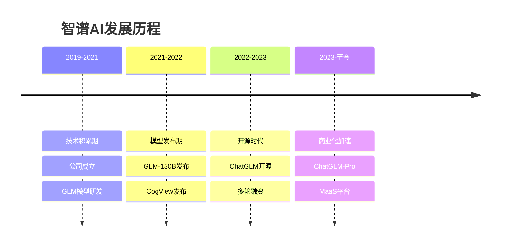

# 智谱AI：清华系开源大模型先锋

## 公司概况

### 基本信息

**公司名称**：北京智谱华章科技有限公司（Zhipu AI）
**股票代码**：未上市
**成立时间**：2019年
**总部位置**：中国北京
**创始人**：唐杰（清华大学教授）、张鹏（CEO）

**业务范围**：
- ChatGLM：开源大语言模型
- GLM-130B：千亿参数大模型
- CogView：文生图模型
- CodeGeeX：代码生成模型
- 企业服务：MaaS平台

**估值规模**（2023）：
- 约100-120亿人民币
- 中国大模型创业公司前三
- 开源大模型领导者

### 发展历程

**关键里程碑**：
- 2019年：智谱AI成立，清华团队创立
- 2021年：发布GLM-130B，中国首个千亿参数模型
- 2022年：发布CogView2，文生图模型
- 2023年：ChatGLM-6B开源，下载量百万+
- 2023年：完成多轮融资，估值超100亿
- 2023年：发布ChatGLM-Pro，商业化加速
- 2024年：GLM-4发布，性能大幅提升

## ChatGLM大模型分析

### 技术能力

**模型系列**：

| 模型 | 参数规模 | 发布时间 | 特点 | 开源 |
|------|---------|---------|------|------|
| GLM-130B | 1300亿 | 2022.8 | 首个中文千亿模型 | 是 |
| ChatGLM-6B | 62亿 | 2023.3 | 轻量级，可本地部署 | 是 |
| ChatGLM2-6B | 62亿 | 2023.6 | 性能提升，长文本 | 是 |
| ChatGLM3-6B | 62亿 | 2023.10 | 多模态，工具调用 | 是 |
| ChatGLM-Pro | 千亿级 | 2023.6 | 商业版，性能强 | 否 |
| GLM-4 | 千亿级 | 2024.1 | 最新版，全面提升 | 部分 |

**技术特点**：
- 双语能力：中英文双语
- 长文本：支持32K上下文
- 多模态：文本、图像理解
- 工具调用：API集成
- 可部署：支持本地部署

**性能表现**：

| 能力维度 | ChatGLM-Pro | GPT-4 | 文心 | 通义 |
|---------|-------------|-------|------|------|
| 中文理解 | 93 | 90 | 95 | 95 |
| 英文理解 | 88 | 98 | 85 | 90 |
| 代码生成 | 87 | 95 | 85 | 88 |
| 数学推理 | 84 | 92 | 82 | 85 |
| 知识问答 | 90 | 95 | 88 | 90 |

**技术优势**：
- 学术背景：清华大学
- 开源策略：生态建设
- 轻量化：6B模型可本地部署
- 中文优化：中文能力强

### 开源策略

**开源模型**：
- ChatGLM-6B：完全开源
- ChatGLM2-6B：完全开源
- ChatGLM3-6B：完全开源
- GLM-4-9B：开源
- 商业友好：允许商用

**开源价值**：
- 下载量：百万+
- GitHub Star：6万+
- 开发者：数万
- 生态：丰富

**开源vs闭源**：
- 开源：6B系列，吸引开发者
- 闭源：Pro系列，商业化
- 平衡：开源引流，闭源变现
- 策略：成功

### 垂直模型

**CodeGeeX**：
- 功能：代码生成、补全
- 语言：支持100+编程语言
- 开源：完全开源
- 应用：IDE插件、API服务

**CogView**：
- 功能：文生图、图生图
- 特点：中文理解强
- 开源：部分开源
- 应用：内容创作、设计

**CharacterGLM**：
- 功能：角色扮演、对话
- 特点：人设定制
- 应用：游戏、娱乐、教育

## 商业模式分析

### MaaS平台

**产品服务**：
- API服务：模型调用
- 私有化部署：企业专属
- 模型训练：定制化训练
- 应用开发：低代码平台

**定价策略**：
- 免费额度：吸引用户
- 按Token计费：0.005元/千token
- 企业套餐：定制服务
- 价格优势：低于竞品

**目标客户**：
- 互联网公司：内容、电商
- 传统企业：金融、制造
- 开发者：个人、小团队
- 科研机构：高校、研究所

### 行业解决方案

**金融行业**：
- 智能客服：自动问答
- 风控：风险评估
- 投研：报告生成
- 营销：文案生成

**教育行业**：
- 智能辅导：个性化辅导
- 作业批改：自动批改
- 内容生成：教学内容
- 知识问答：学习助手

**企业服务**：
- 智能办公：文档处理
- 知识管理：知识库
- 客服：智能客服
- 营销：内容营销

**政务服务**：
- 智能问答：政务咨询
- 文档处理：公文处理
- 舆情分析：舆情监测
- 决策支持：数据分析

### 收入模式

**API服务**：
- 按量付费：灵活计费
- 订阅制：包月包年
- 企业协议：大客户定制
- 预计占比：40%

**私有化部署**：
- 一次性费用：软件授权
- 年度服务费：技术支持
- 定制开发：额外收费
- 预计占比：40%

**其他收入**：
- 技术咨询：培训、咨询
- 数据标注：数据服务
- 生态合作：分成
- 预计占比：20%

## 财务分析

### 收入情况

**收入规模**（估计）：
- 2022年：数千万
- 2023年：2-3亿
- 2024E：5-8亿
- 2025E：15-20亿

**收入增长**：
- 2023年：10倍+增长
- 2024E：2-3倍增长
- 2025E：2-3倍增长
- 高速增长期

**收入质量**：
- 客户数量：数千家
- 续约率：80%+
- 客单价：提升中
- 回款：较好

### 盈利情况

**亏损情况**（估计）：
- 2022年：亏损数千万
- 2023年：亏损2-3亿
- 2024E：亏损3-5亿
- 2025E：亏损收窄或盈亏平衡

**亏损原因**：
- 研发投入：占收入100%+
- 算力成本：高
- 市场推广：投入大
- 规模效应：未体现

**盈利路径**：
- 收入规模：达到30亿+
- 毛利率：提升至70%+
- 费用率：降至60%以下
- 预计：2026年盈利

### 融资情况

**融资历程**：
- 2019年：天使轮，数千万
- 2021年：A轮，数亿元
- 2023年：B轮，数十亿元
- 2023年：C轮，估值超100亿

**投资方**：
- 清华系：清华控股、水木清华
- 产业资本：腾讯、阿里、美团
- 财务投资：红杉、高瓴、君联
- 政府基金：中关村、北京市

**现金储备**：
- 账上现金：约50亿
- 烧钱速度：年约5-8亿
- 现金够用：5-7年
- 融资能力：强

## 投资价值评估

### 估值分析

**当前估值（2023）**：
- 估值：100-120亿人民币
- PS：约40-50倍
- 估值：较高（未盈利）

**估值对比**：

| 公司 | 估值（亿元） | PS | 盈利状态 | 特点 |
|------|-------------|-----|---------|------|
| 智谱AI | 100-120 | 40-50 | 亏损 | 开源+学术 |
| 百川智能 | 100+ | - | 亏损 | 搜狗团队 |
| MiniMax | 100+ | - | 亏损 | AIGC |
| 月之暗面 | 150+ | - | 亏损 | 长文本 |

### 投资论点

**看多理由**：
1. **学术背景**：清华大学，技术强
2. **开源策略**：生态建设，用户多
3. **技术领先**：GLM-130B，中国首个
4. **商业化快**：MaaS平台，收入增长快
5. **融资能力强**：投资方豪华
6. **政策支持**：国产大模型，政策支持

**看空理由**：
1. **持续亏损**：盈利遥遥无期
2. **竞争激烈**：百度、阿里、腾讯、字节
3. **技术差距**：与GPT-4差距大
4. **商业化难**：开源模型难变现
5. **估值高**：PS 40-50倍
6. **规模小**：收入规模小

### 投资建议

**风险评级**：高风险

**适合投资者**：
- 机构投资者
- 高净值个人
- 看好AI大模型
- 长期投资视角（5-10年）

**投资策略**：
- 一级市场：参与融资（门槛高）
- 二级市场：等待IPO
- 持有周期：5-10年
- 目标估值：500-1000亿

**IPO展望**：
- 时间：2025-2027年
- 地点：科创板或港股
- 估值：300-500亿
- 建议：IPO后关注买入机会

## 竞争分析

### vs 百度文心

**优势**：
- 开源：生态建设
- 学术：技术积累
- 灵活：创业公司

**劣势**：
- 资源：百度资源多
- 数据：百度数据多
- 场景：百度场景多
- 商业化：百度更成熟

### vs 阿里通义

**优势**：
- 开源：生态建设
- 专注：聚焦大模型
- 灵活：决策快

**劣势**：
- 资源：阿里资源多
- 生态：阿里生态强
- 商业化：阿里更成熟

### vs 其他创业公司

**vs 百川智能**：
- 智谱：学术背景，开源
- 百川：搜狗团队，闭源
- 竞争：激烈

**vs MiniMax**：
- 智谱：通用大模型
- MiniMax：AIGC应用
- 定位：不同

**vs 月之暗面**：
- 智谱：开源生态
- 月之暗面：长文本
- 特色：各有千秋

## 开源生态建设

### 开发者社区

**规模**：
- GitHub Star：6万+
- 下载量：百万+
- 开发者：数万
- 活跃度：高

**贡献**：
- 代码贡献：数百人
- 问题反馈：活跃
- 文档完善：社区贡献
- 生态应用：数百个

**价值**：
- 品牌：知名度高
- 用户：潜在客户
- 反馈：优化模型
- 生态：应用丰富

### 应用生态

**开源应用**：
- LangChain-ChatGLM：知识库
- ChatGLM-WebUI：Web界面
- ChatGLM-API：API封装
- 数百个应用

**商业应用**：
- 智能客服：数十家
- 内容创作：数十家
- 教育辅导：数十家
- 企业服务：数十家

**生态价值**：
- 降低门槛：易用性
- 扩大影响：传播
- 商业转化：潜在客户
- 反馈优化：改进模型

### 开源vs商业平衡

**开源策略**：
- 6B模型：完全开源
- 吸引开发者：生态建设
- 品牌建设：知名度
- 潜在客户：转化

**商业策略**：
- Pro模型：闭源商业化
- API服务：按量付费
- 私有化部署：企业服务
- 行业方案：定制化

**平衡艺术**：
- 开源引流：获取用户
- 商业变现：收入增长
- 相互促进：正向循环
- 成功案例：Red Hat模式

## 技术优势分析

### 学术背景

**清华大学**：
- 唐杰教授：知识图谱专家
- 研究团队：顶尖AI科学家
- 学术积累：深厚
- 论文：顶会数十篇

**技术积累**：
- GLM架构：自研
- 预训练：经验丰富
- 优化技术：领先
- 工程能力：强

### 技术创新

**GLM架构**：
- 自回归空白填充：创新
- 双向注意力：性能提升
- 多任务学习：泛化能力
- 效率优化：训练快

**轻量化**：
- 6B模型：可本地部署
- 量化技术：INT4/INT8
- 推理优化：速度快
- 成本优化：成本低

**多模态**：
- 文本理解：强
- 图像理解：CogView
- 视频理解：研发中
- 融合能力：提升中

## 投资风险分析

### 1. 竞争风险

**巨头竞争**：
- 百度、阿里、腾讯、字节
- 资源：巨大优势
- 数据：海量数据
- 场景：丰富场景
- 威胁：巨大

**创业公司竞争**：
- 百川、MiniMax、月之暗面
- 同质化：严重
- 价格战：激烈
- 生存：困难

### 2. 技术风险

**技术差距**：
- 与GPT-4差距：1-2年
- 追赶困难：投入大
- 技术路线：不确定
- 成功率：低

**开源风险**：
- 技术泄露：开源
- 竞争对手：学习
- 商业化：困难
- 平衡：难

### 3. 商业化风险

**变现困难**：
- 开源模型：难变现
- 客户付费意愿：低
- 竞争激烈：价格战
- 盈利：困难

**客户粘性**：
- 迁移成本：低
- 客户忠诚度：低
- 竞争：激烈
- 流失：风险

### 4. 融资风险

**持续亏损**：
- 烧钱：快
- 盈利：遥远
- 融资：持续需要
- 压力：大

**估值泡沫**：
- 估值：高
- 业绩：不匹配
- 下轮融资：困难
- 风险：大

## 投资启示

### 1. 开源的价值

**生态建设**：
- 开源：吸引开发者
- 生态：应用丰富
- 品牌：知名度高
- 商业化：潜在客户

**商业模式**：
- Red Hat模式：开源+商业
- 平衡：开源引流，商业变现
- 成功案例：可借鉴

### 2. 学术的力量

**技术积累**：
- 学术背景：深厚
- 技术创新：领先
- 人才：顶尖
- 优势：明显

**商业化挑战**：
- 学术≠商业：不同
- 产品化：困难
- 市场化：挑战
- 需要：商业人才

### 3. 创业公司的机会

**差异化**：
- 开源：vs闭源
- 轻量化：vs大模型
- 垂直：vs通用
- 策略：重要

**挑战**：
- 资源：有限
- 竞争：激烈
- 生存：困难
- 需要：持续融资

## 常见问题

### Q1：智谱AI有投资价值吗？

**回答**：
- 技术：学术背景，技术强
- 开源：生态建设，用户多
- 商业化：快速增长
- 风险：竞争激烈，盈利遥远
- 建议：机构投资者可关注，个人投资者等IPO

### Q2：ChatGLM能赶上GPT-4吗？

**回答**：
- 短期（1-2年）：很难
- 中期（3-5年）：有可能缩小差距
- 长期：不确定
- 现实：GPT也在进步

### Q3：开源模型怎么赚钱？

**回答**：
- Red Hat模式：开源+商业
- 开源：6B模型，吸引用户
- 商业：Pro模型，API服务
- 平衡：开源引流，商业变现

### Q4：什么时候可以投资智谱AI？

**回答**：
- 一级市场：门槛高（机构）
- IPO：2025-2027年
- 估值：300-500亿
- 策略：IPO后关注买入机会

## 延伸阅读

### 推荐书籍

1. **《大模型时代》** - 唐杰
2. **《开源的成功之道》** - Karl Fogel
3. **《创新者的窘境》** - 克莱顿·克里斯坦森
4. **《从0到1》** - 彼得·蒂尔

### 研究报告

- 智谱AI融资材料
- 各大券商AI大模型报告
- 开源软件商业化研究
- 大模型创业公司分析

## 参考文献

1. 智谱AI. 《融资材料》. 2023
2. 唐杰. 《GLM-130B技术报告》. 2022
3. 清华大学. 《大模型研究报告》. 2023
4. 36氪. 《智谱AI深度报道》. 2023
5. 中金公司. 《AI大模型行业报告》. 2023
6. 红杉中国. 《大模型投资逻辑》. 2023
7. GitHub. 《ChatGLM数据》. 2023
8. 艾瑞咨询. 《中国大模型市场研究》. 2023
9. IDC. 《AI大模型市场预测》. 2023
10. Gartner. 《生成式AI技术成熟度曲线》. 2023

---

**投资建议**：
智谱AI是中国大模型领域的重要玩家，拥有清华大学学术背景和开源生态优势。ChatGLM开源模型下载量百万+，开发者社区活跃，商业化快速增长。但公司面临巨头竞争、持续亏损、技术差距等挑战。当前估值100-120亿人民币，PS 40-50倍，估值较高。建议机构投资者可关注一级市场投资机会，个人投资者等待IPO后（预计2025-2027年）再考虑投资，长期持有5-10年，目标估值500-1000亿。

**风险提示**：
智谱AI属于高风险投资标的，面临巨头竞争、技术差距、商业化困难、持续亏损等多重风险。投资者需要有高风险承受能力和长期投资视角（5-10年）。一级市场投资门槛高，流动性差。建议密切跟踪公司技术进展、商业化情况和融资进展。不适合风险厌恶型投资者和短期投资者。

---

[← 返回AI行业](./index.html)
