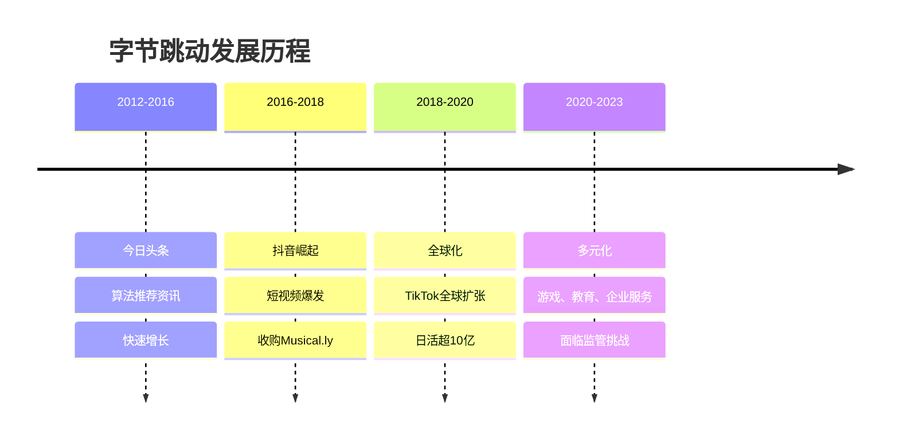
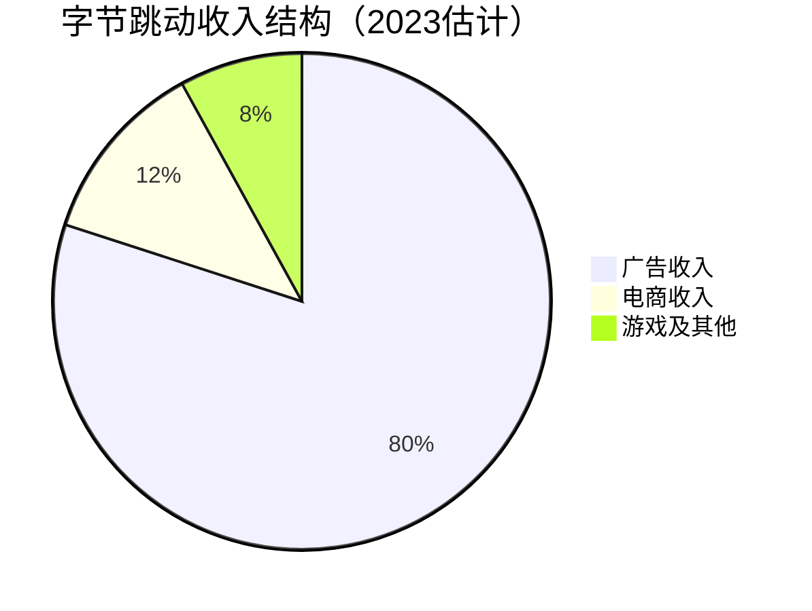
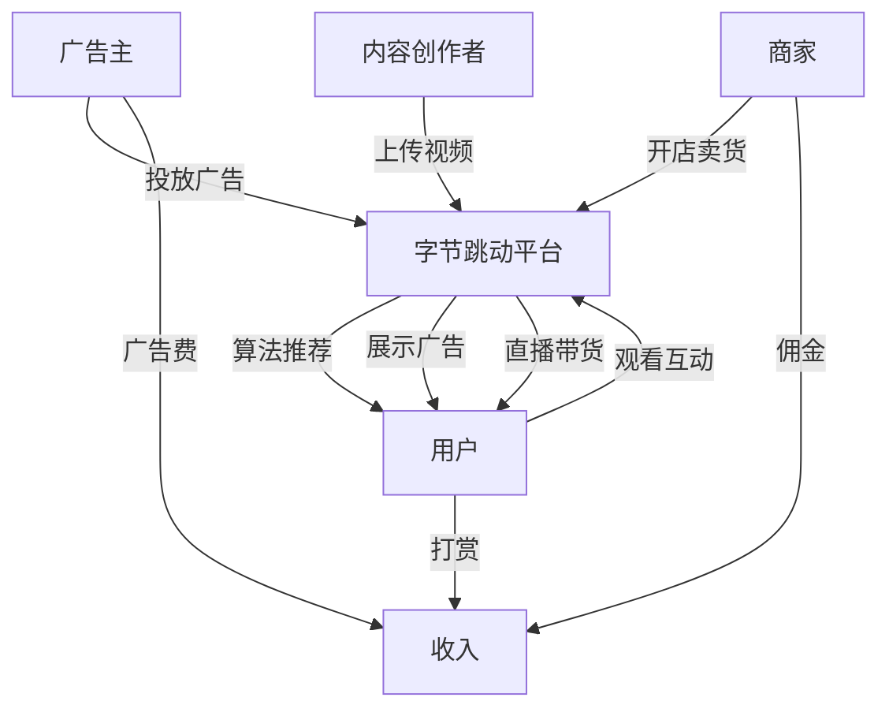
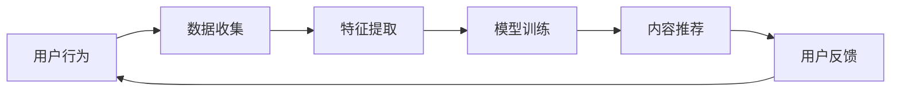

# 字节跳动：算法驱动的内容帝国

## 公司概况

### 基本信息

**公司名称**：字节跳动（ByteDance）
**成立时间**：2012年3月
**总部位置**：中国北京
**创始人**：张一鸣
**上市状态**：未上市（私有公司）

**业务范围**：
- 短视频：抖音（中国）、TikTok（海外）
- 资讯平台：今日头条
- 长视频：西瓜视频
- 教育：大力教育（已关闭）
- 游戏：朝夕光年
- 企业服务：飞书

**估值规模**（2023）：
- 最新估值：约2200-2500亿美元
- 全球最大未上市科技公司
- 估值超过多数上市互联网公司

### 发展历程

**关键里程碑**：
- 2012年：今日头条上线
- 2016年：抖音上线
- 2017年：收购Musical.ly，整合为TikTok
- 2018年：TikTok全球爆发
- 2020年：TikTok美国业务面临封禁威胁
- 2021年：教育业务关闭
- 2023年：全球月活用户超15亿

## 商业模式分析

### 核心业务结构

### 1. 短视频：核心增长引擎

**抖音（中国）**：
- 日活跃用户：7亿+
- 月活跃用户：9亿+
- 用户时长：日均90分钟+
- 市场份额：短视频第一

**TikTok（海外）**：
- 全球月活：超过15亿
- 覆盖150+国家
- 美国月活：1.5亿+
- 全球化最成功的中国APP

**商业模式**：

**收入来源**：
- 信息流广告：80%+
- 直播打赏：5-8%
- 电商佣金：8-10%
- 会员订阅：2-3%

### 2. 资讯平台：今日头条

**产品特点**：
- 算法推荐资讯
- 个性化内容
- 用户时长高

**用户规模**：
- 日活跃用户：2.5亿+
- 月活跃用户：3.5亿+
- 用户时长：日均60分钟

**商业模式**：
- 信息流广告
- 内容付费
- 电商导流

### 3. 其他业务

**西瓜视频**：
- 中长视频平台
- 与抖音协同
- 广告变现

**飞书**：
- 企业协作平台
- 对标钉钉、企业微信
- SaaS订阅模式

**游戏业务**：
- 朝夕光年工作室
- 自研+代理
- 与抖音协同

## 核心竞争优势

### 1. 算法推荐技术

**推荐系统**：

**算法优势**：
- 冷启动能力强：新用户快速找到兴趣内容
- 推荐精准度高：点击率、完播率行业领先
- 持续优化：A/B测试、机器学习
- 数据优势：海量用户行为数据

**技术壁垒**：
- 算法团队：顶尖AI人才
- 数据积累：数十亿用户数据
- 计算能力：大规模GPU集群
- 持续迭代：快速优化

### 2. 内容生态

**创作者生态**：
- 创作者数量：数千万
- 创作者激励：流量分成、广告分成
- 创作工具：剪映等
- MCN机构：专业内容生产

**内容丰富度**：
- 品类齐全：娱乐、教育、生活、科技
- 长尾内容：满足小众需求
- UGC+PGC：用户生成+专业生成
- 内容质量：持续提升

### 3. 全球化能力

**TikTok成功要素**：
- 产品本地化：适应不同市场
- 内容本地化：本地创作者
- 运营本地化：本地团队
- 技术全球化：统一技术平台

**全球化挑战**：
- 地缘政治：美国封禁威胁
- 数据安全：本地化存储要求
- 内容审核：不同国家标准
- 竞争加剧：Instagram Reels、YouTube Shorts

### 4. 产品创新能力

**快速迭代**：
- 小步快跑
- A/B测试
- 数据驱动
- 用户反馈

**产品矩阵**：
- 抖音：短视频
- 今日头条：资讯
- 西瓜视频：中长视频
- 飞书：企业服务
- 多产品协同

## 财务分析（估计）

### 收入分析

**收入规模**：
- 2020年：约2400亿人民币
- 2021年：约3800亿人民币
- 2022年：约5500亿人民币
- 2023E：约7000亿人民币
- CAGR：40%+

**收入结构**：
- 中国市场：60-65%
- 海外市场：35-40%
- 广告收入：80%+
- 电商收入：快速增长

### 盈利能力

**利润率**：
- 毛利率：60-65%
- 经营利润率：20-25%
- 净利率：15-20%

**盈利规模**：
- 2022年净利润：约800-1000亿人民币
- 2023E净利润：约1200-1500亿人民币

### 现金流

**经营现金流**：
- 年经营现金流：1000亿+人民币
- 现金流质量：优秀
- 资本支出：主要是服务器、研发

**现金储备**：
- 现金及等价物：数千亿人民币
- 财务健康：非常稳健

## 投资价值评估

### 估值分析

**对标估值**：

| 公司 | 市值/估值 | 收入 | PE | PS |
|------|----------|------|----|----|
| 字节跳动 | 2200-2500亿美元 | 1000亿美元 | 15-18 | 2.2-2.5 |
| Meta | 8000亿美元 | 1200亿美元 | 25 | 6.7 |
| 腾讯 | 4500亿美元 | 800亿美元 | 15 | 5.6 |
| 快手 | 400亿美元 | 150亿美元 | 负 | 2.7 |

**估值合理性**：
- PE 15-18倍：合理
- PS 2.2-2.5倍：偏低
- 考虑增长：估值有吸引力

### 投资论点

**看多理由**：
1. **算法优势**：推荐技术全球领先
2. **全球化成功**：TikTok全球月活15亿+
3. **高增长**：收入增速40%+
4. **高盈利**：净利率15-20%
5. **现金流强**：年经营现金流1000亿+
6. **估值合理**：PE 15-18倍

**看空理由**：
1. **地缘政治风险**：TikTok美国业务不确定
2. **监管风险**：中国互联网监管
3. **竞争加剧**：Instagram、YouTube竞争
4. **增长放缓**：用户增长见顶
5. **未上市**：流动性差

### IPO展望

**上市时间**：
- 市场预期：2024-2025年
- 上市地点：香港或美国
- 估值预期：3000-4000亿美元

**上市障碍**：
- 地缘政治：TikTok美国业务
- 监管审批：中国监管
- 市场环境：全球资本市场

## 投资启示

### 1. 算法的力量

**推荐算法价值**：
- 提升用户体验
- 增加用户时长
- 提高变现效率
- 构建技术壁垒

### 2. 全球化的重要性

**TikTok全球化**：
- 产品全球化
- 内容本地化
- 运营本地化
- 技术统一化

### 3. 内容生态的价值

**创作者生态**：
- 内容供给
- 平台价值
- 网络效应
- 持续增长

### 4. 快速迭代的能力

**产品迭代**：
- 小步快跑
- 数据驱动
- 快速试错
- 持续优化

## 常见问题

### Q1：字节跳动会上市吗？

**回答**：
- 市场预期：2024-2025年
- 上市地点：香港或美国
- 障碍：地缘政治、监管
- 估值：3000-4000亿美元

### Q2：TikTok会被封禁吗？

**回答**：
- 风险存在：美国政治压力
- 应对措施：数据本地化、独立运营
- 可能性：短期风险可控
- 长期：不确定性高

### Q3：字节跳动 vs 腾讯？

**回答**：
- 字节优势：算法、全球化、增长
- 腾讯优势：社交、游戏、投资
- 估值：字节PE更低
- 建议：两者都有价值

### Q4：如何投资字节跳动？

**回答**：
- 一级市场：私募股权（门槛高）
- 等待IPO：上市后买入
- 间接投资：投资字节投资的公司
- 对标投资：投资快手、B站等

## 延伸阅读

### 推荐书籍

1. **《字节跳动》** - 张一鸣传记
2. **《算法霸权》** - 凯西·奥尼尔
3. **《注意力商人》** - 吴修铭
4. **《平台革命》** - 杰奥夫雷·帕克

### 研究报告

- 各大券商字节跳动深度报告
- 艾瑞咨询短视频行业报告
- QuestMobile内容平台报告

## 参考文献

1. 艾瑞咨询. 《中国短视频行业报告》. 2023
2. QuestMobile. 《移动互联网内容平台报告》. 2023
3. 中金公司. 《字节跳动深度报告》. 2023
4. 招商证券. 《字节跳动投资价值分析》. 2023
5. 高盛. 《ByteDance: Algorithm King》. 2023
6. 摩根士丹利. 《ByteDance Deep Dive》. 2023
7. 奥尼尔. 《算法霸权》. 2016
8. 吴修铭. 《注意力商人》. 2016
9. 帕克等. 《平台革命》. 2016
10. Sensor Tower. 《TikTok全球数据报告》. 2023

---

**投资建议**：
字节跳动是全球最成功的内容平台之一，算法推荐技术全球领先，TikTok全球化成功，收入高速增长，盈利能力强。当前估值PE 15-18倍，相对合理。建议关注其IPO进展，上市后可考虑配置。

**风险提示**：
需要关注地缘政治风险（TikTok美国业务）、监管风险（中国互联网监管）、竞争加剧（Instagram、YouTube）等风险。未上市前流动性差，投资需谨慎。

## 深度分析

### 核心机制解析

理解本主题需要从多个维度进行系统性分析。以下从理论基础、实践应用和历史验证三个层面展开深度探讨。

**理论基础层面**：本主题的核心逻辑建立在经济学和金融学的基本原理之上。通过对基础理论的深入理解，投资者能够建立起稳固的分析框架，避免被市场短期噪音所干扰。

**实践应用层面**：理论必须与实践相结合才能产生价值。在实际投资决策中，需要将抽象的概念转化为具体的分析工具和决策标准。

**历史验证层面**：金融市场有着丰富的历史记录，通过研究历史案例，我们可以验证理论的有效性，并从中提炼出具有普遍意义的规律。

### 关键影响因素

影响本主题的关键因素可以从以下几个维度进行分析：

1. **宏观经济环境**：利率水平、通货膨胀率、经济增长速度等宏观变量对本主题有着深远影响。在不同的宏观经济周期中，相关指标的表现会呈现出显著差异。

2. **市场结构因素**：市场参与者的构成、信息传播机制、流动性状况等市场结构因素决定了价格发现的效率和准确性。

3. **政策监管环境**：政府政策、监管框架的变化会直接影响相关市场的运作规则和参与者行为。

4. **技术创新驱动**：技术进步不断改变着金融市场的运作方式，从算法交易到区块链技术，每一次技术革新都带来新的机遇和挑战。

5. **全球化与地缘政治**：在全球化背景下，各国市场之间的联动性日益增强，地缘政治风险的影响也越来越不可忽视。

### 量化分析框架

为了更精确地分析和评估，可以采用以下量化框架：

| 分析维度 | 关键指标 | 参考基准 | 分析方法 |
|---------|---------|---------|---------|
| 规模评估 | 绝对值与相对值 | 历史均值 | 趋势分析 |
| 质量评估 | 稳定性指标 | 行业对标 | 横向比较 |
| 风险评估 | 波动率指标 | 风险阈值 | 情景分析 |
| 价值评估 | 估值倍数 | 历史区间 | 回归分析 |

通过系统性地应用上述框架，投资者可以对目标进行全面、客观的评估，从而做出更加理性的投资决策。

## 高级分析与前沿研究

### 学术研究进展

近年来，学术界对本领域的研究取得了重要进展。以下是几个值得关注的研究方向：

**行为金融学视角**：传统金融理论假设市场参与者是完全理性的，但行为金融学的研究表明，认知偏差和情绪因素在投资决策中扮演着重要角色。诺贝尔经济学奖得主丹尼尔·卡尼曼（Daniel Kahneman）和理查德·塞勒（Richard Thaler）的研究为我们理解市场非理性行为提供了重要框架。

**因子投资研究**：尤金·法玛（Eugene Fama）和肯尼斯·弗伦奇（Kenneth French）的三因子模型，以及后续发展的五因子模型，为系统性地解释股票收益差异提供了理论基础。这些研究表明，市值、账面市值比、盈利能力和投资模式等因子能够解释大部分股票收益的横截面差异。

**市场微观结构研究**：对市场流动性、价格发现机制和交易成本的深入研究，帮助我们更好地理解市场的运作机制，并为优化交易策略提供指导。

### 实战案例深度解析

**案例一：长期价值创造的典范**

以沃伦·巴菲特（Warren Buffett）的伯克希尔·哈撒韦（Berkshire Hathaway）为例，其长达数十年的卓越投资业绩证明了价值投资理念的有效性。从1965年至今，伯克希尔的账面价值年均增长率约为19.8%，远超同期标普500指数的约10.2%年均回报。

巴菲特的成功秘诀在于：
- 专注于具有持久竞争优势的优质企业
- 以合理价格买入，而非追求最低价格
- 长期持有，让复利效应充分发挥
- 保持充足的安全边际，控制下行风险

**案例二：危机中的机遇识别**

2008年金融危机期间，大多数投资者恐慌性抛售，但少数具有前瞻性的投资者却在危机中发现了历史性的投资机会。约翰·保尔森（John Paulson）通过做空次级抵押贷款相关证券，在危机中获得了约150亿美元的利润，成为金融史上最成功的单笔交易之一。

这个案例告诉我们：
- 深入的基本面研究能够发现市场定价错误
- 逆向思维往往能够发现被市场忽视的机会
- 风险管理和仓位控制是成功的关键

### 跨市场比较分析

不同市场在结构、监管、投资者构成等方面存在显著差异，这些差异对投资策略的选择有重要影响：

**美国市场特征**：
- 机构投资者主导，市场效率较高
- 信息披露制度完善，分析师覆盖广泛
- 衍生品市场发达，对冲工具丰富
- 长期牛市历史，但也经历过多次重大调整

**中国市场特征**：
- 散户投资者比例较高，市场波动性较大
- 政策因素影响显著，需要密切关注监管动向
- 新兴行业发展迅速，成长投资机会丰富
- A股、港股、美股中概股形成多层次市场体系

**欧洲市场特征**：
- 价值股比例较高，估值相对保守
- 受地缘政治和欧元区政策影响较大
- 部分行业（如奢侈品、工业）具有全球竞争优势
- ESG投资理念推广较为领先

