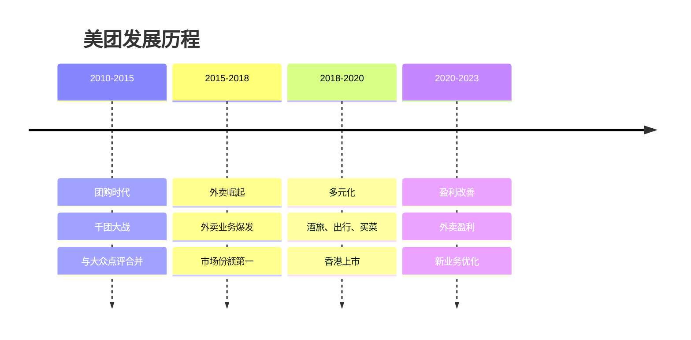
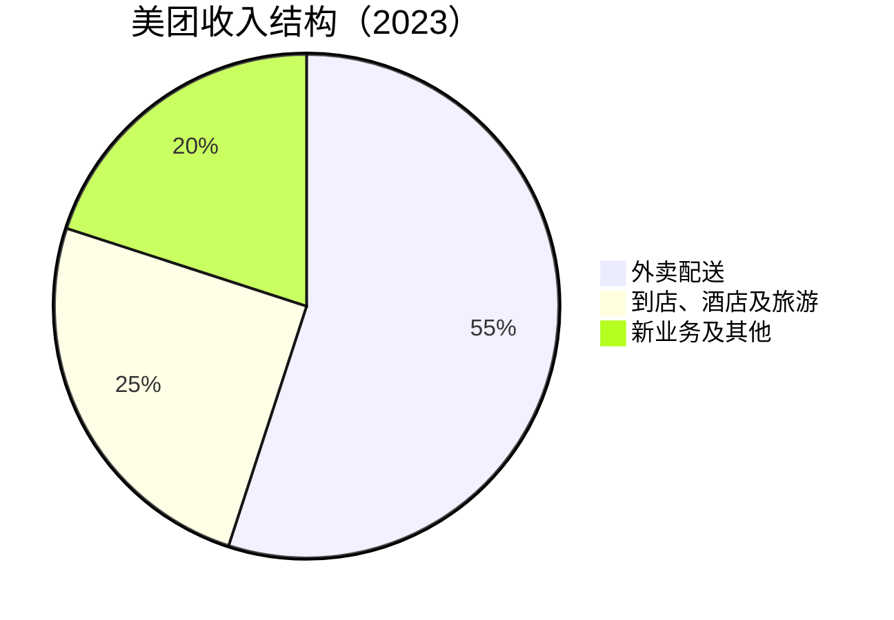
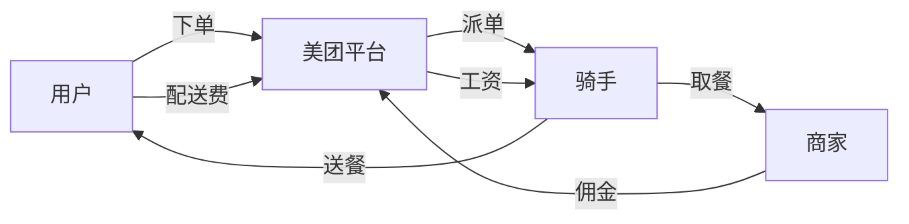
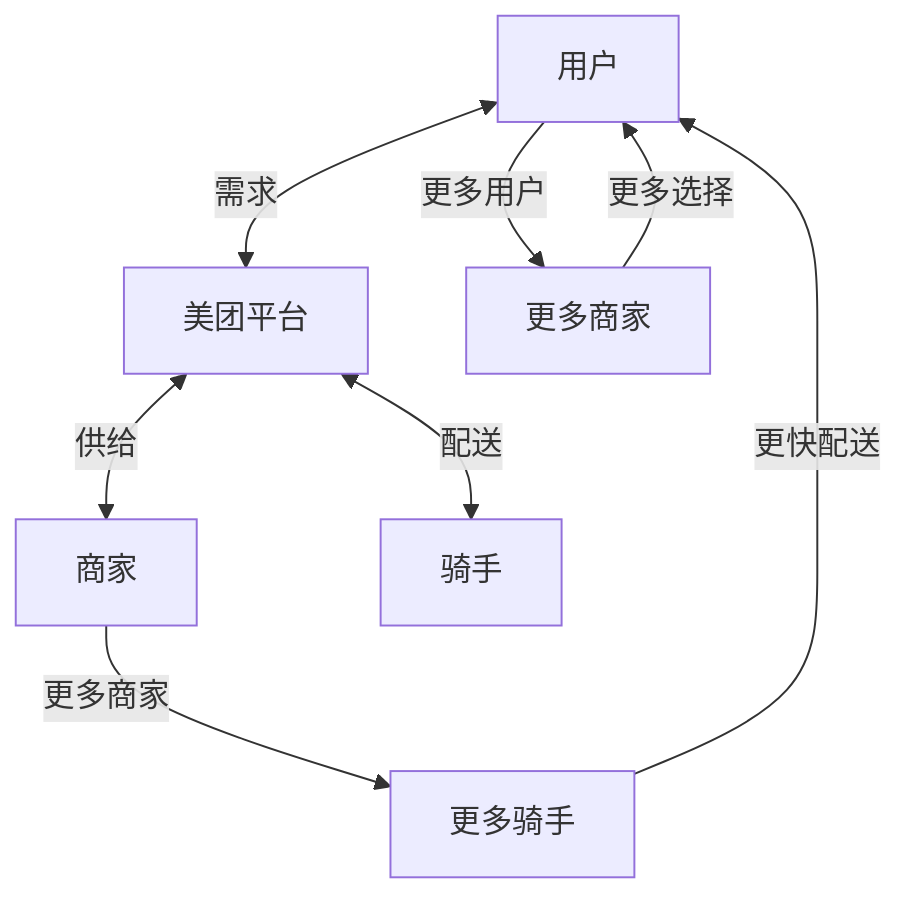

# 美团：本地生活服务龙头

## 公司概况

### 基本信息

**公司名称**：美团（Meituan）
**股票代码**：03690.HK（港股）
**成立时间**：2010年3月
**总部位置**：中国北京
**创始人**：王兴

**业务范围**：
- 外卖配送：美团外卖
- 到店服务：餐饮、酒店、休闲娱乐
- 出行服务：美团打车、共享单车
- 新业务：美团优选、美团买菜、民宿

**市值规模**（2023）：
- 约1.2万亿港元（1500亿美元）
- 中国第三大互联网公司
- 本地生活服务绝对龙头

### 发展历程

**关键里程碑**：
- 2010年：美团网成立，团购模式
- 2015年：与大众点评合并
- 2018年：香港上市，发行价69港元
- 2020年：外卖业务实现盈利
- 2021年：反垄断罚款34亿，股价大跌
- 2023年：业绩改善，股价回升

## 商业模式分析

### 核心业务结构

### 1. 外卖配送：核心现金牛

**市场地位**：
- 市场份额：67%（美团）vs 27%（饿了么）
- 日均订单：超过5000万单
- 活跃商家：超过900万
- 活跃用户：超过6.8亿

**商业模式**：

**收入来源**：
- 商家佣金：订单金额的15-20%
- 配送费：用户支付3-8元
- 广告收入：商家推广
- 会员收入：美团外卖会员

**成本结构**：
- 骑手成本：60-65%
- 补贴成本：5-10%
- 技术研发：5-8%
- 营销费用：8-12%

**盈利能力**：
- 经营利润率：5-8%
- 单均利润：0.5-1元
- 规模效应：订单量越大，利润率越高

### 2. 到店、酒店及旅游：高利润业务

**到店业务**：
- 餐饮：团购、预订、排队
- 休闲娱乐：电影、KTV、美容
- 生活服务：家政、维修、教育

**酒店旅游**：
- 酒店预订：覆盖全国
- 民宿预订：美团民宿
- 景点门票：在线预订
- 旅游度假：跟团游、自由行

**商业模式**：
- 佣金模式：商家支付佣金
- 广告模式：商家推广
- 会员模式：黑珍珠会员

**盈利能力**：
- 经营利润率：40-45%
- 轻资产模式
- 现金流优秀

### 3. 新业务：未来增长点

**美团优选**：
- 社区团购模式
- 次日达配送
- 下沉市场渗透

**美团买菜**：
- 前置仓模式
- 30分钟达
- 生鲜电商

**美团闪购**：
- 即时零售
- 万物到家
- 30-60分钟达

**其他业务**：
- 美团打车：网约车
- 共享单车：摩拜单车
- 充电宝：小电科技

**盈利情况**：
- 目前亏损
- 优化中
- 长期看好

## 竞争优势分析

### 1. 本地网络效应

**三边网络**：

**网络密度**：
- 商家密度：每平方公里商家数
- 骑手密度：每平方公里骑手数
- 订单密度：每平方公里订单数
- 密度越高，效率越高，成本越低

### 2. 规模优势

**订单规模**：
- 日均5000万单
- 年订单量180亿+
- 全球最大外卖平台

**规模效应**：
- 技术研发分摊
- 营销费用分摊
- 议价能力增强
- 数据优势累积

### 3. 技术能力

**配送调度系统**：
- AI智能调度
- 实时路径优化
- 预测配送时间
- 配送效率全球领先

**推荐算法**：
- 个性化推荐
- 提升转化率
- 增加客单价

**数据能力**：
- 用户行为数据
- 商家经营数据
- 骑手配送数据
- 数据驱动决策

### 4. 品牌优势

**用户心智**：
- "美团外卖，送啥都快"
- 品牌认知度高
- 用户习惯养成

**商家信任**：
- 平台公信力
- 流量保证
- 技术支持

## 财务分析

### 收入分析

**收入增长**：
- 2018年：652亿
- 2020年：1148亿
- 2022年：2199亿
- 2023E：2500亿+
- CAGR：30%+

**收入结构变化**：
- 外卖占比下降：从70%到55%
- 到店占比稳定：25%左右
- 新业务占比上升：从5%到20%

### 盈利能力

**利润率改善**：
- 2018年：亏损1155亿
- 2020年：亏损22亿
- 2022年：盈利91亿
- 2023E：盈利200亿+

**分业务利润率**：
- 外卖：5-8%
- 到店：40-45%
- 新业务：亏损中

**ROE**：
- 2022年：5%
- 2023E：10%+
- 目标：15%+

### 现金流

**经营现金流**：
- 2022年：300亿+
- 2023E：400亿+
- 现金流转正

**自由现金流**：
- 2022年：200亿+
- 资本支出：主要是技术研发
- 现金流健康

### 财务健康度

**资产负债表**：
- 现金及等价物：600亿+
- 资产负债率：40%
- 流动比率：1.5

**偿债能力**：
- 无有息负债
- 财务风险低

## 投资价值评估

### 估值分析

**历史估值区间**：
- PE：30-80倍
- PS：2-6倍
- 估值波动大

**当前估值（2023）**：
- PE：约40倍
- PS：约5倍
- 处于合理区间

**估值对比**：

| 公司 | PE | PS | 市值（亿美元） |
|------|----|----|---------------|
| 美团 | 40 | 5 | 1500 |
| DoorDash | 负 | 3 | 500 |
| Uber Eats | 负 | 2 | 1000 |

### 投资论点

**看多理由**：
1. **本地生活龙头**：市场份额67%
2. **盈利能力改善**：从亏损到盈利
3. **增长空间大**：渗透率仍有提升
4. **技术领先**：配送效率全球第一
5. **现金流转正**：经营现金流300亿+
6. **新业务潜力**：即时零售、社区团购

**看空理由**：
1. **竞争加剧**：抖音、快手进军外卖
2. **监管风险**：反垄断、骑手权益
3. **增长放缓**：外卖订单增速下降
4. **新业务亏损**：优选、买菜仍亏损
5. **估值不低**：PE 40倍

### 投资建议

**适合投资者**：
- 看好本地生活服务的投资者
- 能承受波动的成长型投资者
- 中长期投资者

**投资策略**：
- 建仓区间：120-150港元
- 持有周期：2-3年
- 目标价：200港元+
- 止损位：100港元

**风险控制**：
- 仓位：不超过15%
- 关注：监管政策、竞争态势
- 调整：根据业绩动态调整

## 投资启示

### 1. 本地网络效应的价值

**密度经济**：
- 订单密度越高，成本越低
- 规模优势明显
- 后来者难以追赶

### 2. 从亏损到盈利的转变

**规模效应显现**：
- 订单量达到临界点
- 固定成本分摊
- 盈利能力改善

### 3. 多元化的必要性

**业务多元化**：
- 外卖+到店+新业务
- 降低单一业务风险
- 协同效应

### 4. 技术驱动效率

**技术投入**：
- AI调度系统
- 配送效率提升
- 成本持续下降

## 常见问题

### Q1：美团还能增长吗？

**回答**：
- 外卖：渗透率仍有提升空间
- 到店：高利润，稳定增长
- 新业务：即时零售、社区团购
- 预计未来3年收入增速20%+

### Q2：竞争风险有多大？

**回答**：
- 抖音、快手进军外卖
- 但美团网络效应强
- 短期影响有限
- 长期需要关注

### Q3：什么时候买入美团？

**回答**：
- 估值：PE < 35倍
- 股价：120-150港元
- 时机：市场恐慌、业绩超预期
- 策略：分批建仓

## 延伸阅读

### 推荐书籍

1. **《美团机器》** - 李志刚
2. **《九败一胜》** - 李志刚（王兴创业史）
3. **《平台革命》** - 杰奥夫雷·帕克

### 研究报告

- 美团年报和季报
- 各大券商美团深度报告
- 艾瑞咨询本地生活服务报告

## 参考文献

1. 美团. 《年度报告》. 2018-2023
2. 李志刚. 《美团机器》. 2020
3. 李志刚. 《九败一胜》. 2015
4. 中金公司. 《美团深度报告》. 2023
5. 招商证券. 《美团投资价值分析》. 2023
6. 高盛. 《Meituan: Local Services Leader》. 2023
7. 摩根士丹利. 《Meituan Deep Dive》. 2023
8. 艾瑞咨询. 《中国本地生活服务报告》. 2023
9. QuestMobile. 《本地生活服务行业报告》. 2023
10. 帕克等. 《平台革命》. 2016

---

**投资建议**：
美团是中国本地生活服务的绝对龙头，市场份额67%，盈利能力持续改善。当前估值PE 40倍，处于合理区间。建议看好本地生活服务的投资者在120-150港元区间分批建仓，持有2-3年，目标价200港元+。

**风险提示**：
需要关注竞争加剧（抖音、快手）、监管政策（反垄断、骑手权益）、新业务亏损等风险。建议仓位控制在15%以内，设置止损位100港元。

## 深度分析

### 核心机制解析

理解本主题需要从多个维度进行系统性分析。以下从理论基础、实践应用和历史验证三个层面展开深度探讨。

**理论基础层面**：本主题的核心逻辑建立在经济学和金融学的基本原理之上。通过对基础理论的深入理解，投资者能够建立起稳固的分析框架，避免被市场短期噪音所干扰。

**实践应用层面**：理论必须与实践相结合才能产生价值。在实际投资决策中，需要将抽象的概念转化为具体的分析工具和决策标准。

**历史验证层面**：金融市场有着丰富的历史记录，通过研究历史案例，我们可以验证理论的有效性，并从中提炼出具有普遍意义的规律。

### 关键影响因素

影响本主题的关键因素可以从以下几个维度进行分析：

1. **宏观经济环境**：利率水平、通货膨胀率、经济增长速度等宏观变量对本主题有着深远影响。在不同的宏观经济周期中，相关指标的表现会呈现出显著差异。

2. **市场结构因素**：市场参与者的构成、信息传播机制、流动性状况等市场结构因素决定了价格发现的效率和准确性。

3. **政策监管环境**：政府政策、监管框架的变化会直接影响相关市场的运作规则和参与者行为。

4. **技术创新驱动**：技术进步不断改变着金融市场的运作方式，从算法交易到区块链技术，每一次技术革新都带来新的机遇和挑战。

5. **全球化与地缘政治**：在全球化背景下，各国市场之间的联动性日益增强，地缘政治风险的影响也越来越不可忽视。

### 量化分析框架

为了更精确地分析和评估，可以采用以下量化框架：

| 分析维度 | 关键指标 | 参考基准 | 分析方法 |
|---------|---------|---------|---------|
| 规模评估 | 绝对值与相对值 | 历史均值 | 趋势分析 |
| 质量评估 | 稳定性指标 | 行业对标 | 横向比较 |
| 风险评估 | 波动率指标 | 风险阈值 | 情景分析 |
| 价值评估 | 估值倍数 | 历史区间 | 回归分析 |

通过系统性地应用上述框架，投资者可以对目标进行全面、客观的评估，从而做出更加理性的投资决策。

## 高级分析与前沿研究

### 学术研究进展

近年来，学术界对本领域的研究取得了重要进展。以下是几个值得关注的研究方向：

**行为金融学视角**：传统金融理论假设市场参与者是完全理性的，但行为金融学的研究表明，认知偏差和情绪因素在投资决策中扮演着重要角色。诺贝尔经济学奖得主丹尼尔·卡尼曼（Daniel Kahneman）和理查德·塞勒（Richard Thaler）的研究为我们理解市场非理性行为提供了重要框架。

**因子投资研究**：尤金·法玛（Eugene Fama）和肯尼斯·弗伦奇（Kenneth French）的三因子模型，以及后续发展的五因子模型，为系统性地解释股票收益差异提供了理论基础。这些研究表明，市值、账面市值比、盈利能力和投资模式等因子能够解释大部分股票收益的横截面差异。

**市场微观结构研究**：对市场流动性、价格发现机制和交易成本的深入研究，帮助我们更好地理解市场的运作机制，并为优化交易策略提供指导。

### 实战案例深度解析

**案例一：长期价值创造的典范**

以沃伦·巴菲特（Warren Buffett）的伯克希尔·哈撒韦（Berkshire Hathaway）为例，其长达数十年的卓越投资业绩证明了价值投资理念的有效性。从1965年至今，伯克希尔的账面价值年均增长率约为19.8%，远超同期标普500指数的约10.2%年均回报。

巴菲特的成功秘诀在于：
- 专注于具有持久竞争优势的优质企业
- 以合理价格买入，而非追求最低价格
- 长期持有，让复利效应充分发挥
- 保持充足的安全边际，控制下行风险

**案例二：危机中的机遇识别**

2008年金融危机期间，大多数投资者恐慌性抛售，但少数具有前瞻性的投资者却在危机中发现了历史性的投资机会。约翰·保尔森（John Paulson）通过做空次级抵押贷款相关证券，在危机中获得了约150亿美元的利润，成为金融史上最成功的单笔交易之一。

这个案例告诉我们：
- 深入的基本面研究能够发现市场定价错误
- 逆向思维往往能够发现被市场忽视的机会
- 风险管理和仓位控制是成功的关键

### 跨市场比较分析

不同市场在结构、监管、投资者构成等方面存在显著差异，这些差异对投资策略的选择有重要影响：

**美国市场特征**：
- 机构投资者主导，市场效率较高
- 信息披露制度完善，分析师覆盖广泛
- 衍生品市场发达，对冲工具丰富
- 长期牛市历史，但也经历过多次重大调整

**中国市场特征**：
- 散户投资者比例较高，市场波动性较大
- 政策因素影响显著，需要密切关注监管动向
- 新兴行业发展迅速，成长投资机会丰富
- A股、港股、美股中概股形成多层次市场体系

**欧洲市场特征**：
- 价值股比例较高，估值相对保守
- 受地缘政治和欧元区政策影响较大
- 部分行业（如奢侈品、工业）具有全球竞争优势
- ESG投资理念推广较为领先

