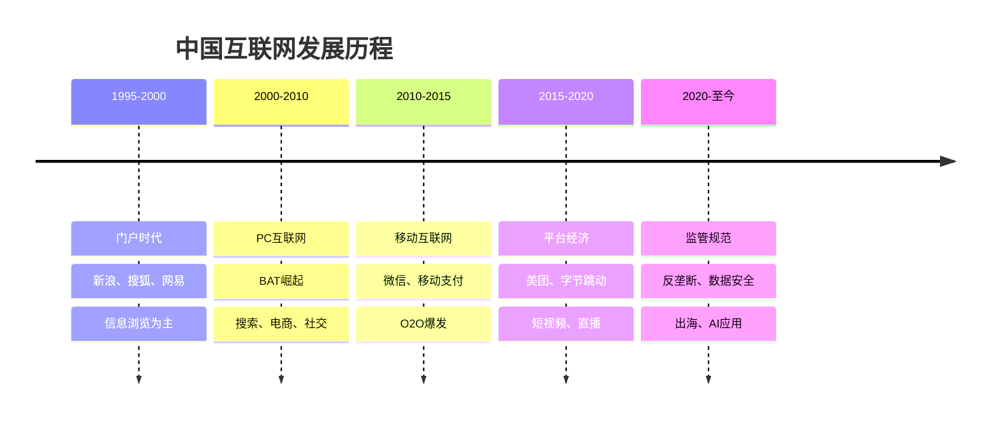
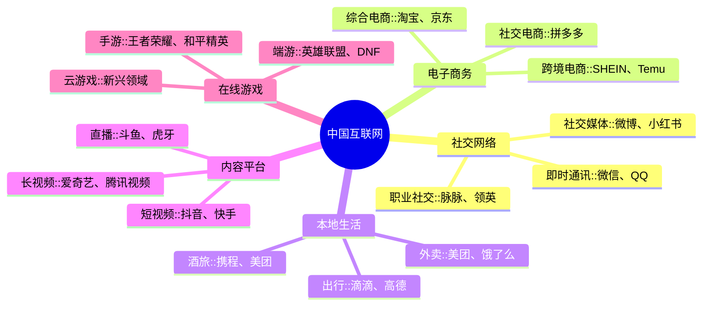
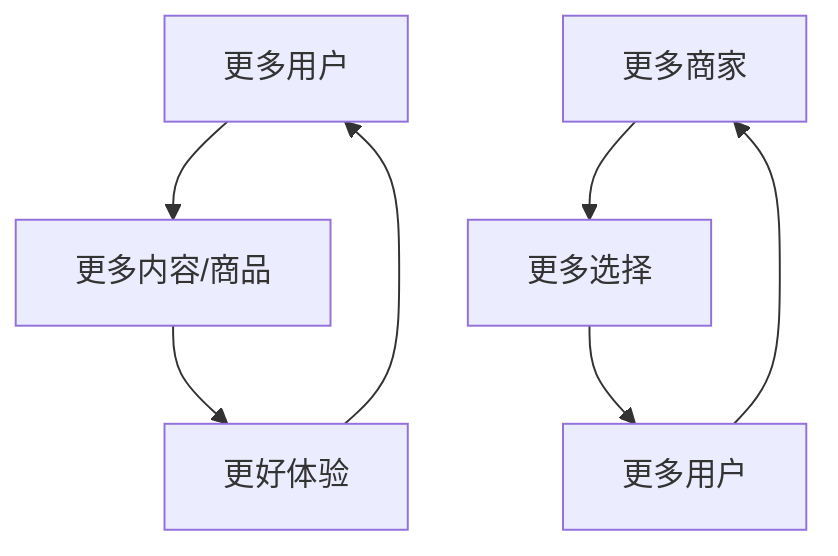

# 中国互联网行业概览

## 概述

中国互联网行业经过20多年的发展，已成为全球最具活力和创新力的市场之一。从PC互联网到移动互联网，从模仿创新到原创创新，中国互联网企业创造了独特的商业模式和生态系统。

**学习目标**：
- 理解中国互联网行业的发展历程和特点
- 掌握主要互联网商业模式和盈利逻辑
- 分析互联网巨头的竞争格局和护城河
- 识别互联网投资的机会和风险
- 建立互联网企业的分析框架

**为什么重要**：
中国互联网用户规模超过10亿，移动支付、电商、短视频等应用全球领先。腾讯、阿里巴巴、字节跳动等企业市值数千亿美元，是中国经济数字化转型的核心力量，也是投资者不可忽视的重要标的。

## 行业发展历程

### 发展阶段

**第一阶段：门户时代（1995-2000）**：
- 新浪、搜狐、网易三大门户
- 内容为王，广告变现
- 模仿美国模式

**第二阶段：PC互联网（2000-2010）**：
- BAT（百度、阿里、腾讯）崛立
- 搜索、电商、社交三大领域
- 本土化创新开始

**第三阶段：移动互联网（2010-2015）**：
- 智能手机普及
- 微信成为超级APP
- O2O（线上到线下）爆发
- 移动支付领先全球

**第四阶段：平台经济（2015-2020）**：
- 美团、字节跳动崛起
- 短视频、直播兴起
- 下沉市场开发（拼多多）
- 平台生态成熟

**第五阶段：监管规范（2020-至今）**：
- 反垄断监管加强
- 数据安全立法
- 企业出海加速
- AI应用落地

### 全球地位

**领先优势**：
- 用户规模：10.7亿网民（2023）
- 移动支付：渗透率全球第一
- 电商规模：占全球50%以上
- 短视频：TikTok全球化成功
- 本地生活：O2O模式全球领先

**创新模式**：
- 超级APP：微信集成多种服务
- 社交电商：拼多多、小红书
- 直播电商：淘宝直播、抖音电商
- 即时零售：美团、饿了么
- 短视频：抖音、快手

## 行业细分结构

### 核心领域

### 1. 社交网络

**市场格局**：
- 即时通讯：腾讯垄断（微信+QQ）
- 社交媒体：微博、小红书、B站
- 职业社交：脉脉、领英中国

**商业模式**：
- 广告变现：信息流广告
- 增值服务：会员、虚拟商品
- 游戏联运：导流分成
- 支付服务：微信支付

**投资逻辑**：
- 用户规模和活跃度
- 社交关系链深度
- 变现能力提升
- 生态系统完整性

### 2. 电子商务

**市场格局**：
- 综合电商：阿里（淘宝+天猫）、京东
- 社交电商：拼多多
- 垂直电商：唯品会、得物

**商业模式**：
- 平台佣金：GMV × Take Rate
- 广告收入：商家推广
- 物流服务：京东物流
- 金融服务：蚂蚁金服

**投资逻辑**：
- GMV增长和市场份额
- Take Rate和盈利能力
- 用户留存和复购率
- 物流和供应链效率

### 3. 本地生活

**市场格局**：
- 外卖：美团、饿了么双寡头
- 出行：滴滴主导
- 酒旅：携程、美团竞争

**商业模式**：
- 佣金收入：订单 × 佣金率
- 广告收入：商家推广
- 会员收入：美团月卡
- 金融服务：消费信贷

**投资逻辑**：
- 订单量和客单价
- 用户渗透率提升
- 跨品类协同效应
- 盈利能力改善

### 4. 内容平台

**市场格局**：
- 短视频：抖音、快手双雄
- 长视频：爱奇艺、腾讯视频、优酷
- 直播：斗鱼、虎牙

**商业模式**：
- 广告收入：信息流广告
- 直播打赏：用户付费
- 会员订阅：内容付费
- 电商导流：直播带货

**投资逻辑**：
- 用户时长和粘性
- 内容生态丰富度
- 变现效率提升
- 监管合规性

## 商业模式分析

### 平台经济特征

**网络效应**：

**双边市场**：
- 用户端：免费或补贴
- 商家端：收取佣金
- 平台价值：连接效率

**规模经济**：
- 边际成本递减
- 数据优势累积
- 品牌效应增强

### 盈利模式

**1. 广告模式**：
- 信息流广告：抖音、微博
- 搜索广告：百度
- 展示广告：门户网站
- 效果广告：电商平台

**2. 佣金模式**：
- 交易佣金：电商、外卖
- 服务佣金：出行、酒旅
- 金融佣金：支付、信贷

**3. 订阅模式**：
- 会员服务：视频网站
- 增值服务：QQ会员
- 企业服务：SaaS软件

**4. 游戏模式**：
- 道具付费：手游
- 时长付费：端游
- 广告变现：休闲游戏

## 竞争格局分析

### 巨头生态对比

| 维度 | 腾讯 | 阿里巴巴 | 字节跳动 | 美团 |
|------|------|---------|---------|------|
| 核心业务 | 社交+游戏 | 电商+云 | 内容+广告 | 本地生活 |
| 用户规模 | 13亿+ | 10亿+ | 8亿+ | 7亿+ |
| 收入结构 | 游戏50%+社交20% | 电商70%+云10% | 广告80% | 外卖60%+到店20% |
| 盈利能力 | 净利率25%+ | 净利率15% | 净利率20% | 净利率5% |
| 护城河 | 社交关系链 | 电商生态 | 算法推荐 | 本地网络 |
| 国际化 | 游戏出海 | 东南亚电商 | TikTok全球化 | 起步阶段 |

### 竞争态势

**社交领域**：
- 腾讯垄断地位稳固
- 新兴社交难以突破
- 垂直社交有机会

**电商领域**：
- 阿里、京东、拼多多三强
- 直播电商快速增长
- 跨境电商新机会

**本地生活**：
- 美团、饿了么双寡头
- 即时零售新战场
- 社区团购竞争激烈

**内容平台**：
- 抖音、快手短视频双雄
- 长视频持续亏损
- 直播行业整合

## 投资分析框架

### 关键指标

**用户指标**：
- MAU（月活跃用户）
- DAU（日活跃用户）
- 用户时长
- 用户留存率

**财务指标**：
- 收入增速
- 毛利率
- 经营利润率
- 经营现金流

**运营指标**：
- GMV（电商）
- 订单量（外卖、出行）
- ARPU（单用户收入）
- Take Rate（佣金率）

### 估值方法

**1. PS估值**：
- 适用于高增长、未盈利企业
- 参考：3-10倍PS
- 考虑增速和盈利前景

**2. PE估值**：
- 适用于盈利稳定企业
- 参考：20-40倍PE
- 考虑增速和护城河

**3. 用户价值估值**：
- 单用户价值 = ARPU × 生命周期
- 总价值 = 用户数 × 单用户价值
- 考虑用户增长和变现提升

**4. DCF估值**：
- 适用于现金流稳定企业
- 关键：增长率和折现率假设
- 敏感性分析

## 投资机会与风险

### 投资机会

**1. 龙头企业**：
- 腾讯：社交+游戏+投资
- 阿里：电商+云计算
- 美团：本地生活龙头
- 拼多多：下沉市场+出海

**2. 细分领域**：
- B站：年轻人社区
- 小红书：种草社区
- 快手：下沉市场短视频
- 携程：在线旅游龙头

**3. 新兴方向**：
- AI应用：大模型、AIGC
- 出海：TikTok、SHEIN、Temu
- 企业服务：SaaS、云计算
- 数字内容：游戏、动漫

### 投资风险

**1. 监管风险**：
- 反垄断：限制并购、强制开放
- 数据安全：数据出境限制
- 内容审核：内容合规要求
- 未成年保护：游戏时长限制

**2. 竞争风险**：
- 新进入者冲击
- 价格战侵蚀利润
- 用户流失
- 技术迭代

**3. 宏观风险**：
- 经济下行影响广告
- 消费疲软影响电商
- 政策不确定性
- 中美关系影响出海

**4. 估值风险**：
- 估值过高
- 增长不及预期
- 盈利能力下降
- 市场情绪波动

## 投资策略

### 选股策略

**龙头策略**：
- 选择细分领域龙头
- 关注护城河和竞争优势
- 长期持有，享受成长

**成长策略**：
- 寻找高增长细分赛道
- 关注用户增长和变现提升
- 中期持有，及时调整

**价值策略**：
- 等待龙头企业估值回调
- 关注现金流和分红
- 逆向投资，耐心持有

### 仓位管理

**核心持仓（60%）**：
- 腾讯、阿里等龙头
- 确定性高，长期持有

**成长持仓（30%）**：
- 美团、拼多多等
- 高增长，中期持有

**主题持仓（10%）**：
- 新兴方向
- 高风险高回报

## 常见误区

### 误区1：只看用户增长

**错误**：忽视变现能力
**正确**：关注ARPU和盈利能力

### 误区2：忽视监管风险

**错误**：认为互联网不受监管
**正确**：密切关注政策变化

### 误区3：追逐热点概念

**错误**：盲目追逐元宇宙、Web3
**正确**：关注商业模式和盈利能力

## 延伸阅读

### 推荐书籍

1. **《腾讯传》** - 吴晓波
2. **《阿里传》** - 波特·埃里斯曼
3. **《美团机器》** - 李志刚
4. **《字节跳动》** - 张一鸣传记
5. **《平台革命》** - 杰奥夫雷·帕克

### 研究报告

- 艾瑞咨询《中国互联网发展报告》
- QuestMobile《移动互联网全景报告》
- 各大券商互联网行业深度报告

## 参考文献

1. 艾瑞咨询. 《中国互联网发展报告》. 2023
2. QuestMobile. 《移动互联网全景报告》. 2023
3. 吴晓波. 《腾讯传》. 2017
4. 中金公司. 《互联网行业深度报告》. 2023
5. 招商证券. 《互联网平台经济研究》. 2023
6. CNNIC. 《中国互联网络发展状况统计报告》. 2023
7. 麦肯锡. 《中国数字消费者报告》. 2023
8. 波士顿咨询. 《中国互联网经济白皮书》. 2023
9. 帕克等. 《平台革命》. 2016
10. 李志刚. 《美团机器》. 2020

---

**下一步学习**：
- 深入研究腾讯控股
- 分析美团商业模式
- 学习字节跳动发展历程
- 对比中美互联网差异

## 深度分析

### 核心机制解析

理解本主题需要从多个维度进行系统性分析。以下从理论基础、实践应用和历史验证三个层面展开深度探讨。

**理论基础层面**：本主题的核心逻辑建立在经济学和金融学的基本原理之上。通过对基础理论的深入理解，投资者能够建立起稳固的分析框架，避免被市场短期噪音所干扰。

**实践应用层面**：理论必须与实践相结合才能产生价值。在实际投资决策中，需要将抽象的概念转化为具体的分析工具和决策标准。

**历史验证层面**：金融市场有着丰富的历史记录，通过研究历史案例，我们可以验证理论的有效性，并从中提炼出具有普遍意义的规律。

### 关键影响因素

影响本主题的关键因素可以从以下几个维度进行分析：

1. **宏观经济环境**：利率水平、通货膨胀率、经济增长速度等宏观变量对本主题有着深远影响。在不同的宏观经济周期中，相关指标的表现会呈现出显著差异。

2. **市场结构因素**：市场参与者的构成、信息传播机制、流动性状况等市场结构因素决定了价格发现的效率和准确性。

3. **政策监管环境**：政府政策、监管框架的变化会直接影响相关市场的运作规则和参与者行为。

4. **技术创新驱动**：技术进步不断改变着金融市场的运作方式，从算法交易到区块链技术，每一次技术革新都带来新的机遇和挑战。

5. **全球化与地缘政治**：在全球化背景下，各国市场之间的联动性日益增强，地缘政治风险的影响也越来越不可忽视。

### 量化分析框架

为了更精确地分析和评估，可以采用以下量化框架：

| 分析维度 | 关键指标 | 参考基准 | 分析方法 |
|---------|---------|---------|---------|
| 规模评估 | 绝对值与相对值 | 历史均值 | 趋势分析 |
| 质量评估 | 稳定性指标 | 行业对标 | 横向比较 |
| 风险评估 | 波动率指标 | 风险阈值 | 情景分析 |
| 价值评估 | 估值倍数 | 历史区间 | 回归分析 |

通过系统性地应用上述框架，投资者可以对目标进行全面、客观的评估，从而做出更加理性的投资决策。

