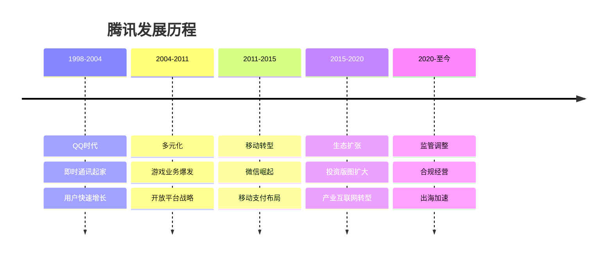
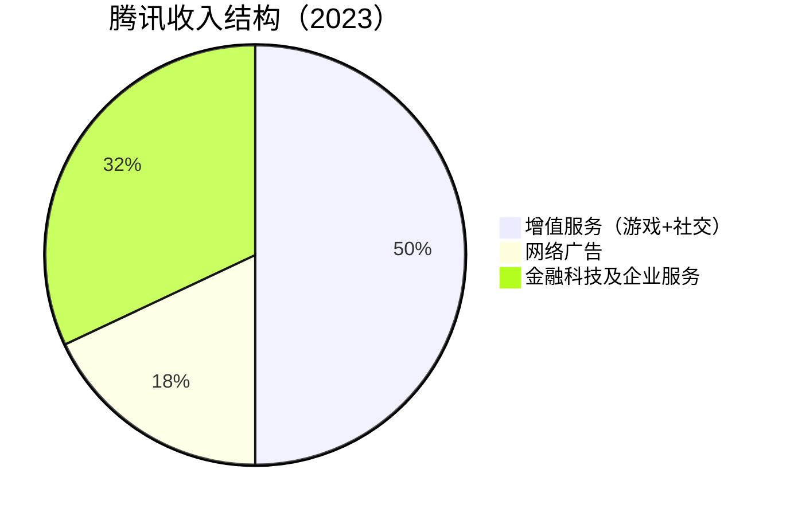
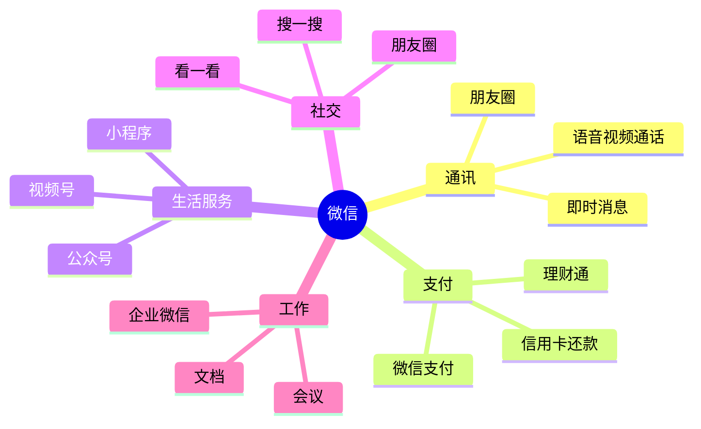
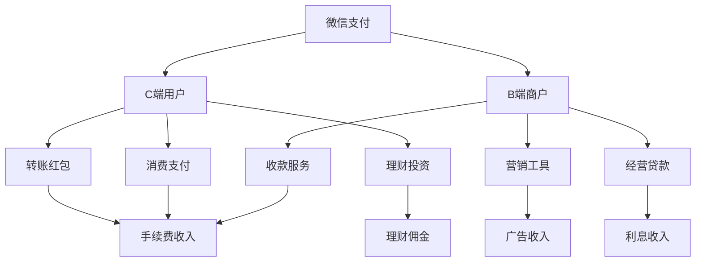
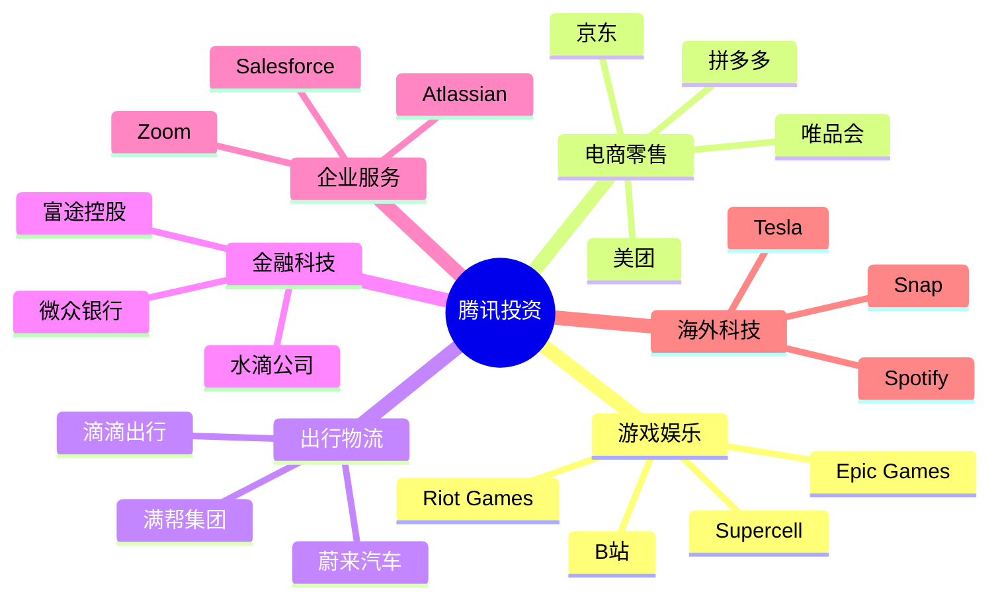

# 腾讯控股深度研究

## 公司概况

### 基本信息

**公司名称**：腾讯控股有限公司（Tencent Holdings Limited）
**股票代码**：00700.HK（港股）
**成立时间**：1998年11月
**总部位置**：中国深圳
**创始人**：马化腾、张志东、许晨晔、陈一丹、曾李青

**业务范围**：
- 社交网络：微信、QQ
- 网络游戏：手游、端游
- 数字内容：视频、音乐、文学
- 金融科技：微信支付、理财通
- 企业服务：腾讯云、企业微信
- 战略投资：全球科技投资

**市值规模**（2023）：
- 约3.5万亿港元（4500亿美元）
- 中国市值最大互联网公司之一
- 全球前十大科技公司

### 发展历程

**关键里程碑**：
- 1998年：公司成立，推出OICQ（QQ前身）
- 2004年：香港上市，发行价3.7港元
- 2011年：推出微信，开启移动互联网时代
- 2013年：微信支付上线，进军金融科技
- 2017年：市值突破5000亿美元
- 2021年：反垄断监管，战略调整
- 2023年：回购股票，股价回升

## 商业模式分析

### 核心业务结构

### 1. 社交网络：无可撼动的护城河

**微信生态**：

**用户规模**：
- 月活跃用户：13.4亿（2023 Q3）
- 日活跃用户：超过10亿
- 渗透率：中国智能手机用户90%+

**超级APP特征**：

**社交关系链价值**：
- 强关系：家人、朋友、同事
- 弱关系：公众号、视频号
- 商业关系：小程序、企业微信
- 不可替代性：迁移成本极高

**QQ生态**：
- 月活跃用户：5.7亿（2023 Q3）
- 年轻用户为主
- 游戏社交属性强
- 与微信形成互补

**变现模式**：
- 游戏联运：导流分成
- 广告收入：朋友圈、公众号、视频号
- 金融服务：支付、理财
- 企业服务：企业微信、会议

### 2. 网络游戏：全球领先的游戏帝国

**市场地位**：
- 全球最大游戏公司（按收入）
- 中国手游市场份额50%+
- 拥有多款现象级产品

**游戏矩阵**：

**自研游戏**：
- 《王者荣耀》：日活1亿+，年收入200亿+
- 《和平精英》：PUBG Mobile中国版
- 《英雄联盟手游》：MOBA手游
- 《金铲铲之战》：自走棋手游

**代理游戏**：
- 《英雄联盟》：全球最成功MOBA
- 《地下城与勇士》：经典端游
- 《穿越火线》：FPS经典

**海外投资**：
- Riot Games（100%）：《英雄联盟》
- Supercell（84%）：《部落冲突》
- Epic Games（40%）：虚幻引擎
- Ubisoft（5%）：《刺客信条》

**竞争优势**：
- 社交流量优势：微信、QQ导流
- 研发能力强：天美、光子工作室
- 发行能力强：渠道和运营经验
- 全球化布局：投资+自研

**盈利模式**：
- 道具付费：皮肤、装备
- 通行证：赛季通行证
- 广告变现：休闲游戏
- 版权授权：IP衍生

### 3. 金融科技：支付+理财双轮驱动

**微信支付**：
- 日均交易笔数：超过10亿笔
- 商户数量：超过5000万
- 场景覆盖：线上+线下全场景

**支付生态**：

**理财通**：
- 用户规模：超过2亿
- 资产规模：超过2万亿
- 产品类型：货币基金、理财产品、保险

**商业银行**：
- 微众银行：互联网银行
- 微粒贷：消费信贷产品
- 小微贷：小微企业贷款

**盈利模式**：
- 支付手续费：商户收单
- 理财佣金：基金销售
- 利息收入：贷款业务
- 增值服务：会员、保险

### 4. 企业服务：产业互联网新增长点

**腾讯云**：
- 市场份额：中国第二（阿里云之后）
- 收入规模：年收入超过500亿
- 客户数量：超过100万企业客户

**企业微信**：
- 活跃用户：超过8亿
- 企业客户：超过1200万
- 与微信互通：12亿潜在触达

**其他服务**：
- 腾讯会议：视频会议
- 腾讯文档：协同办公
- 企点：客户服务
- 安全服务：云安全

**盈利模式**：
- IaaS：计算、存储、网络
- PaaS：数据库、中间件
- SaaS：企业应用
- 增值服务：技术支持

## 投资版图：战略投资的艺术

### 投资策略

**投资理念**：
- 不控股：保持创业团队积极性
- 给资源：流量、技术、资金
- 做生态：构建腾讯生态圈
- 长期持有：不急于退出

**投资领域**：

### 重点投资案例

**1. 京东（持股17%）**：
- 投资时间：2014年
- 投资金额：21.5亿美元
- 战略价值：电商补短板
- 投资回报：5倍+

**2. 美团（持股17%）**：
- 投资时间：2016年
- 投资金额：多轮累计
- 战略价值：本地生活
- 投资回报：10倍+

**3. 拼多多（持股17%）**：
- 投资时间：2016年
- 投资金额：多轮累计
- 战略价值：下沉市场
- 投资回报：20倍+

**4. B站（持股18%）**：
- 投资时间：2015年
- 投资金额：多轮累计
- 战略价值：年轻用户
- 投资回报：5倍+

**5. Epic Games（持股40%）**：
- 投资时间：2012年起
- 投资金额：累计数十亿美元
- 战略价值：虚幻引擎、元宇宙
- 投资回报：估值大幅提升

### 投资回报

**账面价值**：
- 上市公司投资：超过1万亿港元
- 非上市公司投资：估值数千亿
- 总投资价值：超过腾讯市值30%

**投资收益**：
- 年均投资收益率：20%+
- 部分项目回报：10倍以上
- 战略价值：远超财务回报

## 财务分析

### 收入分析

**收入结构变化**：

| 业务 | 2018 | 2020 | 2022 | 2023E |
|------|------|------|------|-------|
| 增值服务 | 56% | 55% | 50% | 48% |
| 网络广告 | 17% | 18% | 17% | 18% |
| 金融科技及企业服务 | 25% | 26% | 31% | 32% |
| 其他 | 2% | 1% | 2% | 2% |

**收入增长驱动**：
- 游戏：新游戏上线、海外扩张
- 广告：视频号商业化、小程序广告
- 金融科技：支付规模扩大、理财增长
- 企业服务：云计算、SaaS增长

### 盈利能力

**利润率分析**：
- 毛利率：45-50%（稳定）
- 经营利润率：25-30%
- 净利率：20-25%

**ROE分析**：
- ROE：20-25%（优秀水平）
- 杜邦分解：
  - 净利率：25%
  - 资产周转率：0.5
  - 权益乘数：2.0

### 现金流分析

**经营现金流**：
- 年经营现金流：1500-2000亿
- 经营现金流/净利润：>100%
- 现金流质量：优秀

**自由现金流**：
- 年自由现金流：1200-1500亿
- 资本支出：主要是服务器、办公楼
- 自由现金流收益率：3-4%

**现金储备**：
- 现金及等价物：超过2000亿
- 投资资产：超过1万亿
- 财务健康：非常稳健

### 财务健康度

**资产负债表**：
- 资产负债率：30-40%
- 流动比率：1.5-2.0
- 速动比率：1.3-1.8

**偿债能力**：
- 利息覆盖倍数：>50倍
- 债务/EBITDA：<1倍
- 财务风险：极低

## 竞争优势分析

### 1. 社交网络护城河

**不可替代的社交关系链**：
- 13亿用户的关系网络
- 迁移成本极高
- 网络效应持续增强

**超级APP地位**：
- 用户时长占比：30%+
- 日均使用次数：10次+
- 场景覆盖：全方位

**生态系统完整**：
- 小程序：500万+
- 公众号：2000万+
- 视频号：快速增长
- 企业微信：连接B端

### 2. 游戏业务优势

**流量优势**：
- 微信、QQ天然流量池
- 社交推荐效应
- 用户获取成本低

**研发能力**：
- 天美工作室：《王者荣耀》
- 光子工作室：《和平精英》
- 魔方工作室：《地下城与勇士手游》

**全球化布局**：
- 投资全球顶级游戏公司
- 获取优质IP和技术
- 海外市场拓展

### 3. 金融科技优势

**场景优势**：
- 微信支付：线上线下全覆盖
- 社交场景：红包、转账
- 商业场景：小程序支付

**用户基础**：
- 13亿微信用户
- 支付习惯养成
- 信任度高

**数据优势**：
- 用户行为数据
- 交易数据
- 社交数据
- 风控能力强

### 4. 投资生态优势

**战略协同**：
- 投资补短板：电商、出行
- 生态互补：流量、技术
- 财务回报：投资收益可观

**资源整合**：
- 流量导入
- 技术支持
- 品牌背书
- 资金支持

## 投资风险分析

### 1. 监管风险

**反垄断监管**：
- 限制并购：投资受限
- 强制开放：生态开放
- 罚款风险：合规成本

**数据安全**：
- 数据出境限制
- 隐私保护要求
- 合规成本上升

**内容监管**：
- 游戏版号限制
- 未成年人保护
- 内容审核要求

### 2. 竞争风险

**游戏业务**：
- 字节跳动进军游戏
- 米哈游等新势力崛起
- 海外游戏竞争

**广告业务**：
- 抖音、快手分流
- 广告主预算有限
- 宏观经济影响

**支付业务**：
- 支付宝竞争
- 数字人民币冲击
- 监管限制

### 3. 增长放缓风险

**用户增长见顶**：
- 中国互联网渗透率饱和
- 用户时长增长有限
- 需要海外扩张

**变现效率提升空间有限**：
- 广告加载率已高
- 游戏ARPU提升困难
- 需要新增长点

### 4. 地缘政治风险

**中美关系**：
- 海外投资受限
- 游戏出海困难
- 技术合作受阻

**数据安全**：
- 跨境数据流动限制
- 海外业务合规成本
- 政治风险

## 投资价值评估

### 估值分析

**历史估值区间**：
- PE：20-40倍
- PS：5-10倍
- PB：3-6倍

**当前估值（2023）**：
- PE：约15倍（历史低位）
- PS：约4倍
- PB：约2.5倍

**估值对比**：

| 公司 | PE | PS | 市值（亿美元） |
|------|----|----|---------------|
| 腾讯 | 15 | 4 | 4500 |
| Meta | 25 | 6 | 8000 |
| Alphabet | 22 | 5 | 17000 |
| 阿里巴巴 | 12 | 2 | 2000 |

### DCF估值

**假设条件**：
- 收入增速：未来5年8-12%
- 经营利润率：25-28%
- 折现率：10%
- 永续增长率：3%

**估值结果**：
- 合理估值：500-600港元
- 当前股价：350港元（2023）
- 安全边际：30-40%

### 投资论点

**看多理由**：
1. **社交护城河稳固**：微信地位不可撼动
2. **游戏业务领先**：全球最大游戏公司
3. **金融科技增长**：支付+理财双轮驱动
4. **投资价值可观**：投资组合价值高
5. **估值处于低位**：PE仅15倍，历史低位
6. **现金流充沛**：年自由现金流1500亿+
7. **回购力度大**：2023年回购超过500亿港元

**看空理由**：
1. **监管不确定性**：反垄断、数据安全
2. **增长放缓**：用户和收入增速下降
3. **竞争加剧**：字节跳动、米哈游等
4. **地缘政治风险**：中美关系、海外业务
5. **游戏版号限制**：新游戏上线受限

### 投资建议

**适合投资者**：
- 长期价值投资者
- 能承受波动的投资者
- 看好中国互联网的投资者

**投资策略**：
- 分批建仓：300-350港元区间
- 长期持有：3-5年以上
- 估值修复：目标价500港元+
- 股息收益：年股息率1-2%

**风险控制**：
- 仓位控制：不超过组合20%
- 止损位：250港元
- 关注政策：密切跟踪监管动态

## 投资启示

### 1. 社交网络的价值

**网络效应的力量**：
- 用户越多，价值越大
- 关系链是最强护城河
- 迁移成本极高

**超级APP战略**：
- 一个APP满足多种需求
- 用户时长和粘性极高
- 变现方式多样

### 2. 平台生态的重要性

**开放平台战略**：
- 小程序：500万+开发者
- 公众号：2000万+内容创作者
- 视频号：快速增长的内容生态

**投资生态战略**：
- 不控股，给资源
- 构建生态圈
- 战略协同

### 3. 多元化的必要性

**业务多元化**：
- 社交+游戏+金融+云
- 降低单一业务风险
- 协同效应明显

**地域多元化**：
- 国内+海外
- 投资全球优质资产
- 分散地缘政治风险

### 4. 长期主义的价值

**持续投入**：
- 研发投入：收入的10%+
- 基础设施：服务器、数据中心
- 人才培养：吸引顶尖人才

**耐心等待**：
- 微信用了3年才爆发
- 视频号仍在培育期
- 企业服务需要时间

## 常见问题

### Q1：腾讯还能增长吗？

**回答**：
- 国内：用户增长见顶，但ARPU仍有提升空间
- 海外：游戏出海、投资全球化
- 新业务：视频号、企业服务、AI应用
- 预计未来5年收入增速8-12%

### Q2：监管风险有多大？

**回答**：
- 反垄断：最严厉阶段已过
- 数据安全：合规成本可控
- 游戏监管：版号发放恢复
- 整体风险可控，但需持续关注

### Q3：腾讯 vs 阿里，谁更好？

**回答**：
- 腾讯优势：社交护城河、游戏业务、投资回报
- 阿里优势：电商规模、云计算、国际化
- 估值：腾讯PE 15倍，阿里PE 12倍
- 建议：两者都配置，分散风险

### Q4：什么时候买入腾讯？

**回答**：
- 估值：PE < 20倍，PS < 5倍
- 股价：300-350港元区间
- 时机：市场恐慌、政策利空出尽
- 策略：分批建仓，长期持有

## 延伸阅读

### 推荐书籍

1. **《腾讯传》** - 吴晓波
   - 腾讯发展史

2. **《腾讯方法》** - 潘东燕、王晓明
   - 腾讯管理和创新

3. **《微信力量》** - 张小龙演讲集
   - 微信产品哲学

4. **《腾讯产品法》** - 李立
   - 腾讯产品方法论

5. **《平台革命》** - 杰奥夫雷·帕克
   - 平台经济理论

### 研究报告

- 腾讯年报和季报
- 各大券商腾讯深度报告
- 艾瑞咨询互联网行业报告
- 腾讯研究院发布的行业报告

### 在线资源

- 腾讯官网：www.tencent.com
- 腾讯投资者关系：www.tencent.com/zh-cn/investors
- 微信公开课：了解微信生态
- 腾讯研究院：行业研究报告

## 参考文献

1. 腾讯控股. 《年度报告》. 2018-2023
2. 吴晓波. 《腾讯传》. 2017
3. 中金公司. 《腾讯控股深度报告》. 2023
4. 招商证券. 《腾讯投资价值分析》. 2023
5. 高盛. 《Tencent: Social King》. 2023
6. 摩根士丹利. 《Tencent Deep Dive》. 2023
7. 艾瑞咨询. 《中国互联网发展报告》. 2023
8. QuestMobile. 《移动互联网全景报告》. 2023
9. 帕克等. 《平台革命》. 2016
10. 张小龙. 《微信公开课演讲》. 2012-2023

---

**投资建议**：
腾讯是中国互联网的核心资产，社交护城河稳固，游戏业务全球领先，投资版图价值可观。当前估值处于历史低位，PE仅15倍，具有较高的安全边际。建议长期价值投资者在300-350港元区间分批建仓，长期持有3-5年以上，目标价500港元+。

**风险提示**：
需要关注监管政策变化、竞争加剧、增长放缓等风险。建议仓位控制在组合20%以内，设置止损位250港元，密切跟踪政策和业务动态。

## 深度分析

### 核心机制解析

理解本主题需要从多个维度进行系统性分析。以下从理论基础、实践应用和历史验证三个层面展开深度探讨。

**理论基础层面**：本主题的核心逻辑建立在经济学和金融学的基本原理之上。通过对基础理论的深入理解，投资者能够建立起稳固的分析框架，避免被市场短期噪音所干扰。

**实践应用层面**：理论必须与实践相结合才能产生价值。在实际投资决策中，需要将抽象的概念转化为具体的分析工具和决策标准。

**历史验证层面**：金融市场有着丰富的历史记录，通过研究历史案例，我们可以验证理论的有效性，并从中提炼出具有普遍意义的规律。

### 关键影响因素

影响本主题的关键因素可以从以下几个维度进行分析：

1. **宏观经济环境**：利率水平、通货膨胀率、经济增长速度等宏观变量对本主题有着深远影响。在不同的宏观经济周期中，相关指标的表现会呈现出显著差异。

2. **市场结构因素**：市场参与者的构成、信息传播机制、流动性状况等市场结构因素决定了价格发现的效率和准确性。

3. **政策监管环境**：政府政策、监管框架的变化会直接影响相关市场的运作规则和参与者行为。

4. **技术创新驱动**：技术进步不断改变着金融市场的运作方式，从算法交易到区块链技术，每一次技术革新都带来新的机遇和挑战。

5. **全球化与地缘政治**：在全球化背景下，各国市场之间的联动性日益增强，地缘政治风险的影响也越来越不可忽视。

### 量化分析框架

为了更精确地分析和评估，可以采用以下量化框架：

| 分析维度 | 关键指标 | 参考基准 | 分析方法 |
|---------|---------|---------|---------|
| 规模评估 | 绝对值与相对值 | 历史均值 | 趋势分析 |
| 质量评估 | 稳定性指标 | 行业对标 | 横向比较 |
| 风险评估 | 波动率指标 | 风险阈值 | 情景分析 |
| 价值评估 | 估值倍数 | 历史区间 | 回归分析 |

通过系统性地应用上述框架，投资者可以对目标进行全面、客观的评估，从而做出更加理性的投资决策。

## 高级分析与前沿研究

### 学术研究进展

近年来，学术界对本领域的研究取得了重要进展。以下是几个值得关注的研究方向：

**行为金融学视角**：传统金融理论假设市场参与者是完全理性的，但行为金融学的研究表明，认知偏差和情绪因素在投资决策中扮演着重要角色。诺贝尔经济学奖得主丹尼尔·卡尼曼（Daniel Kahneman）和理查德·塞勒（Richard Thaler）的研究为我们理解市场非理性行为提供了重要框架。

**因子投资研究**：尤金·法玛（Eugene Fama）和肯尼斯·弗伦奇（Kenneth French）的三因子模型，以及后续发展的五因子模型，为系统性地解释股票收益差异提供了理论基础。这些研究表明，市值、账面市值比、盈利能力和投资模式等因子能够解释大部分股票收益的横截面差异。

**市场微观结构研究**：对市场流动性、价格发现机制和交易成本的深入研究，帮助我们更好地理解市场的运作机制，并为优化交易策略提供指导。

### 实战案例深度解析

**案例一：长期价值创造的典范**

以沃伦·巴菲特（Warren Buffett）的伯克希尔·哈撒韦（Berkshire Hathaway）为例，其长达数十年的卓越投资业绩证明了价值投资理念的有效性。从1965年至今，伯克希尔的账面价值年均增长率约为19.8%，远超同期标普500指数的约10.2%年均回报。

巴菲特的成功秘诀在于：
- 专注于具有持久竞争优势的优质企业
- 以合理价格买入，而非追求最低价格
- 长期持有，让复利效应充分发挥
- 保持充足的安全边际，控制下行风险

**案例二：危机中的机遇识别**

2008年金融危机期间，大多数投资者恐慌性抛售，但少数具有前瞻性的投资者却在危机中发现了历史性的投资机会。约翰·保尔森（John Paulson）通过做空次级抵押贷款相关证券，在危机中获得了约150亿美元的利润，成为金融史上最成功的单笔交易之一。

这个案例告诉我们：
- 深入的基本面研究能够发现市场定价错误
- 逆向思维往往能够发现被市场忽视的机会
- 风险管理和仓位控制是成功的关键

### 跨市场比较分析

不同市场在结构、监管、投资者构成等方面存在显著差异，这些差异对投资策略的选择有重要影响：

**美国市场特征**：
- 机构投资者主导，市场效率较高
- 信息披露制度完善，分析师覆盖广泛
- 衍生品市场发达，对冲工具丰富
- 长期牛市历史，但也经历过多次重大调整

**中国市场特征**：
- 散户投资者比例较高，市场波动性较大
- 政策因素影响显著，需要密切关注监管动向
- 新兴行业发展迅速，成长投资机会丰富
- A股、港股、美股中概股形成多层次市场体系

**欧洲市场特征**：
- 价值股比例较高，估值相对保守
- 受地缘政治和欧元区政策影响较大
- 部分行业（如奢侈品、工业）具有全球竞争优势
- ESG投资理念推广较为领先

