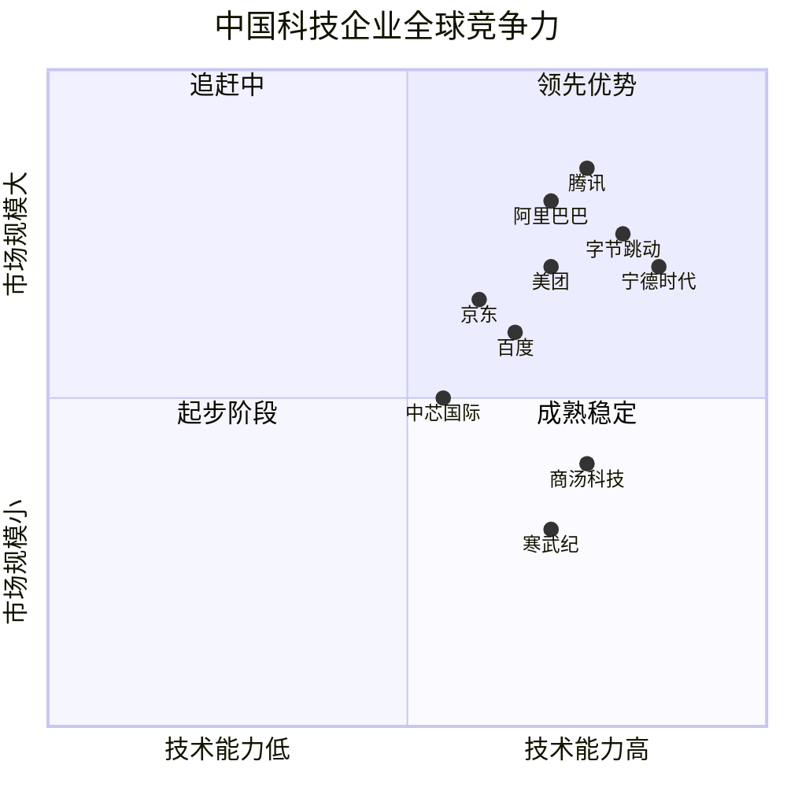
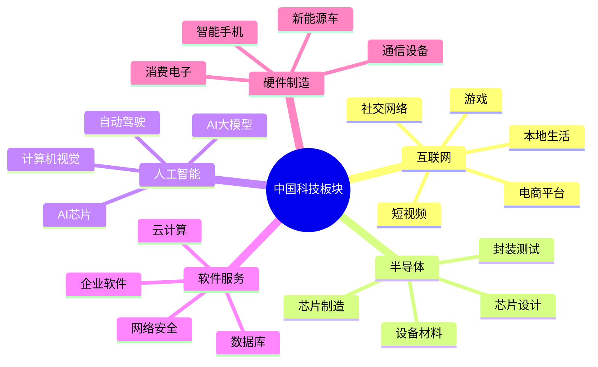

# 中国科技板块总览

## 概述

中国科技板块是全球科技创新的重要力量，从互联网应用创新到硬件制造，从人工智能到半导体自主化，中国科技企业正在重塑全球科技格局。本文全面分析中国科技行业的发展现状、投资逻辑和长期机会。

**学习目标**：
- 理解中国科技行业的发展阶段和全球地位
- 掌握科技板块的细分领域和投资逻辑
- 分析中国科技创新的优势和挑战
- 识别优质科技企业的核心特征
- 建立中国科技投资的分析框架

**为什么重要**：
中国科技行业经历了从模仿到创新的转变，诞生了腾讯、阿里巴巴、字节跳动等世界级互联网公司，在5G、人工智能、电动车等领域处于全球领先地位。科技板块是中国经济转型升级的核心驱动力，也是长期投资者不可忽视的重要领域。

## 中国科技行业发展历程

### 发展阶段

**第一阶段：模仿创新（2000-2010）**：
- 学习硅谷模式
- 本土化改造
- 代表：BAT（百度、阿里、腾讯）崛起

**第二阶段：应用创新（2010-2018）**：
- 移动互联网爆发
- 商业模式创新
- 代表：美团、字节跳动、拼多多

**第三阶段：技术创新（2018-至今）**：
- 核心技术突破
- 自主可控战略
- 代表：华为5G、宁德时代电池、AI大模型

### 全球地位

**领先领域**：
- 移动支付：全球最发达
- 电商平台：规模和创新全球领先
- 短视频：TikTok 全球化成功
- 电动车：产业链最完整
- 5G：基站数量和应用全球第一

**追赶领域**：
- 半导体：设计能力提升，制造仍有差距
- 操作系统：鸿蒙等国产系统崛起
- 工业软件：CAD/EDA 等仍依赖进口
- 高端芯片：受制于光刻机等设备

## 科技板块细分结构

### 核心子行业分类

### 1. 互联网行业

**行业特点**：
- 平台经济主导
- 网络效应显著
- 赢家通吃格局
- 监管趋严

**核心细分**：
- **社交网络**：腾讯微信/QQ 垄断地位
- **电商平台**：阿里、京东、拼多多三强
- **本地生活**：美团、饿了么双寡头
- **短视频**：抖音、快手领先
- **游戏**：腾讯、网易双雄

**投资逻辑**：
- 用户规模和活跃度
- 变现能力和盈利模式
- 平台生态和护城河
- 监管政策影响

### 2. 半导体行业

**行业特点**：
- 技术密集、资本密集
- 国产替代加速
- 政策大力支持
- 全球产业链重构

**核心细分**：
- **芯片设计**：海思、紫光展锐等
- **芯片制造**：中芯国际、华虹半导体
- **封装测试**：长电科技、通富微电
- **设备材料**：北方华创、中微公司

**投资逻辑**：
- 国产替代空间
- 技术突破进展
- 客户认证情况
- 产能扩张计划

### 3. 人工智能行业

**行业特点**：
- 技术快速迭代
- 应用场景丰富
- 数据优势明显
- 人才竞争激烈

**核心细分**：
- **AI大模型**：百度文心、阿里通义千问
- **计算机视觉**：商汤、旷视、依图
- **自动驾驶**：百度Apollo、小马智行
- **AI芯片**：寒武纪、地平线

**投资逻辑**：
- 技术领先性
- 商业化进展
- 数据和算力优势
- 应用场景落地

## 中国科技投资逻辑

### 1. 结构性机会

**国产替代主线**：
- 半导体：芯片设计、制造设备
- 软件：操作系统、数据库、工业软件
- 硬件：服务器、存储、网络设备

**创新应用主线**：
- AI应用：大模型、AIGC、智能驾驶
- 新能源：电动车、储能、光伏
- 数字经济：云计算、大数据、物联网

**出海主线**：
- 游戏出海：米哈游、莉莉丝
- 短视频出海：TikTok
- 电商出海：SHEIN、Temu

### 2. 选股核心要素

**技术壁垒**：
- 核心技术自主可控
- 专利布局完善
- 研发投入占比高
- 技术团队实力强

**商业模式**：
- 盈利模式清晰
- 客户粘性强
- 规模效应显著
- 可持续性强

**市场地位**：
- 细分领域龙头
- 市场份额领先
- 客户认可度高
- 品牌影响力大

**财务指标**：
- 收入增速 > 30%（成长期）
- 毛利率 > 40%（软件/互联网）
- 研发费用率 > 15%
- 经营现金流健康

### 3. 估值方法

**互联网企业**：
- PS估值：收入倍数法
- 用户价值：MAU × ARPU
- 平台价值：GMV × Take Rate

**半导体企业**：
- PE估值：15-30倍（成长期）
- PS估值：5-10倍（亏损期）
- 产能价值：产能 × 单位价值

**AI企业**：
- 技术估值：专利、团队、数据
- 应用估值：落地场景、商业化进展
- 对标估值：参考海外可比公司

## 投资机会与风险

### 重点投资方向

**1. 互联网平台**：
- 腾讯：社交+游戏+投资
- 阿里巴巴：电商+云计算
- 美团：本地生活龙头
- 拼多多：下沉市场+出海

**2. 半导体产业链**：
- 中芯国际：晶圆代工龙头
- 北方华创：设备国产化
- 韦尔股份：CIS芯片领先
- 卓胜微：射频芯片龙头

**3. AI与自动驾驶**：
- 百度：AI大模型+自动驾驶
- 商汤科技：计算机视觉
- 寒武纪：AI芯片
- 小鹏汽车：智能驾驶

**4. 云计算与软件**：
- 阿里云：云计算龙头
- 金山办公：国产办公软件
- 用友网络：企业管理软件
- 恒生电子：金融IT

### 主要投资风险

**1. 监管政策风险**：
- 反垄断监管
- 数据安全监管
- 内容审核要求
- 跨境数据流动限制

**2. 技术风险**：
- 技术路线选择错误
- 核心技术被卡脖子
- 技术迭代被超越
- 研发失败风险

**3. 竞争风险**：
- 行业竞争加剧
- 新进入者冲击
- 价格战侵蚀利润
- 人才流失

**4. 地缘政治风险**：
- 中美科技脱钩
- 出口管制
- 供应链断裂
- 海外市场受限

## 中国 vs 美国科技对比

### 优势对比

| 维度 | 中国优势 | 美国优势 |
|------|---------|---------|
| 市场规模 | 14亿人口，统一大市场 | 全球化市场，美元霸权 |
| 应用创新 | 移动支付、电商、短视频 | 云计算、SaaS、企业软件 |
| 制造能力 | 完整产业链，成本优势 | 高端制造，精密设备 |
| 数据资源 | 海量用户数据 | 数据质量高，隐私保护 |
| 政策支持 | 产业政策明确，资金充足 | 市场化程度高，创新自由 |
| 人才储备 | 工程师红利，数量优势 | 顶尖人才，质量优势 |

### 差距领域

**基础技术**：
- 操作系统：Windows、iOS、Android
- 芯片架构：x86、ARM
- 工业软件：CAD、EDA、CAE
- 数据库：Oracle、SQL Server

**高端制造**：
- 光刻机：ASML垄断
- 高端芯片：Intel、NVIDIA、AMD
- 精密仪器：测试设备、分析仪器

**生态系统**：
- 开发者生态：GitHub、Stack Overflow
- 开源社区：Linux、Apache
- 标准制定：IEEE、ISO

### 投资启示

**中国科技的机会**：
- 应用创新领先全球
- 制造优势明显
- 市场空间巨大
- 政策支持力度大

**需要关注的风险**：
- 核心技术受制于人
- 地缘政治不确定性
- 监管政策变化
- 估值波动较大

## 投资策略建议

### 1. 分层配置策略

**核心层（50%）**：
- 互联网龙头：腾讯、阿里
- 平台型企业：美团、京东
- 确定性高，长期持有

**成长层（30%）**：
- 半导体：中芯国际、北方华创
- AI应用：百度、商汤
- 高成长，中期持有

**主题层（20%）**：
- 国产替代：软件、芯片
- 新兴技术：量子计算、脑机接口
- 高风险高回报，灵活调整

### 2. 行业轮动策略

**周期判断**：
- 政策周期：关注产业政策导向
- 技术周期：关注技术突破节点
- 估值周期：关注估值修复机会

**轮动逻辑**：
- 政策利好期：加仓受益行业
- 技术突破期：布局创新企业
- 估值低谷期：逆向投资龙头

### 3. 风险控制

**仓位管理**：
- 单只个股不超过20%
- 单一子行业不超过40%
- 保持适度现金储备

**止损策略**：
- 基本面恶化：坚决止损
- 估值过高：分批减仓
- 政策重大变化：及时调整

## 研究框架与工具

### 科技股研究清单

**行业层面**：
- [ ] 行业空间和增速
- [ ] 技术发展趋势
- [ ] 竞争格局变化
- [ ] 政策环境影响
- [ ] 国际对比分析

**公司层面**：
- [ ] 技术壁垒评估
- [ ] 商业模式分析
- [ ] 管理团队能力
- [ ] 财务健康度
- [ ] 估值合理性

**技术层面**：
- [ ] 核心技术先进性
- [ ] 专利布局情况
- [ ] 研发投入强度
- [ ] 技术团队实力
- [ ] 产品竞争力

### 数据来源

**官方数据**：
- 工信部：电子信息产业数据
- 科技部：科技创新数据
- 统计局：软件和信息服务业数据

**行业数据**：
- IDC、Gartner：市场研究报告
- 艾瑞咨询：互联网行业数据
- 赛迪顾问：半导体行业数据

**公司数据**：
- 年报、季报
- 技术白皮书
- 专利数据库
- 客户案例

## 实战案例

### 案例1：腾讯的社交帝国

**投资逻辑**：
- 微信/QQ 社交垄断地位
- 游戏业务全球领先
- 投资版图广泛
- 现金流充沛

**投资回报**：2004-2021年约500倍
**年化收益率**：约40%

**成功要素**：
- 社交网络效应
- 多元化业务布局
- 优秀的产品能力
- 战略投资眼光

### 案例2：宁德时代的电池霸主

**投资逻辑**：
- 动力电池全球龙头
- 技术领先，成本优势
- 绑定优质客户
- 产能快速扩张

**投资回报**：2018-2021年约10倍
**年化收益率**：约80%

**成功要素**：
- 抓住电动车风口
- 技术和规模优势
- 产业链地位稳固
- 全球化布局

## 常见误区

### 误区1：盲目追逐热点

**错误做法**：
- 听消息炒概念
- 不懂技术乱投资
- 追高买入

**正确做法**：
- 深入研究技术和商业模式
- 等待合理估值
- 长期视角看待

### 误区2：忽视监管风险

**错误做法**：
- 认为科技企业不受监管
- 忽视政策变化
- 满仓单一行业

**正确做法**：
- 密切关注政策动向
- 适度分散投资
- 预留安全边际

### 误区3：只看短期业绩

**错误做法**：
- 追逐季度业绩
- 忽视长期价值
- 频繁交易

**正确做法**：
- 关注长期趋势
- 评估技术壁垒
- 耐心持有优质企业

## 延伸阅读

### 推荐书籍

1. **《浪潮之巅》** - 吴军
   - 科技行业发展史

2. **《腾讯传》** - 吴晓波
   - 中国互联网发展历程

3. **《创新者的窘境》** - 克莱顿·克里斯坦森
   - 技术创新理论

4. **《从0到1》** - 彼得·蒂尔
   - 创新创业思维

5. **《硅谷钢铁侠》** - 阿什利·万斯
   - 马斯克和科技创新

### 研究报告

- 工信部《中国电子信息产业发展报告》
- IDC《中国ICT市场预测》
- 麦肯锡《中国数字经济报告》
- 各大券商科技行业深度报告

### 在线资源

- 36氪、虎嗅：科技资讯
- 雷锋网：AI行业动态
- 芯智讯：半导体行业
- 公司官网和技术博客

## 参考文献

1. 工信部. 《中国电子信息产业统计年鉴》. 2023
2. IDC. 《中国ICT市场预测》. 2023
3. 麦肯锡. 《中国数字经济报告》. 2023
4. 吴军. 《浪潮之巅》. 2011
5. 吴晓波. 《腾讯传》. 2017
6. 克里斯坦森. 《创新者的窘境》. 1997
7. 中金公司. 《科技行业深度报告》. 2023
8. 招商证券. 《半导体行业研究》. 2023
9. 艾瑞咨询. 《中国互联网发展报告》. 2023
10. Gartner. 《中国科技市场预测》. 2023

---

**下一步学习**：
- 深入研究互联网子行业
- 分析半导体产业链
- 学习AI技术和应用
- 研究具体公司案例（腾讯、阿里、百度等）
