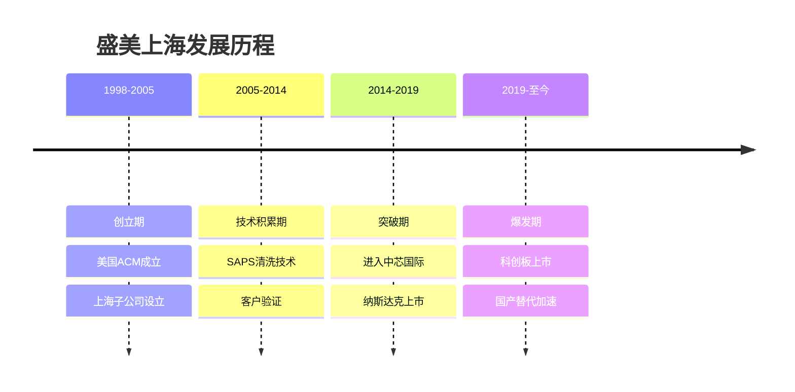
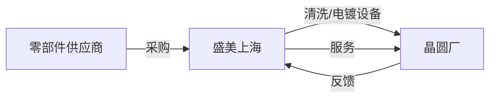
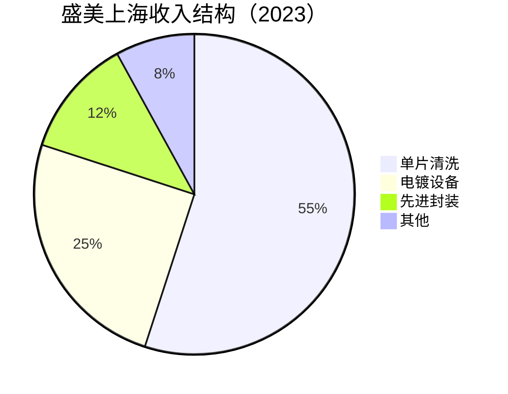
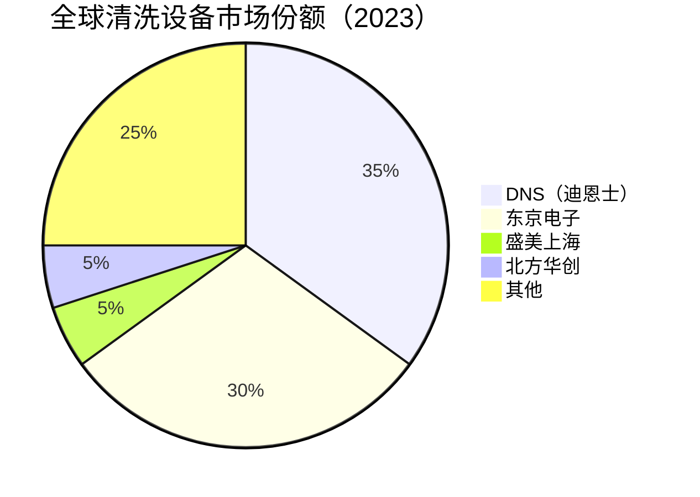

# 盛美上海：半导体清洗设备专家

## 公司概况

### 基本信息

**公司名称**：盛美半导体设备（上海）股份有限公司（ACM Research Shanghai）
**股票代码**：688082.SH（科创板）
**成立时间**：2005年（上海子公司）；母公司ACM Research 1998年成立于美国
**总部位置**：中国上海（运营中心）；美国加州（母公司）
**创始人**：戴缙（David Wang）

**业务范围**：
- 单片清洗设备：核心业务
- 电镀设备（ECP）：铜互连
- 先进封装设备：TSV、混合键合
- 其他：立式炉管、涂胶显影

**市值规模**（2023）：
- 市值：约500亿人民币
- 中国清洗设备龙头
- 全球清洗设备市场份额约5%

### 发展历程

**关键里程碑**：
- 1998年：ACM Research美国成立
- 2005年：上海子公司成立
- 2011年：SAPS兆声波清洗技术突破
- 2014年：进入中芯国际供应链
- 2017年：纳斯达克上市（ACMR）
- 2019年：科创板上市（688082）
- 2021年：收入突破20亿人民币
- 2023年：收入突破40亿人民币

### 创始人背景

**戴缙（David Wang）**：
- 教育背景：中国科技大学本科，美国加州大学博士
- 工作经历：半导体设备行业20年+
- 创业动机：清洗设备国产化
- 技术专家：清洗工艺权威
- 持股比例：约15%

## 商业模式分析

### 设备制造商模式

**业务模式**：
- 设备研发：自主研发（上海+美国双中心）
- 设备制造：上海工厂
- 设备销售：直销为主
- 售后服务：技术支持、备件

**产业链位置**：

**收入模式**：
- 设备销售：82%
- 备件服务：15%
- 其他：3%

### 业务结构

**按产品分类**：

**按应用分类**：
- 集成电路：80%
- 先进封装：12%
- 其他：8%

**按客户分类**：
- 中芯国际：30%
- 长江存储：20%
- 华虹半导体：15%
- 其他：35%

## 产品技术分析

### 1. 单片清洗设备

**技术原理**：
- 化学清洗：去除颗粒、金属离子、有机物
- 物理辅助：兆声波、旋转喷淋
- 干燥：马兰戈尼干燥、旋转干燥

**核心技术：SAPS（空间交变相移）**：
- 专利技术：盛美自主研发
- 原理：兆声波空间交变相移
- 优势：高效去除颗粒，低损伤
- 应用：先进制程清洗

**产品矩阵**：
- Ultra C系列：单片清洗，28nm-7nm
- Ultra Fn系列：前道清洗
- Ultra Bn系列：后道清洗
- 应用：逻辑、存储、功率器件

**技术参数**：
- 制程：28nm-7nm
- 颗粒去除率：>99.9%
- 金属去除：<0.1ppb
- 产能：100片/小时

**市场地位**：
- 全球市场份额：5%+
- 中国市场份额：25%+
- 主要竞争对手：DNS（迪恩士）、东京电子、盛美

**客户认证**：
- 中芯国际：28nm、14nm
- 长江存储：3D NAND
- 华虹半导体：特色工艺
- 部分海外客户：验证中

### 2. 电镀设备（ECP）

**技术原理**：
- 电化学沉积：铜互连
- 均匀电场：保证均匀性
- 添加剂控制：晶粒结构

**核心技术：TEBO（湍流电化学）**：
- 专利技术：盛美自主研发
- 原理：湍流增强传质
- 优势：高均匀性，低缺陷
- 应用：铜互连、TSV

**产品矩阵**：
- Ultra ECP系列：铜互连
- Ultra ECP ap系列：先进封装
- Ultra ECP map系列：多应用
- 应用：逻辑、存储、先进封装

**技术参数**：
- 均匀性：<2%
- 缺陷密度：<0.1/cm²
- 产能：80片/小时
- 应用：28nm-7nm

**市场地位**：
- 全球市场份额：8%+
- 中国市场份额：30%+
- 主要竞争对手：应用材料、Lam Research

**竞争优势**：
- TEBO技术：专利保护
- 均匀性：行业领先
- 成本：低于国际竞争对手20-30%

### 3. 先进封装设备

**技术原理**：
- TSV（硅通孔）：三维互连
- 混合键合：芯片堆叠
- 再布线层（RDL）：信号重新分布

**产品矩阵**：
- Ultra ECP ap：TSV电镀
- 清洗设备：先进封装清洗
- 应用：HBM、CoWoS、SoIC

**市场机会**：
- AI芯片：HBM需求爆发
- 先进封装：CoWoS、SoIC
- 市场规模：快速增长

**技术参数**：
- TSV深宽比：>20:1
- 均匀性：<3%
- 应用：HBM、3D IC

### 4. 其他设备

**立式炉管**：
- 技术：热处理、氧化
- 应用：前道工艺
- 市场份额：<5%

**涂胶显影（Track）**：
- 技术：光刻辅助
- 应用：前道工艺
- 研发中

## 市场地位分析

### 全球清洗设备市场

**市场规模**：
- 2023年：约100亿美元
- 年增长率：8-12%
- 2025E：130亿美元

**市场格局**：

**竞争格局**：
- 第一梯队：DNS（35%）、东京电子（30%）
- 第二梯队：盛美上海（5%）、北方华创（5%）
- 其他：分散竞争

### 盛美上海市场地位

**全球排名**：
- 清洗设备：前五
- 电镀设备：前三（中国市场）
- 中国市场：清洗第一

**市场份额变化**：
- 2019年：2%
- 2020年：3%
- 2021年：4%
- 2022年：5%
- 2023年：5%+

**增长驱动**：
- 国产替代：客户主动转单
- 电镀设备：新产品放量
- 先进封装：AI芯片需求
- 客户拓展：新客户导入

## 竞争优势分析

### 1. 专利技术优势

**SAPS技术**：
- 空间交变相移兆声波
- 专利保护：全球专利
- 优势：高效去颗粒，低损伤
- 应用：先进制程清洗

**TEBO技术**：
- 湍流电化学沉积
- 专利保护：全球专利
- 优势：高均匀性，低缺陷
- 应用：铜互连、TSV

**技术壁垒**：
- 专利保护：竞争对手难以复制
- 技术积累：20年+
- 持续创新：研发投入高

### 2. 产品差异化优势

**清洗设备**：
- SAPS技术：差异化竞争
- 低损伤：先进制程需求
- 高效率：降低客户成本

**电镀设备**：
- TEBO技术：差异化竞争
- 高均匀性：铜互连质量
- 成本优势：低于国际竞争对手

### 3. 双重上市优势

**纳斯达克+科创板**：
- 融资渠道：双重融资
- 品牌效应：国际认可
- 客户信任：国际化背景
- 研发资源：美国+中国

**国际化背景**：
- 美国研发：技术前沿
- 中国制造：成本优势
- 全球客户：国际认可

### 4. 先进封装布局

**AI芯片需求**：
- HBM：高带宽内存
- CoWoS：台积电先进封装
- 市场爆发：AI驱动

**产品布局**：
- TSV电镀：HBM关键工艺
- 清洗设备：先进封装清洗
- 市场机会：快速增长

## 财务分析

### 收入分析

**收入增长**：
- 2018年：8亿人民币
- 2019年：10亿
- 2020年：14亿
- 2021年：22亿
- 2022年：32亿
- 2023E：42亿
- CAGR（2018-2023）：39%

**收入驱动**：
- 国产替代：客户转单
- 电镀设备：新产品放量
- 先进封装：AI需求
- 客户拓展：新客户

**收入结构变化**：
- 电镀占比：从15%升至25%
- 先进封装：从0升至12%
- 高端产品：占比持续提升

### 盈利能力

**毛利率**：
- 2019年：40%
- 2020年：43%
- 2021年：45%
- 2022年：46%
- 2023E：47%

**毛利率驱动**：
- 产品结构：高端产品占比提升
- 规模效应：成本摊薄
- 技术溢价：专利技术

**净利率**：
- 2020年：16%
- 2021年：20%
- 2022年：22%
- 2023E：23%

**ROE**：
- 2021年：16%
- 2022年：20%
- 2023E：22%

### 财务数据表（2019-2023）

| 指标 | 2019 | 2020 | 2021 | 2022 | 2023E |
|------|------|------|------|------|-------|
| 收入（亿） | 10 | 14 | 22 | 32 | 42 |
| 增长率 | 25% | 40% | 57% | 45% | 31% |
| 毛利率 | 40% | 43% | 45% | 46% | 47% |
| 净利率 | 12% | 16% | 20% | 22% | 23% |
| 净利润（亿） | 1.2 | 2.2 | 4.4 | 7.0 | 9.7 |
| ROE | 10% | 14% | 16% | 20% | 22% |
| 经营现金流（亿） | 2 | 3 | 6 | 9 | 12 |

### 财务健康度

**资产负债表**：
- 资产负债率：30%
- 流动比率：3.0
- 速动比率：2.5

**偿债能力**：
- 利息覆盖倍数：30+倍
- 债务/EBITDA：<1倍
- 财务风险：低

**现金储备**：
- 现金及等价物：25亿+
- 财务健康：充裕

## 投资价值评估

### 估值分析

**历史估值区间**：
- PE：40-120倍
- PS：8-20倍
- PB：6-15倍

**当前估值（2023）**：
- PE：约52倍
- PS：约12倍
- PB：约11倍

**估值对比**：

| 公司 | PE | PS | PB | 市值（亿美元） | 业务 | 增长率 |
|------|----|----|----|--------------|----|--------|
| 盛美上海 | 52 | 12 | 11 | 70 | 清洗+电镀 | 31% |
| 北方华创 | 63 | 12 | 12 | 350 | 设备平台 | 33% |
| 中微公司 | 105 | 27 | 24 | 210 | 刻蚀机 | 22% |
| DNS | 25 | 3 | 4 | 300 | 清洗龙头 | 8% |

### 投资论点

**看多理由**：
1. **专利技术**：SAPS、TEBO专利保护，差异化竞争
2. **清洗龙头**：中国市场份额25%+，持续提升
3. **电镀放量**：TEBO技术，铜互连需求旺盛
4. **先进封装**：AI芯片驱动，HBM、CoWoS需求爆发
5. **双重上市**：国际化背景，融资渠道多元
6. **估值合理**：PE 52倍，相对中微更合理
7. **成长空间**：清洗设备国产化率<20%
8. **盈利改善**：毛利率、净利率持续提升

**看空理由**：
1. **规模偏小**：市值70亿美元，体量较小
2. **客户集中**：前三大客户占65%
3. **竞争激烈**：DNS、东京电子技术领先
4. **技术差距**：与DNS、东京电子差1-2代
5. **周期性强**：半导体设备周期波动
6. **地缘风险**：双重上市，政策不确定性

### 投资建议

**适合投资者**：
- 看好清洗设备国产替代的投资者
- 看好先进封装/AI芯片产业链的投资者
- 能承受中等估值波动的投资者
- 中长期投资者（3-5年）

**投资策略**：
- 建仓区间：60-80元（当前约100元）
- 持有周期：3-5年
- 目标价：150元+（需业绩持续高增长）
- 止损位：45元

**风险控制**：
- 仓位：不超过5%
- 关注：客户认证、先进封装订单、电镀放量
- 调整：根据业绩动态调整

## 行业趋势与机会

### 1. 清洗设备国产替代

**市场空间**：
- 全球市场：100亿美元
- 中国市场：30亿美元
- 国产化率：<20%
- 替代空间：巨大

**驱动因素**：
- 供应链安全：客户主动转单
- 技术进步：28nm→14nm
- 政策支持：大基金、税收优惠

### 2. 先进封装爆发

**AI芯片需求**：
- HBM：高带宽内存，AI必需
- CoWoS：台积电先进封装
- 市场规模：快速增长

**盛美机会**：
- TSV电镀：HBM关键工艺
- 清洗设备：先进封装清洗
- 市场份额：快速提升

### 3. 铜互连需求

**先进制程**：
- 7nm以下：铜互连必需
- 层数增加：电镀需求增长
- 均匀性要求：更高

**TEBO优势**：
- 高均匀性：满足先进制程
- 低缺陷：提升良率
- 成本优势：降低客户成本

### 4. 新兴应用

**功率半导体**：
- SiC、GaN：清洗需求
- 新能源汽车：市场增长
- 设备需求：清洗、电镀

**化合物半导体**：
- 5G、光通信：清洗需求
- 市场增长：快速

## 竞争对手分析

### DNS（迪恩士）

**市场地位**：
- 全球第一：35%市场份额
- 技术领先：单片清洗
- 客户：全球主要晶圆厂

**竞争优势**：
- 技术积累：30年+
- 产品线完整：单片、槽式
- 客户认证：全球主要晶圆厂

**盛美对比**：
- 技术差距：1-2代
- 市场份额：DNS 7倍
- 成本优势：盛美更低
- SAPS技术：差异化

### 东京电子（TEL）

**市场地位**：
- 全球第二：30%市场份额
- 产品线完整：清洗、涂胶显影
- 客户：全球主要晶圆厂

**竞争优势**：
- 产品线完整：清洗+涂胶显影
- 技术积累：40年+
- 客户认证：全球主要晶圆厂

**盛美对比**：
- 技术差距：1-2代
- 产品线：东京电子更完整
- 成本优势：盛美更低

### 北方华创

**市场地位**：
- 中国第二：清洗设备
- 产品线：清洗+刻蚀+薄膜
- 客户：中芯、长存、华虹

**竞争优势**：
- 产品线完整：一站式服务
- 国资背景：政策支持
- 客户粘性：长期合作

**盛美对比**：
- 清洗技术：盛美更专注
- 产品线：北方华创更完整
- 电镀设备：盛美独有
- 竞争：良性竞争

## 常见问题

### Q1：盛美的SAPS技术有多重要？

**回答**：
- 核心竞争力：差异化技术
- 专利保护：竞争对手难以复制
- 应用：先进制程清洗
- 优势：高效去颗粒，低损伤
- 非常重要：核心壁垒

### Q2：电镀设备是新增长点吗？

**回答**：
- 是的：从15%升至25%收入占比
- TEBO技术：差异化竞争
- 铜互连：先进制程必需
- 先进封装：TSV电镀需求
- 增长潜力：巨大

### Q3：先进封装机会有多大？

**回答**：
- AI芯片：HBM需求爆发
- CoWoS：台积电先进封装
- 市场规模：快速增长
- 盛美布局：TSV电镀+清洗
- 重要机会：未来增长引擎

### Q4：双重上市有什么风险？

**回答**：
- 地缘政治：中美关系不确定
- 监管风险：两地监管要求
- 信息披露：双重要求
- 但也有优势：融资渠道多元，国际认可
- 风险可控：目前影响有限

### Q5：什么时候买入盛美上海？

**回答**：
- 估值：PE < 40倍
- 股价：60-80元（当前约100元）
- 时机：先进封装订单、电镀放量、客户认证
- 策略：等待回调，分批建仓

### Q6：盛美vs北方华创，选哪个？

**回答**：
- 盛美：专注清洗+电镀，技术差异化，先进封装布局
- 北方华创：平台型，产品线完整，估值相对合理
- 建议：各有优势，北方华创更稳健，盛美弹性更大

## 参考文献

1. 盛美上海. 《年度报告》. 2019-2023
2. ACM Research. 《Annual Report》. 2019-2023
3. SEMI. 《全球清洗设备市场报告》. 2023
4. IC Insights. 《清洗设备市场研究》. 2023
5. 中金公司. 《盛美上海深度报告》. 2023
6. 招商证券. 《盛美上海投资价值分析》. 2023
7. 天风证券. 《半导体清洗设备行业研究》. 2023
8. 华泰证券. 《盛美上海竞争力分析》. 2023
9. DNS. 《Annual Report》. 2023
10. 东京电子. 《Annual Report》. 2023
11. 中国半导体行业协会. 《行业统计数据》. 2023

---

**投资建议**：
盛美上海是中国清洗设备龙头，拥有SAPS（清洗）和TEBO（电镀）两项核心专利技术，差异化竞争优势明显。清洗设备中国市场份额25%+，电镀设备快速放量，先进封装（HBM、CoWoS）布局前瞻。双重上市（纳斯达克+科创板）提供国际化背景和多元融资渠道。估值相对合理（PE 52倍），盈利能力持续改善（毛利率47%，净利率23%）。建议等待回调至60-80元区间考虑建仓，中长期持有3-5年，目标价150元+。

**风险提示**：
需要关注客户集中度高（前三大65%）、与DNS/东京电子技术差距、半导体设备周期性、双重上市地缘政治风险、竞争加剧等风险。建议仓位控制在5%以内，设置止损位45元，密切跟踪先进封装订单、电镀设备放量、客户认证进展。

---

[← 返回半导体行业](index.html)
