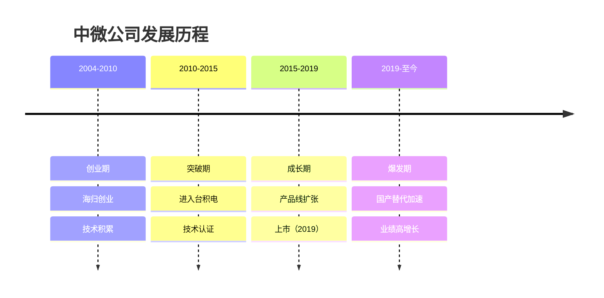
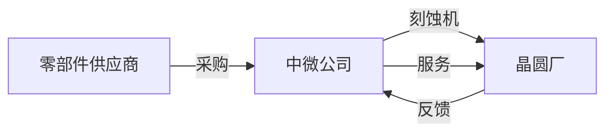
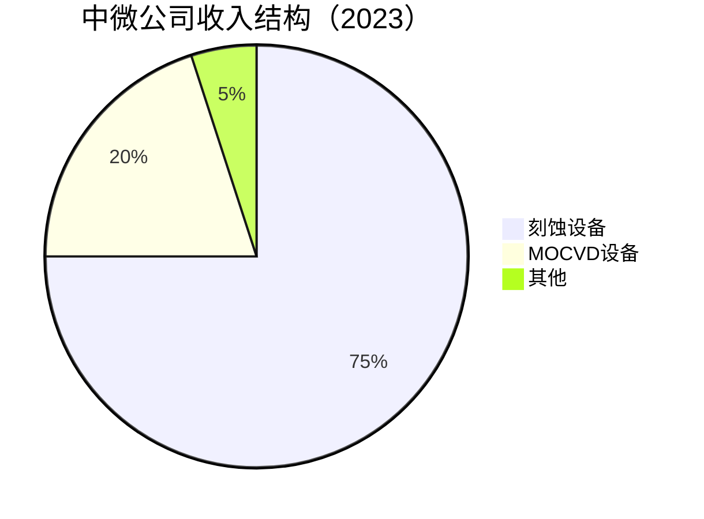
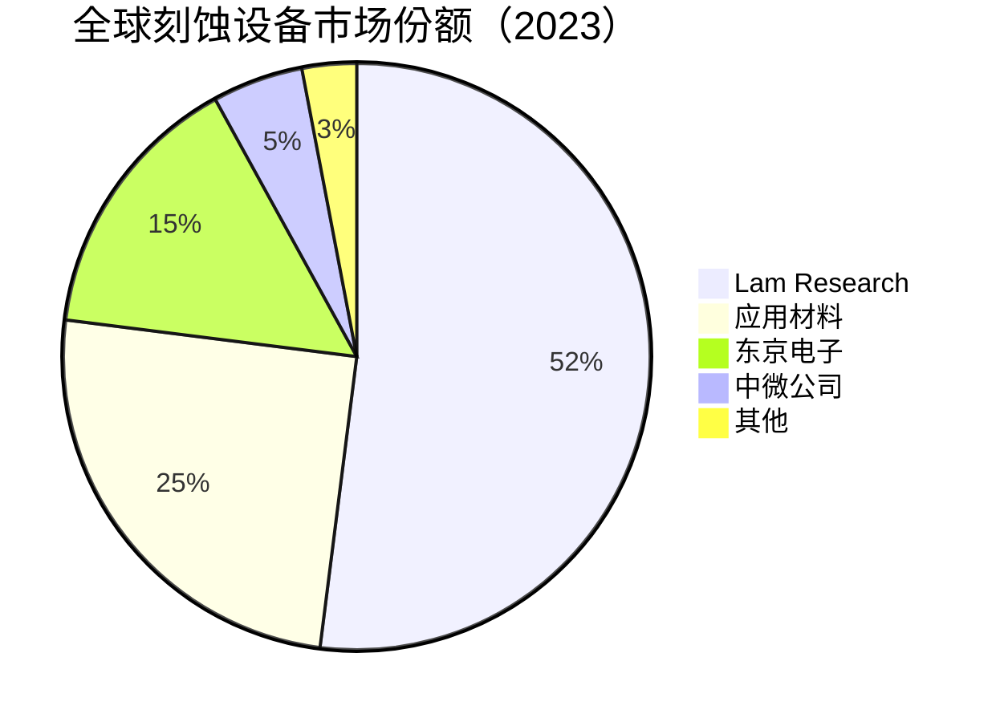

# 中微公司：刻蚀机全球前三强

## 公司概况

### 基本信息

**公司名称**：中微半导体设备（上海）股份有限公司（Advanced Micro-Fabrication Equipment Inc, AMEC）
**股票代码**：688012.SH（科创板）
**成立时间**：2004年5月
**总部位置**：中国上海
**创始人**：尹志尧

**业务范围**：
- 等离子刻蚀设备：核心业务
- MOCVD设备：LED/化合物半导体
- 应用领域：集成电路、LED、功率器件

**市值规模**（2023）：
- 市值：约1500亿人民币
- 中国刻蚀机龙头
- 全球刻蚀机市场份额约5%

### 发展历程

**关键里程碑**：
- 2004年：公司成立，尹志尧回国创业
- 2008年：首台刻蚀机交付
- 2012年：进入台积电供应链
- 2015年：进入中芯国际28nm产线
- 2019年：科创板上市
- 2021年：进入台积电5nm产线
- 2023年：收入突破50亿

### 创始人背景

**尹志尧**：
- 教育背景：加州大学洛杉矶分校博士
- 工作经历：应用材料副总裁（20年+）
- 创业动机：刻蚀机国产化
- 技术专家：刻蚀领域权威
- 持股比例：约8%

## 商业模式分析

### 设备制造商模式

**业务模式**：
- 设备研发：自主研发
- 设备制造：自主生产+外包
- 设备销售：直销为主
- 售后服务：技术支持、备件

**产业链位置**：

**收入模式**：
- 设备销售：85%
- 备件服务：12%
- 其他：3%

### 业务结构

**按产品分类**：

**按应用分类**：
- 集成电路：75%
- LED：18%
- 功率器件：5%
- 其他：2%

**按客户分类**：
- 台积电：25%
- 中芯国际：20%
- 长江存储：15%
- 其他：40%

## 产品技术分析

### 1. 等离子刻蚀设备

**技术原理**：
- 等离子体：化学+物理刻蚀
- 图案转移：精确去除材料
- 精度要求：纳米级

**产品矩阵**：
- 介质刻蚀：Primo系列
- 硅刻蚀：Primo系列
- TSV刻蚀：先进封装
- 应用：逻辑、存储、功率

**技术参数**：
- 制程：7nm-5nm
- 均匀性：<2%
- 选择比：>30:1
- 产能：80片/小时

**技术优势**：
- 高深宽比：>100:1
- 低损伤：保护底层
- 高选择比：精确控制
- 高产能：降低成本

**市场地位**：
- 全球市场份额：5%+
- 中国市场份额：20%+
- 全球排名：前三（介质刻蚀）
- 主要竞争对手：Lam Research、应用材料、东京电子

**客户认证**：
- 台积电：7nm、5nm、3nm
- 中芯国际：28nm、14nm
- 长江存储：3D NAND
- 三星：部分产线

### 2. MOCVD设备

**技术原理**：
- 金属有机化学气相沉积
- 外延生长：单晶薄膜
- 应用：LED、化合物半导体

**产品矩阵**：
- Prismo系列：LED
- Prismo系列：功率器件
- Prismo系列：射频器件

**技术参数**：
- 均匀性：<2%
- 产能：54片/炉（4寸）
- 温度：400°C-1200°C

**市场地位**：
- 全球市场份额：40%+（LED）
- 中国市场份额：60%+
- 全球排名：第一（LED MOCVD）
- 主要竞争对手：Veeco、Aixtron

**应用领域**：
- LED：照明、显示
- 功率器件：GaN、SiC
- 射频：5G、卫星通信

### 3. 其他设备

**CVD设备**：
- 化学气相沉积
- 应用：薄膜沉积
- 市场份额：<5%

**ALD设备**：
- 原子层沉积
- 应用：高k介质
- 研发中

## 市场地位分析

### 全球刻蚀设备市场

**市场规模**：
- 2023年：约200亿美元
- 年增长率：8-12%
- 2025E：250亿美元

**市场格局**：

**竞争格局**：
- 第一梯队：Lam Research（52%）
- 第二梯队：应用材料（25%）、东京电子（15%）
- 第三梯队：中微公司（5%）、北方华创（3%）

### 中微公司市场地位

**全球排名**：
- 整体市场：第四
- 介质刻蚀：前三
- 硅刻蚀：前五
- MOCVD：第一（LED）

**市场份额变化**：
- 2019年：3%
- 2020年：4%
- 2021年：4.5%
- 2022年：5%
- 2023年：5%+

**增长驱动**：
- 台积电认证：5nm、3nm
- 国产替代：中芯、长存
- 产品升级：7nm→5nm
- 产能扩张：新产线

## 竞争优势分析

### 1. 技术优势

**刻蚀技术领先**：
- 介质刻蚀：全球前三
- 高深宽比：>100:1
- 低损伤：保护底层
- 高选择比：>30:1

**研发能力强**：
- 研发人员：800+
- 研发费用率：18%+
- 专利数量：2000+

**技术突破**：
- 7nm：量产
- 5nm：客户验证
- 3nm：研发中

### 2. 客户优势

**顶级客户**：
- 台积电：全球第一晶圆代工
- 中芯国际：中国第一晶圆代工
- 长江存储：中国存储龙头
- 三星：全球半导体巨头

**客户粘性**：
- 技术支持：全球团队
- 快速响应：备件、维修
- 定制化：满足特殊需求

**客户认证**：
- 台积电：最高认证
- 中芯国际：核心供应商
- 长江存储：战略合作

### 3. 专注优势

**聚焦刻蚀**：
- 专注核心：刻蚀技术
- 技术深度：行业领先
- 产品精度：高端市场

**MOCVD龙头**：
- 全球第一：LED MOCVD
- 市场份额：40%+
- 技术领先：均匀性、产能

### 4. 国际化优势

**全球客户**：
- 台积电：台湾
- 三星：韩国
- 中芯国际：中国
- 其他：全球布局

**国际认证**：
- 台积电：最高标准
- 三星：严格认证
- 国际标准：全球认可

## 财务分析

### 收入分析

**收入增长**：
- 2018年：18亿人民币
- 2019年：22亿
- 2020年：25亿
- 2021年：35亿
- 2022年：45亿
- 2023E：55亿
- CAGR（2018-2023）：25%

**收入驱动**：
- 台积电：5nm、3nm订单
- 国产替代：中芯、长存
- MOCVD：LED需求
- 产品升级：7nm→5nm

**收入结构变化**：
- 刻蚀占比：从60%升至75%
- 集成电路占比：从50%升至75%
- 高端产品：占比持续提升

### 盈利能力

**毛利率**：
- 2019年：42%
- 2020年：44%
- 2021年：46%
- 2022年：48%
- 2023E：48%

**毛利率驱动**：
- 产品结构：高端产品占比提升
- 规模效应：成本摊薄
- 技术领先：溢价能力

**净利率**：
- 2020年：18%
- 2021年：22%
- 2022年：25%
- 2023E：26%

**ROE**：
- 2021年：18%
- 2022年：22%
- 2023E：24%

### 现金流

**经营现金流**：
- 2021年：10亿+
- 2022年：15亿+
- 2023E：18亿+
- 现金流稳定

**资本支出**：
- 年资本支出：3-5亿
- 主要用于：产能扩张、研发设备
- 相对轻资产

**现金储备**：
- 现金及等价物：40亿+
- 资产负债率：25%
- 财务极其健康

### 财务健康度

**资产负债表**：
- 资产负债率：25%
- 流动比率：3.5
- 速动比率：3.0

**偿债能力**：
- 利息覆盖倍数：50+倍
- 债务/EBITDA：<0.5倍
- 财务风险：极低

**财务数据表（2019-2023）**：

| 指标 | 2019 | 2020 | 2021 | 2022 | 2023E |
|------|------|------|------|------|-------|
| 收入（亿） | 22 | 25 | 35 | 45 | 55 |
| 增长率 | 22% | 14% | 40% | 29% | 22% |
| 毛利率 | 42% | 44% | 46% | 48% | 48% |
| 净利率 | 15% | 18% | 22% | 25% | 26% |
| 净利润（亿） | 3.3 | 4.5 | 7.7 | 11.3 | 14.3 |
| ROE | 12% | 15% | 18% | 22% | 24% |
| 经营现金流（亿） | 5 | 7 | 10 | 15 | 18 |

## 投资价值评估

### 估值分析

**历史估值区间**：
- PE：50-150倍
- PS：10-35倍
- PB：8-25倍

**当前估值（2023）**：
- PE：约105倍
- PS：约27倍
- PB：约24倍

**估值对比**：

| 公司 | PE | PS | PB | 市值（亿美元） | 业务 | 增长率 |
|------|----|----|----|--------------|----|--------|
| 中微公司 | 105 | 27 | 24 | 210 | 刻蚀机+MOCVD | 22% |
| 北方华创 | 63 | 12 | 12 | 350 | 半导体设备平台 | 33% |
| Lam Research | 20 | 5 | 8 | 900 | 刻蚀龙头 | 10% |
| 应用材料 | 18 | 4 | 6 | 1000 | 设备龙头 | 8% |

### 投资论点

**看多理由**：
1. **技术领先**：介质刻蚀全球前三
2. **客户顶级**：台积电5nm、3nm认证
3. **专注优势**：聚焦刻蚀，技术深度
4. **MOCVD龙头**：全球第一，市场份额40%+
5. **国际化**：台积电、三星客户
6. **成长空间**：刻蚀市场200亿美元
7. **盈利能力**：毛利率48%，净利率26%
8. **财务健康**：现金充裕，负债率低

**看空理由**：
1. **估值极高**：PE 105倍，严重透支未来
2. **增长放缓**：从40%降至22%
3. **竞争激烈**：Lam Research占52%
4. **客户集中**：前三大客户占60%
5. **技术差距**：与Lam仍有差距
6. **周期性强**：半导体设备周期波动

### 投资建议

**适合投资者**：
- 看好刻蚀设备的投资者
- 看好国产替代的投资者
- 能承受极高估值波动的投资者
- 超长期投资者（5年+）

**投资策略**：
- 建仓区间：80-100元（当前约180元）
- 持有周期：5年+
- 目标价：300元+（需业绩持续高增长）
- 止损位：60元

**风险控制**：
- 仓位：不超过5%（估值极高）
- 关注：台积电订单、技术突破、客户拓展
- 调整：根据业绩动态调整

**当前建议**：
- 观望为主：估值极高（PE 105倍）
- 等待大幅回调：80-100元区间考虑建仓
- 长期看好：技术领先，客户顶级

## 行业趋势与机会

### 1. 刻蚀设备需求增长

**市场规模**：
- 2023年：200亿美元
- 2025E：250亿美元
- CAGR：12%+

**驱动因素**：
- 先进制程：7nm、5nm、3nm
- 3D NAND：层数增加
- 晶圆厂扩产：新产线

### 2. 先进制程突破

**技术演进**：
- 7nm：量产
- 5nm：客户验证
- 3nm：研发中
- 2nm：预研

**刻蚀要求**：
- 高深宽比：>100:1
- 低损伤：保护底层
- 高选择比：>30:1
- 高产能：降低成本

### 3. 3D NAND扩产

**层数增加**：
- 128层：量产
- 176层：量产
- 232层：研发
- 300层+：未来

**刻蚀需求**：
- 高深宽比：>100:1
- 均匀性：<2%
- 产能：提升

### 4. 国产替代加速

**市场空间**：
- 全球市场：200亿美元
- 中国市场：60亿美元
- 国产化率：<25%
- 替代空间：巨大

**驱动因素**：
- 供应链安全：客户主动转单
- 技术进步：7nm→5nm
- 政策支持：大基金、税收优惠

## 竞争对手分析

### Lam Research

**市场地位**：
- 全球第一：52%市场份额
- 刻蚀龙头：绝对领先
- 客户：全球主要晶圆厂

**竞争优势**：
- 技术积累：40年+
- 产品线完整：介质、硅、金属刻蚀
- 客户认证：全球主要晶圆厂

**中微对比**：
- 技术差距：1-2代
- 市场份额：Lam 10倍
- 客户：部分重叠（台积电）
- 成本：中微更低

### 应用材料

**市场地位**：
- 全球第二：25%市场份额（刻蚀）
- 设备龙头：全产品线
- 客户：全球主要晶圆厂

**竞争优势**：
- 产品线完整：刻蚀、薄膜、检测
- 规模效应：成本低
- 技术服务：强大

**中微对比**：
- 技术差距：1-2代
- 产品线：应用材料更完整
- 专注度：中微更专注刻蚀

### 北方华创

**市场地位**：
- 中国第一：平台型公司
- 刻蚀份额：<5%
- 客户：中芯、长存、华虹

**竞争优势**：
- 产品线完整：刻蚀、薄膜、清洗
- 国资背景：政策支持
- 客户粘性：一站式服务

**中微对比**：
- 刻蚀技术：中微领先
- 产品线：北方华创更完整
- 国际化：中微更强（台积电）
- 竞争：良性竞争

## 投资启示

### 1. 技术领先的价值

**台积电认证**：
- 5nm：全球最先进
- 3nm：研发中
- 技术标杆：全球认可

**技术深度**：
- 专注刻蚀：20年+
- 高深宽比：>100:1
- 低损伤：保护底层

### 2. 国际化的重要性

**全球客户**：
- 台积电：25%收入
- 三星：部分产线
- 中芯国际：20%收入

**国际标准**：
- 台积电认证：最高标准
- 全球认可：技术领先

### 3. 专注的力量

**聚焦刻蚀**：
- 技术深度：行业领先
- 产品精度：高端市场
- 客户认可：台积电

**MOCVD龙头**：
- 全球第一：40%+份额
- 技术领先：均匀性、产能

### 4. 估值的风险

**估值极高**：
- PE 105倍 vs Lam 20倍
- 市场给予极高溢价
- 需要业绩持续高增长

**风险**：
- 业绩不达预期：估值暴跌
- 技术突破延迟：客户认证延迟
- 竞争加剧：毛利率下降

## 常见问题

### Q1：中微能追上Lam Research吗？

**回答**：
- 短期：不可能
- 中期：缩小差距
- 长期：部分领域有机会（介质刻蚀）
- 关键：技术突破、客户认证

**差距分析**：
- 技术：1-2代
- 市场份额：10倍
- 产品线：Lam更完整
- 客户：部分重叠（台积电）

### Q2：为什么估值这么高？

**回答**：
- 技术领先：介质刻蚀全球前三
- 客户顶级：台积电5nm、3nm
- 国际化：全球认可
- 稀缺性：中国刻蚀龙头
- 成长性：年增长20%+

**风险**：
- 估值极高：PE 105倍
- 需要业绩持续高增长
- 技术突破不确定

### Q3：什么时候买入中微公司？

**回答**：
- 估值：PE < 70倍
- 股价：80-100元（当前约180元）
- 时机：技术突破、台积电大单、客户拓展
- 策略：等待大幅回调，分批建仓

### Q4：中微vs北方华创，选哪个？

**回答**：
- 中微：专注刻蚀，技术领先，估值极高
- 北方华创：平台型，产品线完整，估值相对合理
- 建议：北方华创更优，估值更合理

### Q5：台积电订单有多重要？

**回答**：
- 技术标杆：全球最先进
- 收入占比：25%
- 品牌效应：全球认可
- 技术反馈：持续改进
- 非常重要：核心竞争力

### Q6：MOCVD业务怎么样？

**回答**：
- 全球第一：40%+份额
- 技术领先：均匀性、产能
- 市场稳定：LED需求
- 新增长：Mini LED、Micro LED
- 重要补充：降低周期波动

## 延伸阅读

### 推荐书籍

1. **《等离子刻蚀技术》** - 尹志尧
2. **《半导体制造技术》** - 迈克尔·夸克
3. **《芯片战争》** - 克里斯·米勒
4. **《半导体设备工程》** - 彼得·辛格

### 研究报告

- 中微公司年报和季报
- 各大券商中微公司深度报告
- 刻蚀设备行业研究报告
- 国产替代研究报告

### 行业资讯

- SEMI：全球半导体设备市场报告
- IC Insights：刻蚀设备市场研究
- Gartner：半导体设备预测
- 中国半导体行业协会：行业数据

## 参考文献

1. 中微公司. 《年度报告》. 2019-2023
2. SEMI. 《全球刻蚀设备市场报告》. 2023
3. IC Insights. 《刻蚀设备市场研究》. 2023
4. Gartner. 《半导体设备预测》. 2023
5. 中金公司. 《中微公司深度报告》. 2023
6. 招商证券. 《中微公司投资价值分析》. 2023
7. 天风证券. 《刻蚀设备行业研究》. 2023
8. 华泰证券. 《中微公司竞争力分析》. 2023
9. 克里斯·米勒. 《芯片战争》. 2022
10. Lam Research. 《年度报告》. 2023
11. Applied Materials. 《年度报告》. 2023
12. 台积电. 《供应商名单》. 2023

---

**投资建议**：
中微公司是中国刻蚀机龙头，介质刻蚀全球前三，获台积电5nm、3nm认证，技术领先，客户顶级。MOCVD全球第一，市场份额40%+。盈利能力强（毛利率48%，净利率26%），财务健康（现金充裕，负债率低）。但当前估值极高（PE 105倍），严重透支未来，需要业绩持续高增长支撑。建议观望为主，等待大幅回调至80-100元区间考虑建仓，超长期持有5年+，目标价300元+。

**风险提示**：
需要关注估值极高风险（PE 105倍）、增长放缓、竞争激烈（Lam占52%）、客户集中度高（前三大60%）、技术突破不确定性、半导体设备周期性等风险。建议仓位控制在5%以内，设置止损位60元，密切跟踪台积电订单、技术突破、客户拓展和竞争格局变化。

---

[← 返回半导体行业](index.html)
