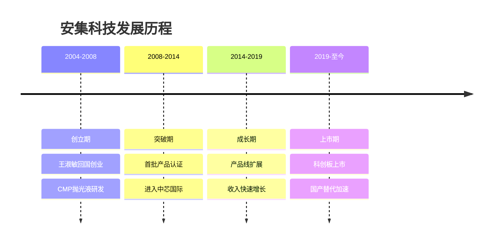
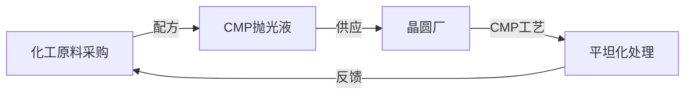
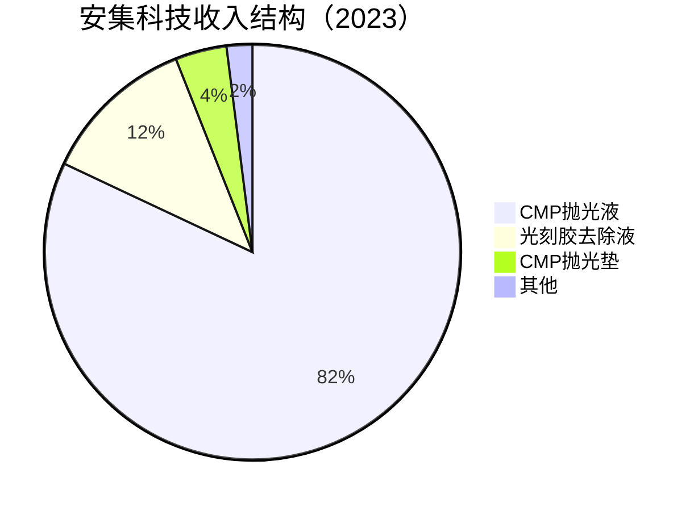
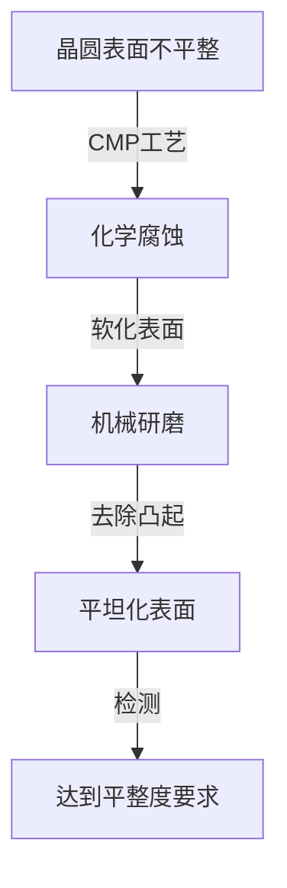
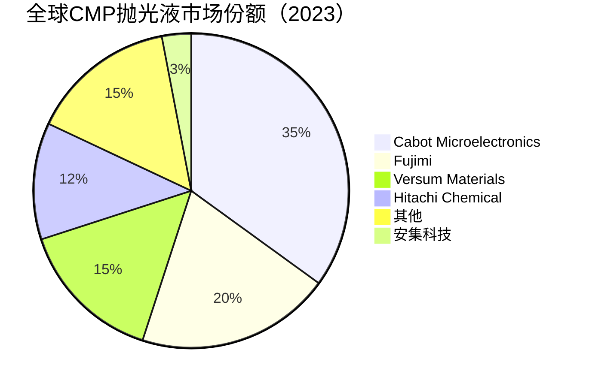

# 安集科技：CMP材料国产突破

## 公司概况

### 基本信息

**公司名称**：安集微电子科技（上海）股份有限公司（Anji Microelectronics Technology）
**股票代码**：688019.SH（科创板）
**成立时间**：2004年
**总部位置**：中国上海
**实际控制人**：王淑敏（创始人）

**业务范围**：
- CMP抛光液：核心业务，占收入80%+
- CMP抛光垫：新兴业务
- 光刻胶去除液：配套产品
- 其他半导体材料

**市值规模**（2023）：
- 市值：约200亿人民币
- 中国CMP抛光液龙头
- 全球CMP抛光液市场份额约3%

### 发展历程

**关键里程碑**：
- 2004年：王淑敏从美国回国创业，成立安集科技
- 2008年：首批CMP抛光液通过中芯国际认证
- 2012年：进入台积电供应链（上海工厂）
- 2015年：CMP抛光液覆盖28nm制程
- 2019年：科创板上市，募资10亿
- 2021年：CMP抛光液覆盖14nm制程
- 2023年：开始布局CMP抛光垫

### 创始人背景

**王淑敏**：
- 教育背景：复旦大学化学系，美国德克萨斯大学博士
- 工作经历：美国Cabot Microelectronics（全球CMP抛光液龙头）研发工程师
- 回国动机：国家号召，填补国内空白
- 创业精神：从0到1，打破国际垄断

**创始人价值**：
- 技术积累：在Cabot积累了10年CMP技术
- 行业人脉：全球CMP行业关系网络
- 战略眼光：早期布局CMP国产化
- 持股：约30%，利益高度一致

## 商业模式分析

### CMP材料供应商模式

**业务模式**：

**产业链位置**：
- 上游：化工原料（磨料、添加剂、溶剂）
- 中游：CMP材料（安集科技）
- 下游：晶圆代工厂（中芯国际、台积电）

**商业模式特点**：
- 配方密集：核心是化学配方，而非设备
- 认证周期：1-2年
- 客户粘性：工艺绑定，不易更换
- 定制化：根据客户工艺定制
- 消耗品：持续消耗，稳定收入

### 业务结构

**按产品分类**：

**按客户分类**：
- 中芯国际：35%
- 台积电（上海）：20%
- 华虹半导体：15%
- 长江存储：10%
- 其他：20%

## CMP技术深度分析

### CMP工艺原理

**什么是CMP**：
CMP（Chemical Mechanical Planarization，化学机械平坦化）是半导体制造中的关键工艺，通过化学腐蚀和机械研磨的协同作用，将晶圆表面平坦化。

**工艺原理**：

**核心作用**：
- 层间平坦化：多层金属互连之间的平坦化
- 浅槽隔离：STI工艺中的平坦化
- 铜互连：铜CMP，去除多余铜
- 钨填充：钨CMP，去除多余钨

**技术要求**：
- 去除速率：均匀、可控
- 选择比：对不同材料的去除速率比
- 平坦度：纳米级平整度
- 缺陷：无划痕、无颗粒残留
- 稳定性：批次间一致性

### CMP抛光液技术

**抛光液组成**：
- 磨料：SiO₂、CeO₂、Al₂O₃纳米颗粒
- 氧化剂：H₂O₂、KIO₃
- 络合剂：有机酸
- 表面活性剂：控制颗粒分散
- pH调节剂：控制化学反应
- 去离子水：溶剂

**关键技术指标**：
- 磨料粒径：20-200nm
- 磨料浓度：1-30%
- pH值：2-12（根据应用）
- 去除速率：100-1000nm/min
- 选择比：1:10-1:100
- 缺陷密度：<0.1个/cm²

**主要产品类型**：

**1. 氧化物CMP抛光液**
- 应用：SiO₂平坦化
- 磨料：SiO₂或CeO₂
- pH：碱性（9-11）
- 去除速率：200-500nm/min
- 应用场景：STI、ILD平坦化

**2. 铜CMP抛光液**
- 应用：铜互连平坦化
- 磨料：SiO₂
- 氧化剂：H₂O₂
- pH：酸性（3-5）
- 去除速率：500-1000nm/min
- 应用场景：铜互连（28nm以下）

**3. 钨CMP抛光液**
- 应用：钨填充平坦化
- 磨料：Al₂O₃
- 氧化剂：H₂O₂或Fe(NO₃)₃
- pH：酸性（2-4）
- 去除速率：200-400nm/min
- 应用场景：接触孔、通孔填充

**4. 阻挡层CMP抛光液**
- 应用：TaN/Ta阻挡层去除
- 磨料：SiO₂
- pH：酸性（3-5）
- 选择比：高选择比
- 应用场景：铜互连阻挡层

### 安集科技产品矩阵

**产品覆盖**：
- 氧化物CMP：成熟产品，28nm已量产
- 铜CMP：核心产品，28nm已量产，14nm认证中
- 钨CMP：重要产品，28nm已量产
- 阻挡层CMP：新产品，认证中

**制程覆盖**：
- 90nm-350nm：成熟制程，稳定供应
- 28nm：主力产品，大批量供应
- 14nm：客户认证中
- 7nm：研发中

**技术突破**：
- 28nm铜CMP：国内首家量产
- 14nm铜CMP：认证中，预计2024年通过
- 低缺陷配方：缺陷密度<0.05个/cm²

### CMP抛光垫

**产品介绍**：
CMP抛光垫是CMP工艺的另一关键耗材，与抛光液配合使用。全球市场约10亿美元，主要被美国Dow（陶氏化学）垄断（70%+市场份额）。

**技术难点**：
- 材料：聚氨酯发泡材料
- 孔隙结构：控制抛光液分布
- 硬度：影响平坦化效果
- 寿命：使用寿命影响成本

**安集布局**：
- 2021年：开始研发CMP抛光垫
- 2023年：样品认证阶段
- 2025年：预计量产
- 市场机会：10亿美元，国产化率<5%

## 市场地位分析

### 全球CMP材料市场

**市场规模**：
- 2023年：约25亿美元（抛光液+抛光垫）
- 抛光液：约15亿美元
- 抛光垫：约10亿美元
- 年增长率：8-10%
- 2025E：30亿美元

**市场格局**：

**竞争特点**：
- 高度集中：美日企业主导
- 技术壁垒：配方复杂，认证周期长
- 定制化：根据客户工艺定制
- 消耗品：稳定的重复购买

### 中国CMP材料市场

**市场规模**：
- 2023年：约6亿美元
- 全球占比：24%
- 年增长率：15%+
- 2025E：8亿美元

**自给率**：
- 整体自给率：约10%
- 成熟制程（90nm+）：约25%
- 先进制程（28nm以下）：约5%
- 目标：2025年达到20%

**国产替代空间**：
- 中国需求：6亿美元
- 国产供应：0.6亿美元
- 进口依赖：5.4亿美元
- 替代空间：巨大

### 安集科技市场地位

**全球排名**：
- CMP抛光液：全球前十
- 中国市场：第一

**市场份额**：
- 全球市场：约3%
- 中国市场：约10%
- 增长趋势：快速提升

**客户结构**：
- 中芯国际：最大客户（35%）
- 台积电（上海）：重要客户（20%）
- 华虹半导体：核心客户（15%）
- 长江存储：新兴客户（10%）
- 其他：20%

## 竞争优势分析

### 1. 技术优势

**配方技术**：
- 自主研发：核心配方专有
- 专利保护：200+专利
- 创始人背景：Cabot技术积累
- 持续研发：研发费用率15%+

**产品能力**：
- 28nm：全系列产品量产
- 14nm：铜CMP认证中
- 低缺陷：行业领先水平
- 定制化：满足客户特殊需求

**技术突破**：
- 铜CMP：国内首家量产
- 低缺陷配方：缺陷密度<0.05个/cm²
- 高选择比：满足先进制程要求

### 2. 客户优势

**战略客户**：
- 中芯国际：最大客户，长期合作
- 台积电（上海）：国际认可
- 华虹半导体：稳定合作
- 长江存储：新兴重要客户

**客户粘性**：
- 工艺绑定：深度嵌入客户工艺
- 认证壁垒：更换成本高
- 定制化：满足特殊需求
- 本地化：快速响应

**台积电认证意义**：
台积电（上海）的认证是安集科技技术实力的重要背书，证明其产品达到国际一流水平，有助于拓展其他国际客户。

### 3. 国产替代优势

**政策支持**：
- 科创板上市：资金支持
- 税收优惠：高新技术企业
- 地方政府：上海产业支持
- 客户意愿：主动国产化

**本地化优势**：
- 快速响应：本地团队
- 技术支持：深度服务
- 成本优势：人力成本低
- 定制化：满足特殊需求

### 4. 轻资产优势

**资产特点**：
- 资本支出小：相对硅片厂
- 现金流好：消耗品，稳定收入
- 毛利率高：技术壁垒
- ROE高：轻资产高回报

**对比重资产**：
- 硅片厂：产线投资50-100亿
- 安集科技：年资本支出3-5亿
- 差距：10-20倍
- 优势：资金效率高

## 财务分析

### 收入分析

**收入增长**：
- 2019年：4亿人民币
- 2020年：5亿
- 2021年：7亿
- 2022年：9亿
- 2023E：12亿
- CAGR（2019-2023）：32%

**收入驱动**：
- 客户拓展：新客户导入
- 产品升级：14nm产品认证
- 国产替代：市场份额提升
- 消耗品：稳定重复购买

### 盈利能力

**毛利率**：
- 2019年：45%
- 2020年：47%
- 2021年：50%
- 2022年：52%
- 2023E：53%

**净利率**：
- 2019年：20%
- 2020年：22%
- 2021年：25%
- 2022年：27%
- 2023E：28%

**ROE**：
- 2022年：25%
- 2023E：28%
- 2025E：35%+

### 财务数据表（2019-2023）

| 指标 | 2019 | 2020 | 2021 | 2022 | 2023E |
|------|------|------|------|------|-------|
| 收入（亿） | 4 | 5 | 7 | 9 | 12 |
| 增长率 | 30% | 25% | 40% | 29% | 33% |
| 毛利率 | 45% | 47% | 50% | 52% | 53% |
| 净利率 | 20% | 22% | 25% | 27% | 28% |
| 净利润（亿） | 0.8 | 1.1 | 1.75 | 2.4 | 3.4 |
| ROE | 20% | 22% | 25% | 27% | 28% |
| 经营现金流（亿） | 1.0 | 1.5 | 2.5 | 3.5 | 5.0 |
| 资本支出（亿） | 1 | 2 | 3 | 4 | 5 |
| 资产负债率 | 25% | 22% | 20% | 18% | 16% |

**财务特点**：
- 轻资产：资本支出小
- 高毛利：技术壁垒带来高毛利（53%）
- 高净利：净利率28%，行业领先
- 高ROE：28%，优秀的资本回报
- 低负债：资产负债率16%，财务健康

## 投资价值评估

### 估值分析

**当前估值（2023）**：
- PE：约60倍
- PS：约17倍
- PB：约15倍
- EV/EBITDA：约40倍

**估值对比**：

| 公司 | PE | PS | PB | 市值（亿美元） | 业务 | 毛利率 | 净利率 |
|------|----|----|----|--------------|----|--------|--------|
| 安集科技 | 60 | 17 | 15 | 28 | CMP抛光液 | 53% | 28% |
| Cabot Micro | 30 | 5 | 4 | 40 | CMP抛光液龙头 | 50% | 20% |
| Fujimi | 25 | 3 | 3 | 15 | CMP抛光液 | 45% | 18% |
| 雅克科技 | 45 | 9 | 8 | 28 | 前驱体+光刻胶 | 43% | 20% |
| 南大光电 | 80 | 15 | 10 | 20 | 光刻胶+MO源 | 40% | 15% |

**估值分析**：
- PE 60倍：高于国际同行（25-35倍）
- 溢价原因：国产替代、高成长性、稀缺性
- 盈利能力：优于国际同行（净利率28% vs 18-20%）
- 成长性：高增长（30%+）支撑高估值

### 投资论点

**看多理由**：
1. 技术壁垒高：CMP配方复杂，竞争者少
2. 盈利能力强：毛利率53%，净利率28%，行业最高
3. 成长性好：收入增长30%+
4. 国产替代：自给率<10%，空间巨大
5. 客户优质：中芯国际、台积电（上海）
6. 轻资产：资本支出小，现金流好
7. 高ROE：28%，优秀的资本回报
8. 创始人：技术背景强，持股30%
9. 抛光垫：新产品线，额外增长点
10. 先进制程：14nm认证中，7nm研发中

**看空理由**：
1. 估值过高：PE 60倍，PS 17倍
2. 规模较小：市值28亿美元
3. 客户集中：前三大客户70%
4. 14nm认证：进展不确定
5. 竞争加剧：国内外竞争者增多
6. 抛光垫：新业务，不确定性高
7. 地缘政治：技术封锁风险

### 投资建议

**适合投资者**：
- 看好国产替代的投资者
- 看好高质量成长股的投资者
- 中长期投资者（3-5年）
- 能承受高估值波动的投资者

**投资策略**：
- 建仓区间：PE 45-55倍
- 持有周期：3-5年
- 目标价：基于PE 60倍，2025年净利润6亿，目标市值360亿
- 止损位：PE < 35倍

**当前建议**：
- 估值偏高：PE 60倍，等待回调
- 长期看好：高质量成长股
- 回调建仓：PE 45-50倍区间

## 行业趋势与机会

### 1. 先进制程CMP需求增长

**制程演进对CMP的影响**：
- 28nm：每片硅片CMP步骤约15次
- 14nm：每片硅片CMP步骤约20次
- 7nm：每片硅片CMP步骤约25次
- 趋势：制程越先进，CMP步骤越多

**需求增长**：
- 中芯国际28nm扩产：月产能从10万片到30万片
- 华虹半导体28nm扩产：月产能从5万片到15万片
- 合计：CMP抛光液需求增长3-5倍

**安集机会**：
- 28nm：已量产，直接受益
- 14nm：认证中，2024年有望量产
- 市场份额：从10%提升至20%+

### 2. 存储芯片CMP需求

**长江存储NAND**：
- 3D NAND：层数越多，CMP步骤越多
- 128层：CMP步骤约30次
- 192层：CMP步骤约40次
- 扩产：月产能从10万片到30万片

**合肥长鑫DRAM**：
- DRAM：CMP步骤约20次
- 扩产：持续扩产
- 安集机会：供应商认证中

**市场影响**：
- 存储芯片扩产：CMP需求增长50%+
- 安集受益：核心供应商地位
- 收入增长：2024-2025年加速

### 3. CMP抛光垫国产化

**市场现状**：
- 全球市场：约10亿美元
- 国产化率：<5%
- 主要供应商：美国Dow（70%+）
- 国产替代：几乎空白

**安集布局**：
- 2021年：开始研发
- 2023年：样品认证
- 2025年：预计量产
- 市场机会：10亿美元，国产化率提升空间大

**协同效应**：
- 抛光液+抛光垫：一站式供应
- 客户粘性：更强
- 收入增长：额外增长点
- 估值提升：平台型公司

## 竞争对手分析

### Cabot Microelectronics（美国卡博特）

**市场地位**：
- 全球第一：CMP抛光液35%市场份额
- 技术领先：全球最强
- 客户：全球主要晶圆厂

**竞争优势**：
- 技术积累：30年+
- 产品线：最全面
- 全球布局：各大晶圆厂附近建厂
- 品牌溢价：高端市场

**财务数据**：
- 毛利率：50%
- 净利率：20%
- ROE：20%+

**安集对比**：
- 技术差距：1代（14nm vs 7nm）
- 规模差距：Cabot 5倍
- 盈利能力：安集更强（净利率28% vs 20%）
- 本地化：安集更有优势

### Fujimi（日本不二越）

**市场地位**：
- 全球第二：CMP抛光液20%市场份额
- 技术：主流水平
- 客户：全球晶圆厂

**竞争优势**：
- 技术积累：40年+
- 产品线：全面
- 日本客户：本地优势

**安集对比**：
- 技术差距：1代
- 规模差距：Fujimi 3倍
- 盈利能力：安集更强
- 中国市场：安集更有优势

### 竞争格局总结

**短期**：国际巨头主导，安集份额提升
**中期**：安集在中国市场份额达到20%+
**长期**：安集成为全球前五CMP材料供应商

## 投资启示

### 1. 消耗品商业模式的价值

**消耗品特点**：
CMP抛光液是典型的消耗品，每次CMP工艺都需要消耗。晶圆厂产能越大，消耗越多。这种商业模式有几个优点：
- 稳定收入：持续重复购买
- 可预测性：收入可预测
- 客户粘性：更换成本高
- 现金流好：稳定的经营现金流

**对比资本品**：
- 设备：一次性购买，收入不稳定
- 材料：持续消耗，收入稳定
- 估值：消耗品通常享有更高估值

### 2. 高毛利率的来源

**技术壁垒**：
安集科技毛利率53%，远高于一般制造业（20-30%）。高毛利率来源于：
- 配方专有：核心配方不可复制
- 认证壁垒：客户认证周期长
- 定制化：满足特殊需求
- 技术服务：提供技术支持

**护城河**：
高毛利率是护城河的体现，也是高估值的基础。只要技术壁垒维持，高毛利率就能持续。

### 3. 创始人背景的重要性

**技术创业**：
安集科技的成功很大程度上依赖于创始人王淑敏的技术背景。她在Cabot积累的10年CMP技术，是公司的核心竞争力来源。

**投资启示**：
在半导体材料领域，技术创业者的背景非常重要。有海外顶级企业工作经验的创始人，往往能带来真正的技术突破。

## 常见问题

### Q1：安集科技的CMP技术水平如何？

**回答**：
安集科技的CMP抛光液技术达到国内领先水平，28nm全系列产品已量产，通过中芯国际、台积电（上海）认证。14nm铜CMP正在认证中，预计2024年通过。与国际巨头（Cabot、Fujimi）相比，仍有1代差距，主要体现在7nm以下先进制程。但在中国市场，安集的本地化优势和快速响应能力是重要竞争优势。

### Q2：CMP抛光垫业务前景如何？

**回答**：
CMP抛光垫是安集科技的重要战略布局。全球市场约10亿美元，国产化率<5%，主要被美国Dow垄断。安集2021年开始研发，2023年进入样品认证阶段，预计2025年量产。如果成功，将形成抛光液+抛光垫的一站式供应，大幅提升客户粘性和收入规模。这是重要的增长催化剂。

### Q3：估值60倍PE是否合理？

**回答**：
PE 60倍相对偏高，但考虑到：盈利能力强（净利率28%，行业最高）、成长性好（30%+）、国产替代空间大、技术壁垒高，有一定合理性。如果2025年净利润达到6亿，按PE 50倍，目标市值300亿，相对当前200亿有50%上涨空间。建议等待回调至PE 45-50倍区间再建仓。

### Q4：客户集中度风险如何？

**回答**：
前三大客户（中芯国际、台积电上海、华虹半导体）占收入约70%，客户集中度较高。但这三家都是中国最重要的晶圆厂，长期需求稳定。随着长江存储、合肥长鑫等新客户导入，客户集中度将逐步降低。建议关注客户结构变化。

### Q5：安集科技vs雅克科技，如何选择？

**回答**：
两者各有特点：安集科技专注CMP材料，技术更专精，盈利能力更强（净利率28% vs 20%），但估值更高（PE 60倍 vs 45倍）；雅克科技产品线更全面（前驱体+光刻胶+特气），成长空间更大，估值更低。如果看好CMP国产化，安集更合适；如果看好半导体材料平台，雅克更合适。两者可以组合配置。

### Q6：14nm认证通过后有多大影响？

**回答**：
14nm认证通过将是重大催化剂。14nm制程的CMP步骤比28nm多30%，单片硅片消耗的抛光液更多，价格也更高。中芯国际14nm产能约5万片/月，如果安集成为主要供应商，预计每年新增收入1-2亿元，对当前12亿收入有10-15%的增量贡献。

## 延伸阅读

### 推荐书籍

1. **《化学机械平坦化技术》** - 相关学术著作
2. **《半导体制造技术》** - 迈克尔·夸克
3. **《芯片战争》** - 克里斯·米勒
4. **《半导体材料》** - 蒋民华
5. **《纳米材料与技术》** - 相关学术著作

### 研究报告

- 中金公司：《安集科技深度报告》（2023）
- 招商证券：《CMP材料国产替代》（2023）
- 天风证券：《半导体材料行业研究》（2023）
- 华泰证券：《安集科技竞争力分析》（2023）
- 国泰君安：《CMP材料市场分析》（2023）

### 行业资讯

- 集微网：半导体材料新闻
- 芯思想：半导体行业分析
- 半导体行业观察：深度报道
- EE Times：国际半导体资讯

## 参考文献

1. 安集科技. 《年度报告》. 2019-2023
2. 安集科技. 《首次公开发行股票并在科创板上市招股说明书》. 2019
3. SEMI. 《全球半导体材料市场报告》. 2023
4. IC Insights. 《CMP材料市场预测》. 2023
5. 中金公司. 《安集科技深度报告》. 2023
6. 招商证券. 《CMP材料国产替代路径》. 2023
7. 天风证券. 《半导体材料行业研究》. 2023
8. 华泰证券. 《安集科技竞争力分析》. 2023
9. Cabot Microelectronics. 《年度报告》. 2023
10. Fujimi. 《年度报告》. 2023
11. 中芯国际. 《年度报告》. 2023
12. 长江存储. 《公司公告》. 2023
13. 中国半导体行业协会. 《中国集成电路产业发展报告》. 2023
14. Gartner. 《半导体材料市场分析》. 2023
15. IHS Markit. 《CMP材料市场研究》. 2023

---

**投资建议**：
安集科技是中国CMP抛光液龙头，技术壁垒高，盈利能力强（毛利率53%，净利率28%），成长性好（收入增长30%+），是半导体材料领域的高质量成长股。公司28nm全系列产品已量产，14nm认证中，CMP抛光垫布局中，受益于国产替代和先进制程扩产。

当前估值PE 60倍偏高，建议等待回调至PE 45-50倍区间建仓，持有3-5年，目标市值300-360亿（基于2025年净利润6亿，PE 50-60倍）。适合看好国产替代、能承受高估值波动的中长期投资者。

**风险提示**：
需关注估值偏高（PE 60倍）、14nm认证进展不确定、客户集中度高（前三大70%）、CMP抛光垫新业务不确定性、国际巨头降价竞争、地缘政治风险。建议仓位控制在5%以内，设置止损位（PE < 35倍）。

---

[← 返回半导体行业](index.html)
