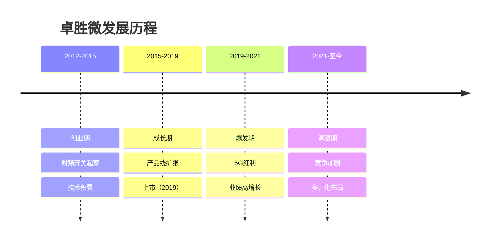
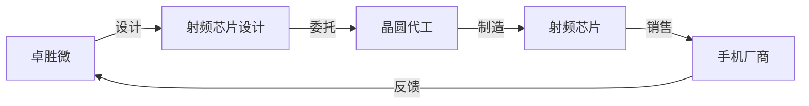
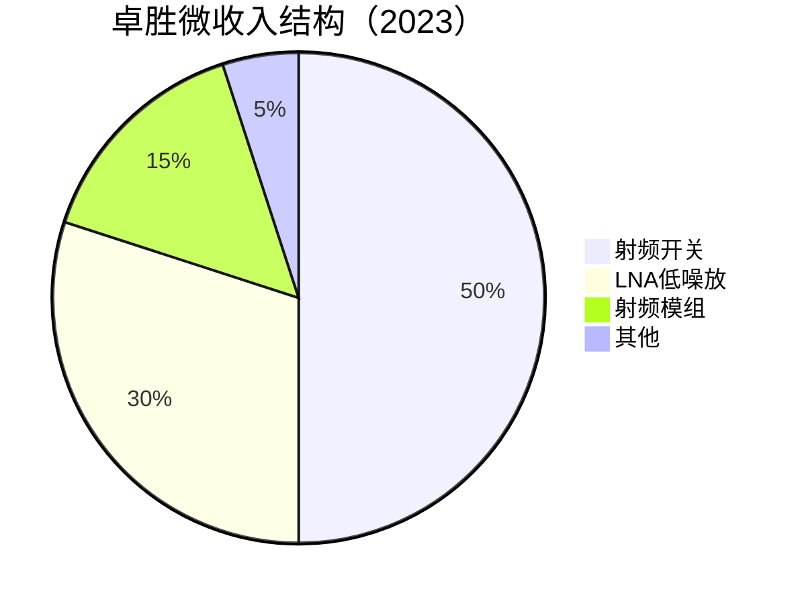
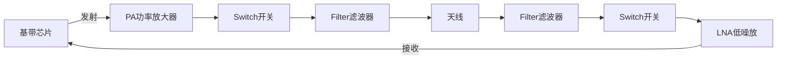
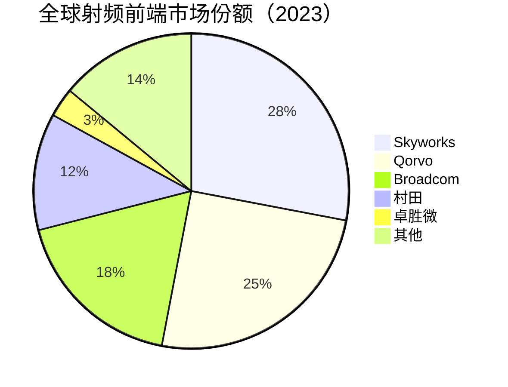

# 卓胜微：中国射频芯片国产替代先锋

## 公司概况

### 基本信息

**公司名称**：江苏卓胜微电子股份有限公司（Awinic Technology）
**股票代码**：300782.SZ（创业板）
**成立时间**：2012年9月
**总部位置**：中国江苏常州
**创始人**：许志翰

**业务范围**：
- 射频前端芯片：核心业务
- 射频开关：Switch
- 射频低噪声放大器：LNA
- 射频功率放大器：PA
- 射频滤波器：Filter
- 应用领域：手机、物联网、Wi-Fi

**市值规模**（2023）：
- 市值：约600亿人民币
- 中国最大射频芯片设计公司
- 全球射频前端市场份额约3%

### 发展历程

**关键里程碑**：
- 2012年：公司成立，专注射频开关
- 2015年：进入三星供应链
- 2017年：进入小米供应链
- 2019年：创业板上市
- 2020年：5G射频芯片量产
- 2021年：收入突破30亿
- 2023年：Wi-Fi 6/7芯片布局

### 创始人背景

**许志翰**：
- 教育背景：清华大学电子工程系
- 工作经历：Skyworks工程师
- 创业动机：射频芯片国产替代
- 持股比例：约30%
- 管理风格：技术驱动、稳健经营

## 商业模式分析

### Fabless模式

**无晶圆厂模式**：
- 专注芯片设计
- 委托代工制造
- 轻资产运营
- 高毛利率

**产业链位置**：

**代工合作伙伴**：
- 稳懋半导体：GaAs工艺
- 宏捷科技：GaAs工艺
- 台积电：CMOS工艺
- 中芯国际：部分产品

### 业务结构

**按产品分类**：

**按应用分类**：
- 手机：85%
- Wi-Fi/IoT：10%
- 其他：5%

**按客户分类**：
- 三星：40%
- 小米：25%
- OPPO/vivo：20%
- 其他：15%

## 射频芯片技术分析

### 射频前端概述

**射频前端作用**：
- 信号发射：将基带信号转换为射频信号
- 信号接收：将射频信号转换为基带信号
- 信号处理：放大、滤波、开关

**射频前端架构**：

**射频前端价值量**：
- 2G/3G：2-3美元
- 4G：8-10美元
- 5G：15-25美元
- 5G增长驱动：频段增加、MIMO技术

### 卓胜微产品矩阵

**1. 射频开关（Switch）**

**技术原理**：
- 信号路径切换
- 多频段支持
- 低插损、高隔离度

**产品规格**：
- 频段：0.6GHz-6GHz
- 插损：<0.5dB
- 隔离度：>30dB
- 功率：>35dBm

**市场地位**：
- 全球市场份额：5%+
- 中国市场份额：30%+
- 主要竞争对手：Skyworks、Qorvo

**应用场景**：
- 手机：多频段切换
- Wi-Fi：2.4G/5G切换
- IoT：低功耗应用

**2. 低噪声放大器（LNA）**

**技术原理**：
- 接收信号放大
- 低噪声系数
- 高线性度

**产品规格**：
- 频段：0.6GHz-6GHz
- 噪声系数：<1dB
- 增益：>15dB
- 功耗：<10mA

**市场地位**：
- 全球市场份额：3%+
- 中国市场份额：20%+
- 快速成长中

**应用场景**：
- 手机：接收信号放大
- 基站：信号增强
- Wi-Fi：接收灵敏度提升

**3. 射频模组**

**技术原理**：
- 集成多个射频器件
- PA+Switch+Filter
- 系统级封装

**产品优势**：
- 集成度高：节省空间
- 性能优化：整体调试
- 成本降低：规模效应

**市场地位**：
- 起步阶段
- 主要竞争对手：Skyworks、Qorvo、村田
- 技术差距：1-2代

**4. 滤波器（Filter）**

**技术路线**：
- SAW滤波器：声表面波
- BAW滤波器：体声波
- FBAR滤波器：薄膜体声波

**研发进展**：
- SAW：已量产
- BAW：研发中
- 目标：5G高频段

### 技术优势

**设计能力**：
- 射频电路设计：10年+经验
- 系统级优化：整体性能
- 快速迭代：6-12个月

**工艺平台**：
- GaAs工艺：高性能
- CMOS工艺：低成本
- SOI工艺：平衡性能

**专利储备**：
- 专利数量：500+
- 核心专利：射频开关、LNA
- 专利布局：全球主要市场

## 市场地位分析

### 全球射频前端市场

**市场规模**：
- 2023年：约250亿美元
- 年增长率：10-12%
- 2025E：300亿美元
- 驱动因素：5G渗透、频段增加

**市场格局**：

**竞争格局**：
- 第一梯队：Skyworks、Qorvo（美国）
- 第二梯队：Broadcom、村田（美日）
- 第三梯队：卓胜微、飞骧科技（中国）

### 卓胜微市场地位

**全球排名**：
- 整体市场：第五
- 射频开关：前五
- LNA：前十
- 中国市场：第一

**市场份额变化**：
- 2019年：1%
- 2020年：2%
- 2021年：3%
- 2022年：3%
- 2023年：3%+

**客户结构**：
- 三星：最大客户（40%）
- 小米：核心客户（25%）
- OPPO/vivo：重要客户（20%）
- 其他：15%

**增长驱动**：
- 5G渗透：射频价值量提升
- 国产替代：供应链安全
- 客户拓展：新客户导入
- 产品升级：模组化

## 竞争优势分析

### 1. 技术优势

**产品性能**：
- 射频开关：性能接近国际水平
- LNA：快速追赶中
- 模组：起步阶段

**研发能力**：
- 研发人员：300+
- 研发费用率：15%+
- 研发周期：6-12个月

**技术积累**：
- 射频设计：10年+经验
- 工艺平台：GaAs、CMOS、SOI
- 专利储备：500+

### 2. 客户优势

**优质客户**：
- 三星：全球第一手机厂商
- 小米：中国前三手机厂商
- OPPO/vivo：中国前五手机厂商

**客户粘性**：
- 技术支持：本地团队
- 快速响应：定制化开发
- 长期合作：战略伙伴

**客户拓展**：
- 华为：积极导入
- 荣耀：合作中
- 海外客户：拓展中

### 3. 成本优势

**设计成本**：
- 本地研发：成本低30%+
- 快速迭代：效率高

**制造成本**：
- 代工议价：规模效应
- 供应链：本地化

**价格优势**：
- 比国际厂商低20-30%
- 性价比高

### 4. 国产替代优势

**供应链安全**：
- 客户主动转单
- 本地化服务
- 快速响应

**政策支持**：
- 国产芯片优先
- 税收优惠
- 产业基金

## 财务分析

### 收入分析

**收入增长**：
- 2018年：5亿人民币
- 2019年：10亿（上市）
- 2020年：20亿
- 2021年：32亿
- 2022年：28亿
- 2023E：25亿
- CAGR（2018-2023）：38%

**收入驱动**：
- 2019-2021：5G红利，高增长
- 2022-2023：竞争加剧，增速放缓
- 未来：多元化布局，稳定增长

**收入结构变化**：
- 射频开关：占比从70%降至50%
- LNA：占比从20%升至30%
- 模组：新增长点

### 盈利能力

**毛利率**：
- 2019年：50%
- 2020年：55%
- 2021年：58%
- 2022年：52%
- 2023E：50%

**毛利率驱动**：
- 产品结构：高端产品占比
- 竞争加剧：价格压力
- 规模效应：成本摊薄

**净利率**：
- 2020年：35%
- 2021年：40%
- 2022年：32%
- 2023E：30%

**ROE**：
- 2021年：45%
- 2022年：28%
- 2023E：22%

### 现金流

**经营现金流**：
- 2021年：15亿+
- 2022年：12亿+
- 2023E：10亿+
- 现金流稳定

**资本支出**：
- 年资本支出：1-2亿
- 主要用于：研发设备、测试设备
- 轻资产模式

**现金储备**：
- 现金及等价物：30亿+
- 资产负债率：10%
- 财务极其健康

### 财务健康度

**资产负债表**：
- 资产负债率：10%
- 流动比率：8.0
- 速动比率：7.0

**偿债能力**：
- 几乎无负债
- 现金充裕
- 财务风险：极低

**财务数据表（2019-2023）**：

| 指标 | 2019 | 2020 | 2021 | 2022 | 2023E |
|------|------|------|------|------|-------|
| 收入（亿） | 10 | 20 | 32 | 28 | 25 |
| 增长率 | 100% | 100% | 60% | -12% | -11% |
| 毛利率 | 50% | 55% | 58% | 52% | 50% |
| 净利率 | 30% | 35% | 40% | 32% | 30% |
| 净利润（亿） | 3 | 7 | 13 | 9 | 7.5 |
| ROE | 35% | 40% | 45% | 28% | 22% |
| 经营现金流（亿） | 3 | 8 | 15 | 12 | 10 |

## 投资价值评估

### 估值分析

**历史估值区间**：
- PE：40-150倍
- PS：15-50倍
- PB：10-35倍

**当前估值（2023）**：
- PE：约80倍
- PS：约24倍
- PB：约18倍

**估值对比**：

| 公司 | PE | PS | PB | 市值（亿美元） | 业务 | 增长率 |
|------|----|----|----|--------------|----|--------|
| 卓胜微 | 80 | 24 | 18 | 85 | 射频芯片 | -10% |
| 韦尔股份 | 40 | 5 | 6 | 200 | CIS+模拟 | 8% |
| 兆易创新 | 35 | 7 | 7 | 110 | 存储+MCU | 10% |
| Skyworks | 15 | 4 | 3 | 150 | 射频龙头 | 5% |
| Qorvo | 18 | 3 | 2 | 100 | 射频龙头 | 3% |

**估值分析**：
- 卓胜微估值明显偏高
- PE 80倍 vs 行业平均30-40倍
- 增长率为负，估值不匹配
- 市场给予国产替代溢价

### 投资论点

**看多理由**：
1. **射频龙头**：中国第一，全球前五
2. **技术领先**：射频开关性能接近国际水平
3. **客户优质**：三星、小米、OPPO/vivo
4. **国产替代**：受益于供应链安全
5. **财务健康**：现金充裕，无负债
6. **成长空间**：5G渗透、Wi-Fi 6/7、IoT
7. **管理优秀**：技术驱动、稳健经营

**看空理由**：
1. **估值过高**：PE 80倍，严重透支未来
2. **增长放缓**：2022-2023连续负增长
3. **竞争加剧**：Skyworks、Qorvo降价
4. **客户集中**：前三大客户占85%
5. **技术差距**：与国际巨头仍有差距
6. **手机市场**：饱和，增长有限
7. **毛利率下降**：从58%降至50%

### 投资建议

**适合投资者**：
- 看好射频芯片的投资者
- 看好国产替代的投资者
- 能承受高估值波动的投资者
- 长期投资者（3-5年）

**投资策略**：
- 建仓区间：80-100元（当前约150元）
- 持有周期：3-5年
- 目标价：200元+（需业绩恢复增长）
- 止损位：60元

**风险控制**：
- 仓位：不超过5%（估值过高）
- 关注：手机出货量、客户拓展、毛利率
- 调整：根据业绩动态调整

**当前建议**：
- 观望为主：估值过高，增长放缓
- 等待回调：80-100元区间考虑建仓
- 长期看好：国产替代逻辑不变

## 行业趋势与机会

### 1. 5G持续渗透

**5G渗透率**：
- 2020年：20%
- 2021年：40%
- 2022年：60%
- 2023年：75%
- 2025E：90%+

**射频价值量提升**：
- 4G：8-10美元
- 5G：15-25美元
- 增长：50-150%

**频段增加**：
- 4G：5-7个频段
- 5G：10-15个频段
- 射频器件数量翻倍

### 2. Wi-Fi 6/7升级

**市场规模**：
- 2023年：50亿美元
- 2025E：80亿美元
- CAGR：25%+

**技术升级**：
- Wi-Fi 6：6GHz以下
- Wi-Fi 6E：6GHz
- Wi-Fi 7：更高速率

**卓胜微布局**：
- Wi-Fi 6：已量产
- Wi-Fi 6E：研发中
- Wi-Fi 7：预研

### 3. IoT物联网

**市场规模**：
- 2023年：30亿美元
- 2025E：50亿美元
- CAGR：30%+

**应用场景**：
- 智能家居：路由器、音箱
- 可穿戴：手表、手环
- 工业：传感器、网关

**技术要求**：
- 低功耗：电池供电
- 小尺寸：集成度高
- 低成本：大规模应用

### 4. 汽车电子

**市场规模**：
- 2023年：20亿美元
- 2025E：40亿美元
- CAGR：40%+

**应用场景**：
- V2X：车联网
- 车载Wi-Fi：娱乐系统
- 雷达：毫米波雷达

**技术要求**：
- 车规级：高可靠性
- 宽温度：-40°C至125°C
- 长寿命：15年+

## 竞争对手分析

### Skyworks（思佳讯）

**市场地位**：
- 全球第一：28%市场份额
- 技术领先：PA+Switch+Filter
- 客户：苹果、三星、华为

**竞争优势**：
- 技术积累：30年+
- 垂直整合：自有晶圆厂
- 品牌溢价：高端市场

**卓胜微对比**：
- 技术差距：2-3代
- 市场份额：Skyworks 10倍
- 成本优势：卓胜微更低
- 客户：部分重叠（三星）

### Qorvo

**市场地位**：
- 全球第二：25%市场份额
- 技术领先：GaN技术
- 客户：苹果、三星、小米

**竞争优势**：
- 技术领先：GaN PA
- 产品线完整：PA+Switch+Filter
- 规模效应：成本低

**卓胜微对比**：
- 技术差距：2-3代
- 市场份额：Qorvo 8倍
- 成本优势：卓胜微更低
- 客户：部分重叠（三星、小米）

### 飞骧科技

**市场地位**：
- 中国第二：射频芯片
- 技术：追赶卓胜微
- 客户：OPPO、vivo、小米

**竞争优势**：
- 技术：接近卓胜微
- 客户：部分重叠
- 价格：更低

**卓胜微对比**：
- 技术：卓胜微领先
- 市场份额：卓胜微2倍
- 客户：部分重叠
- 竞争：日益激烈

## 投资启示

### 1. 国产替代的机遇与挑战

**机遇**：
- 供应链安全：客户主动转单
- 政策支持：国产芯片优先
- 本地化：技术支持、快速响应
- 成本优势：价格低20-30%

**挑战**：
- 技术差距：2-3代
- 品牌认知：国际巨头强势
- 客户认证：周期长
- 竞争加剧：国际巨头降价

### 2. 高估值的风险

**估值过高**：
- PE 80倍 vs 行业平均30-40倍
- 增长率为负，估值不匹配
- 市场给予过高溢价

**风险**：
- 业绩不达预期：估值回归
- 竞争加剧：毛利率下降
- 手机市场：增长有限

### 3. 多元化布局的必要性

**手机市场**：
- 饱和：增长有限
- 竞争：激烈
- 依赖度：85%

**多元化**：
- Wi-Fi：新增长点
- IoT：长期空间
- 汽车：高成长

### 4. 技术突破的重要性

**当前瓶颈**：
- PA：技术差距大
- 滤波器：BAW未突破
- 模组：起步阶段

**突破方向**：
- PA：GaN技术
- 滤波器：BAW/FBAR
- 模组：系统级封装

## 常见问题

### Q1：卓胜微能追上Skyworks吗？

**回答**：
- 短期：不可能
- 中期：缩小差距
- 长期：中国市场有机会
- 关键：技术突破、客户拓展

**差距分析**：
- 技术：2-3代
- 市场份额：10倍
- 品牌：Skyworks更强
- 成本：卓胜微更低

### Q2：为什么估值这么高？

**回答**：
- 国产替代：市场给予溢价
- 稀缺性：中国射频龙头
- 财务健康：现金充裕、无负债
- 长期空间：5G、Wi-Fi、IoT

**风险**：
- 估值过高：PE 80倍
- 增长放缓：2022-2023负增长
- 竞争加剧：毛利率下降

### Q3：什么时候买入卓胜微？

**回答**：
- 估值：PE < 50倍
- 股价：80-100元（当前约150元）
- 时机：业绩恢复增长、新客户导入
- 策略：等待回调，分批建仓

### Q4：卓胜微vs韦尔股份，选哪个？

**回答**：
- 卓胜微：射频芯片，高估值，高风险
- 韦尔股份：CIS龙头，估值合理，稳健
- 建议：韦尔股份更优，卓胜微等待回调

### Q5：手机市场饱和怎么办？

**回答**：
- 5G渗透：射频价值量提升
- 多元化：Wi-Fi、IoT、汽车
- 客户拓展：华为、荣耀、海外
- 产品升级：模组化

### Q6：竞争加剧怎么应对？

**回答**：
- 技术突破：PA、滤波器
- 成本控制：提升竞争力
- 客户粘性：深度合作
- 多元化：降低依赖

## 延伸阅读

### 推荐书籍

1. **《射频电路设计》** - 克里斯·博维克
2. **《射频微电子学》** - 拉扎维
3. **《5G移动通信技术》** - 尤肖虎
4. **《芯片战争》** - 克里斯·米勒

### 研究报告

- 卓胜微年报和季报
- 各大券商卓胜微深度报告
- 射频芯片行业研究报告
- 5G产业链研究报告

### 行业资讯

- Yole：射频前端市场报告
- Strategy Analytics：5G手机市场
- Counterpoint：手机产业链研究
- IC Insights：全球半导体市场

## 参考文献

1. 卓胜微. 《年度报告》. 2019-2023
2. Yole. 《射频前端市场研究》. 2023
3. Strategy Analytics. 《5G手机市场预测》. 2023
4. IC Insights. 《全球射频芯片市场报告》. 2023
5. 中金公司. 《卓胜微深度报告》. 2023
6. 招商证券. 《卓胜微投资价值分析》. 2023
7. 天风证券. 《射频芯片行业研究》. 2023
8. 华泰证券. 《卓胜微竞争力分析》. 2023
9. Counterpoint. 《全球手机市场报告》. 2023
10. 克里斯·米勒. 《芯片战争》. 2022
11. Skyworks. 《年度报告》. 2023
12. Qorvo. 《年度报告》. 2023

---

**投资建议**：
卓胜微是中国射频芯片龙头，全球市场份额第五，受益于5G渗透、国产替代等驱动。技术领先（射频开关）、客户优质（三星、小米）、财务健康（现金充裕、无负债）。但当前估值过高（PE 80倍），增长放缓（2022-2023负增长），竞争加剧（毛利率下降）。建议观望为主，等待回调至80-100元区间考虑建仓，长期持有3-5年，目标价200元+。

**风险提示**：
需要关注估值过高风险、增长放缓、竞争加剧（Skyworks、Qorvo降价）、客户集中度高（前三大85%）、手机市场饱和、技术突破不确定性等风险。建议仓位控制在5%以内，设置止损位60元，密切跟踪手机出货量、客户拓展、毛利率变化和竞争格局。

---

[← 返回半导体行业](index.html)
