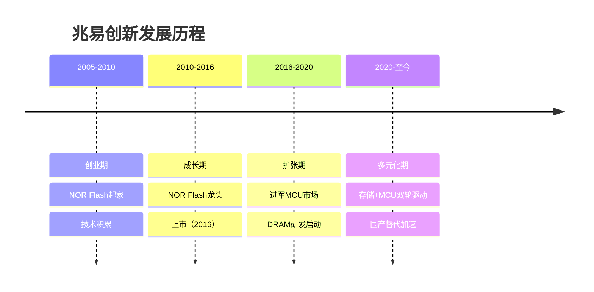
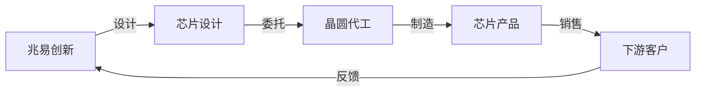
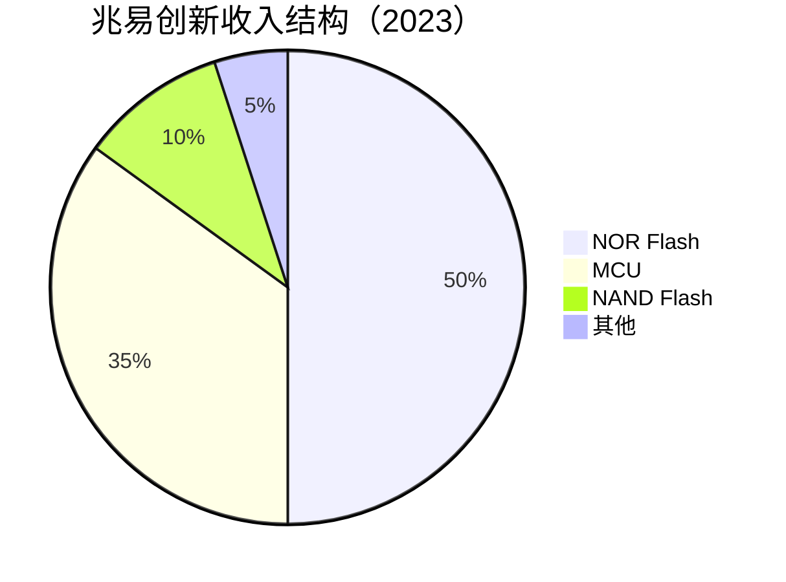
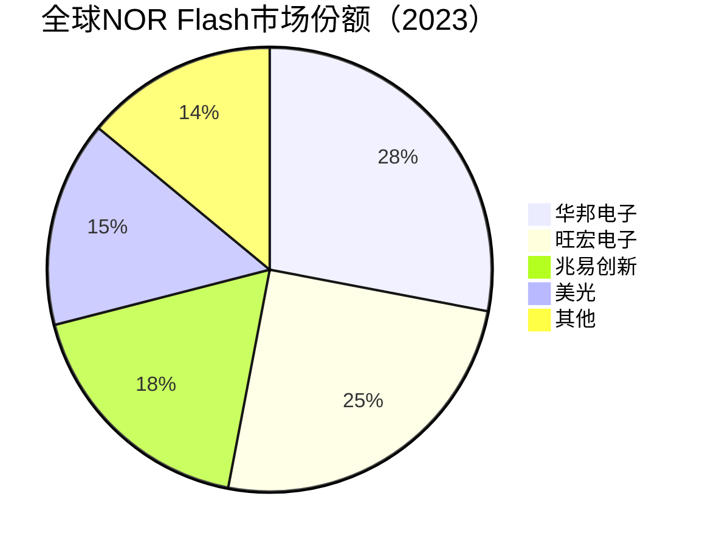

# 兆易创新：中国存储芯片与MCU双龙头

## 公司概况

### 基本信息

**公司名称**：兆易创新科技集团股份有限公司（GigaDevice）
**股票代码**：603986.SH（上海主板）
**成立时间**：2005年4月
**总部位置**：中国北京
**创始人**：朱一明

**业务范围**：
- NOR Flash：全球前三
- NAND Flash：快速成长
- MCU：中国前三
- DRAM：研发中
- 应用领域：消费电子、工业、汽车、物联网

**市值规模**（2023）：
- 市值：约800亿人民币
- 中国最大存储芯片设计公司
- 中国MCU市场前三

### 发展历程

**关键里程碑**：
- 2005年：公司成立，专注NOR Flash
- 2010年：NOR Flash进入全球前五
- 2016年：上海主板上市
- 2017年：推出首款MCU产品
- 2018年：收购思立微（指纹芯片）
- 2020年：NOR Flash全球第三
- 2021年：MCU中国前三
- 2023年：DRAM研发取得突破

### 创始人背景

**朱一明**：
- 教育背景：清华大学电子工程系
- 工作经历：中芯国际、飞索半导体
- 创业动机：存储芯片国产替代
- 持股比例：约15%
- 管理风格：技术驱动、稳健经营

## 商业模式分析

### Fabless模式

**无晶圆厂模式**：
- 专注芯片设计
- 委托代工制造
- 轻资产运营
- 高毛利率

**产业链位置**：

**代工合作伙伴**：
- 中芯国际：主要合作伙伴
- 华虹半导体：NOR Flash
- 台积电：部分产品
- 长江存储：NAND Flash

### 业务结构

**按产品分类**：

**按应用分类**：
- 消费电子：40%
- 工业控制：25%
- 汽车电子：20%
- 通信设备：10%
- 其他：5%

**按客户分类**：
- 中国客户：70%
- 海外客户：30%
- 前五大客户：35%

## 产品技术分析

### 1. NOR Flash

**技术原理**：
- 非易失性存储：断电数据不丢失
- 随机访问：可直接执行代码
- 高可靠性：擦写次数10万次+
- 应用场景：代码存储、数据存储

**技术能力**：
- 制程：55nm-24nm
- 容量：512Kb-2Gb
- 接口：SPI、Quad SPI、Octal SPI
- 速度：最高400MHz

**市场地位**：

**竞争优势**：
- 产品线完整：512Kb-2Gb全覆盖
- 技术领先：24nm制程
- 成本优势：中国制造
- 客户粘性：本地化服务

**应用领域**：
- 手机：BIOS、固件
- 汽车：仪表盘、ADAS
- 工业：PLC、变频器
- 物联网：智能家居、可穿戴

### 2. MCU（微控制器）

**技术原理**：
- 集成CPU、存储、外设
- 嵌入式应用：控制、计算
- 低功耗：电池供电
- 高可靠性：工业级、车规级

**技术平台**：
- ARM Cortex-M：主流架构
- RISC-V：新兴架构
- 32位：主力产品
- 8位：传统产品

**产品矩阵**：
- GD32 F系列：通用MCU
- GD32 E系列：低功耗MCU
- GD32 W系列：无线MCU
- GD32 A系列：车规级MCU

**技术参数**：
- 主频：最高600MHz
- Flash：最高3MB
- RAM：最高1MB
- 外设：丰富的接口

**市场地位**：
- 全球排名：前十
- 中国排名：前三
- 市场份额：5%+（中国）
- 增速：30%+

**竞争对手**：
- 国际：ST、NXP、Microchip、TI
- 国内：中颖电子、芯海科技、国民技术

**竞争优势**：
- 性价比：价格低30%+
- 生态完善：开发工具、社区
- 本地化：技术支持、快速响应
- 产品线：覆盖主流应用

**应用领域**：
- 工业控制：电机控制、传感器
- 消费电子：家电、玩具
- 汽车电子：车身控制、仪表
- 物联网：智能家居、可穿戴

### 3. NAND Flash

**技术原理**：
- 非易失性存储
- 大容量存储
- 顺序访问：不能直接执行代码
- 高密度：成本低
- 应用场景：数据存储

**技术路线**：
- SLC：单层存储，高可靠
- MLC：多层存储，平衡性能
- TLC：三层存储，高密度
- QLC：四层存储，超高密度

**产品布局**：
- SPI NAND：小容量，低成本
- eMMC：中等容量，嵌入式
- UFS：高性能，手机存储

**市场地位**：
- 起步阶段：市场份额<5%
- 快速成长：年增长50%+
- 合作伙伴：长江存储

**应用领域**：
- 消费电子：手机、平板
- 工业：数据记录、监控
- 汽车：车载娱乐、地图
- 物联网：智能音箱、摄像头

### 4. DRAM（研发中）

**技术挑战**：
- 技术难度：最高
- 资本投入：巨大
- 专利壁垒：高
- 市场垄断：三星、SK海力士、美光

**研发进展**：
- 19nm制程：研发中
- DDR4：目标产品
- 产能规划：合肥基地
- 量产时间：2025年+

**战略意义**：
- 完善产品线：存储全覆盖
- 国产替代：DRAM自给率<5%
- 市场空间：千亿级市场
- 长期价值：战略布局

## 市场地位分析

### 全球存储芯片市场

**NOR Flash市场**：
- 市场规模：30亿美元（2023）
- 年增长率：5-8%
- 应用：代码存储、嵌入式

**MCU市场**：
- 市场规模：200亿美元（2023）
- 年增长率：8-10%
- 应用：工业、汽车、消费

**NAND Flash市场**：
- 市场规模：600亿美元（2023）
- 年增长率：10-15%
- 应用：数据存储

**DRAM市场**：
- 市场规模：1000亿美元（2023）
- 年增长率：5-8%
- 应用：计算、服务器

### 兆易创新市场地位

**NOR Flash**：
- 全球排名：第三
- 市场份额：18%
- 增长：稳定

**MCU**：
- 全球排名：前十
- 中国排名：前三
- 市场份额：5%（中国）
- 增长：30%+

**NAND Flash**：
- 起步阶段
- 快速成长
- 市场份额：<5%

## 竞争优势分析

### 1. 技术优势

**NOR Flash**：
- 24nm制程：全球领先
- 产品线完整：512Kb-2Gb
- 性能优异：速度、可靠性

**MCU**：
- 600MHz主频：业界领先
- RISC-V架构：新兴生态
- 车规级：AEC-Q100认证

**研发能力**：
- 研发人员：1000+
- 研发费用率：15%+
- 专利数量：2000+

### 2. 客户优势

**NOR Flash客户**：
- 手机：小米、OPPO、vivo
- 汽车：比亚迪、特斯拉
- 工业：西门子、施耐德

**MCU客户**：
- 工业：汇川技术、英威腾
- 消费：美的、格力
- 汽车：比亚迪、长城

**客户粘性**：
- 技术支持：本地团队
- 快速响应：定制化开发
- 长期合作：战略伙伴

### 3. 成本优势

**规模效应**：
- 出货量大：成本摊薄
- 采购议价：原材料成本低
- 制造效率：良率高

**供应链优势**：
- 本地代工：中芯国际、华虹
- 快速响应：交期短
- 定制化：满足特殊需求

### 4. 国产替代优势

**政策支持**：
- 国产芯片优先
- 供应链安全
- 本地化服务

**客户粘性**：
- 技术支持：本地团队
- 响应速度：快速迭代
- 定制化：满足特殊需求

## 财务分析

### 收入分析

**收入增长**：
- 2018年：30亿人民币
- 2019年：32亿
- 2020年：40亿
- 2021年：80亿
- 2022年：100亿
- 2023E：110亿
- CAGR（2018-2023）：30%+

**收入驱动**：
- NOR Flash：涨价+份额提升
- MCU：快速渗透
- NAND Flash：新增长点
- 国产替代：客户转单

**收入结构变化**：
- NOR Flash占比：从80%降至50%
- MCU占比：从10%升至35%
- 多元化：降低单一产品依赖

### 盈利能力

**毛利率**：
- 2019年：35%
- 2020年：40%
- 2021年：50%
- 2022年：45%
- 2023E：42%

**毛利率驱动**：
- 产品涨价：供需紧张
- 产品结构：MCU占比提升
- 规模效应：成本摊薄
- 竞争加剧：价格压力

**净利率**：
- 2020年：20%
- 2021年：30%
- 2022年：25%
- 2023E：22%

**ROE**：
- 2021年：35%
- 2022年：28%
- 2023E：25%

### 现金流

**经营现金流**：
- 2021年：30亿+
- 2022年：25亿+
- 2023E：28亿+
- 现金流稳定

**资本支出**：
- 年资本支出：3-5亿
- 主要用于：研发设备、测试设备
- 轻资产模式

**现金储备**：
- 现金及等价物：40亿+
- 资产负债率：20%
- 财务健康

### 财务健康度

**资产负债表**：
- 资产负债率：20%
- 流动比率：3.0
- 速动比率：2.5

**偿债能力**：
- 利息覆盖倍数：50+倍
- 债务/EBITDA：<0.5倍
- 财务风险：极低

**财务数据表（2019-2023）**：

| 指标 | 2019 | 2020 | 2021 | 2022 | 2023E |
|------|------|------|------|------|-------|
| 收入（亿） | 32 | 40 | 80 | 100 | 110 |
| 增长率 | 7% | 25% | 100% | 25% | 10% |
| 毛利率 | 35% | 40% | 50% | 45% | 42% |
| 净利率 | 15% | 20% | 30% | 25% | 22% |
| 净利润（亿） | 5 | 8 | 24 | 25 | 24 |
| ROE | 20% | 25% | 35% | 28% | 25% |
| 经营现金流（亿） | 8 | 12 | 30 | 25 | 28 |

## 投资价值评估

### 估值分析

**历史估值区间**：
- PE：25-70倍
- PS：6-15倍
- PB：5-12倍

**当前估值（2023）**：
- PE：约35倍
- PS：约7倍
- PB：约7倍

**估值对比**：

| 公司 | PE | PS | PB | 市值（亿美元） | 业务 | 增长率 |
|------|----|----|----|--------------|----|--------|
| 兆易创新 | 35 | 7 | 7 | 110 | 存储+MCU | 10% |
| 韦尔股份 | 40 | 5 | 6 | 200 | CIS+模拟 | 8% |
| 卓胜微 | 80 | 24 | 18 | 85 | 射频芯片 | -10% |
| 中颖电子 | 30 | 5 | 5 | 50 | MCU+显示驱动 | 15% |

### 投资论点

**看多理由**：
1. **双轮驱动**：NOR Flash+MCU
2. **技术领先**：NOR Flash全球前三
3. **成长空间**：MCU快速渗透
4. **国产替代**：受益于供应链安全
5. **盈利能力**：毛利率40%+，净利率20%+
6. **财务健康**：现金充裕，负债率低
7. **估值合理**：PE 35倍，相对合理

**看空理由**：
1. **竞争激烈**：NOR Flash价格战
2. **周期性强**：存储芯片周期波动
3. **MCU竞争**：国际巨头强势
4. **DRAM不确定**：研发风险高
5. **估值偏高**：PE 35倍，不便宜

### 投资建议

**适合投资者**：
- 看好存储芯片的投资者
- 看好MCU国产替代的投资者
- 能承受周期波动的投资者
- 关注半导体行业的投资者

**投资策略**：
- 建仓区间：100-120元
- 持有周期：2-3年
- 目标价：180元+
- 止损位：80元

**风险控制**：
- 仓位：不超过10%
- 关注：存储芯片价格、MCU渗透率
- 调整：根据业绩动态调整

## 行业趋势与机会

### 1. NOR Flash需求稳定

**应用增长**：
- 汽车电子：ADAS、自动驾驶
- 工业控制：工业4.0、智能制造
- 物联网：智能家居、可穿戴
- 5G通信：基站、终端

**市场规模**：
- 2023年：30亿美元
- 2025E：35亿美元
- CAGR：5-8%

**供需格局**：
- 供给：产能有限，退出者多
- 需求：稳定增长
- 价格：相对稳定

### 2. MCU国产替代加速

**市场空间**：
- 全球市场：200亿美元
- 中国市场：60亿美元
- 国产化率：<20%
- 替代空间：巨大

**驱动因素**：
- 供应链安全：客户主动转单
- 性价比：国产MCU价格低30%+
- 本地化：技术支持、快速响应
- 生态完善：开发工具、社区

**增长预测**：
- 2023年：35亿人民币
- 2025E：60亿人民币
- CAGR：30%+

### 3. NAND Flash新增长点

**市场规模**：
- 全球市场：600亿美元
- 中国市场：200亿美元
- 国产化率：<10%

**应用增长**：
- 手机：存储容量升级
- 数据中心：SSD替代HDD
- 汽车：车载娱乐、地图
- 物联网：边缘存储

**兆易机会**：
- SPI NAND：小容量市场
- eMMC：嵌入式市场
- 合作：长江存储

### 4. DRAM长期布局

**市场规模**：
- 全球市场：1000亿美元
- 中国市场：300亿美元
- 国产化率：<5%

**技术挑战**：
- 制程：19nm
- 专利：绕过壁垒
- 良率：提升难度大
- 资本：投入巨大

**战略意义**：
- 完善产品线：存储全覆盖
- 国产替代：战略意义重大
- 长期价值：千亿级市场

## 竞争对手分析

### NOR Flash竞争

**华邦电子（Winbond）**：
- 市场份额：28%
- 技术：领先
- 产能：自有晶圆厂
- 优势：垂直整合

**旺宏电子（Macronix）**：
- 市场份额：25%
- 技术：领先
- 产能：自有晶圆厂
- 优势：技术积累

**兆易创新对比**：
- 市场份额：18%，快速提升
- 技术：追赶中，24nm
- 成本：代工模式，灵活
- 优势：中国市场、国产替代

### MCU竞争

**国际巨头**：
- ST：全球第一，市场份额20%+
- NXP：汽车MCU龙头
- Microchip：产品线完整
- TI：模拟+MCU

**国内竞争**：
- 兆易创新：前三，市场份额5%+
- 中颖电子：家电MCU
- 芯海科技：高精度ADC+MCU
- 国民技术：安全MCU

**兆易优势**：
- 性价比：价格低30%+
- 生态：开发工具、社区
- 本地化：技术支持
- 产品线：覆盖主流应用

## 投资启示

### 1. 多元化布局的价值

**风险分散**：
- NOR Flash：稳定现金流
- MCU：高成长
- NAND Flash：新增长点
- DRAM：长期布局

**协同效应**：
- 客户资源：共享
- 技术积累：互补
- 品牌效应：提升

### 2. 国产替代的机遇

**供应链安全**：
- 客户主动转单
- 本地化服务
- 定制化能力

**政策支持**：
- 国产芯片优先
- 税收优惠
- 产业基金

### 3. 技术积累的重要性

**持续研发**：
- 研发费用率：15%+
- 研发人员：1000+
- 技术迭代：快速

**技术突破**：
- NOR Flash：24nm
- MCU：600MHz
- DRAM：19nm研发

### 4. 周期管理的必要性

**存储周期**：
- 价格波动：大
- 库存周期：明显
- 盈利波动：大

**应对策略**：
- 多元化：降低单一产品依赖
- 成本控制：提升竞争力
- 客户粘性：长期合作

## 常见问题

### Q1：兆易创新vs韦尔股份，选哪个？

**回答**：
- 兆易创新：存储+MCU，多元化，周期性强
- 韦尔股份：CIS龙头，规模大，成长稳定
- 建议：根据风险偏好选择，或两者都配置

### Q2：NOR Flash价格下跌怎么办？

**回答**：
- MCU增长：对冲NOR Flash下跌
- 成本控制：提升竞争力
- 市场份额：持续提升
- 长期看：需求稳定

### Q3：MCU能追上ST吗？

**回答**：
- 短期：不可能
- 中期：缩小差距
- 长期：中国市场有机会
- 关键：性价比、生态、本地化

### Q4：什么时候买入兆易创新？

**回答**：
- 估值：PE < 30倍
- 股价：100-120元
- 时机：存储价格企稳、MCU加速渗透
- 策略：分批建仓

### Q5：DRAM研发能成功吗？

**回答**：
- 技术难度：极高
- 资本投入：巨大
- 时间周期：长（5年+）
- 成功概率：中等
- 战略意义：重大

### Q6：存储周期怎么应对？

**回答**：
- 多元化：MCU对冲
- 成本控制：提升竞争力
- 客户粘性：长期合作
- 现金储备：应对周期

## 延伸阅读

### 推荐书籍

1. **《存储器技术》** - 王阳元
2. **《嵌入式系统设计》** - 李宁
3. **《芯片战争》** - 克里斯·米勒
4. **《半导体制造技术》** - 迈克尔·夸克

### 研究报告

- 兆易创新年报和季报
- 各大券商兆易创新深度报告
- 存储芯片行业研究报告
- MCU行业研究报告

### 行业资讯

- IC Insights：全球半导体市场报告
- Gartner：存储芯片市场研究
- IHS Markit：MCU市场研究
- TrendForce：存储价格追踪

## 参考文献

1. 兆易创新. 《年度报告》. 2018-2023
2. IC Insights. 《全球存储芯片市场报告》. 2023
3. Gartner. 《NOR Flash市场研究》. 2023
4. IHS Markit. 《MCU市场预测》. 2023
5. 中金公司. 《兆易创新深度报告》. 2023
6. 招商证券. 《兆易创新投资价值分析》. 2023
7. 天风证券. 《存储芯片行业研究》. 2023
8. 华泰证券. 《MCU国产替代研究》. 2023
9. TrendForce. 《存储价格追踪》. 2023
10. 克里斯·米勒. 《芯片战争》. 2022
11. Winbond. 《年度报告》. 2023
12. Macronix. 《年度报告》. 2023

---

**投资建议**：
兆易创新是中国存储芯片与MCU双龙头，NOR Flash全球前三，MCU中国前三，受益于国产替代加速。双轮驱动，多元化布局，盈利能力强（毛利率40%+，净利率20%+），财务健康（现金充裕，负债率低）。当前估值PE 35倍，处于合理区间。建议看好存储芯片和MCU国产替代的投资者在100-120元区间分批建仓，持有2-3年，目标价180元+。

**风险提示**：
需要关注存储芯片价格波动、MCU竞争加剧、DRAM研发不确定性、半导体周期性等风险。建议仓位控制在10%以内，设置止损位80元，密切跟踪存储价格、MCU渗透率和DRAM研发进展。

---

[← 返回半导体行业](index.html)
