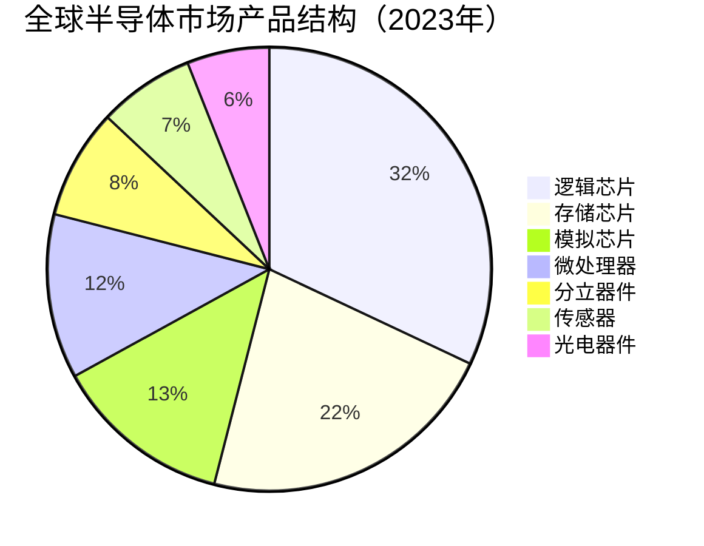
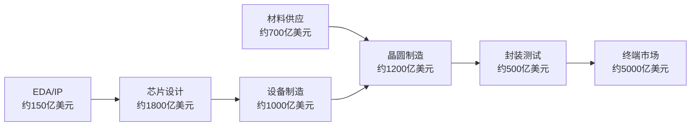
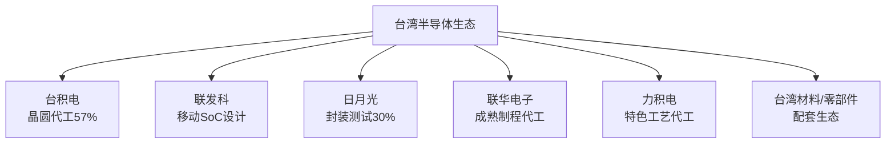
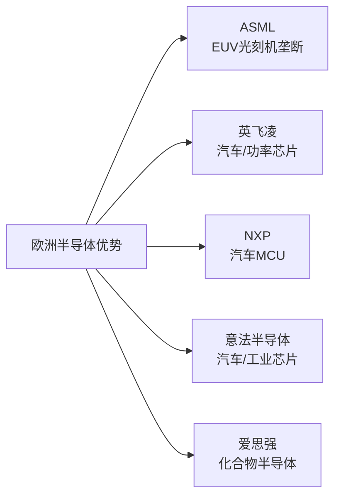
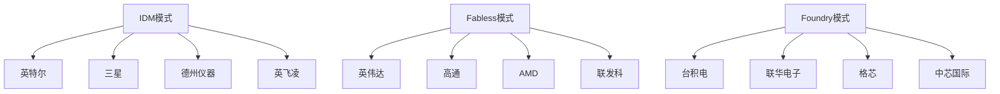
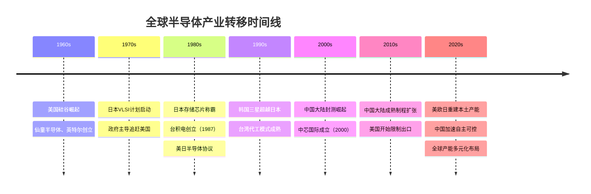
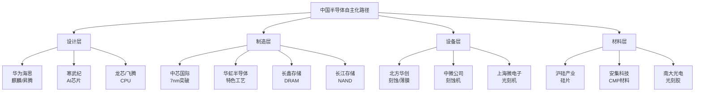
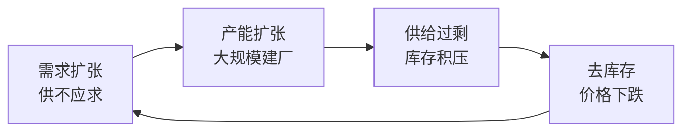

# 全球半导体产业格局

## 概述

半导体是现代经济的"工业粮食"，年市场规模超过5000亿美元，支撑着从智能手机到汽车、从云计算到国防的几乎所有现代技术。全球半导体产业经过70年演变，形成了高度专业化的国际分工体系：美国主导设计与设备，台湾主导先进制造，韩国主导存储，日本主导材料与设备，欧洲主导特种芯片与设备。这一格局正在地缘政治压力下经历深刻重塑。

## 全球半导体产业规模与结构

### 市场总体规模

2023年全球半导体市场规模约5270亿美元，较2022年的5740亿美元有所回落，主要受消费电子需求疲软影响。从长期趋势看，半导体市场保持约8-10%的年均复合增长率，预计2030年将突破1万亿美元。

| 年份 | 市场规模（亿美元） | 同比增长 |
|------|------------------|---------|
| 2019 | 4123 | -12.1% |
| 2020 | 4404 | +6.8% |
| 2021 | 5559 | +26.2% |
| 2022 | 5740 | +3.3% |
| 2023 | 5270 | -8.2% |
| 2024E | 5880 | +11.2% |
| 2025E | 6500 | +10.5% |

### 产品结构分布

逻辑芯片（包括CPU、GPU、FPGA、ASIC）占据最大份额，存储芯片（DRAM、NAND Flash）是周期性最强的品类，模拟芯片则以稳定性著称，毛利率通常高于数字芯片。

### 产业链环节价值分布

半导体产业链从上游到下游可分为：EDA工具→IP核→芯片设计→设备制造→材料供应→晶圆制造→封装测试→终端应用。各环节的价值分布高度不均衡：

## 全球区域竞争格局

### 美国：设计与生态系统霸主

美国在半导体产业链的上游环节拥有无可撼动的主导地位，核心优势体现在三个层面：

**EDA工具垄断**：Synopsys、Cadence、Mentor（西门子旗下）三家公司垄断全球EDA市场约75%份额。EDA是芯片设计的"操作系统"，没有EDA工具，任何芯片设计都无从谈起。这一垄断地位使美国掌握了半导体产业的"咽喉"。

**IP核生态**：ARM（软银旗下，英国公司但生态根植美国）的CPU架构授权给全球95%以上的移动处理器，MIPS、RISC-V等架构也主要由美国公司主导。Imagination Technologies的GPU IP、Cadence的接口IP等构成了芯片设计的基础积木。

**芯片设计龙头**：英特尔（CPU/数据中心）、英伟达（GPU/AI）、高通（移动/通信）、AMD（CPU/GPU）、博通（网络/存储）、德州仪器（模拟/嵌入式）、应用微（FPGA）等公司合计占全球芯片设计市场约50%份额。

**设备制造领导者**：应用材料（薄膜沉积、离子注入）、泛林集团（刻蚀）、KLA（量测检测）三家公司合计占全球半导体设备市场约40%份额，在关键工艺设备领域的市场份额更高达60-70%。

| 美国半导体公司 | 细分领域 | 全球市占率 |
|-------------|---------|----------|
| 英特尔 | x86 CPU | 约70%（PC/服务器） |
| 英伟达 | GPU/AI芯片 | 约80%（数据中心GPU） |
| 高通 | 移动SoC | 约30%（安卓旗舰） |
| 应用材料 | 薄膜沉积设备 | 约20% |
| 泛林集团 | 刻蚀设备 | 约30% |
| KLA | 量测检测设备 | 约50% |
| Synopsys | EDA工具 | 约30% |

### 台湾：先进制造的不可替代核心

台湾以不足4%的全球半导体市场份额，却承担了全球超过60%的晶圆代工业务，在先进制程（7nm以下）领域的集中度更高达90%以上。

**台积电的绝对主导**：台积电2023年营收约693亿美元，占全球晶圆代工市场约57%份额。在5nm及以下先进制程，台积电市占率超过90%。台积电的技术领先优势体现在：
- 率先量产3nm工艺（2022年）
- 2nm工艺预计2025年量产
- CoWoS先进封装技术支撑AI芯片需求爆发

**联发科的设计实力**：联发科在移动SoC领域市占率超过35%，在中低端市场与高通形成双寡头格局。天玑系列芯片已进入旗舰市场，与高通骁龙直接竞争。

**日月光的封测霸主**：日月光半导体（ASE）是全球最大的封装测试公司，市占率约30%，在先进封装（SiP、Fan-out）领域技术领先。

### 韩国：存储芯片双雄

韩国在存储芯片领域建立了难以撼动的双寡头格局，三星和SK海力士合计占全球DRAM市场约70%、NAND Flash市场约50%。

**三星的全产业链布局**：三星是全球唯一同时具备芯片设计、晶圆制造、封装测试、终端应用全产业链能力的公司。三星半导体2023年营收约990亿美元，是全球最大的半导体公司（按营收）。三星在存储芯片领域的优势来自：
- 垂直整合降低成本
- 大规模资本开支维持技术领先
- 与终端产品（手机、电视）的协同效应

**SK海力士的专注策略**：SK海力士专注存储芯片，在HBM（高带宽存储）领域率先突破，成为英伟达AI芯片的核心供应商。HBM3E产品的量产使SK海力士在AI存储市场占据先机。

**三星代工的挑战**：三星代工（Samsung Foundry）是全球第二大晶圆代工厂，但在先进制程良率和客户信任度方面与台积电存在明显差距，市占率约13%。

### 日本：材料与设备的隐形冠军

日本在半导体材料和部分设备领域拥有全球领先地位，但在芯片设计和先进制造方面已相对落后。

**材料领域的绝对优势**：
- 硅晶圆：信越化学、SUMCO合计占全球市场约60%
- 光刻胶：JSR、东京应化、信越化学合计占全球市场约90%
- 研磨材料（CMP）：Fujimi、Cabot Microelectronics（美）主导
- 电子特气：大阳日酸、昭和电工等占据重要份额
- 靶材：JX金属、住友化学等领先

**设备领域的关键地位**：
- 东京电子（TEL）：全球第三大半导体设备公司，在涂胶显影设备领域全球市占率超过90%
- 尼康/佳能：光刻机领域的重要参与者（虽落后于ASML）
- 爱德万测试/泰瑞达（美）：芯片测试设备双寡头

| 日本半导体材料公司 | 产品 | 全球市占率 |
|----------------|-----|----------|
| 信越化学 | 硅晶圆 | ~30% |
| SUMCO | 硅晶圆 | ~28% |
| JSR | 光刻胶 | ~25% |
| 东京应化 | 光刻胶 | ~20% |
| 大阳日酸 | 电子特气 | ~15% |

### 欧洲：特种芯片与关键设备

欧洲在半导体领域的优势集中在特定细分市场，尤其是汽车芯片、工业芯片和关键设备。

**ASML的不可替代性**：荷兰ASML是全球唯一能够生产EUV（极紫外）光刻机的公司，每台EUV光刻机售价约1.5-2亿美元，年产量约50台。没有ASML的EUV光刻机，任何公司都无法制造7nm以下的先进芯片。ASML的垄断地位使其成为全球半导体产业最关键的"卡脖子"节点之一。

**汽车芯片龙头**：
- 英飞凌（德国）：全球最大汽车芯片公司，功率半导体市占率约20%
- 意法半导体（法国/意大利）：汽车MCU、功率器件领先
- NXP（荷兰）：汽车MCU全球第一，市占率约30%
- 博世（德国）：MEMS传感器全球领先

**工业/特种芯片**：
- 英飞凌：工业功率器件
- 意法半导体：工业MCU、传感器
- 罗姆（日本）：SiC功率器件

## 全球产业分工体系

### 垂直分工：IDM vs Fabless vs Foundry

半导体产业的商业模式经历了从IDM（垂直整合）到水平分工（Fabless+Foundry）的历史性演变。

**IDM模式（垂直整合）**：英特尔、三星、德州仪器等公司自行完成设计、制造、封测全流程。IDM模式的优势在于技术协同和供应链控制，劣势在于资本开支巨大、灵活性不足。

**Fabless模式（无晶圆厂设计）**：高通、英伟达、AMD、联发科等公司专注芯片设计，将制造外包给台积电等代工厂。Fabless模式使设计公司能够专注创新，快速响应市场，资产轻量化。

**Foundry模式（纯代工）**：台积电、联华电子、格芯等公司专注晶圆制造，不做自有品牌芯片设计。纯代工模式的核心竞争力是工艺技术和产能规模。

### 水平分工：全球供应链的精密协作

一颗先进芯片的诞生需要跨越多个国家和地区的精密协作：

1. **美国**：EDA工具设计芯片架构，IP核授权
2. **荷兰**：ASML提供EUV光刻机
3. **日本**：提供光刻胶、硅晶圆、特气等关键材料
4. **台湾**：台积电完成晶圆制造
5. **韩国/台湾**：封装测试
6. **中国大陆**：部分封测、终端组装

这种高度专业化的分工体系极大提升了效率，但也带来了供应链脆弱性——任何一个环节的中断都可能影响全球芯片供应。

### 关键节点的集中度风险

| 产业链环节 | 关键公司 | 集中度风险 |
|----------|---------|----------|
| EUV光刻机 | ASML（唯一） | 极高 |
| EDA工具 | Synopsys/Cadence/Mentor | 高 |
| 先进制程代工 | 台积电（90%+） | 极高 |
| DRAM | 三星/SK海力士/美光 | 高 |
| 硅晶圆 | 信越/SUMCO/Siltronic | 高 |
| 光刻胶 | 日本三家（90%） | 极高 |
| 先进封装 | 台积电/日月光 | 高 |

## 产业转移历史与趋势

### 半导体产业转移的三次浪潮

**第一次浪潮（1960-1980年代）：美国→日本**

二战后，美国贝尔实验室发明晶体管，仙童半导体、英特尔等公司奠定了硅谷的半导体基础。1970-80年代，日本通过政府主导的产业政策（MITI主导的VLSI计划）、企业联合研发和大规模资本投入，在存储芯片领域实现了对美国的超越。1988年，日本半导体公司占全球市场份额高达51%，NEC、东芝、日立成为全球存储芯片霸主。

然而，美日贸易摩擦（1986年《美日半导体协议》）、日本泡沫经济破裂、以及韩国和台湾的崛起，使日本半导体产业从巅峰跌落。

**第二次浪潮（1980-2000年代）：日本→韩国/台湾**

韩国三星在1980年代进入存储芯片领域，凭借政府支持、大规模投资和逆周期扩产策略，逐步超越日本。台湾则走了一条不同的路——台积电1987年创立，开创了纯代工模式，使台湾成为全球芯片制造中心。

这一时期，美国有意识地将制造业转移出去，专注于设计和IP，形成了"美国设计、亚洲制造"的格局。

**第三次浪潮（2000年代至今）：向中国大陆转移**

随着中国大陆成为全球最大的电子产品制造基地，半导体封测、成熟制程代工逐步向中国大陆转移。中芯国际、华虹半导体等代工厂崛起，长电科技、通富微电等封测公司进入全球前列。

然而，这次转移在先进制程领域遭遇了地缘政治的强力阻断。

### 当前产业转移的新动向

**美国的"再工业化"**：《芯片与科学法案》（CHIPS Act，2022年）提供527亿美元补贴，吸引台积电、三星、英特尔在美国建厂。台积电亚利桑那州工厂（4nm/3nm）、三星德克萨斯州工厂（4nm）、英特尔俄亥俄州工厂（Intel 18A）相继推进。

**欧洲的"芯片主权"**：欧盟《芯片法案》计划到2030年将欧洲半导体产能从全球9%提升至20%，投入430亿欧元。台积电德累斯顿工厂（12nm/16nm，与英飞凌、博世、NXP合资）已于2024年动工。

**日本的复兴计划**：日本政府联合台积电在熊本建设晶圆厂（JASM，28nm/22nm），已于2024年2月开幕。Rapidus公司获政府支持，目标2027年量产2nm芯片，但技术跨越难度极大。

**印度的半导体雄心**：印度推出约100亿美元的半导体激励计划，塔塔集团与台积电洽谈合作，迈克朗（Micron）在印度建设封测工厂。印度的优势在于工程师资源和英语环境，但基础设施和供应链生态仍是短板。

## 地缘政治重塑产业格局

### 美国出口管制的升级

2018年以来，美国对中国半导体产业的限制持续升级，成为重塑全球半导体格局的最重要外部变量。

**关键时间节点**：
- 2018年：中兴通讯事件，美国首次将芯片断供作为地缘政治武器
- 2019年：华为被列入实体清单，高通、英特尔等停止供货
- 2020年：扩大对华为的限制，台积电停止为华为代工
- 2022年10月：拜登政府发布全面出口管制令，限制先进芯片、设备、人才向中国流动
- 2023年：荷兰、日本加入出口管制，ASML限制向中国出口DUV光刻机
- 2024年：进一步收紧AI芯片（H100/A100）对华出口限制

**出口管制的核心逻辑**：美国的目标是维持与中国在先进半导体领域"至少两代"的技术差距，阻止中国将先进芯片用于军事和AI领域。

### "去风险化"与供应链重构

西方国家的"去风险化"（De-risking）战略正在推动半导体供应链的结构性重组：

**友岸外包（Friend-shoring）**：将供应链向盟友国家集中，减少对中国和其他"风险"国家的依赖。美国、日本、韩国、台湾、荷兰等形成了非正式的"芯片联盟"。

**产能多元化**：台积电、三星等公司被要求/激励在美国、日本、欧洲建设工厂，分散地缘政治风险。这带来了显著的成本上升——台积电亚利桑那工厂的建设成本约为台湾同等工厂的2-3倍。

**技术脱钩的边界**：完全的技术脱钩在经济上代价极高，因此实际政策是"精准脱钩"——在先进制程（7nm以下）、AI芯片、军事应用等领域严格限制，在成熟制程、消费电子等领域保持一定开放。

### 中国的应对策略

面对外部限制，中国采取了多层次的应对策略：

**举国体制投入**：国家集成电路产业投资基金（大基金）一期（2014年，1387亿元）、二期（2019年，2041亿元）、三期（2023年，3440亿元）持续加码，地方政府配套资金规模更大。

**成熟制程扩张**：在先进制程受阻的情况下，中国大力扩张28nm及以上成熟制程产能。中芯国际、华虹半导体、合肥长鑫等公司大规模扩产，预计到2026年中国成熟制程产能将占全球约30%。

**设备材料国产化**：北方华创、中微公司、盛美上海等设备公司加速突破，沪硅产业、安集科技、南大光电等材料公司取得阶段性进展。但在EUV光刻机、高端量测设备等关键领域仍存在巨大差距。

**华为的突破**：2023年华为Mate 60 Pro搭载麒麟9000S芯片，由中芯国际7nm工艺制造，证明了在出口管制下中国先进制程的突破能力，但量产规模和良率仍受限。

## 技术演进与新兴机遇

### 先进制程的极限与新路径

摩尔定律（每18个月晶体管密度翻倍）正在接近物理极限，但半导体性能提升的需求并未停止，产业正在探索多条新路径：

**制程继续微缩**：台积电2nm（N2）预计2025年量产，1.4nm（A14）在研发中。但每一代制程的研发成本和资本开支呈指数级增长，只有少数公司能够跟上。

**先进封装技术**：通过将多个芯片（Chiplet）集成在同一封装内，实现性能提升而无需依赖单一制程突破。台积电的CoWoS、SoIC，英特尔的Foveros，三星的X-Cube等先进封装技术成为新的竞争焦点。AI芯片（如英伟达H100/H200）大量采用HBM+CoWoS封装。

**新材料突破**：
- 碳化硅（SiC）：功率器件的革命性材料，耐高压、高温，是新能源汽车的核心。英飞凌、意法半导体、安森美、罗姆等领先，中国比亚迪、三安光电等加速追赶。
- 氮化镓（GaN）：高频、高效率，适用于5G基站、快充、雷达。Wolfspeed（美）、英飞凌、中国英诺赛科等布局。
- 二维材料（石墨烯、MoS₂）：下一代半导体材料，仍处于研究阶段。

**AI驱动的芯片架构革命**：
- GPU从图形处理器演变为AI计算核心（英伟达）
- 专用AI芯片（ASIC）：谷歌TPU、亚马逊Trainium/Inferentia、Meta MTIA
- 存算一体（In-Memory Computing）：减少数据搬运，提升AI推理效率
- 光子芯片：利用光子传输数据，突破电子互连瓶颈

### 汽车半导体的结构性机遇

汽车电动化和智能化驱动半导体用量大幅提升：
- 传统燃油车：约400-500美元/辆的半导体用量
- 纯电动车：约800-1000美元/辆
- 智能电动车（L3+自动驾驶）：约1500-2000美元/辆

汽车半导体的关键品类：
- 功率半导体（IGBT/SiC MOSFET）：电机控制、充电系统
- 汽车MCU：车身控制、底盘控制
- 自动驾驶芯片：英伟达Orin、Mobileye EyeQ、地平线征程
- 车载通信芯片：NXP、高通
- 传感器：激光雷达、毫米波雷达、摄像头芯片

### AI算力需求的爆发

ChatGPT引发的AI革命正在重塑半导体需求结构：

**训练芯片**：英伟达H100/H200/B100系列GPU主导AI训练市场，单卡售价3-4万美元，供不应求。AMD MI300X是最有力的竞争者，但生态差距仍大。

**推理芯片**：推理市场更加分散，英伟达、AMD、谷歌TPU、亚马逊Inferentia、各大云厂商自研芯片共存。

**HBM存储**：AI训练需要大量高带宽存储，SK海力士HBM3E成为英伟达H100的标配，三星和美光也在追赶。HBM市场2023年约25亿美元，预计2025年超过200亿美元。

**AI PC/手机**：端侧AI推动NPU（神经网络处理器）成为PC和手机芯片的标配，高通骁龙X Elite、苹果M4、英特尔Meteor Lake等均集成强大NPU。

## 投资视角：全球半导体格局的投资含义

### 各区域投资机会与风险

**美国半导体股**：
- 优势：技术护城河深，EDA/IP/设备垄断地位稳固，AI需求驱动英伟达等公司高速增长
- 风险：估值偏高，中美脱钩可能影响部分公司中国收入（应用材料、泛林等约30-40%收入来自中国）
- 代表标的：英伟达（AI算力）、ASML（光刻机垄断）、应用材料（设备）、Synopsys（EDA）

**台湾半导体股**：
- 优势：台积电技术领先，先进制程需求旺盛，AI芯片代工受益
- 风险：地缘政治风险（台海局势），客户集中度高，产能扩张成本上升
- 代表标的：台积电（ADR: TSM）、联发科、日月光

**韩国半导体股**：
- 优势：存储周期复苏，HBM需求爆发，三星/SK海力士受益AI存储需求
- 风险：存储周期波动大，三星代工业务竞争力不足，中国竞争加剧成熟存储市场
- 代表标的：三星电子、SK海力士

**中国半导体股**：
- 优势：政策支持力度大，国产替代空间广阔，成熟制程扩张受益
- 风险：出口管制限制先进制程发展，估值偏高，部分公司盈利能力待验证
- 代表标的：中芯国际、北方华创、中微公司、沪硅产业

### 半导体周期与投资时机

半导体行业具有明显的周期性，通常3-4年一个完整周期：

**周期判断指标**：
- 库存水位：芯片设计公司和分销商库存天数
- 产能利用率：晶圆厂产能利用率（正常水平约85-90%）
- 芯片价格：DRAM现货价、NAND Flash价格
- 资本开支：台积电、三星等公司的资本开支计划
- 订单能见度：台积电等公司的订单预测

**当前周期位置（2024年）**：消费电子库存去化基本完成，AI驱动的数据中心需求强劲，汽车/工业需求仍在调整，整体处于复苏初期。

### 长期结构性投资主题

1. **AI算力基础设施**：英伟达GPU、HBM存储、CoWoS封装，是当前最确定的增长主线
2. **汽车半导体**：SiC功率器件、汽车MCU、自动驾驶芯片，受益于电动化和智能化长期趋势
3. **半导体设备**：全球产能扩张带动设备需求，ASML、应用材料、泛林等受益
4. **中国国产替代**：政策驱动下的国产设备、材料、成熟制程芯片替代机会
5. **先进封装**：Chiplet架构普及推动先进封装需求，台积电CoWoS、日月光SiP等受益

## 未来格局展望

### 2030年全球半导体格局预测

**市场规模**：预计2030年全球半导体市场规模将达到约1万亿美元，AI、汽车、物联网是主要增量来源。

**产能格局**：
- 美国：从目前约12%提升至约15-18%（CHIPS Act效果）
- 欧洲：从约9%提升至约15-20%（欧盟芯片法案目标，实现难度较大）
- 日本：从约15%提升至约18-20%（台积电熊本+Rapidus）
- 台湾：从约22%降至约18-20%（产能分散）
- 韩国：维持约20%左右
- 中国大陆：从约16%提升至约25-30%（成熟制程扩张）

**技术格局**：
- 先进制程（2nm以下）：台积电、三星、英特尔三足鼎立，台积电仍领先
- 成熟制程（28nm以上）：中国大陆产能大幅扩张，全球供给过剩风险上升
- 先进封装：台积电、日月光、英特尔、三星竞争加剧
- AI芯片：英伟达主导，但AMD、谷歌、亚马逊、华为等挑战者持续涌现

### 三种可能的演化路径

**路径一：有限脱钩（最可能）**
中美在先进制程领域维持技术封锁，但在成熟制程和消费电子领域保持一定合作。全球形成"两个半导体生态圈"的雏形，但完全脱钩的成本过高，双方都有维持部分联系的动力。

**路径二：深度脱钩（中等概率）**
地缘政治冲突升级，美国进一步收紧出口管制，中国加速自主可控。全球半导体产业形成明显的"美国+盟友"和"中国"两个平行体系，效率损失巨大但政治驱动力强。

**路径三：缓和与重新整合（低概率）**
中美关系改善，出口管制部分放松，全球半导体产业重新走向整合。这需要重大的地缘政治变化，短期内可能性较低。

### 对投资者的启示

1. **地缘政治风险溢价**：台积电等公司的估值长期受台海风险压制，这既是风险也是机会
2. **成本上升是长期趋势**：产能多元化必然带来成本上升，芯片价格长期中枢可能上移
3. **中国市场的双重性**：中国既是全球最大的芯片消费市场，也是最大的竞争威胁来源
4. **技术突破的不确定性**：中国在先进制程的突破速度可能超预期，也可能不及预期
5. **AI是最确定的增量**：无论地缘政治如何演变，AI对算力的需求是最确定的长期增长驱动力

## 常见问题

### Q1：台积电是否真的"不可替代"？

短期内（5年内）台积电在先进制程领域确实难以替代。三星代工在良率和客户信任度方面与台积电存在明显差距，英特尔代工（IFS）仍处于重建阶段。但长期来看，随着美国、日本、欧洲的产能建设，以及三星和英特尔的持续投入，台积电的垄断地位会有所松动，但仍将是先进制程的核心。

### Q2：中国能否在先进制程上实现突破？

这是最难预测的问题。华为Mate 60 Pro证明了中芯国际7nm的可行性，但量产规模和良率受限。在没有EUV光刻机的情况下，通过多重曝光（Multi-patterning）实现更先进制程的成本极高。中国突破5nm以下制程的时间表，乐观估计需要5-8年，悲观估计可能更长。

### Q3：半导体设备的出口管制能否真正阻止中国？

出口管制能够显著延缓中国先进制程的发展，但无法完全阻止。中国正在加速国产设备研发，部分设备（如刻蚀机）已取得阶段性突破。但光刻机（尤其是EUV）、高端量测设备等仍是难以逾越的障碍。出口管制的效果是"延缓"而非"阻止"。

### Q4：AI芯片需求能持续多久？

AI基础设施建设（训练大模型）的需求可能在2-3年内保持高速增长，之后随着主要模型训练完成而趋于平稳。但AI推理（inference）的需求将随着AI应用普及而持续增长，且推理芯片市场更加分散，不像训练市场那样高度集中于英伟达。长期来看，AI对半导体的需求是结构性的，不是周期性的。

### Q5：投资半导体ETF还是个股更好？

对于普通投资者，半导体ETF（如SOXX、SMH）提供了分散化的行业敞口，避免了单一公司的特定风险。对于有研究能力的投资者，在周期底部精选个股（如存储周期底部买入三星/SK海力士，AI爆发初期买入英伟达）可以获得更高回报。中国投资者还可以关注A股半导体ETF（如512480）获得国产替代主题敞口。

### Q6：半导体产能过剩风险有多大？

成熟制程（28nm以上）面临较大的产能过剩风险，尤其是中国大陆的大规模扩产可能导致全球成熟制程供给过剩，压低代工价格。先进制程（7nm以下）由于进入门槛极高，产能过剩风险相对较小，AI需求也提供了强力支撑。

## 延伸阅读

### 推荐书籍
- 《芯片战争》（Chris Miller）- 半导体产业地缘政治的权威著作
- 《硅谷之火》（Michael Malone）- 硅谷半导体产业发展史
- 《台积电为什么神》（林宏文）- 台积电商业模式深度解析
- 《半导体帝国》（张汝京）- 中国半导体产业发展视角

### 研究报告
- IC Insights年度半导体市场报告
- Gartner半导体预测报告
- SEMI全球半导体设备市场报告
- 中国半导体行业协会年度报告

### 行业资讯
- EE Times（电子工程时代）
- Semiconductor Engineering
- 集微网（中国半导体行业资讯）
- 芯东西（中国芯片行业媒体）

## 参考文献

1. WSTS (World Semiconductor Trade Statistics). *Global Semiconductor Sales Statistics 2023*. 2024.
2. TrendForce. *Global Foundry Market Share Report Q4 2023*. 2024.
3. IC Insights. *The McClean Report 2024: A Complete Analysis and Forecast of the Integrated Circuit Industry*. 2024.
4. SEMI. *World Fab Watch - Semiconductor Equipment Market Report 2023*. 2024.
5. Miller, Chris. *Chip War: The Fight for the World's Most Critical Technology*. Scribner, 2022.
6. McKinsey Global Institute. *Securing the Semiconductor Supply Chain*. 2023.
7. Boston Consulting Group & Semiconductor Industry Association. *Strengthening the Global Semiconductor Supply Chain in an Uncertain Era*. 2021.
8. 中国半导体行业协会. *2023年中国集成电路产业运行情况*. 2024.
9. 国际货币基金组织. *Geoeconomic Fragmentation and the Future of Multilateralism*. 2023.
10. 台积电. *2023年年度报告*. 2024.
11. 英伟达. *2024财年年度报告*. 2024.
12. 应用材料. *2023年年度报告*. 2024.
13. ASML. *2023年年度报告*. 2024.
14. 摩根士丹利. *Global Semiconductor Outlook 2024*. 2024.
15. 高盛. *AI Infrastructure: The Next Semiconductor Supercycle*. 2023.

---

**投资建议**：
全球半导体产业正处于AI驱动的结构性增长与地缘政治重构的双重叠加期。建议投资者关注三条主线：一是AI算力链（英伟达、台积电、SK海力士HBM）；二是半导体设备（ASML、应用材料，受益全球产能扩张）；三是中国国产替代（北方华创、中微公司，政策驱动确定性强）。同时需警惕成熟制程产能过剩风险和地缘政治突发事件对台湾相关资产的冲击。

**风险提示**：
本文所有分析仅供参考，不构成投资建议。半导体行业受宏观经济周期、地缘政治、技术突破等多重不确定因素影响，投资者需充分了解相关风险，结合自身风险承受能力做出投资决策。过往业绩不代表未来表现。

---

[← 返回半导体行业](index.html) | [中美半导体对比 →](china-vs-us-semiconductor.html)
