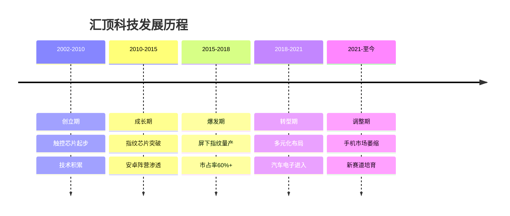
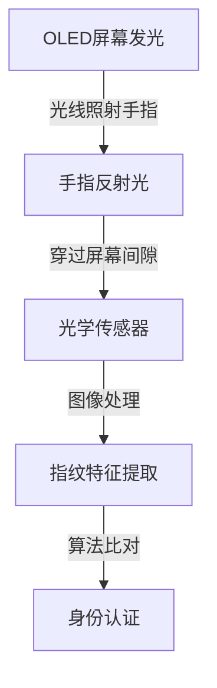
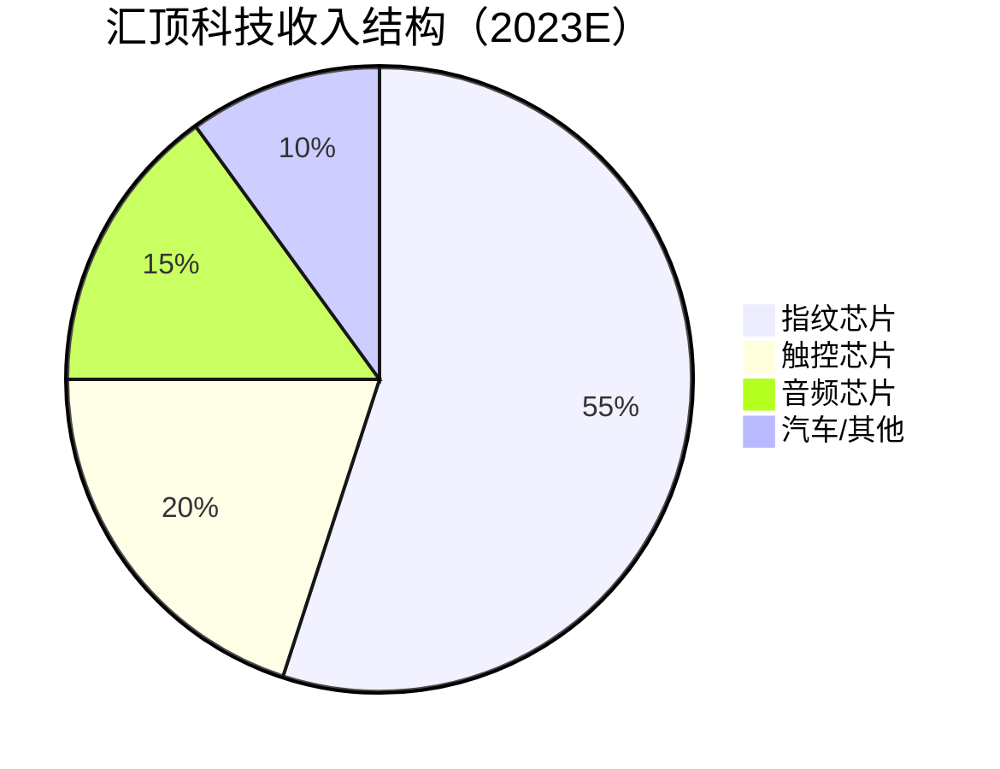
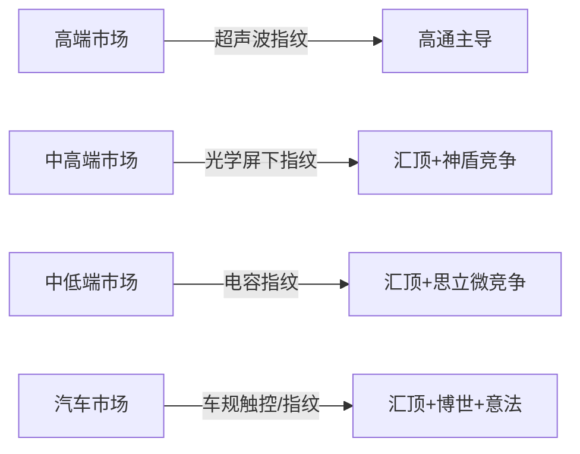

# 汇顶科技：指纹芯片龙头的转型之路

## 公司概况

### 基本信息

**公司名称**：深圳市汇顶科技股份有限公司（Goodix Technology）
**股票代码**：603160.SH（上交所科创板）
**成立时间**：2002年
**总部位置**：中国深圳
**实际控制人**：张帆（创始人）

**业务范围**：
- 指纹识别芯片：屏下指纹、侧边指纹、后置指纹
- 触控芯片：智能手机、平板、笔记本
- 音频芯片：TWS耳机、智能音箱
- 汽车电子：车载触控、车载指纹
- 健康检测：心率、血氧传感器

**市值规模**（2023）：
- 市值：约500亿人民币
- 全球指纹芯片市占率：约30%（高峰期60%+）
- 中国指纹芯片龙头

### 发展历程

**关键里程碑**：
- 2002年：公司成立，专注触控芯片
- 2013年：进入指纹芯片市场
- 2015年：安卓手机指纹芯片市占率超50%
- 2018年：全球首款屏下光学指纹芯片量产（vivo X20 Plus）
- 2018年：科创板上市，募资35亿
- 2019年：屏下指纹芯片出货量全球第一
- 2020年：营收突破60亿，净利润18亿
- 2021年：手机市场下滑，开始多元化转型
- 2023年：汽车电子、IoT业务快速增长

### 股权结构

**主要股东**：
- 张帆（创始人）：约25%
- 机构投资者：约40%
- 公众股东：约35%

**管理层**：
- 张帆：董事长兼CEO，清华大学电子工程博士
- 核心团队：多名海归技术专家
- 研发人员：3000+，占员工总数60%+

## 核心技术分析

### 指纹识别技术原理

指纹识别是通过采集手指表面的纹路特征，与预存模板进行比对，实现身份认证的生物识别技术。汇顶科技在三种主流技术路线上均有布局：

**1. 电容式指纹（传统）**

**技术原理**：
利用手指皮肤与传感器之间的电容差异，识别指纹纹路。手指脊线与谷线对传感器的电容影响不同，通过测量电容矩阵还原指纹图像。

**技术特点**：
- 成本低：单颗芯片成本1-3美元
- 速度快：识别时间<0.3秒
- 功耗低：待机功耗<1μA
- 局限性：需要手指直接接触传感器，无法实现屏下识别

**应用场景**：
- 手机后置/侧边指纹
- 笔记本电脑
- 门锁、考勤设备

**汇顶地位**：
汇顶科技在电容式指纹芯片领域曾占据全球60%+市场份额，是绝对龙头。但随着屏下指纹普及，电容式指纹市场逐渐萎缩。

**2. 光学式屏下指纹**

**技术原理**：
利用OLED屏幕发出的光照射手指，反射光通过屏幕间隙被传感器捕获，形成指纹图像。

**技术特点**：
- 屏下识别：实现全面屏设计
- 识别面积大：可扩展至半屏、全屏
- 成本适中：单颗芯片5-15美元
- 局限性：需要OLED屏幕，湿手识别率较低

**汇顶突破**：
2018年，汇顶科技率先实现光学屏下指纹量产，搭载于vivo X20 Plus，成为全球首款屏下指纹手机。这一技术突破奠定了汇顶在屏下指纹领域的领先地位。

**市场地位**：
- 2019-2020年：全球屏下指纹芯片市占率约50%
- 主要竞争对手：神盾股份、思立微、高通
- 客户：三星、OPPO、vivo、小米、华为

**3. 超声波屏下指纹**

**技术原理**：
利用超声波穿透屏幕，通过声波反射识别指纹的三维结构，不受湿手、污手影响。

**技术特点**：
- 识别精度高：3D指纹图像
- 湿手可用：不受水分影响
- 穿透力强：可穿透玻璃、金属
- 成本高：单颗芯片20-30美元

**市场格局**：
超声波指纹目前主要由高通（Qualcomm）主导，三星Galaxy S系列采用。汇顶科技也在研发超声波指纹，但尚未大规模量产。

### 触控芯片技术

**电容触控原理**：
通过检测手指触摸屏幕时引起的电容变化，确定触摸位置和手势。

**汇顶触控芯片特点**：
- 多点触控：支持10点同时触控
- 低功耗：待机功耗极低
- 高精度：触控精度<1mm
- 抗干扰：强抗电磁干扰能力

**产品线**：
- 手机触控：主流安卓手机
- 平板触控：iPad竞品
- 笔记本触控板：Windows笔记本
- 工业触控：工业设备

### 音频芯片技术

**TWS耳机芯片**：
随着AirPods带动TWS耳机市场爆发，汇顶科技进入音频芯片领域。

**核心技术**：
- 主动降噪（ANC）：消除环境噪音
- 低延迟传输：游戏模式<50ms
- 低功耗：续航时间长
- 语音识别：集成语音唤醒

**市场地位**：
- 国内TWS芯片市场份额约15%
- 主要竞争对手：恒玄科技、络达科技、瑞昱
- 客户：漫步者、JBL、小米等

### 汽车电子技术

**车载触控**：
- 中控屏触控：大尺寸、高可靠性
- 仪表盘触控：防眩光、宽温度范围
- 车规认证：AEC-Q100

**车载指纹**：
- 驾驶员身份认证
- 个性化设置
- 防盗功能

**技术要求**：
- 工作温度：-40°C至+125°C
- 可靠性：MTBF > 100万小时
- 认证：ISO 26262功能安全
- 认证周期：2-3年

## 产品矩阵与市场地位

### 产品结构

### 指纹芯片市场

**全球市场规模**：
- 2023年：约25亿美元
- 年增长率：5-8%
- 2025E：30亿美元
- 驱动：手机、笔记本、门锁、汽车

**竞争格局**：

| 公司 | 市占率 | 技术路线 | 主要客户 |
|------|--------|---------|---------|
| 汇顶科技 | 30% | 光学+电容 | 三星、OPPO、vivo |
| 高通 | 25% | 超声波+光学 | 三星、小米 |
| 神盾股份 | 15% | 光学 | 华为、荣耀 |
| 思立微 | 10% | 电容 | 中低端手机 |
| 其他 | 20% | 各类 | 分散 |

**汇顶市场地位变化**：
- 2018年：市占率60%+（高峰）
- 2020年：市占率50%
- 2022年：市占率35%
- 2023年：市占率30%
- 下降原因：高通超声波崛起、华为转向神盾、手机市场萎缩

### 触控芯片市场

**全球市场规模**：
- 2023年：约15亿美元
- 主要应用：手机、平板、笔记本

**竞争格局**：
- 汇顶科技：约20%（手机触控）
- 敦泰科技：约25%
- 新思科技（Synaptics）：约20%
- 其他：35%

### 音频芯片市场

**TWS耳机芯片市场**：
- 2023年：约20亿美元
- 年增长率：15%+
- 主要竞争：恒玄科技、络达科技、瑞昱

**汇顶地位**：
- 市占率：约15%
- 主要优势：低功耗、ANC技术
- 客户：中高端TWS品牌

### 汽车电子市场

**车载触控/指纹市场**：
- 2023年：约5亿美元（汇顶可触达）
- 年增长率：25%+
- 驱动：智能汽车、电动化

**汇顶布局**：
- 车载触控：已有客户导入
- 车载指纹：研发中
- 目标：2025年汽车业务占比10%+

## 财务分析

### 收入分析

**收入历史**：

| 年份 | 收入（亿元） | 增长率 | 净利润（亿元） | 净利率 |
|------|------------|--------|--------------|--------|
| 2018 | 30 | 45% | 8 | 27% |
| 2019 | 46 | 53% | 13 | 28% |
| 2020 | 62 | 35% | 18 | 29% |
| 2021 | 47 | -24% | 8 | 17% |
| 2022 | 35 | -26% | 3 | 9% |
| 2023E | 38 | +9% | 4 | 11% |

**收入下滑原因（2021-2022）**：
- 手机市场萎缩：全球手机出货量下降15%
- 市场份额下降：高通超声波指纹崛起
- 华为失去：华为转向神盾股份
- 库存去化：渠道库存高企

**收入复苏驱动（2023+）**：
- 手机市场回暖：出货量企稳
- 新产品放量：音频芯片、汽车电子
- 市场份额稳定：光学指纹维持地位
- 成本控制：费用率下降

### 盈利能力

**毛利率分析**：
- 2018-2020年：毛利率55-60%（高峰）
- 2021-2022年：毛利率45-50%（下滑）
- 2023E：毛利率50%（回升）
- 行业对比：高于行业平均（35-40%）

**毛利率高的原因**：
- 技术壁垒：指纹芯片技术门槛高
- 品牌溢价：龙头地位
- 产品结构：高端屏下指纹占比高
- Fabless模式：无制造成本

**费用率分析**：
- 研发费用率：20-25%（持续高投入）
- 销售费用率：5-8%
- 管理费用率：5-7%
- 合计：30-40%

**净利率**：
- 高峰期（2020）：29%
- 低谷期（2022）：9%
- 恢复期（2023E）：11%
- 目标（2025E）：18%+

### 现金流与资产负债表

**现金储备**：
- 货币资金：约50亿元
- 无有息负债
- 净现金：约50亿元
- 财务状况：极为健康

**资本支出**：
- Fabless模式：无重资产投入
- 主要支出：研发、IP授权
- 年资本支出：<5亿元

**股东回报**：
- 分红：每年分红，分红率30-50%
- 回购：有回购计划
- 现金充裕：具备持续回报能力

## 竞争优势分析

### 1. 技术先发优势

**屏下指纹先发**：
汇顶科技是全球首家量产光学屏下指纹芯片的公司，比竞争对手早1-2年。这一先发优势帮助汇顶建立了客户关系和技术壁垒。

**专利储备**：
- 专利数量：3000+
- 核心专利：屏下指纹光学路径、算法
- 专利布局：中国、美国、欧洲、韩国
- 专利壁垒：竞争对手难以绕过

**算法优势**：
指纹识别的核心不仅是硬件，更是算法。汇顶科技积累了20年的指纹算法经验，识别准确率和速度均处于行业领先水平。

### 2. 客户关系优势

**头部客户覆盖**：
- 三星：全球最大安卓手机厂商
- OPPO/vivo：中国主流品牌
- 小米：性价比龙头
- 荣耀：华为系品牌

**深度合作**：
- 联合研发：与客户共同开发新产品
- 定制化：针对客户需求定制方案
- 快速响应：本地化服务团队

### 3. Fabless模式优势

**轻资产运营**：
- 无晶圆厂：委托台积电、中芯国际代工
- 无封测厂：委托专业封测厂
- 资产轻：ROE高，现金充裕
- 灵活性：快速调整产品策略

**代工合作**：
- 台积电：先进制程（28nm-12nm）
- 中芯国际：成熟制程
- 多元化：降低供应链风险

### 4. 多元化转型

**新赛道布局**：
- 音频芯片：TWS耳机市场快速增长
- 汽车电子：智能汽车长期机会
- IoT：智能家居、可穿戴
- 健康检测：心率、血氧

**转型逻辑**：
- 手机市场天花板：增长放缓
- 新赛道空间大：汽车、IoT
- 技术复用：触控、传感器技术可迁移
- 客户资源：手机客户延伸至汽车

## 竞争对手分析

### 高通（Qualcomm）

**竞争关系**：
高通是汇顶科技最强劲的竞争对手，尤其在超声波屏下指纹领域。

**高通优势**：
- 超声波技术：识别精度更高，湿手可用
- 平台整合：与骁龙SoC深度集成
- 三星合作：三星Galaxy S系列独家供应
- 品牌溢价：高端市场定价权

**高通劣势**：
- 价格高：超声波指纹芯片成本高
- 主要用于高端机：中低端市场渗透有限
- 中国市场：受地缘政治影响

**汇顶应对**：
- 光学指纹：成本优势，中端市场主导
- 算法优化：缩小与超声波的体验差距
- 价格竞争：以性价比抢占市场

### 神盾股份（Egis Technology）

**竞争关系**：
台湾神盾股份是汇顶科技在光学指纹领域的主要竞争对手，尤其在华为/荣耀供应链中。

**神盾优势**：
- 华为深度合作：华为主要指纹供应商
- 技术能力：光学指纹技术成熟
- 台湾背景：供应链灵活

**神盾劣势**：
- 规模较小：市占率约15%
- 客户集中：过度依赖华为
- 研发投入：低于汇顶

### 思立微

**竞争关系**：
思立微主要在电容式指纹和中低端市场与汇顶竞争。

**思立微特点**：
- 价格低：主打性价比
- 中低端市场：主要在百元机
- 技术：电容式为主

**汇顶应对**：
- 差异化：专注中高端市场
- 技术升级：屏下指纹为主
- 品牌溢价：维持价格优势

### 竞争格局总结

## 行业趋势与机会

### 1. 屏下指纹技术升级

**大面积屏下指纹**：
- 当前：小面积（1-2cm²）
- 趋势：半屏、全屏指纹
- 技术：超薄光学传感器
- 时间：2024-2026年

**多模态生物识别**：
- 指纹+人脸：双重认证
- 指纹+虹膜：高安全场景
- 趋势：多模态融合
- 机会：算法+硬件整合

### 2. 汽车电子爆发

**智能汽车需求**：
- 驾驶员身份认证：指纹启动
- 个性化设置：座椅、音乐、导航
- 支付功能：车内支付
- 安全功能：防盗

**市场规模**：
- 2023年：约5亿美元（汇顶可触达）
- 2025E：10亿美元
- 2030E：25亿美元
- CAGR：25%+

**汇顶机会**：
- 车载触控：已有量产项目
- 车载指纹：研发中，2024-2025年量产
- 目标客户：比亚迪、吉利、长城等

### 3. IoT与可穿戴

**市场机会**：
- 智能门锁：指纹解锁
- 可穿戴：健康监测
- 智能家居：触控交互
- 工业设备：身份认证

**汇顶布局**：
- 智能门锁：已有产品
- 可穿戴：健康芯片研发中
- 市场规模：2025E约10亿美元

### 4. 健康检测芯片

**市场背景**：
疫情后健康意识提升，可穿戴健康设备需求爆发。

**技术方向**：
- 心率监测：PPG传感器
- 血氧检测：SpO2传感器
- 血压监测：研发中
- 血糖监测：长期方向

**汇顶布局**：
- 已有产品：心率+血氧芯片
- 客户：华为手表、小米手环
- 市场空间：2025E约8亿美元

## 投资价值评估

### 估值分析

**历史估值区间**：
- PE：20-80倍（波动大）
- PS：3-15倍
- PB：3-10倍

**当前估值（2023）**：
- PE：约60倍（盈利恢复中）
- PS：约13倍
- PB：约5倍

**估值对比**：

| 公司 | PE | PS | 毛利率 | 净利率 | 成长性 |
|------|----|----|--------|--------|--------|
| 汇顶科技 | 60 | 13 | 50% | 11% | 恢复中 |
| 韦尔股份 | 35 | 4 | 30% | 8% | 稳定 |
| 卓胜微 | 45 | 8 | 55% | 20% | 成长 |
| 高通 | 18 | 5 | 58% | 25% | 稳定 |
| 新思科技 | 25 | 6 | 60% | 20% | 稳定 |

### 投资论点

**看多理由**：
1. 技术壁垒：屏下指纹专利护城河深
2. 现金充裕：净现金50亿，无债务
3. 多元化转型：汽车、音频新赛道
4. 手机市场回暖：2023年出货量企稳
5. 高毛利率：50%毛利率，盈利弹性大
6. 分红回报：持续分红，股东友好
7. 估值合理：相对历史高点大幅回调
8. 管理层优秀：创始人技术背景，长期主义

**看空理由**：
1. 手机市场天花板：长期增长有限
2. 市场份额下降：高通超声波持续侵蚀
3. 新业务不确定：汽车、音频尚未成规模
4. 竞争加剧：国内外竞争对手增多
5. 客户集中：三星、OPPO/vivo占比高
6. 技术迭代风险：超声波可能替代光学
7. 估值仍偏高：PE 60倍，盈利恢复不确定

### 投资建议

**适合投资者**：
- 看好消费电子复苏的投资者
- 看好汽车电子长期机会的投资者
- 能承受周期波动的中长期投资者

**投资策略**：
- 建仓区间：100-120元（当前约130元）
- 持有周期：2-3年
- 目标价：180元+（2025年）
- 止损位：90元

**关键催化剂**：
- 手机出货量持续回升
- 汽车电子客户定点公告
- 大面积屏下指纹量产
- 音频芯片市占率提升

## 常见问题

### Q1：汇顶科技的核心竞争力是什么？

汇顶科技的核心竞争力在于三个层面：第一是技术积累，20年指纹算法经验和3000+专利构成深厚护城河；第二是客户关系，与三星、OPPO、vivo等头部客户建立了深度合作；第三是Fabless模式带来的高毛利率和现金流优势。这三者共同支撑了汇顶在指纹芯片领域的龙头地位。

### Q2：屏下指纹市场还有多大空间？

屏下指纹渗透率仍有提升空间。目前全球智能手机屏下指纹渗透率约40%，中高端机型渗透率约70%。未来随着OLED屏幕成本下降，中低端机型渗透率将持续提升。同时，大面积屏下指纹（半屏、全屏）是下一个技术升级方向，有望带来新一轮增量。

### Q3：汽车电子业务能成为第二增长曲线吗？

汽车电子是汇顶科技最重要的转型方向。车载触控和车载指纹市场规模到2030年有望达到25亿美元，且增速25%+。汇顶的触控和指纹技术可以直接迁移到汽车场景，技术复用性强。但汽车认证周期长（2-3年），短期贡献有限，2025年后有望成为重要增长引擎。

### Q4：高通超声波指纹对汇顶的威胁有多大？

高通超声波指纹主要威胁高端市场（旗舰机），而汇顶光学指纹在中高端市场（1000-3000元价位）仍有成本优势。超声波指纹芯片成本约20-30美元，光学指纹约5-15美元，价差明显。因此，两者更多是市场分层而非完全替代。汇顶需要关注的是超声波成本下降的速度。

### Q5：汇顶科技的分红政策如何？

汇顶科技现金充裕（净现金约50亿），历史上保持较高分红率（30-50%）。2020年净利润18亿时，分红约8亿。即使在业绩下滑期，公司也维持了分红。这体现了管理层对股东回报的重视，也是汇顶区别于很多成长型科技公司的特点。

### Q6：如何看待汇顶科技的估值？

汇顶科技当前PE约60倍，相对历史高点（100倍+）已大幅回调，但相对盈利能力（净利率11%）仍偏高。合理估值应参考：盈利恢复至2020年水平（净利润18亿）时，给予30-40倍PE，对应市值540-720亿，较当前有一定上行空间。关键变量是手机市场复苏速度和新业务放量节奏。

## 参考文献

1. 汇顶科技. 《年度报告》. 2018-2023
2. 汇顶科技. 《首次公开发行股票并在科创板上市招股说明书》. 2018
3. 中金公司. 《汇顶科技深度报告：指纹芯片龙头，多元化转型》. 2023
4. 招商证券. 《汇顶科技：屏下指纹先行者，汽车电子新机遇》. 2023
5. 天风证券. 《指纹芯片行业研究：技术演进与竞争格局》. 2023
6. 华泰证券. 《汇顶科技竞争力分析》. 2023
7. IDC. 《全球智能手机市场报告》. 2023
8. Counterpoint Research. 《指纹识别技术市场报告》. 2023
9. IHS Markit. 《生物识别芯片市场预测》. 2023
10. 高通. 《超声波指纹技术白皮书》. 2022
11. 中国半导体行业协会. 《中国集成电路产业发展报告》. 2023
12. Gartner. 《半导体市场预测》. 2023
13. 神盾股份. 《年度报告》. 2023
14. Strategy Analytics. 《TWS耳机市场报告》. 2023
15. 麦肯锡. 《汽车电子半导体市场研究》. 2023

---

**投资建议**：
汇顶科技是中国指纹芯片龙头，具备深厚的技术积累和客户关系，Fabless模式带来高毛利率和充裕现金流。公司正处于从手机指纹芯片向多元化平台转型的关键阶段，汽车电子和音频芯片是重要的新增长点。当前估值（PE 60倍）相对历史高点已大幅回调，但盈利恢复仍需时间。建议在100-120元区间分批建仓，持有2-3年，目标价180元+，等待手机市场复苏和新业务放量的双重催化。

**风险提示**：
主要风险包括：手机市场复苏不及预期、高通超声波指纹持续侵蚀市场份额、汽车电子认证周期长于预期、音频芯片竞争加剧、客户集中度高（三星、OPPO/vivo）、地缘政治影响供应链等。建议仓位控制在5-8%，设置止损位90元。

---

[← 返回半导体行业](index.html)
