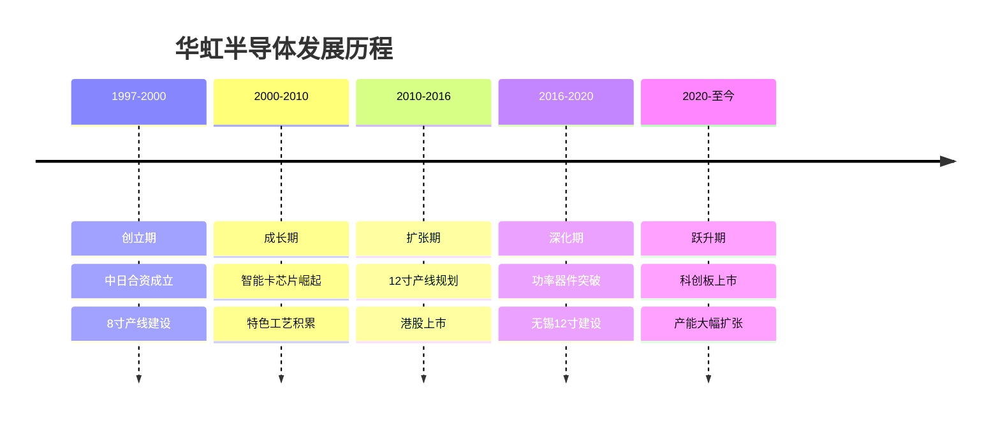
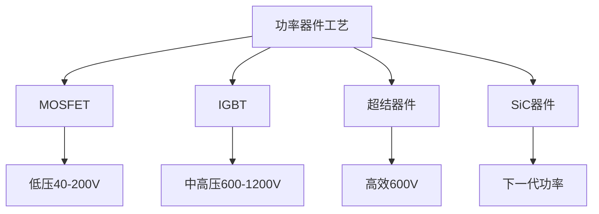

# 华虹半导体：特色工艺晶圆代工龙头

## 公司概况

### 基本信息

**公司名称**：华虹半导体有限公司（Hua Hong Semiconductor）
**股票代码**：1347.HK（港交所）/ 688347.SH（科创板，2023年上市）
**成立时间**：1997年
**总部位置**：中国上海
**实际控制人**：上海国资委（通过华虹集团）

**业务范围**：
- 嵌入式非易失性存储器（eNVM）：MCU、智能卡
- 功率器件：MOSFET、IGBT、超结器件
- 模拟与电源管理：PMIC、LDO
- 逻辑与射频：RF CMOS、BCD工艺
- 特色存储：eFlash、EEPROM

**市值规模**（2023）：
- 港股市值：约200亿港元
- A股市值：约600亿人民币（科创板上市后）
- 全球晶圆代工市场份额：约2%
- 中国特色工艺晶圆代工：第二大（仅次于中芯国际）

### 发展历程

**关键里程碑**：
- 1997年：华虹NEC成立（中日合资），建设8寸产线
- 2004年：智能卡芯片出货量全球第一
- 2014年：港股上市（1347.HK）
- 2016年：华虹宏力合并，整合上海8寸产能
- 2019年：无锡12寸产线（华虹制造）开工建设
- 2021年：无锡12寸产线投产
- 2023年：科创板上市，募资212亿人民币
- 2023年：12寸产能持续爬坡，月产能达8万片

### 股权结构

**主要股东**：
- 华虹集团（上海国资）：约40%
- 国家集成电路基金（大基金）：约10%
- 机构投资者：约35%
- 公众股东：约15%

**战略意义**：
- 国家战略：特色工艺国产替代
- 产业协同：与中芯国际差异化竞争
- 政策支持：大基金、地方政府持续投入

## 特色工艺技术深度分析

### 什么是特色工艺

晶圆代工分为两大类：**先进逻辑工艺**（台积电、三星主导，追求更小制程节点）和**特色工艺**（华虹、格芯主导，针对特定应用优化）。

特色工艺的核心逻辑：不追求最小制程，而是针对特定应用场景（功率、模拟、存储、射频）进行工艺优化，提供差异化的性能和成本优势。

**特色工艺的价值**：
- 功率器件：需要高压、大电流能力，不需要最小制程
- 模拟芯片：需要精确的模拟特性，对制程节点不敏感
- 嵌入式存储：需要特殊的存储单元结构
- 射频芯片：需要低损耗、高线性度的特殊工艺

**市场规模**：
- 全球特色工艺市场：约300亿美元（占晶圆代工总市场40%）
- 年增长率：8-10%
- 主要驱动：汽车电子、工业、物联网

### 华虹核心工艺平台

**1. 嵌入式非易失性存储器（eNVM）**

**技术原理**：
在标准CMOS工艺基础上，集成Flash或EEPROM存储单元，使芯片具备非易失性存储能力。

**主要应用**：
- 智能卡：银行卡、SIM卡、身份证
- MCU：微控制器内置Flash
- 安全芯片：加密存储

**华虹地位**：
- 全球智能卡芯片代工市占率：约40%
- 技术水平：55nm eFlash，业界领先
- 客户：恩智浦、英飞凌、复旦微电子

**技术壁垒**：
eNVM工艺开发难度极高，需要在标准CMOS工艺中集成特殊存储单元，工艺步骤增加30-50%。华虹积累了20年的eNVM工艺经验，是全球少数能提供先进eNVM工艺的代工厂之一。

**2. 功率器件工艺**

**技术原理**：
功率器件需要承受高电压（数百至数千伏）和大电流（数安培至数百安培），需要特殊的器件结构和工艺。

**主要产品**：

*MOSFET（金属氧化物半导体场效应晶体管）*：
- 应用：开关电源、电机驱动
- 华虹工艺：40V-200V MOSFET
- 技术指标：低导通电阻（RDS(on)）

*IGBT（绝缘栅双极型晶体管）*：
- 应用：新能源汽车、变频器、光伏逆变器
- 华虹工艺：600V-1200V IGBT
- 技术指标：低饱和压降（VCE(sat)）

*超结器件（Super Junction）*：
- 应用：高效开关电源
- 华虹工艺：600V超结MOSFET
- 技术指标：极低导通电阻

**华虹地位**：
- 中国功率器件代工市占率：约25%
- 技术水平：12寸IGBT，国内领先
- 客户：比亚迪半导体、士兰微、华润微

**市场驱动**：
新能源汽车爆发带动IGBT需求激增。一辆电动车需要IGBT约200-300颗，是传统燃油车的10倍以上。华虹是国内少数能提供车规级IGBT代工的厂商。

**3. 模拟与电源管理工艺（BCD工艺）**

**技术原理**：
BCD工艺将双极型（Bipolar）、CMOS和DMOS三种器件集成在同一芯片上，兼顾模拟精度、数字逻辑和功率驱动。

**主要应用**：
- 电源管理芯片（PMIC）：手机、笔记本
- 电机驱动：家电、工业
- LED驱动：照明、显示

**华虹地位**：
- BCD工艺：0.18μm-55nm
- 客户：圣邦股份、芯朋微、南芯半导体

**4. 射频CMOS工艺**

**技术原理**：
在标准CMOS工艺基础上，优化射频性能（低噪声、高线性度、低损耗），用于射频前端芯片制造。

**主要应用**：
- 射频开关：手机天线切换
- 低噪声放大器（LNA）
- 蓝牙/Wi-Fi芯片

**华虹地位**：
- RF CMOS工艺：0.18μm-55nm
- 客户：卓胜微、唯捷创芯

### 工艺节点分布

**8寸产线（200mm）**：
- 工艺节点：0.35μm-0.13μm
- 主要产品：智能卡、功率器件、模拟
- 月产能：约18万片（3条产线）
- 地点：上海金桥、上海张江

**12寸产线（300mm）**：
- 工艺节点：90nm-55nm
- 主要产品：功率器件、eNVM、逻辑
- 月产能：约8万片（无锡）
- 扩产目标：月产8.3万片（2024）

**工艺节点对比**：

| 工艺 | 节点 | 主要应用 | 产线 |
|------|------|---------|------|
| eNVM | 55nm-0.18μm | 智能卡、MCU | 8寸+12寸 |
| 功率MOSFET | 0.18μm-40nm | 电源管理 | 8寸+12寸 |
| IGBT | 0.35μm-0.18μm | 新能源汽车 | 8寸+12寸 |
| BCD | 55nm-0.18μm | 模拟/电源 | 8寸 |
| RF CMOS | 55nm-0.18μm | 射频前端 | 8寸 |

## 市场地位与竞争格局

### 全球晶圆代工市场

**市场规模**：
- 2023年：约1200亿美元
- 年增长率：8-10%
- 2025E：1400亿美元

**市场格局**：

**主要客户**：
- 恩智浦（NXP）：智能卡、汽车芯片
- 英飞凌（Infineon）：功率器件、智能卡
- 德州仪器（TI）：模拟芯片
- 比亚迪半导体：IGBT、功率器件
- 士兰微：功率器件、MCU
- 复旦微电子：智能卡、安全芯片
- 华润微：功率器件
- 圣邦股份：模拟芯片

**客户特点**：
- 国际大客户：技术要求高，订单稳定
- 国内客户：国产替代受益，增速快
- 长期合作：平均合作年限5年+
- 粘性强：工艺定制化，切换成本高

### 与中芯国际的差异化竞争

**中芯国际定位**：
- 先进制程：14nm-28nm
- 逻辑芯片：手机SoC、AI芯片
- 规模更大：月产能约70万片（8寸当量）

**华虹半导体定位**：
- 特色工艺：55nm-0.35μm
- 功率/模拟/存储：差异化应用
- 规模较小：月产能约26万片（8寸当量）

**差异化策略**：
华虹不与中芯国际正面竞争先进制程，而是专注特色工艺，在功率器件、智能卡、模拟芯片等细分领域建立深厚壁垒。这种差异化策略使两家公司形成互补而非竞争关系。

## 财务分析

### 收入分析

**收入历史**：

| 年份 | 收入（亿美元） | 增长率 | 净利润（亿美元） | 净利率 |
|------|--------------|--------|----------------|--------|
| 2019 | 9.3 | 8% | 0.8 | 9% |
| 2020 | 10.1 | 9% | 1.0 | 10% |
| 2021 | 14.9 | 47% | 2.0 | 13% |
| 2022 | 23.5 | 58% | 4.0 | 17% |
| 2023E | 22.0 | -6% | 2.5 | 11% |

**2021-2022年高增长原因**：
- 半导体超级周期：全球缺芯
- 功率器件需求爆发：新能源汽车
- 产能利用率：接近100%
- 价格上涨：供不应求

**2023年下滑原因**：
- 半导体周期下行：需求疲软
- 产能利用率下降：从95%降至80%
- 价格压力：客户要求降价
- 库存去化：渠道库存高企

**长期增长驱动**：
- 12寸产能爬坡：无锡产线持续扩产
- 功率器件需求：新能源汽车长期驱动
- 国产替代：国内客户优先采购
- 新工艺平台：SiC等新材料布局

### 盈利能力

**毛利率分析**：
- 2019-2020年：毛利率约25%
- 2021-2022年：毛利率约35%（周期高点）
- 2023E：毛利率约28%（周期下行）
- 长期目标：30%+

**毛利率影响因素**：
- 产能利用率：最关键因素，利用率每降10%，毛利率降3-5%
- 产品结构：12寸产品毛利率高于8寸
- 工艺复杂度：特色工艺溢价
- 折旧压力：12寸产线折旧大

**与台积电对比**：
- 台积电毛利率：55%+
- 华虹毛利率：28-35%
- 差距原因：台积电先进制程溢价、规模更大、技术壁垒更高

### 资本支出与产能规划

**历史资本支出**：
- 2021年：约15亿美元
- 2022年：约20亿美元
- 2023年：约25亿美元（科创板募资支持）

**产能规划**：
- 8寸产能：维持约18万片/月（稳定）
- 12寸产能：从8万片/月扩至20万片/月（2025年目标）
- 总投资：约67亿美元（无锡二期+三期）

**科创板募资用途**：
- 募资212亿人民币（约30亿美元）
- 主要用于：无锡12寸产线扩产
- 预计新增产能：月产8.3万片（12寸）
- 建设周期：2023-2025年

### 财务健康度

**资产负债表**：
- 资产负债率：约45%（科创板上市后改善）
- 流动比率：1.8
- 净现金：约20亿美元（上市后）

**偿债能力**：
- 利息覆盖倍数：5-8倍
- 债务/EBITDA：2-3倍
- 财务风险：中低

## 竞争优势分析

### 1. 特色工艺深度积累

华虹半导体在特色工艺领域积累了25年以上的经验，尤其在eNVM、功率器件、BCD工艺方面具有深厚壁垒。这种积累不是短期内可以复制的，需要大量工程师的经验积累和工艺迭代。

**eNVM工艺壁垒**：
全球能提供先进eNVM代工服务的厂商屈指可数：台积电、格芯、华虹。华虹的55nm eFlash工艺是国内最先进的，支持恩智浦、英飞凌等国际大客户的智能卡和MCU产品。

**功率器件工艺壁垒**：
12寸IGBT工艺是华虹的核心竞争力之一。国内能提供12寸IGBT代工的厂商极少，华虹是比亚迪半导体等新能源汽车芯片公司的重要合作伙伴。

### 2. 国际大客户背书

恩智浦、英飞凌、德州仪器等国际半导体巨头长期在华虹代工，这本身就是对华虹技术能力的最好背书。国际大客户的认证标准极高，能通过认证意味着华虹的工艺水平达到国际主流水平。

### 3. 新能源汽车红利

新能源汽车是华虹最重要的增长驱动力。一辆电动车需要大量功率半导体（IGBT、MOSFET），而华虹是国内少数能提供车规级功率器件代工的厂商。随着中国新能源汽车渗透率持续提升，华虹的功率器件业务将持续受益。

**数据支撑**：
- 2023年中国新能源汽车销量：约900万辆
- 2025E：约1500万辆
- 每辆电动车IGBT价值：约500-1000元
- 华虹受益：功率器件收入持续增长

### 4. 12寸产能扩张

华虹无锡12寸产线是公司未来增长的核心引擎。12寸产线相比8寸产线：
- 单位面积芯片产出提升2.25倍
- 单位成本降低30-40%
- 支持更先进工艺节点（55nm）
- 毛利率更高

随着12寸产能从8万片/月扩至20万片/月，华虹的收入和盈利能力将显著提升。

## 行业趋势与机会

### 1. 新能源汽车驱动功率器件需求

**市场规模**：
- 全球功率半导体市场：2023年约250亿美元
- 年增长率：10-12%
- 2025E：300亿美元
- 新能源汽车占比：约30%且持续提升

**IGBT需求爆发**：
- 电动车主驱逆变器：需要IGBT模块
- 车载充电器（OBC）：需要IGBT
- DC-DC转换器：需要MOSFET
- 充电桩：需要大功率IGBT

**华虹机会**：
- 比亚迪半导体：战略合作伙伴
- 士兰微、华润微：国内功率器件设计公司
- 目标：功率器件收入占比从30%提升至40%

### 2. 智能卡与安全芯片

**市场背景**：
- 全球智能卡出货量：约100亿张/年
- 主要应用：银行卡、SIM卡、身份证、交通卡
- 增长驱动：数字化、安全需求

**华虹地位**：
- 全球智能卡代工市占率：约40%
- 技术：55nm eFlash，业界领先
- 客户：恩智浦、英飞凌、复旦微

**新机会**：
- 数字人民币：安全芯片需求
- 物联网安全：设备身份认证
- 汽车安全：车规级安全芯片

### 3. 国产替代加速

**政策驱动**：
- 供应链安全：国家战略
- 大基金支持：持续投入
- 客户意愿：主动转单

**国产替代路径**：
- 功率器件：比亚迪半导体、士兰微转单
- 模拟芯片：圣邦股份、芯朋微转单
- MCU：兆易创新、中颖电子转单
- 智能卡：复旦微电子、华大电子转单

**替代空间**：
- 中国功率器件市场：约100亿美元
- 国产化率：约20%
- 替代空间：80亿美元
- 华虹受益：代工需求持续增长

### 4. SiC（碳化硅）新材料

**SiC优势**：
- 耐高压：可达10kV以上
- 耐高温：工作温度200°C+
- 低损耗：开关损耗比硅IGBT低70%
- 高频：开关频率更高

**市场规模**：
- 2023年：约20亿美元
- 2025E：50亿美元
- 2030E：100亿美元
- CAGR：30%+

**华虹布局**：
- SiC代工：研发中
- 目标：2025年提供SiC代工服务
- 客户：国内SiC器件设计公司

## 投资价值评估

### 估值分析

**当前估值（2023）**：
- PE：约25倍（A股）
- PS：约3倍
- PB：约2倍
- EV/EBITDA：约10倍

**估值对比**：

| 公司 | PE | PS | PB | 毛利率 | 净利率 | 定位 |
|------|----|----|----|----|----|----|
| 华虹半导体 | 25 | 3 | 2 | 28% | 11% | 特色工艺 |
| 中芯国际 | 35 | 4 | 2 | 20% | 8% | 先进+特色 |
| 格芯 | 20 | 3 | 2 | 30% | 12% | 特色工艺 |
| 联电 | 12 | 2 | 1.5 | 35% | 20% | 特色工艺 |
| 台积电 | 20 | 8 | 6 | 55% | 38% | 先进+特色 |

**估值分析**：
- 相对联电：华虹估值偏高（PE 25 vs 12），但成长性更好
- 相对中芯国际：估值相近，但华虹特色工艺壁垒更深
- 绝对估值：合理，考虑12寸产能扩张带来的成长性

### 投资论点

**看多理由**：
1. 特色工艺壁垒：25年积累，难以复制
2. 新能源汽车红利：IGBT需求持续爆发
3. 12寸产能扩张：收入和盈利能力提升空间大
4. 国际大客户背书：恩智浦、英飞凌长期合作
5. 国产替代：国内客户转单加速
6. 科创板上市：资金充裕，扩产无忧
7. 差异化竞争：不与中芯国际正面竞争
8. 政策支持：大基金、国资持续支持

**看空理由**：
1. 半导体周期：当前处于下行周期
2. 产能利用率：从95%降至80%，盈利压力
3. 折旧压力：12寸产线大额折旧
4. 竞争加剧：中芯国际也在布局特色工艺
5. 技术差距：与台积电、格芯仍有差距
6. 客户集中：恩智浦、英飞凌占比高
7. 地缘政治：美国出口管制风险

### 投资建议

**适合投资者**：
- 看好新能源汽车产业链的投资者
- 看好国产替代的投资者
- 中长期价值投资者

**投资策略**：
- 建仓区间：35-40元（A股，当前约45元）
- 持有周期：3-5年
- 目标价：65元+（2025年）
- 止损位：28元

**关键催化剂**：
- 12寸产能利用率回升至90%+
- 新能源汽车IGBT订单增加
- 新客户（比亚迪半导体等）放量
- SiC代工服务推出

## 常见问题

### Q1：华虹半导体与中芯国际有什么区别？

两者都是中国晶圆代工厂，但定位不同。中芯国际追求先进制程（14nm-28nm），主要服务手机SoC、AI芯片等逻辑芯片客户；华虹专注特色工艺（55nm-0.35μm），主要服务功率器件、智能卡、模拟芯片客户。两者形成互补而非竞争关系，共同构成中国晶圆代工的双核心。

### Q2：为什么华虹的毛利率低于台积电？

台积电毛利率55%+，华虹约28-35%，差距主要来自三个方面：第一，台积电先进制程（3nm-7nm）具有极高技术壁垒和定价权；第二，台积电规模是华虹的10倍以上，规模效应显著；第三，台积电客户（苹果、英伟达）议价能力弱，华虹客户议价能力相对更强。随着华虹12寸产能扩张和特色工艺壁垒加深，毛利率有望逐步提升至30%+。

### Q3：新能源汽车对华虹的影响有多大？

新能源汽车是华虹最重要的增长驱动力。功率器件（IGBT、MOSFET）是电动车的核心部件，一辆电动车需要功率半导体价值约500-1000元，是传统燃油车的10倍。华虹是国内少数能提供车规级IGBT代工的厂商，随着中国新能源汽车渗透率从30%提升至50%+，华虹功率器件业务将持续高速增长。

### Q4：12寸产线扩张对财务的影响？

12寸产线扩张短期会增加折旧压力（每条产线年折旧约10-15亿元），但长期将显著提升收入和盈利能力。12寸产品毛利率高于8寸约5-8个百分点，且产能利用率提升后规模效应显著。预计2025年12寸产能达到20万片/月后，华虹年收入有望突破30亿美元，净利率回升至15%+。

### Q5：美国出口管制对华虹的影响？

美国出口管制主要针对先进制程（14nm以下），华虹的特色工艺（55nm-0.35μm）不在主要管制范围内。但设备采购可能受到一定限制，尤其是12寸产线的部分先进设备。华虹已提前采购了部分关键设备，并积极推进国产设备替代，整体影响可控。

### Q6：华虹的长期竞争壁垒是什么？

华虹的长期竞争壁垒来自三个层面：第一是工艺积累，25年特色工艺经验，尤其是eNVM和功率器件工艺，竞争对手难以快速复制；第二是客户粘性，恩智浦、英飞凌等国际大客户的工艺定制化程度高，切换成本极高；第三是国产替代红利，国内功率器件、模拟芯片设计公司快速成长，优先选择华虹代工，形成本土生态。

## 参考文献

1. 华虹半导体. 《年度报告》. 2019-2023
2. 华虹半导体. 《科创板招股说明书》. 2023
3. 中金公司. 《华虹半导体深度报告：特色工艺龙头，新能源汽车受益》. 2023
4. 招商证券. 《华虹半导体：12寸扩产，功率器件新机遇》. 2023
5. 天风证券. 《特色工艺晶圆代工行业研究》. 2023
6. 华泰证券. 《华虹半导体竞争力分析》. 2023
7. IC Insights. 《全球晶圆代工市场报告》. 2023
8. Gartner. 《功率半导体市场预测》. 2023
9. IHS Markit. 《IGBT市场研究》. 2023
10. 中国半导体行业协会. 《中国集成电路产业发展报告》. 2023
11. 恩智浦. 《年度报告》. 2023
12. 英飞凌. 《年度报告》. 2023
13. 中芯国际. 《年度报告》. 2023
14. 格芯. 《年度报告》. 2023
15. 联电. 《年度报告》. 2023
16. 比亚迪半导体. 《产品白皮书》. 2023
17. 麦肯锡. 《新能源汽车功率半导体市场研究》. 2023

---

**投资建议**：
华虹半导体是中国特色工艺晶圆代工龙头，在eNVM、功率器件、BCD工艺等领域积累了25年深厚壁垒，国际大客户（恩智浦、英飞凌）长期背书。新能源汽车爆发带动IGBT需求持续增长，12寸产能扩张（从8万片/月到20万片/月）将显著提升收入和盈利能力。当前估值（PE 25倍）合理，建议在35-40元区间分批建仓，持有3-5年，目标价65元+。

**风险提示**：
主要风险包括：半导体周期下行导致产能利用率下降、12寸产线折旧压力、美国出口管制扩大范围、竞争加剧（中芯国际布局特色工艺）、客户集中度高（恩智浦、英飞凌）、新能源汽车增速不及预期等。建议仓位控制在8-10%，密切跟踪产能利用率和功率器件订单变化。

---

[← 返回半导体行业](index.html)
