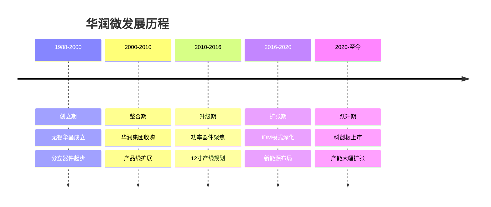
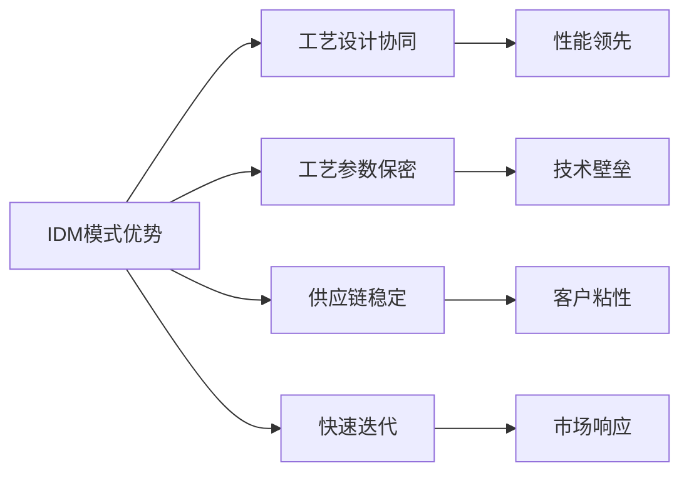
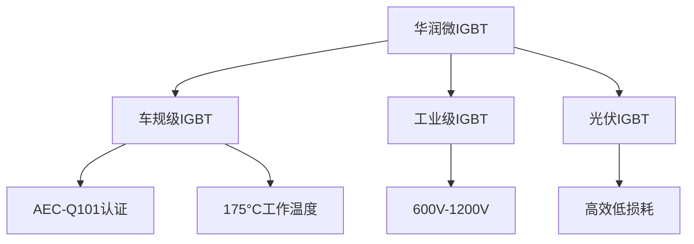
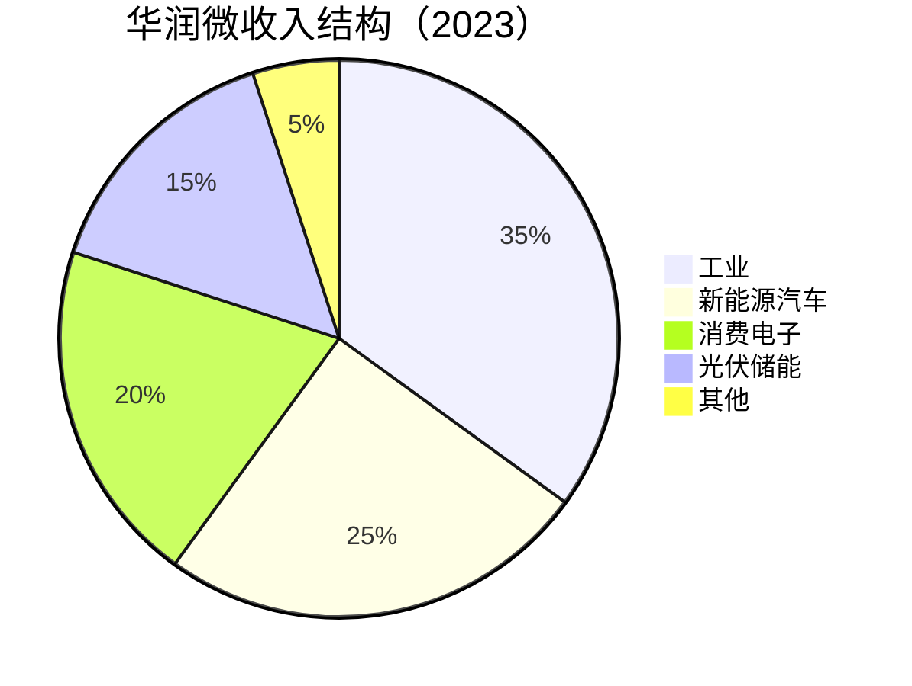
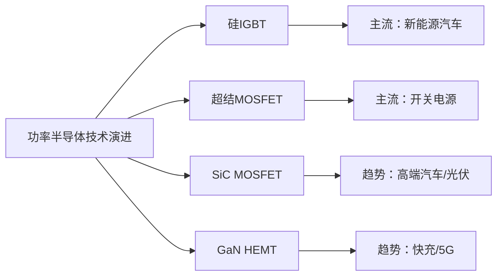

# 华润微：功率半导体IDM龙头

## 公司概况

### 基本信息

**公司名称**：华润微电子有限公司（CR Micro）
**股票代码**：688396.SH（科创板）
**成立时间**：2020年（科创板上市，前身可追溯至1988年）
**总部位置**：中国江苏无锡
**实际控制人**：华润集团（央企）

**业务范围**：
- 功率器件：MOSFET、IGBT、SBD（肖特基二极管）
- 智能控制IC：电源管理、电机驱动
- 传感器：MEMS压力传感器、磁传感器
- 晶圆代工：对外提供功率工艺代工服务

**市值规模**（2023）：
- 市值：约300亿人民币
- 中国功率半导体市场份额：约8%
- 国内功率半导体IDM排名：第一

### 发展历程

**关键里程碑**：
- 1988年：无锡华晶电子成立，中国最早的集成电路企业之一
- 2003年：华润集团收购，更名华润微电子
- 2014年：整合旗下多家半导体公司，形成IDM完整体系
- 2018年：重庆12寸功率器件产线开工建设
- 2020年：科创板上市，募资24亿人民币
- 2021年：重庆12寸产线投产，IGBT产能大幅提升
- 2022年：新能源汽车功率器件收入占比突破20%
- 2023年：深圳8寸产线扩产，SiC研发取得突破

### 股权结构

**主要股东**：
- 华润集团（央企）：约62%
- 国家集成电路基金（大基金）：约5%
- 机构投资者：约20%
- 公众股东：约13%

**央企背景优势**：
- 资金保障：华润集团资产超万亿，资金实力雄厚
- 政策支持：央企身份获得国家战略支持
- 产业协同：华润集团在新能源、消费电子等领域的产业资源
- 信用背书：央企信用评级高，融资成本低

## IDM模式深度解析

### 什么是IDM模式

半导体行业有三种主要商业模式：

**Fabless（无晶圆厂）**：只做芯片设计，委托代工厂生产。代表：高通、英伟达、联发科。
- 优点：轻资产，专注设计创新
- 缺点：依赖代工厂，供应链风险高

**Foundry（纯代工）**：只做晶圆制造，不做设计。代表：台积电、中芯国际。
- 优点：规模效应，工艺专注
- 缺点：重资产，不掌握终端市场

**IDM（垂直整合）**：设计、制造、封测全部自己做。代表：英特尔、英飞凌、德州仪器、华润微。
- 优点：全链条控制，工艺与设计协同优化
- 缺点：重资产，灵活性较低

### IDM模式在功率半导体领域的优势

功率半导体是IDM模式最适合的细分领域，原因在于：

**1. 工艺与设计高度耦合**

功率器件的性能（导通电阻、开关速度、耐压等级）与制造工艺密切相关。IDM模式下，设计工程师和工艺工程师可以紧密协作，针对特定应用场景联合优化，实现Fabless+Foundry模式难以达到的性能水平。

**2. 工艺参数保密**

功率器件的核心竞争力在于工艺参数（掺杂浓度、结深、氧化层厚度等），IDM模式可以完全保密，而Fabless模式必须将工艺细节暴露给代工厂。

**3. 供应链稳定性**

功率器件客户（汽车、工业）对供应稳定性要求极高，IDM模式自控产能，供应链更可靠。2021-2022年缺芯期间，IDM厂商的供应稳定性明显优于Fabless厂商。

**4. 快速迭代**

IDM模式下，新产品从设计到量产的周期更短，可以快速响应客户需求变化。

### 华润微IDM体系

**设计能力**：
- 设计工程师：约500人
- 设计中心：无锡、深圳、上海
- 年新品数量：100+款
- 专利数量：2000+项

**制造能力**：
- 8寸产线：无锡、深圳（合计月产能约15万片）
- 12寸产线：重庆（月产能约4万片，持续扩产）
- 工艺平台：MOSFET、IGBT、BCD、MEMS

**封测能力**：
- 封测基地：无锡、深圳
- 封装类型：TO、SOP、DFN、QFN等
- 测试能力：功率器件全系列测试

## 核心产品技术分析

### MOSFET（金属氧化物半导体场效应晶体管）

**技术原理**：

MOSFET是最基础的功率开关器件，通过栅极电压控制漏源极之间的电流通断。功率MOSFET的核心性能指标是导通电阻（RDS(on)）和耐压（BV），两者存在权衡关系（硅极限）。

**产品分类**：

*低压MOSFET（<100V）*：
- 应用：同步整流、电机驱动、DC-DC转换
- 华润微产品：20V-100V系列
- 关键指标：极低RDS(on)，快速开关

*中压MOSFET（100V-600V）*：
- 应用：开关电源、PFC电路、充电器
- 华润微产品：200V-600V系列
- 关键指标：低导通损耗，高可靠性

*高压MOSFET（>600V）*：
- 应用：工业电源、光伏逆变器
- 华润微产品：650V-900V系列
- 关键指标：高耐压，低开关损耗

**华润微MOSFET竞争力**：
- 产品覆盖：20V-900V全系列
- 技术水平：对标英飞凌OptiMOS系列
- 市场地位：国内MOSFET市占率约15%
- 主要客户：小米、华为、比亚迪、格力

**超结MOSFET（Super Junction）**：

超结技术通过在漂移区引入P型柱，突破硅极限，大幅降低导通电阻。华润微的超结MOSFET是其高端产品线，主要用于高效开关电源（服务器电源、工业电源）。

| 指标 | 普通MOSFET | 超结MOSFET | 提升幅度 |
|------|-----------|-----------|---------|
| 导通电阻 | 基准 | 降低60% | 显著 |
| 开关损耗 | 基准 | 降低30% | 明显 |
| 耐压 | 600V | 600V | 相同 |
| 成本 | 低 | 较高 | +30% |

### IGBT（绝缘栅双极型晶体管）

**技术原理**：

IGBT结合了MOSFET的高输入阻抗（易于驱动）和双极型晶体管的低导通压降（低损耗），是中高压（600V-6500V）功率开关的首选器件。

**IGBT工作原理**：
- 栅极施加正电压 → 形成沟道 → 空穴注入 → 电导调制效应 → 低导通压降
- 栅极撤去电压 → 沟道消失 → 少数载流子复合 → 关断

**IGBT关键性能指标**：
- 饱和压降（VCE(sat)）：导通损耗，越低越好
- 关断时间（toff）：开关损耗，越短越好
- 短路耐量：可靠性指标
- 工作温度：车规级要求-40°C至175°C

**产品分类**：

*平面栅IGBT*：
- 工艺成熟，成本低
- 适用：工业变频器、UPS
- 华润微：600V-1200V平面栅系列

*沟槽栅IGBT（Trench IGBT）*：
- 性能更优，导通压降更低
- 适用：新能源汽车、光伏逆变器
- 华润微：650V-1200V沟槽栅系列

*FS-IGBT（场截止型）*：
- 薄片技术，开关速度更快
- 适用：高频应用
- 华润微：正在研发中

**华润微IGBT竞争力**：

- 技术水平：第六代沟槽栅IGBT，对标英飞凌第七代
- 车规认证：AEC-Q101，进入新能源汽车供应链
- 主要客户：比亚迪、蔚来、理想、阳光电源
- 市场地位：国内IGBT市占率约10%

**新能源汽车IGBT需求**：

一辆纯电动车的IGBT用量：
- 主驱逆变器：6颗IGBT（三相桥）
- 车载充电器（OBC）：4-8颗IGBT
- DC-DC转换器：2-4颗IGBT
- 电动空调压缩机：6颗IGBT
- 合计：约20-30颗IGBT/辆

2023年中国新能源汽车销量约900万辆，对应IGBT需求约2-3亿颗，市场规模约100亿元。华润微是国内少数能提供车规级IGBT的厂商，受益显著。

### 智能控制IC

**产品线**：

*电源管理IC*：
- 产品：PWM控制器、LLC控制器、PFC控制器
- 应用：开关电源、充电器、服务器电源
- 特点：与功率器件协同设计，系统优化

*电机驱动IC*：
- 产品：无刷电机驱动、步进电机驱动
- 应用：家电、工业自动化、汽车
- 特点：集成保护功能，高可靠性

*智能功率模块（IPM）*：
- 产品：集成IGBT+驱动IC+保护电路
- 应用：变频空调、洗衣机、工业变频器
- 特点：高集成度，简化客户设计

**IDM协同优势**：
华润微的智能控制IC与功率器件协同设计，可以实现最优的系统性能。例如，IPM产品中的驱动IC专门针对华润微自家IGBT的特性优化，开关损耗比通用方案低15-20%。

### MEMS传感器

**产品线**：
- 压力传感器：汽车胎压、工业压力检测
- 磁传感器：电流检测、位置检测
- 加速度传感器：汽车安全系统

**市场地位**：
- 国内MEMS压力传感器市占率：约15%
- 主要客户：博世、大陆、汽车OEM
- 技术水平：车规级，AEC-Q100认证

**战略意义**：
MEMS传感器是华润微差异化布局，与功率器件形成互补，共同服务汽车电子市场，提升客户粘性。

## 产能布局与扩张

### 现有产能

**无锡基地（8寸）**：
- 产线：2条8寸产线
- 月产能：约8万片
- 主要产品：MOSFET、BCD工艺、MEMS
- 工艺节点：0.35μm-0.18μm

**深圳基地（8寸）**：
- 产线：1条8寸产线（原中航微电子）
- 月产能：约7万片
- 主要产品：IGBT、功率器件
- 工艺节点：0.35μm-0.18μm

**重庆基地（12寸）**：
- 产线：1条12寸产线
- 月产能：约4万片（持续爬坡）
- 主要产品：IGBT、超结MOSFET
- 工艺节点：90nm-0.18μm
- 投产时间：2021年

**总产能**：
- 8寸当量：约19万片/月
- 12寸产能：约4万片/月（相当于9万片8寸当量）
- 合计8寸当量：约28万片/月

### 扩产规划

**重庆12寸扩产**：
- 目标：从4万片/月扩至8万片/月（2025年）
- 投资：约50亿人民币
- 主要产品：车规级IGBT、超结MOSFET
- 战略意义：12寸产线成本比8寸低30-40%

**深圳8寸扩产**：
- 目标：从7万片/月扩至10万片/月
- 投资：约15亿人民币
- 主要产品：IGBT、功率器件

**SiC产线规划**：
- 计划：建设6寸SiC产线
- 时间：2025-2026年
- 投资：约30亿人民币
- 战略意义：布局下一代功率半导体

### 12寸产线的战略意义

12寸产线相比8寸产线的优势：

| 对比项 | 8寸产线 | 12寸产线 | 提升 |
|--------|--------|---------|------|
| 单片面积 | 200mm | 300mm | +125% |
| 芯片产出 | 基准 | +2.25倍 | 显著 |
| 单位成本 | 基准 | -30~40% | 显著 |
| 工艺节点 | 0.35μm+ | 90nm+ | 更先进 |
| 毛利率 | 约30% | 约40% | +10ppt |

重庆12寸产线是华润微未来增长的核心引擎，产能爬坡将显著提升公司的收入规模和盈利能力。

## 市场地位与竞争格局

### 全球功率半导体市场

**市场规模**：
- 2023年：约250亿美元
- 年增长率：10-12%
- 2025E：300亿美元
- 主要驱动：新能源汽车、光伏储能、工业自动化

**全球功率半导体格局**：

| 公司 | 市占率 | 总部 | 核心产品 |
|------|--------|------|---------|
| 英飞凌（Infineon） | 20% | 德国 | IGBT、MOSFET、SiC |
| 安森美（onsemi） | 10% | 美国 | MOSFET、SiC |
| 意法半导体（ST） | 9% | 瑞士 | MOSFET、IGBT、SiC |
| 三菱电机 | 7% | 日本 | IGBT模块 |
| 富士电机 | 5% | 日本 | IGBT模块 |
| 华润微 | 3% | 中国 | MOSFET、IGBT |
| 士兰微 | 2% | 中国 | MOSFET、IGBT |
| 其他 | 44% | 分散 | 各类 |

**中国功率半导体市场**：
- 市场规模：约80亿美元（2023）
- 国产化率：约20%
- 替代空间：约64亿美元
- 华润微国内市占率：约8%

### 竞争对手分析

**国际竞争对手**：

*英飞凌（Infineon）*：
- 全球功率半导体龙头，市占率20%
- 技术领先：第七代IGBT、CoolMOS超结MOSFET
- 在华市场：约占中国功率半导体市场30%
- 华润微差距：技术代差约1-2代，但差距在缩小

*安森美（onsemi）*：
- SiC领域全球第二，MOSFET实力强
- 在华市场：约占中国功率半导体市场10%
- 华润微差距：SiC技术差距较大

**国内竞争对手**：

*士兰微*：
- 定位：与华润微最接近的竞争对手
- 产品：MOSFET、IGBT、MCU
- 差异：士兰微更偏消费电子，华润微更偏工业/汽车
- 规模：收入约为华润微的60%

*比亚迪半导体*：
- 定位：新能源汽车IGBT专家
- 优势：比亚迪整车客户保障
- 差异：主要自用，对外销售有限
- 威胁：若大规模对外销售，将直接竞争

*斯达半导*：
- 定位：IGBT专家
- 优势：IGBT技术积累深
- 差异：纯Fabless，依赖华虹代工
- 规模：收入约为华润微的40%

**华润微的差异化优势**：
- IDM模式：工艺设计协同，竞争对手难以复制
- 产品全面：MOSFET+IGBT+IC+传感器，一站式服务
- 央企背景：资金实力强，政策支持
- 12寸产线：成本优势持续提升

### 客户结构

**按行业分布**：

**主要客户**：
- 比亚迪：新能源汽车IGBT
- 阳光电源：光伏逆变器IGBT
- 格力电器：变频空调IPM
- 美的集团：家电功率器件
- 华为：服务器电源MOSFET
- 小米：消费电子MOSFET
- 宁德时代：储能系统功率器件

**客户特点**：
- 国内客户为主：占收入约85%
- 新能源客户快速增长：占比从10%提升至25%
- 客户粘性强：IDM模式定制化，切换成本高
- 长期合作：平均合作年限5年+

## 财务分析

### 收入分析

**收入历史**：

| 年份 | 收入（亿元） | 增长率 | 净利润（亿元） | 净利率 |
|------|------------|--------|--------------|--------|
| 2019 | 52 | 5% | 3 | 6% |
| 2020 | 60 | 15% | 5 | 8% |
| 2021 | 90 | 50% | 18 | 20% |
| 2022 | 100 | 11% | 20 | 20% |
| 2023E | 85 | -15% | 12 | 14% |

**2021-2022年高增长原因**：
- 半导体超级周期：全球缺芯
- 新能源汽车爆发：IGBT需求激增
- 产能利用率：接近100%
- 价格上涨：供不应求

**2023年下滑原因**：
- 半导体周期下行：消费电子需求疲软
- 产能利用率下降：从95%降至约80%
- 价格压力：MOSFET价格回落
- 库存去化：渠道库存高企

**长期增长驱动**：
- 新能源汽车：IGBT需求持续增长
- 12寸产能爬坡：成本下降，收入提升
- 国产替代：国内客户优先采购
- SiC布局：下一代功率半导体

### 盈利能力

**毛利率分析**：
- 2019-2020年：毛利率约35%
- 2021-2022年：毛利率约45%（周期高点）
- 2023E：毛利率约38%（周期下行）
- 长期目标：40%+

**华润微毛利率高于同行的原因**：
- IDM模式：全链条利润，无需支付代工费
- 产品结构：工业/汽车占比高，毛利率更高
- 技术壁垒：功率器件定制化，溢价能力强
- 12寸产线：成本持续优化

**与国际对手对比**：

| 公司 | 毛利率 | 净利率 | 模式 |
|------|--------|--------|------|
| 英飞凌 | 45% | 18% | IDM |
| 安森美 | 48% | 20% | IDM |
| 华润微 | 38% | 14% | IDM |
| 士兰微 | 30% | 8% | IDM |
| 斯达半导 | 35% | 20% | Fabless |

华润微毛利率与国际IDM龙头差距约7-10个百分点，主要来自规模差距和技术代差，随着12寸产能扩张和技术升级，差距有望逐步缩小。

### 资本支出

**年资本支出**：
- 2021年：约20亿元
- 2022年：约25亿元
- 2023年：约30亿元（重庆扩产+SiC布局）

**资本支出效率**：
- 每亿元资本支出对应新增产能：约0.3万片/月（12寸）
- 投资回收期：约5-7年
- ROIC：约12-15%（周期高点约20%）

### 财务健康度

**资产负债表**：
- 资产负债率：约40%（科创板上市后改善）
- 流动比率：2.0
- 净现金：约15亿元

**偿债能力**：
- 利息覆盖倍数：8-12倍
- 债务/EBITDA：1.5-2倍
- 财务风险：低

## 竞争优势分析

### 1. IDM模式的深度壁垒

华润微的IDM模式是其最核心的竞争壁垒。功率器件的性能高度依赖工艺参数，IDM模式下设计与工艺的协同优化是Fabless+Foundry模式无法复制的。

**具体体现**：
- 超结MOSFET：华润微自研工艺，导通电阻比行业平均低20%
- 车规IGBT：专为新能源汽车优化的工艺，短路耐量达10μs（行业标准8μs）
- IPM模块：驱动IC与IGBT协同设计，系统效率提升15%

### 2. 产品线完整性

华润微是国内少数能提供MOSFET+IGBT+IC+传感器完整产品线的功率半导体公司。这种完整性带来：
- 一站式服务：客户可以从华润微采购整套功率解决方案
- 交叉销售：IGBT客户同时采购驱动IC，提升客户价值
- 系统优化：不同产品协同设计，整体性能更优

### 3. 新能源汽车战略布局

华润微较早布局新能源汽车功率器件，已获得比亚迪、蔚来、理想等主流新能源车企认证。车规级认证周期长（通常2-3年），一旦进入供应链，客户粘性极强。

**车规认证壁垒**：
- AEC-Q101认证：功率器件车规标准
- IATF 16949认证：汽车质量管理体系
- 客户认证：每家车企独立认证，周期2-3年
- 一旦认证：通常合作5-10年

### 4. 央企资金实力

华润集团资产超万亿，为华润微提供强大的资金支持。在半导体这个重资产行业，资金实力决定了扩产速度和研发投入。华润微的资本支出能力显著强于民营竞争对手（士兰微、斯达半导）。

### 5. 12寸产线成本优势

重庆12寸产线投产后，华润微的单位成本持续下降。12寸产线的成本优势将在未来3-5年逐步体现，使华润微在价格竞争中更具优势，同时毛利率有望提升至40%+。

## 行业趋势与机会

### 1. 新能源汽车驱动IGBT需求爆发

**市场数据**：
- 2023年中国新能源汽车销量：约900万辆
- 2025E：约1500万辆
- 2030E：约3000万辆
- 每辆电动车IGBT价值：约500-1000元

**华润微受益路径**：
- 主驱IGBT：已进入比亚迪、蔚来供应链
- OBC用IGBT：车载充电器需求
- 充电桩IGBT：公共充电基础设施
- 目标：新能源汽车收入占比从25%提升至40%

### 2. 光伏储能驱动功率器件需求

**市场背景**：
- 全球光伏新增装机：2023年约350GW
- 储能市场：快速增长
- 每GW光伏需要IGBT价值：约1亿元

**华润微布局**：
- 光伏逆变器IGBT：阳光电源、华为数字能源
- 储能变流器：宁德时代、比亚迪储能
- 目标：光伏储能收入占比从15%提升至25%

### 3. 工业自动化升级

**市场背景**：
- 中国制造业升级：工业机器人、变频器需求增长
- 工业功率半导体：年增长率约8%
- 国产替代：工业客户逐步转向国产

**华润微布局**：
- 变频器IGBT：工业电机驱动
- 工业电源MOSFET：服务器、UPS
- IPM模块：家电变频、工业驱动

### 4. SiC（碳化硅）布局

**SiC的优势**：
- 耐高压：可达10kV以上
- 耐高温：工作温度200°C+
- 低损耗：开关损耗比硅IGBT低70%
- 高频：开关频率更高

**市场规模**：
- 2023年：约20亿美元
- 2025E：50亿美元
- 2030E：100亿美元
- CAGR：30%+

**华润微SiC战略**：
- 当前：SiC器件研发，已有样品
- 2025年：6寸SiC产线建设
- 2026年：SiC器件量产
- 目标客户：新能源汽车主驱逆变器

**SiC的战略意义**：
SiC是功率半导体的下一代技术，特斯拉Model 3已全面采用SiC MOSFET替代IGBT。华润微若能在SiC领域取得突破，将在下一轮技术迭代中占据有利位置。

## 投资价值评估

### 估值分析

**当前估值（2023）**：
- PE：约25倍（盈利下滑中）
- PS：约3.5倍
- PB：约3倍
- EV/EBITDA：约12倍

**估值对比**：

| 公司 | PE | PS | PB | 毛利率 | 净利率 | 模式 |
|------|----|----|----|----|----|----|
| 华润微 | 25 | 3.5 | 3 | 38% | 14% | IDM |
| 士兰微 | 30 | 2 | 2.5 | 30% | 8% | IDM |
| 斯达半导 | 20 | 4 | 3 | 35% | 20% | Fabless |
| 英飞凌 | 18 | 3 | 3 | 45% | 18% | IDM |
| 安森美 | 15 | 3 | 4 | 48% | 20% | IDM |

**估值分析**：
- 相对英飞凌、安森美：华润微估值偏高，但成长性更好（国产替代+新能源）
- 相对斯达半导：估值相近，但华润微IDM模式壁垒更深
- 绝对估值：合理，考虑12寸产能扩张和新能源汽车驱动的成长性

### 投资论点

**看多理由**：
1. IDM模式壁垒：工艺设计协同，难以复制
2. 新能源汽车红利：IGBT需求持续爆发
3. 12寸产能扩张：成本下降，毛利率提升
4. 产品线完整：MOSFET+IGBT+IC+传感器，一站式服务
5. 央企资金实力：扩产无忧，研发持续投入
6. 国产替代：国内客户优先采购，市占率提升
7. SiC布局：下一代技术卡位
8. 光伏储能：新增长曲线

**看空理由**：
1. 半导体周期：当前处于下行周期，2023年收入下滑
2. 产能利用率：从95%降至80%，盈利压力
3. 技术差距：与英飞凌、安森美仍有1-2代差距
4. SiC竞争：英飞凌、安森美SiC技术领先
5. 客户集中：比亚迪、阳光电源占比高
6. 折旧压力：12寸产线大额折旧

### 投资建议

**适合投资者**：
- 看好新能源汽车产业链的投资者
- 看好国产替代的投资者
- 中长期价值投资者

**投资策略**：
- 建仓区间：28-32元（当前约35元）
- 持有周期：3-5年
- 目标价：55元+（2025年）
- 止损位：22元

**关键催化剂**：
- 12寸产能利用率回升至90%+
- 新能源汽车IGBT订单增加
- SiC器件量产
- 毛利率回升至42%+
- 新客户（海外车企）进入

## 常见问题

### Q1：华润微与斯达半导有什么区别？

两者都是国内IGBT领域的重要公司，但商业模式不同。华润微是IDM模式，自有设计+自有产线+自有封测；斯达半导是Fabless模式，只做设计，委托华虹半导体代工。IDM模式的优势是工艺设计协同、供应链稳定、毛利率更高；Fabless的优势是轻资产、灵活性高。从长期竞争力看，IDM模式在功率半导体领域更具优势，因为功率器件性能高度依赖工艺。

### Q2：华润微的12寸产线对财务有什么影响？

12寸产线短期会增加折旧压力（每条产线年折旧约8-12亿元），但长期将显著提升竞争力。12寸产线的单位成本比8寸低30-40%，毛利率高约10个百分点。随着重庆12寸产能从4万片/月扩至8万片/月，华润微的年收入有望突破150亿元，净利率回升至18%+。

### Q3：新能源汽车对华润微的影响有多大？

新能源汽车是华润微最重要的增长驱动力。2023年新能源汽车收入占比约25%，预计2025年提升至40%。一辆电动车需要IGBT约20-30颗，价值约500-1000元，是传统燃油车的10倍以上。华润微已获得比亚迪、蔚来、理想等主流车企认证，随着新能源汽车渗透率持续提升，IGBT业务将持续高速增长。

### Q4：SiC对华润微的威胁有多大？

SiC是功率半导体的下一代技术，长期来看会逐步替代部分IGBT应用（尤其是高端新能源汽车主驱）。但这个替代过程是渐进的：SiC成本目前是IGBT的3-5倍，短期内IGBT仍是主流；华润微已在积极布局SiC，计划2026年量产；即使SiC替代IGBT，华润微也可以用自家SiC产品替代，不会失去市场。

### Q5：华润微的国产替代空间有多大？

中国功率半导体市场约80亿美元，国产化率约20%，替代空间约64亿美元。华润微当前国内市占率约8%，若提升至15%，对应收入增量约56亿元（约8亿美元）。国产替代的驱动力包括：供应链安全意识提升、国内产品性能持续改善、价格优势、政策支持。预计未来5年，华润微国内市占率有望从8%提升至12-15%。

### Q6：华润微的长期竞争壁垒是什么？

华润微的长期竞争壁垒来自四个层面：第一，IDM模式的工艺设计协同，这是功率半导体领域最深的护城河；第二，车规认证壁垒，进入汽车供应链后客户粘性极强；第三，12寸产线的成本优势，随着产能爬坡，成本竞争力持续提升；第四，央企资金实力，保障持续的研发投入和产能扩张。

## 参考文献

1. 华润微电子. 《年度报告》. 2019-2023
2. 华润微电子. 《科创板招股说明书》. 2020
3. 中金公司. 《华润微深度报告：IDM龙头，新能源汽车受益》. 2023
4. 招商证券. 《华润微：12寸扩产，功率器件新机遇》. 2023
5. 天风证券. 《功率半导体行业研究：国产替代加速》. 2023
6. 华泰证券. 《华润微竞争力分析》. 2023
7. 英飞凌. 《年度报告》. 2023
8. 安森美. 《年度报告》. 2023
9. IHS Markit. 《功率半导体市场研究》. 2023
10. Yole Development. 《SiC功率半导体市场报告》. 2023
11. 中国半导体行业协会. 《中国集成电路产业发展报告》. 2023
12. 比亚迪半导体. 《产品白皮书》. 2023
13. 阳光电源. 《年度报告》. 2023
14. 麦肯锡. 《新能源汽车功率半导体市场研究》. 2023
15. 国际能源署（IEA）. 《全球电动汽车展望》. 2023
16. 士兰微. 《年度报告》. 2023
17. 斯达半导. 《年度报告》. 2023

---

**投资建议**：
华润微是中国功率半导体IDM龙头，IDM模式带来工艺设计协同的深度壁垒，产品线覆盖MOSFET、IGBT、智能控制IC和MEMS传感器。新能源汽车爆发带动IGBT需求持续增长，重庆12寸产线扩张（4万片→8万片/月）将显著提升成本竞争力和盈利能力，SiC布局卡位下一代技术。当前估值（PE 25倍）合理，建议在28-32元区间分批建仓，持有3-5年，目标价55元+。

**风险提示**：
主要风险包括：半导体周期下行导致产能利用率下降、12寸产线折旧压力、SiC技术替代IGBT的速度超预期、英飞凌等国际巨头加大中国市场投入、客户集中度高（比亚迪、阳光电源）、新能源汽车增速不及预期等。建议仓位控制在8-10%，密切跟踪产能利用率和新能源汽车IGBT订单变化。

---

[← 返回半导体行业](index.html)
