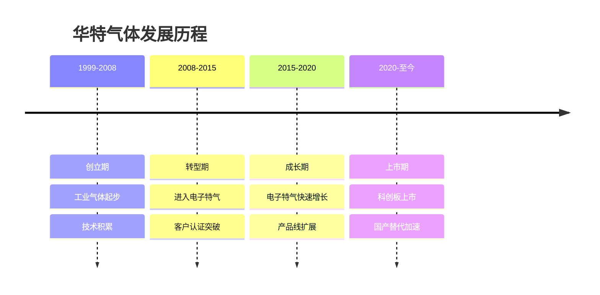
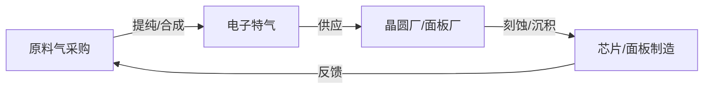
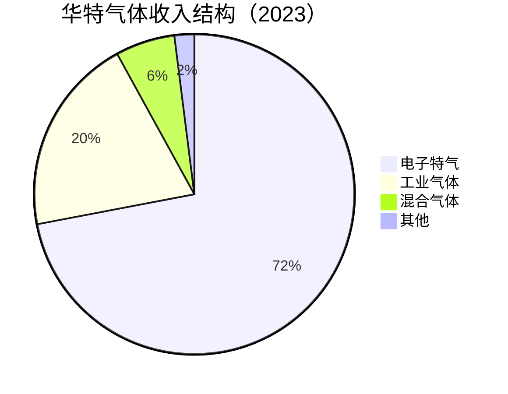
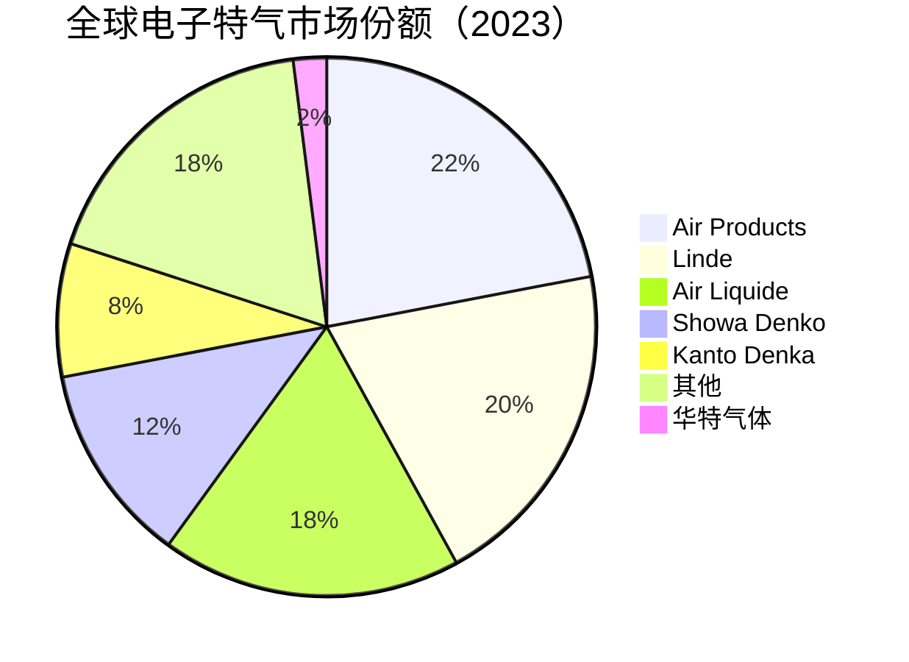

# 华特气体：电子特气国产化龙头

## 公司概况

### 基本信息

**公司名称**：华特气体股份有限公司（Huate Gas Co., Ltd.）
**股票代码**：688268.SH（科创板）
**成立时间**：1999年
**总部位置**：中国深圳
**实际控制人**：王健（创始人）

**业务范围**：
- 电子特气：核心业务，占收入70%+
- 工业气体：传统业务
- 混合气体：定制化产品
- 气体设备：配套服务

**市值规模**（2023）：
- 市值：约120亿人民币
- 中国电子特气龙头之一
- 全球电子特气市场份额约2%

### 发展历程

**关键里程碑**：
- 1999年：公司成立，从事工业气体
- 2008年：开始研发电子特气
- 2012年：首批电子特气通过客户认证
- 2015年：进入中芯国际供应链
- 2018年：电子特气收入超过工业气体
- 2020年：科创板上市，募资8亿
- 2023年：电子特气产品覆盖50+品种

### 股权结构

**主要股东**：
- 王健（创始人）：约40%
- 机构投资者：约35%
- 公众股东：约25%

**战略意义**：
- 民营企业：市场化运营
- 创始人控制：战略稳定
- 机构认可：专业投资者持股

## 商业模式分析

### 电子特气供应商模式

**业务模式**：

**产业链位置**：
- 上游：原料气（工业气体、化工原料）
- 中游：电子特气（华特气体）
- 下游：晶圆代工厂、面板厂、LED厂

**商业模式特点**：
- 技术密集：提纯工艺复杂，纯度要求极高
- 认证周期：1-2年
- 客户粘性：一旦认证，不易更换
- 消耗品：持续消耗，稳定收入
- 安全要求：高压、有毒，安全管理严格

### 业务结构

**按产品分类**：

**按客户分类**：
- 半导体晶圆厂：45%
- 面板厂：25%
- LED厂：15%
- 其他：15%

## 电子特气技术深度分析

### 电子特气原理

**什么是电子特气**：
电子特气（Electronic Specialty Gas）是半导体、面板、LED等电子制造中使用的高纯度特种气体，纯度要求极高（通常6N以上），是芯片制造的关键材料。

**核心作用**：
- 刻蚀气体：CF₄、SF₆、Cl₂等，用于等离子体刻蚀
- 沉积气体：SiH₄、NH₃、N₂O等，用于薄膜沉积
- 掺杂气体：AsH₃、PH₃、B₂H₆等，用于离子注入
- 清洗气体：NF₃、ClF₃等，用于腔室清洗
- 载气：N₂、Ar、He等，用于工艺载气

**技术要求**：
- 纯度：99.9999%（6N）以上
- 杂质：金属杂质<1ppb，水分<1ppm
- 颗粒：<10个/L
- 稳定性：长期储存稳定
- 安全性：有毒/易燃，需特殊处理

### 主要产品矩阵

**1. 刻蚀气体**

**产品类型**：
- CF₄（四氟化碳）：氧化物刻蚀
- SF₆（六氟化硫）：硅刻蚀
- Cl₂（氯气）：金属刻蚀
- HBr（溴化氢）：硅刻蚀
- BCl₃（三氯化硼）：铝刻蚀
- CHF₃（三氟甲烷）：氧化物刻蚀

**应用场景**：
- 干法刻蚀：等离子体刻蚀工艺
- 图案转移：将光刻图案转移到硅片
- 制程：28nm-3nm先进制程

**华特能力**：
- CF₄：已量产，6N纯度
- SF₆：已量产，6N纯度
- Cl₂：已量产，6N纯度
- 认证：通过中芯国际28nm认证

**2. 沉积气体**

**产品类型**：
- SiH₄（硅烷）：多晶硅、氮化硅沉积
- NH₃（氨气）：氮化硅沉积
- N₂O（氧化亚氮）：氧化硅沉积
- TEOS（正硅酸乙酯）：氧化硅CVD
- WF₆（六氟化钨）：钨填充

**应用场景**：
- CVD工艺：化学气相沉积
- ALD工艺：原子层沉积
- 薄膜沉积：各种功能薄膜

**华特能力**：
- SiH₄：已量产，6N纯度
- NH₃：已量产，6N纯度
- N₂O：已量产，6N纯度
- 认证：通过多家客户认证

**3. 掺杂气体**

**产品类型**：
- AsH₃（砷化氢）：N型掺杂
- PH₃（磷化氢）：N型掺杂
- B₂H₆（乙硼烷）：P型掺杂
- BF₃（三氟化硼）：P型掺杂

**应用场景**：
- 离子注入：改变硅片导电性
- 扩散：热扩散掺杂
- 制程：各种制程节点

**技术难点**：
- 极毒：AsH₃、PH₃极毒，安全要求极高
- 纯度：杂质影响掺杂精度
- 储存：特殊容器，安全储存

**华特能力**：
- AsH₃：已量产，安全处理体系完善
- PH₃：已量产
- B₂H₆：已量产
- 安全：完善的安全管理体系

**4. 清洗气体**

**产品类型**：
- NF₃（三氟化氮）：腔室清洗
- ClF₃（三氟化氯）：腔室清洗
- F₂（氟气）：腔室清洗

**应用场景**：
- 设备清洗：清洗CVD/ALD腔室
- 维护：定期清洗，保证工艺稳定

**市场规模**：
- NF₃全球市场：约5亿美元
- 中国市场：约1.5亿美元
- 国产化率：约20%
- 华特份额：约10%

**5. 高纯载气**

**产品类型**：
- 高纯氮气（N₂）：6N纯度
- 高纯氩气（Ar）：6N纯度
- 高纯氦气（He）：6N纯度
- 高纯氢气（H₂）：6N纯度

**应用场景**：
- 工艺载气：携带反应气体
- 保护气：防止氧化
- 冷却气：设备冷却

**华特能力**：
- 全系列高纯载气：已量产
- 纯度：6N标准
- 供应：稳定大批量供应

### 提纯技术

**提纯方法**：
- 精馏：分离沸点不同的组分
- 吸附：选择性吸附杂质
- 膜分离：选择性透过
- 化学纯化：化学反应去除杂质

**关键技术**：
- 深冷分离：-200°C以下分离
- 变压吸附（PSA）：高效分离
- 催化纯化：催化去除杂质
- 在线检测：实时监控纯度

**华特技术水平**：
- 提纯技术：达到国内领先水平
- 纯度：6N标准，部分产品7N
- 检测：痕量分析，ppb级检测
- 认证：通过多家国际客户认证

## 市场地位分析

### 全球电子特气市场

**市场规模**：
- 2023年：约50亿美元
- 年增长率：8-10%
- 2025E：60亿美元
- 驱动因素：晶圆厂扩产、先进制程

**市场格局**：

**竞争特点**：
- 欧美日垄断：前五大占80%+
- 技术壁垒：提纯工艺复杂
- 安全壁垒：有毒气体，安全要求高
- 认证壁垒：客户认证周期长

### 中国电子特气市场

**市场规模**：
- 2023年：约15亿美元
- 全球占比：30%
- 年增长率：15%+
- 2025E：20亿美元

**自给率**：
- 整体自给率：约15%
- 高端电子特气：<5%
- 成熟制程特气：约25%
- 目标：2025年达到25%

**国产替代空间**：
- 中国需求：15亿美元
- 国产供应：2.25亿美元
- 进口依赖：12.75亿美元
- 替代空间：巨大

### 华特气体市场地位

**全球排名**：
- 电子特气：全球前十五
- 中国市场：前三

**市场份额**：
- 全球市场：约2%
- 中国市场：约8%
- 增长趋势：快速提升

**客户结构**：
- 中芯国际：最大客户（25%）
- 华虹半导体：重要客户（15%）
- 京东方：面板客户（15%）
- 长江存储：新兴客户（10%）
- 其他：35%

## 竞争优势分析

### 1. 技术优势

**提纯技术**：
- 自主研发：核心提纯工艺
- 专利保护：150+专利
- 纯度：6N标准，部分7N
- 检测：ppb级痕量分析

**产品覆盖**：
- 刻蚀气体：10+品种
- 沉积气体：10+品种
- 掺杂气体：5+品种
- 清洗气体：3+品种
- 载气：5+品种
- 总计：50+品种

**技术突破**：
- NF₃：国内首家量产
- 高纯AsH₃：安全处理技术
- 混合气体：精确配比技术

### 2. 安全管理优势

**安全体系**：
- 有毒气体：完善的安全处理体系
- 储存：特殊容器，安全储存
- 运输：专业危化品运输
- 应急：完善的应急预案

**安全壁垒**：
- 有毒气体（AsH₃、PH₃）：安全要求极高
- 新进入者：安全体系建设需要大量投入
- 认证：安全认证周期长
- 壁垒：安全管理是重要竞争壁垒

### 3. 客户优势

**战略客户**：
- 中芯国际：最大客户，长期合作
- 华虹半导体：稳定合作
- 京东方：面板龙头
- 长江存储：新兴重要客户

**客户粘性**：
- 认证周期：1-2年
- 工艺绑定：深度嵌入客户工艺
- 安全依赖：客户依赖供应商安全体系
- 本地化：快速响应

### 4. 国产替代优势

**政策支持**：
- 科创板上市：资金支持
- 税收优惠：高新技术企业
- 地方政府：深圳产业支持
- 客户意愿：主动国产化

**本地化优势**：
- 快速响应：本地团队
- 技术支持：深度服务
- 成本优势：人力成本低
- 定制化：满足特殊需求

## 财务分析

### 收入分析

**收入增长**：
- 2019年：6亿人民币
- 2020年：7亿
- 2021年：10亿
- 2022年：13亿
- 2023E：17亿
- CAGR（2019-2023）：30%

**收入驱动**：
- 电子特气占比提升：从50%到72%
- 客户拓展：新客户导入
- 国产替代：市场份额提升
- 消耗品：稳定重复购买

### 盈利能力

**毛利率**：
- 2019年：30%
- 2020年：32%
- 2021年：35%
- 2022年：37%
- 2023E：38%

**净利率**：
- 2019年：10%
- 2020年：11%
- 2021年：13%
- 2022年：15%
- 2023E：16%

**ROE**：
- 2022年：15%
- 2023E：18%
- 2025E：22%+

### 财务数据表（2019-2023）

| 指标 | 2019 | 2020 | 2021 | 2022 | 2023E |
|------|------|------|------|------|-------|
| 收入（亿） | 6 | 7 | 10 | 13 | 17 |
| 增长率 | 20% | 17% | 43% | 30% | 31% |
| 毛利率 | 30% | 32% | 35% | 37% | 38% |
| 净利率 | 10% | 11% | 13% | 15% | 16% |
| 净利润（亿） | 0.6 | 0.77 | 1.3 | 1.95 | 2.7 |
| ROE | 12% | 13% | 15% | 17% | 18% |
| 经营现金流（亿） | 1.0 | 1.2 | 2.0 | 3.0 | 4.0 |
| 资本支出（亿） | 2 | 3 | 4 | 5 | 6 |
| 资产负债率 | 40% | 38% | 35% | 32% | 30% |

**财务特点**：
- 消耗品：稳定收入，现金流好
- 毛利率提升：电子特气占比提升
- 盈利改善：规模效应显现
- 资本支出：相对适中

## 投资价值评估

### 估值分析

**当前估值（2023）**：
- PE：约45倍
- PS：约7倍
- PB：约7倍
- EV/EBITDA：约30倍

**估值对比**：

| 公司 | PE | PS | PB | 市值（亿美元） | 业务 | 毛利率 | 净利率 |
|------|----|----|----|--------------|----|--------|--------|
| 华特气体 | 45 | 7 | 7 | 17 | 电子特气 | 38% | 16% |
| Air Products | 28 | 4 | 4 | 600 | 工业+电子气体 | 35% | 15% |
| Linde | 30 | 5 | 5 | 1800 | 工业+电子气体 | 40% | 18% |
| Showa Denko | 20 | 2 | 2 | 30 | 电子特气 | 35% | 12% |
| 雅克科技 | 45 | 9 | 8 | 28 | 前驱体+光刻胶 | 43% | 20% |

**估值分析**：
- PE 45倍：高于国际同行（20-30倍）
- 溢价原因：国产替代、高成长性
- 盈利能力：与国际同行相当
- 成长性：高增长（30%+）支撑高估值

### 投资论点

**看多理由**：
1. 电子特气国产替代：自给率<15%，空间巨大
2. 消耗品模式：稳定收入，现金流好
3. 产品线全面：50+品种，一站式供应
4. 成长性好：收入增长30%+
5. 客户优质：中芯国际、京东方
6. 安全壁垒：有毒气体安全管理，竞争者少
7. 政策支持：国产替代优先
8. 多应用：半导体+面板+LED
9. 规模效应：产能扩张，成本下降
10. 管理层：创始人持股，利益一致

**看空理由**：
1. 估值偏高：PE 45倍，PS 7倍
2. 规模较小：市值17亿美元
3. 技术差距：与国际巨头仍有差距
4. 客户集中：前三大客户55%
5. 竞争加剧：国内外竞争者增多
6. 原材料依赖：部分原料气进口
7. 安全风险：有毒气体，安全事故风险
8. 地缘政治：技术封锁风险

### 投资建议

**适合投资者**：
- 看好国产替代的投资者
- 看好消耗品商业模式的投资者
- 中长期投资者（3-5年）
- 风险适中的投资者

**投资策略**：
- 建仓区间：PE 35-40倍
- 持有周期：3-5年
- 目标价：基于PE 40倍，2025年净利润5亿，目标市值200亿
- 止损位：PE < 25倍

**当前建议**：
- 估值合理：PE 45倍，可以建仓
- 分批建仓：3-6个月
- 长期持有：3-5年战略投资

## 行业趋势与机会

### 1. 晶圆厂扩产驱动

**中国晶圆厂扩产**：
- 中芯国际：28nm月产能从10万片到30万片
- 华虹半导体：28nm月产能从5万片到15万片
- 长江存储：NAND月产能从10万片到30万片
- 合肥长鑫：DRAM持续扩产

**电子特气需求增长**：
- 每片硅片消耗电子特气：约50-100克
- 产能增长3倍：电子特气需求增长3倍
- 华特受益：核心供应商地位

**市场影响**：
- 2024-2025年：电子特气需求增长50%+
- 华特收入：从17亿增长到25亿+
- 市场份额：从8%提升至12%+

### 2. 面板行业需求

**面板扩产**：
- 京东方：持续扩产OLED产线
- 华星光电：扩产LCD、OLED
- 维信诺：OLED扩产

**电子特气需求**：
- OLED制造：需要大量电子特气
- 刻蚀气体：CF₄、SF₆
- 沉积气体：SiH₄、NH₃
- 华特机会：面板客户占25%收入

**市场规模**：
- 面板电子特气：约5亿美元（中国）
- 国产化率：约20%
- 华特份额：约10%
- 增长：面板扩产驱动

### 3. 新能源汽车半导体

**需求背景**：
新能源汽车快速发展，功率半导体（IGBT、SiC）需求大幅增长，带动相关晶圆厂扩产，电子特气需求增长。

**市场机会**：
- 功率半导体晶圆厂：扩产
- 电子特气需求：增长
- 华特机会：新客户导入

**增长预测**：
- 2024-2025年：功率半导体电子特气需求增长30%+
- 华特受益：新客户，新收入

## 竞争对手分析

### Air Products（美国空气产品）

**市场地位**：
- 全球第一：电子特气22%市场份额
- 技术领先：全球最强
- 客户：全球主要晶圆厂

**竞争优势**：
- 技术积累：50年+
- 产品线：最全面
- 全球布局：各大晶圆厂附近建厂
- 品牌溢价：高端市场

**华特对比**：
- 技术差距：1-2代
- 规模差距：Air Products 35倍
- 本地化：华特更有优势
- 成本：华特更低

### Showa Denko（日本昭和电工）

**市场地位**：
- 全球第四：电子特气12%市场份额
- 技术：主流水平
- 客户：全球晶圆厂

**竞争优势**：
- 技术积累：40年+
- 产品线：全面
- 日本客户：本地优势

**华特对比**：
- 技术差距：1代
- 规模差距：Showa Denko 5倍
- 中国市场：华特更有优势
- 成本：华特更低

### 国内竞争对手

**主要竞争者**：
- 凯美特气：工业气体+电子特气
- 南大光电：电子特气（部分）
- 雅克科技：电子特气（部分）

**竞争格局**：
- 华特气体：产品线最全，规模最大
- 凯美特气：工业气体为主，电子特气较弱
- 南大光电/雅克科技：电子特气为辅助业务

**竞争优势**：
- 华特：专注电子特气，产品线最全
- 规模：国内最大电子特气专业厂商
- 认证：客户认证最多

## 投资启示

### 1. 消耗品商业模式的稳定性

**消耗品特点**：
电子特气是典型的消耗品，每次工艺都需要消耗。晶圆厂产能越大，消耗越多。这种商业模式的优点：
- 稳定收入：持续重复购买
- 可预测性：收入可预测
- 客户粘性：更换成本高
- 现金流好：稳定的经营现金流

**对比资本品**：
- 设备：一次性购买，收入不稳定
- 材料：持续消耗，收入稳定
- 估值：消耗品通常享有更高估值

### 2. 安全壁垒的价值

**安全壁垒**：
有毒气体（AsH₃、PH₃等）的安全管理是重要竞争壁垒。新进入者需要：
- 安全体系建设：大量投入
- 安全认证：周期长
- 安全人才：稀缺
- 安全事故：一旦发生，后果严重

**投资逻辑**：
安全壁垒使得电子特气行业的竞争者数量有限，有利于维持高毛利率和市场份额。

### 3. 多应用市场的分散风险

**多应用优势**：
华特气体服务半导体、面板、LED三大市场，分散了单一市场风险：
- 半导体下行：面板、LED需求稳定
- 面板下行：半导体、LED需求稳定
- 整体：收入波动小于单一市场

**对比单一市场**：
- 纯半导体材料公司：受半导体周期影响大
- 华特气体：多市场，波动小
- 稳定性：更好

## 常见问题

### Q1：华特气体的技术水平如何？

**回答**：
华特气体的电子特气技术达到国内领先水平，50+品种产品已量产，纯度达到6N标准，通过中芯国际、华虹半导体等主要客户认证。与国际巨头（Air Products、Linde）相比，仍有1-2代差距，主要体现在高端特气（7nm以下）和产品线完整性。但在中国市场，华特的本地化优势和快速响应能力是重要竞争优势。

### Q2：有毒气体的安全风险如何管理？

**回答**：
华特气体建立了完善的安全管理体系：专业的安全团队、特殊的储存容器、专业的危化品运输、完善的应急预案。公司成立20年来，未发生重大安全事故。安全管理能力是华特气体的核心竞争力之一，也是重要的竞争壁垒。

### Q3：估值45倍PE是否合理？

**回答**：
PE 45倍相对偏高，但考虑到：成长性好（30%+）、国产替代空间大、消耗品模式稳定、多应用市场分散风险，有一定合理性。如果2025年净利润达到5亿，按PE 40倍，目标市值200亿，相对当前120亿有67%上涨空间。估值基本合理，适合中长期持有。

### Q4：面板行业下行对华特有多大影响？

**回答**：
面板客户占华特收入约25%。2022-2023年面板行业下行，对华特有一定影响，但半导体客户（45%）和LED客户（15%）的增长部分抵消了面板下行的影响。随着面板行业2024年复苏，华特面板业务将恢复增长。多应用市场是华特的重要优势。

### Q5：华特气体vs雅克科技，如何选择？

**回答**：
两者各有特点：华特气体专注电子特气，产品线更全面，多应用市场，估值更低（PE 45倍 vs 45倍）；雅克科技产品线更多元（前驱体+光刻胶+特气），盈利能力更强（净利率20% vs 16%）。如果看好电子特气国产化，华特更纯粹；如果看好半导体材料平台，雅克更合适。两者可以组合配置。

### Q6：NF₃业务前景如何？

**回答**：
NF₃（三氟化氮）是重要的腔室清洗气体，全球市场约5亿美元，中国市场约1.5亿美元。华特是国内首家量产NF₃的企业，市场份额约10%。随着晶圆厂扩产，NF₃需求将持续增长。预计2024-2025年，NF₃收入增长30%+，是华特的重要增长点。

## 延伸阅读

### 推荐书籍

1. **《半导体制造技术》** - 迈克尔·夸克
2. **《气体工程》** - 相关学术著作
3. **《芯片战争》** - 克里斯·米勒
4. **《半导体材料》** - 蒋民华
5. **《危险化学品安全管理》** - 相关著作

### 研究报告

- 中金公司：《华特气体深度报告》（2023）
- 招商证券：《电子特气国产替代》（2023）
- 天风证券：《半导体材料行业研究》（2023）
- 华泰证券：《华特气体竞争力分析》（2023）

### 行业资讯

- 集微网：半导体材料新闻
- 芯思想：半导体行业分析
- 半导体行业观察：深度报道

## 参考文献

1. 华特气体. 《年度报告》. 2019-2023
2. 华特气体. 《首次公开发行股票并在科创板上市招股说明书》. 2020
3. SEMI. 《全球半导体材料市场报告》. 2023
4. IC Insights. 《电子特气市场预测》. 2023
5. 中金公司. 《华特气体深度报告》. 2023
6. 招商证券. 《电子特气国产替代路径》. 2023
7. 天风证券. 《半导体材料行业研究》. 2023
8. 华泰证券. 《华特气体竞争力分析》. 2023
9. Air Products. 《年度报告》. 2023
10. Linde. 《年度报告》. 2023
11. Showa Denko. 《年度报告》. 2023
12. 中芯国际. 《年度报告》. 2023
13. 京东方. 《年度报告》. 2023
14. 中国半导体行业协会. 《中国集成电路产业发展报告》. 2023
15. Gartner. 《半导体材料市场分析》. 2023

---

**投资建议**：
华特气体是中国电子特气龙头之一，产品线覆盖50+品种，服务半导体、面板、LED三大市场，受益于国产替代和晶圆厂扩产。公司消耗品商业模式稳定，现金流好，盈利能力持续改善（毛利率38%，净利率16%），成长性好（收入增长30%+）。

当前估值PE 45倍基本合理，建议在PE 35-40倍区间分批建仓，持有3-5年，目标市值200亿（基于2025年净利润5亿，PE 40倍）。适合看好国产替代、偏好消耗品商业模式的中长期投资者。

**风险提示**：
需关注估值偏高（PE 45倍）、客户集中度（前三大55%）、有毒气体安全风险、面板行业周期波动、国际巨头降价竞争、原材料进口依赖、地缘政治风险。建议仓位控制在5%以内，设置止损位（PE < 25倍）。

---

[← 返回半导体行业](index.html)
