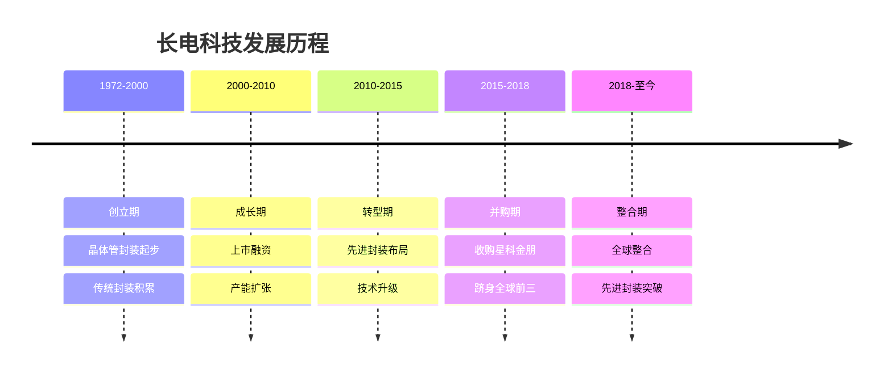
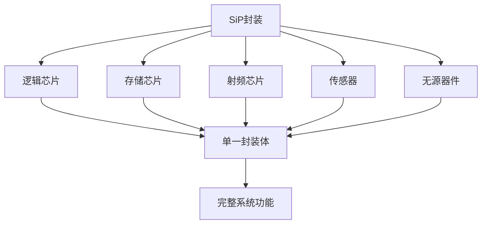
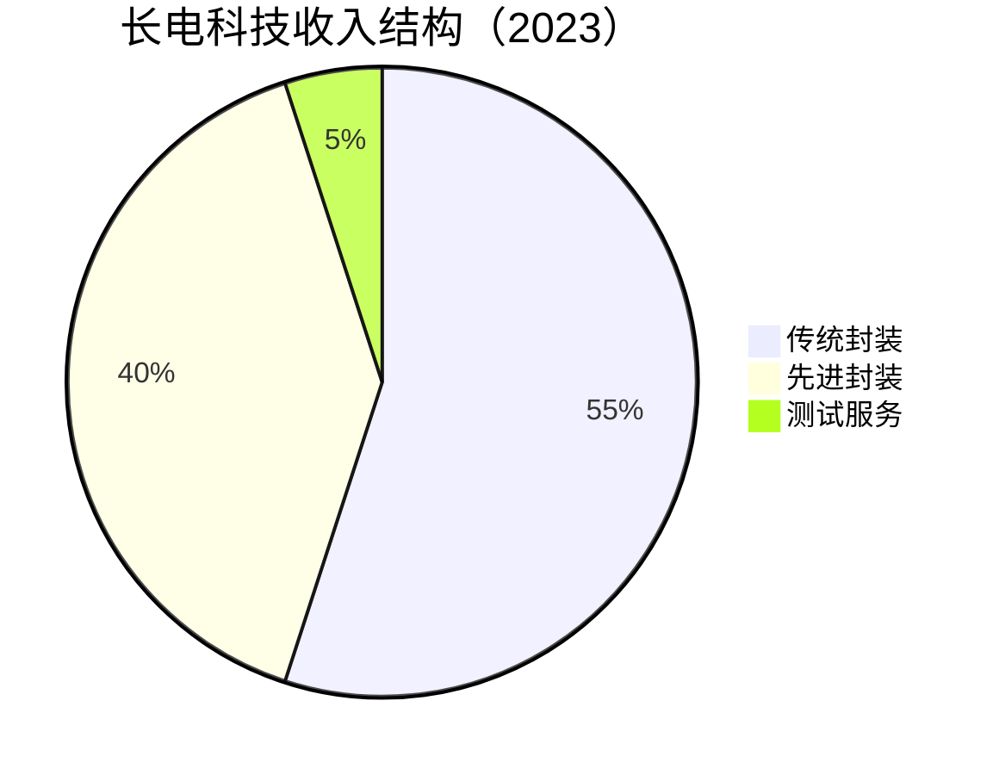

# 长电科技：全球封测第三的崛起之路

## 公司概况

### 基本信息

**公司名称**：江苏长电科技股份有限公司（JCET Group）
**股票代码**：600584.SH（上交所）
**成立时间**：1972年（前身为江阴晶体管厂）
**总部位置**：中国江苏江阴
**实际控制人**：国家集成电路基金（大基金）+ 芯电半导体

**业务范围**：
- 传统封装：引线键合（Wire Bond）、倒装芯片（Flip Chip）
- 先进封装：SiP（系统级封装）、Fan-Out、2.5D/3D封装
- 测试服务：晶圆测试、成品测试
- 全球布局：中国、新加坡、韩国

**市值规模**（2023）：
- 市值：约500亿人民币
- 全球封测市场份额：约10%
- 全球封测排名：第三（仅次于日月光、安靠）

### 发展历程

**关键里程碑**：
- 1972年：江阴晶体管厂成立
- 2003年：上交所上市
- 2014年：收购新加坡星科金朋（STATS ChipPAC），跻身全球前三
- 2016年：大基金入股，成为战略股东
- 2018年：完成全球整合，收入突破200亿
- 2020年：先进封装收入占比超30%
- 2022年：SiP封装技术突破，进入苹果供应链
- 2023年：先进封装收入占比超40%

### 股权结构

**主要股东**：
- 国家集成电路基金（大基金）：约20%
- 芯电半导体（产业资本）：约15%
- 机构投资者：约40%
- 公众股东：约25%

**战略意义**：
- 大基金背书：国家战略支持
- 全球化布局：中国、新加坡、韩国三地运营
- 先进封装：对标日月光、安靠

## 封装技术深度分析

### 半导体封装的价值

封装是半导体制造的最后一道工序，将裸芯片（Die）保护起来，并提供与外部电路连接的接口。封装不仅是保护，更是性能提升的关键：

**封装的核心价值**：
- 物理保护：防止芯片受到机械损伤、湿气、污染
- 电气连接：提供芯片与PCB板的电气接口
- 散热管理：将芯片产生的热量传导出去
- 性能提升：先进封装可显著提升系统性能

**封装在产业链中的地位**：
- 成本占比：约占芯片总成本的15-20%
- 价值贡献：先进封装可提升系统性能30-50%
- 市场规模：全球封测市场约800亿美元（2023）

### 传统封装技术

**1. 引线键合（Wire Bond）**

**技术原理**：
用金线或铜线将芯片焊盘与封装基板连接，是最传统、最成熟的封装方式。

**特点**：
- 成本低：工艺成熟，设备便宜
- 适用广：各类芯片均可使用
- 局限性：引线电感大，不适合高频应用

**应用场景**：
- 消费电子：低端芯片
- 工业芯片：MCU、模拟芯片
- 汽车芯片：成熟制程

**2. 倒装芯片（Flip Chip）**

**技术原理**：
将芯片翻转，通过焊球（Solder Bump）直接与基板连接，无需引线。

**特点**：
- 性能好：互连距离短，电感小
- 密度高：I/O密度高
- 成本较高：需要特殊基板

**应用场景**：
- 高性能处理器：CPU、GPU
- 网络芯片：高速通信
- 手机SoC：高端芯片

### 先进封装技术

先进封装是长电科技的核心竞争力和未来增长引擎，也是全球封测行业的技术前沿。

**1. SiP（系统级封装）**

**技术原理**：
将多个不同功能的芯片（逻辑、存储、射频、传感器）集成在一个封装体内，形成完整的系统功能。

**技术优势**：
- 体积小：多芯片集成，体积减小50%+
- 性能高：芯片间互连距离短
- 功耗低：减少PCB走线损耗
- 集成度高：一个封装实现完整功能

**主要应用**：
- 苹果AirPods：SiP封装实现超小体积
- 智能手表：Apple Watch核心模块
- 物联网设备：超小型化需求
- 5G模组：射频+基带集成

**长电突破**：
长电科技已进入苹果AirPods供应链，提供SiP封装服务。这是长电技术能力的重要背书，也是先进封装业务的重要增长点。

**2. Fan-Out封装**

**技术原理**：
将芯片的I/O引脚"扇出"到芯片面积之外，实现更高的I/O密度，无需传统基板。

**技术类型**：
- Fan-Out WLP（晶圆级）：台积电InFO技术
- Fan-Out PLP（面板级）：更大面积，成本更低

**技术优势**：
- 无基板：成本降低
- 薄型化：封装厚度<1mm
- 高性能：短互连，低损耗

**主要应用**：
- 手机基带芯片：高通骁龙
- 电源管理芯片：PMIC
- 射频芯片：5G前端

**长电能力**：
长电科技掌握Fan-Out WLP技术，已为多家客户提供量产服务。

**3. 2.5D/3D封装**

**2.5D封装（硅中介层）**：
将多个芯片放置在硅中介层（Interposer）上，通过硅中介层实现高密度互连。

**应用**：
- AI芯片：英伟达H100（CoWoS技术）
- 高性能计算：AMD EPYC
- 高带宽存储：HBM内存

**3D封装（芯片堆叠）**：
将多个芯片垂直堆叠，通过硅通孔（TSV）实现垂直互连。

**应用**：
- HBM内存：高带宽存储
- 3D NAND：存储芯片
- 先进SoC：逻辑+存储堆叠

**长电布局**：
长电科技正在积极布局2.5D/3D封装技术，已有部分客户导入，是未来3-5年的重要增长方向。

### 测试服务

**晶圆测试（CP测试）**：
在晶圆切割前，对每个芯片进行电气测试，筛选出良品。

**成品测试（FT测试）**：
封装完成后，对成品芯片进行全面功能测试。

**测试能力**：
- 测试机台：数千台
- 测试类型：数字、模拟、射频、存储
- 客户：与封装业务协同

## 全球布局与产能

### 生产基地

**中国基地（主体）**：
- 江阴总部：传统封装+先进封装
- 上海：先进封装研发中心
- 深圳：消费电子封装
- 合计产能：约占总产能60%

**新加坡基地（星科金朋）**：
- 收购时间：2014年
- 主要产品：先进封装、测试
- 客户：欧美日半导体公司
- 产能：约占总产能25%

**韩国基地**：
- 主要产品：存储封装
- 客户：三星、SK海力士
- 产能：约占总产能15%

### 产能规模

**总产能**：
- 引线键合：约200亿颗/年
- 倒装芯片：约50亿颗/年
- 先进封装：约10亿颗/年（快速增长）
- 测试：约300亿颗/年

**产能利用率**：
- 2021-2022年：约90%（超级周期）
- 2023年：约75%（周期下行）
- 目标：维持80%+

## 市场地位与竞争格局

### 全球封测市场

**市场规模**：
- 2023年：约800亿美元
- 年增长率：6-8%
- 2025E：900亿美元
- 先进封装增速：15%+

**全球封测格局**：

| 公司 | 市占率 | 总部 | 特色 |
|------|--------|------|------|
| 日月光（ASE） | 25% | 台湾 | 全球最大，先进封装 |
| 安靠（Amkor） | 15% | 美国 | 先进封装，苹果供应商 |
| 长电科技 | 10% | 中国 | 全球第三，快速成长 |
| 通富微电 | 5% | 中国 | AMD合作伙伴 |
| 华天科技 | 4% | 中国 | 成本优势 |
| 其他 | 41% | 分散 | 各类 |

**先进封装市场**：
- 全球先进封装市场：约200亿美元（2023）
- 年增长率：15-20%
- 2025E：280亿美元
- 主要驱动：AI芯片、5G、汽车电子

### 客户结构

**主要客户**：
- 高通（Qualcomm）：手机SoC、射频芯片
- 博通（Broadcom）：网络芯片
- 恩智浦（NXP）：汽车芯片
- 意法半导体（ST）：MCU、功率器件
- 苹果（Apple）：AirPods SiP
- 三星（Samsung）：存储芯片
- 华为/海思：手机芯片（受限）

**客户特点**：
- 国际大客户为主：占收入约60%
- 国内客户增长快：国产替代受益
- 客户粘性强：工艺定制化，切换成本高

## 财务分析

### 收入分析

**收入历史**：

| 年份 | 收入（亿元） | 增长率 | 净利润（亿元） | 净利率 |
|------|------------|--------|--------------|--------|
| 2019 | 215 | 5% | 5 | 2% |
| 2020 | 225 | 5% | 8 | 4% |
| 2021 | 300 | 33% | 20 | 7% |
| 2022 | 330 | 10% | 22 | 7% |
| 2023E | 290 | -12% | 12 | 4% |

**收入结构**：

**先进封装占比提升**：
- 2019年：先进封装占比20%
- 2021年：先进封装占比30%
- 2023年：先进封装占比40%
- 2025E：先进封装占比50%+

### 盈利能力

**毛利率分析**：
- 传统封装毛利率：约15-18%
- 先进封装毛利率：约25-30%
- 整体毛利率：约18-22%
- 趋势：随先进封装占比提升而改善

**净利率偏低的原因**：
- 重资产：设备折旧大
- 收购整合：星科金朋整合成本
- 利息支出：收购债务
- 竞争激烈：封测行业竞争压力

**盈利改善路径**：
- 先进封装占比提升：毛利率更高
- 规模效应：产能利用率提升
- 债务偿还：利息支出减少
- 成本控制：运营效率提升

### 资本支出

**年资本支出**：
- 2021年：约50亿元
- 2022年：约60亿元
- 2023年：约50亿元
- 主要用于：先进封装产线建设

**重资产特点**：
- 封测设备：键合机、测试机
- 设备折旧：年折旧约30-40亿元
- 投资周期：3-5年
- 回报周期：5-8年

## 竞争优势分析

### 1. 全球化布局

长电科技通过收购星科金朋，实现了中国、新加坡、韩国三地布局，是中国封测公司中全球化程度最高的。这一布局带来：
- 服务全球客户：欧美日客户可在新加坡就近服务
- 分散地缘风险：不完全依赖中国产能
- 技术协同：全球研发资源整合

### 2. 先进封装技术

长电科技在SiP、Fan-Out、2.5D封装等先进封装技术上持续投入，已进入苹果供应链，技术能力获得国际顶级客户认可。先进封装毛利率（25-30%）显著高于传统封装（15-18%），是未来盈利提升的核心驱动。

### 3. 大基金战略支持

国家集成电路基金持股约20%，提供资金支持和战略背书。在国产替代大背景下，大基金支持的长电科技在争取国内客户时具有明显优势。

### 4. 规模效应

作为全球第三大封测厂，长电科技具备显著的规模效应：
- 采购议价：大批量采购降低材料成本
- 设备利用：多产品共用设备
- 研发摊薄：研发成本分摊到更大收入基数

## 行业趋势与机会

### 1. AI芯片驱动先进封装需求

**AI芯片封装需求**：
AI芯片（英伟达H100、AMD MI300）需要将GPU与HBM内存通过2.5D封装集成，对先进封装需求极大。

**市场规模**：
- AI芯片先进封装市场：2023年约30亿美元
- 2025E：80亿美元
- CAGR：60%+

**长电机会**：
长电科技正在积极布局CoWoS（台积电技术）类似的2.5D封装能力，有望承接AI芯片封装订单。

### 2. 汽车电子封装

**市场背景**：
智能汽车对芯片需求爆发，且汽车芯片对封装可靠性要求极高（车规级）。

**市场规模**：
- 汽车封测市场：2023年约80亿美元
- 年增长率：12%+
- 2025E：100亿美元

**长电布局**：
- 车规级封装：AEC-Q100认证
- 客户：恩智浦、英飞凌、意法半导体
- 目标：汽车业务占比从10%提升至20%

### 3. 国产替代

**国内封测市场**：
- 中国封测市场：约200亿美元
- 国产化率：约40%（长电+通富+华天）
- 替代空间：约120亿美元

**国产替代路径**：
- 国内芯片设计公司：优先选择国内封测厂
- 政策支持：大基金、地方政府
- 成本优势：国内人力成本低

## 投资价值评估

### 估值分析

**当前估值（2023）**：
- PE：约35倍（盈利下滑中）
- PS：约1.5倍
- PB：约2倍
- EV/EBITDA：约8倍

**估值对比**：

| 公司 | PE | PS | PB | 毛利率 | 净利率 |
|------|----|----|----|----|-----|
| 长电科技 | 35 | 1.5 | 2 | 20% | 4% |
| 日月光 | 15 | 1.2 | 2 | 22% | 8% |
| 安靠 | 18 | 1.5 | 3 | 20% | 7% |
| 通富微电 | 25 | 1.2 | 2 | 18% | 5% |

**估值分析**：
- 相对日月光、安靠：长电估值偏高，但成长性更好
- 先进封装占比提升：盈利能力改善空间大
- 国产替代：国内市场份额提升

### 投资论点

**看多理由**：
1. 全球第三：规模优势，客户资源丰富
2. 先进封装：占比持续提升，毛利率改善
3. AI芯片机会：2.5D封装需求爆发
4. 汽车电子：车规级封装高增长
5. 国产替代：国内客户转单加速
6. 大基金支持：战略背书，资金保障
7. 全球化布局：分散地缘风险

**看空理由**：
1. 净利率低：4%，盈利能力弱
2. 重资产：折旧压力大
3. 周期下行：2023年收入下滑
4. 竞争激烈：日月光、安靠技术领先
5. 债务压力：收购星科金朋遗留债务
6. 客户集中：高通、博通占比高

### 投资建议

**适合投资者**：
- 看好先进封装长期趋势的投资者
- 看好AI芯片产业链的投资者
- 中长期价值投资者

**投资策略**：
- 建仓区间：18-22元（当前约25元）
- 持有周期：3-5年
- 目标价：35元+（2025年）
- 止损位：15元

**关键催化剂**：
- 先进封装收入占比突破50%
- AI芯片2.5D封装订单获取
- 产能利用率回升至85%+
- 净利率回升至8%+

## 常见问题

### Q1：长电科技与日月光的差距在哪里？

日月光是全球封测龙头，市占率25%，长电约10%。差距主要体现在：规模（日月光收入约为长电2.5倍）、先进封装技术（日月光SiP、CoWoS更成熟）、客户结构（日月光苹果占比更高）。但长电在中国市场具有本土优势，且先进封装技术追赶速度快，差距在逐步缩小。

### Q2：先进封装为什么重要？

先进封装是后摩尔定律时代提升芯片性能的关键路径。当制程节点提升越来越难（3nm→2nm成本极高），通过先进封装将多个芯片集成（SiP、2.5D、3D）可以在不缩小制程的情况下大幅提升系统性能。英伟达H100就是通过CoWoS封装将GPU与HBM内存集成，实现了极高的AI计算性能。先进封装毛利率（25-30%）也显著高于传统封装（15-18%）。

### Q3：AI芯片对长电的影响有多大？

AI芯片（英伟达、AMD）需要大量2.5D先进封装，这是长电正在积极布局的方向。目前台积电CoWoS产能紧张，给了长电等封测厂机会。预计2024-2025年，AI芯片先进封装将成为长电重要增长点，有望贡献收入增量20-30亿元。

### Q4：收购星科金朋是否成功？

收购星科金朋（2014年，约7.8亿美元）是长电历史上最重要的战略决策。从结果看，这次收购帮助长电跻身全球前三，获得了新加坡、韩国产能和欧美客户资源，整体是成功的。但整合过程中也带来了较高债务和整合成本，导致净利率长期偏低。随着债务逐步偿还，财务压力将减轻。

### Q5：封测行业的周期性如何？

封测行业跟随半导体整体周期，但波动幅度相对小于芯片设计和制造。2021-2022年超级周期中，长电收入增长33%；2023年周期下行，收入下滑约12%。封测行业的周期性主要来自产能利用率变化，而非价格大幅波动。长期来看，先进封装需求持续增长，周期波动影响将逐步减小。

### Q6：长电科技的长期竞争壁垒是什么？

长电的长期竞争壁垒来自：第一，全球化布局（中国+新加坡+韩国），服务全球客户；第二，先进封装技术积累（SiP、Fan-Out、2.5D），技术壁垒持续加深；第三，大客户关系（高通、博通、苹果），客户粘性强；第四，大基金战略支持，国产替代受益。

## 参考文献

1. 长电科技. 《年度报告》. 2019-2023
2. 中金公司. 《长电科技深度报告：全球封测第三，先进封装新机遇》. 2023
3. 招商证券. 《长电科技：先进封装占比提升，盈利能力改善》. 2023
4. 天风证券. 《封装测试行业研究：先进封装驱动增长》. 2023
5. 华泰证券. 《长电科技竞争力分析》. 2023
6. Yole Development. 《先进封装市场报告》. 2023
7. IDC. 《全球半导体封测市场预测》. 2023
8. IC Insights. 《封测行业研究》. 2023
9. 日月光. 《年度报告》. 2023
10. 安靠. 《年度报告》. 2023
11. 中国半导体行业协会. 《中国集成电路产业发展报告》. 2023
12. 高通. 《年度报告》. 2023
13. 英伟达. 《先进封装技术白皮书》. 2023
14. 麦肯锡. 《半导体封装行业研究》. 2023
15. Gartner. 《半导体市场预测》. 2023

---

**投资建议**：
长电科技是全球封测第三，具备全球化布局和先进封装技术能力，大基金战略支持，国产替代受益。先进封装收入占比持续提升（40%→50%+），AI芯片2.5D封装需求爆发，汽车电子高增长，是未来3-5年的核心增长驱动。当前估值（PE 35倍）相对盈利能力偏高，建议在18-22元区间分批建仓，持有3-5年，目标价35元+。

**风险提示**：
主要风险包括：半导体周期下行导致产能利用率下降、净利率偏低（4%）、重资产折旧压力、竞争加剧（日月光、安靠技术领先）、收购债务压力、客户集中度高（高通、博通）、地缘政治影响全球化布局等。建议仓位控制在5-8%，密切跟踪先进封装收入占比和产能利用率变化。

---

[← 返回半导体行业](index.html)
