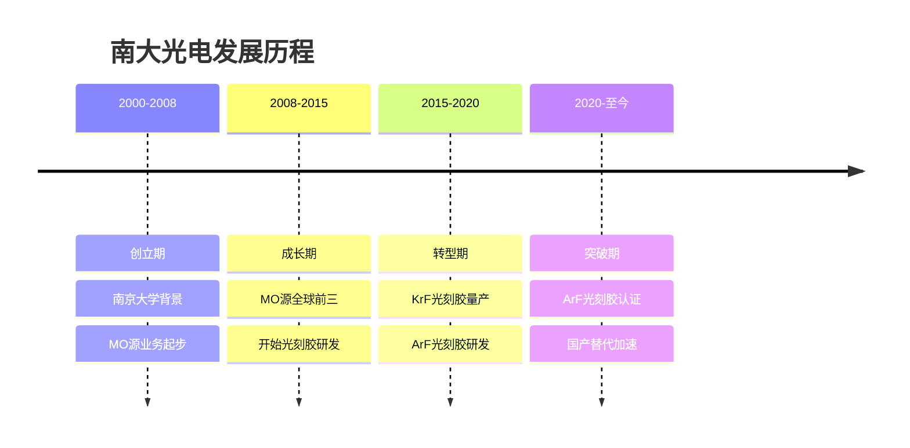
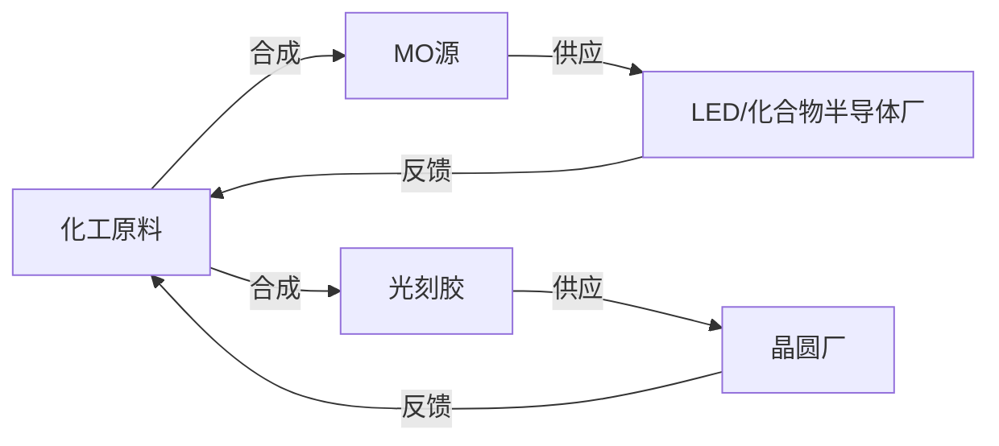
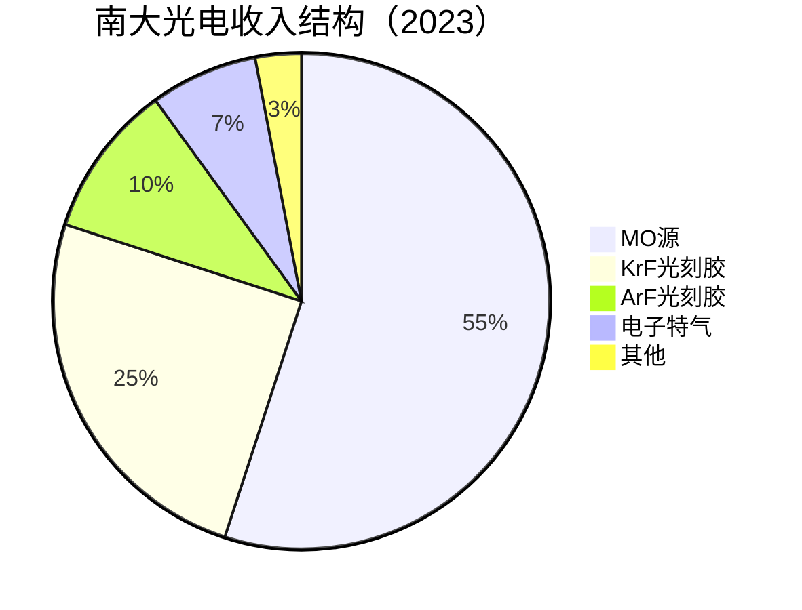
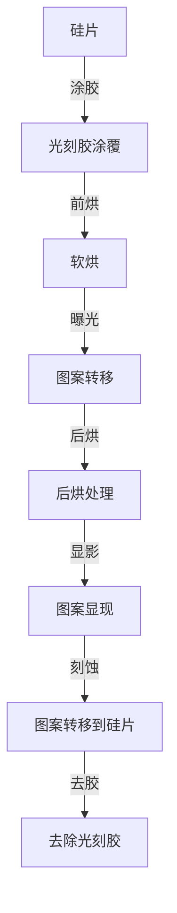
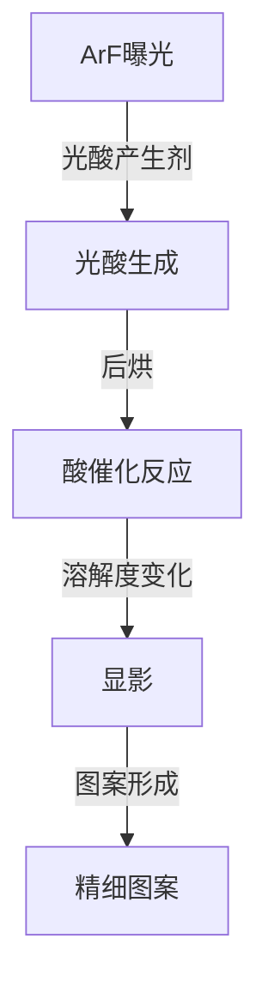
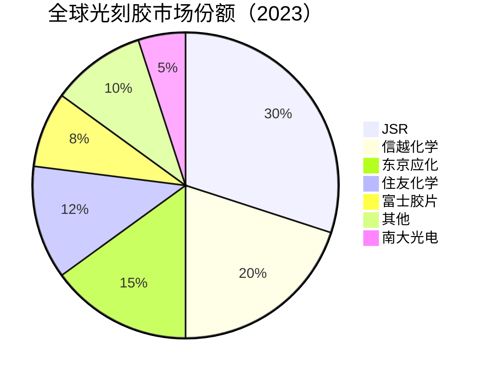

# 南大光电：光刻胶国产化先锋

## 公司概况

### 基本信息

**公司名称**：南大光电材料股份有限公司（Nata Opto-electronic Materials Co., Ltd.）
**股票代码**：300346.SZ（创业板）
**成立时间**：2000年
**总部位置**：中国南京
**实际控制人**：南京大学（国有背景）

**业务范围**：
- ArF光刻胶：核心战略产品
- KrF光刻胶：成熟产品
- MO源（金属有机化合物）：传统优势业务
- 电子特气：配套产品

**市值规模**（2023）：
- 市值：约150亿人民币
- 中国ArF光刻胶领先企业
- 全球MO源市场份额约15%

### 发展历程

**关键里程碑**：
- 2000年：公司成立，依托南京大学技术
- 2005年：MO源产品进入全球市场
- 2010年：MO源全球市场份额达到10%
- 2015年：KrF光刻胶通过客户认证
- 2018年：ArF光刻胶研发取得重大突破
- 2021年：ArF光刻胶进入中芯国际认证
- 2023年：ArF光刻胶小批量供货

### 股权结构

**主要股东**：
- 南京大学资产经营公司：约25%
- 管理层及员工：约20%
- 机构投资者：约35%
- 公众股东：约20%

**战略意义**：
- 高校背景：技术研发能力强
- 国有背景：政策支持
- 管理层持股：利益一致

## 商业模式分析

### 双业务模式

**业务模式**：

**两大业务**：
- MO源：传统优势，全球前三，稳定盈利
- 光刻胶：战略新业务，国产替代核心

**产业链位置**：
- MO源：LED、化合物半导体产业链上游
- 光刻胶：集成电路制造产业链上游

### 业务结构

**按产品分类**：

**按客户分类**：
- LED厂商（MO源）：40%
- 中芯国际（光刻胶）：25%
- 华虹半导体（光刻胶）：15%
- 其他：20%

## 光刻胶技术深度分析

### 光刻胶原理

**什么是光刻胶**：
光刻胶（Photoresist）是光刻工艺中的关键材料，涂覆在硅片表面，经过曝光、显影后形成图案，用于后续刻蚀或离子注入工艺。

**光刻工艺流程**：

**光刻胶类型**：
- i线光刻胶：365nm波长，90nm以上制程
- KrF光刻胶：248nm波长，28nm-90nm制程
- ArF光刻胶：193nm波长，7nm-28nm制程
- EUV光刻胶：13.5nm波长，3nm以下制程

**技术要求**：
- 分辨率：线宽控制精度
- 灵敏度：曝光能量需求
- 对比度：图形清晰度
- 附着力：与基底结合
- 热稳定性：烘烤过程稳定

### ArF光刻胶技术

**技术难点**：
ArF光刻胶是目前最主流的先进制程光刻胶，技术难度极高：
- 化学放大体系：复杂的光化学反应
- 分辨率：<100nm线宽
- 线边缘粗糙度（LER）：<3nm
- 缺陷密度：<0.01个/cm²
- 批次一致性：Cpk > 1.67

**化学放大光刻胶（CAR）原理**：

**关键组分**：
- 聚合物树脂：主体材料，决定基本性能
- 光酸产生剂（PAG）：吸收光子产生酸
- 碱性淬灭剂：控制酸扩散
- 溶剂：控制涂覆性能
- 添加剂：改善特定性能

**南大光电技术水平**：
- 28nm ArF：已通过中芯国际认证
- 14nm ArF：认证中
- 7nm ArF：研发中
- LER：<4nm（接近国际水平）
- 缺陷密度：<0.05个/cm²

### KrF光刻胶技术

**技术特点**：
- 波长：248nm
- 制程：28nm-90nm
- 技术成熟度：较高
- 国产化率：约10%

**南大光电产品**：
- 28nm KrF：已量产，稳定供应
- 90nm KrF：成熟产品
- 客户：中芯国际、华虹半导体
- 市场份额：国内约15%

**竞争格局**：
- 日本JSR：全球第一（30%）
- 日本信越化学：全球第二（20%）
- 日本东京应化：全球第三（15%）
- 南大光电：国内领先，全球约5%

### MO源业务

**什么是MO源**：
MO源（Metal Organic Source，金属有机化合物）是MOCVD（金属有机化学气相沉积）工艺的关键原料，用于制造LED、激光器、化合物半导体等。

**主要产品**：
- TMGa（三甲基镓）：GaN LED
- TMIn（三甲基铟）：InGaN LED
- TMAl（三甲基铝）：AlGaN
- TEGa（三乙基镓）：GaAs器件
- TMSb（三甲基锑）：InSb器件

**市场地位**：
- 全球市场份额：约15%
- 全球排名：前三
- 主要客户：全球LED厂商
- 竞争对手：Akzo Nobel（荷兰）、Nouryon

**技术优势**：
- 纯度：99.9999%（6N）
- 稳定性：长期储存稳定
- 一致性：批次间高度一致
- 安全性：完善的安全处理体系

**市场规模**：
- 全球MO源市场：约5亿美元
- 年增长率：8-10%
- 驱动因素：LED照明、Mini LED、Micro LED
- 南大光电收入：约4亿元（2023）

## 市场地位分析

### 全球光刻胶市场

**市场规模**：
- 2023年：约20亿美元
- 年增长率：8-10%
- 2025E：24亿美元
- 驱动因素：先进制程扩产、ArF需求增长

**市场格局**：

**竞争特点**：
- 日本垄断：日本企业占75%+
- 技术壁垒：极高，需要几十年积累
- 认证周期：2-3年
- 定制化：根据客户工艺定制

### 中国光刻胶市场

**市场规模**：
- 2023年：约5亿美元
- 全球占比：25%
- 年增长率：15%+
- 2025E：7亿美元

**自给率**：
- i线光刻胶：约50%（成熟）
- KrF光刻胶：约10%
- ArF光刻胶：约1%
- EUV光刻胶：约0%
- 整体自给率：约8%

**国产替代空间**：
- 中国需求：5亿美元
- 国产供应：0.4亿美元
- 进口依赖：4.6亿美元
- 替代空间：巨大，尤其ArF

### 南大光电市场地位

**全球排名**：
- 光刻胶：全球前十
- ArF光刻胶：中国第一
- MO源：全球前三

**市场份额**：
- 全球光刻胶：约5%
- 中国光刻胶：约15%
- ArF光刻胶（中国）：约20%
- MO源（全球）：约15%

## 竞争优势分析

### 1. ArF光刻胶先发优势

**技术积累**：
- 研发时间：10年+
- 研发投入：累计5亿+
- 专利：300+
- 技术团队：100+研发人员

**认证进展**：
- 28nm ArF：中芯国际认证通过
- 14nm ArF：认证中
- 7nm ArF：研发中
- 台积电：认证中

**先发优势**：
- 国内最早布局ArF光刻胶
- 认证进度领先竞争对手2-3年
- 客户关系：深度合作

### 2. MO源业务支撑

**稳定现金流**：
- MO源：全球前三，稳定盈利
- 收入：约4亿元/年
- 毛利率：40%+
- 为光刻胶研发提供资金支持

**技术协同**：
- MO源和光刻胶：都是精细化工
- 合成技术：相通
- 纯化技术：共享
- 分析检测：共享

### 3. 高校背景优势

**南京大学支持**：
- 技术来源：南京大学化学系
- 人才来源：南大毕业生
- 研究合作：持续合作
- 品牌背书：高校背景

**研发能力**：
- 研发人员：200+
- 研发费用率：20%+
- 专利：500+
- 技术积累：20年+

### 4. 国产替代战略价值

**战略意义**：
- ArF光刻胶：国家战略物资
- 供应链安全：自主可控
- 政策支持：大基金、地方政府
- 客户意愿：主动国产化

**政策支持**：
- 大基金：间接支持
- 税收优惠：高新技术企业
- 地方政府：南京产业支持
- 科研经费：国家重点研发计划

## 财务分析

### 收入分析

**收入增长**：
- 2019年：5亿人民币
- 2020年：6亿
- 2021年：8亿
- 2022年：10亿
- 2023E：13亿
- CAGR（2019-2023）：27%

**收入结构变化**：
- MO源占比：从70%降至55%
- 光刻胶占比：从20%提升至35%
- 趋势：光刻胶占比持续提升

### 盈利能力

**毛利率**：
- 2019年：38%
- 2020年：40%
- 2021年：42%
- 2022年：43%
- 2023E：44%

**净利率**：
- 2019年：12%
- 2020年：13%
- 2021年：15%
- 2022年：16%
- 2023E：17%

**ROE**：
- 2022年：15%
- 2023E：18%
- 2025E：25%+（ArF量产后）

### 财务数据表（2019-2023）

| 指标 | 2019 | 2020 | 2021 | 2022 | 2023E |
|------|------|------|------|------|-------|
| 收入（亿） | 5 | 6 | 8 | 10 | 13 |
| 增长率 | 20% | 20% | 33% | 25% | 30% |
| 毛利率 | 38% | 40% | 42% | 43% | 44% |
| 净利率 | 12% | 13% | 15% | 16% | 17% |
| 净利润（亿） | 0.6 | 0.78 | 1.2 | 1.6 | 2.2 |
| ROE | 12% | 13% | 15% | 16% | 18% |
| 经营现金流（亿） | 0.8 | 1.0 | 1.5 | 2.0 | 3.0 |
| 资本支出（亿） | 1 | 2 | 3 | 4 | 5 |
| 资产负债率 | 30% | 28% | 26% | 24% | 22% |

**财务特点**：
- 双业务：MO源稳定+光刻胶成长
- 毛利率提升：光刻胶占比提升
- 研发投入大：研发费用率20%+
- 财务健康：低负债，现金流改善

## 投资价值评估

### 估值分析

**当前估值（2023）**：
- PE：约70倍
- PS：约12倍
- PB：约10倍
- EV/EBITDA：约45倍

**估值对比**：

| 公司 | PE | PS | PB | 市值（亿美元） | 业务 | 毛利率 | 净利率 |
|------|----|----|----|--------------|----|--------|--------|
| 南大光电 | 70 | 12 | 10 | 21 | 光刻胶+MO源 | 44% | 17% |
| JSR | 30 | 3 | 3 | 60 | 光刻胶龙头 | 45% | 15% |
| 信越化学 | 25 | 5 | 3 | 500 | 硅片+光刻胶 | 40% | 25% |
| 东京应化 | 28 | 3 | 3 | 20 | 光刻胶 | 42% | 18% |
| 安集科技 | 60 | 17 | 15 | 28 | CMP抛光液 | 53% | 28% |

**估值分析**：
- PE 70倍：高于国际同行（25-30倍）
- 溢价原因：ArF光刻胶战略价值、国产替代预期
- 盈利能力：与国际同行相当（净利率17%）
- 成长性：高增长（27%+）支撑高估值

### 投资论点

**看多理由**：
1. ArF光刻胶：国内唯一量产，战略价值极高
2. 先发优势：认证进度领先竞争对手2-3年
3. MO源：全球前三，稳定现金流
4. 国产替代：ArF自给率<1%，空间巨大
5. 政策支持：国家战略，大基金支持
6. 技术积累：10年+研发，300+专利
7. 高校背景：南京大学技术支撑
8. 成长性：收入增长27%+
9. 双业务：MO源稳定+光刻胶成长
10. 14nm认证：重大催化剂

**看空理由**：
1. 估值过高：PE 70倍，PS 12倍
2. 规模较小：市值21亿美元
3. 技术差距：与日本巨头差距大
4. ArF量产：规模仍小，收入贡献有限
5. 客户集中：前三大客户65%
6. 研发投入大：研发费用率20%+，影响利润
7. 竞争加剧：国内外竞争者增多
8. EUV光刻胶：几乎空白，未来挑战大

### 投资建议

**适合投资者**：
- 看好光刻胶国产化的投资者
- 看好半导体材料战略价值的投资者
- 高风险偏好投资者
- 长期投资者（5-10年）

**投资策略**：
- 建仓区间：PE 50-60倍
- 持有周期：5-10年
- 目标价：基于PE 60倍，2025年净利润4亿，目标市值240亿
- 止损位：PE < 40倍

**当前建议**：
- 估值偏高：PE 70倍，等待回调
- 长期看好：ArF光刻胶战略价值
- 回调建仓：PE 50-60倍区间

## 行业趋势与机会

### 1. ArF光刻胶需求爆发

**市场现状**：
- 全球ArF光刻胶市场：约8亿美元
- 中国ArF光刻胶市场：约2亿美元
- 国产化率：约1%
- 主要依赖：日本JSR、信越化学

**需求增长**：
- 中芯国际28nm扩产：月产能从10万片到30万片
- 华虹半导体28nm扩产：月产能从5万片到15万片
- 合计：ArF光刻胶需求增长3-5倍

**南大机会**：
- 28nm ArF：已认证，直接受益
- 14nm ArF：认证中，2024年有望量产
- 市场份额：从1%提升至10%+（2025年）

### 2. 国产替代政策驱动

**政策背景**：
光刻胶是半导体制造的关键材料，也是中国半导体产业链最薄弱的环节之一。国家高度重视光刻胶国产化，将其列为重点突破方向。

**政策支持**：
- 大基金：重点支持光刻胶国产化
- 国家重点研发计划：光刻胶专项
- 地方政府：南京、上海等地产业支持
- 客户意愿：晶圆厂主动推进国产化

**替代路径**：
- i线光刻胶：已基本实现国产化
- KrF光刻胶：国产化率提升至20%（2025年）
- ArF光刻胶：国产化率提升至10%（2025年）
- EUV光刻胶：长期目标

### 3. MO源新应用

**Mini LED/Micro LED**：
- 新型显示技术：Mini LED、Micro LED
- MO源需求：大幅增长
- 南大机会：全球前三，直接受益

**化合物半导体**：
- GaN功率器件：5G基站、新能源汽车
- SiC功率器件：新能源汽车
- MO源需求：增长
- 南大机会：GaN MO源供应商

**市场影响**：
- MO源新应用：收入增长20%+
- 南大受益：全球前三地位巩固
- 收入贡献：2024-2025年加速

## 竞争对手分析

### JSR（日本合成橡胶）

**市场地位**：
- 全球第一：光刻胶30%市场份额
- 技术领先：全球最强
- 客户：全球主要晶圆厂

**竞争优势**：
- 技术积累：40年+
- 产品线：i线、KrF、ArF、EUV全覆盖
- 全球布局：各大晶圆厂附近建厂
- 品牌溢价：高端市场

**南大对比**：
- 技术差距：2代（ArF vs EUV）
- 规模差距：JSR 10倍
- 本地化：南大更有优势
- 成本：南大更低

### 信越化学（日本）

**市场地位**：
- 全球第二：光刻胶20%市场份额
- 技术领先：仅次于JSR
- 客户：全球主要晶圆厂

**竞争优势**：
- 技术积累：50年+
- 垂直整合：硅片+光刻胶
- 全球布局：各大市场
- 品牌溢价：高端市场

**南大对比**：
- 技术差距：2代
- 规模差距：信越化学 30倍
- 本地化：南大更有优势
- 专注度：南大更专注光刻胶

### 竞争格局总结

**短期**：日本巨头主导，南大份额提升
**中期**：南大在中国市场份额达到10%+
**长期**：南大成为全球前五光刻胶供应商

## 投资启示

### 1. 光刻胶的战略价值

**战略意义**：
光刻胶是半导体制造的"灵魂材料"，没有高质量的光刻胶，就无法制造先进芯片。ArF光刻胶是28nm-7nm制程的核心材料，全球几乎被日本企业垄断。

**供应链风险**：
如果日本限制光刻胶出口（类似韩国2019年事件），中国半导体产业将面临严重威胁。这使得ArF光刻胶国产化具有极高的战略价值，超越了纯粹的商业价值。

**投资逻辑**：
战略价值支撑高估值（PE 70倍），即使短期盈利能力一般，长期战略价值巨大。

### 2. 双业务模式的价值

**MO源稳定+光刻胶成长**：
南大光电的双业务模式有独特价值：
- MO源：稳定现金流，支撑光刻胶研发
- 光刻胶：高成长，提升估值
- 协同效应：技术共享，客户共享
- 风险分散：不依赖单一业务

**对比纯光刻胶公司**：
如果南大光电只有光刻胶业务，在ArF量产前，盈利能力会很弱。MO源业务提供了稳定的财务基础，使公司能够持续投入光刻胶研发。

### 3. 技术突破的催化剂效应

**ArF认证通过**：
每次ArF光刻胶认证通过（28nm→14nm→7nm），都是重大催化剂，会带来股价大幅上涨。

**投资策略**：
- 在认证通过前布局：估值相对低
- 认证通过后：股价大幅上涨
- 关注认证进展：是最重要的投资信号

## 常见问题

### Q1：南大光电的ArF光刻胶技术水平如何？

**回答**：
南大光电的ArF光刻胶技术达到国内领先水平，28nm ArF已通过中芯国际认证，进入小批量供货阶段。技术指标：LER < 4nm，缺陷密度 < 0.05个/cm²，接近国际主流水平。与日本巨头（JSR、信越化学）相比，仍有1-2代差距，主要体现在7nm以下和EUV光刻胶。但在中国市场，南大光电是唯一能量产ArF光刻胶的企业，战略价值极高。

### Q2：MO源业务前景如何？

**回答**：
MO源业务是南大光电的传统优势，全球市场份额约15%，全球前三。受益于Mini LED、Micro LED新型显示技术和GaN功率器件需求增长，MO源市场将持续增长。预计2024-2025年，MO源收入增长15-20%，为公司提供稳定的现金流支撑。

### Q3：估值70倍PE是否合理？

**回答**：
PE 70倍相对偏高，但考虑到ArF光刻胶的战略价值（国内唯一量产）、高成长性（27%+）、国产替代空间大，有一定合理性。如果2025年净利润达到4亿，按PE 60倍，目标市值240亿，相对当前150亿有60%上涨空间。建议等待回调至PE 50-60倍区间再建仓。

### Q4：EUV光刻胶是否有布局？

**回答**：
EUV光刻胶是下一代光刻胶，技术难度极高，目前全球只有JSR、信越化学等少数企业能量产。南大光电目前专注于ArF光刻胶，EUV光刻胶处于早期研究阶段。短期内（5年内）EUV光刻胶不会成为南大光电的主要收入来源，但长期布局有战略意义。

### Q5：韩国2019年光刻胶事件对中国有何启示？

**回答**：
2019年日本限制向韩国出口光刻胶，导致三星、SK海力士等韩国芯片厂商面临供应危机。这一事件对中国的启示是：光刻胶是战略物资，必须实现自主可控。中国光刻胶自给率不足10%，一旦日本限制出口，后果将比韩国更严重。这使得南大光电等光刻胶国产化企业具有极高的战略价值。

### Q6：14nm ArF认证通过后有多大影响？

**回答**：
14nm ArF认证通过将是重大催化剂。14nm制程的光刻胶消耗量比28nm多约30%，价格也更高。中芯国际14nm产能约5万片/月，如果南大光电成为主要供应商，预计每年新增收入1-2亿元。更重要的是，14nm认证通过将大幅提升市场对南大光电技术实力的认可，推动估值提升。

## 延伸阅读

### 推荐书籍

1. **《光刻技术》** - 相关学术著作
2. **《半导体制造技术》** - 迈克尔·夸克
3. **《芯片战争》** - 克里斯·米勒
4. **《半导体材料》** - 蒋民华
5. **《光化学》** - 相关学术著作

### 研究报告

- 中金公司：《南大光电深度报告》（2023）
- 招商证券：《光刻胶国产替代》（2023）
- 天风证券：《半导体材料行业研究》（2023）
- 华泰证券：《南大光电竞争力分析》（2023）
- 国泰君安：《光刻胶市场分析》（2023）

### 行业资讯

- 集微网：半导体材料新闻
- 芯思想：半导体行业分析
- 半导体行业观察：深度报道
- EE Times：国际半导体资讯

## 参考文献

1. 南大光电. 《年度报告》. 2019-2023
2. 南大光电. 《投资者关系资料》. 2023
3. SEMI. 《全球半导体材料市场报告》. 2023
4. IC Insights. 《光刻胶市场预测》. 2023
5. 中金公司. 《南大光电深度报告》. 2023
6. 招商证券. 《光刻胶国产替代路径》. 2023
7. 天风证券. 《半导体材料行业研究》. 2023
8. 华泰证券. 《南大光电竞争力分析》. 2023
9. JSR. 《年度报告》. 2023
10. 信越化学. 《年度报告》. 2023
11. 东京应化. 《年度报告》. 2023
12. 中芯国际. 《年度报告》. 2023
13. 中国半导体行业协会. 《中国集成电路产业发展报告》. 2023
14. Gartner. 《半导体材料市场分析》. 2023
15. 韩国产业通商资源部. 《日本出口管制影响分析》. 2019

---

**投资建议**：
南大光电是中国光刻胶国产化的核心标的，ArF光刻胶国内唯一量产企业，具有极高战略价值。公司双业务模式（MO源稳定+光刻胶成长）提供了良好的财务基础，28nm ArF已量产，14nm认证中，受益于国产替代和先进制程扩产。

当前估值PE 70倍偏高，建议等待回调至PE 50-60倍区间建仓，持有5-10年，目标市值240亿（基于2025年净利润4亿，PE 60倍）。适合看好光刻胶国产化、能承受高估值波动的长期投资者。

**风险提示**：
需关注估值偏高（PE 70倍）、ArF量产规模仍小、14nm认证进展不确定、客户集中度高、研发投入大影响利润、EUV光刻胶差距大、地缘政治风险。建议仓位控制在3-5%，设置止损位（PE < 40倍）。

---

[← 返回半导体行业](index.html)
