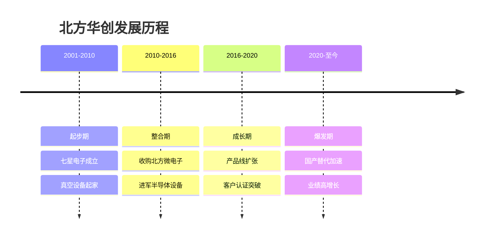
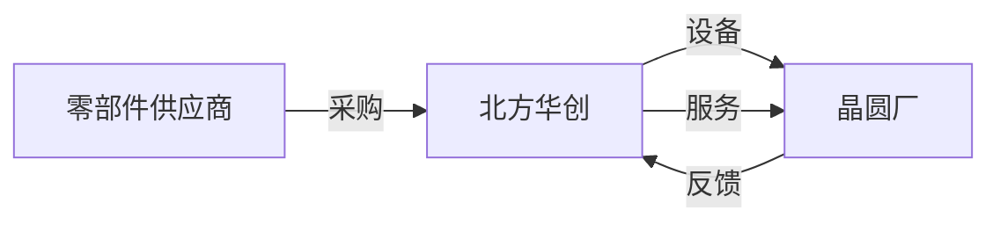
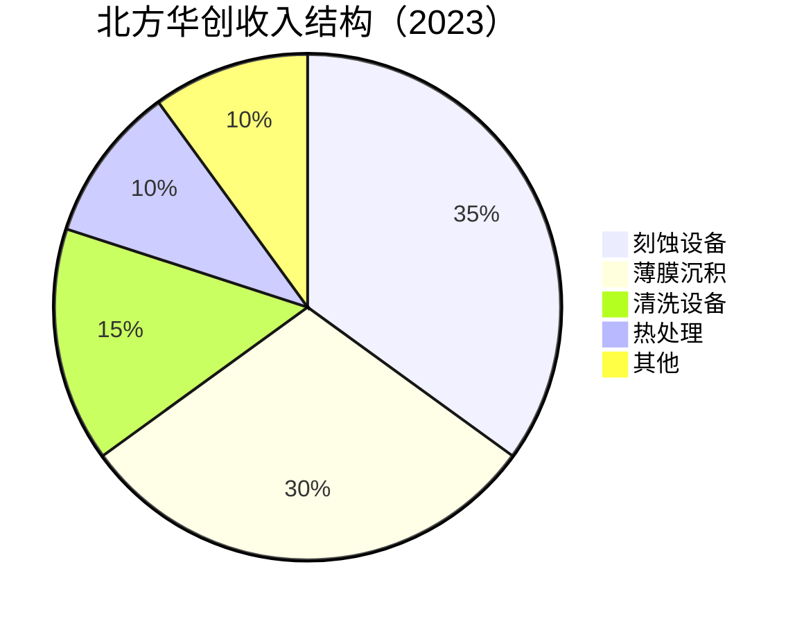
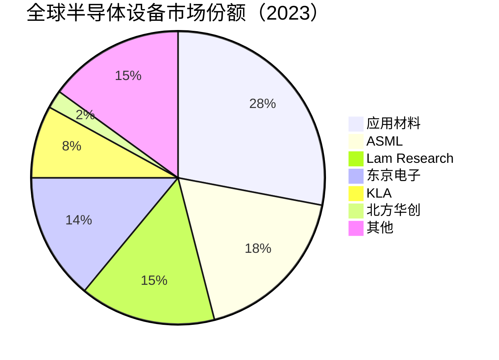

# 北方华创：中国半导体设备平台型公司

## 公司概况

### 基本信息

**公司名称**：北方华创科技集团股份有限公司（Naura Technology Group）
**股票代码**：002371.SZ（深圳主板）
**成立时间**：2001年（前身七星电子）
**总部位置**：中国北京
**实际控制人**：北京电控（国资）

**业务范围**：
- 刻蚀设备：等离子刻蚀、硅刻蚀
- 薄膜沉积设备：PVD、CVD、ALD
- 清洗设备：单片清洗、槽式清洗
- 热处理设备：氧化、退火、扩散
- 其他设备：离子注入、外延
- 应用领域：集成电路、LED、光伏

**市值规模**（2023）：
- 市值：约2500亿人民币
- 中国最大半导体设备公司
- 全球半导体设备市场份额约2%

### 发展历程

**关键里程碑**：
- 2001年：七星电子成立
- 2007年：深圳主板上市
- 2016年：收购北方微电子，更名北方华创
- 2018年：刻蚀机进入中芯国际
- 2020年：薄膜沉积设备进入长江存储
- 2021年：收入突破100亿
- 2023年：收入突破200亿

### 股权结构

**实际控制人**：
- 北京电控：国资背景
- 持股比例：约30%
- 管理层：专业团队

**战略意义**：
- 国家战略：半导体设备自主可控
- 政策支持：大基金、地方政府
- 资金保障：国资背景

## 商业模式分析

### 设备制造商模式

**业务模式**：
- 设备研发：自主研发
- 设备制造：自主生产
- 设备销售：直销为主
- 售后服务：技术支持、备件

**产业链位置**：

**收入模式**：
- 设备销售：80%
- 备件服务：15%
- 其他：5%

### 业务结构

**按产品分类**：

**按应用分类**：
- 集成电路：70%
- LED：15%
- 光伏：10%
- 其他：5%

**按客户分类**：
- 中芯国际：30%
- 长江存储：20%
- 华虹半导体：15%
- 其他：35%

## 产品技术分析

### 1. 刻蚀设备

**技术原理**：
- 等离子刻蚀：化学+物理
- 图案转移：去除材料
- 精度要求：纳米级

**产品矩阵**：
- 硅刻蚀：介质刻蚀、多晶硅刻蚀
- 金属刻蚀：铝刻蚀、铜刻蚀
- 应用：逻辑、存储、功率

**技术参数**：
- 制程：28nm-14nm
- 均匀性：<3%
- 选择比：>20:1
- 产能：60片/小时

**市场地位**：
- 全球市场份额：<5%
- 中国市场份额：15%+
- 主要竞争对手：应用材料、Lam Research、东京电子

**客户认证**：
- 中芯国际：28nm、14nm
- 长江存储：3D NAND
- 华虹半导体：特色工艺

### 2. 薄膜沉积设备

**技术原理**：
- PVD：物理气相沉积
- CVD：化学气相沉积
- ALD：原子层沉积

**产品矩阵**：
- PVD：金属溅射、介质溅射
- CVD：PECVD、LPCVD、MOCVD
- ALD：高k介质、金属栅极

**技术参数**：
- 制程：28nm-14nm
- 均匀性：<2%
- 薄膜厚度：1nm-1μm
- 产能：80片/小时

**市场地位**：
- 全球市场份额：<5%
- 中国市场份额：20%+
- 主要竞争对手：应用材料、Lam Research

**应用领域**：
- 逻辑芯片：金属互连
- 存储芯片：3D NAND
- 功率器件：金属化

### 3. 清洗设备

**技术原理**：
- 化学清洗：去除颗粒、金属
- 物理清洗：超声波、兆声波
- 干燥：旋转干燥、IPA干燥

**产品矩阵**：
- 单片清洗：高端应用
- 槽式清洗：成熟工艺
- 应用：前道、后道

**技术参数**：
- 颗粒去除：>99%
- 金属去除：ppb级
- 产能：100片/小时

**市场地位**：
- 全球市场份额：<3%
- 中国市场份额：10%+
- 主要竞争对手：DNS、东京电子

### 4. 热处理设备

**技术原理**：
- 氧化：生长氧化层
- 退火：改善薄膜性质
- 扩散：掺杂

**产品矩阵**：
- 立式炉：氧化、扩散
- 快速热处理：RTP
- 应用：前道工艺

**技术参数**：
- 温度：400°C-1200°C
- 均匀性：<1°C
- 产能：150片/小时

**市场地位**：
- 全球市场份额：<5%
- 中国市场份额：25%+
- 主要竞争对手：东京电子、Kokusai

### 5. 其他设备

**离子注入**：
- 技术：掺杂
- 应用：功率器件
- 市场份额：<5%

**外延设备**：
- 技术：单晶生长
- 应用：功率器件、化合物半导体
- 市场份额：10%+

## 市场地位分析

### 全球半导体设备市场

**市场规模**：
- 2023年：约1000亿美元
- 年增长率：5-10%
- 2025E：1200亿美元

**市场格局**：

**竞争格局**：
- 第一梯队：应用材料、ASML、Lam Research
- 第二梯队：东京电子、KLA、SCREEN
- 第三梯队：北方华创、中微公司

### 北方华创市场地位

**全球排名**：
- 整体市场：前十
- 刻蚀设备：前十
- 薄膜沉积：前十
- 中国市场：第一

**市场份额变化**：
- 2019年：1%
- 2020年：1.5%
- 2021年：1.8%
- 2022年：2%
- 2023年：2%+

**增长驱动**：
- 国产替代：供应链安全
- 客户认证：中芯、长存
- 产品升级：28nm→14nm
- 产能扩张：新产线

## 竞争优势分析

### 1. 产品线优势

**平台型公司**：
- 刻蚀：核心产品
- 薄膜沉积：核心产品
- 清洗：重要产品
- 热处理：成熟产品
- 其他：补充产品

**一站式服务**：
- 多种设备：降低客户采购成本
- 协同效应：整体解决方案
- 客户粘性：长期合作

### 2. 技术优势

**研发能力**：
- 研发人员：2000+
- 研发费用率：12%+
- 专利数量：3000+

**技术突破**：
- 28nm：量产
- 14nm：客户验证
- 7nm：研发中

**技术积累**：
- 20年+设备经验
- 工艺know-how
- 客户反馈

### 3. 客户优势

**核心客户**：
- 中芯国际：最大客户
- 长江存储：重要客户
- 华虹半导体：战略客户

**客户粘性**：
- 技术支持：本地团队
- 快速响应：备件、维修
- 定制化：满足特殊需求

**客户拓展**：
- 国内：全覆盖
- 海外：积极拓展

### 4. 国产替代优势

**供应链安全**：
- 客户主动转单
- 本地化服务
- 快速响应

**政策支持**：
- 大基金：股东
- 税收优惠：15%
- 产业基金：地方支持

## 财务分析

### 收入分析

**收入增长**：
- 2018年：40亿人民币
- 2019年：45亿
- 2020年：60亿
- 2021年：100亿
- 2022年：150亿
- 2023E：200亿
- CAGR（2018-2023）：38%

**收入驱动**：
- 国产替代：客户转单
- 产能扩张：新产线
- 产品升级：28nm→14nm
- 客户拓展：新客户

**收入结构变化**：
- 集成电路占比：从50%升至70%
- 刻蚀占比：从25%升至35%
- 高端产品：占比持续提升

### 盈利能力

**毛利率**：
- 2019年：35%
- 2020年：38%
- 2021年：40%
- 2022年：42%
- 2023E：43%

**毛利率驱动**：
- 产品结构：高端产品占比提升
- 规模效应：成本摊薄
- 技术进步：良率提升

**净利率**：
- 2020年：12%
- 2021年：15%
- 2022年：18%
- 2023E：20%

**ROE**：
- 2021年：15%
- 2022年：18%
- 2023E：20%

### 现金流

**经营现金流**：
- 2021年：20亿+
- 2022年：30亿+
- 2023E：40亿+
- 现金流稳定

**资本支出**：
- 年资本支出：10-15亿
- 主要用于：产能扩张、研发设备
- 重资产模式

**现金储备**：
- 现金及等价物：50亿+
- 资产负债率：40%
- 财务健康

### 财务健康度

**资产负债表**：
- 资产负债率：40%
- 流动比率：2.0
- 速动比率：1.5

**偿债能力**：
- 利息覆盖倍数：15+倍
- 债务/EBITDA：1-2倍
- 财务风险：低

**财务数据表（2019-2023）**：

| 指标 | 2019 | 2020 | 2021 | 2022 | 2023E |
|------|------|------|------|------|-------|
| 收入（亿） | 45 | 60 | 100 | 150 | 200 |
| 增长率 | 13% | 33% | 67% | 50% | 33% |
| 毛利率 | 35% | 38% | 40% | 42% | 43% |
| 净利率 | 10% | 12% | 15% | 18% | 20% |
| 净利润（亿） | 4.5 | 7.2 | 15 | 27 | 40 |
| ROE | 10% | 12% | 15% | 18% | 20% |
| 经营现金流（亿） | 8 | 12 | 20 | 30 | 40 |

## 投资价值评估

### 估值分析

**历史估值区间**：
- PE：40-120倍
- PS：8-25倍
- PB：6-18倍

**当前估值（2023）**：
- PE：约63倍
- PS：约12倍
- PB：约12倍

**估值对比**：

| 公司 | PE | PS | PB | 市值（亿美元） | 业务 | 增长率 |
|------|----|----|----|--------------|----|--------|
| 北方华创 | 63 | 12 | 12 | 350 | 半导体设备 | 33% |
| 中微公司 | 70 | 15 | 14 | 200 | 刻蚀机 | 40% |
| 应用材料 | 18 | 4 | 6 | 1000 | 设备龙头 | 8% |
| Lam Research | 20 | 5 | 8 | 900 | 刻蚀龙头 | 10% |

### 投资论点

**看多理由**：
1. **设备龙头**：中国第一，平台型公司
2. **产品线完整**：刻蚀、薄膜、清洗、热处理
3. **技术突破**：28nm量产，14nm验证
4. **客户优质**：中芯、长存、华虹
5. **国产替代**：受益于供应链安全
6. **成长空间**：中国设备自给率<20%
7. **盈利改善**：毛利率、净利率持续提升
8. **政策支持**：大基金、国资背景

**看空理由**：
1. **估值偏高**：PE 63倍，透支未来
2. **技术差距**：与国际巨头差2-3代
3. **客户集中**：前三大客户占65%
4. **周期性强**：半导体设备周期波动
5. **竞争加剧**：国际巨头降价
6. **认证周期长**：新客户导入慢

### 投资建议

**适合投资者**：
- 看好半导体设备的投资者
- 看好国产替代的投资者
- 能承受高估值波动的投资者
- 长期投资者（3-5年）

**投资策略**：
- 建仓区间：200-250元（当前约350元）
- 持有周期：3-5年
- 目标价：500元+（需业绩持续高增长）
- 止损位：150元

**风险控制**：
- 仓位：不超过8%
- 关注：客户认证、产能扩张、技术突破
- 调整：根据业绩动态调整

**当前建议**：
- 观望为主：估值偏高
- 等待回调：200-250元区间考虑建仓
- 长期看好：国产替代逻辑不变

## 行业趋势与机会

### 1. 国产替代加速

**市场空间**：
- 全球市场：1000亿美元
- 中国市场：300亿美元
- 国产化率：<20%
- 替代空间：巨大

**驱动因素**：
- 供应链安全：客户主动转单
- 政策支持：大基金、税收优惠
- 技术进步：28nm→14nm
- 产能扩张：新产线

**增长预测**：
- 2023年：200亿人民币
- 2025E：400亿人民币
- CAGR：40%+

### 2. 晶圆厂扩产

**产能扩张**：
- 中芯国际：新产线
- 长江存储：3D NAND扩产
- 华虹半导体：12寸产线
- 其他：地方晶圆厂

**设备需求**：
- 12寸产线：设备投资50-100亿美元
- 8寸产线：设备投资10-20亿美元
- 设备占比：70%

### 3. 先进制程突破

**技术演进**：
- 28nm：量产
- 14nm：客户验证
- 7nm：研发中
- 5nm：预研

**设备要求**：
- 精度：更高
- 均匀性：更好
- 产能：更快
- 价格：更贵

### 4. 新兴应用

**功率半导体**：
- 市场规模：500亿美元
- 应用：新能源汽车、光伏
- 设备需求：刻蚀、薄膜、热处理

**化合物半导体**：
- 市场规模：200亿美元
- 应用：5G、光通信、LED
- 设备需求：MOCVD、刻蚀

## 竞争对手分析

### 应用材料（Applied Materials）

**市场地位**：
- 全球第一：28%市场份额
- 技术领先：全产品线
- 客户：全球主要晶圆厂

**竞争优势**：
- 技术积累：50年+
- 产品线完整：刻蚀、薄膜、检测
- 规模效应：成本低

**北方华创对比**：
- 技术差距：2-3代
- 市场份额：应用材料14倍
- 成本优势：北方华创更低
- 客户：部分重叠（中芯）

### Lam Research

**市场地位**：
- 全球第三：15%市场份额
- 刻蚀龙头：市场份额50%+
- 客户：台积电、三星、英特尔

**竞争优势**：
- 刻蚀技术：全球领先
- 客户认证：全球主要晶圆厂
- 技术服务：强大

**北方华创对比**：
- 技术差距：2-3代
- 刻蚀份额：Lam 10倍+
- 成本优势：北方华创更低

### 中微公司

**市场地位**：
- 中国第二：刻蚀设备
- 技术：接近北方华创
- 客户：中芯、长存、台积电

**竞争优势**：
- 刻蚀技术：专注
- 客户认证：台积电
- 技术领先：部分领域

**北方华创对比**：
- 产品线：北方华创更完整
- 刻蚀技术：中微部分领先
- 市场份额：北方华创更大
- 竞争：良性竞争

## 投资启示

### 1. 国产替代的长期逻辑

**机遇**：
- 供应链安全：客户主动转单
- 政策支持：大基金、税收优惠
- 本地化：技术支持、快速响应
- 成本优势：价格低20-30%

**挑战**：
- 技术差距：2-3代
- 客户认证：周期长
- 竞争加剧：国际巨头降价

### 2. 平台型公司的价值

**优势**：
- 产品线完整：一站式服务
- 协同效应：整体解决方案
- 客户粘性：长期合作
- 风险分散：多产品线

**挑战**：
- 研发投入：巨大
- 管理复杂：多产品线
- 技术突破：难度大

### 3. 高估值的风险与机会

**估值偏高**：
- PE 63倍 vs 国际巨头20倍
- 市场给予国产替代溢价
- 需要业绩持续高增长

**风险**：
- 业绩不达预期：估值回归
- 技术突破不确定：客户认证延迟
- 竞争加剧：毛利率下降

**机会**：
- 国产替代：长期逻辑
- 技术突破：估值提升
- 客户拓展：业绩超预期

### 4. 技术突破的重要性

**当前瓶颈**：
- 14nm：客户验证
- 7nm：研发中
- 先进封装：布局

**突破方向**：
- 刻蚀：高深宽比、选择比
- 薄膜：ALD、高k介质
- 检测：缺陷检测

## 常见问题

### Q1：北方华创能追上应用材料吗？

**回答**：
- 短期：不可能
- 中期：缩小差距
- 长期：中国市场有机会
- 关键：技术突破、客户认证

**差距分析**：
- 技术：2-3代
- 市场份额：14倍
- 产品线：应用材料更完整
- 成本：北方华创更低

### Q2：为什么估值这么高？

**回答**：
- 国产替代：市场给予溢价
- 稀缺性：中国设备龙头
- 成长性：年增长30%+
- 政策支持：大基金、国资

**风险**：
- 估值过高：PE 63倍
- 需要业绩持续高增长
- 技术突破不确定

### Q3：什么时候买入北方华创？

**回答**：
- 估值：PE < 50倍
- 股价：200-250元（当前约350元）
- 时机：技术突破、客户认证、产能扩张
- 策略：等待回调，分批建仓

### Q4：北方华创vs中微公司，选哪个？

**回答**：
- 北方华创：平台型，产品线完整，估值相对合理
- 中微公司：专注刻蚀，技术领先，估值更高
- 建议：北方华创更优，产品线更完整

### Q5：半导体设备周期怎么应对？

**回答**：
- 国产替代：对冲周期
- 产品线多元化：降低波动
- 客户拓展：分散风险
- 长期持有：穿越周期

### Q6：技术突破能成功吗？

**回答**：
- 28nm：已量产
- 14nm：客户验证中
- 7nm：研发中，难度大
- 成功概率：中等偏高
- 关键：持续研发投入

## 延伸阅读

### 推荐书籍

1. **《半导体制造技术》** - 迈克尔·夸克
2. **《半导体设备工程》** - 彼得·辛格
3. **《芯片战争》** - 克里斯·米勒
4. **《半导体工艺设备》** - 王阳元

### 研究报告

- 北方华创年报和季报
- 各大券商北方华创深度报告
- 半导体设备行业研究报告
- 国产替代研究报告

### 行业资讯

- SEMI：全球半导体设备市场报告
- IC Insights：半导体市场研究
- Gartner：半导体设备预测
- 中国半导体行业协会：行业数据

## 参考文献

1. 北方华创. 《年度报告》. 2019-2023
2. SEMI. 《全球半导体设备市场报告》. 2023
3. IC Insights. 《半导体设备市场研究》. 2023
4. Gartner. 《半导体设备预测》. 2023
5. 中金公司. 《北方华创深度报告》. 2023
6. 招商证券. 《北方华创投资价值分析》. 2023
7. 天风证券. 《半导体设备行业研究》. 2023
8. 华泰证券. 《北方华创竞争力分析》. 2023
9. 克里斯·米勒. 《芯片战争》. 2022
10. Applied Materials. 《年度报告》. 2023
11. Lam Research. 《年度报告》. 2023
12. 中国半导体行业协会. 《行业统计数据》. 2023

---

**投资建议**：
北方华创是中国半导体设备龙头，平台型公司，产品线完整（刻蚀、薄膜、清洗、热处理），受益于国产替代加速。技术突破（28nm量产、14nm验证）、客户优质（中芯、长存、华虹）、成长空间巨大（国产化率<20%）、政策支持（大基金、国资背景）。但当前估值偏高（PE 63倍），需要业绩持续高增长支撑。建议观望为主，等待回调至200-250元区间考虑建仓，长期持有3-5年，目标价500元+。

**风险提示**：
需要关注估值过高风险、技术突破不确定性、客户认证周期长、客户集中度高（前三大65%）、半导体设备周期性、竞争加剧（国际巨头降价）等风险。建议仓位控制在8%以内，设置止损位150元，密切跟踪客户认证进展、产能扩张、技术突破和竞争格局变化。

---

[← 返回半导体行业](index.html)
