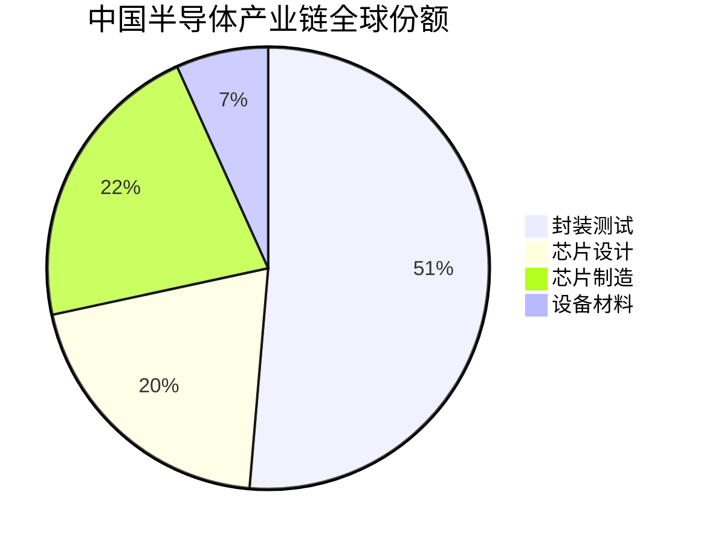
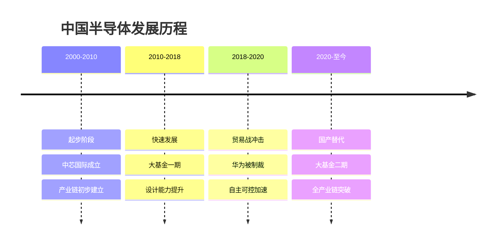
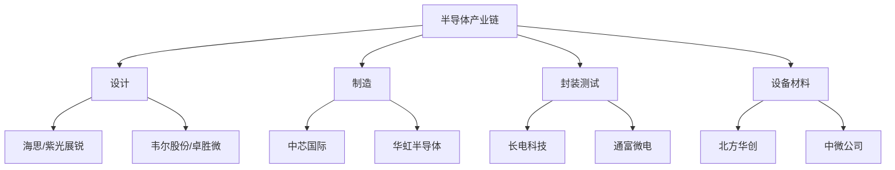
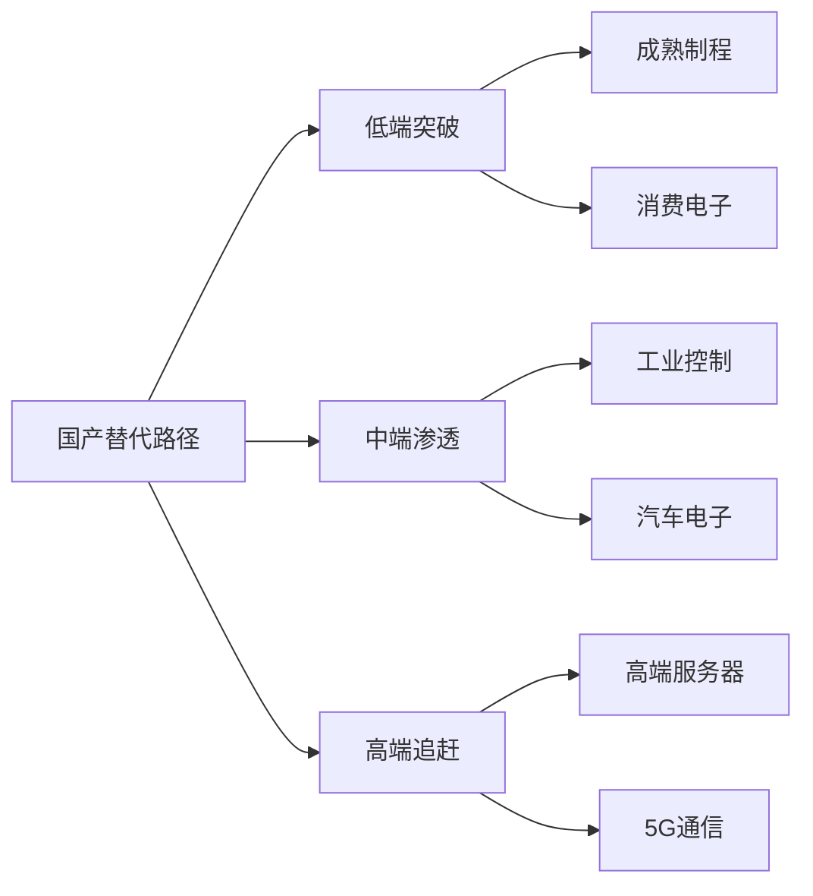

# 中国半导体行业概览

## 概述

中国半导体产业是国家战略重点，在全球产业链重构和科技自主可控背景下，国产替代加速推进。本文全面分析中国半导体行业的发展现状、产业链布局、投资机会和面临的挑战。

**学习目标**：
- 理解中国半导体产业的发展阶段和全球地位
- 掌握半导体产业链各环节的国产化进程
- 分析国产替代的投资逻辑和机会
- 识别半导体投资的风险和挑战
- 建立半导体行业的分析框架

**为什么重要**：
半导体是现代信息产业的基础，中国是全球最大的半导体消费市场，但自给率不足30%。在中美科技竞争背景下，半导体自主可控成为国家战略，产业政策大力支持，投资机会巨大。

## 行业发展现状

### 全球地位

**市场规模**：
- 中国半导体市场：全球最大，占比35%+
- 2023年市场规模：约1.5万亿人民币
- 年增长率：10-15%

**自给率**：
- 当前自给率：约30%
- 目标自给率：2025年70%
- 差距：仍然巨大

**产业链地位**：

### 发展历程

**关键里程碑**：
- 2000年：中芯国际成立
- 2014年：国家集成电路产业投资基金（大基金一期）
- 2018年：中兴事件，华为被制裁
- 2019年：大基金二期成立
- 2020年：国产替代加速
- 2023年：14nm工艺量产

## 产业链分析

### 产业链结构

### 1. 芯片设计

**市场地位**：
- 全球份额：15%
- 增速：20%+
- 龙头企业：海思、紫光展锐

**细分领域**：
- 手机芯片：海思（受限）、紫光展锐
- CIS芯片：韦尔股份（全球前三）
- 射频芯片：卓胜微（国内第一）
- MCU芯片：兆易创新、中颖电子
- 模拟芯片：圣邦股份、思瑞浦

**国产化率**：
- 整体：30%
- 高端：<10%
- 中低端：50%+

**投资逻辑**：
- 国产替代空间大
- 技术门槛相对较低
- 轻资产，高毛利
- 客户认证是关键

### 2. 芯片制造

**市场地位**：
- 全球份额：16%
- 技术水平：落后2-3代
- 龙头企业：中芯国际、华虹半导体

**制程能力**：
- 中芯国际：14nm量产，7nm研发
- 华虹半导体：55nm-90nm
- 台积电（对比）：3nm量产，2nm研发

**产能分布**：
- 8寸晶圆：产能充足
- 12寸晶圆：产能紧张
- 扩产计划：大规模投资

**国产化率**：
- 成熟制程：30%+
- 先进制程：<5%

**投资逻辑**：
- 国家战略支持
- 产能持续扩张
- 成熟制程国产替代
- 先进制程突破困难

### 3. 封装测试

**市场地位**：
- 全球份额：38%
- 技术水平：接近国际先进
- 龙头企业：长电科技、通富微电、华天科技

**技术能力**：
- 传统封装：全球领先
- 先进封装：快速追赶
- SiP、Chiplet：布局中

**国产化率**：
- 整体：60%+
- 先进封装：40%+

**投资逻辑**：
- 技术差距小
- 成本优势明显
- 受益于国产替代
- 盈利能力稳定

### 4. 设备材料

**市场地位**：
- 全球份额：5%
- 技术水平：差距最大
- 龙头企业：北方华创、中微公司

**设备国产化**：
- 刻蚀机：中微公司（全球前三）
- 薄膜沉积：北方华创
- 光刻机：上海微电子（落后ASML 2-3代）
- 检测设备：精测电子、华峰测控

**材料国产化**：
- 硅片：沪硅产业（12寸）
- 光刻胶：南大光电、晶瑞股份
- 电子气体：华特气体、金宏气体
- CMP材料：安集科技

**国产化率**：
- 设备：10-15%
- 材料：15-20%

**投资逻辑**：
- 国产替代空间最大
- 政策支持力度最大
- 技术突破难度最大
- 长期投资价值高

## 国产替代分析

### 替代路径

### 替代进度

**快速替代领域**：
- 消费电子：手机、家电
- 安防监控：海康、大华
- 新能源车：比亚迪、蔚来
- 工业控制：PLC、变频器

**中速替代领域**：
- 通信设备：5G基站
- 服务器：国产CPU
- 存储：国产SSD
- 网络设备：交换机、路由器

**慢速替代领域**：
- 高端服务器：Intel、AMD垄断
- 高端GPU：NVIDIA垄断
- 高端FPGA：Xilinx、Altera垄断
- EDA软件：Synopsys、Cadence垄断

### 替代驱动因素

**政策驱动**：
- 大基金支持：千亿级投资
- 税收优惠：研发费用加计扣除
- 采购倾斜：政府采购国产优先
- 产业政策：《中国制造2025》

**市场驱动**：
- 供应链安全：避免被卡脖子
- 成本优势：国产芯片价格更低
- 服务优势：本地化服务
- 定制化：满足特殊需求

**技术驱动**：
- 技术进步：国产芯片性能提升
- 生态完善：软件、工具链
- 人才积累：海归+本土培养

## 投资机会分析

### 重点投资方向

**1. 芯片设计**：
- 韦尔股份：CIS芯片全球前三
- 卓胜微：射频芯片国内第一
- 兆易创新：存储芯片、MCU
- 圣邦股份：模拟芯片
- 澜起科技：内存接口芯片

**2. 芯片制造**：
- 中芯国际：晶圆代工龙头
- 华虹半导体：特色工艺
- 华润微：功率半导体
- 士兰微：IDM模式

**3. 封装测试**：
- 长电科技：全球第三
- 通富微电：AMD合作
- 华天科技：成本优势

**4. 设备材料**：
- 北方华创：设备平台型公司
- 中微公司：刻蚀机全球前三
- 沪硅产业：12寸硅片
- 安集科技：CMP材料

### 投资逻辑

**成长逻辑**：
- 国产替代：市场份额提升
- 技术突破：产品升级
- 产能扩张：收入增长
- 盈利改善：规模效应

**估值逻辑**：
- PS估值：收入倍数法
- PE估值：盈利倍数法
- 对标估值：参考海外可比公司
- DCF估值：长期现金流折现

**风险收益**：
- 高风险高回报：设备材料
- 中风险中回报：芯片设计
- 低风险低回报：封装测试

## 投资风险分析

### 1. 技术风险

**技术差距**：
- 先进制程：落后2-3代
- 设备材料：差距最大
- EDA软件：严重依赖进口
- 光刻机：ASML垄断

**技术突破不确定性**：
- 研发周期长
- 投入巨大
- 成功率低
- 人才短缺

### 2. 市场风险

**需求波动**：
- 半导体周期性强
- 下游需求不确定
- 库存周期影响
- 价格波动大

**竞争风险**：
- 国际巨头竞争
- 国内同质化竞争
- 价格战风险
- 客户流失风险

### 3. 政策风险

**地缘政治**：
- 中美科技脱钩
- 出口管制
- 供应链断裂
- 技术封锁

**产业政策**：
- 补贴退坡
- 政策变化
- 监管加强

### 4. 估值风险

**估值过高**：
- 市场预期过高
- 估值泡沫
- 业绩不及预期
- 股价回调风险

## 投资策略建议

### 选股策略

**龙头策略**：
- 选择细分领域龙头
- 技术领先，市占率高
- 长期持有

**成长策略**：
- 寻找高成长细分赛道
- 技术突破，客户认证
- 中期持有

**主题策略**：
- 国产替代主题
- 政策催化
- 短期交易

### 仓位管理

**核心持仓（50%）**：
- 中芯国际、北方华创
- 确定性高，长期持有

**成长持仓（30%）**：
- 韦尔股份、卓胜微
- 高成长，中期持有

**主题持仓（20%）**：
- 设备材料、EDA
- 高风险高回报

### 风险控制

**分散投资**：
- 不同环节分散
- 不同公司分散
- 降低单一风险

**动态调整**：
- 根据业绩调整
- 根据估值调整
- 根据政策调整

## 常见问题

### Q1：中国半导体能追上吗？

**回答**：
- 成熟制程：5年内追上
- 先进制程：10年以上
- 设备材料：15年以上
- 需要持续投入和耐心

### Q2：国产替代空间有多大？

**回答**：
- 市场空间：万亿级
- 替代空间：70%自给率目标
- 时间周期：5-10年
- 投资机会：巨大

### Q3：如何选择半导体股票？

**回答**：
- 看赛道：选择国产替代空间大的
- 看公司：选择技术领先、客户认证的
- 看估值：选择估值合理的
- 看时机：选择政策催化、业绩拐点的

## 延伸阅读

### 推荐书籍

1. **《芯片战争》** - 克里斯·米勒
2. **《芯片简史》** - 汪波
3. **《半导体制造技术》** - 迈克尔·夸克
4. **《集成电路产业全书》** - 中国半导体行业协会

### 研究报告

- 各大券商半导体行业深度报告
- 中国半导体行业协会年度报告
- IC Insights全球半导体市场报告

## 参考文献

1. 中国半导体行业协会. 《中国集成电路产业发展报告》. 2023
2. IC Insights. 《全球半导体市场报告》. 2023
3. 克里斯·米勒. 《芯片战争》. 2022
4. 中金公司. 《半导体行业深度报告》. 2023
5. 招商证券. 《国产替代系列研究》. 2023
6. 天风证券. 《半导体设备材料研究》. 2023
7. 华泰证券. 《芯片设计行业分析》. 2023
8. 国信证券. 《晶圆代工行业研究》. 2023
9. Gartner. 《全球半导体市场预测》. 2023
10. SEMI. 《中国半导体设备市场报告》. 2023

---

**投资建议**：
中国半导体是国家战略重点，国产替代空间巨大，政策支持力度大。建议长期看好，分批建仓龙头企业（中芯国际、北方华创、韦尔股份等），持有3-5年以上。短期关注政策催化和业绩拐点，动态调整仓位。

**风险提示**：
需要关注技术突破不确定性、地缘政治风险、估值过高风险。建议仓位控制在30%以内，分散投资不同环节，设置止损位，密切跟踪政策和技术进展。

## 深度分析

### 核心机制解析

理解本主题需要从多个维度进行系统性分析。以下从理论基础、实践应用和历史验证三个层面展开深度探讨。

**理论基础层面**：本主题的核心逻辑建立在经济学和金融学的基本原理之上。通过对基础理论的深入理解，投资者能够建立起稳固的分析框架，避免被市场短期噪音所干扰。

**实践应用层面**：理论必须与实践相结合才能产生价值。在实际投资决策中，需要将抽象的概念转化为具体的分析工具和决策标准。

**历史验证层面**：金融市场有着丰富的历史记录，通过研究历史案例，我们可以验证理论的有效性，并从中提炼出具有普遍意义的规律。

### 关键影响因素

影响本主题的关键因素可以从以下几个维度进行分析：

1. **宏观经济环境**：利率水平、通货膨胀率、经济增长速度等宏观变量对本主题有着深远影响。在不同的宏观经济周期中，相关指标的表现会呈现出显著差异。

2. **市场结构因素**：市场参与者的构成、信息传播机制、流动性状况等市场结构因素决定了价格发现的效率和准确性。

3. **政策监管环境**：政府政策、监管框架的变化会直接影响相关市场的运作规则和参与者行为。

4. **技术创新驱动**：技术进步不断改变着金融市场的运作方式，从算法交易到区块链技术，每一次技术革新都带来新的机遇和挑战。

5. **全球化与地缘政治**：在全球化背景下，各国市场之间的联动性日益增强，地缘政治风险的影响也越来越不可忽视。

### 量化分析框架

为了更精确地分析和评估，可以采用以下量化框架：

| 分析维度 | 关键指标 | 参考基准 | 分析方法 |
|---------|---------|---------|---------|
| 规模评估 | 绝对值与相对值 | 历史均值 | 趋势分析 |
| 质量评估 | 稳定性指标 | 行业对标 | 横向比较 |
| 风险评估 | 波动率指标 | 风险阈值 | 情景分析 |
| 价值评估 | 估值倍数 | 历史区间 | 回归分析 |

通过系统性地应用上述框架，投资者可以对目标进行全面、客观的评估，从而做出更加理性的投资决策。

