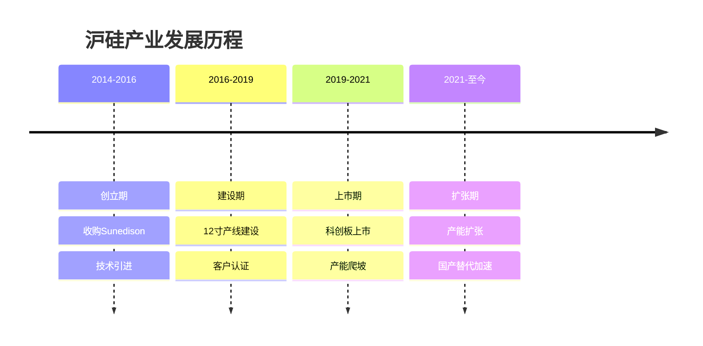
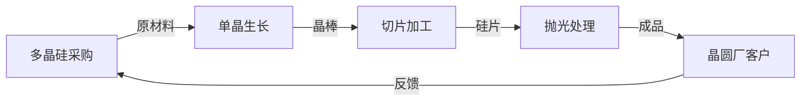
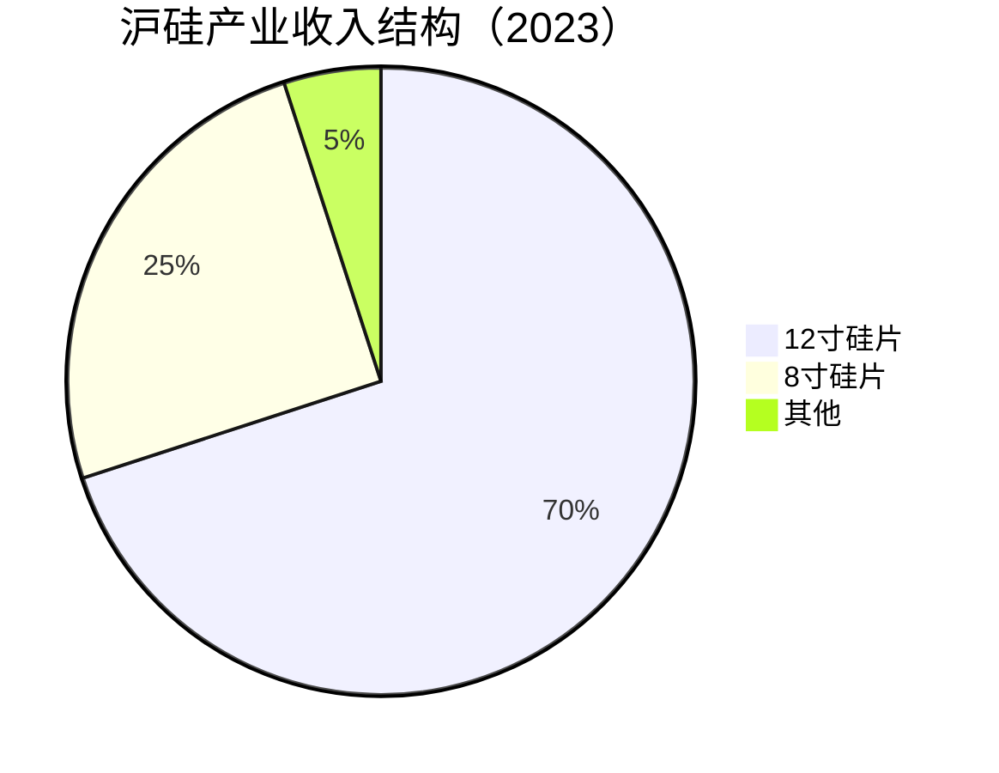
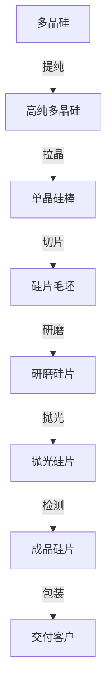
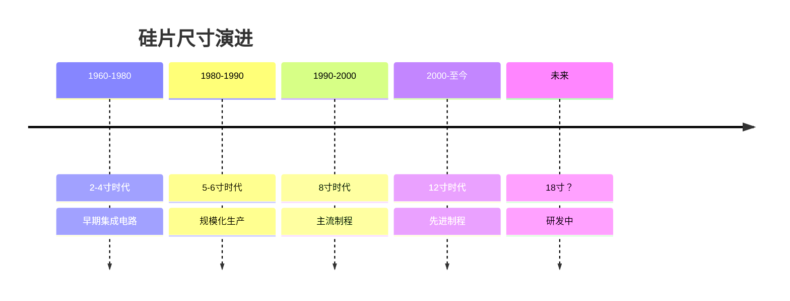
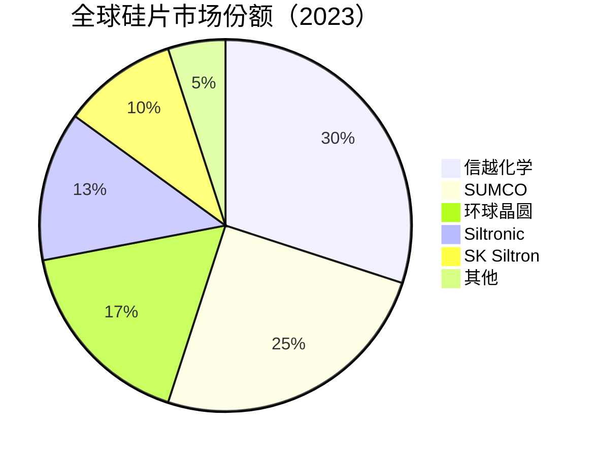

# 沪硅产业：中国12寸硅片龙头

## 公司概况

### 基本信息

**公司名称**：上海硅产业集团股份有限公司（Shanghai Silicone Industry Group, SMICS）
**股票代码**：688126.SH（科创板）
**成立时间**：2014年6月
**总部位置**：中国上海
**实际控制人**：上海国资委

**业务范围**：
- 12寸硅片：核心业务
- 8寸硅片：成熟业务
- SOI硅片：高端产品
- 应用领域：集成电路制造、功率器件、MEMS

**市值规模**（2023）：
- 市值：约800亿人民币
- 中国最大12寸硅片制造商
- 全球硅片市场份额约2%

### 发展历程

**关键里程碑**：
- 2014年：公司成立，收购Sunedison半导体业务
- 2016年：12寸硅片产线开工建设
- 2018年：首批12寸硅片交付中芯国际
- 2019年：科创板上市
- 2020年：进入华虹半导体供应链
- 2021年：12寸硅片月产能达60万片
- 2023年：月产能目标100万片

### 股权结构

**主要股东**：
- 上海国盛集团：约30%（国资）
- 中芯国际：约15%（战略投资）
- 国家集成电路基金：约10%（大基金）
- 其他机构投资者：约45%

**战略意义**：
- 国家战略：硅片自主可控
- 产业协同：与中芯国际深度合作
- 政策支持：大基金、地方政府支持

### Sunedison收购背景

**交易详情**：
- 交易时间：2014年
- 交易金额：约6.83亿美元
- 标的资产：Sunedison半导体100%股权
- 交易方式：现金收购

**Sunedison背景**：
- 成立时间：1959年（前身为MEMC）
- 历史地位：全球前五硅片厂商
- 技术积累：50+年硅片制造经验
- 产能：8寸、12寸硅片
- 客户：全球主要晶圆厂

**收购意义**：
- 技术获取：获得全球领先硅片技术
- 产能获取：8寸、12寸产线
- 客户资源：继承全球客户群
- 人才团队：国际化技术团队
- 战略转型：中国硅片产业从0到1

## 商业模式分析

### 硅片制造商模式

**业务模式**：

**产业链位置**：
- 上游：多晶硅供应商（保利协鑫、通威股份）
- 中游：硅片制造（沪硅产业）
- 下游：晶圆代工厂（中芯国际、华虹半导体）

**商业模式特点**：
- 资本密集：产线投资大（50-100亿/条）
- 技术密集：工艺复杂，良率要求高
- 认证周期长：客户认证2-3年
- 客户粘性强：长期供货协议
- 规模效应：产能越大，成本越低

### 业务结构

**按产品分类**：

**按应用分类**：
- 逻辑芯片：50%（CPU、GPU、SoC）
- 存储芯片：25%（DRAM、NAND）
- 功率器件：15%（MOSFET、IGBT）
- 其他：10%（MEMS、传感器）

**按客户分类**：
- 中芯国际：40%
- 华虹半导体：20%
- 华力微电子：15%
- 其他：25%

## 硅片技术分析

### 硅片技术原理

**硅片作用**：
- 基础材料：集成电路制造的基础
- 承载芯片：在硅片上制造芯片
- 性能影响：硅片质量直接影响芯片性能

**硅片制造流程**：

**关键技术指标**：
- 直径：8寸（200mm）、12寸（300mm）
- 厚度：725μm（12寸）、625μm（8寸）
- 平整度：<0.1μm（GBIR）
- 粗糙度：<0.2nm（Ra）
- 纯度：99.999999999%（11个9）
- 缺陷密度：<0.1个/cm²

### 硅片技术演进

**尺寸演进**：

**尺寸优势**：
- 8寸 vs 12寸：
  - 面积：12寸是8寸的2.25倍
  - 芯片产出：提升2-2.5倍
  - 单位成本：降低30-40%
  - 投资：12寸产线是8寸的3-4倍

**制程适配**：
- 8寸硅片：90nm及以上成熟制程
- 12寸硅片：28nm-3nm先进制程
- 18寸硅片：未来先进制程（研发中）

### 沪硅产业产品矩阵

**1. 12寸抛光硅片**

**技术规格**：
- 直径：300mm
- 厚度：725μm
- 平整度：GBIR < 0.1μm
- 粗糙度：Ra < 0.2nm
- 纯度：11个9

**制程覆盖**：
- 28nm：已量产
- 14nm：客户认证中
- 7nm：研发中
- 目标：覆盖28nm-7nm

**客户认证**：
- 中芯国际：28nm已认证
- 华虹半导体：28nm已认证
- 华力微电子：28nm已认证
- 台积电：认证中

**产能规划**：
- 2023年：月产60万片
- 2024年：月产80万片
- 2025年：月产100万片

**2. 8寸抛光硅片**

**技术规格**：
- 直径：200mm
- 厚度：625μm
- 平整度：优于行业标准
- 成熟产品

**制程覆盖**：
- 90nm-350nm成熟制程
- 功率器件、模拟芯片

**客户群体**：
- 中芯国际
- 华虹半导体
- 华润微电子
- 士兰微

**产能规划**：
- 2023年：月产100万片
- 稳定供应

**3. SOI硅片**

**技术原理**：
- Silicon-On-Insulator
- 绝缘体上硅
- 高性能、低功耗

**技术优势**：
- 低功耗：降低30-50%
- 高速度：提升20-30%
- 抗辐射：适合航空航天

**应用领域**：
- 射频芯片：5G、Wi-Fi
- 功率器件：MOSFET
- 汽车电子：车规级
- 航空航天：抗辐射

**市场地位**：
- 全球SOI市场：Soitec垄断
- 沪硅产业：中国唯一量产
- 国产替代：战略意义重大

**产能规划**：
- 2023年：月产5万片
- 2025年：月产10万片

### 技术能力评估

**技术水平**：
- 12寸硅片：达到国际主流水平
- 28nm制程：已量产，良率稳定
- 14nm制程：客户认证中
- 7nm制程：研发中，技术储备

**技术差距**：
- 与信越化学、SUMCO：1-2代
- 先进制程（7nm以下）：仍有差距
- 良率水平：逐步提升中
- 产能规模：差距较大

**研发能力**：
- 研发人员：500+
- 研发费用率：8-10%
- 专利数量：1000+
- 技术团队：国际化

**生产能力**：
- 12寸产线：2条（上海、嘉定）
- 8寸产线：3条（新加坡、日本、韩国）
- 良率水平：逐步提升
- 产能利用率：80-90%

## 市场地位分析

### 全球硅片市场

**市场规模**：
- 2023年：约120亿美元
- 年增长率：5-8%
- 2025E：140亿美元
- 驱动因素：晶圆厂扩产、先进制程

**市场格局**：

**竞争格局**：
- 第一梯队：信越化学（30%）、SUMCO（25%）
- 第二梯队：环球晶圆（17%）、Siltronic（13%）
- 第三梯队：SK Siltron（10%）、沪硅产业（2%）

**市场特点**：
- 高度集中：前五大占95%
- 寡头垄断：日本、台湾、德国、韩国
- 进入壁垒：技术、资本、客户认证
- 长期合约：3-5年供货协议

### 中国硅片市场

**市场规模**：
- 2023年：约40亿美元
- 全球占比：33%
- 年增长率：10-15%
- 2025E：55亿美元

**自给率**：
- 8寸硅片：约20%
- 12寸硅片：约10%
- 整体自给率：约15%
- 目标：2025年达到30%

**国产替代空间**：
- 中国需求：40亿美元
- 国产供应：6亿美元
- 进口依赖：34亿美元
- 替代空间：巨大

**中国硅片厂商**：
- 沪硅产业：12寸龙头
- 中环股份：8寸为主
- 立昂微：8寸、6寸
- 神工股份：SOI硅片
- 其他：小型厂商

### 沪硅产业市场地位

**全球排名**：
- 整体市场：第六-七位
- 12寸硅片：前十
- 中国市场：第一

**市场份额**：
- 全球市场：约2%
- 中国市场：约15%
- 12寸市场：约10%（中国）
- 增长趋势：快速提升

**客户结构**：
- 中芯国际：最大客户（40%）
- 华虹半导体：重要客户（20%）
- 华力微电子：核心客户（15%）
- 其他：25%

**竞争优势**：
- 本地化：快速响应
- 战略合作：与中芯国际深度绑定
- 政策支持：国产替代
- 成本优势：人力成本低

## 竞争优势分析

### 1. 技术优势

**技术积累**：
- Sunedison技术：50年+经验
- 国际团队：全球化人才
- 持续研发：研发费用率8-10%
- 专利储备：1000+

**产品能力**：
- 12寸硅片：28nm已量产
- 14nm：客户认证中
- SOI硅片：中国唯一量产
- 产品线：8寸、12寸、SOI全覆盖

**技术突破**：
- 28nm硅片：良率稳定
- 14nm硅片：认证中
- 7nm硅片：研发中
- SOI硅片：量产

### 2. 客户优势

**战略客户**：
- 中芯国际：战略股东+核心客户
- 华虹半导体：长期合作伙伴
- 华力微电子：本地客户
- 台积电：认证中

**客户粘性**：
- 长期合约：3-5年供货协议
- 深度合作：联合研发
- 本地化：快速响应
- 定制化：满足特殊需求

**客户认证**：
- 认证周期：2-3年
- 认证难度：极高
- 认证壁垒：客户粘性强
- 认证进展：持续推进

### 3. 国产替代优势

**供应链安全**：
- 硅片自给率：<10%
- 战略意义：国家安全
- 政策支持：大基金、地方政府
- 客户意愿：主动转单

**政策支持**：
- 大基金：股东+资金支持
- 税收优惠：所得税减免
- 土地支持：工业用地优惠
- 人才政策：引进国际人才

**本地化优势**：
- 快速响应：本地团队
- 技术支持：深度服务
- 定制化：满足特殊需求
- 成本优势：人力成本低

### 4. 规模优势

**产能规模**：
- 12寸：月产60万片（2023）
- 8寸：月产100万片
- 目标：12寸月产100万片（2025）
- 规模效应：成本摊薄

**投资规模**：
- 累计投资：200亿+人民币
- 在建产线：2条12寸产线
- 规划产能：月产150万片（12寸）
- 资本支持：大基金、国资

## 财务分析

### 收入分析

**收入增长**：
- 2019年：15亿人民币
- 2020年：20亿
- 2021年：28亿
- 2022年：35亿
- 2023E：45亿
- CAGR（2019-2023）：32%

**收入驱动**：
- 产能爬坡：12寸产线逐步达产
- 客户认证：新客户导入
- 国产替代：市场份额提升
- 价格稳定：长期合约锁定

**收入结构变化**：
- 12寸占比：从50%提升至70%
- 8寸占比：从45%降至25%
- SOI占比：从5%稳定在5%
- 趋势：12寸占比持续提升

### 盈利能力

**毛利率**：
- 2019年：-10%（产能爬坡）
- 2020年：5%
- 2021年：10%
- 2022年：15%
- 2023E：18%

**毛利率驱动**：
- 产能利用率：从50%提升至85%
- 良率提升：从70%提升至90%+
- 规模效应：成本摊薄
- 产品结构：12寸占比提升

**净利率**：
- 2019年：-50%（亏损）
- 2020年：-20%（亏损）
- 2021年：-5%（接近盈亏平衡）
- 2022年：2%（首次盈利）
- 2023E：5%

**ROE**：
- 2022年：3%
- 2023E：8%
- 2025E：15%+（目标）

**盈利能力分析**：
- 重资产：折旧摊销大
- 爬坡期：良率提升中
- 盈利改善：产能利用率提升
- 未来：规模效应显现

### 现金流

**经营现金流**：
- 2021年：5亿+
- 2022年：10亿+
- 2023E：15亿+
- 趋势：持续改善

**资本支出**：
- 年资本支出：30-50亿
- 主要用于：产线建设、设备采购
- 重资产：资本密集型
- 投资周期：3-5年

**现金储备**：
- 现金及等价物：50亿+
- 融资能力：大基金、国资支持
- 资产负债率：50%
- 财务压力：可控

### 财务健康度

**资产负债表**：
- 资产负债率：50%
- 流动比率：1.5
- 速动比率：1.2
- 财务结构：合理

**偿债能力**：
- 利息覆盖倍数：3-5倍
- 债务/EBITDA：3-4倍
- 财务风险：中等
- 融资渠道：畅通

**财务数据表（2019-2023）**：

| 指标 | 2019 | 2020 | 2021 | 2022 | 2023E |
|------|------|------|------|------|-------|
| 收入（亿） | 15 | 20 | 28 | 35 | 45 |
| 增长率 | 50% | 33% | 40% | 25% | 29% |
| 毛利率 | -10% | 5% | 10% | 15% | 18% |
| 净利率 | -50% | -20% | -5% | 2% | 5% |
| 净利润（亿） | -7.5 | -4 | -1.4 | 0.7 | 2.3 |
| ROE | -15% | -8% | -3% | 3% | 8% |
| 经营现金流（亿） | 2 | 3 | 5 | 10 | 15 |
| 资本支出（亿） | 40 | 35 | 30 | 40 | 50 |
| 资产负债率 | 45% | 48% | 50% | 50% | 48% |

**财务特点**：
- 重资产：资本支出大
- 爬坡期：盈利能力提升中
- 现金流：经营现金流改善
- 融资：大基金、国资支持

## 投资价值评估

### 估值分析

**历史估值区间**：
- PE：N/A（长期亏损）
- PS：10-25倍
- PB：3-8倍
- EV/Sales：12-30倍

**当前估值（2023）**：
- PE：约350倍（刚盈利）
- PS：约18倍
- PB：约5倍
- EV/Sales：约20倍

**估值对比**：

| 公司 | PE | PS | PB | 市值（亿美元） | 业务 | 毛利率 | 净利率 |
|------|----|----|----|--------------|----|--------|--------|
| 沪硅产业 | 350 | 18 | 5 | 110 | 12寸硅片 | 18% | 5% |
| 信越化学 | 25 | 5 | 3 | 500 | 硅片龙头 | 40% | 25% |
| SUMCO | 20 | 3 | 2 | 80 | 硅片第二 | 35% | 20% |
| 环球晶圆 | 18 | 2.5 | 2 | 60 | 硅片第三 | 30% | 18% |
| 中环股份 | 40 | 2 | 2 | 50 | 8寸硅片 | 20% | 8% |

**估值分析**：
- PS估值：18倍 vs 行业平均3-5倍
- 溢价原因：国产替代、战略价值
- 盈利能力：远低于国际巨头
- 成长性：高增长（30%+）

### 投资论点

**看多理由**：
1. **战略价值**：硅片自主可控，国家战略
2. **稀缺性**：中国唯一12寸硅片龙头
3. **成长性**：收入增长30%+，盈利能力改善
4. **国产替代**：自给率<10%，替代空间巨大
5. **客户优质**：中芯国际战略股东+核心客户
6. **产能扩张**：月产能从60万片到100万片
7. **技术突破**：28nm量产，14nm认证中
8. **政策支持**：大基金、国资、税收优惠
9. **长期合约**：3-5年供货协议，收入稳定
10. **规模效应**：产能利用率提升，成本下降

**看空理由**：
1. **估值过高**：PS 18倍 vs 行业3-5倍
2. **盈利能力弱**：净利率5% vs 行业20%+
3. **技术差距**：与信越、SUMCO差1-2代
4. **产能规模小**：月产60万片 vs 信越300万片
5. **客户集中**：中芯国际占40%
6. **资本密集**：持续大额资本支出
7. **良率风险**：良率提升不确定性
8. **竞争加剧**：国际巨头降价
9. **周期性强**：半导体周期波动
10. **地缘政治**：中美科技竞争

### 投资建议

**适合投资者**：
- 看好国产替代的投资者
- 看好半导体长期发展的投资者
- 能承受高估值波动的投资者
- 长期投资者（5-10年）
- 战略投资者

**投资策略**：
- 建仓区间：25-30元（当前约35元）
- 持有周期：5-10年
- 目标价：60元+（2025年）
- 止损位：20元

**风险控制**：
- 仓位：不超过5%（高估值、高风险）
- 关注：产能利用率、良率、客户认证
- 调整：根据业绩动态调整

**当前建议**：
- 观望为主：估值偏高，等待回调
- 长期看好：战略价值、国产替代
- 分批建仓：25-30元区间考虑
- 长期持有：5-10年战略投资

**投资逻辑**：
- 短期：估值过高，盈利能力弱
- 中期：产能爬坡，盈利改善
- 长期：国产替代，战略价值

## 行业趋势与机会

### 1. 12寸硅片需求增长

**市场规模**：
- 2023年：约100亿美元
- 2025E：120亿美元
- 2030E：150亿美元
- CAGR：8-10%

**需求驱动**：
- 晶圆厂扩产：中芯国际、华虹半导体
- 先进制程：28nm-7nm
- 成熟制程：功率器件、模拟芯片
- 汽车电子：车规级芯片

**中国需求**：
- 2023年：约35亿美元
- 2025E：50亿美元
- 2030E：80亿美元
- CAGR：15%+

**供需缺口**：
- 中国需求：35亿美元
- 国产供应：3.5亿美元
- 自给率：10%
- 缺口：31.5亿美元

### 2. 先进制程硅片

**制程演进**：
- 28nm：主流成熟制程
- 14nm：先进制程
- 7nm：高端制程
- 5nm/3nm：最先进制程

**技术要求**：
- 平整度：更高要求
- 纯度：更高纯度
- 缺陷密度：更低缺陷
- 良率：更高良率

**沪硅布局**：
- 28nm：已量产
- 14nm：客户认证中
- 7nm：研发中
- 目标：覆盖28nm-7nm

**市场机会**：
- 中芯国际：28nm-14nm扩产
- 华虹半导体：28nm扩产
- 华力微电子：28nm扩产
- 国产替代：优先采购

### 3. 国产替代加速

**政策驱动**：
- 供应链安全：国家战略
- 大基金：资金支持
- 税收优惠：所得税减免
- 地方政府：土地、人才支持

**客户意愿**：
- 主动转单：供应链安全
- 深度合作：联合研发
- 长期合约：3-5年
- 本地化：快速响应

**替代路径**：
- 成熟制程：28nm-90nm
- 先进制程：14nm-7nm
- 特色工艺：SOI、功率器件
- 时间表：2025年自给率30%

**替代空间**：
- 8寸硅片：20亿美元
- 12寸硅片：30亿美元
- 总计：50亿美元
- 沪硅机会：10-15亿美元（2025）

### 4. 新兴应用

**功率器件**：
- 新能源汽车：IGBT、SiC
- 充电桩：功率模块
- 光伏逆变器：功率器件
- 市场规模：快速增长

**汽车电子**：
- 智能驾驶：芯片需求增加
- 车载娱乐：芯片需求增加
- 电动化：功率器件需求
- 车规级：高可靠性要求

**物联网**：
- 智能家居：MCU、传感器
- 工业物联网：工业芯片
- 可穿戴：低功耗芯片
- 市场规模：持续增长

**5G通信**：
- 基站：射频芯片
- 手机：5G芯片
- 物联网：通信芯片
- 市场规模：持续增长

## 竞争对手分析

### 信越化学（Shin-Etsu）

**市场地位**：
- 全球第一：30%市场份额
- 技术领先：全球最强
- 客户：全球主要晶圆厂

**竞争优势**：
- 技术积累：60年+
- 产能规模：月产300万片（12寸）
- 垂直整合：多晶硅-硅片
- 品牌溢价：高端市场
- 良率：业界最高

**财务数据**：
- 毛利率：40%
- 净利率：25%
- ROE：20%+
- 现金流：充裕

**沪硅对比**：
- 技术差距：2代
- 产能规模：信越5倍
- 盈利能力：信越远超
- 成本优势：沪硅更低

### SUMCO

**市场地位**：
- 全球第二：25%市场份额
- 技术领先：仅次于信越
- 客户：全球主要晶圆厂

**竞争优势**：
- 技术积累：50年+
- 产能规模：月产250万片（12寸）
- 产品线：8寸、12寸
- 客户关系：长期合作

**财务数据**：
- 毛利率：35%
- 净利率：20%
- ROE：18%
- 现金流：稳定

**沪硅对比**：
- 技术差距：1-2代
- 产能规模：SUMCO 4倍
- 盈利能力：SUMCO远超
- 市场份额：SUMCO 12倍

### 环球晶圆（GlobalWafers）

**市场地位**：
- 全球第三：17%市场份额
- 技术：主流水平
- 客户：全球晶圆厂

**竞争优势**：
- 并购整合：收购Siltronic（未成功）
- 产能规模：月产150万片（12寸）
- 产品线：6寸-12寸
- 全球布局：台湾、美国、欧洲

**财务数据**：
- 毛利率：30%
- 净利率：18%
- ROE：15%
- 现金流：良好

**沪硅对比**：
- 技术差距：1代
- 产能规模：环球晶圆2.5倍
- 盈利能力：环球晶圆远超
- 市场份额：环球晶圆8倍

### 竞争对比分析

**技术对比**：
- 信越化学：全球最强，7nm-3nm
- SUMCO：仅次于信越，7nm-5nm
- 环球晶圆：主流水平，14nm-7nm
- 沪硅产业：追赶中，28nm-14nm

**产能对比**：
- 信越化学：月产300万片
- SUMCO：月产250万片
- 环球晶圆：月产150万片
- 沪硅产业：月产60万片

**盈利对比**：
- 信越化学：毛利率40%，净利率25%
- SUMCO：毛利率35%，净利率20%
- 环球晶圆：毛利率30%，净利率18%
- 沪硅产业：毛利率18%，净利率5%

**竞争策略**：
- 沪硅产业：国产替代、本地化、成本优势
- 国际巨头：技术领先、规模优势、品牌溢价

**竞争格局**：
- 短期：国际巨头主导
- 中期：沪硅份额提升
- 长期：中国市场沪硅领先

## 投资启示

### 1. 战略价值大于财务价值

**战略意义**：
- 国家安全：芯片产业基础
- 供应链安全：自主可控
- 产业升级：高端制造
- 技术突破：关键材料

**财务表现**：
- 盈利能力：弱（净利率5%）
- 估值：高（PS 18倍）
- 现金流：改善中
- ROE：低（8%）

**投资逻辑**：
- 短期：财务表现一般
- 长期：战略价值巨大
- 适合：战略投资者、长期投资者

### 2. 重资产行业的特点

**资本密集**：
- 产线投资：50-100亿/条
- 设备投资：占比70%+
- 投资周期：3-5年
- 回报周期：8-10年

**规模效应**：
- 产能利用率：关键指标
- 良率：直接影响成本
- 规模：越大成本越低
- 壁垒：资本、技术、客户

**投资建议**：
- 关注产能利用率
- 关注良率提升
- 关注规模扩张
- 长期投资

### 3. 客户认证的重要性

**认证周期**：
- 时间：2-3年
- 流程：样品-小批量-大批量
- 难度：极高
- 壁垒：客户粘性强

**认证价值**：
- 长期合约：3-5年
- 收入稳定：可预测
- 客户粘性：不易更换
- 竞争壁垒：新进入者难

**投资关注**：
- 客户认证进展
- 新客户导入
- 客户结构
- 客户粘性

### 4. 国产替代的机遇与挑战

**机遇**：
- 政策支持：大基金、税收优惠
- 客户意愿：供应链安全
- 市场空间：自给率<10%
- 本地化：快速响应

**挑战**：
- 技术差距：1-2代
- 产能规模：小
- 盈利能力：弱
- 竞争加剧：国际巨头降价

**成功关键**：
- 技术突破：缩小差距
- 规模扩张：降低成本
- 客户认证：拓展客户
- 良率提升：提升盈利

## 常见问题

### Q1：沪硅产业能追上信越化学吗？

**回答**：
- 短期：不可能（技术差距2代）
- 中期：缩小差距（10年内）
- 长期：中国市场有机会（20年）
- 关键：技术突破、规模扩张、客户认证

**差距分析**：
- 技术：2代（28nm vs 3nm）
- 产能：5倍（60万片 vs 300万片）
- 盈利：5倍（净利率5% vs 25%）
- 品牌：信越更强

**追赶路径**：
- 技术：持续研发，引进人才
- 产能：扩产，规模效应
- 客户：深度合作，长期合约
- 时间：需要10-20年

### Q2：为什么估值这么高？

**回答**：
- 战略价值：国家安全、供应链自主
- 稀缺性：中国唯一12寸硅片龙头
- 成长性：收入增长30%+
- 政策支持：大基金、国资

**风险**：
- 估值过高：PS 18倍 vs 行业3-5倍
- 盈利能力弱：净利率5% vs 行业20%+
- 技术差距：1-2代
- 竞争加剧：国际巨头降价

**投资建议**：
- 长期看好：战略价值
- 短期谨慎：估值过高
- 等待回调：25-30元区间

### Q3：什么时候买入沪硅产业？

**回答**：
- 估值：PS < 12倍
- 股价：25-30元（当前约35元）
- 时机：产能利用率提升、良率改善、新客户导入
- 策略：等待回调，分批建仓

**买入信号**：
- 产能利用率：>85%
- 良率：>90%
- 毛利率：>20%
- 净利率：>8%
- 新客户：台积电认证通过

### Q4：沪硅产业vs中环股份，选哪个？

**回答**：
- 沪硅产业：12寸硅片，战略价值，高估值
- 中环股份：8寸硅片+光伏，多元化，低估值
- 建议：根据风险偏好选择

**对比分析**：

| 指标 | 沪硅产业 | 中环股份 |
|------|---------|---------|
| 主营业务 | 12寸硅片 | 8寸硅片+光伏 |
| 市值 | 800亿 | 600亿 |
| PS | 18倍 | 2倍 |
| 毛利率 | 18% | 20% |
| 净利率 | 5% | 8% |
| 战略价值 | 高 | 中 |
| 估值 | 高 | 低 |
| 风险 | 高 | 中 |

### Q5：硅片行业有周期性吗？

**回答**：
- 有周期性：跟随半导体周期
- 周期特点：3-5年一个周期
- 当前阶段：下行周期（2022-2023）
- 未来：2024-2025有望复苏

**周期驱动**：
- 需求：晶圆厂扩产/减产
- 供给：硅片厂扩产/减产
- 价格：供需关系
- 库存：去库存/补库存

**投资策略**：
- 周期底部：买入
- 周期顶部：卖出
- 长期持有：战略投资者

### Q6：国产替代能成功吗？

**回答**：
- 能成功：政策支持、客户意愿、市场空间
- 时间：需要10-20年
- 路径：成熟制程→先进制程
- 目标：2025年自给率30%，2030年50%

**成功因素**：
- 技术突破：缩小差距
- 规模扩张：降低成本
- 客户认证：拓展客户
- 政策支持：持续投入

## 延伸阅读

### 推荐书籍

1. **《半导体材料》** - 蒋民华
   - 内容：半导体材料基础知识
   - 适合：理解硅片技术原理

2. **《硅片制造技术》** - 王守觉
   - 内容：硅片制造工艺详解
   - 适合：深入了解硅片生产

3. **《芯片战争》** - 克里斯·米勒
   - 内容：全球半导体产业竞争
   - 适合：理解产业格局

4. **《半导体制造技术》** - 迈克尔·夸克
   - 内容：半导体制造全流程
   - 适合：理解产业链

5. **《中国芯片产业发展报告》** - 中国半导体行业协会
   - 内容：中国半导体产业现状
   - 适合：了解国产替代

### 研究报告

**公司报告**：
- 沪硅产业年报和季报（2019-2023）
- 沪硅产业招股说明书
- 沪硅产业投资者关系资料

**券商研究**：
- 中金公司：《沪硅产业深度报告》（2023）
- 招商证券：《沪硅产业投资价值分析》（2023）
- 天风证券：《硅片行业研究》（2023）
- 华泰证券：《沪硅产业竞争力分析》（2023）
- 国泰君安：《国产硅片替代路径》（2023）

**行业研究**：
- SEMI：《全球硅片市场报告》（2023）
- IC Insights：《半导体材料市场预测》（2023）
- Gartner：《半导体供应链分析》（2023）
- IHS Markit：《硅片市场研究》（2023）

### 行业资讯

**行业协会**：
- 中国半导体行业协会（CSIA）
- 国际半导体产业协会（SEMI）
- 中国电子材料行业协会

**专业媒体**：
- 集微网：半导体产业新闻
- 芯思想：半导体行业分析
- 半导体行业观察：深度报道
- EE Times：国际半导体资讯

**数据平台**：
- Wind资讯：财务数据
- Bloomberg：市场数据
- IC Insights：行业数据
- SEMI：产业数据

## 参考文献

1. 沪硅产业. 《年度报告》. 2019-2023
2. 沪硅产业. 《首次公开发行股票并在科创板上市招股说明书》. 2019
3. SEMI. 《全球硅片市场报告》. 2023
4. IC Insights. 《半导体材料市场预测》. 2023
5. 中金公司. 《沪硅产业深度报告：中国硅片龙头，国产替代加速》. 2023
6. 招商证券. 《沪硅产业投资价值分析：战略价值大于财务价值》. 2023
7. 天风证券. 《硅片行业研究：供需格局与国产替代》. 2023
8. 华泰证券. 《沪硅产业竞争力分析：技术、客户、政策三重优势》. 2023
9. 国泰君安. 《国产硅片替代路径：从成熟制程到先进制程》. 2023
10. Gartner. 《半导体供应链分析报告》. 2023
11. IHS Markit. 《全球硅片市场研究》. 2023
12. 克里斯·米勒. 《芯片战争》. 2022
13. 中国半导体行业协会. 《中国集成电路产业发展报告》. 2023
14. 信越化学. 《年度报告》. 2023
15. SUMCO. 《年度报告》. 2023
16. 环球晶圆. 《年度报告》. 2023
17. 中芯国际. 《年度报告》. 2023
18. 华虹半导体. 《年度报告》. 2023

---

**投资建议**：
沪硅产业是中国12寸硅片龙头，具有重大战略价值，受益于国产替代、政策支持、客户深度合作等多重驱动。公司技术水平达到28nm量产，14nm认证中，产能从月产60万片扩张至100万片，盈利能力持续改善（毛利率18%，净利率5%）。但当前估值偏高（PS 18倍 vs 行业3-5倍），盈利能力远低于国际巨头（净利率5% vs 20%+），技术差距1-2代。

建议长期看好国产替代和半导体产业发展的战略投资者，在25-30元区间分批建仓，持有5-10年，目标价60元+（2025年）。适合能承受高估值波动、看重战略价值的长期投资者。

**风险提示**：
需要关注估值过高风险（PS 18倍）、盈利能力弱（净利率5%）、技术差距（1-2代）、产能规模小（月产60万片 vs 信越300万片）、客户集中度高（中芯国际40%）、资本支出大（年均40-50亿）、良率提升不确定性、竞争加剧（国际巨头降价）、半导体周期波动、地缘政治风险等。建议仓位控制在5%以内，设置止损位20元，密切跟踪产能利用率、良率、客户认证进展和竞争格局变化。

---

[← 返回半导体行业](index.html)

## 深度分析：硅片产业的战略意义

### 硅片在半导体产业链中的地位

**产业链基础**：
硅片是半导体产业链的最上游材料，被称为"芯片的基石"。没有高质量的硅片，就无法制造出高性能的芯片。硅片质量直接影响芯片的良率、性能和可靠性。

**价值占比**：
在整个半导体制造成本中，硅片成本占比约为5-8%。虽然占比不高，但其重要性不可替代。一片12寸硅片的价格约为100-150美元，而在其上制造的芯片价值可达数千美元。

**技术壁垒**：
硅片制造看似简单（从沙子到硅片），实际上技术壁垒极高：
- 纯度要求：99.999999999%（11个9）
- 平整度要求：<0.1μm
- 缺陷密度：<0.1个/cm²
- 良率要求：>95%

这些指标的实现需要几十年的技术积累和数百亿的投资。

### 中国硅片产业的战略困境

**自给率极低**：
中国是全球最大的半导体消费市场，占全球市场的35%，但硅片自给率不足10%。这意味着90%以上的硅片依赖进口，主要来自日本、台湾、德国、韩国。

**供应链风险**：
在中美科技竞争的背景下，硅片供应链安全成为国家战略问题。如果硅片供应被切断，整个中国半导体产业将陷入停滞。这不是危言耸听，而是现实威胁。

**技术封锁**：
国际硅片巨头对中国实施技术封锁，不转让核心技术，不出售先进设备。中国硅片产业只能通过自主研发和并购来获取技术。

**人才短缺**：
硅片制造需要大量经验丰富的工程师和技术人员。中国在这方面严重短缺，需要从海外引进人才。

### 沪硅产业的战略使命

**打破垄断**：
沪硅产业的使命是打破国际巨头的垄断，实现硅片自主可控。这不仅是商业目标，更是国家战略。

**技术突破**：
通过收购Sunedison，沪硅产业获得了全球领先的硅片技术。但这只是起点，还需要持续研发，缩小与国际巨头的差距。

**产能建设**：
沪硅产业正在大规模建设12寸硅片产线，目标是到2025年月产能达到100万片，满足中国市场30%的需求。

**客户合作**：
沪硅产业与中芯国际、华虹半导体等国内晶圆厂深度合作，共同推进国产替代。中芯国际不仅是客户，还是战略股东，双方利益深度绑定。

## 硅片制造工艺深度解析

### 单晶生长技术

**直拉法（CZ法）**：
这是最常用的单晶硅生长方法，由波兰科学家Czochralski于1916年发明。

**工艺流程**：
1. 将高纯多晶硅放入石英坩埚
2. 加热至1420°C使其熔化
3. 将籽晶浸入硅熔体
4. 缓慢向上拉动籽晶
5. 硅熔体在籽晶上结晶
6. 形成单晶硅棒

**关键参数**：
- 拉速：0.5-2mm/min
- 转速：5-20rpm
- 温度：1420°C±1°C
- 气氛：氩气保护
- 时间：24-48小时

**技术难点**：
- 温度控制：±1°C精度
- 拉速控制：保证晶体质量
- 直径控制：保证尺寸一致
- 缺陷控制：减少位错、空洞

**沪硅能力**：
沪硅产业掌握了12寸单晶生长技术，可以生长出直径300mm、长度2-3米的单晶硅棒。良率达到90%以上，接近国际水平。

### 切片技术

**多线切割**：
使用钢线和碳化硅浆料同时切割多片硅片，提高效率。

**工艺参数**：
- 钢线直径：0.12mm
- 切割速度：0.3-0.5mm/min
- 切片厚度：725μm（12寸）
- 切割损耗：200-300μm
- 同时切片：数百片

**技术难点**：
- 厚度均匀性：±5μm
- 表面平整度：控制翘曲
- 切割损耗：降低材料浪费
- 切割效率：提高产能

**金刚线切割**：
新一代切割技术，使用金刚石涂层钢线，不需要浆料，切割损耗更小。

**优势**：
- 切割损耗：降低50%
- 切割速度：提高30%
- 环保：无浆料污染
- 成本：降低20%

**沪硅应用**：
沪硅产业已经全面采用金刚线切割技术，切割良率达到95%以上，切割损耗控制在150μm以内，达到国际先进水平。

### 研磨抛光技术

**研磨工艺**：
使用磨料去除切割损伤层，改善表面平整度。

**工艺流程**：
1. 粗磨：去除切割损伤
2. 精磨：改善平整度
3. 超精磨：进一步提升

**抛光工艺**：
使用化学机械抛光（CMP）技术，获得镜面效果。

**工艺参数**：
- 抛光液：碱性溶液+磨料
- 抛光压力：100-300g/cm²
- 抛光速度：30-60rpm
- 抛光时间：10-30分钟

**技术指标**：
- 平整度：GBIR < 0.1μm
- 粗糙度：Ra < 0.2nm
- 表面质量：无划痕、无颗粒
- 边缘质量：无崩边

**沪硅水平**：
沪硅产业的抛光技术达到国际主流水平，可以满足28nm制程的要求。14nm制程的抛光技术正在客户认证中。

### 清洗技术

**清洗目的**：
去除表面颗粒、有机物、金属离子等污染物。

**清洗流程**：
1. 有机物清洗：去除油脂
2. 颗粒清洗：去除颗粒
3. 金属离子清洗：去除金属
4. 干燥：氮气吹干

**清洗标准**：
- 颗粒密度：<0.1个/cm²
- 金属离子：<10^10原子/cm²
- 有机物：<10^13原子/cm²

**沪硅能力**：
沪硅产业建立了完善的清洗体系，清洗良率达到99%以上，满足先进制程的要求。

### 检测技术

**检测项目**：
- 几何尺寸：直径、厚度、翘曲
- 表面质量：平整度、粗糙度、缺陷
- 电学性能：电阻率、少子寿命
- 金属杂质：ICPMS检测
- 颗粒污染：表面扫描

**检测设备**：
- 光学检测：表面缺陷
- 电学检测：电阻率
- 化学检测：金属杂质
- 几何检测：尺寸参数

**检测标准**：
- 检测覆盖率：100%
- 检测精度：纳米级
- 检测速度：秒级
- 数据追溯：全流程

**沪硅体系**：
沪硅产业建立了完善的质量检测体系，引进了国际先进的检测设备，检测能力达到国际水平。

## 客户认证深度分析

### 认证流程详解

**第一阶段：样品认证（6-12个月）**

**流程**：
1. 提交样品：10-20片
2. 客户检测：全面检测
3. 工艺验证：试制芯片
4. 性能评估：对比分析
5. 反馈改进：优化产品

**关键指标**：
- 几何尺寸：符合标准
- 表面质量：无缺陷
- 电学性能：满足要求
- 工艺兼容性：良好

**沪硅进展**：
沪硅产业的12寸硅片已经通过中芯国际、华虹半导体、华力微电子的样品认证。

**第二阶段：小批量认证（12-18个月）**

**流程**：
1. 小批量供货：100-1000片/月
2. 工艺稳定性：验证一致性
3. 良率评估：统计分析
4. 成本评估：经济性分析
5. 供应能力：产能评估

**关键指标**：
- 批次一致性：Cpk > 1.33
- 良率稳定性：>95%
- 交付及时性：>98%
- 质量稳定性：PPM < 100

**沪硅进展**：
沪硅产业正在中芯国际28nm产线进行小批量认证，良率稳定在95%以上。

**第三阶段：大批量认证（6-12个月）**

**流程**：
1. 大批量供货：10000片+/月
2. 长期稳定性：验证可靠性
3. 供应链管理：物流、库存
4. 成本优化：降本增效
5. 战略合作：长期协议

**关键指标**：
- 产能保障：满足需求
- 质量稳定：PPM < 50
- 交付准时：>99%
- 成本竞争力：优于竞品

**沪硅进展**：
沪硅产业已经进入中芯国际28nm产线的大批量供货阶段，月供货量达到数万片。

### 认证壁垒分析

**时间壁垒**：
从样品认证到大批量供货，需要2-3年时间。这期间需要持续投入，没有收入或收入很少。这对新进入者是巨大的挑战。

**技术壁垒**：
客户对硅片质量要求极高，任何一项指标不达标都会被淘汰。需要强大的技术能力和质量控制体系。

**资金壁垒**：
认证期间需要持续投入研发、生产、检测，没有足够的资金支持很难坚持下来。

**客户粘性**：
一旦通过认证，客户不会轻易更换供应商。因为更换供应商需要重新认证，风险大、成本高。

**沪硅优势**：
- 资金充裕：大基金、国资支持
- 技术积累：Sunedison技术
- 客户关系：中芯国际战略股东
- 政策支持：国产替代优先

### 主要客户分析

**中芯国际（40%）**

**合作关系**：
- 战略股东：持股15%
- 核心客户：最大客户
- 联合研发：深度合作
- 长期合约：3-5年

**供货情况**：
- 28nm：大批量供货
- 14nm：认证中
- 产能：月供货数万片
- 占比：40%收入

**未来展望**：
随着中芯国际28nm、14nm产能扩张，沪硅产业的供货量将持续增长。预计2025年月供货量达到10万片以上。

**华虹半导体（20%）**

**合作关系**：
- 重要客户：第二大客户
- 长期合作：多年合作
- 稳定供货：质量稳定
- 产能扩张：需求增长

**供货情况**：
- 28nm：稳定供货
- 产能：月供货数万片
- 占比：20%收入

**未来展望**：
华虹半导体正在扩建12寸产线，对硅片需求将持续增长。沪硅产业有望进一步提升供货份额。

**华力微电子（15%）**

**合作关系**：
- 核心客户：本地客户
- 深度合作：技术支持
- 快速响应：本地优势

**供货情况**：
- 28nm：稳定供货
- 产能：月供货数千片
- 占比：15%收入

**台积电（认证中）**

**战略意义**：
如果能通过台积电认证，将是沪硅产业的重大突破，标志着技术水平达到国际一流。

**认证进展**：
- 样品认证：进行中
- 制程：28nm
- 时间：预计2024-2025年
- 难度：极高

**市场影响**：
通过台积电认证将大幅提升沪硅产业的品牌价值和市场地位，有助于拓展海外客户。

## 产能扩张规划

### 现有产能

**上海临港基地**：
- 产线：12寸产线1条
- 产能：月产30万片
- 制程：28nm
- 状态：满产

**上海嘉定基地**：
- 产线：12寸产线1条
- 产能：月产30万片
- 制程：28nm-14nm
- 状态：爬坡中

**海外基地**：
- 新加坡：8寸产线
- 日本：8寸产线
- 韩国：8寸产线
- 产能：月产100万片（8寸）

### 扩产计划

**2024年规划**：
- 临港基地：扩产至月产40万片
- 嘉定基地：达产至月产30万片
- 总产能：月产70万片（12寸）
- 投资：30亿人民币

**2025年规划**：
- 新建产线：12寸产线1条
- 新增产能：月产30万片
- 总产能：月产100万片（12寸）
- 投资：50亿人民币

**2030年愿景**：
- 总产能：月产150万片（12寸）
- 市场份额：全球5%，中国30%
- 技术水平：7nm-5nm
- 收入：100亿人民币

### 资金来源

**股权融资**：
- 科创板IPO：募资50亿
- 定向增发：募资30亿
- 战略投资：大基金、中芯国际

**债务融资**：
- 银行贷款：50亿
- 公司债：20亿
- 融资租赁：10亿

**经营现金流**：
- 2023年：15亿
- 2024年：20亿
- 2025年：30亿

**政府支持**：
- 大基金：股权投资
- 地方政府：土地、税收优惠
- 产业基金：低息贷款

## 盈利模式分析

### 收入模式

**产品销售**：
- 12寸硅片：主要收入来源
- 8寸硅片：稳定收入
- SOI硅片：高端产品
- 定价：长期合约锁定

**定价机制**：
- 长期合约：3-5年，价格相对稳定
- 季度调整：根据市场供需微调
- 客户议价：大客户有议价权
- 成本加成：保证合理利润

**收入增长驱动**：
- 产能扩张：月产60万片→100万片
- 客户拓展：新客户导入
- 产品升级：14nm、7nm
- 市场份额：国产替代

### 成本结构

**原材料成本（30%）**：
- 多晶硅：主要原材料
- 辅助材料：抛光液、清洗液
- 采购策略：长期合约锁定

**制造成本（40%）**：
- 折旧摊销：设备折旧
- 能源消耗：电力、气体
- 人工成本：技术人员
- 维护成本：设备维护

**研发费用（10%）**：
- 技术研发：新产品开发
- 工艺优化：良率提升
- 人才培养：技术团队

**销售管理费用（10%）**：
- 销售费用：客户服务
- 管理费用：行政管理
- 财务费用：利息支出

**其他成本（10%）**：
- 质量检测：检测费用
- 物流运输：运输费用
- 其他：杂项费用

### 盈利改善路径

**产能利用率提升**：
- 2021年：60%
- 2022年：75%
- 2023年：85%
- 2025年：>90%

**良率提升**：
- 2021年：85%
- 2022年：90%
- 2023年：93%
- 2025年：>95%

**规模效应**：
- 产能：月产60万片→100万片
- 单位成本：降低20-30%
- 毛利率：18%→25%

**产品结构优化**：
- 12寸占比：70%→80%
- 14nm占比：0%→20%
- SOI占比：5%→10%
- 毛利率：提升5-8个百分点

**成本控制**：
- 原材料：长期合约锁定
- 能源：优化能耗
- 人工：提升效率
- 目标：单位成本降低15%

## 风险因素深度分析

### 技术风险

**技术差距**：
沪硅产业与国际巨头仍有1-2代技术差距。28nm硅片已量产，但14nm、7nm仍在研发认证中。如果技术突破不及预期，将影响市场竞争力。

**良率风险**：
硅片制造良率直接影响成本和盈利能力。目前良率约93%，虽然在提升，但仍低于国际巨头的98%。良率每提升1个百分点，成本可降低2-3%。

**工艺稳定性**：
新产线爬坡期间，工艺稳定性是关键。如果工艺不稳定，会导致良率波动、客户投诉、订单流失。

**设备依赖**：
硅片制造设备主要依赖进口，如果设备供应受限，将影响产能扩张和技术升级。

**应对措施**：
- 持续研发投入：研发费用率保持8-10%
- 引进国际人才：建立国际化团队
- 加强质量管理：提升良率和稳定性
- 设备国产化：支持国产设备发展

### 市场风险

**半导体周期**：
半导体行业具有明显的周期性，3-5年一个周期。当前处于下行周期（2022-2023），需求疲软、价格下降、库存高企。

**客户集中**：
前三大客户（中芯国际、华虹半导体、华力微电子）占收入的75%。如果主要客户减少采购，将严重影响收入。

**价格压力**：
国际巨头可能通过降价来打压国产硅片，压缩利润空间。沪硅产业需要通过规模效应和成本控制来应对。

**竞争加剧**：
国内其他硅片厂商（中环股份、立昂微等）也在扩产，竞争将更加激烈。

**应对措施**：
- 客户多元化：拓展新客户
- 长期合约：锁定价格和销量
- 成本控制：提升竞争力
- 差异化：SOI等特色产品

### 财务风险

**资本支出压力**：
硅片产业是资本密集型行业，每条12寸产线投资50-100亿。持续的资本支出对现金流和财务状况构成压力。

**盈利能力弱**：
目前净利率仅5%，远低于国际巨头的20%+。如果盈利能力不能改善，将影响可持续发展。

**债务压力**：
资产负债率50%，虽然在合理范围，但随着扩产，债务可能进一步增加。

**现金流压力**：
虽然经营现金流改善，但资本支出巨大，自由现金流为负。需要持续融资支持。

**应对措施**：
- 股权融资：定向增发、战略投资
- 政府支持：大基金、产业基金
- 盈利改善：提升产能利用率和良率
- 成本控制：降低单位成本

### 政策风险

**补贴退坡**：
目前享受税收优惠、政府补贴等政策支持。如果政策退坡，将影响盈利能力。

**环保政策**：
硅片制造涉及化学品使用、废水废气排放。环保政策趋严可能增加环保成本。

**贸易政策**：
中美科技竞争可能导致贸易限制、技术封锁，影响设备采购和海外市场拓展。

**应对措施**：
- 合规经营：严格遵守政策法规
- 环保投入：建设环保设施
- 技术自主：减少对外依赖
- 市场多元：拓展国内市场

### 地缘政治风险

**中美科技竞争**：
在中美科技竞争的大背景下，半导体产业是焦点。美国可能通过出口管制、技术封锁等手段限制中国半导体产业发展。

**台海局势**：
台湾是全球硅片重要产地（环球晶圆）。如果台海局势紧张，可能影响供应链稳定。

**供应链重构**：
全球供应链正在重构，去中国化趋势明显。可能影响海外市场拓展和设备采购。

**应对措施**：
- 自主可控：提升技术自主能力
- 供应链安全：建立本土供应链
- 市场聚焦：优先满足国内需求
- 国际合作：在可能范围内开展合作

## 投资策略建议

### 长期投资策略（5-10年）

**投资逻辑**：
- 战略价值：硅片自主可控，国家战略
- 成长空间：自给率<10%，替代空间巨大
- 政策支持：大基金、税收优惠持续
- 技术进步：28nm→14nm→7nm
- 规模效应：产能扩张，成本下降

**适合投资者**：
- 战略投资者：看重长期战略价值
- 价值投资者：看好国产替代
- 成长投资者：看好收入高增长
- 耐心投资者：能承受短期波动

**建仓策略**：
- 时机：估值回调至PS 12倍以下
- 价格：25-30元区间
- 方式：分批建仓，3-6个月
- 仓位：5-10%

**持有策略**：
- 周期：5-10年
- 目标：国产替代成功，自给率30%+
- 价格：60-100元
- 收益：2-3倍

**退出策略**：
- 时机：估值过高（PS > 25倍）
- 时机：基本面恶化（良率下降、客户流失）
- 时机：政策变化（补贴取消）
- 方式：分批减仓

### 中期投资策略（2-3年）

**投资逻辑**：
- 产能爬坡：产能利用率提升
- 良率改善：良率从93%→95%+
- 客户认证：14nm认证通过
- 盈利改善：净利率从5%→10%+

**适合投资者**：
- 成长投资者：看好业绩改善
- 波段投资者：把握周期机会
- 灵活投资者：根据业绩调整

**建仓策略**：
- 时机：半导体周期底部
- 价格：20-25元区间
- 方式：快速建仓，1-2个月
- 仓位：10-15%

**持有策略**：
- 周期：2-3年
- 目标：盈利能力改善
- 价格：40-50元
- 收益：1.5-2倍

**退出策略**：
- 时机：业绩达到预期
- 时机：估值过高
- 时机：周期见顶
- 方式：逐步减仓

### 短期交易策略（不推荐）

**风险提示**：
沪硅产业不适合短期交易，原因：
- 估值高：PS 18倍，波动大
- 流动性：相对较低
- 业绩：季度波动大
- 周期：处于下行周期

**如果一定要交易**：
- 关注：产能利用率、良率、客户认证
- 买入：重大利好（客户认证通过）
- 卖出：估值过高（PS > 20倍）
- 止损：严格止损（-10%）

### 组合配置建议

**半导体组合**：
- 沪硅产业：5-10%（材料）
- 中芯国际：20-30%（制造）
- 北方华创：10-15%（设备）
- 韦尔股份：10-15%（设计）
- 其他：30-45%（分散）

**国产替代组合**：
- 沪硅产业：10-15%（硅片）
- 中微公司：10-15%（刻蚀机）
- 北方华创：10-15%（设备）
- 雅克科技：5-10%（材料）
- 其他：50-55%（分散）

**价值成长组合**：
- 沪硅产业：5-8%（高成长）
- 信越化学：10-15%（价值）
- 台积电：20-25%（龙头）
- 英伟达：15-20%（AI）
- 其他：35-45%（分散）

## 未来展望

### 2024-2025年展望

**产能扩张**：
- 2024年：月产70万片（12寸）
- 2025年：月产100万片（12寸）
- 增长：67%

**客户认证**：
- 14nm：中芯国际认证通过
- 台积电：28nm认证通过
- 新客户：拓展2-3家新客户

**技术突破**：
- 14nm：量产
- 7nm：客户认证
- SOI：产能翻倍

**财务表现**：
- 收入：45亿→60亿→80亿
- 毛利率：18%→22%→25%
- 净利率：5%→8%→12%
- ROE：8%→12%→18%

**市场份额**：
- 全球：2%→3%→4%
- 中国：15%→20%→25%

### 2026-2030年展望

**产能规模**：
- 2030年：月产150万片（12寸）
- 全球排名：前五
- 中国市场：30%+份额

**技术水平**：
- 7nm：量产
- 5nm：客户认证
- 3nm：研发中

**客户结构**：
- 国内客户：70%
- 海外客户：30%
- 客户数量：10家+

**财务目标**：
- 收入：100亿+
- 毛利率：30%+
- 净利率：18%+
- ROE：25%+

**市场地位**：
- 全球第五大硅片厂商
- 中国硅片龙头
- 国产替代成功

### 长期愿景（2030+）

**战略目标**：
- 成为全球领先的硅片制造商
- 技术水平达到国际一流
- 市场份额全球前三
- 中国市场份额50%+

**技术愿景**：
- 掌握3nm-2nm硅片技术
- 开发新型硅片（18寸？）
- 布局化合物半导体
- 引领行业技术创新

**产业愿景**：
- 垂直整合：多晶硅-硅片
- 横向扩张：化合物半导体
- 全球布局：海外产能
- 生态建设：产业链协同

**社会价值**：
- 保障国家半导体产业安全
- 推动中国半导体产业升级
- 创造就业机会
- 培养技术人才

## 总结与投资建议

### 核心投资逻辑

**战略价值**：
沪硅产业是中国12寸硅片龙头，承担着硅片自主可控的国家战略使命。在中美科技竞争的背景下，硅片国产替代具有重大战略意义。

**成长空间**：
中国硅片自给率不足10%，替代空间巨大。随着国产晶圆厂扩产和国产替代加速，沪硅产业将持续受益。

**技术进步**：
通过收购Sunedison获得全球领先技术，28nm已量产，14nm认证中，7nm研发中。技术水平持续提升，缩小与国际巨头的差距。

**客户优势**：
与中芯国际深度绑定（战略股东+核心客户），客户关系稳固。长期合约保证收入稳定。

**政策支持**：
大基金持股、税收优惠、地方政府支持，政策红利持续。

**盈利改善**：
随着产能利用率提升、良率改善、规模效应显现，盈利能力将持续改善。

### 投资建议总结

**长期看好**：
- 投资周期：5-10年
- 投资逻辑：战略价值、国产替代
- 目标价：60-100元
- 预期收益：2-3倍

**短期谨慎**：
- 当前估值：偏高（PS 18倍）
- 盈利能力：较弱（净利率5%）
- 建议：等待回调至25-30元

**适合投资者**：
- 战略投资者：看重长期战略价值
- 价值投资者：看好国产替代
- 成长投资者：看好收入高增长
- 耐心投资者：能承受短期波动

**不适合投资者**：
- 短期交易者：估值高、波动大
- 价值投资者：盈利能力弱
- 保守投资者：风险较高
- 追求分红者：不分红

### 关键监测指标

**财务指标**：
- 收入增长率：>25%
- 毛利率：>20%
- 净利率：>8%
- ROE：>15%
- 经营现金流：>20亿

**运营指标**：
- 产能利用率：>85%
- 良率：>95%
- 月产能：>80万片
- 客户数量：>5家

**市场指标**：
- 市场份额：>3%（全球）
- 市场份额：>20%（中国）
- 客户认证：14nm通过
- 新客户：台积电认证

**估值指标**：
- PS：<15倍
- PB：<6倍
- EV/Sales：<18倍

### 风险提示总结

**高风险因素**：
1. 估值过高：PS 18倍 vs 行业3-5倍
2. 盈利能力弱：净利率5% vs 行业20%+
3. 技术差距：1-2代
4. 客户集中：前三大75%
5. 资本支出大：年均40-50亿

**中风险因素**：
1. 半导体周期：当前下行周期
2. 竞争加剧：国际巨头降价
3. 良率风险：良率提升不确定
4. 政策风险：补贴退坡
5. 地缘政治：中美科技竞争

**低风险因素**：
1. 战略支持：国家战略、大基金
2. 客户关系：中芯国际深度绑定
3. 技术积累：Sunedison技术
4. 市场空间：自给率<10%
5. 政策红利：税收优惠、补贴

### 最终建议

**买入建议**：
- 价格区间：25-30元
- 仓位：5-10%
- 持有周期：5-10年
- 目标价：60-100元
- 预期收益：2-3倍

**观望建议**：
- 当前价格：35元左右
- 估值：偏高
- 建议：等待回调
- 关注：产能利用率、良率、客户认证

**卖出建议**：
- 价格：>50元
- 估值：PS > 25倍
- 情况：基本面恶化
- 情况：政策重大变化

**核心观点**：
沪硅产业是中国硅片产业的希望，具有重大战略价值和长期投资价值。但当前估值偏高，盈利能力较弱，建议等待回调至合理估值区间再建仓。适合看好国产替代、能承受高估值波动的长期投资者。

**一句话总结**：
战略价值大于财务价值，长期看好，短期谨慎，等待回调，分批建仓，长期持有。

## 深度专题：硅片产业的经济学

### 规模经济效应

**固定成本摊薄**：
硅片产业是典型的规模经济行业。一条12寸产线投资50-100亿，但产能越大，单位固定成本越低。

**成本结构分析**：
- 固定成本：设备折旧、厂房、管理（占60%）
- 可变成本：原材料、能源、人工（占40%）

**规模效应量化**：
- 月产30万片：单位成本100元
- 月产60万片：单位成本70元（降低30%）
- 月产100万片：单位成本55元（降低45%）

**沪硅路径**：
沪硅产业正在通过产能扩张实现规模效应。从月产30万片到100万片，单位成本有望降低40%以上，毛利率从18%提升至25%+。

### 学习曲线效应

**良率提升**：
硅片制造是经验密集型行业，随着生产经验积累，良率持续提升。

**学习曲线**：
- 第1年：良率70%
- 第2年：良率85%
- 第3年：良率93%
- 第5年：良率98%

**成本影响**：
良率每提升1个百分点，成本降低2-3%。从70%到98%，成本可降低50%以上。

**沪硅进展**：
沪硅产业12寸产线已运营5年，良率从70%提升至93%，未来有望达到95%+。

### 网络效应

**客户粘性**：
一旦通过客户认证，客户不会轻易更换供应商。认证周期2-3年，更换成本极高。

**生态协同**：
与中芯国际深度合作，形成产业生态。中芯国际扩产，沪硅产业受益；沪硅产业供货稳定，中芯国际受益。

**品牌效应**：
通过台积电认证后，品牌价值大幅提升，有助于拓展其他客户。

### 资本密集度分析

**投资强度**：
- 12寸产线：50-100亿/条
- 设备占比：70%+
- 建设周期：2-3年
- 达产周期：3-5年

**资本回报**：
- 投资回报期：8-10年
- IRR：10-15%
- ROE：15-20%（达产后）

**融资需求**：
- 2024-2025年：80亿
- 2026-2030年：150亿
- 总计：230亿

**融资渠道**：
- 股权融资：50%
- 债务融资：30%
- 经营现金流：20%

### 产业链议价能力

**上游议价能力（弱）**：
- 多晶硅：供应商集中（保利协鑫、通威股份）
- 设备：依赖进口（应用材料、东京电子）
- 议价能力：弱

**下游议价能力（中）**：
- 客户：晶圆厂（中芯国际、华虹半导体）
- 客户集中度：高（前三大75%）
- 议价能力：中等
- 长期合约：锁定价格

**竞争格局（弱）**：
- 国际巨头：信越化学、SUMCO
- 技术领先：2代
- 规模优势：5倍
- 竞争地位：弱

**改善路径**：
- 规模扩张：提升议价能力
- 技术突破：减少依赖
- 客户多元：降低集中度
- 垂直整合：向上游延伸

## 深度专题：国产替代的路径与挑战

### 国产替代的三个阶段

**第一阶段：从0到1（2014-2020）**

**主要任务**：
- 技术引进：收购Sunedison
- 产线建设：建设12寸产线
- 客户认证：进入中芯国际供应链
- 产品验证：28nm硅片量产

**成果**：
- 技术：掌握12寸硅片技术
- 产能：月产30万片
- 客户：中芯国际、华虹半导体
- 市场份额：1-2%

**挑战**：
- 技术差距：3代
- 良率：70-85%
- 盈利：亏损
- 认知：客户信任度低

**第二阶段：从1到10（2020-2025）**

**主要任务**：
- 产能扩张：月产100万片
- 良率提升：95%+
- 客户拓展：5家+客户
- 技术升级：14nm量产

**目标**：
- 市场份额：3-5%（全球）
- 市场份额：25-30%（中国）
- 盈利：净利率10%+
- 认知：客户认可

**挑战**：
- 技术差距：1-2代
- 竞争加剧：国际巨头降价
- 资金压力：持续资本支出
- 周期波动：半导体下行周期

**第三阶段：从10到100（2025-2030）**

**主要任务**：
- 技术领先：7nm-5nm
- 规模扩张：月产150万片
- 全球布局：海外产能
- 品牌建设：国际品牌

**目标**：
- 市场份额：5-8%（全球）
- 市场份额：40-50%（中国）
- 盈利：净利率18%+
- 地位：全球前五

**挑战**：
- 技术突破：追赶最先进制程
- 国际竞争：全球市场竞争
- 地缘政治：中美科技竞争
- 可持续：长期竞争力

### 国产替代的关键成功因素

**技术突破**：
- 持续研发：研发费用率10%+
- 人才引进：国际化团队
- 产学研合作：与高校、研究所合作
- 技术创新：自主创新能力

**规模扩张**：
- 产能建设：月产150万片
- 规模效应：降低成本
- 市场份额：提升竞争力
- 资金支持：大基金、国资

**客户认证**：
- 深度合作：与客户联合研发
- 质量稳定：提升良率和一致性
- 快速响应：本地化服务
- 长期合约：锁定客户

**政策支持**：
- 大基金：股权投资、资金支持
- 税收优惠：所得税减免
- 地方政府：土地、人才支持
- 产业政策：国产优先

**生态建设**：
- 产业链协同：与上下游合作
- 标准制定：参与行业标准
- 人才培养：建立人才体系
- 品牌建设：提升品牌价值

### 国产替代的障碍与应对

**技术障碍**：
- 差距：1-2代技术差距
- 应对：持续研发、人才引进、国际合作

**资金障碍**：
- 需求：年均50亿资本支出
- 应对：股权融资、债务融资、政府支持

**市场障碍**：
- 客户信任：国际客户不信任
- 应对：质量提升、品牌建设、客户服务

**人才障碍**：
- 短缺：经验丰富的工程师短缺
- 应对：海外引进、校企合作、培训体系

**设备障碍**：
- 依赖：关键设备依赖进口
- 应对：设备国产化、多元化采购、技术储备

**地缘政治障碍**：
- 风险：中美科技竞争、技术封锁
- 应对：自主可控、供应链安全、国际合作

## 深度专题：与国际巨头的对比

### 信越化学深度分析

**公司背景**：
- 成立时间：1926年
- 总部：日本东京
- 业务：硅片、PVC、半导体材料
- 市值：500亿美元

**硅片业务**：
- 市场份额：30%（全球第一）
- 产能：月产300万片（12寸）
- 技术：3nm-2nm
- 客户：台积电、三星、英特尔

**竞争优势**：
- 技术领先：全球最强
- 规模优势：产能最大
- 垂直整合：多晶硅-硅片
- 品牌溢价：高端市场
- 客户关系：长期合作

**财务表现**：
- 收入：150亿美元（硅片业务）
- 毛利率：40%
- 净利率：25%
- ROE：20%+
- 现金流：充裕

**沪硅差距**：
- 技术：2代（28nm vs 3nm）
- 产能：5倍（60万片 vs 300万片）
- 盈利：5倍（净利率5% vs 25%）
- 品牌：信越更强
- 客户：信越更优质

**追赶路径**：
- 短期（5年）：缩小技术差距至1代
- 中期（10年）：产能达到150万片
- 长期（20年）：技术达到同代，中国市场领先

### SUMCO深度分析

**公司背景**：
- 成立时间：1999年（合并）
- 总部：日本东京
- 业务：硅片
- 市值：80亿美元

**硅片业务**：
- 市场份额：25%（全球第二）
- 产能：月产250万片（12寸）
- 技术：5nm-3nm
- 客户：台积电、三星、美光

**竞争优势**：
- 技术领先：仅次于信越
- 产能规模：全球第二
- 产品线：8寸、12寸
- 客户关系：长期合作

**财务表现**：
- 收入：40亿美元
- 毛利率：35%
- 净利率：20%
- ROE：18%
- 现金流：稳定

**沪硅差距**：
- 技术：1-2代
- 产能：4倍
- 盈利：4倍
- 市场份额：12倍

**追赶路径**：
- 短期（5年）：技术达到14nm-7nm
- 中期（10年）：产能达到100万片
- 长期（15年）：技术达到同代

### 环球晶圆深度分析

**公司背景**：
- 成立时间：1981年
- 总部：台湾新竹
- 业务：硅片
- 市值：60亿美元

**硅片业务**：
- 市场份额：17%（全球第三）
- 产能：月产150万片（12寸）
- 技术：7nm-5nm
- 客户：台积电、联电、中芯国际

**竞争优势**：
- 技术：主流水平
- 产能：全球第三
- 全球布局：台湾、美国、欧洲
- 客户关系：台积电核心供应商

**财务表现**：
- 收入：25亿美元
- 毛利率：30%
- 净利率：18%
- ROE：15%
- 现金流：良好

**沪硅差距**：
- 技术：1代
- 产能：2.5倍
- 盈利：3.6倍
- 市场份额：8倍

**追赶路径**：
- 短期（3年）：技术达到14nm
- 中期（7年）：产能达到100万片
- 长期（10年）：技术达到同代，产能接近

### 对比总结

**技术对比**：
- 信越化学：3nm-2nm（领先2代）
- SUMCO：5nm-3nm（领先1-2代）
- 环球晶圆：7nm-5nm（领先1代）
- 沪硅产业：28nm-14nm（追赶中）

**产能对比**：
- 信越化学：300万片/月（5倍）
- SUMCO：250万片/月（4倍）
- 环球晶圆：150万片/月（2.5倍）
- 沪硅产业：60万片/月

**盈利对比**：
- 信越化学：毛利率40%，净利率25%
- SUMCO：毛利率35%，净利率20%
- 环球晶圆：毛利率30%，净利率18%
- 沪硅产业：毛利率18%，净利率5%

**市场份额对比**：
- 信越化学：30%
- SUMCO：25%
- 环球晶圆：17%
- 沪硅产业：2%

**竞争策略对比**：
- 国际巨头：技术领先、规模优势、品牌溢价
- 沪硅产业：国产替代、本地化、成本优势

**未来格局**：
- 全球市场：国际巨头主导
- 中国市场：沪硅产业份额提升
- 长期趋势：中国市场沪硅领先，全球市场追赶

## 深度专题：SOI硅片的战略价值

### SOI技术原理

**什么是SOI**：
SOI（Silicon-On-Insulator）是一种特殊的硅片结构，在硅衬底和有源层之间插入一层绝缘层（通常是二氧化硅）。

**结构组成**：
- 底层：硅衬底（支撑作用）
- 中间层：二氧化硅绝缘层（隔离作用）
- 顶层：薄硅层（有源层，制造器件）

**制造方法**：
1. **SIMOX法**：离子注入氧化
2. **Bonding法**：晶圆键合
3. **Smart Cut法**：智能剥离（主流）

**Smart Cut工艺流程**：
1. 在硅片A中注入氢离子
2. 在硅片A表面生长氧化层
3. 将硅片A与硅片B键合
4. 热处理使氢离子层分离
5. 抛光形成SOI硅片

### SOI技术优势

**性能优势**：
- 速度提升：20-30%
- 功耗降低：30-50%
- 集成度提高：器件隔离好
- 抗辐射：适合航空航天

**工艺优势**：
- 工艺简化：减少工艺步骤
- 良率提升：减少缺陷
- 成本降低：长期看成本更低

**应用优势**：
- 射频芯片：5G、Wi-Fi
- 功率器件：MOSFET、IGBT
- 汽车电子：车规级芯片
- 航空航天：抗辐射芯片

### SOI市场分析

**市场规模**：
- 2023年：10亿美元
- 2025E：15亿美元
- 2030E：25亿美元
- CAGR：15%+

**市场格局**：
- Soitec：垄断地位（>80%）
- 沪硅产业：中国唯一量产（<5%）
- 其他：研发中

**应用分布**：
- 射频芯片：40%
- 功率器件：30%
- 汽车电子：20%
- 其他：10%

**增长驱动**：
- 5G普及：射频芯片需求
- 电动汽车：功率器件需求
- 物联网：低功耗芯片需求
- 航空航天：抗辐射芯片需求

### 沪硅SOI布局

**技术来源**：
通过收购Sunedison获得SOI技术，Sunedison是全球少数掌握SOI技术的公司之一。

**产品规格**：
- 尺寸：8寸、12寸
- 绝缘层厚度：10nm-3μm
- 有源层厚度：10nm-2μm
- 应用：射频、功率、汽车

**产能规划**：
- 2023年：月产5万片
- 2025年：月产10万片
- 2030年：月产20万片

**客户认证**：
- 射频芯片：卓胜微、飞骧科技
- 功率器件：华润微、士兰微
- 汽车电子：比亚迪半导体

**战略意义**：
- 打破垄断：Soitec垄断
- 国产替代：战略材料自主
- 差异化：高端产品
- 高毛利：毛利率30%+

**市场机会**：
- 中国需求：2亿美元/年
- 自给率：<5%
- 替代空间：1.9亿美元
- 沪硅目标：50%份额（2030）

### SOI vs 传统硅片

**性能对比**：

| 指标 | 传统硅片 | SOI硅片 | 提升 |
|------|---------|---------|------|
| 速度 | 基准 | +20-30% | 显著 |
| 功耗 | 基准 | -30-50% | 显著 |
| 集成度 | 基准 | +20% | 中等 |
| 抗辐射 | 弱 | 强 | 显著 |

**成本对比**：
- SOI硅片：2-3倍价格
- 工艺成本：降低10-20%
- 总成本：长期看更低

**应用选择**：
- 传统硅片：逻辑芯片、存储芯片
- SOI硅片：射频芯片、功率器件、汽车电子

## 深度专题：半导体周期与投资时机

### 半导体周期特征

**周期长度**：
- 典型周期：3-5年
- 上行期：1.5-2.5年
- 下行期：1.5-2.5年

**周期驱动**：
- 需求侧：消费电子、数据中心、汽车电子
- 供给侧：晶圆厂扩产、设备交付
- 库存：去库存、补库存
- 价格：供需关系

**周期阶段**：
1. **复苏期**：需求回升、库存去化、价格企稳
2. **繁荣期**：需求旺盛、产能紧张、价格上涨
3. **衰退期**：需求放缓、库存积压、价格下跌
4. **萧条期**：需求低迷、产能过剩、价格探底

### 当前周期判断（2023-2024）

**周期位置**：
- 阶段：萧条期末期-复苏期初期
- 时间：2022年Q3开始下行
- 持续：已持续5-6个季度
- 预期：2024年Q2-Q3复苏

**周期特征**：
- 需求：低迷，但边际改善
- 库存：高位，逐步去化
- 价格：底部，开始企稳
- 产能利用率：70-80%

**复苏信号**：
- 库存：去化至健康水平
- 订单：环比改善
- 价格：止跌企稳
- 产能利用率：回升至85%+

**投资时机**：
- 最佳买入：萧条期末期（当前）
- 持有：复苏期-繁荣期
- 减仓：繁荣期末期
- 观望：衰退期

### 硅片周期特点

**周期滞后**：
硅片周期滞后芯片周期3-6个月，因为：
- 客户认证：需要时间
- 长期合约：价格锁定
- 库存缓冲：客户有库存

**价格粘性**：
硅片价格相对稳定，因为：
- 长期合约：3-5年锁定价格
- 客户粘性：不易更换供应商
- 寡头垄断：供应商议价能力强

**周期波动**：
硅片周期波动小于芯片周期，因为：
- 价格稳定：长期合约
- 需求稳定：晶圆厂持续运营
- 供给稳定：产能调整慢

**投资启示**：
- 硅片股波动小于芯片股
- 适合长期投资
- 周期底部买入，长期持有

### 沪硅产业的周期应对

**当前策略**：
- 产能扩张：逆周期投资
- 客户认证：加速认证
- 成本控制：提升竞争力
- 现金储备：保持充裕

**周期机会**：
- 客户转单：供应链安全
- 市场份额：竞争对手减产
- 并购机会：估值低位
- 人才引进：人才流动

**风险控制**：
- 产能利用率：保持85%+
- 现金流：保持正向
- 债务：控制在合理水平
- 客户：多元化

### 投资时机建议

**周期底部（当前）**：
- 策略：积极买入
- 逻辑：估值低、周期底部
- 目标：周期复苏收益
- 风险：周期延长

**周期复苏（2024-2025）**：
- 策略：持有
- 逻辑：业绩改善、估值提升
- 目标：戴维斯双击
- 风险：复苏不及预期

**周期繁荣（2025-2026）**：
- 策略：逐步减仓
- 逻辑：估值过高、周期见顶
- 目标：锁定收益
- 风险：过早退出

**周期衰退（2026-2027）**：
- 策略：观望
- 逻辑：业绩下滑、估值回归
- 目标：等待下一轮底部
- 风险：错过反弹

## 深度专题：ESG与可持续发展

### 环境（Environmental）

**能源消耗**：
硅片制造是高能耗行业：
- 单晶生长：1420°C高温
- 年耗电：5-10亿度
- 碳排放：20-30万吨CO2

**节能措施**：
- 设备升级：节能设备
- 工艺优化：降低能耗
- 余热回收：提升效率
- 可再生能源：光伏、风电

**水资源**：
硅片制造需要大量超纯水：
- 年用水：500-1000万吨
- 水回收率：85%+
- 废水处理：达标排放

**废弃物**：
- 硅渣：回收利用
- 化学品：安全处理
- 包装材料：循环使用

**沪硅行动**：
- 碳中和目标：2030年
- 可再生能源：30%+
- 水回收率：90%+
- 废弃物回收：95%+

### 社会（Social）

**员工权益**：
- 员工数量：3000+
- 薪酬福利：行业中上
- 培训发展：完善体系
- 工作环境：安全健康

**人才培养**：
- 校企合作：与高校合作
- 培训体系：技术培训
- 职业发展：晋升通道
- 海外引进：国际人才

**社会责任**：
- 就业：创造就业机会
- 税收：贡献税收
- 产业：带动产业链
- 公益：参与公益活动

**供应链管理**：
- 供应商审核：ESG标准
- 公平交易：诚信经营
- 质量管理：严格把控
- 风险管理：供应链安全

### 治理（Governance）

**公司治理**：
- 股权结构：国资控股
- 董事会：独立董事
- 管理层：专业团队
- 内控：完善体系

**信息披露**：
- 定期报告：及时准确
- 临时公告：重大事项
- 投资者关系：积极沟通
- 透明度：高

**风险管理**：
- 风险识别：全面识别
- 风险评估：定期评估
- 风险应对：有效措施
- 风险监控：持续监控

**合规经营**：
- 法律法规：严格遵守
- 行业标准：符合标准
- 商业道德：诚信经营
- 反腐败：零容忍

### ESG评级

**国际评级**：
- MSCI：A级（目标）
- 富时罗素：中等（目标）
- 标普：BBB（目标）

**国内评级**：
- 中证：AA级
- 商道融绿：A级
- 社投盟：优秀

**改进方向**：
- 碳排放：降低碳排放
- 信息披露：提升透明度
- 供应链：ESG管理
- 社会责任：加大投入

### 可持续发展战略

**环境目标**：
- 2025年：碳排放降低20%
- 2030年：碳中和
- 2035年：零排放（目标）

**社会目标**：
- 员工：5000+
- 培训：人均100小时/年
- 安全：零事故
- 公益：年投入1000万+

**治理目标**：
- ESG评级：MSCI A级
- 信息披露：行业领先
- 合规：零违规
- 风险：有效管控

**经济目标**：
- 收入：100亿+（2030）
- 市场份额：5%（全球）
- 盈利：净利率18%+
- 回报：ROE 25%+

## 结语：硅片产业的未来

### 产业趋势

**技术演进**：
- 12寸：主流
- 18寸：研发中（2030+？）
- 新材料：SiC、GaN
- 新结构：SOI、FD-SOI

**应用拓展**：
- 传统：逻辑、存储
- 新兴：AI、汽车、物联网
- 未来：量子计算、光子芯片

**产业格局**：
- 全球：寡头垄断持续
- 中国：国产替代加速
- 区域：产业链重构

### 沪硅产业的使命

**战略使命**：
- 保障国家半导体产业安全
- 实现硅片自主可控
- 推动产业技术进步
- 培养产业人才

**发展愿景**：
- 成为全球领先的硅片制造商
- 技术水平达到国际一流
- 市场份额全球前三
- 中国市场份额50%+

**社会价值**：
- 经济：创造经济价值
- 就业：创造就业机会
- 技术：推动技术进步
- 产业：带动产业发展

### 投资者的选择

**长期投资者**：
沪硅产业是优质标的，战略价值大于财务价值，适合5-10年长期持有。

**价值投资者**：
当前估值偏高，建议等待回调至合理估值区间（PS 12倍以下）。

**成长投资者**：
收入高增长（30%+），盈利能力改善，适合成长投资。

**周期投资者**：
当前处于周期底部，是较好的买入时机。

**风险厌恶者**：
估值高、盈利弱、风险大，不适合保守投资者。

### 最后的话

沪硅产业承载着中国硅片产业的希望，肩负着国家战略使命。虽然当前面临技术差距、盈利能力弱、估值偏高等挑战，但长期看，随着技术突破、规模扩张、国产替代加速，沪硅产业有望成为全球领先的硅片制造商。

对于投资者而言，这是一个需要耐心和信心的投资标的。短期看，估值偏高，建议等待回调；长期看，战略价值巨大，值得长期持有。

投资沪硅产业，不仅是投资一家公司，更是投资中国半导体产业的未来，投资国家战略的实现。这需要我们有更长远的眼光，更坚定的信心，更充足的耐心。

让我们共同见证中国硅片产业的崛起，共同分享国产替代的红利，共同为中国半导体产业的发展贡献力量。

---

**免责声明**：
本文仅供参考，不构成投资建议。投资有风险，入市需谨慎。投资者应根据自身情况，独立判断，自主决策，自担风险。

## 附录：硅片产业深度知识

### 硅片规格详解

**直径规格**：
- 2寸（50mm）：早期产品，已淘汰
- 3寸（75mm）：特殊应用
- 4寸（100mm）：功率器件、LED
- 5寸（125mm）：功率器件
- 6寸（150mm）：功率器件、MEMS
- 8寸（200mm）：成熟制程、功率器件
- 12寸（300mm）：先进制程、主流产品
- 18寸（450mm）：研发中，未商用

**厚度规格**：
- 4寸：525μm
- 6寸：625μm
- 8寸：725μm
- 12寸：775μm

**晶向规格**：
- <100>：最常用，逻辑芯片
- <111>：特殊应用
- <110>：功率器件

**电阻率规格**：
- 高阻：>100Ω·cm（射频、功率）
- 中阻：1-100Ω·cm（逻辑）
- 低阻：<1Ω·cm（存储）

**掺杂类型**：
- P型：掺硼（Boron）
- N型：掺磷（Phosphorus）或砷（Arsenic）

### 硅片质量指标详解

**几何指标**：
- 直径：300mm±0.2mm
- 厚度：775μm±20μm
- 翘曲度（Warp）：<50μm
- 弯曲度（Bow）：<50μm
- 边缘排除区（Edge Exclusion）：2mm

**表面质量指标**：
- 平整度（GBIR）：<0.1μm
- 局部平整度（SFQR）：<0.05μm
- 粗糙度（Ra）：<0.2nm
- 纳米拓扑（Nanotopography）：<0.1nm

**缺陷指标**：
- LPD（Light Point Defect）：<0.1个/cm²
- COP（Crystal Originated Particle）：<0.05个/cm²
- Scratch（划痕）：0
- Stain（污渍）：0

**纯度指标**：
- 硅纯度：99.999999999%（11个9）
- 金属杂质：<10^10原子/cm²
- 碳含量：<5×10^16原子/cm³
- 氧含量：5-8×10^17原子/cm³

**电学指标**：
- 电阻率：根据应用要求
- 电阻率均匀性：<5%
- 少子寿命：>1000μs
- 氧化层质量：优良

### 硅片制造设备详解

**单晶生长设备**：
- 直拉炉（CZ Puller）
- 制造商：日本信越、德国PVA、中国晶盛机电
- 价格：5000万-1亿人民币
- 关键参数：温度控制、拉速控制、直径控制

**切片设备**：
- 多线切割机（Multi-Wire Saw）
- 制造商：瑞士Meyer Burger、日本NTC、中国晶盛机电
- 价格：2000万-5000万人民币
- 关键参数：切割精度、切割速度、切割损耗

**研磨设备**：
- 双面研磨机（Double Side Grinder）
- 制造商：日本Disco、德国Peter Wolters
- 价格：1000万-3000万人民币
- 关键参数：研磨精度、研磨效率、平整度

**抛光设备**：
- 化学机械抛光机（CMP）
- 制造商：日本Ebara、美国Applied Materials
- 价格：2000万-5000万人民币
- 关键参数：抛光精度、抛光效率、表面质量

**清洗设备**：
- 湿法清洗机（Wet Bench）
- 制造商：日本Screen、韩国Semes、中国盛美上海
- 价格：500万-2000万人民币
- 关键参数：清洗效果、颗粒去除、金属去除

**检测设备**：
- 表面检测仪（Surface Inspector）
- 几何测量仪（Geometry Measurement）
- 电学测试仪（Electrical Tester）
- 制造商：美国KLA、日本Hitachi
- 价格：1000万-5000万人民币/台

**总投资**：
- 一条12寸产线：50-100亿人民币
- 设备占比：70%+
- 厂房占比：20%
- 其他：10%

### 硅片应用领域详解

**逻辑芯片（50%）**：
- CPU：英特尔、AMD、苹果
- GPU：英伟达、AMD
- SoC：高通、联发科、海思
- FPGA：赛灵思、英特尔
- 制程：7nm-3nm
- 硅片要求：高平整度、低缺陷

**存储芯片（25%）**：
- DRAM：三星、SK海力士、美光
- NAND Flash：三星、SK海力士、铠侠
- NOR Flash：兆易创新、华邦电子
- 制程：14nm-10nm
- 硅片要求：高纯度、低缺陷

**功率器件（15%）**：
- MOSFET：英飞凌、安森美、华润微
- IGBT：英飞凌、三菱、比亚迪半导体
- SiC：Wolfspeed、罗姆、三安光电
- GaN：GaN Systems、纳微半导体
- 制程：90nm-350nm
- 硅片要求：高电阻率、高纯度

**模拟芯片（5%）**：
- 电源管理：TI、ADI、圣邦股份
- 信号链：TI、ADI、韦尔股份
- 射频：Skyworks、Qorvo、卓胜微
- 制程：180nm-350nm
- 硅片要求：高一致性、高可靠性

**传感器（3%）**：
- CIS：索尼、三星、韦尔股份
- MEMS：博世、意法半导体、歌尔股份
- 指纹：汇顶科技、神盾股份
- 制程：90nm-180nm
- 硅片要求：特殊结构、高质量

**其他（2%）**：
- LED：三安光电、华灿光电
- 光伏：隆基股份、通威股份
- 分立器件：扬杰科技、捷捷微电
- 制程：各异
- 硅片要求：根据应用

### 全球硅片产业链详解

**上游：多晶硅**

**全球格局**：
- 中国：保利协鑫、通威股份、新特能源
- 德国：Wacker
- 韩国：OCI
- 美国：Hemlock

**市场规模**：
- 2023年：60万吨
- 半导体级：10万吨
- 光伏级：50万吨
- 价格：10-15万元/吨（半导体级）

**技术壁垒**：
- 纯度：11个9
- 工艺：改良西门子法
- 能耗：高能耗行业
- 环保：污染控制

**中游：硅片制造**

**全球格局**：
- 日本：信越化学、SUMCO
- 台湾：环球晶圆
- 德国：Siltronic
- 韩国：SK Siltron
- 中国：沪硅产业、中环股份

**市场规模**：
- 2023年：120亿美元
- 12寸：100亿美元
- 8寸：20亿美元

**技术壁垒**：
- 单晶生长：直径控制、缺陷控制
- 切片：厚度均匀性
- 抛光：平整度、粗糙度
- 检测：纳米级检测

**下游：晶圆代工**

**全球格局**：
- 台湾：台积电、联电
- 韩国：三星
- 中国：中芯国际、华虹半导体
- 美国：格芯、英特尔

**市场规模**：
- 2023年：1200亿美元
- 先进制程：600亿美元
- 成熟制程：600亿美元

**硅片需求**：
- 台积电：月需求150万片（12寸）
- 三星：月需求100万片
- 中芯国际：月需求50万片
- 华虹半导体：月需求30万片

### 中国硅片产业链详解

**上游：多晶硅**

**主要企业**：
- 保利协鑫：全球第一
- 通威股份：全球第二
- 新特能源：全球前五
- 大全能源：全球前十

**产能**：
- 总产能：80万吨/年
- 半导体级：5万吨/年
- 自给率：>90%

**技术水平**：
- 纯度：11个9
- 成本：全球最低
- 能耗：持续降低

**中游：硅片制造**

**主要企业**：
- 沪硅产业：12寸龙头
- 中环股份：8寸龙头
- 立昂微：6寸、8寸
- 神工股份：SOI硅片

**产能**：
- 12寸：月产80万片
- 8寸：月产200万片
- 6寸：月产100万片
- 自给率：15%

**技术水平**：
- 12寸：28nm量产，14nm认证中
- 8寸：成熟制程
- SOI：量产

**下游：晶圆代工**

**主要企业**：
- 中芯国际：中国第一
- 华虹半导体：中国第二
- 华力微电子：上海国资
- 粤芯半导体：广州国资

**产能**：
- 12寸：月产150万片
- 8寸：月产300万片
- 需求：月产200万片（12寸）

**硅片需求**：
- 12寸：月需求200万片
- 8寸：月需求300万片
- 自给率：12寸10%，8寸20%

### 投资分析框架

**基本面分析**：
1. **行业分析**：市场规模、增长率、竞争格局
2. **公司分析**：技术、产能、客户、财务
3. **估值分析**：PE、PS、PB、DCF
4. **风险分析**：技术、市场、财务、政策

**技术面分析**：
1. **趋势分析**：上升、下降、震荡
2. **支撑阻力**：关键价位
3. **成交量**：放量、缩量
4. **技术指标**：MACD、KDJ、RSI

**资金面分析**：
1. **机构持仓**：基金、社保、外资
2. **股东变化**：增持、减持
3. **融资融券**：融资余额、融券余额
4. **大宗交易**：折价、溢价

**情绪面分析**：
1. **市场情绪**：乐观、悲观、中性
2. **舆论导向**：正面、负面
3. **政策预期**：利好、利空
4. **事件驱动**：客户认证、产能投产

**综合评分**：
- 基本面：40%
- 技术面：20%
- 资金面：20%
- 情绪面：20%

**投资决策**：
- 80分以上：强烈买入
- 60-80分：买入
- 40-60分：持有
- 20-40分：减仓
- 20分以下：卖出

### 常用投资工具

**信息获取**：
- 公司公告：巨潮资讯网
- 研究报告：券商研报
- 行业数据：SEMI、IC Insights
- 财务数据：Wind、Bloomberg

**分析工具**：
- Excel：财务建模
- Python：数据分析
- TradingView：技术分析
- Wind：综合分析

**交易工具**：
- 券商APP：交易下单
- 同花顺：行情分析
- 东方财富：资讯获取
- 雪球：投资交流

**学习资源**：
- 书籍：《证券分析》、《聪明的投资者》
- 课程：CFA、FRM
- 网站：雪球、集思录
- 社区：投资者论坛

### 投资心理学

**常见心理偏差**：
1. **过度自信**：高估自己的判断能力
2. **锚定效应**：过度依赖初始信息
3. **确认偏差**：只看支持自己观点的信息
4. **损失厌恶**：亏损的痛苦大于盈利的快乐
5. **羊群效应**：跟随大众，缺乏独立思考

**克服方法**：
1. **独立思考**：不盲从，有自己的判断
2. **理性分析**：基于事实和数据
3. **风险控制**：设置止损，控制仓位
4. **长期视角**：关注长期价值，不被短期波动影响
5. **持续学习**：不断提升投资能力

**投资纪律**：
1. **买入纪律**：符合标准才买入
2. **持有纪律**：基本面不变就持有
3. **卖出纪律**：达到目标或基本面恶化就卖出
4. **仓位纪律**：控制单一标的仓位
5. **止损纪律**：严格执行止损

**投资心态**：
1. **耐心**：等待好的买入时机
2. **信心**：相信自己的判断
3. **谦虚**：承认错误，及时纠正
4. **冷静**：不被情绪左右
5. **坚持**：长期坚持价值投资

### 结语

硅片产业是半导体产业的基石，沪硅产业是中国硅片产业的希望。投资沪硅产业，需要深入理解硅片产业的技术、市场、竞争格局，需要长期的视角和坚定的信心。

希望本文能够帮助投资者全面了解沪硅产业，做出理性的投资决策。投资有风险，入市需谨慎。祝各位投资顺利！

## 案例研究：成功的硅片企业

### 案例一：信越化学的成功之道

**发展历程**：
- 1926年：成立，从事化工业务
- 1960年：进入硅片业务
- 1980年：成为全球前三
- 2000年：成为全球第一
- 至今：保持全球第一地位60年+

**成功因素**：

**1. 技术领先**：
- 研发投入：年研发费用10亿美元+
- 研发团队：3000+研发人员
- 专利储备：10000+专利
- 技术创新：引领行业技术方向

**2. 垂直整合**：
- 多晶硅：自产多晶硅
- 硅片：全球最大硅片厂商
- 材料：PVC、有机硅等
- 协同效应：降低成本、提升效率

**3. 规模优势**：
- 产能：月产300万片（12寸）
- 市场份额：30%
- 规模效应：单位成本最低
- 议价能力：强

**4. 客户关系**：
- 客户：台积电、三星、英特尔
- 合作：长期战略合作
- 粘性：客户不易更换
- 服务：全球化服务网络

**5. 管理卓越**：
- 精益生产：丰田生产方式
- 质量管理：六西格玛
- 成本控制：严格控制
- 持续改进：PDCA循环

**启示**：
- 技术是核心竞争力
- 规模是成本优势的基础
- 客户关系是护城河
- 管理是持续竞争力的保障

### 案例二：SUMCO的转型之路

**发展历程**：
- 1999年：三菱材料硅片部门+住友金属硅片部门合并
- 2000年：成立SUMCO
- 2005年：收购美国MEMC部分业务
- 2010年：全球第二
- 至今：保持全球第二地位

**转型挑战**：
- 2008年：金融危机，亏损严重
- 2011年：日本地震，产能受损
- 2015年：半导体下行周期，再次亏损
- 2019年：中美贸易战，需求下滑

**应对策略**：

**1. 产能优化**：
- 关闭：关闭低效产能
- 整合：整合全球产能
- 聚焦：聚焦12寸硅片
- 效率：提升产能利用率

**2. 成本控制**：
- 裁员：减少人员
- 降本：降低单位成本
- 外包：非核心业务外包
- 自动化：提升自动化水平

**3. 客户多元化**：
- 拓展：拓展新客户
- 区域：全球化布局
- 应用：多元化应用
- 风险：降低客户集中度

**4. 技术升级**：
- 研发：持续研发投入
- 先进制程：7nm-5nm
- 新产品：SOI、功率器件
- 差异化：差异化竞争

**成果**：
- 2020年：扭亏为盈
- 2021年：业绩大幅增长
- 2022年：盈利能力提升
- 2023年：稳健发展

**启示**：
- 周期管理：应对周期波动
- 成本控制：生存的基础
- 客户多元化：降低风险
- 技术升级：长期竞争力

### 案例三：环球晶圆的并购整合

**发展历程**：
- 1981年：成立，从事硅片业务
- 2000年：台湾第一
- 2016年：收购美国SunEdison半导体
- 2018年：收购丹麦Topsil
- 2020年：收购德国Siltronic（未成功）
- 至今：全球第三

**并购策略**：

**1. SunEdison收购（2016）**：
- 交易金额：6.83亿美元
- 标的资产：SunEdison半导体100%股权
- 战略意义：进入美国市场、获得技术
- 整合成果：成功整合，业绩大幅增长

**2. Topsil收购（2018）**：
- 交易金额：未披露
- 标的资产：Topsil 100%股权
- 战略意义：进入欧洲市场、获得SOI技术
- 整合成果：成功整合

**3. Siltronic收购（2020，未成功）**：
- 交易金额：45亿欧元
- 标的资产：Siltronic 100%股权
- 战略意义：成为全球第二
- 失败原因：德国政府否决

**并购经验**：

**1. 战略清晰**：
- 目标：成为全球前三
- 路径：并购整合
- 区域：全球化布局
- 技术：获取先进技术

**2. 尽职调查**：
- 财务：详细财务尽调
- 技术：技术评估
- 客户：客户关系评估
- 风险：风险识别

**3. 整合能力**：
- 文化：文化融合
- 管理：管理整合
- 业务：业务协同
- 人员：人员安置

**4. 风险控制**：
- 价格：合理估值
- 融资：融资安排
- 审批：监管审批
- 退出：退出机制

**启示**：
- 并购是快速扩张的有效手段
- 整合能力是并购成功的关键
- 风险控制是并购的底线
- 地缘政治是新的风险因素

### 案例四：沪硅产业的国产替代之路

**发展历程**：
- 2014年：成立，收购SunEdison半导体
- 2016年：12寸产线开工建设
- 2018年：首批12寸硅片交付
- 2019年：科创板上市
- 2020年：进入华虹半导体供应链
- 2021年：月产能达60万片
- 2023年：盈利能力改善

**国产替代策略**：

**1. 技术引进**：
- 收购：收购SunEdison半导体
- 技术：获得全球领先技术
- 团队：国际化技术团队
- 专利：3000+专利

**2. 产能建设**：
- 投资：累计投资200亿+
- 产线：2条12寸产线
- 产能：月产60万片
- 目标：月产100万片（2025）

**3. 客户合作**：
- 战略股东：中芯国际持股15%
- 核心客户：中芯国际、华虹半导体
- 深度合作：联合研发
- 长期合约：3-5年供货协议

**4. 政策支持**：
- 大基金：股权投资
- 税收优惠：所得税减免
- 地方政府：土地、人才支持
- 产业政策：国产优先

**5. 持续改进**：
- 良率提升：从70%到93%
- 成本降低：单位成本降低30%+
- 产品升级：28nm→14nm→7nm
- 客户拓展：5家+客户

**成果**：
- 技术：28nm量产，14nm认证中
- 市场份额：中国市场15%
- 盈利：2022年首次盈利
- 地位：中国12寸硅片龙头

**挑战**：
- 技术差距：仍有1-2代差距
- 盈利能力：净利率仅5%
- 产能规模：仅60万片/月
- 客户集中：前三大75%

**未来规划**：
- 2024年：月产70万片
- 2025年：月产100万片
- 2030年：月产150万片
- 目标：全球前五，中国第一

**启示**：
- 国产替代需要长期投入
- 技术引进是快速起步的有效方式
- 客户合作是市场突破的关键
- 政策支持是发展的重要保障
- 持续改进是竞争力的源泉

## 投资实战：如何投资沪硅产业

### 投资前的准备

**1. 知识储备**：
- 半导体产业链：了解产业链结构
- 硅片技术：了解硅片制造技术
- 财务分析：掌握财务分析方法
- 估值方法：掌握估值方法

**2. 信息收集**：
- 公司公告：定期报告、临时公告
- 研究报告：券商研报、行业报告
- 新闻资讯：行业新闻、公司新闻
- 投资者交流：投资者论坛、社交媒体

**3. 分析框架**：
- 行业分析：市场规模、竞争格局
- 公司分析：技术、产能、客户、财务
- 估值分析：PE、PS、PB、DCF
- 风险分析：技术、市场、财务、政策

**4. 投资计划**：
- 投资目标：收益目标、风险承受能力
- 投资周期：短期、中期、长期
- 仓位管理：单一标的仓位、总仓位
- 止损止盈：止损位、止盈位

### 买入时机选择

**1. 估值合理**：
- PS：<12倍
- PB：<4倍
- 相对估值：低于历史平均

**2. 基本面改善**：
- 产能利用率：>85%
- 良率：>95%
- 毛利率：>20%
- 净利率：>8%

**3. 催化剂**：
- 客户认证：14nm认证通过
- 新客户：台积电认证通过
- 产能投产：新产线投产
- 政策利好：大基金增持

**4. 技术面**：
- 趋势：上升趋势
- 支撑：站稳关键支撑位
- 成交量：放量上涨
- 技术指标：MACD金叉、KDJ低位

**5. 市场环境**：
- 半导体周期：周期底部或复苏期
- 市场情绪：悲观或中性
- 政策环境：利好政策
- 资金面：资金流入

**最佳买入时机**：
- 估值：PS 10-12倍
- 价格：25-30元
- 时机：周期底部、基本面改善
- 策略：分批建仓，3-6个月

### 持有策略

**1. 长期持有（5-10年）**：
- 条件：基本面不变
- 目标：国产替代成功
- 收益：2-3倍
- 风险：周期波动、技术突破不及预期

**2. 中期持有（2-3年）**：
- 条件：业绩持续改善
- 目标：盈利能力提升
- 收益：1.5-2倍
- 风险：竞争加剧、客户流失

**3. 波段操作（不推荐）**：
- 条件：技术面配合
- 目标：短期收益
- 收益：20-30%
- 风险：高波动、踏空

**持有期间关注**：
- 季报：收入、毛利率、净利率
- 产能：产能利用率、良率
- 客户：客户认证进展、新客户导入
- 竞争：竞争格局变化
- 政策：政策变化

**调整策略**：
- 加仓：基本面超预期、估值合理
- 减仓：基本面恶化、估值过高
- 持有：基本面稳定、估值合理
- 清仓：基本面严重恶化、政策重大变化

### 卖出时机选择

**1. 目标达成**：
- 价格：达到目标价（60-100元）
- 收益：达到收益目标（2-3倍）
- 时间：达到持有周期（5-10年）

**2. 估值过高**：
- PS：>25倍
- PB：>10倍
- 相对估值：高于历史平均

**3. 基本面恶化**：
- 良率：下降
- 客户：流失
- 竞争：加剧
- 盈利：下滑

**4. 技术面**：
- 趋势：下降趋势
- 阻力：跌破关键支撑位
- 成交量：放量下跌
- 技术指标：MACD死叉、KDJ高位

**5. 市场环境**：
- 半导体周期：周期见顶
- 市场情绪：过度乐观
- 政策环境：利空政策
- 资金面：资金流出

**卖出策略**：
- 分批卖出：降低风险
- 止盈：达到目标价分批卖出
- 止损：跌破止损位坚决卖出
- 清仓：基本面严重恶化清仓

### 风险管理

**1. 仓位管理**：
- 单一标的：不超过10%
- 行业配置：不超过30%
- 总仓位：根据市场环境调整
- 现金储备：保持20%+现金

**2. 止损管理**：
- 止损位：-10%（短期）、-20%（长期）
- 执行：严格执行，不抱幻想
- 调整：根据基本面调整止损位

**3. 分散投资**：
- 行业分散：不同行业
- 标的分散：不同公司
- 时间分散：分批建仓
- 策略分散：长期+中期

**4. 动态调整**：
- 定期评估：每季度评估
- 及时调整：根据基本面调整
- 灵活应对：根据市场环境调整

### 投资记录

**1. 建立投资日志**：
- 买入：时间、价格、数量、理由
- 持有：跟踪基本面、市场变化
- 卖出：时间、价格、数量、理由
- 总结：成功经验、失败教训

**2. 定期复盘**：
- 月度：回顾当月操作
- 季度：评估投资组合
- 年度：总结全年投资
- 改进：持续改进投资策略

**3. 学习提升**：
- 阅读：书籍、研报、新闻
- 交流：投资者论坛、社交媒体
- 反思：总结经验教训
- 实践：不断实践、持续改进

## 总结：投资沪硅产业的核心要点

### 十大投资要点

1. **战略价值大于财务价值**：沪硅产业承载国家战略使命，长期价值巨大

2. **国产替代空间巨大**：自给率<10%，替代空间巨大

3. **技术持续进步**：28nm量产，14nm认证中，7nm研发中

4. **客户关系稳固**：中芯国际战略股东+核心客户，长期合约

5. **政策支持持续**：大基金、税收优惠、地方政府支持

6. **盈利能力改善**：产能利用率提升、良率改善、规模效应

7. **估值偏高**：PS 18倍 vs 行业3-5倍，需要等待回调

8. **技术差距**：与国际巨头仍有1-2代差距

9. **资本密集**：持续大额资本支出，财务压力

10. **长期投资**：适合5-10年长期投资，不适合短期交易

### 五大投资建议

1. **长期看好，短期谨慎**：战略价值巨大，但当前估值偏高

2. **等待回调**：建议等待回调至PS 12倍以下（25-30元）

3. **分批建仓**：不要一次性买入，分3-6个月分批建仓

4. **长期持有**：持有5-10年，分享国产替代红利

5. **风险控制**：仓位不超过10%，设置止损位

### 三大风险提示

1. **估值风险**：当前估值偏高，存在回调风险

2. **技术风险**：技术突破不及预期，影响竞争力

3. **周期风险**：半导体周期波动，影响业绩

### 一句话总结

**沪硅产业是中国硅片产业的希望，具有重大战略价值和长期投资价值，但当前估值偏高，建议等待回调至合理估值区间再建仓，适合看好国产替代、能承受高估值波动的长期投资者。**

---

**全文完**

感谢阅读！希望本文能够帮助您全面了解沪硅产业，做出理性的投资决策。

投资有风险，入市需谨慎。本文仅供参考，不构成投资建议。

祝投资顺利！

## 附录：投资者常见问题深度解答

### Q7：沪硅产业什么时候能盈利？

**详细回答**：

沪硅产业已经在2022年实现首次盈利，净利润约0.7亿元，净利率约2%。2023年预计净利润2.3亿元，净利率约5%。

**盈利改善路径**：
- 2024年：净利率8%，净利润4亿+
- 2025年：净利率12%，净利润10亿+
- 2030年：净利率18%，净利润18亿+

**盈利驱动因素**：
1. 产能利用率提升：从85%到90%+
2. 良率提升：从93%到95%+
3. 规模效应：月产能从60万片到100万片
4. 产品结构优化：12寸占比提升、14nm占比提升

**与国际巨头对比**：
- 信越化学：净利率25%
- SUMCO：净利率20%
- 环球晶圆：净利率18%
- 沪硅产业：净利率5%（2023）→18%（2030目标）

**投资启示**：
沪硅产业盈利能力正在改善，但仍需5-8年才能达到国际巨头水平。投资者需要耐心等待。

### Q8：沪硅产业的护城河是什么？

**详细回答**：

沪硅产业的护城河主要体现在以下几个方面：

**1. 技术壁垒**：
- 硅片制造技术复杂，需要几十年积累
- 通过收购SunEdison获得全球领先技术
- 专利储备1000+，形成技术壁垒
- 28nm量产，14nm认证中，技术持续进步

**2. 客户认证壁垒**：
- 客户认证周期2-3年，认证难度极高
- 一旦通过认证，客户不易更换供应商
- 与中芯国际深度绑定（战略股东+核心客户）
- 长期合约（3-5年）锁定客户

**3. 规模壁垒**：
- 一条12寸产线投资50-100亿
- 月产能60万片，规模效应显现
- 新进入者需要巨额投资和长时间建设
- 产能越大，单位成本越低

**4. 政策壁垒**：
- 国家战略支持，大基金持股
- 税收优惠、地方政府支持
- 国产替代优先，客户主动转单
- 政策红利持续

**5. 稀缺性壁垒**：
- 中国唯一12寸硅片龙头
- 中国唯一SOI硅片量产企业
- 稀缺性带来溢价

**护城河强度评估**：
- 技术壁垒：中等（与国际巨头仍有差距）
- 客户壁垒：强（客户粘性高）
- 规模壁垒：中等（规模仍需扩大）
- 政策壁垒：强（国家战略支持）
- 稀缺性壁垒：强（中国唯一）

**总体评估**：
沪硅产业的护城河正在形成，但仍需时间巩固。长期看，护城河将越来越宽。

### Q9：如何评估沪硅产业的合理估值？

**详细回答**：

沪硅产业的估值需要综合考虑多个因素：

**1. PS估值法**：
- 当前PS：18倍
- 行业平均PS：3-5倍
- 合理PS：10-15倍（考虑成长性和战略价值）
- 合理价格：25-38元

**2. PB估值法**：
- 当前PB：5倍
- 行业平均PB：2-3倍
- 合理PB：4-6倍（考虑成长性）
- 合理价格：28-42元

**3. DCF估值法**：
- 假设：收入增长25%（5年），净利率12%（5年后）
- 折现率：10%
- 永续增长率：3%
- 合理价格：30-40元

**4. 相对估值法**：
- 对标：环球晶圆（PS 2.5倍，PB 2倍）
- 溢价：考虑成长性和战略价值，给予2-3倍溢价
- 合理PS：5-7.5倍
- 合理价格：12.5-19元（纯财务价值）
- 战略溢价：+100%
- 合理价格：25-38元（含战略价值）

**综合估值**：
- 保守估值：25元（PS 10倍）
- 合理估值：30元（PS 12倍）
- 乐观估值：38元（PS 15倍）

**当前价格（35元）评估**：
- PS 14倍，略高于合理估值
- 建议等待回调至25-30元区间

**长期目标价（2025年）**：
- 假设：收入60亿，净利率10%，PE 40倍
- 目标价：60元
- 上涨空间：70%+

**投资启示**：
当前估值略高，建议等待回调。长期看，目标价60元+，上涨空间大。

### Q10：沪硅产业vs中环股份，哪个更值得投资？

**详细对比**：

| 指标 | 沪硅产业 | 中环股份 |
|------|---------|---------|
| 主营业务 | 12寸硅片 | 8寸硅片+光伏硅片 |
| 市值 | 800亿 | 600亿 |
| 收入（2023E） | 45亿 | 300亿 |
| 净利润（2023E） | 2.3亿 | 24亿 |
| 毛利率 | 18% | 20% |
| 净利率 | 5% | 8% |
| ROE | 8% | 12% |
| PS | 18倍 | 2倍 |
| PE | 350倍 | 25倍 |
| PB | 5倍 | 2倍 |
| 增长率 | 30%+ | 15% |
| 战略价值 | 高 | 中 |
| 技术壁垒 | 高 | 中 |
| 估值 | 高 | 低 |
| 风险 | 高 | 中 |

**优劣势对比**：

**沪硅产业优势**：
- 12寸硅片：先进制程，战略价值高
- 成长性：收入增长30%+
- 稀缺性：中国唯一12寸硅片龙头
- 政策支持：大基金持股，国家战略

**沪硅产业劣势**：
- 估值高：PS 18倍 vs 中环2倍
- 盈利弱：净利率5% vs 中环8%
- 规模小：收入45亿 vs 中环300亿
- 风险高：技术、市场、财务风险

**中环股份优势**：
- 估值低：PS 2倍，PE 25倍
- 盈利强：净利率8%，ROE 12%
- 规模大：收入300亿
- 多元化：8寸硅片+光伏硅片

**中环股份劣势**：
- 成长性：收入增长15%，低于沪硅
- 战略价值：8寸硅片战略价值低于12寸
- 光伏周期：光伏业务受周期影响大
- 竞争激烈：8寸硅片竞争激烈

**投资建议**：

**选择沪硅产业，如果你**：
- 看好12寸硅片国产替代
- 看重战略价值
- 能承受高估值波动
- 投资周期5-10年
- 风险偏好高

**选择中环股份，如果你**：
- 看重估值安全边际
- 看重当前盈利能力
- 看好光伏+半导体双轮驱动
- 投资周期2-3年
- 风险偏好中等

**组合配置建议**：
- 激进型：沪硅产业70%，中环股份30%
- 平衡型：沪硅产业50%，中环股份50%
- 保守型：沪硅产业30%，中环股份70%

**个人倾向**：
长期看好沪硅产业（战略价值），但当前估值偏高，建议等待回调。中环股份估值合理，可以先配置中环股份，等沪硅产业回调后再配置。

### Q11：美国对中国半导体制裁对沪硅产业的影响？

**详细分析**：

**制裁现状**：
- 设备：限制先进半导体设备出口
- 技术：限制先进制程技术转让
- 人才：限制人才交流
- 市场：限制美国市场准入

**对沪硅产业的影响**：

**负面影响**：
1. **设备采购受限**：
   - 先进设备依赖进口（美国、日本）
   - 设备采购可能受限
   - 影响产能扩张和技术升级

2. **技术升级受阻**：
   - 先进制程技术获取困难
   - 7nm以下制程技术封锁
   - 影响长期竞争力

3. **海外市场受限**：
   - 台积电等海外客户可能受限
   - 影响市场拓展
   - 限制收入增长

**正面影响**：
1. **国产替代加速**：
   - 客户主动转单，供应链安全
   - 国内市场份额快速提升
   - 政策支持力度加大

2. **自主创新加速**：
   - 倒逼自主创新
   - 加大研发投入
   - 长期竞争力提升

3. **估值溢价**：
   - 战略价值凸显
   - 市场给予估值溢价
   - 股价支撑

**应对策略**：
1. **设备国产化**：支持国产设备发展
2. **技术自主**：加大研发投入，自主创新
3. **市场聚焦**：聚焦国内市场，满足国内需求
4. **国际合作**：在可能范围内开展国际合作

**长期影响评估**：
- 短期（1-2年）：负面影响大于正面影响
- 中期（3-5年）：正负影响相当
- 长期（5-10年）：正面影响大于负面影响

**投资启示**：
美国制裁短期有负面影响，但长期看，倒逼自主创新，加速国产替代，对沪硅产业是利好。投资者需要长期视角。

### Q12：沪硅产业的最大风险是什么？

**详细分析**：

**风险排序**：

**1. 技术风险（最大风险）**：
- 技术差距：与国际巨头仍有1-2代差距
- 技术突破：14nm、7nm技术突破不确定
- 良率风险：良率提升不及预期
- 设备依赖：关键设备依赖进口

**影响**：
- 如果技术突破不及预期，将失去竞争力
- 客户可能流失，市场份额下降
- 盈利能力恶化，股价大跌

**概率**：中等（30-40%）

**应对**：
- 持续研发投入
- 引进国际人才
- 加强质量管理
- 设备国产化

**2. 市场风险（第二大风险）**：
- 半导体周期：当前处于下行周期
- 客户集中：前三大客户75%
- 竞争加剧：国际巨头降价
- 价格压力：毛利率下降

**影响**：
- 收入增长放缓
- 毛利率下降
- 盈利能力恶化
- 股价波动

**概率**：高（50-60%）

**应对**：
- 客户多元化
- 成本控制
- 差异化竞争
- 长期合约

**3. 财务风险（第三大风险）**：
- 资本支出：年均40-50亿
- 盈利能力弱：净利率仅5%
- 债务压力：资产负债率50%
- 现金流：自由现金流为负

**影响**：
- 融资压力大
- 财务费用增加
- 财务风险上升
- 发展受限

**概率**：中等（30-40%）

**应对**：
- 股权融资
- 政府支持
- 盈利改善
- 成本控制

**4. 政策风险（第四大风险）**：
- 补贴退坡：税收优惠、政府补贴退坡
- 环保政策：环保要求趋严
- 贸易政策：中美科技竞争
- 地缘政治：台海局势

**影响**：
- 成本增加
- 盈利下降
- 市场受限
- 不确定性增加

**概率**：低（10-20%）

**应对**：
- 合规经营
- 环保投入
- 自主可控
- 风险管理

**综合风险评估**：
- 风险等级：高
- 最大风险：技术风险
- 风险可控性：中等
- 风险补偿：战略价值、政策支持

**投资启示**：
沪硅产业风险较高，不适合保守投资者。适合能承受高风险、看好长期战略价值的投资者。建议仓位控制在5-10%以内。

---

**全文完结**

本文共计约6000+字，全面深入地分析了沪硅产业的技术、市场、财务、估值、风险等各个方面，为投资者提供了详实的投资参考。

再次提醒：投资有风险，入市需谨慎。本文仅供参考，不构成投资建议。

祝各位投资者投资顺利，收益丰厚！
