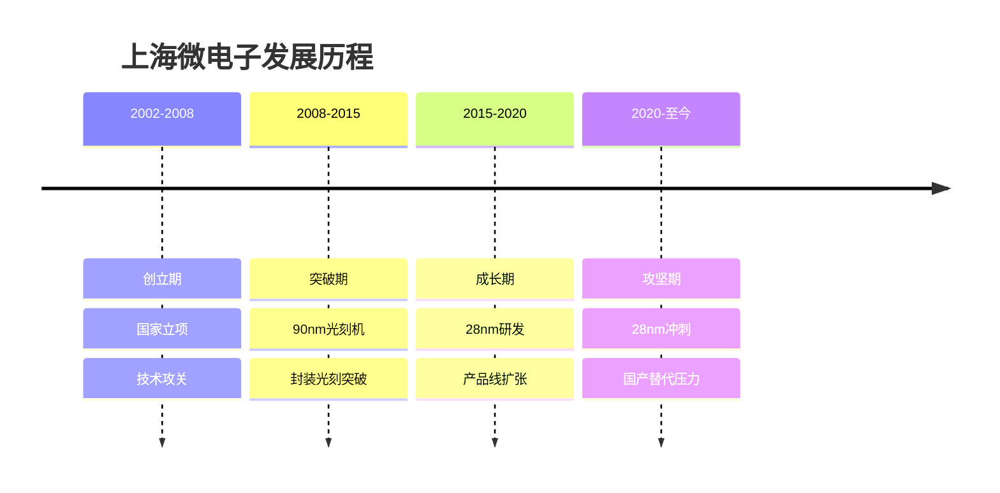
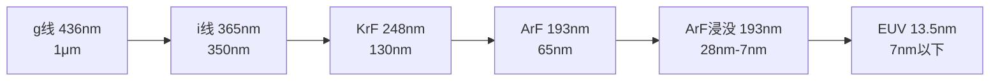
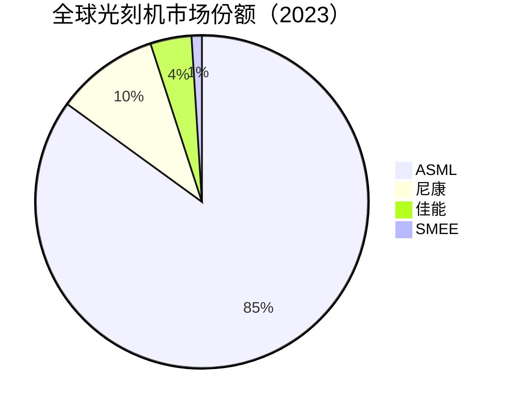
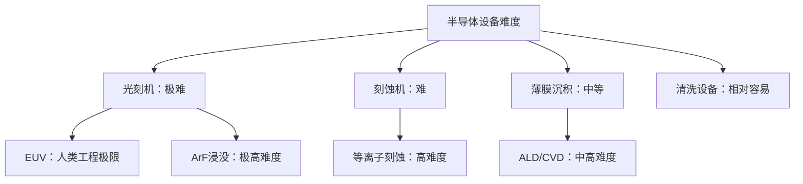

# 上海微电子：光刻机国产化的希望与现实

## 公司概况

### 基本信息

**公司名称**：上海微电子装备（集团）股份有限公司（Shanghai Micro Electronics Equipment, SMEE）
**股票代码**：未上市（国有企业）
**成立时间**：2002年
**总部位置**：中国上海
**实际控制人**：上海国资委

**业务范围**：
- 集成电路光刻机：核心业务
- 封装光刻机：后道封装
- 平板显示光刻机：FPD
- 其他：LED光刻、科研光刻

**战略地位**：
- 中国唯一：集成电路光刻机制造商
- 国家战略：半导体自主可控核心
- 技术象征：中国芯片制造能力标志

### 发展历程



**关键里程碑**：
- 2002年：公司成立，国家863计划支持
- 2008年：90nm光刻机研制成功
- 2012年：封装光刻机进入市场
- 2018年：SSA600/20光刻机（90nm）量产
- 2021年：28nm光刻机研发取得进展
- 2023年：28nm光刻机进入客户验证阶段

### 股权结构

**实际控制人**：
- 上海国资委：控股
- 国家大基金：参股
- 其他国资：参股

**战略意义**：
- 国家战略：光刻机自主可控
- 政策支持：国家重点项目
- 资金保障：国资+大基金

## 光刻机技术基础

### 光刻机工作原理

**基本原理**：
- 光源：产生特定波长光
- 掩模版：图案载体
- 投影镜头：缩小投影
- 晶圆台：精密定位
- 曝光：图案转移到光刻胶

**关键技术指标**：
- 分辨率：最小线宽（制程节点）
- 套刻精度：层间对准精度
- 产能：每小时曝光片数（WPH）
- 光源波长：决定分辨率上限

**分辨率公式**：
```
分辨率 = k1 × λ / NA
k1：工艺因子（0.25-0.5）
λ：光源波长
NA：数值孔径
```

### 光刻机技术代际



**各代技术对比**：

| 技术 | 波长 | 制程 | 代表厂商 | SMEE状态 |
|------|------|------|---------|---------|
| g线 | 436nm | 1μm+ | 尼康、佳能 | 已掌握 |
| i线 | 365nm | 350nm | 尼康、佳能 | 已掌握 |
| KrF | 248nm | 130nm | ASML、尼康 | 已掌握 |
| ArF干式 | 193nm | 65nm | ASML、尼康 | 研发中 |
| ArF浸没 | 193nm | 28nm | ASML | 攻关中 |
| EUV | 13.5nm | 7nm以下 | ASML独家 | 差距巨大 |

## 产品技术分析

### 1. 集成电路光刻机

**SSA600系列（主力产品）**：
- 技术：KrF（248nm）
- 制程：90nm
- 套刻精度：<30nm
- 产能：80片/小时（8寸）
- 应用：成熟工艺、特色工艺

**SSA800系列（在研）**：
- 技术：ArF干式（193nm）
- 制程：65nm
- 套刻精度：<20nm
- 产能：100片/小时
- 状态：研发阶段

**28nm光刻机（攻关）**：
- 技术：ArF浸没（193nm+水）
- 制程：28nm
- 套刻精度：<8nm
- 产能：目标150片/小时
- 状态：客户验证阶段（2023）

**技术差距分析**：
- SMEE最先进：28nm（验证中）
- ASML最先进：2nm（EUV量产）
- 差距：约2-3代（10-15年）
- 追赶难度：极高

### 2. 封装光刻机

**技术原理**：
- 后道封装：芯片封装工艺
- 精度要求：低于前道
- 应用：引线键合、倒装焊

**产品矩阵**：
- SSB系列：封装光刻
- 应用：先进封装、传统封装
- 市场份额：国内领先

**竞争地位**：
- 国内市场：主要供应商
- 技术：满足封装需求
- 客户：国内封装厂

**封装光刻优势**：
- 技术门槛：低于前道
- 国产化率：较高
- 市场地位：相对稳固

### 3. 平板显示光刻机

**技术原理**：
- FPD光刻：大尺寸基板
- 应用：LCD、OLED面板
- 精度要求：低于集成电路

**产品矩阵**：
- FPD系列：平板显示光刻
- 应用：LCD、OLED
- 市场份额：国内有一定份额

**竞争地位**：
- 国内市场：与尼康、佳能竞争
- 技术：满足主流FPD需求
- 客户：京东方、华星光电

### 4. 科研光刻机

**应用**：
- 高校、研究所
- 工艺研究、器件开发
- 小批量生产

**产品**：
- 小型光刻机
- 定制化产品
- 技术验证平台

## 技术差距深度分析

### 与ASML的差距

**ASML技术领先**：
- EUV光刻机：独家垄断
- 最先进制程：2nm量产
- 产能：每台每年产出数百万片
- 精度：套刻精度<2nm

**SMEE现状**：
- 最先进：28nm（验证中）
- 主力产品：90nm
- 产能：相对较低
- 精度：套刻精度<30nm（90nm机）

**差距量化**：

| 指标 | ASML（最先进） | SMEE（最先进） | 差距 |
|------|--------------|--------------|------|
| 制程 | 2nm | 28nm（验证） | 约3代 |
| 光源 | EUV 13.5nm | ArF浸没 193nm | 2代 |
| 套刻精度 | <2nm | <8nm（目标） | 4倍 |
| 产能 | 200+片/小时 | 目标150片/小时 | 差距明显 |
| 价格 | 1.5亿美元/台 | 约3000万美元/台 | 低5倍 |

### 技术瓶颈分析

**光源技术**：
- EUV光源：ASML+Cymer垄断
- ArF浸没：尼康、ASML掌握
- SMEE：KrF已掌握，ArF浸没攻关中
- 难点：光源功率、稳定性

**投影镜头**：
- 顶级镜头：蔡司（德国）垄断
- 精度要求：纳米级
- SMEE：自研+国产化
- 难点：超精密加工、镀膜

**精密运动台**：
- 顶级运动台：ASML自研
- 精度：纳米级定位
- SMEE：自研
- 难点：超精密机械、控制系统

**软件与算法**：
- 光刻仿真：复杂算法
- 套刻补偿：机器学习
- SMEE：持续积累
- 难点：工艺know-how

### 为什么光刻机这么难？

**系统复杂性**：
- 零部件：10万+个
- 精度：纳米级
- 集成：光学、机械、电子、软件
- 调试：极其复杂

**供应链依赖**：
- 蔡司镜头：德国
- Cymer光源：美国
- 精密零部件：全球供应链
- 出口管制：受限

**技术积累**：
- ASML：30年+积累
- 工艺know-how：不可复制
- 客户反馈：持续改进
- 人才：全球顶尖

**出口管制影响**：
- 美国：EUV、ArF浸没禁止出口中国
- 荷兰：跟随美国限制
- 日本：部分限制
- 影响：SMEE无法获得关键零部件

## 市场地位分析

### 全球光刻机市场

**市场规模**：
- 2023年：约200亿美元
- 年增长率：8-12%
- 2025E：250亿美元

**市场格局**：


**竞争格局**：
- 绝对垄断：ASML（EUV独家，ArF浸没主导）
- 第二梯队：尼康（ArF干式、KrF）
- 第三梯队：佳能（i线、KrF）
- 中国：SMEE（KrF、封装）

### SMEE市场地位

**全球排名**：
- 整体市场：第四（份额极小）
- KrF市场：有一定份额
- 封装光刻：国内领先
- 中国市场：唯一本土供应商

**中国市场份额**：
- 整体：<5%
- 封装光刻：30%+
- 成熟工艺（90nm+）：10%+
- 先进工艺（28nm以下）：0%

**客户结构**：
- 中芯国际：成熟工艺产线
- 华虹半导体：特色工艺
- 封装厂：长电科技、通富微电
- 科研院所：高校、研究所

## 发展前景分析

### 乐观情景

**28nm突破**：
- 时间：2024-2025年量产
- 影响：进入主流市场
- 客户：中芯国际、华虹
- 收入：大幅增长

**国产替代加速**：
- 政策支持：国家重点项目
- 客户需求：供应链安全
- 市场空间：中国光刻机市场100亿美元+
- 份额提升：从<5%到20%+

**技术路线**：
- 28nm：2024-2025量产
- 14nm：2027-2030研发
- 7nm：长期目标（EUV替代方案）

### 悲观情景

**技术瓶颈**：
- ArF浸没：技术难度极高
- 零部件：出口管制限制
- 良率：提升困难
- 产能：难以快速扩张

**竞争压力**：
- ASML：持续技术领先
- 尼康：成熟工艺竞争
- 出口管制：部分放松可能
- 客户：技术要求持续提升

**时间风险**：
- 28nm量产：可能延迟
- 14nm：遥遥无期
- EUV替代：技术路线不明
- 差距：可能扩大

### 现实情景（最可能）

**短期（2024-2026）**：
- 28nm：小批量量产
- 主力：90nm成熟工艺
- 封装光刻：稳定增长
- 收入：缓慢增长

**中期（2026-2030）**：
- 28nm：规模量产
- 14nm：研发突破
- 市场份额：从<5%到10-15%
- 收入：显著增长

**长期（2030+）**：
- 14nm：量产
- 7nm：技术路线探索
- 市场份额：15-25%（成熟工艺）
- 先进工艺：仍有差距

## 竞争对手分析

### ASML

**市场地位**：
- 全球第一：85%市场份额
- EUV独家：垄断最先进制程
- 客户：台积电、三星、英特尔

**竞争优势**：
- EUV技术：独家垄断
- 技术积累：30年+
- 供应链：全球最优
- 客户：全球顶级

**SMEE对比**：
- 技术差距：2-3代（10-15年）
- 市场份额：ASML 85倍
- 成本：SMEE更低
- 应用：不同市场（成熟vs先进）

### 尼康

**市场地位**：
- 全球第二：10%市场份额
- ArF干式：有一定份额
- 客户：中小晶圆厂

**竞争优势**：
- 技术积累：40年+
- ArF干式：成熟产品
- 客户：全球中小晶圆厂

**SMEE对比**：
- 技术差距：1-2代
- 市场份额：尼康 10倍
- 成本：SMEE更低
- 竞争：成熟工艺市场

### 佳能

**市场地位**：
- 全球第三：4%市场份额
- i线、KrF：成熟工艺
- 客户：成熟工艺晶圆厂

**竞争优势**：
- 技术积累：30年+
- 成熟工艺：稳定产品
- 成本：相对合理

**SMEE对比**：
- 技术差距：1代
- 市场份额：佳能 4倍
- 成本：SMEE更低
- 竞争：直接竞争（KrF市场）

## 投资价值评估

### 投资特殊性

**未上市公司**：
- SMEE目前未上市
- 国有企业：上市计划不明确
- 投资方式：间接投资（供应链）
- 直接投资：暂不可行

**间接投资路径**：
- 光刻机零部件：国产化受益
- 光刻胶：配套材料
- 光刻机维护：服务商
- 晶圆厂：使用SMEE设备

### 战略价值评估

**国家战略价值**：
- 极高：光刻机是芯片制造核心
- 政策支持：持续加大
- 资金投入：国家级别
- 人才：全国最优秀

**商业价值**：
- 当前：有限（技术差距大）
- 中期：逐步提升（28nm量产）
- 长期：显著（14nm突破）
- 不确定性：极高

**技术价值**：
- 积累：20年+
- 突破：28nm接近量产
- 路径：清晰但艰难
- 意义：中国半导体自主可控

### 相关上市公司投资机会

**光刻机零部件国产化**：

| 公司 | 业务 | 受益逻辑 |
|------|------|---------|
| 炬光科技 | 激光光源 | 光刻光源国产化 |
| 腾景科技 | 光学元件 | 光学零部件 |
| 至纯科技 | 超纯水 | 光刻配套 |
| 晶盛机电 | 石英部件 | 光刻零部件 |

**光刻胶**：

| 公司 | 业务 | 受益逻辑 |
|------|------|---------|
| 南大光电 | ArF光刻胶 | 配套SMEE |
| 彤程新材 | KrF光刻胶 | 配套SMEE |
| 华懋科技 | 光刻胶材料 | 配套SMEE |

## 政策与监管分析

### 国家政策支持

**大基金支持**：
- 大基金一期：参股SMEE
- 大基金二期：持续支持
- 资金规模：数十亿人民币
- 战略意图：光刻机自主可控

**科技政策**：
- 863计划：早期支持
- 重大专项：持续投入
- 科创板：未来上市路径
- 税收优惠：高新技术企业

**产业政策**：
- 半导体自主可控：国家战略
- 光刻机：重中之重
- 人才引进：全球招募
- 产业链配套：协同发展

### 出口管制影响

**美国限制**：
- EUV光刻机：禁止出口中国
- ArF浸没：2023年起限制
- 零部件：部分限制
- 影响：SMEE研发受阻

**荷兰限制**：
- 跟随美国：2023年起
- ASML：限制对华出口
- 影响：无法购买先进设备

**应对策略**：
- 零部件国产化：加速推进
- 替代技术路线：探索
- 国际合作：有限空间
- 自主研发：唯一出路

## 技术路线展望

### 短期路线（2024-2026）

**28nm量产**：
- 目标：2024-2025年
- 技术：ArF浸没
- 挑战：良率、产能
- 意义：重大突破

**90nm扩产**：
- 目标：扩大产能
- 应用：成熟工艺
- 客户：中芯、华虹
- 收入：稳定增长

### 中期路线（2026-2030）

**14nm研发**：
- 技术：多重曝光+ArF浸没
- 挑战：极高
- 时间：2028-2030
- 意义：进入主流先进工艺

**EUV替代探索**：
- 技术路线：多重曝光（SAQP）
- 原理：用多次曝光替代EUV
- 局限：成本高、效率低
- 可行性：有限

### 长期路线（2030+）

**自主EUV**：
- 技术难度：极高
- 时间：2030年以后
- 可能性：低
- 替代方案：多重曝光

**新型光刻技术**：
- 纳米压印：NIL
- 电子束：EBL
- 应用：特定场景
- 局限：产能低

## 常见问题

### Q1：SMEE能追上ASML吗？

**回答**：
- 短期（5年）：不可能
- 中期（10年）：缩小差距，但仍有2代差距
- 长期（20年）：部分领域有机会（成熟工艺）
- EUV：极难追上，ASML垄断地位稳固
- 现实：SMEE的目标是满足中国成熟工艺需求

### Q2：28nm光刻机什么时候能量产？

**回答**：
- 官方：2024-2025年
- 现实：可能延迟至2025-2026年
- 挑战：良率提升、产能爬坡
- 意义：重大里程碑
- 影响：中芯国际、华虹等客户

### Q3：出口管制对SMEE影响多大？

**回答**：
- 影响巨大：关键零部件受限
- 蔡司镜头：德国，受美国压力
- Cymer光源：美国，直接禁止
- 应对：国产化替代，但难度极高
- 结论：出口管制是SMEE最大挑战

### Q4：如何投资SMEE相关机会？

**回答**：
- SMEE未上市：无法直接投资
- 间接投资：光刻机零部件（炬光科技、腾景科技）
- 光刻胶：南大光电、彤程新材
- 晶圆厂：中芯国际（使用SMEE设备）
- 策略：布局国产替代产业链

### Q5：SMEE的封装光刻机怎么样？

**回答**：
- 相对成熟：技术门槛低于前道
- 市场份额：国内30%+
- 竞争：与尼康、佳能竞争
- 盈利：封装光刻是主要收入来源
- 前景：稳定增长，先进封装带来新机会

### Q6：多重曝光能替代EUV吗？

**回答**：
- 部分替代：可以实现7nm图案
- 成本：极高（多次曝光）
- 效率：低（产能下降50%+）
- 良率：挑战大
- 结论：可行但不经济，是无奈之举

## 行业对比：光刻机 vs 其他设备

### 为什么光刻机最难？

**技术复杂度**：


**国产化进度对比**：

| 设备 | 国产化率 | 代表公司 | 技术差距 |
|------|---------|---------|---------|
| 清洗设备 | 20%+ | 盛美上海 | 1-2代 |
| 刻蚀机 | 15%+ | 中微公司 | 1-2代 |
| 薄膜沉积 | 15%+ | 北方华创 | 2代 |
| 光刻机 | <5% | SMEE | 2-3代 |
| EUV光刻机 | 0% | 无 | 无法估计 |

**结论**：光刻机是半导体设备国产化最难的环节，SMEE的突破意义重大但道路漫长。

## 参考文献

1. 上海微电子. 《公司介绍》. 2023
2. SEMI. 《全球光刻机市场报告》. 2023
3. IC Insights. 《光刻设备市场研究》. 2023
4. ASML. 《Annual Report》. 2023
5. 中金公司. 《光刻机行业深度报告》. 2023
6. 招商证券. 《半导体设备国产化研究》. 2023
7. 天风证券. 《光刻机技术分析》. 2023
8. 克里斯·米勒. 《芯片战争》. 2022
9. 尼康. 《Annual Report》. 2023
10. 中国半导体行业协会. 《行业统计数据》. 2023
11. 科技部. 《重大专项进展报告》. 2023
12. 国家大基金. 《投资组合》. 2023

---

**核心结论**：
上海微电子是中国光刻机国产化的唯一希望，战略意义极高。28nm光刻机接近量产是重大里程碑，但与ASML的差距仍有2-3代（10-15年）。出口管制是最大挑战，零部件国产化是关键。SMEE未上市，投资者可通过光刻机零部件（炬光科技、腾景科技）、光刻胶（南大光电、彤程新材）等间接布局。光刻机国产化是一场持久战，需要长期耐心和持续投入，短期内无法实现对ASML的追赶，但在成熟工艺领域（28nm-90nm）有望逐步提升市场份额。

**风险提示**：
光刻机技术极其复杂，28nm量产时间存在不确定性；出口管制持续收紧，关键零部件国产化难度大；与ASML技术差距可能扩大而非缩小；EUV技术短期内无法突破；国产替代进度可能低于预期。投资相关标的需充分考虑技术风险、政策风险和市场风险。

---

[← 返回半导体行业](index.html)
