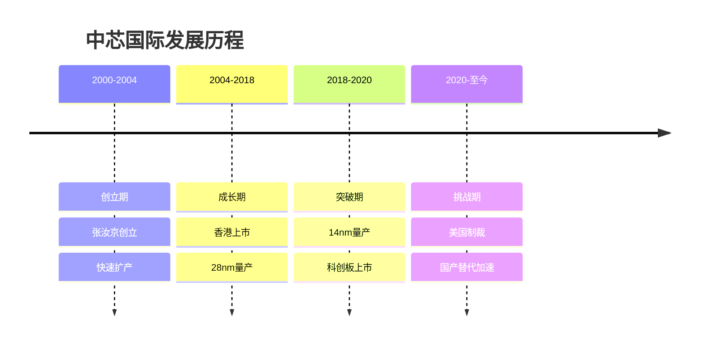
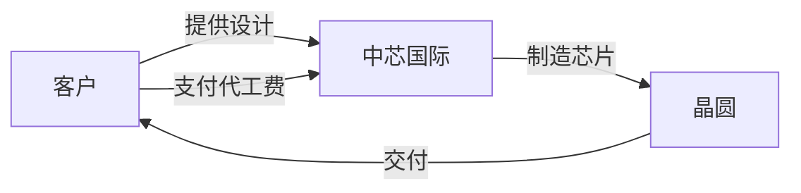
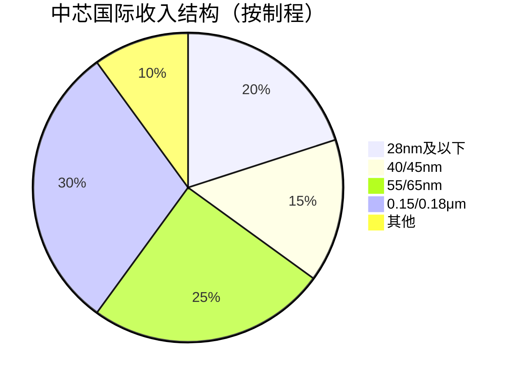

# 中芯国际：中国晶圆代工龙头

## 公司概况

### 基本信息

**公司名称**：中芯国际集成电路制造有限公司（SMIC）
**股票代码**：00981.HK（港股）、688981.SH（科创板）
**成立时间**：2000年4月
**总部位置**：中国上海
**创始人**：张汝京

**业务范围**：
- 晶圆代工：逻辑芯片、模拟芯片、混合信号芯片
- 制程覆盖：0.35微米至14纳米
- 应用领域：通信、消费电子、汽车、工业、计算机

**市值规模**（2023）：
- A股市值：约3000亿人民币
- H股市值：约2000亿港元
- 中国最大晶圆代工厂

### 发展历程

**关键里程碑**：
- 2000年：公司成立
- 2004年：香港上市、纽约上市
- 2015年：28nm量产
- 2019年：14nm量产
- 2020年：科创板上市，募资532亿
- 2020年：被美国列入实体清单
- 2023年：14nm产能持续扩张

## 商业模式分析

### 晶圆代工模式

**纯代工模式**：
- 不设计芯片
- 只提供制造服务
- 客户提供设计
- 按订单生产

**收入模式**：

**定价模式**：
- 按晶圆计价：每片晶圆价格
- 制程越先进，价格越高
- 产能利用率影响价格

### 业务结构

**按制程分类**：

**按应用分类**：
- 通信：35%
- 消费电子：30%
- 汽车电子：15%
- 工业：10%
- 计算机：10%

**按客户分类**：
- 中国客户：70%+
- 海外客户：30%
- 前五大客户：40%

## 技术能力分析

### 制程能力

**当前制程**：
- 14nm：量产，产能扩张中
- 28nm：成熟量产
- 40/45nm：成熟量产
- 55/65nm：成熟量产
- 0.15/0.18μm：成熟量产

**技术对比**：

| 公司 | 最先进制程 | 量产时间 | 技术差距 |
|------|----------|---------|---------|
| 台积电 | 3nm | 2022 | 领先 |
| 三星 | 3nm | 2022 | 领先 |
| 中芯国际 | 14nm | 2019 | 落后2-3代 |
| 华虹半导体 | 55nm | - | 落后3-4代 |

**技术突破**：
- 14nm FinFET：2019年量产
- 7nm：研发中，受设备限制
- N+1/N+2：类7nm工艺，绕过限制

### 产能布局

**晶圆产能**：
- 8寸晶圆：约45万片/月
- 12寸晶圆：约70万片/月
- 总产能：全球第五

**产能分布**：
- 上海：主要产能
- 北京：12寸厂
- 天津：8寸厂
- 深圳：12寸厂（在建）

**扩产计划**：
- 2023-2025年：新增12寸产能30万片/月
- 投资规模：数百亿美元
- 重点：成熟制程

## 竞争优势分析

### 1. 国产替代受益

**政策支持**：
- 大基金投资：持股15%+
- 税收优惠：研发费用加计扣除
- 采购倾斜：国产芯片优先

**市场需求**：
- 中国芯片市场：全球最大
- 自给率低：30%
- 替代空间：巨大

**客户粘性**：
- 供应链安全：客户主动转单
- 本地化服务：响应快
- 定制化：满足特殊需求

### 2. 成熟制程优势

**成熟制程需求**：
- 汽车电子：40/55nm
- 工业控制：55/65nm
- 消费电子：28/40nm
- 需求稳定，利润率高

**产能优势**：
- 成熟制程产能充足
- 产能利用率高
- 规模效应显现

### 3. 技术积累

**研发投入**：
- 研发费用率：15%+
- 研发人员：5000+
- 专利数量：10000+

**技术平台**：
- 多种制程平台
- 特色工艺：BCD、eFlash
- 技术服务：设计支持

## 财务分析

### 收入分析

**收入增长**：
- 2018年：230亿人民币
- 2020年：275亿人民币
- 2022年：550亿人民币
- 2023E：600亿人民币
- CAGR：20%+

**收入驱动**：
- 产能扩张：新增产能投产
- 产能利用率：接近100%
- 价格提升：供需紧张
- 国产替代：客户转单

### 盈利能力

**利润率**：
- 毛利率：20-30%
- 经营利润率：10-20%
- 净利率：10-15%

**ROE**：
- 2022年：15%
- 2023E：12%
- 目标：15%+

**盈利驱动**：
- 规模效应：产能扩大
- 产品结构：先进制程占比提升
- 成本控制：折旧、材料

### 现金流

**经营现金流**：
- 2022年：200亿+
- 2023E：250亿+
- 现金流稳定

**资本支出**：
- 年资本支出：200-300亿
- 主要用于：产能扩张、设备采购
- 资本密集型

**现金储备**：
- 现金及等价物：300亿+
- 融资能力：强（大基金、政府支持）

### 财务健康度

**资产负债表**：
- 资产负债率：50-60%
- 流动比率：1.5
- 速动比率：1.2

**偿债能力**：
- 利息覆盖倍数：5-10倍
- 债务/EBITDA：2-3倍
- 财务风险：可控

## 投资价值评估

### 估值分析

**历史估值区间**：
- PE：20-60倍
- PS：3-8倍
- PB：2-5倍

**当前估值（2023）**：
- PE：约30倍
- PS：约5倍
- PB：约3倍

**估值对比**：

| 公司 | PE | PS | PB | 市值（亿美元） |
|------|----|----|----|--------------| 
| 中芯国际 | 30 | 5 | 3 | 400 |
| 台积电 | 18 | 7 | 5 | 5000 |
| 联电 | 12 | 2 | 2 | 200 |
| 格芯 | 负 | 3 | 1 | 300 |

### 投资论点

**看多理由**：
1. **国产替代**：受益于国产替代加速
2. **产能扩张**：新增产能投产，收入增长
3. **成熟制程**：需求稳定，利润率高
4. **政策支持**：大基金、税收优惠
5. **技术突破**：14nm量产，7nm研发
6. **估值合理**：PE 30倍，相对合理

**看空理由**：
1. **技术差距**：落后台积电2-3代
2. **设备限制**：美国制裁，先进设备难获取
3. **竞争加剧**：台积电、三星竞争
4. **资本支出大**：持续大额投资
5. **盈利波动**：半导体周期性强

### 投资建议

**适合投资者**：
- 看好国产替代的投资者
- 能承受波动的长期投资者
- 关注半导体行业的投资者

**投资策略**：
- 建仓区间：40-50元（A股）
- 持有周期：3-5年
- 目标价：80元+
- 止损位：30元

**风险控制**：
- 仓位：不超过15%
- 关注：政策变化、技术进展
- 调整：根据业绩动态调整

## 投资启示

### 1. 国产替代的价值

**供应链安全**：
- 客户主动转单
- 长期合作关系
- 市场份额提升

### 2. 成熟制程的机会

**稳定需求**：
- 汽车、工业需求稳定
- 利润率高
- 竞争相对缓和

### 3. 技术突破的重要性

**持续研发**：
- 14nm量产
- 7nm研发
- 缩小技术差距

### 4. 资本密集型特点

**大额投资**：
- 产能扩张需要大量资金
- 折旧压力大
- 需要持续融资

## 常见问题

### Q1：中芯国际能追上台积电吗？

**回答**：
- 短期：不可能
- 中期：成熟制程可以
- 长期：先进制程困难
- 关键：设备获取

### Q2：美国制裁影响有多大？

**回答**：
- 先进制程：严重影响
- 成熟制程：影响有限
- 应对：国产设备、特色工艺
- 长期：不确定性高

### Q3：什么时候买入中芯国际？

**回答**：
- 估值：PE < 25倍
- 股价：40-50元（A股）
- 时机：政策催化、业绩超预期
- 策略：分批建仓

## 延伸阅读

### 推荐书籍

1. **《芯片战争》** - 克里斯·米勒
2. **《芯片简史》** - 汪波
3. **《半导体制造技术》** - 迈克尔·夸克

### 研究报告

- 中芯国际年报和季报
- 各大券商中芯国际深度报告
- 半导体行业研究报告

## 参考文献

1. 中芯国际. 《年度报告》. 2018-2023
2. 克里斯·米勒. 《芯片战争》. 2022
3. 中金公司. 《中芯国际深度报告》. 2023
4. 招商证券. 《中芯国际投资价值分析》. 2023
5. 天风证券. 《晶圆代工行业研究》. 2023
6. 华泰证券. 《中芯国际产能分析》. 2023
7. IC Insights. 《全球晶圆代工市场报告》. 2023
8. SEMI. 《中国半导体设备市场报告》. 2023
9. Gartner. 《全球半导体市场预测》. 2023
10. TrendForce. 《晶圆代工产能分析》. 2023

---

**投资建议**：
中芯国际是中国晶圆代工龙头，受益于国产替代加速，产能持续扩张，成熟制程需求稳定。当前估值PE 30倍，处于合理区间。建议看好国产替代的投资者在40-50元（A股）区间分批建仓，持有3-5年，目标价80元+。

**风险提示**：
需要关注美国制裁影响、技术突破不确定性、半导体周期性、资本支出压力等风险。建议仓位控制在15%以内，设置止损位30元，密切跟踪政策和技术进展。

## 深度分析

### 核心机制解析

理解本主题需要从多个维度进行系统性分析。以下从理论基础、实践应用和历史验证三个层面展开深度探讨。

**理论基础层面**：本主题的核心逻辑建立在经济学和金融学的基本原理之上。通过对基础理论的深入理解，投资者能够建立起稳固的分析框架，避免被市场短期噪音所干扰。

**实践应用层面**：理论必须与实践相结合才能产生价值。在实际投资决策中，需要将抽象的概念转化为具体的分析工具和决策标准。

**历史验证层面**：金融市场有着丰富的历史记录，通过研究历史案例，我们可以验证理论的有效性，并从中提炼出具有普遍意义的规律。

### 关键影响因素

影响本主题的关键因素可以从以下几个维度进行分析：

1. **宏观经济环境**：利率水平、通货膨胀率、经济增长速度等宏观变量对本主题有着深远影响。在不同的宏观经济周期中，相关指标的表现会呈现出显著差异。

2. **市场结构因素**：市场参与者的构成、信息传播机制、流动性状况等市场结构因素决定了价格发现的效率和准确性。

3. **政策监管环境**：政府政策、监管框架的变化会直接影响相关市场的运作规则和参与者行为。

4. **技术创新驱动**：技术进步不断改变着金融市场的运作方式，从算法交易到区块链技术，每一次技术革新都带来新的机遇和挑战。

5. **全球化与地缘政治**：在全球化背景下，各国市场之间的联动性日益增强，地缘政治风险的影响也越来越不可忽视。

### 量化分析框架

为了更精确地分析和评估，可以采用以下量化框架：

| 分析维度 | 关键指标 | 参考基准 | 分析方法 |
|---------|---------|---------|---------|
| 规模评估 | 绝对值与相对值 | 历史均值 | 趋势分析 |
| 质量评估 | 稳定性指标 | 行业对标 | 横向比较 |
| 风险评估 | 波动率指标 | 风险阈值 | 情景分析 |
| 价值评估 | 估值倍数 | 历史区间 | 回归分析 |

通过系统性地应用上述框架，投资者可以对目标进行全面、客观的评估，从而做出更加理性的投资决策。

## 高级分析与前沿研究

### 学术研究进展

近年来，学术界对本领域的研究取得了重要进展。以下是几个值得关注的研究方向：

**行为金融学视角**：传统金融理论假设市场参与者是完全理性的，但行为金融学的研究表明，认知偏差和情绪因素在投资决策中扮演着重要角色。诺贝尔经济学奖得主丹尼尔·卡尼曼（Daniel Kahneman）和理查德·塞勒（Richard Thaler）的研究为我们理解市场非理性行为提供了重要框架。

**因子投资研究**：尤金·法玛（Eugene Fama）和肯尼斯·弗伦奇（Kenneth French）的三因子模型，以及后续发展的五因子模型，为系统性地解释股票收益差异提供了理论基础。这些研究表明，市值、账面市值比、盈利能力和投资模式等因子能够解释大部分股票收益的横截面差异。

**市场微观结构研究**：对市场流动性、价格发现机制和交易成本的深入研究，帮助我们更好地理解市场的运作机制，并为优化交易策略提供指导。

### 实战案例深度解析

**案例一：长期价值创造的典范**

以沃伦·巴菲特（Warren Buffett）的伯克希尔·哈撒韦（Berkshire Hathaway）为例，其长达数十年的卓越投资业绩证明了价值投资理念的有效性。从1965年至今，伯克希尔的账面价值年均增长率约为19.8%，远超同期标普500指数的约10.2%年均回报。

巴菲特的成功秘诀在于：
- 专注于具有持久竞争优势的优质企业
- 以合理价格买入，而非追求最低价格
- 长期持有，让复利效应充分发挥
- 保持充足的安全边际，控制下行风险

**案例二：危机中的机遇识别**

2008年金融危机期间，大多数投资者恐慌性抛售，但少数具有前瞻性的投资者却在危机中发现了历史性的投资机会。约翰·保尔森（John Paulson）通过做空次级抵押贷款相关证券，在危机中获得了约150亿美元的利润，成为金融史上最成功的单笔交易之一。

这个案例告诉我们：
- 深入的基本面研究能够发现市场定价错误
- 逆向思维往往能够发现被市场忽视的机会
- 风险管理和仓位控制是成功的关键

### 跨市场比较分析

不同市场在结构、监管、投资者构成等方面存在显著差异，这些差异对投资策略的选择有重要影响：

**美国市场特征**：
- 机构投资者主导，市场效率较高
- 信息披露制度完善，分析师覆盖广泛
- 衍生品市场发达，对冲工具丰富
- 长期牛市历史，但也经历过多次重大调整

**中国市场特征**：
- 散户投资者比例较高，市场波动性较大
- 政策因素影响显著，需要密切关注监管动向
- 新兴行业发展迅速，成长投资机会丰富
- A股、港股、美股中概股形成多层次市场体系

**欧洲市场特征**：
- 价值股比例较高，估值相对保守
- 受地缘政治和欧元区政策影响较大
- 部分行业（如奢侈品、工业）具有全球竞争优势
- ESG投资理念推广较为领先

